# 模型提供商插件

<cite>
**本文引用的文件**
- [plugins/model-providers/README.md](file://plugins/model-providers/README.md)
- [providers/base.py](file://providers/base.py)
- [plugins/model-providers/openrouter/__init__.py](file://plugins/model-providers/openrouter/__init__.py)
- [plugins/model-providers/anthropic/__init__.py](file://plugins/model-providers/anthropic/__init__.py)
- [plugins/model-providers/gemini/__init__.py](file://plugins/model-providers/gemini/__init__.py)
- [agent/plugin_llm.py](file://agent/plugin_llm.py)
- [agent/auxiliary_client.py](file://agent/auxiliary_client.py)
- [agent/credential_pool.py](file://agent/credential_pool.py)
- [agent/credits_tracker.py](file://agent/credits_tracker.py)
- [agent/rate_limit_tracker.py](file://agent/rate_limit_tracker.py)
</cite>

## 目录
1. [简介](#简介)
2. [项目结构](#项目结构)
3. [核心组件](#核心组件)
4. [架构总览](#架构总览)
5. [详细组件分析](#详细组件分析)
6. [依赖关系分析](#依赖关系分析)
7. [性能考量](#性能考量)
8. [故障排查指南](#故障排查指南)
9. [结论](#结论)
10. [附录](#附录)

## 简介
本指南面向希望在系统中新增或扩展“模型提供商插件”的开发者，围绕以下目标展开：如何基于统一的 ProviderProfile 接口开发适配器、如何处理认证与路由、如何实现模型列表获取与参数映射、如何进行响应解析与兼容性处理、如何进行配置管理（含 API 密钥、速率限制、错误重试）、如何进行性能监控（延迟、成本、用量）以及如何进行测试与部署维护。

## 项目结构
模型提供商插件采用“目录即插件档案”的组织方式，每个子目录代表一个自包含的 ProviderProfile，通过注册机制被发现与加载。插件目录与清单文件遵循固定布局，便于自动发现与覆盖。

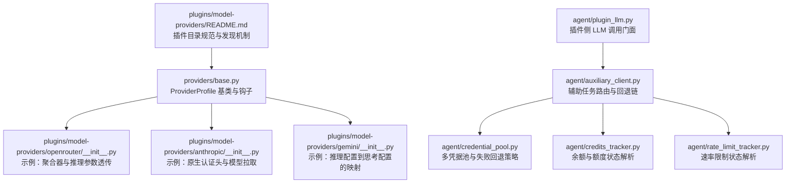

**图表来源**
- [plugins/model-providers/README.md:1-71](file://plugins/model-providers/README.md#L1-L71)
- [providers/base.py:38-218](file://providers/base.py#L38-L218)
- [plugins/model-providers/openrouter/__init__.py:47-189](file://plugins/model-providers/openrouter/__init__.py#L47-L189)
- [plugins/model-providers/anthropic/__init__.py:13-54](file://plugins/model-providers/anthropic/__init__.py#L13-L54)
- [plugins/model-providers/gemini/__init__.py:19-73](file://plugins/model-providers/gemini/__init__.py#L19-L73)
- [agent/plugin_llm.py:598-800](file://agent/plugin_llm.py#L598-L800)
- [agent/auxiliary_client.py:1-200](file://agent/auxiliary_client.py#L1-L200)
- [agent/credential_pool.py:1-200](file://agent/credential_pool.py#L1-L200)
- [agent/credits_tracker.py:1-200](file://agent/credits_tracker.py#L1-L200)
- [agent/rate_limit_tracker.py:1-100](file://agent/rate_limit_tracker.py#L1-L100)

**章节来源**
- [plugins/model-providers/README.md:1-71](file://plugins/model-providers/README.md#L1-L71)

## 核心组件
- ProviderProfile（基类与钩子）
  - 提供身份、认证、端点、视觉支持、模型目录、客户端与请求级“quirks”等声明式能力。
  - 支持 fetch_models、prepare_messages、build_extra_body、build_api_kwargs_extras、get_max_tokens 等可覆写的钩子。
- 具体 ProviderProfile 实现
  - OpenRouter：聚合器，负责推理配置透传与会话路由参数注入。
  - Anthropic：原生 API，自定义头部与模型列表拉取。
  - Gemini：将推理配置翻译为思考配置，兼容 OpenAI 兼容路径与原生路径。
- 插件侧 LLM 访问门面
  - PluginLlm：为受信插件提供安全可控的 LLM 调用入口，支持同步/异步、结构化输出、信任策略与审计字段。
- 辅助任务路由与凭据管理
  - auxiliary_client：自动检测主模型、回退链与支付耗尽时的自动切换。
  - credential_pool：多凭据轮转、冷却时间与状态管理。
- 性能与账单监控
  - credits_tracker：解析 Nous 余额与额度相关响应头，生成状态与通知。
  - rate_limit_tracker：解析速率限制相关响应头，生成可视化状态与告警。

**章节来源**
- [providers/base.py:38-218](file://providers/base.py#L38-L218)
- [plugins/model-providers/openrouter/__init__.py:47-189](file://plugins/model-providers/openrouter/__init__.py#L47-L189)
- [plugins/model-providers/anthropic/__init__.py:13-54](file://plugins/model-providers/anthropic/__init__.py#L13-L54)
- [plugins/model-providers/gemini/__init__.py:19-73](file://plugins/model-providers/gemini/__init__.py#L19-L73)
- [agent/plugin_llm.py:598-800](file://agent/plugin_llm.py#L598-L800)
- [agent/auxiliary_client.py:1-200](file://agent/auxiliary_client.py#L1-L200)
- [agent/credential_pool.py:1-200](file://agent/credential_pool.py#L1-L200)
- [agent/credits_tracker.py:1-200](file://agent/credits_tracker.py#L1-L200)
- [agent/rate_limit_tracker.py:1-100](file://agent/rate_limit_tracker.py#L1-L100)

## 架构总览
下图展示了从插件发起调用到最终响应返回的关键路径，以及凭据池、回退链与监控模块的协作关系。

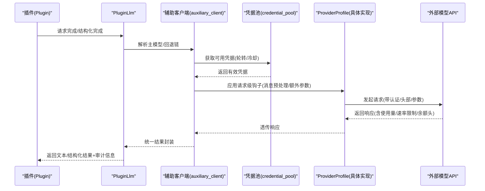

**图表来源**
- [agent/plugin_llm.py:620-773](file://agent/plugin_llm.py#L620-L773)
- [agent/auxiliary_client.py:165-183](file://agent/auxiliary_client.py#L165-L183)
- [agent/credential_pool.py:129-200](file://agent/credential_pool.py#L129-L200)
- [providers/base.py:111-146](file://providers/base.py#L111-L146)

## 详细组件分析

### ProviderProfile 接口与钩子
- 关键字段
  - 身份与别名、显示名称、描述、注册链接
  - 认证类型、环境变量、基础 URL、模型端点、健康检查开关
  - 视觉支持、备用模型列表、主机名派生
  - 默认请求头、温度/最大令牌默认值、辅助模型
- 可覆写钩子
  - prepare_messages：消息预处理
  - build_extra_body：构建额外请求体
  - build_api_kwargs_extras：推理配置拆分至 extra_body/top-level 参数
  - get_max_tokens：按模型设置默认最大输出令牌
  - fetch_models：拉取模型列表（支持显式 models_url、用户覆盖 base_url）

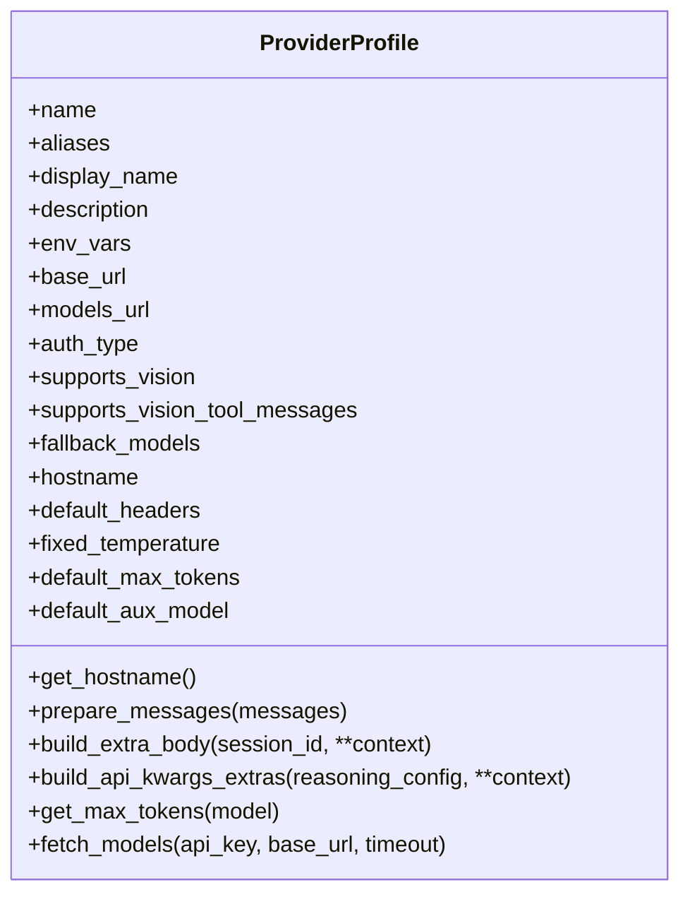

**图表来源**
- [providers/base.py:38-218](file://providers/base.py#L38-L218)

**章节来源**
- [providers/base.py:38-218](file://providers/base.py#L38-L218)

### OpenRouter ProviderProfile
- 特性
  - 使用公共目录无需鉴权；缓存目录结果以减少重复请求
  - 将推理配置透传为 extra_body.reasoning
  - 对特定模型（如 xAI Grok）附加会话级头部以绑定后端
  - 针对“推理强制”的 Claude 模型，避免发送禁用推理的字段，改用 verbosity 映射 effort
- 关键钩子
  - fetch_models：公共目录直连
  - build_extra_body：注入 session_id、provider 偏好、特定模型的 plugins 参数
  - build_api_kwargs_extras：推理配置透传与头部注入

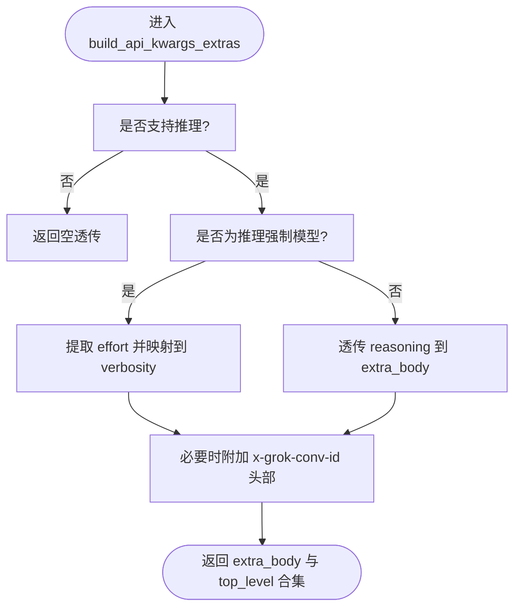

**图表来源**
- [plugins/model-providers/openrouter/__init__.py:104-167](file://plugins/model-providers/openrouter/__init__.py#L104-L167)

**章节来源**
- [plugins/model-providers/openrouter/__init__.py:47-189](file://plugins/model-providers/openrouter/__init__.py#L47-L189)

### Anthropic ProviderProfile
- 特性
  - 自定义头部（x-api-key）与版本头（anthropic-version）
  - 拉取模型列表时使用固定端点与认证头
- 关键钩子
  - fetch_models：直接访问官方模型端点

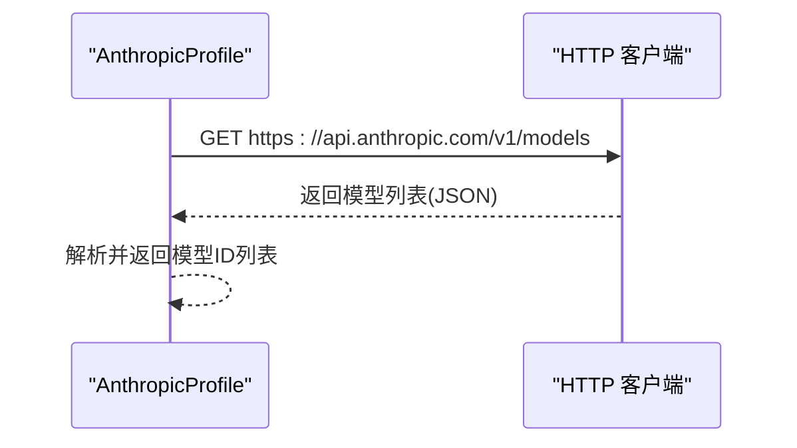

**图表来源**
- [plugins/model-providers/anthropic/__init__.py:16-40](file://plugins/model-providers/anthropic/__init__.py#L16-L40)

**章节来源**
- [plugins/model-providers/anthropic/__init__.py:13-54](file://plugins/model-providers/anthropic/__init__.py#L13-L54)

### Gemini ProviderProfile
- 特性
  - 将推理配置翻译为思考配置（thinking_config），兼容 OpenAI 兼容路径与原生路径
  - 通过工具函数判断是否为 OpenAI 兼容基地址，并进行 snake_case 化
- 关键钩子
  - build_extra_body：根据模型与基地址决定注入位置（extra_body 或嵌套 google 字段）

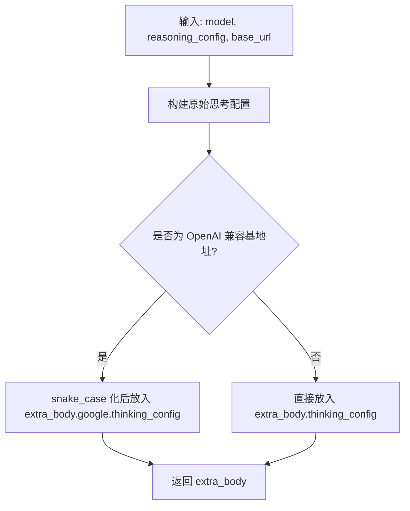

**图表来源**
- [plugins/model-providers/gemini/__init__.py:22-49](file://plugins/model-providers/gemini/__init__.py#L22-L49)

**章节来源**
- [plugins/model-providers/gemini/__init__.py:19-73](file://plugins/model-providers/gemini/__init__.py#L19-L73)

### 插件侧 LLM 访问门面（PluginLlm）
- 功能
  - 提供同步/异步 completion 与结构化输出接口
  - 严格的信任策略：允许/禁止覆盖 provider/model/agent/profile，并支持白名单
  - 输入归一化、结构化消息构建、JSON 模式解析与校验
  - 输出抽取文本、使用量与审计字段
- 关键流程
  - 读取信任策略并校验覆盖请求
  - 构建消息与额外参数（由 ProviderProfile 钩子参与）
  - 调用宿主内部路由，统一抽取结果并封装

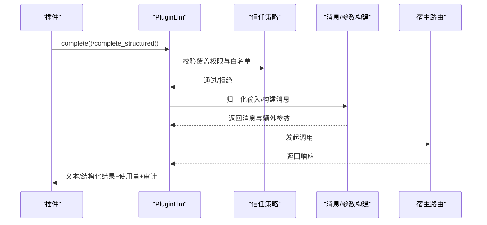

**图表来源**
- [agent/plugin_llm.py:620-773](file://agent/plugin_llm.py#L620-L773)
- [agent/plugin_llm.py:253-329](file://agent/plugin_llm.py#L253-L329)
- [agent/plugin_llm.py:374-436](file://agent/plugin_llm.py#L374-L436)

**章节来源**
- [agent/plugin_llm.py:598-800](file://agent/plugin_llm.py#L598-L800)

### 辅助任务路由与回退链（auxiliary_client）
- 自动检测主模型与回退链（文本/视觉任务）
- 支付耗尽自动切换下一个可用提供商
- 提供别名映射与“main/custom”解析

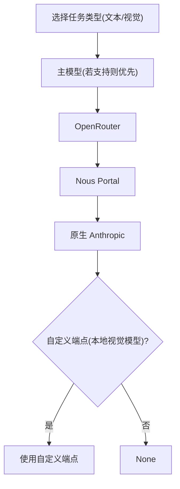

**图表来源**
- [agent/auxiliary_client.py:7-41](file://agent/auxiliary_client.py#L7-L41)
- [agent/auxiliary_client.py:165-183](file://agent/auxiliary_client.py#L165-L183)

**章节来源**
- [agent/auxiliary_client.py:1-200](file://agent/auxiliary_client.py#L1-L200)

### 凭据池与失败回退（credential_pool）
- 多凭据轮转策略（填充优先/轮询/随机/最少使用）
- 冷却时间：401（5 分钟）、429/402（1 小时）或其他默认
- 死亡凭据标记与清理策略
- 自定义端点池键前缀

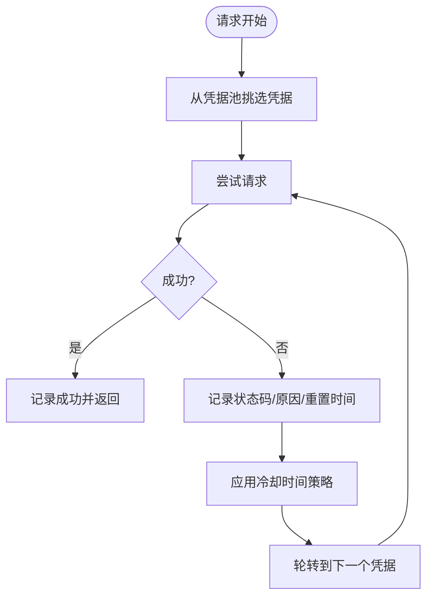

**图表来源**
- [agent/credential_pool.py:107-114](file://agent/credential_pool.py#L107-L114)
- [agent/credential_pool.py:129-200](file://agent/credential_pool.py#L129-L200)

**章节来源**
- [agent/credential_pool.py:1-200](file://agent/credential_pool.py#L1-L200)

### 余额与额度监控（credits_tracker）
- 解析 x-nous-credits-* 与 x-nous-tool-pool-* 响应头，生成 CreditsState
- 使用率带状告警、耗尽状态抑制（免费模型）、恢复提示
- 开发夹具用于测试不同状态

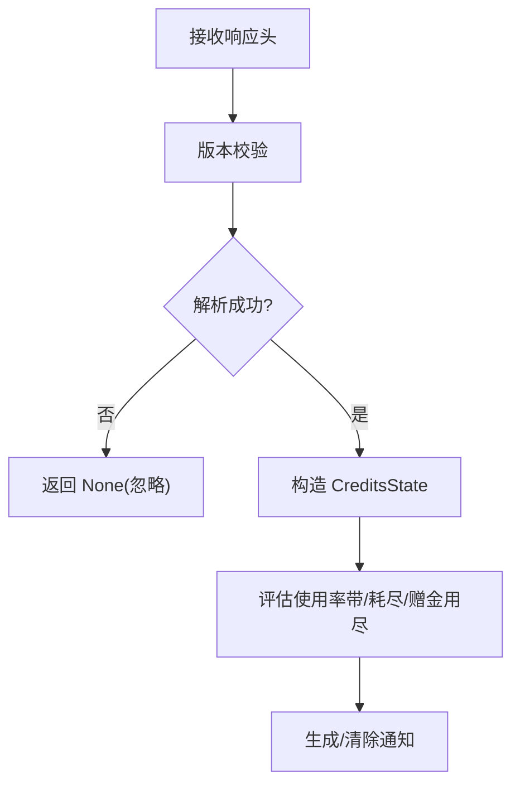

**图表来源**
- [agent/credits_tracker.py:390-580](file://agent/credits_tracker.py#L390-L580)
- [agent/credits_tracker.py:245-384](file://agent/credits_tracker.py#L245-L384)

**章节来源**
- [agent/credits_tracker.py:1-200](file://agent/credits_tracker.py#L1-L200)

### 速率限制监控（rate_limit_tracker）
- 解析 x-ratelimit-* 响应头，生成 RateLimitState
- 可视化展示与告警（超过阈值时）
- 紧凑模式用于状态栏/消息

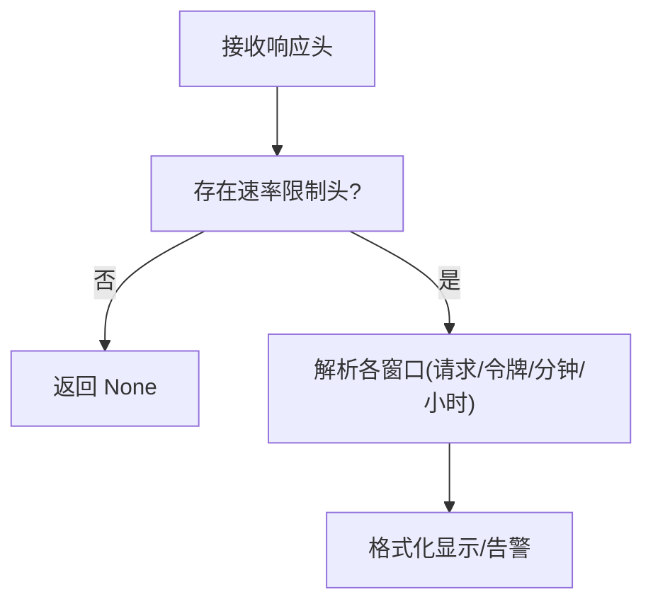

**图表来源**
- [agent/rate_limit_tracker.py:92-129](file://agent/rate_limit_tracker.py#L92-L129)
- [agent/rate_limit_tracker.py:182-247](file://agent/rate_limit_tracker.py#L182-L247)

**章节来源**
- [agent/rate_limit_tracker.py:1-100](file://agent/rate_limit_tracker.py#L1-L100)

## 依赖关系分析
- 插件目录与发现
  - 通过 providers.register_provider 与 providers.__init__ 的扫描机制实现自动发现与用户覆盖（同名用户插件优先）。
- ProviderProfile 与具体实现
  - 所有具体 ProviderProfile 均继承 ProviderProfile 并覆写钩子以适配各自差异。
- 调用链耦合
  - PluginLlm 依赖信任策略与宿主路由；宿主路由依赖 ProviderProfile 钩子与凭据池；监控模块独立解析响应头。

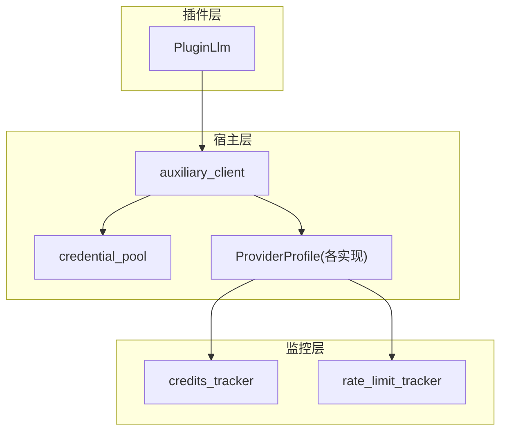

**图表来源**
- [agent/plugin_llm.py:620-773](file://agent/plugin_llm.py#L620-L773)
- [agent/auxiliary_client.py:165-183](file://agent/auxiliary_client.py#L165-L183)
- [agent/credential_pool.py:129-200](file://agent/credential_pool.py#L129-L200)
- [agent/credits_tracker.py:390-580](file://agent/credits_tracker.py#L390-L580)
- [agent/rate_limit_tracker.py:92-129](file://agent/rate_limit_tracker.py#L92-L129)

**章节来源**
- [plugins/model-providers/README.md:17-27](file://plugins/model-providers/README.md#L17-L27)
- [providers/base.py:111-146](file://providers/base.py#L111-L146)

## 性能考量
- 延迟统计
  - 使用量抽取统一于 _extract_usage，可结合日志与审计字段进行端到端延迟追踪。
- 成本计算
  - 余额与额度解析来自响应头，建议在调用后立即记录 captured_at 与 used_fraction，以便后续统计。
- 使用量跟踪
  - 结构化输出结果包含 usage 字段，可用于会话级 token 统计与模型成本归因。
- 回退与冷却
  - 凭据池冷却时间与自动切换可降低失败重试带来的抖动与成本浪费。

**章节来源**
- [agent/plugin_llm.py:492-518](file://agent/plugin_llm.py#L492-L518)
- [agent/credits_tracker.py:93-151](file://agent/credits_tracker.py#L93-L151)
- [agent/credential_pool.py:107-114](file://agent/credential_pool.py#L107-L114)

## 故障排查指南
- 认证失败（401）
  - 检查凭据池冷却时间与轮转策略，确认凭据状态未被标记为死亡。
- 速率限制（429）
  - 查看速率限制状态与剩余窗口，调整请求节奏或切换上游。
- 余额耗尽（402）
  - 依据 credits_tracker 的状态与通知，确认是否为免费模型或已启用自动回退链。
- 模型列表拉取失败
  - 检查 ProviderProfile.fetch_models 的 URL 与认证头，确认网络可达与 WAF 用户代理问题。
- 推理配置无效
  - 对于推理强制模型，避免发送禁用推理字段；改用 verbosity 映射 effort。

**章节来源**
- [agent/credential_pool.py:53-88](file://agent/credential_pool.py#L53-L88)
- [agent/rate_limit_tracker.py:92-129](file://agent/rate_limit_tracker.py#L92-L129)
- [agent/credits_tracker.py:245-384](file://agent/credits_tracker.py#L245-L384)
- [plugins/model-providers/openrouter/__init__.py:122-167](file://plugins/model-providers/openrouter/__init__.py#L122-L167)

## 结论
通过 ProviderProfile 的声明式接口与丰富的钩子，系统实现了对多家模型提供商的一致适配；配合插件侧的 LLM 门面、凭据池与监控模块，开发者可以快速、安全地集成新的提供商并获得可观测性与高可用性保障。建议在新增插件时优先参考现有实现（OpenRouter/Gemini/Anthropic），确保认证、参数映射与响应解析的正确性与一致性。

## 附录

### 新增提供商步骤（基于 README）
- 创建目录与文件
  - 在 plugins/model-providers/<your_provider>/ 下创建 __init__.py 与 plugin.yaml
  - 在 __init__.py 中实例化 ProviderProfile 并调用 register_provider
- 清单文件
  - plugin.yaml 包含 name/kind/version/description/author 等元数据
- 自定义逻辑
  - 如需特殊行为，覆写 ProviderProfile 钩子（如 build_extra_body/build_api_kwargs_extras/fetch_models）

**章节来源**
- [plugins/model-providers/README.md:28-71](file://plugins/model-providers/README.md#L28-L71)