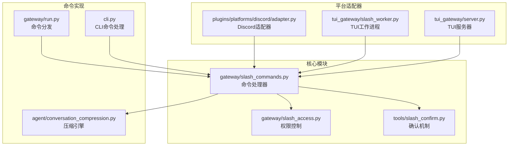
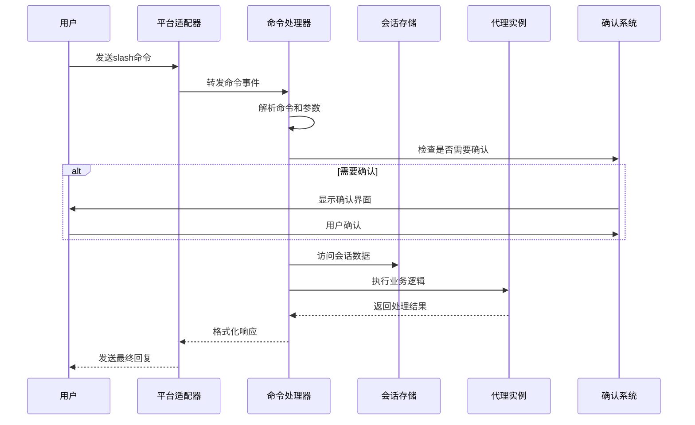
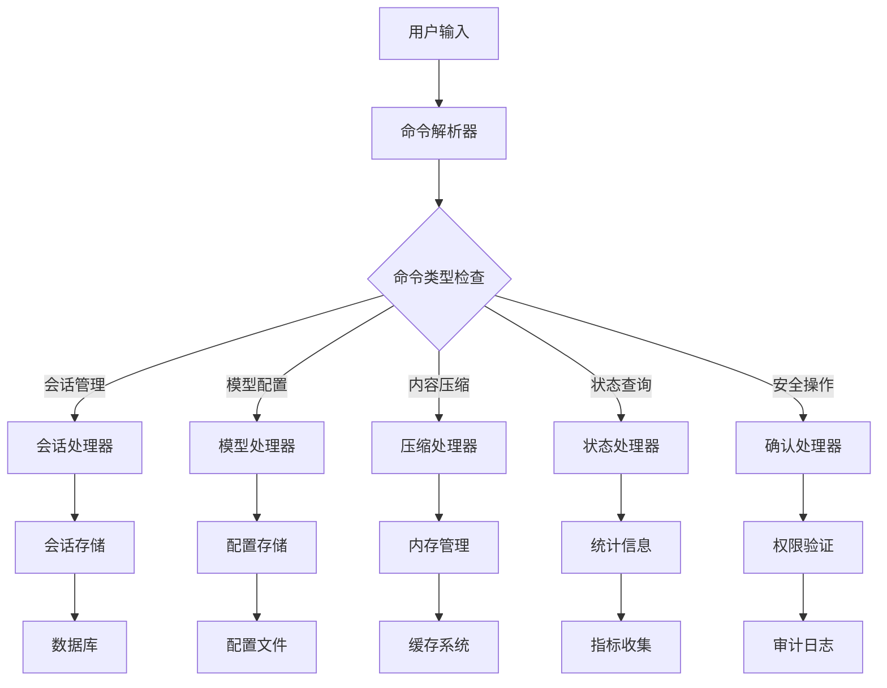
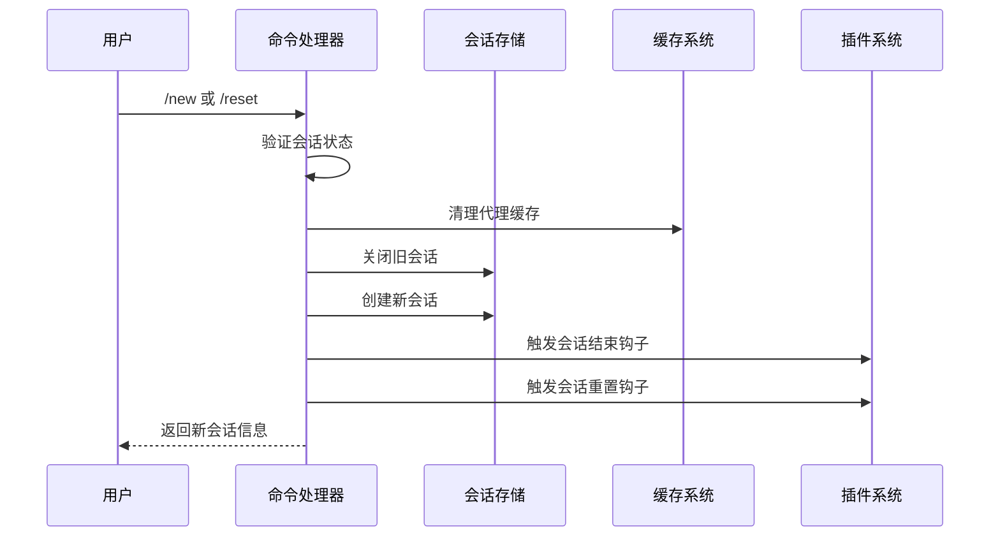
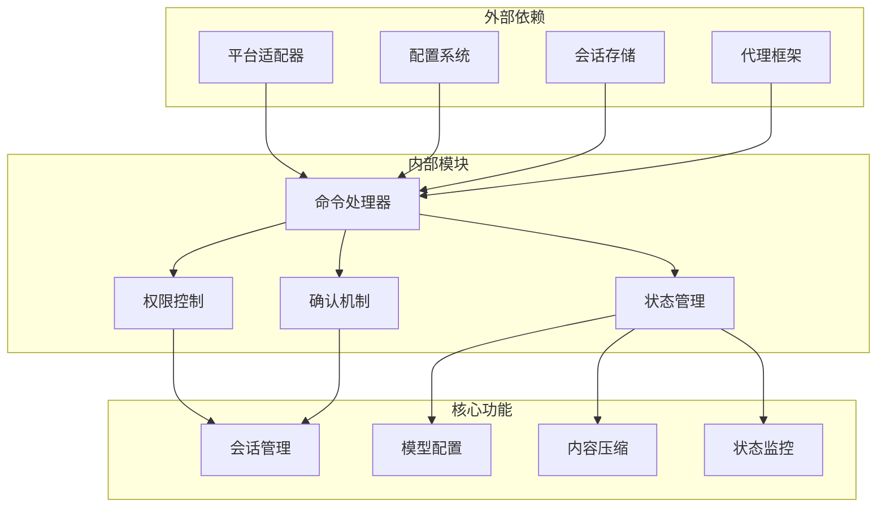

# Slash命令系统

<cite>
**本文档引用的文件**
- [slash_commands.py](file://gateway/slash_commands.py)
- [slash_access.py](file://gateway/slash_access.py)
- [slash_confirm.py](file://tools/slash_confirm.py)
- [slash_worker.py](file://tui_gateway/slash_worker.py)
- [run.py](file://gateway/run.py)
- [cli.py](file://cli.py)
- [adapter.py](file://plugins/platforms/discord/adapter.py)
- [server.py](file://tui_gateway/server.py)
- [commands.py](file://hermes_cli/commands.py)
- [conversation_compression.py](file://agent/conversation_compression.py)
- [partial_compress.py](file://hermes_cli/partial_compress.py)
</cite>

## 目录
1. [简介](#简介)
2. [项目结构](#项目结构)
3. [核心组件](#核心组件)
4. [架构概览](#架构概览)
5. [详细组件分析](#详细组件分析)
6. [依赖关系分析](#依赖关系分析)
7. [性能考虑](#性能考虑)
8. [故障排除指南](#故障排除指南)
9. [结论](#结论)

## 简介

Hermes Agent的Slash命令系统是一个强大的会话管理工具集，为用户提供了丰富的对话控制功能。该系统支持42个内置命令，涵盖了从基础的会话管理到高级的模型配置、内容压缩、状态监控等多个方面。

Slash命令系统的主要特点包括：
- **统一的命令接口**：通过前缀"/"识别命令，提供一致的用户体验
- **多平台支持**：支持Telegram、Discord、Slack等多种即时通讯平台
- **细粒度权限控制**：基于用户身份和平台范围的访问控制
- **安全确认机制**：对破坏性操作提供双重确认保护
- **跨平台一致性**：确保在不同平台上的行为保持一致

## 项目结构

Slash命令系统主要分布在以下模块中：



**图表来源**
- [slash_commands.py:48-50](file://gateway/slash_commands.py#L48-L50)
- [slash_access.py:1-33](file://gateway/slash_access.py#L1-L33)
- [slash_confirm.py:1-22](file://tools/slash_confirm.py#L1-L22)

**章节来源**
- [slash_commands.py:1-50](file://gateway/slash_commands.py#L1-L50)
- [slash_access.py:1-33](file://gateway/slash_access.py#L1-L33)

## 核心组件

### 命令处理器 (GatewaySlashCommandsMixin)

命令处理器是Slash命令系统的核心，负责解析和执行各种slash命令。它继承自GatewayRunner类，提供了42个不同的命令处理方法。

主要职责包括：
- **命令解析**：识别和解析用户输入的slash命令
- **参数验证**：验证命令参数的有效性和完整性
- **业务逻辑执行**：调用相应的业务逻辑处理函数
- **响应生成**：格式化并返回命令执行结果

### 权限控制系统

权限控制系统确保只有授权用户才能执行特定的slash命令，提供了多层次的安全保护。

关键特性：
- **管理员权限**：系统管理员拥有所有命令的完全访问权限
- **用户权限**：普通用户只能执行预配置的命令集合
- **平台范围控制**：支持按平台和聊天类型（DM/群组）进行权限分离
- **动态配置**：允许运行时修改权限配置而不重启服务

### 确认机制系统

对于可能造成数据丢失或系统状态改变的破坏性操作，系统提供了双重确认机制。

确认方式：
- **按钮界面确认**：支持图形界面的三按钮确认（批准一次、总是批准、取消）
- **文本回退确认**：不支持按钮界面的平台使用文本命令进行确认
- **超时保护**：自动清理过期的确认请求
- **线程安全**：使用锁机制确保并发环境下的安全性

**章节来源**
- [slash_commands.py:48-50](file://gateway/slash_commands.py#L48-L50)
- [slash_access.py:56-89](file://gateway/slash_access.py#L56-L89)
- [slash_confirm.py:34-48](file://tools/slash_confirm.py#L34-L48)

## 架构概览

Slash命令系统采用分层架构设计，确保了良好的可维护性和扩展性：



**图表来源**
- [slash_commands.py:64-229](file://gateway/slash_commands.py#L64-L229)
- [slash_confirm.py:99-140](file://tools/slash_confirm.py#L99-L140)

### 数据流图



**图表来源**
- [slash_commands.py:1032-1497](file://gateway/slash_commands.py#L1032-L1497)
- [slash_access.py:196-222](file://gateway/slash_access.py#L196-L222)

## 详细组件分析

### 会话管理命令

#### /new 和 /reset 命令

这两个命令用于创建新的会话或重置现有会话，是会话管理的基础功能。



**图表来源**
- [slash_commands.py:64-229](file://gateway/slash_commands.py#L64-L229)

**命令参数和选项**：
- **标题设置**：支持通过`/new <标题>`为新会话设置标题
- **会话绑定**：在Telegram主题模式下自动重新绑定会话
- **插件集成**：触发会话生命周期钩子函数
- **安全清理**：清理环境变量和凭证文件

#### /resume 和 /sessions 命令

这些命令用于会话恢复和列表查看，提供了灵活的会话管理能力。

**命令功能**：
- **会话恢复**：支持按标题、ID或编号恢复之前的会话
- **会话列表**：显示当前用户的最近会话历史
- **跨房间支持**：Matrix平台支持跨房间会话恢复
- **分支追踪**：正确处理会话分支和继承关系

### 模型配置命令

#### /model 命令

模型配置命令提供了灵活的模型选择和切换功能。

```mermaid
flowchart LR
A[/model 命令] --> B{参数解析}
B --> |无参数| C[交互式选择器]
B --> |有参数| D[直接切换]
C --> E[平台适配器]
D --> F[配置文件更新]
E --> G[代理实例重建]
F --> G
G --> H[会话数据库更新]
H --> I[确认信息返回]
```

**图表来源**
- [slash_commands.py:1032-1497](file://gateway/slash_commands.py#L1032-L1497)

**支持的参数**：
- **全局切换**：`--global` 参数将更改持久化到配置文件
- **提供商指定**：`--provider <提供商>` 参数指定特定提供商
- **刷新缓存**：`--refresh` 参数清除提供商模型缓存
- **交互式选择**：支持Telegram和Discord的内联键盘选择

#### /reasoning 命令

推理配置命令允许用户控制模型的推理过程展示和努力级别。

**配置选项**：
- **努力级别**：支持none、minimal、low、medium、high、xhigh
- **显示控制**：控制推理过程在响应中的显示
- **全局持久化**：支持将配置保存到配置文件
- **会话覆盖**：支持仅对当前会话生效的配置

### 内容压缩命令

#### /compress 命令

压缩命令提供了智能的内容压缩功能，帮助管理长对话的历史记录。

```mermaid
flowchart TD
A[/compress 命令] --> B[加载对话历史]
B --> C{历史长度检查}
C --> |不足| D[返回错误信息]
C --> |足够| E[解析参数]
E --> F[边界感知分割]
F --> G[构建临时代理]
G --> H[估计令牌数]
H --> I[执行压缩]
I --> J{压缩成功?}
J --> |否| K[返回警告信息]
J --> |是| L[更新会话数据库]
L --> M[清理资源]
M --> N[返回摘要信息]
```

**图表来源**
- [slash_commands.py:2483-2651](file://gateway/slash_commands.py#L2483-L2651)

**压缩模式**：
- **完整压缩**：压缩整个对话历史
- **边界感知压缩**：保留最近的N轮对话，压缩前面的内容
- **焦点压缩**：专注于特定主题的压缩
- **智能分割**：保持角色交替的合法性

### 状态监控命令

#### /status 命令

状态命令提供了详细的系统和会话状态信息。

**监控内容**：
- **会话信息**：会话ID、创建时间、最后活动时间
- **模型状态**：当前使用的模型和提供商
- **上下文信息**：已使用和总令牌数
- **队列状态**：待处理的消息数量
- **平台信息**：连接的平台列表

#### /agents 命令

代理命令展示了所有正在运行的代理实例和后台任务。

**显示信息**：
- **代理实例**：会话键、运行时间、状态
- **进程信息**：后台进程的运行状态
- **异步任务**：未完成的异步作业

### 安全和管理命令

#### /yolo 命令

危险操作绕过命令允许用户临时禁用危险命令的审批要求。

**使用场景**：
- **紧急情况**：快速执行危险操作
- **自动化脚本**：在受控环境中执行批量操作
- **测试环境**：开发和测试阶段的便利功能

#### /stop 命令

停止命令用于中断正在运行的代理实例。

**功能特性**：
- **强制清理**：清理会话锁防止死锁
- **线程支持**：支持在共享线程中停止其他用户的会话
- **安全保护**：防止真正挂起的线程导致的阻塞

### 平台特定功能

#### Discord Slash命令

Discord平台提供了原生的Slash命令支持，包括：

- **/personality**：设置个性
- **/retry**：重试上次的消息
- **/undo**：撤销操作
- **/status**：显示状态
- **/stop**：停止代理

**章节来源**
- [slash_commands.py:64-3199](file://gateway/slash_commands.py#L64-L3199)
- [slash_access.py:1-230](file://gateway/slash_access.py#L1-L230)
- [slash_confirm.py:1-168](file://tools/slash_confirm.py#L1-L168)
- [slash_worker.py:1-138](file://tui_gateway/slash_worker.py#L1-L138)
- [adapter.py:3364-3387](file://plugins/platforms/discord/adapter.py#L3364-L3387)

## 依赖关系分析

Slash命令系统具有清晰的依赖层次结构：



**图表来源**
- [slash_commands.py:32-44](file://gateway/slash_commands.py#L32-L44)
- [slash_access.py:170-193](file://gateway/slash_access.py#L170-L193)

### 组件耦合度

系统采用了松耦合的设计原则：
- **低耦合**：各命令处理器相互独立，通过公共接口通信
- **高内聚**：每个模块专注于特定的功能领域
- **可扩展性**：新的命令可以通过简单的接口添加
- **可测试性**：模块化的结构便于单元测试和集成测试

**章节来源**
- [slash_commands.py:1032-1497](file://gateway/slash_commands.py#L1032-L1497)
- [slash_access.py:196-222](file://gateway/slash_access.py#L196-L222)

## 性能考虑

### 异步处理

Slash命令系统广泛使用异步编程模式来提高性能：

- **非阻塞I/O**：数据库操作和网络请求使用异步模式
- **并发处理**：多个命令可以同时处理而不互相阻塞
- **资源管理**：使用上下文管理器确保资源正确释放

### 缓存策略

系统实现了多层缓存机制：

- **代理缓存**：缓存代理实例以避免重复创建
- **配置缓存**：缓存配置信息减少磁盘访问
- **权限缓存**：缓存权限检查结果提高响应速度

### 内存优化

- **增量处理**：大文件和长对话使用流式处理
- **及时清理**：及时释放不再使用的资源
- **内存监控**：监控内存使用情况防止泄漏

## 故障排除指南

### 常见问题

#### 命令权限问题

**症状**：用户无法执行某些slash命令

**解决方案**：
1. 检查用户是否在管理员列表中
2. 验证`user_allowed_commands`配置
3. 确认平台范围的权限设置

#### 命令执行失败

**症状**：slash命令执行后没有响应或报错

**排查步骤**：
1. 查看网关日志获取详细错误信息
2. 检查相关服务的可用性
3. 验证命令参数的正确性

#### 性能问题

**症状**：slash命令响应缓慢

**优化建议**：
1. 检查系统资源使用情况
2. 优化数据库查询
3. 调整缓存配置

### 调试技巧

- **启用调试模式**：使用`/verbose`命令查看详细的状态信息
- **检查配置**：验证配置文件的语法和完整性
- **监控资源**：使用系统监控工具跟踪资源使用情况

**章节来源**
- [slash_commands.py:3121-3199](file://gateway/slash_commands.py#L3121-L3199)
- [slash_confirm.py:84-96](file://tools/slash_confirm.py#L84-L96)

## 结论

Hermes Agent的Slash命令系统是一个设计精良、功能完整的会话管理工具集。它通过以下特点展现了优秀的工程实践：

**技术优势**：
- **模块化设计**：清晰的职责分离和接口定义
- **安全性考虑**：完善的权限控制和确认机制
- **可扩展性**：易于添加新命令和功能
- **性能优化**：异步处理和缓存策略

**用户体验**：
- **一致性**：跨平台的行为保持一致
- **易用性**：直观的命令语法和参数
- **可靠性**：稳定的错误处理和恢复机制

**未来发展**：
- **插件支持**：支持第三方开发者扩展功能
- **智能化**：集成AI助手提供命令建议
- **自动化**：支持更复杂的自动化工作流

该系统为Hermes Agent提供了强大的会话管理能力，是整个平台的重要基础设施之一。