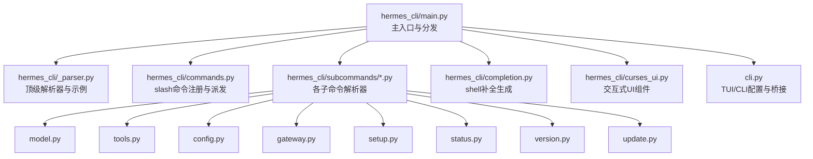
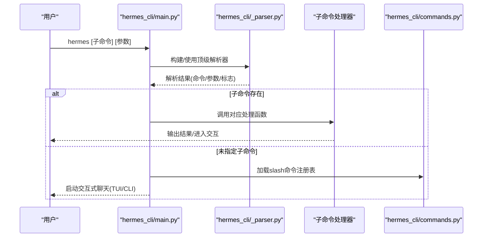
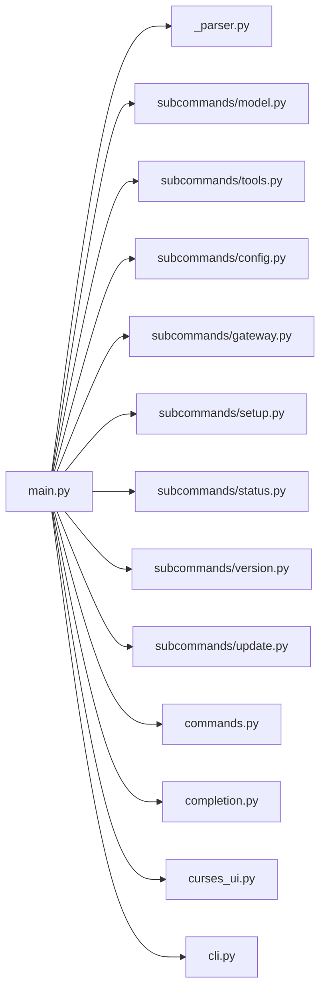

# 命令行界面

<cite>
**本文引用的文件**
- [hermes_cli/main.py](file://hermes_cli/main.py)
- [hermes_cli/_parser.py](file://hermes_cli/_parser.py)
- [hermes_cli/commands.py](file://hermes_cli/commands.py)
- [hermes_cli/subcommands/model.py](file://hermes_cli/subcommands/model.py)
- [hermes_cli/subcommands/tools.py](file://hermes_cli/subcommands/tools.py)
- [hermes_cli/subcommands/config.py](file://hermes_cli/subcommands/config.py)
- [hermes_cli/subcommands/gateway.py](file://hermes_cli/subcommands/gateway.py)
- [hermes_cli/subcommands/setup.py](file://hermes_cli/subcommands/setup.py)
- [hermes_cli/subcommands/status.py](file://hermes_cli/subcommands/status.py)
- [hermes_cli/subcommands/version.py](file://hermes_cli/subcommands/version.py)
- [hermes_cli/subcommands/update.py](file://hermes_cli/subcommands/update.py)
- [hermes_cli/completion.py](file://hermes_cli/completion.py)
- [hermes_cli/curses_ui.py](file://hermes_cli/curses_ui.py)
- [cli.py](file://cli.py)
</cite>

## 目录
1. [简介](#简介)
2. [项目结构](#项目结构)
3. [核心组件](#核心组件)
4. [架构总览](#架构总览)
5. [详细组件分析](#详细组件分析)
6. [依赖分析](#依赖分析)
7. [性能考虑](#性能考虑)
8. [故障排除指南](#故障排除指南)
9. [结论](#结论)
10. [附录](#附录)

## 简介
本文件为 Hermes Agent 命令行界面（CLI）的权威参考，覆盖主命令 hermes 及其全部子命令的语法、参数、标志位与典型用法；同时给出 slash 命令清单、快捷键与自动补全机制、交互式使用模式、常见场景示例与最佳实践，并对比命令行与图形界面的差异与优势。

## 项目结构
Hermes CLI 的入口位于顶层模块，解析器与子命令定义分布在独立模块中，slash 命令注册集中于一个中央表，自动补全脚本按需生成，交互式 UI 使用 curses 组件实现。

图示来源
- [hermes_cli/main.py:1-120](file://hermes_cli/main.py#L1-L120)
- [hermes_cli/_parser.py:84-412](file://hermes_cli/_parser.py#L84-L412)
- [hermes_cli/commands.py:64-237](file://hermes_cli/commands.py#L64-L237)
- [hermes_cli/subcommands/model.py:12-73](file://hermes_cli/subcommands/model.py#L12-L73)
- [hermes_cli/subcommands/tools.py:12-96](file://hermes_cli/subcommands/tools.py#L12-L96)
- [hermes_cli/subcommands/config.py:12-50](file://hermes_cli/subcommands/config.py#L12-L50)
- [hermes_cli/subcommands/gateway.py:32-333](file://hermes_cli/subcommands/gateway.py#L32-L333)
- [hermes_cli/subcommands/setup.py:12-59](file://hermes_cli/subcommands/setup.py#L12-L59)
- [hermes_cli/subcommands/status.py:12-29](file://hermes_cli/subcommands/status.py#L12-L29)
- [hermes_cli/subcommands/version.py:12-19](file://hermes_cli/subcommands/version.py#L12-L19)
- [hermes_cli/subcommands/update.py:12-71](file://hermes_cli/subcommands/update.py#L12-L71)
- [hermes_cli/completion.py:15-320](file://hermes_cli/completion.py#L15-L320)
- [hermes_cli/curses_ui.py:350-800](file://hermes_cli/curses_ui.py#L350-L800)
- [cli.py:356-707](file://cli.py#L356-L707)

章节来源
- [hermes_cli/main.py:1-120](file://hermes_cli/main.py#L1-L120)
- [hermes_cli/_parser.py:84-412](file://hermes_cli/_parser.py#L84-L412)

## 核心组件
- 顶级解析器与示例：定义全局标志、继承性标志、顶级子命令 chat 以及帮助示例。
- 子命令解析器：每个子命令在独立模块中构建自己的子解析器与子参数。
- slash 命令注册：集中定义所有 slash 命令的名称、别名、描述、参数占位符、可选子命令、适用平台等。
- 自动补全：基于实时解析树生成 bash/zsh/fish 补全脚本。
- 交互式 UI：基于 curses 的多选/单选菜单，支持搜索过滤与键盘导航。
- CLI 配置桥接：将配置项映射到环境变量，供终端工具与浏览器等子系统使用。

章节来源
- [hermes_cli/_parser.py:84-412](file://hermes_cli/_parser.py#L84-L412)
- [hermes_cli/commands.py:64-237](file://hermes_cli/commands.py#L64-L237)
- [hermes_cli/completion.py:15-320](file://hermes_cli/completion.py#L15-L320)
- [hermes_cli/curses_ui.py:350-800](file://hermes_cli/curses_ui.py#L350-L800)
- [cli.py:356-707](file://cli.py#L356-L707)

## 架构总览
hermes 主命令负责解析参数、加载配置、选择界面（CLI/TUI）、路由到具体子命令或启动交互会话。slash 命令通过统一注册表派发至不同平台与上下文。

图示来源
- [hermes_cli/main.py:255-303](file://hermes_cli/main.py#L255-L303)
- [hermes_cli/_parser.py:84-412](file://hermes_cli/_parser.py#L84-L412)
- [hermes_cli/commands.py:64-237](file://hermes_cli/commands.py#L64-L237)

## 详细组件分析

### hermes 主命令与顶级参数
- 全局标志与继承性标志：支持一次性查询、模型/提供商覆盖、工具集、会话恢复、工作区隔离、钩子自动批准、技能预加载、危险命令豁免、会话ID透传、忽略用户配置、跳过规则注入、安全模式、强制 TUI/CLI、开发模式等。
- 示例与帮助：提供丰富的示例，涵盖单次查询、TUI 启动、会话恢复、设置、网关安装、日志查看、仪表盘启动等。

章节来源
- [hermes_cli/_parser.py:84-412](file://hermes_cli/_parser.py#L84-L412)

### hermes chat 子命令
- 功能：交互式聊天，支持单次查询、图片附件、模型/提供商覆盖、工具集、技能预加载、会话恢复/继续、工作区隔离、钩子自动批准、检查点、最大轮次、危险命令豁免、会话ID透传、忽略配置/规则、安全模式、TUI/CLI/开发模式等。
- 适用场景：日常对话、快速问答、带图片的多模态交互、临时覆盖默认模型/工具集、调试与隔离运行。

章节来源
- [hermes_cli/_parser.py:251-412](file://hermes_cli/_parser.py#L251-L412)

### hermes model 子命令
- 功能：交互式选择默认推理提供商与模型，支持刷新缓存、OAuth 登录参数（门户URL、推断URL、客户端ID、作用域、禁用浏览器、手动粘贴、超时、CA包、不安全TLS）。
- 适用场景：首次配置模型、切换提供商、重新登录、修复模型列表缓存。

章节来源
- [hermes_cli/subcommands/model.py:12-73](file://hermes_cli/subcommands/model.py#L12-L73)

### hermes tools 子命令
- 功能：管理工具启用/禁用/列出，支持平台选择、后置安装钩子执行。
- 子命令：
  - list [--platform]：列出工具状态
  - disable <name...> [--platform]：禁用工具
  - enable <name...> [--platform]：启用工具
  - post-setup KEY：执行后置安装钩子
- 适用场景：按平台精细化控制工具集、安装外部依赖（浏览器、Chromium、Camofox、语音合成等）。

章节来源
- [hermes_cli/subcommands/tools.py:12-96](file://hermes_cli/subcommands/tools.py#L12-L96)

### hermes config 子命令
- 功能：查看/编辑/设置/打印路径/检查/迁移配置。
- 子命令：
  - show：显示当前配置
  - edit：在编辑器中打开配置
  - set [key] [value]：设置配置值
  - path：打印配置文件路径
  - env-path：打印 .env 文件路径
  - check：检查缺失/过期配置
  - migrate：用新选项更新配置
- 适用场景：排查配置问题、动态调整行为、迁移新版本配置。

章节来源
- [hermes_cli/subcommands/config.py:12-50](file://hermes_cli/subcommands/config.py#L12-L50)

### hermes gateway 与 hermes proxy 子命令
- hermes gateway：
  - run [-v/-q/--replace/--force/--no-supervise]：前台运行网关
  - start [--system/--all]：启动服务
  - stop [--system/--all]：停止服务
  - restart [--system/--all]：重启服务
  - status [--deep/--full/--system]：状态检查
  - install/uninstall [--force/--system/--run-as-user/--start-now/--start-on-login/--elevated-handoff]
  - list：列出所有配置文件与状态
  - setup：配置消息平台
  - migrate-legacy [--dry-run/-y]：清理旧服务单元
  - enroll [--token/--connector-url/--gateway-id]：自托管网关与中继连接器认证
- hermes proxy：
  - start [--provider/--host/--port]：本地代理转发到 OAuth 提供商
  - status/providers：状态与上游提供商列表
- 适用场景：消息网关运维、服务化部署、本地代理转发外部应用请求。

章节来源
- [hermes_cli/subcommands/gateway.py:32-333](file://hermes_cli/subcommands/gateway.py#L32-L333)

### hermes setup 子命令
- 功能：交互式设置向导，支持特定部分、非交互模式、重置、重新配置、快速模式、门户一键设置。
- 适用场景：首次安装、重装配置、仅更新某一部分、CI/自动化环境。

章节来源
- [hermes_cli/subcommands/setup.py:12-59](file://hermes_cli/subcommands/setup.py#L12-L59)

### hermes status 子命令
- 功能：显示所有组件状态，支持详细/深度检查。
- 适用场景：健康巡检、排障前探查。

章节来源
- [hermes_cli/subcommands/status.py:12-29](file://hermes_cli/subcommands/status.py#L12-L29)

### hermes version 子命令
- 功能：显示版本信息。
- 适用场景：诊断与报告。

章节来源
- [hermes_cli/subcommands/version.py:12-19](file://hermes_cli/subcommands/version.py#L12-L19)

### hermes update 子命令
- 功能：更新到最新版本，支持网关模式、检查可用更新、备份策略、分支切换、强制更新。
- 适用场景：升级、回滚前备份、跨分支测试。

章节来源
- [hermes_cli/subcommands/update.py:12-71](file://hermes_cli/subcommands/update.py#L12-L71)

### slash 命令参考（精选）
以下为常用 slash 命令的用途与参数占位符（完整清单见“命令注册表”）：

- 会话类
  - /new 或 /reset [名称]：新建会话（清空历史）
  - /clear：清屏并新建会话（CLI）
  - /redraw：强制全屏重绘（CLI）
  - /history：显示对话历史（CLI）
  - /save：保存当前对话（CLI）
  - /retry：重试上一条消息
  - /undo [N]：回退 N 个用户回合并重新提示
  - /title [名称]：为当前会话设置标题
  - /branch 或 /fork [名称]：分支当前会话
  - /compress [here [N] | focus 主题]：压缩上下文
  - /rollback [编号]：列出或恢复文件系统检查点
  - /snapshot 或 /snap [create|restore <id>|prune]：创建/恢复/清理快照（CLI）
  - /stop：终止所有后台进程
  - /approve [会话|总是]：批准待定危险命令（网关）
  - /deny：拒绝待定危险命令（网关）
  - /background 或 /bg 或 /btw <提示>：后台运行提示
  - /agents 或 /tasks：显示活动代理与任务
  - /queue 或 /q <提示>：排队下一轮提示（不打断）
  - /steer <提示>：在下次工具调用后注入消息而不打断
  - /goal [文本 | pause | resume | clear | status]：设定持续目标
  - /subgoal [文本 | remove N | clear]：管理目标的附加条件
  - /status：显示会话、模型、令牌与上下文信息
  - /whoami：显示你的 slash 命令访问权限（管理员/用户）
  - /profile：显示活动配置文件名与家目录
  - /sethome 或 /set-home：将此聊天设为主频道（网关）
  - /resume [名称]：恢复命名会话
- 配置类
  - /config：显示当前配置（CLI）
  - /model [模型] [--provider 名称] [--global] [--refresh]：切换会话模型
  - /codex-runtime [auto|codex_app_server]：切换 Codex 应用服务器运行时
  - /gquota：显示 Google Gemini Code Assist 配额（CLI）
  - /personality [名称]：设置预定义个性
  - /statusbar：切换上下文/模型状态栏（CLI）
  - /verbose：循环工具进度显示级别（关闭→新增→全部→详细）
  - /footer [on|off|status]：切换网关运行元数据页脚
  - /yolo：切换 YOLO 模式（跳过所有危险命令审批）
  - /reasoning [级别|show|hide]：管理推理努力与显示（none/minimal/low/medium/high/xhigh/show/hide/on/off）
  - /fast [normal|fast|status]：切换快速模式（OpenAI 优先处理/Anthropic 快速模式）
  - /skin：显示或更改显示皮肤/主题（CLI）
  - /indicator：选择 TUI 忙碌指示器样式（kaomoji/emoji/unicode/ascii）（CLI）
  - /voice [on|off|tts|status]：切换语音模式
  - /busy [queue|steer|interrupt|status]：控制“正在工作”时回车的行为（CLI）
- 工具与技能
  - /tools [list|disable|enable] [名称...]：管理工具（CLI）
  - /toolsets：列出可用工具集（CLI）
  - /skills [search|browse|inspect|install|audit|pending|approve|reject|diff|approval]：技能管理（CLI）
  - /memory [pending|approve|reject|approval]：审查待定内存写入/切换审批门控
  - /bundles：列出技能包（CLI）
  - /cron [list|add|create|edit|pause|resume|run|remove]：计划任务管理（CLI）
  - /suggestions 或 /suggest [accept|dismiss N | catalog]：审查建议自动化（CLI）
  - /blueprint 或 /bp [名称] [槽=值 ...]：从蓝图模板建立自动化（CLI）
  - /curator [status|run|pause|resume|pin|unpin|restore|list-archived]：后台技能维护（CLI）
  - /kanban [init|boards|create|list|ls|show|assign|reclaim|reassign|diagnostics|diag|link|unlink|claim|comment|complete|edit|block|unblock|archive|tail|dispatch|stats|notify-subscribe|notify-list|notify-unsubscribe|log|runs|heartbeat|assignees|context|specify|gc]：多配置文件协作看板（CLI）
  - /reload：将 .env 变量重新加载到运行中的会话（CLI）
  - /reload-mcp 或 /reload_mcp：从配置重新加载 MCP 服务器（CLI）
  - /reload-skills 或 /reload_skills：重新扫描 ~/.hermes/skills/（CLI）
  - /browser [connect|disconnect|status]：通过 CDP 连接浏览器工具（CLI）
  - /plugins：列出已安装插件及状态（CLI）
- 信息类
  - /commands：浏览所有命令与技能（分页，网关）
  - /help：显示可用命令
  - /restart：在排空活动运行后优雅重启网关（网关）
  - /usage：显示当前会话的令牌用量与速率限制
  - /credits：显示 Nous 信用余额并充值
  - /insights [天数]：显示使用洞察与分析
  - /platforms：显示网关/消息平台状态（CLI）
  - /platform [pause|resume|list] [名称]：暂停/恢复或列出失败的网关平台（网关）
  - /copy [编号]：复制最后一条助手回复到剪贴板（CLI）
  - /paste：从剪贴板附加图像（CLI）
  - /image <路径>：为下一条提示附加本地图像（CLI）
  - /update：更新到最新版本
  - /version 或 /v：显示版本
  - /debug：上传调试报告（系统信息+日志），获取可分享链接
- 退出类
  - /quit 或 /exit [删除]：退出 CLI（可选择同时移除会话历史）（CLI）

章节来源
- [hermes_cli/commands.py:64-237](file://hermes_cli/commands.py#L64-L237)

### 快捷键与自动补全
- 键盘快捷键（交互式 UI）：
  - 上/下：导航
  - 空格：勾选/取消勾选（多选）
  - 回车/空格：确认（单选/多选）
  - q：取消
  - ESC：取消；在某些菜单中作为取消键
  - /：在可搜索菜单中开启“输入即过滤”
  - 搜索：支持多词模糊匹配，区分边界与前缀加分，精确匹配优先
- 自动补全：
  - 支持 bash/zsh/fish，基于实时解析树生成，包含子命令与标志，且对 -p/--profile 自动补全配置文件名。
  - 生成方式：遍历解析树，提取子命令与标志，输出对应 shell 的完成脚本。

章节来源
- [hermes_cli/curses_ui.py:266-343](file://hermes_cli/curses_ui.py#L266-L343)
- [hermes_cli/curses_ui.py:500-520](file://hermes_cli/curses_ui.py#L500-L520)
- [hermes_cli/completion.py:15-320](file://hermes_cli/completion.py#L15-L320)

### 交互式使用模式
- TUI 模式：通过 --tui 或配置 display.interface=tui 启动现代 TUI；可通过 --cli 强制经典 REPL。
- CLI 模式：默认交互式聊天，支持单次查询（--oneshot/-z）与安静模式（--quiet）。
- 安全模式：--safe-mode 关闭所有定制（配置、规则注入、插件、MCP），便于隔离问题。
- 会话控制：支持按名称/ID 恢复、分支、压缩、检查点、快照等。

章节来源
- [hermes_cli/_parser.py:84-412](file://hermes_cli/_parser.py#L84-L412)
- [hermes_cli/main.py:305-320](file://hermes_cli/main.py#L305-L320)
- [cli.py:356-707](file://cli.py#L356-L707)

### 实际使用场景与最佳实践
- 快速问答：hermes --oneshot "你好"
- 切换模型：hermes model
- 管理工具集：hermes tools enable web,terminal
- 网关运维：hermes gateway install/start/status
- 仪表盘：hermes dashboard 或 hermes gui
- 安全审计：hermes doctor 或 hermes status --deep
- 升级：hermes update --check 或 hermes update

章节来源
- [hermes_cli/_parser.py:40-81](file://hermes_cli/_parser.py#L40-L81)
- [hermes_cli/subcommands/update.py:12-71](file://hermes_cli/subcommands/update.py#L12-L71)
- [hermes_cli/subcommands/gateway.py:32-333](file://hermes_cli/subcommands/gateway.py#L32-L333)

### 命令行与图形界面的差异与优势
- 命令行（CLI/TUI）：
  - 适合脚本化、自动化、远程/容器环境、低资源占用、快速批量操作
  - 支持安静模式、一次性查询、安全模式、丰富的继承性标志
- 图形界面（Dashboard/GUI）：
  - 更直观的可视化配置与监控、拖拽式工具管理、更丰富的展示能力
  - 与 CLI 并行存在，适合非技术用户与复杂配置场景

章节来源
- [hermes_cli/_parser.py:84-412](file://hermes_cli/_parser.py#L84-L412)
- [hermes_cli/main.py:552-564](file://hermes_cli/main.py#L552-L564)

## 依赖分析
- 组件耦合：
  - 主入口依赖解析器与各子命令解析器模块，通过 set_defaults(func=...) 注册处理器。
  - slash 命令注册表集中管理，被 CLI/TUI/网关等多处消费。
  - 自动补全依赖实时解析树，避免硬编码。
  - 交互式 UI 与 curses 解耦，提供文本回退。
- 外部依赖：
  - prompt_toolkit（可选）用于 TUI/自动补全/自动建议
  - curses（可选）用于交互式菜单
  - hermes_logging、hermes_constants、agent.* 等运行时模块

图示来源
- [hermes_cli/main.py:255-303](file://hermes_cli/main.py#L255-L303)
- [hermes_cli/_parser.py:84-412](file://hermes_cli/_parser.py#L84-L412)
- [hermes_cli/commands.py:64-237](file://hermes_cli/commands.py#L64-L237)
- [hermes_cli/completion.py:15-320](file://hermes_cli/completion.py#L15-L320)
- [hermes_cli/curses_ui.py:350-800](file://hermes_cli/curses_ui.py#L350-L800)
- [cli.py:356-707](file://cli.py#L356-L707)

章节来源
- [hermes_cli/main.py:255-303](file://hermes_cli/main.py#L255-L303)

## 性能考虑
- 启动优化：Termux 快速版本信息、早期鼠标残留抑制、终端类型检测与启动路径短路。
- 配置桥接：将配置项映射到环境变量，减少重复读取与深合并成本。
- 日志初始化：集中式日志在 CLI 启动早期完成，保证会话日志连续性。
- 事件循环兼容：延迟导入第三方 SDK 并进行 __del__ 中和，避免 CLI 空闲时的事件循环异常。

章节来源
- [hermes_cli/main.py:193-253](file://hermes_cli/main.py#L193-L253)
- [hermes_cli/main.py:526-576](file://hermes_cli/main.py#L526-L576)
- [cli.py:740-799](file://cli.py#L740-L799)

## 故障排除指南
- 无法交互：
  - 若 stdin 非 TTY，某些交互命令会直接退出并提示需要交互终端。
- 权限与认证：
  - 网关服务安装/启动失败：检查 --system/--run-as-user/--start-now 等参数；必要时使用 --force。
  - OAuth 登录：检查 --no-browser/--manual-paste/--timeout/--ca-bundle/--insecure 参数。
- 配置问题：
  - 使用 hermes config check/migrate；或 --ignore-user-config 与 --ignore-rules 隔离排查。
- 日志定位：
  - hermes logs 查看 agent.log；hermes logs errors 查看错误日志；支持 -f 实时跟踪与 --since 时间筛选。
- 诊断报告：
  - hermes debug 生成可分享链接，便于支持与社区协助。

章节来源
- [hermes_cli/main.py:305-320](file://hermes_cli/main.py#L305-L320)
- [hermes_cli/subcommands/gateway.py:91-209](file://hermes_cli/subcommands/gateway.py#L91-L209)
- [hermes_cli/subcommands/config.py:43-47](file://hermes_cli/subcommands/config.py#L43-L47)
- [hermes_cli/_parser.py:40-81](file://hermes_cli/_parser.py#L40-L81)

## 结论
Hermes CLI 提供了从交互聊天到网关运维、从配置管理到工具治理的完整命令体系。通过集中化的 slash 命令注册表、可扩展的子命令解析器、完善的自动补全与交互式 UI，既能满足高级用户的高效操作，也能为自动化与脚本化场景提供稳定接口。

## 附录

### slash 命令分类与适用范围
- 会话类：适用于 CLI/TUI/网关
- 配置类：适用于 CLI/TUI/网关
- 工具与技能：适用于 CLI/TUI/网关
- 信息类：适用于 CLI/TUI/网关
- 退出类：适用于 CLI

章节来源
- [hermes_cli/commands.py:64-237](file://hermes_cli/commands.py#L64-L237)