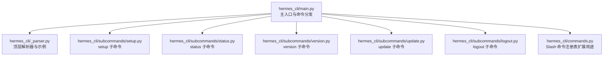
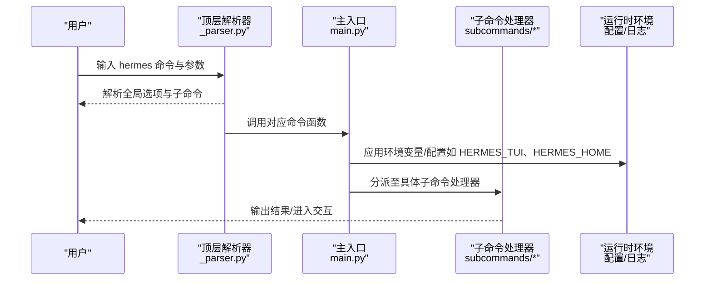
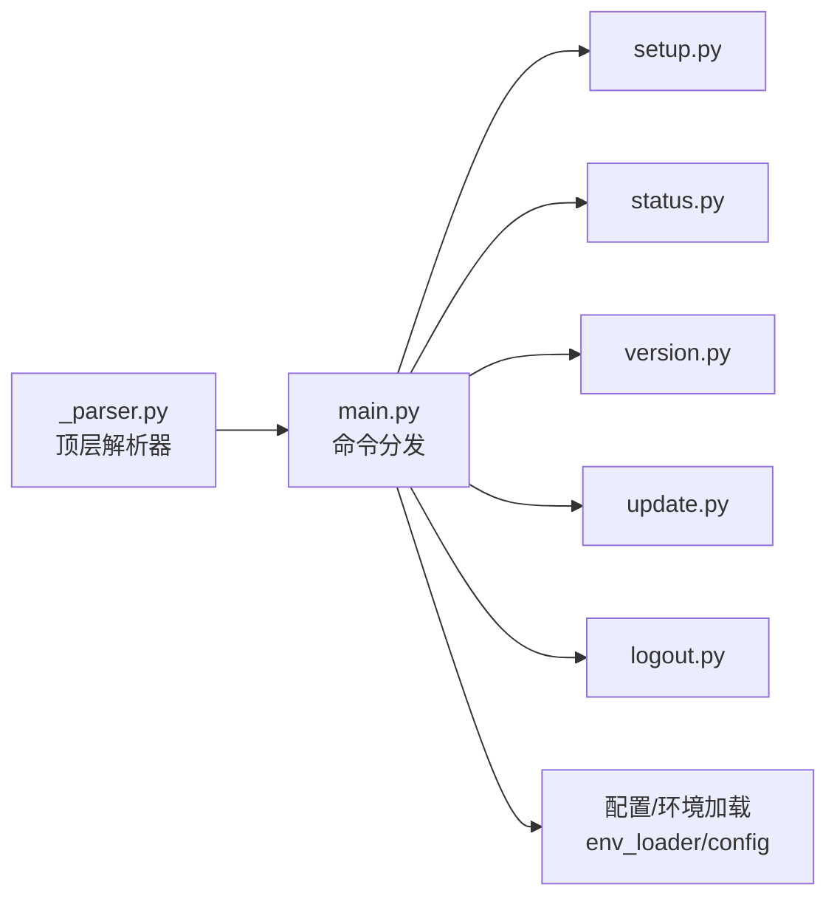

# 基础命令

<cite>
**本文引用的文件**
- [hermes_cli/main.py](file://hermes_cli/main.py)
- [hermes_cli/_parser.py](file://hermes_cli/_parser.py)
- [hermes_cli/subcommands/setup.py](file://hermes_cli/subcommands/setup.py)
- [hermes_cli/subcommands/status.py](file://hermes_cli/subcommands/status.py)
- [hermes_cli/subcommands/version.py](file://hermes_cli/subcommands/version.py)
- [hermes_cli/subcommands/update.py](file://hermes_cli/subcommands/update.py)
- [hermes_cli/subcommands/logout.py](file://hermes_cli/subcommands/logout.py)
- [hermes_cli/commands.py](file://hermes_cli/commands.py)
</cite>

## 目录
1. [简介](#简介)
2. [项目结构](#项目结构)
3. [核心组件](#核心组件)
4. [架构总览](#架构总览)
5. [详细组件分析](#详细组件分析)
6. [依赖分析](#依赖分析)
7. [性能考虑](#性能考虑)
8. [故障排除指南](#故障排除指南)
9. [结论](#结论)

## 简介
本文件面向初学者与日常使用者，系统化梳理 Hermes Agent 的基础命令体系，重点覆盖以下常用命令：
- hermes chat：交互式聊天（默认行为）
- hermes setup：设置向导
- hermes status：状态检查
- hermes version：版本信息
- hermes update：更新
- hermes logout：登出（清除认证）

内容涵盖功能说明、语法与参数、使用场景、示例与最佳实践、参数优先级与环境变量影响，以及常见问题排查。

## 项目结构
Hermes CLI 的入口为顶层模块，通过子命令解析器组织各命令；基础命令均在顶层解析器中定义或由独立子模块注册。

图表来源
- [hermes_cli/main.py:84-411](file://hermes_cli/main.py#L84-L411)
- [hermes_cli/_parser.py:84-411](file://hermes_cli/_parser.py#L84-L411)
- [hermes_cli/subcommands/setup.py:12-58](file://hermes_cli/subcommands/setup.py#L12-L58)
- [hermes_cli/subcommands/status.py:12-28](file://hermes_cli/subcommands/status.py#L12-L28)
- [hermes_cli/subcommands/version.py:12-18](file://hermes_cli/subcommands/version.py#L12-L18)
- [hermes_cli/subcommands/update.py:12-70](file://hermes_cli/subcommands/update.py#L12-L70)
- [hermes_cli/subcommands/logout.py:12-28](file://hermes_cli/subcommands/logout.py#L12-L28)
- [hermes_cli/commands.py:64-237](file://hermes_cli/commands.py#L64-L237)

章节来源
- [hermes_cli/main.py:84-411](file://hermes_cli/main.py#L84-L411)
- [hermes_cli/_parser.py:84-411](file://hermes_cli/_parser.py#L84-L411)

## 核心组件
- 顶层解析器：负责全局选项与基础命令注册，如 chat、setup、status、version、update、logout 等。
- 子命令解析器：将具体命令与其处理器解耦，便于维护与测试。
- 参数继承机制：部分通用标志在顶层解析器中声明，支持“随启动继承”以保持会话一致性。
- 早期启动优化：Termux 快速版本输出、TUI 鼠标残留抑制、配置接口选择等。

章节来源
- [hermes_cli/_parser.py:20-37](file://hermes_cli/_parser.py#L20-L37)
- [hermes_cli/main.py:145-157](file://hermes_cli/main.py#L145-L157)
- [hermes_cli/main.py:168-187](file://hermes_cli/main.py#L168-L187)
- [hermes_cli/main.py:116-142](file://hermes_cli/main.py#L116-L142)

## 架构总览
下图展示基础命令从解析到执行的关键路径，以及与全局选项的关系。

图表来源
- [hermes_cli/_parser.py:84-411](file://hermes_cli/_parser.py#L84-L411)
- [hermes_cli/main.py:255-303](file://hermes_cli/main.py#L255-L303)
- [hermes_cli/main.py:510-576](file://hermes_cli/main.py#L510-L576)

## 详细组件分析

### hermes chat（交互式聊天）
- 功能概述
  - 默认启动交互式聊天；可选单次查询模式（安静输出）、图像附件、模型/工具集/技能覆盖、继续会话等。
- 语法与参数
  - hermes chat [-q 查询文本] [--image 图片路径] [-m 模型] [-t 工具集] [-s 技能...] [--provider 提供商] [--resume 会话ID] [--continue [会话名]] [--worktree] [--accept-hooks] [--yolo] [--pass-session-id] [--ignore-user-config] [--ignore-rules] [--safe-mode] [--tui | --cli] [--dev]
- 使用场景
  - 日常对话、快速问答、带图片的多模态输入、临时覆盖模型/提供商进行试验。
- 最佳实践
  - 在 CI 或脚本中使用 --quiet 或 -z 以获得稳定输出。
  - 使用 --safe-mode 进行最小化复现以定位问题。
  - 使用 --tui 或 --cli 控制界面风格，满足不同终端能力。
- 示例
  - hermes chat -q "解释量子计算"
  - hermes chat --image ~/doc.png -q "分析图片内容"
  - hermes chat -m anthropic/claude-4 --provider anthropic
  - hermes chat --continue my-project
- 参数优先级与环境变量
  - 全局选项（如 --tui、--cli、--accept-hooks、--safe-mode 等）在顶层解析器中声明，可在会话继承中保留。
  - 模型与提供商可通过 -m/--model 与 --provider 覆盖，亦可通过环境变量设置（见“性能考虑”）。
- 故障排除
  - 若 stdin 不是终端，某些交互命令会报错并提示直接在终端运行。
  - 界面卡顿或鼠标事件异常：尝试 --cli 强制经典 REPL，或确保终端不处于非交互模式。

章节来源
- [hermes_cli/_parser.py:251-411](file://hermes_cli/_parser.py#L251-L411)
- [hermes_cli/main.py:305-320](file://hermes_cli/main.py#L305-L320)

### hermes setup（设置向导）
- 功能概述
  - 交互式配置向导，支持运行完整向导或特定模块（model/tts/terminal/gateway/tools/agent）。
- 语法与参数
  - hermes setup [section] [--non-interactive] [--reset] [--reconfigure] [--quick] [--portal]
- 使用场景
  - 新安装初始化、仅配置某模块、非交互式部署、重置配置、Portal 快速接入。
- 最佳实践
  - 首次安装建议运行完整向导；已有配置可使用 --quick 仅补齐缺失项。
  - CI 环境使用 --non-interactive 与环境变量自动完成。
- 示例
  - hermes setup
  - hermes setup model
  - hermes setup --non-interactive
  - hermes setup --reset
- 参数优先级与环境变量
  - 向导内部会读取环境变量与配置作为默认值，避免重复输入。
- 故障排除
  - 若网络受限导致模型/提供商验证失败，可先跳过该模块，稍后单独配置。

章节来源
- [hermes_cli/subcommands/setup.py:12-58](file://hermes_cli/subcommands/setup.py#L12-L58)

### hermes status（状态检查）
- 功能概述
  - 显示所有组件的状态；支持显示全部细节（已脱敏）与深度检查。
- 语法与参数
  - hermes status [--all] [--deep]
- 使用场景
  - 日常巡检、问题诊断、生成报告用于支持。
- 最佳实践
  - 一般巡检使用默认；遇到复杂问题使用 --deep 获取更详尽信息。
- 示例
  - hermes status
  - hermes status --all
  - hermes status --deep
- 参数优先级与环境变量
  - 与配置与环境无关，纯读取当前状态。
- 故障排除
  - 若输出为空或异常，结合 --deep 与日志定位；必要时使用 --safe-mode 排除自定义配置干扰。

章节来源
- [hermes_cli/subcommands/status.py:12-28](file://hermes_cli/subcommands/status.py#L12-L28)

### hermes version（版本信息）
- 功能概述
  - 显示版本号、发布日期、项目根目录、Python 版本及 OpenAI SDK 版本等。
- 语法与参数
  - hermes version
- 使用场景
  - 升级前确认版本、问题反馈必备信息。
- 最佳实践
  - 将输出附带到 Issue 或支持工单中。
- 示例
  - hermes version
- 参数优先级与环境变量
  - 无参数，无环境变量影响。
- 故障排除
  - 若显示版本异常，检查本地 Git 状态与依赖安装。

章节来源
- [hermes_cli/subcommands/version.py:12-18](file://hermes_cli/subcommands/version.py#L12-L18)
- [hermes_cli/main.py:227-237](file://hermes_cli/main.py#L227-L237)

### hermes update（更新）
- 功能概述
  - 拉取最新代码并重新安装依赖；支持检查可用性、备份策略、分支切换、强制更新等。
- 语法与参数
  - hermes update [--gateway] [--check] [--no-backup] [--backup] [--yes] [--branch NAME] [--force]
- 使用场景
  - 平滑升级、预检查可用更新、指定分支更新、跳过备份或强制覆盖。
- 最佳实践
  - 生产环境建议先 --check，再 --backup 或 --no-backup 自行决策。
  - Windows 环境若存在并发进程，谨慎使用 --force。
- 示例
  - hermes update
  - hermes update --check
  - hermes update --branch develop
  - hermes update --yes
- 参数优先级与环境变量
  - 更新流程受配置中的备份策略影响，可通过 --backup/--no-backup 覆盖。
- 故障排除
  - 更新失败时查看日志；必要时手动回滚或清理工作区后重试。

章节来源
- [hermes_cli/subcommands/update.py:12-70](file://hermes_cli/subcommands/update.py#L12-L70)

### hermes logout（登出）
- 功能概述
  - 清除指定推理提供商的存储认证，重置提供商配置。
- 语法与参数
  - hermes logout [--provider 名称]
- 使用场景
  - 切换账户、清理凭据、安全审计。
- 最佳实践
  - 登出后根据需要重新登录或配置新凭据。
- 示例
  - hermes logout
  - hermes logout --provider nous
- 参数优先级与环境变量
  - 无参数，无环境变量影响。
- 故障排除
  - 若后续仍提示认证失败，检查是否还有其他凭据源或缓存。

章节来源
- [hermes_cli/subcommands/logout.py:12-28](file://hermes_cli/subcommands/logout.py#L12-L28)

## 依赖分析
- 命令解析与分发
  - 顶层解析器集中定义基础命令与全局选项；子命令解析器按需注入处理器，降低耦合。
- 环境与配置加载
  - 启动阶段读取 .env 与 config.yaml，桥接安全与网络偏好等配置到运行时环境。
- 早期优化
  - Termux 快速版本输出、TUI 鼠标残留抑制、配置接口选择等，提升启动体验。

图表来源
- [hermes_cli/_parser.py:84-411](file://hermes_cli/_parser.py#L84-L411)
- [hermes_cli/main.py:510-576](file://hermes_cli/main.py#L510-L576)
- [hermes_cli/subcommands/setup.py:12-58](file://hermes_cli/subcommands/setup.py#L12-L58)
- [hermes_cli/subcommands/status.py:12-28](file://hermes_cli/subcommands/status.py#L12-L28)
- [hermes_cli/subcommands/version.py:12-18](file://hermes_cli/subcommands/version.py#L12-L18)
- [hermes_cli/subcommands/update.py:12-70](file://hermes_cli/subcommands/update.py#L12-L70)
- [hermes_cli/subcommands/logout.py:12-28](file://hermes_cli/subcommands/logout.py#L12-L28)

章节来源
- [hermes_cli/main.py:510-576](file://hermes_cli/main.py#L510-L576)

## 性能考虑
- 启动优化
  - Termux 快速版本输出：在满足条件时绕过配置与日志初始化，直接打印版本信息。
  - TUI 鼠标残留抑制：在导入前发送控制序列，减少终端噪音。
  - 配置接口选择：优先级为 --cli > --tui/HERMES_TUI=1 > config.yaml 中的 display.interface。
- 模型与提供商
  - 可通过 -m/--model 与 --provider 在调用时覆盖；也可通过环境变量设置持久生效。
- 安全与网络
  - 支持将 security.redact_secrets 与 network.force_ipv4 从配置映射到环境变量，影响运行期行为。

章节来源
- [hermes_cli/main.py:116-157](file://hermes_cli/main.py#L116-L157)
- [hermes_cli/main.py:227-237](file://hermes_cli/main.py#L227-L237)
- [hermes_cli/main.py:517-576](file://hermes_cli/main.py#L517-L576)

## 故障排除指南
- 无法进入交互式命令
  - 现象：提示需要交互式终端且不能通过管道运行。
  - 处理：直接在终端运行，而非通过脚本或管道。
- 界面异常或鼠标事件干扰
  - 现象：终端出现鼠标事件残留或界面卡顿。
  - 处理：尝试 --cli 强制经典 REPL；或确保终端处于交互模式。
- 版本信息异常
  - 现象：版本号显示不正确或缺少依赖版本。
  - 处理：检查本地 Git 状态与依赖安装；必要时重新安装。
- 更新失败或冲突
  - 现象：更新过程中出现权限或文件占用问题。
  - 处理：使用 --check 预检；必要时使用 --force（Windows）；确保无并发进程。
- 登出后仍提示认证
  - 现象：登出后仍被要求认证。
  - 处理：检查是否存在其他凭据源或缓存；必要时清理相关配置。

章节来源
- [hermes_cli/main.py:305-320](file://hermes_cli/main.py#L305-L320)
- [hermes_cli/main.py:168-187](file://hermes_cli/main.py#L168-L187)
- [hermes_cli/subcommands/update.py:65-69](file://hermes_cli/subcommands/update.py#L65-L69)

## 结论
本文档对 Hermes Agent 的基础命令进行了系统化梳理，覆盖了常用命令的功能、语法、参数、使用场景与最佳实践，并补充了参数优先级、环境变量影响与常见问题排查。建议在日常使用中结合“性能考虑”中的优化点与“故障排除指南”中的方法，以获得更稳定高效的体验。