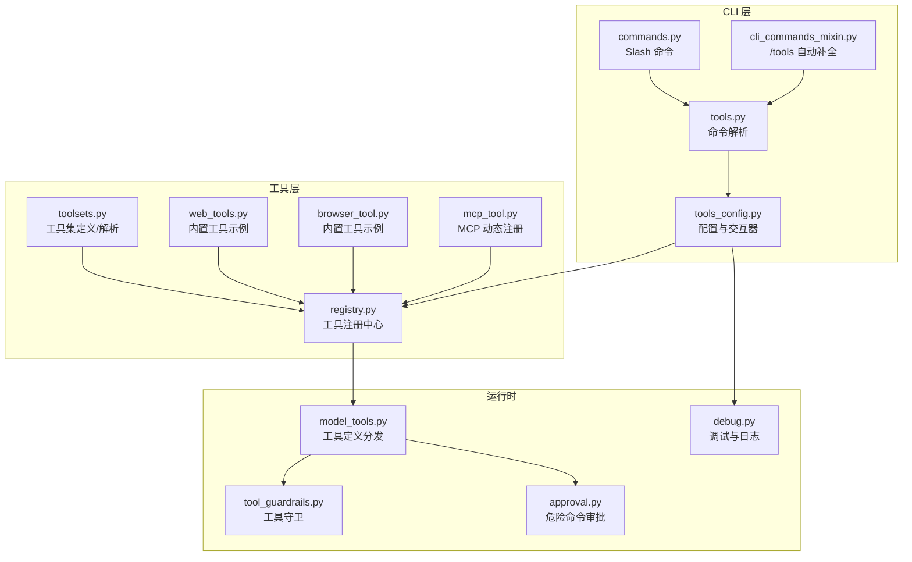
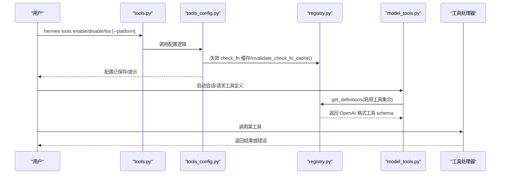
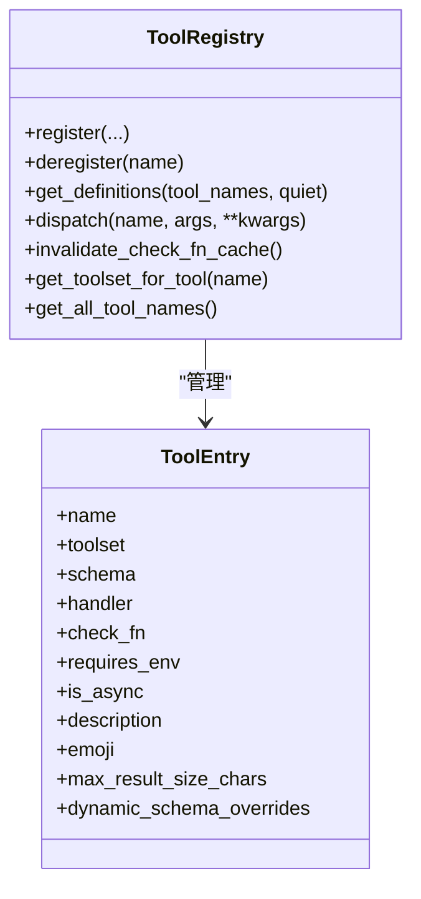
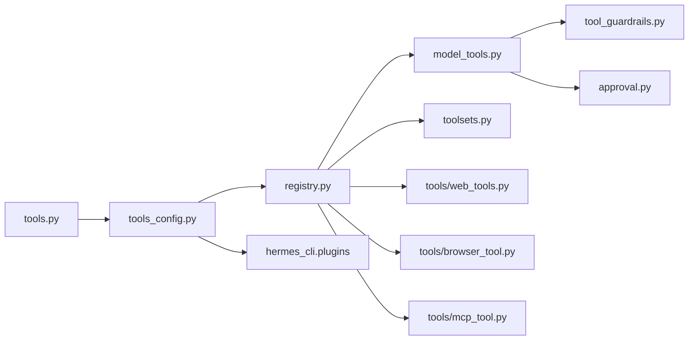

# 工具管理命令

<cite>
**本文引用的文件**
- [hermes_cli/subcommands/tools.py](file://hermes_cli/subcommands/tools.py)
- [hermes_cli/tools_config.py](file://hermes_cli/tools_config.py)
- [tools/registry.py](file://tools/registry.py)
- [tools/__init__.py](file://tools/__init__.py)
- [model_tools.py](file://model_tools.py)
- [toolsets.py](file://toolsets.py)
- [hermes_cli/commands.py](file://hermes_cli/commands.py)
- [hermes_cli/cli_commands_mixin.py](file://hermes_cli/cli_commands_mixin.py)
- [tools/web_tools.py](file://tools/web_tools.py)
- [tools/browser_tool.py](file://tools/browser_tool.py)
- [tools/mcp_tool.py](file://tools/mcp_tool.py)
- [tests/tools/test_registry.py](file://tests/tools/test_registry.py)
- [tests/tools/test_mcp_tool.py](file://tests/tools/test_mcp_tool.py)
- [tests/test_toolsets.py](file://tests/test_toolsets.py)
- [hermes_cli/debug.py](file://hermes_cli/debug.py)
- [agent/tool_guardrails.py](file://agent/tool_guardrails.py)
- [tools/approval.py](file://tools/approval.py)
- [cli.py](file://cli.py)
</cite>

## 目录
1. [简介](#简介)
2. [项目结构](#项目结构)
3. [核心组件](#核心组件)
4. [架构总览](#架构总览)
5. [详细组件分析](#详细组件分析)
6. [依赖分析](#依赖分析)
7. [性能考虑](#性能考虑)
8. [故障排查指南](#故障排查指南)
9. [结论](#结论)
10. [附录](#附录)

## 简介
本文件系统化阐述 Hermes Agent 的工具管理命令体系，围绕 hermes tools 子命令组展开，覆盖以下主题：
- 工具列表查看、启用/禁用、配置管理
- 工具注册机制与工具定义格式
- 内置工具与自定义（插件/MCP）工具的区别与使用
- 工具测试与调试方法
- 工具权限管理与安全配置
- 工具与技能（Skills）的关系与协作模式

目标是帮助用户与开发者高效地配置、扩展与维护工具生态。

## 项目结构
tools 与 hermes_cli 是工具管理的核心目录：
- hermes_cli/subcommands/tools.py：tools 子命令解析器与参数定义
- hermes_cli/tools_config.py：工具配置、交互式配置器、后置安装钩子
- tools/registry.py：工具注册中心，统一收集工具 schema、处理器与可用性检查
- model_tools.py：模型侧工具定义与分发的编排层
- toolsets.py：工具集（toolset）定义与解析，支持组合与别名
- hermes_cli/commands.py 与 hermes_cli/cli_commands_mixin.py：Slash 命令与自动补全集成
- tools/*：内置工具实现（如 web_tools、browser_tool）
- tools/mcp_tool.py：MCP 工具动态发现与注册
- tests/*：工具注册、MCP 注册、工具集解析等单元测试
- agent/tool_guardrails.py 与 tools/approval.py：工具执行前的安全与审批
- hermes_cli/debug.py：调试与日志上传辅助

图示来源
- [hermes_cli/subcommands/tools.py:12-96](file://hermes_cli/subcommands/tools.py#L12-L96)
- [hermes_cli/tools_config.py:1-200](file://hermes_cli/tools_config.py#L1-L200)
- [tools/registry.py:151-544](file://tools/registry.py#L151-L544)
- [model_tools.py:1-200](file://model_tools.py#L1-L200)
- [toolsets.py:1-200](file://toolsets.py#L1-L200)
- [hermes_cli/commands.py:160-200](file://hermes_cli/commands.py#L160-L200)
- [hermes_cli/cli_commands_mixin.py:389-418](file://hermes_cli/cli_commands_mixin.py#L389-L418)
- [tools/web_tools.py:1-200](file://tools/web_tools.py#L1-L200)
- [tools/browser_tool.py:1-200](file://tools/browser_tool.py#L1-L200)
- [tools/mcp_tool.py:3551-3581](file://tools/mcp_tool.py#L3551-L3581)
- [agent/tool_guardrails.py:360-395](file://agent/tool_guardrails.py#L360-L395)
- [tools/approval.py:1229-1634](file://tools/approval.py#L1229-L1634)
- [hermes_cli/debug.py:1-200](file://hermes_cli/debug.py#L1-L200)

章节来源
- [hermes_cli/subcommands/tools.py:12-96](file://hermes_cli/subcommands/tools.py#L12-L96)
- [hermes_cli/tools_config.py:1-200](file://hermes_cli/tools_config.py#L1-L200)
- [tools/registry.py:151-544](file://tools/registry.py#L151-L544)
- [model_tools.py:1-200](file://model_tools.py#L1-L200)
- [toolsets.py:1-200](file://toolsets.py#L1-L200)
- [hermes_cli/commands.py:160-200](file://hermes_cli/commands.py#L160-L200)
- [hermes_cli/cli_commands_mixin.py:389-418](file://hermes_cli/cli_commands_mixin.py#L389-L418)

## 核心组件
- tools 子命令解析器：定义 tools list/disable/enable/post-setup 子命令及参数，支持平台选择与摘要输出
- 工具配置模块：提供交互式工具集配置 UI、平台级工具集开关、默认关闭项策略、后置安装钩子（如浏览器、TTS、Spotify 等）
- 工具注册中心：集中注册工具 schema、处理器、可用性检查函数；提供 TTL 缓存以优化外部状态探测；支持 MCP 工具动态刷新
- 工具集系统：静态定义工具集，支持组合、别名与平台限定；动态合并插件注册的工具集
- 模型侧工具分发：从注册中心读取工具定义，按启用/禁用过滤，生成 OpenAI 格式的工具 schema 列表
- 安全与审批：工具执行前的守卫与审批流程，结合 Tirith 扫描与危险命令检测
- 测试与调试：单元测试覆盖注册、MCP 注册冲突处理、工具集解析；调试命令支持敏感信息脱敏上传

章节来源
- [hermes_cli/subcommands/tools.py:12-96](file://hermes_cli/subcommands/tools.py#L12-L96)
- [hermes_cli/tools_config.py:1-200](file://hermes_cli/tools_config.py#L1-L200)
- [tools/registry.py:151-544](file://tools/registry.py#L151-L544)
- [model_tools.py:1-200](file://model_tools.py#L1-L200)
- [toolsets.py:1-200](file://toolsets.py#L1-L200)
- [agent/tool_guardrails.py:360-395](file://agent/tool_guardrails.py#L360-L395)
- [tools/approval.py:1229-1634](file://tools/approval.py#L1229-L1634)

## 架构总览
tools 命令从 CLI 解析进入配置模块，配置模块根据平台与工具集状态更新配置并触发工具注册中心缓存失效；随后模型侧通过注册中心获取工具定义，最终在运行时由工具注册中心调度具体处理器。

图示来源
- [hermes_cli/subcommands/tools.py:12-96](file://hermes_cli/subcommands/tools.py#L12-L96)
- [hermes_cli/tools_config.py:1-200](file://hermes_cli/tools_config.py#L1-L200)
- [tools/registry.py:337-417](file://tools/registry.py#L337-L417)
- [model_tools.py:1-200](file://model_tools.py#L1-L200)

## 详细组件分析

### tools 子命令组
- 子命令
  - list：列出指定平台的工具集及其启用状态
  - disable/enable：批量启用/禁用工具集或 MCP 工具（server:tool 形式）
  - post-setup：运行后置安装钩子（浏览器、Camoufox、TTS、Spotify、Langfuse、xAI 等）
- 平台参数：默认 cli，可选 Telegram、Discord 等
- 摘要参数：--summary 输出每平台启用工具概要后退出

章节来源
- [hermes_cli/subcommands/tools.py:12-96](file://hermes_cli/subcommands/tools.py#L12-L96)

### 工具配置与交互式配置器
- 可配置工具集清单：内置工具集（如 web、browser、terminal、file、vision、image_gen、video_gen、tts、skills、todo、memory、context_engine、session_search、clarify、delegation、cronjob、homeassistant、spotify、discord、discord_admin、yuanbao、computer_use 等）
- 默认关闭项策略：针对 moa、homeassistant、spotify、discord、discord_admin、video、video_gen、x_search 等，默认不开启，需用户显式启用
- 平台限制：部分工具集仅在特定平台显示与生效（如 discord、discord_admin）
- 提供 provider-aware 配置：为需要 API Key 的工具集（如 tts、web、image_gen、video_gen、x_search、browser、homeassistant、spotify、computer_use、langfuse）提供多供应商选择与环境变量提示
- 后置安装钩子：针对本地二进制或第三方依赖（如 cua-driver、agent_browser、camofox、kittentts、piper、spotify、langfuse、xai_grok）提供一键安装/升级能力

章节来源
- [hermes_cli/tools_config.py:50-200](file://hermes_cli/tools_config.py#L50-L200)
- [hermes_cli/tools_config.py:234-564](file://hermes_cli/tools_config.py#L234-L564)
- [hermes_cli/tools_config.py:574-800](file://hermes_cli/tools_config.py#L574-L800)

### 工具注册机制与工具定义格式
- 注册中心（ToolRegistry）
  - 注册接口：register(name, toolset, schema, handler, check_fn, requires_env, is_async, description, emoji, max_result_size_chars, dynamic_schema_overrides, override)
  - 取消注册：deregister(name)，清理工具集检查与别名
  - 工具定义获取：get_definitions(tool_names, quiet) 返回 OpenAI 格式 schema 列表，内部对 check_fn 结果进行 TTL 缓存（约 30 秒），避免频繁探测外部状态
  - 调度执行：dispatch(name, args, **kwargs)，支持异步处理器桥接与异常统一返回
  - 查询辅助：获取工具集映射、可用性检查、最大结果尺寸等
- 工具定义格式要点
  - schema 必须包含 name 字段（若缺失则以工具名填充）
  - 支持动态 schema 覆盖（dynamic_schema_overrides），用于根据运行时配置调整描述等字段
  - check_fn 用于声明工具可用性（如终端、Docker、Playwright 等外部依赖），失败时工具不会出现在定义中
- MCP 工具注册
  - 服务器连接后扫描工具列表，转换为 OpenAI schema，自动加上 server 前缀（如 mcp_srv_tool）
  - 过滤 include/exclude 规则，避免与内置工具同名冲突（非 MCP 冲突保留内置，MCP 对 MCP 冲突允许新服务器覆盖）

图示来源
- [tools/registry.py:77-107](file://tools/registry.py#L77-L107)
- [tools/registry.py:234-306](file://tools/registry.py#L234-L306)
- [tools/registry.py:337-417](file://tools/registry.py#L337-L417)

章节来源
- [tools/registry.py:151-544](file://tools/registry.py#L151-L544)
- [tools/mcp_tool.py:3551-3581](file://tools/mcp_tool.py#L3551-L3581)

### 内置工具与自定义工具（插件/MCP）
- 内置工具
  - 位于 tools/ 目录，每个工具模块在导入时调用 registry.register 完成自注册
  - 示例：web_tools、browser_tool 等，提供搜索、提取、浏览自动化、截图、内容分析等功能
- 自定义工具（插件/MCP）
  - 插件工具集：通过 hermes_cli/plugins 发现并注入到工具集系统，展示于配置器末尾且去重
  - MCP 工具：从配置的 MCP 服务器动态拉取工具列表，转换为 OpenAI schema 并注册，支持 include/exclude 过滤与冲突处理
- 使用建议
  - 内置工具：直接在 hermes tools 中启用对应工具集（如 web、browser、terminal、file、vision、image_gen、video_gen、tts、skills、todo、memory、context_engine、session_search、clarify、delegation、cronjob、homeassistant、spotify、discord、discord_admin、yuanbao、computer_use）
  - 自定义工具：确保 MCP 服务器可达并在配置中正确设置；必要时使用 post-setup 钩子完成依赖安装

章节来源
- [tools/__init__.py:1-26](file://tools/__init__.py#L1-L26)
- [tools/web_tools.py:1-200](file://tools/web_tools.py#L1-L200)
- [tools/browser_tool.py:1-200](file://tools/browser_tool.py#L1-L200)
- [tools/mcp_tool.py:3551-3581](file://tools/mcp_tool.py#L3551-L3581)

### 工具与技能（Skills）的关系与协作
- 工具集与技能
  - 工具集（toolset）是一组工具的组合，面向场景（如 research、coding、safe 等）
  - 技能（Skill）是知识与指令的载体，工具集中的 skills_* 工具负责技能的检索、查看与管理
- 协作模式
  - 用户通过 hermes tools 启用技能工具集，再通过 /skills 命令进行技能的搜索、安装、审计与审批
  - 模型侧通过工具集解析与注册中心获取工具定义，技能工具集与其它工具集共同参与对话与任务执行

章节来源
- [toolsets.py:165-169](file://toolsets.py#L165-L169)
- [hermes_cli/commands.py:168-172](file://hermes_cli/commands.py#L168-L172)

### 工具测试与调试
- 单元测试
  - 注册中心：验证 check_fn 控制可用性、工具集要求检查、名称排序等
  - MCP 注册：验证冲突处理（内置优先、MCP 对 MCP 允许覆盖）、include/exclude 过滤
  - 工具集解析：验证复合工具集、别名与动态注册工具集
- 调试与日志
  - hermes debug share：上传系统信息与日志（含敏感信息脱敏），支持自动删除
  - 工具错误统一返回：注册中心对异常进行清洗并返回标准 JSON 错误格式
  - 守卫与审批：工具执行前的安全扫描与审批队列，支持会话级与永久级放行

章节来源
- [tests/tools/test_registry.py:129-172](file://tests/tools/test_registry.py#L129-L172)
- [tests/tools/test_mcp_tool.py:3519-3766](file://tests/tools/test_mcp_tool.py#L3519-L3766)
- [tests/test_toolsets.py:122-161](file://tests/test_toolsets.py#L122-L161)
- [hermes_cli/debug.py:1-200](file://hermes_cli/debug.py#L1-L200)
- [tools/registry.py:400-417](file://tools/registry.py#L400-L417)
- [agent/tool_guardrails.py:360-395](file://agent/tool_guardrails.py#L360-L395)
- [tools/approval.py:1229-1634](file://tools/approval.py#L1229-L1634)

## 依赖分析
- 组件耦合
  - tools.py 依赖 tools_config.py 完成配置与交互
  - tools_config.py 依赖 hermes_cli.config 读写配置、hermes_cli.plugins 发现插件工具集
  - registry.py 作为单例，被 model_tools.py 与工具模块共同依赖
  - toolsets.py 与 registry.py 协作，提供工具集解析与动态合并
  - 安全与审批贯穿工具执行路径，与 CLI 回调与网关队列配合
- 外部依赖
  - MCP 服务器（通过 tools/mcp_tool.py 动态发现）
  - 第三方后端（如 Firecrawl、Parallel、Tavily、Exa、Browserbase、Browser Use 等，通过 tools_config.py 的 provider-aware 配置）

图示来源
- [hermes_cli/subcommands/tools.py:12-96](file://hermes_cli/subcommands/tools.py#L12-L96)
- [hermes_cli/tools_config.py:1-200](file://hermes_cli/tools_config.py#L1-L200)
- [tools/registry.py:151-544](file://tools/registry.py#L151-L544)
- [model_tools.py:1-200](file://model_tools.py#L1-L200)
- [toolsets.py:1-200](file://toolsets.py#L1-L200)
- [tools/web_tools.py:1-200](file://tools/web_tools.py#L1-L200)
- [tools/browser_tool.py:1-200](file://tools/browser_tool.py#L1-L200)
- [tools/mcp_tool.py:3551-3581](file://tools/mcp_tool.py#L3551-L3581)

章节来源
- [hermes_cli/subcommands/tools.py:12-96](file://hermes_cli/subcommands/tools.py#L12-L96)
- [hermes_cli/tools_config.py:1-200](file://hermes_cli/tools_config.py#L1-L200)
- [tools/registry.py:151-544](file://tools/registry.py#L151-L544)
- [model_tools.py:1-200](file://model_tools.py#L1-L200)
- [toolsets.py:1-200](file://toolsets.py#L1-L200)
- [tools/web_tools.py:1-200](file://tools/web_tools.py#L1-L200)
- [tools/browser_tool.py:1-200](file://tools/browser_tool.py#L1-L200)
- [tools/mcp_tool.py:3551-3581](file://tools/mcp_tool.py#L3551-L3581)

## 性能考虑
- check_fn TTL 缓存：约 30 秒，平衡配置变更响应速度与外部探测开销
- 异步处理器桥接：持久事件循环避免“事件循环已关闭”错误，提升并发稳定性
- 工具定义缓存：基于配置文件元数据的缓存键，配置变化自动失效
- MCP 动态刷新：服务器通知触发注册中心重建，避免阻塞启动路径

章节来源
- [tools/registry.py:120-148](file://tools/registry.py#L120-L148)
- [model_tools.py:47-174](file://model_tools.py#L47-L174)

## 故障排查指南
- 工具未出现
  - 检查工具集是否启用（hermes tools enable/disable）
  - 若为外部依赖（如浏览器、TTS、Spotify、Langfuse、xAI），先运行 hermes tools post-setup 安装依赖
  - 若为 MCP 工具，确认服务器可达且未被 include/exclude 过滤
- 工具报错
  - 查看 hermes debug share 上传的日志（已脱敏），定位工具返回的错误
  - 在工具处理器中使用统一的错误返回格式（registry.tool_error），便于识别
- 安全拦截
  - 若触发危险命令审批或守卫警告，检查 Tirith 扫描与审批队列；必要时在会话或永久级别放行
- 平台差异
  - 部分工具集仅在特定平台显示（如 discord、discord_admin），请在对应平台配置

章节来源
- [hermes_cli/debug.py:1-200](file://hermes_cli/debug.py#L1-L200)
- [tools/registry.py:563-590](file://tools/registry.py#L563-L590)
- [agent/tool_guardrails.py:360-395](file://agent/tool_guardrails.py#L360-L395)
- [tools/approval.py:1229-1634](file://tools/approval.py#L1229-L1634)

## 结论
Hermes Agent 的工具管理命令以 tools 子命令为核心，结合工具注册中心、工具集系统与安全审批机制，形成“可配置、可扩展、可治理”的工具生态。通过 hermes tools，用户可以按平台精细控制工具集，借助 provider-aware 配置与后置安装钩子快速完成第三方能力接入；通过注册中心与模型侧分发，工具定义与执行路径清晰可控；通过守卫与审批，兼顾易用性与安全性。

## 附录
- 常用命令
  - hermes tools：交互式配置界面
  - hermes tools list [--platform]：查看工具集状态
  - hermes tools enable/disable <工具集或 server:tool> [--platform]：启用/禁用
  - hermes tools post-setup <key>：运行后置安装钩子
- 关键文件索引
  - 命令解析：hermes_cli/subcommands/tools.py
  - 配置与交互器：hermes_cli/tools_config.py
  - 注册中心：tools/registry.py
  - 工具集：toolsets.py
  - 模型侧分发：model_tools.py
  - 安全与审批：agent/tool_guardrails.py、tools/approval.py
  - 调试：hermes_cli/debug.py