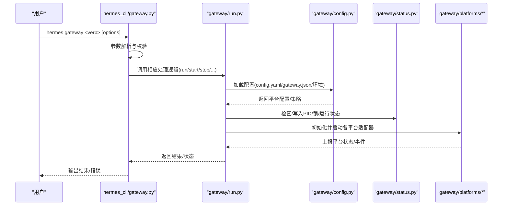
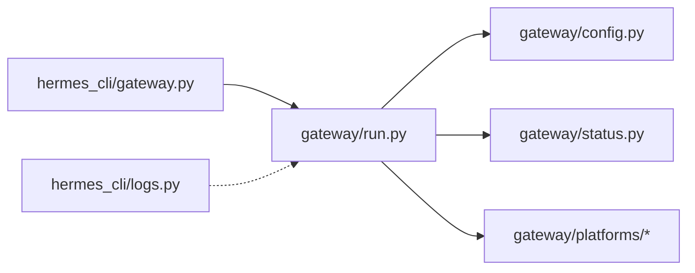

# 网关管理命令

<cite>
**本文档引用的文件**
- [gateway.py](file://hermes_cli/gateway.py)
- [gateway.py](file://hermes_cli/subcommands/gateway.py)
- [run.py](file://gateway/run.py)
- [config.py](file://gateway/config.py)
- [status.py](file://gateway/status.py)
- [telegram.py](file://gateway/platforms/telegram.py)
- [whatsapp.py](file://gateway/platforms/whatsapp.py)
- [logs.py](file://hermes_cli/logs.py)
- [cli-config.yaml.example](file://cli-config.yaml.example)
</cite>

## 目录
1. [简介](#简介)
2. [项目结构](#项目结构)
3. [核心组件](#核心组件)
4. [架构总览](#架构总览)
5. [详细组件分析](#详细组件分析)
6. [依赖关系分析](#依赖关系分析)
7. [性能考虑](#性能考虑)
8. [故障排除指南](#故障排除指南)
9. [结论](#结论)
10. [附录](#附录)

## 简介
本文件系统性阐述 Hermes Agent 网关管理命令（hermes gateway）的功能与使用方法，覆盖启动、停止、重启、状态检查、安装卸载、列表查看、配置迁移、注册登记等完整生命周期管理能力；同时详解网关配置项、运行模式、多平台适配器配置方法（Telegram、Discord、WhatsApp 等），以及日志查看、故障诊断、性能监控与优化建议，并说明网关与外部组件（代理、Relay 连接器、平台适配器）的集成关系。

## 项目结构
网关管理命令由 CLI 子命令解析器与网关运行时两大模块协同实现：
- 命令层：在 hermes_cli 下定义 gateway 子命令及其子操作（run/start/stop/restart/status/install/uninstall/list/setup/migrate-legacy/enroll）
- 运行时层：在 gateway 下实现进程管理、状态持久化、平台适配器加载与调度、流式输出控制等

```mermaid
graph TB
subgraph "CLI 层"
A["hermes_cli/subcommands/gateway.py<br/>命令解析与参数定义"]
B["hermes_cli/gateway.py<br/>进程管理与状态查询"]
C["hermes_cli/logs.py<br/>日志查看工具"]
end
subgraph "网关运行时"
D["gateway/run.py<br/>入口与生命周期管理"]
E["gateway/config.py<br/>配置加载与校验"]
F["gateway/status.py<br/>PID/锁/运行状态"]
G["gateway/platforms/*<br/>平台适配器"]
end
A --> B
B --> D
D --> E
D --> F
D --> G
C -.-> B
```

图表来源
- [gateway.py:32-333](file://hermes_cli/subcommands/gateway.py#L32-L333)
- [gateway.py:1-800](file://hermes_cli/gateway.py#L1-L800)
- [run.py:1-800](file://gateway/run.py#L1-L800)
- [config.py:1-800](file://gateway/config.py#L1-L800)
- [status.py:1-800](file://gateway/status.py#L1-L800)

章节来源
- [gateway.py:32-333](file://hermes_cli/subcommands/gateway.py#L32-L333)
- [gateway.py:1-800](file://hermes_cli/gateway.py#L1-L800)
- [run.py:1-800](file://gateway/run.py#L1-L800)
- [config.py:1-800](file://gateway/config.py#L1-L800)
- [status.py:1-800](file://gateway/status.py#L1-L800)

## 核心组件
- 命令解析与分发：定义 gateway 子命令及 run/start/stop/restart/status/install/uninstall/list/setup/migrate-legacy/enroll 等子操作，绑定到具体处理函数
- 进程管理：扫描/发现/终止网关进程，支持 --replace、--force、--no-supervise 等运行模式
- 状态与锁：通过 PID 文件与跨进程锁确保单实例运行，记录运行状态与平台健康信息
- 配置系统：从 config.yaml/gateway.json/环境变量加载网关配置，支持平台连接检查与会话重置策略
- 平台适配器：按平台类型加载对应适配器（Telegram、Discord、WhatsApp、Signal、Slack、Matrix、WeChat、Webhook 等）

章节来源
- [gateway.py:32-333](file://hermes_cli/subcommands/gateway.py#L32-L333)
- [gateway.py:558-800](file://hermes_cli/gateway.py#L558-L800)
- [status.py:44-800](file://gateway/status.py#L44-L800)
- [config.py:764-800](file://gateway/config.py#L764-L800)
- [run.py:1-800](file://gateway/run.py#L1-L800)

## 架构总览
下图展示命令调用到运行时的端到端流程：

图表来源
- [gateway.py:1-800](file://hermes_cli/gateway.py#L1-L800)
- [run.py:1-800](file://gateway/run.py#L1-L800)
- [config.py:764-800](file://gateway/config.py#L764-L800)
- [status.py:44-800](file://gateway/status.py#L44-L800)

## 详细组件分析

### 命令组：gateway
- 子命令
  - run：前台运行网关（推荐 WSL/Docker/Termux），支持 -v/-q/--replace/--force/--no-supervise
  - start：启动已安装的服务（systemd/launchd），支持 --system/--all
  - stop：停止服务，支持 --system/--all
  - restart：重启服务，支持 --system/--all
  - status：显示状态，支持 --deep/--full/--system
  - install：安装为系统/用户服务，支持 --force/--system/--run-as-user/--start-now/--no-start-now/--start-on-login/--no-start-on-login/--elevated-handoff
  - uninstall：卸载服务，支持 --system
  - list：列出所有配置文件与状态
  - setup：配置消息平台
  - migrate-legacy：清理旧版 hermes.service 单元
  - enroll：与 Relay 连接器登记，写入网关凭据到 .env
- 兼容性标志：保留历史 --platform 参数解析，避免旧文档误导

章节来源
- [gateway.py:32-333](file://hermes_cli/subcommands/gateway.py#L32-L333)

### 进程管理与运行模式
- 扫描与发现：跨平台扫描进程表，识别网关进程（含 Windows/Posix 差异），过滤祖先链避免误判
- 替换与接管：--replace 使用原子 PID 文件与锁机制，竞态时仅一个进程成功接管
- 强制终止：支持 SIGTERM/SIGKILL 或 Windows taskkill，兼容强制模式
- 服务集成：在 s6 容器中默认重定向至受监督服务，支持 --no-supervise 回退到传统前台行为
- 优雅重启：向进程发送 SIGUSR1 触发“冲刷式”重启，等待在途任务完成后再退出

章节来源
- [gateway.py:558-800](file://hermes_cli/gateway.py#L558-L800)
- [status.py:76-101](file://gateway/status.py#L76-L101)
- [status.py:425-458](file://gateway/status.py#L425-L458)

### 状态与锁机制
- PID 文件：记录进程 PID、启动时间、argv 等元数据，用于进程存在性与身份验证
- 运行状态文件：持久化 gateway_state、exit_reason、restart_requested、活跃代理数、平台状态等
- 跨进程锁：防止同一外部身份（如 Telegram Bot Token）被多个本地网关同时使用
- 健康检查：支持 deep/full 状态输出，结合平台上报状态进行诊断

章节来源
- [status.py:44-800](file://gateway/status.py#L44-L800)

### 配置系统与运行策略
- 配置来源优先级：环境变量 > ~/.hermes/config.yaml > ~/.hermes/gateway.json > 内置默认
- 平台配置：启用/禁用、令牌、额外参数、Home Channel、回复线程模式、重启通知开关
- 会话重置策略：支持 daily/idle/both/none，可按平台或会话类型覆盖
- 流式传输：统一的流式编辑间隔、缓冲阈值、光标样式、新鲜最终消息替换策略
- 连接检查：内置平台连接检查器，覆盖 Weixin、WhatsApp、WhatsApp Cloud、Signal、Email、SMS、API Server、Webhook、MS Graph Webhook、Feishu、WeCom、Bluebubbles、QQBot、Yuanbao、DingTalk、Relay 等

章节来源
- [config.py:764-800](file://gateway/config.py#L764-L800)
- [config.py:506-762](file://gateway/config.py#L506-L762)

### 平台适配器与配置要点
- Telegram：依赖 python-telegram-bot，支持 MarkdownV2 转义、富文本消息、链接预览控制、命令处理、媒体缓存
- WhatsApp：通过 Node.js 桥接（whatsapp-web.js/Baileys），支持端口占用清理、桥接进程管理、脚本哈希校验
- 其他平台：Discord、Slack、Signal、Matrix、WeChat、Webhook、MS Graph Webhook、Feishu、WeCom、Bluebubbles、QQBot、Yuanbao、DingTalk 等均以适配器形式接入

章节来源
- [telegram.py:1-200](file://gateway/platforms/telegram.py#L1-L200)
- [whatsapp.py:1-200](file://gateway/platforms/whatsapp.py#L1-L200)

### 日志查看与故障诊断
- 日志文件：agent.log、errors.log、gateway.log、gui.log、desktop.log
- 过滤能力：级别过滤（DEBUG/INFO/WARNING/ERROR/CRITICAL）、会话过滤、组件前缀过滤、相对时间范围
- 实时跟踪：支持 -f 实时跟随输出
- 建议排查路径：先看 gateway.log 的平台状态与错误码，再结合平台适配器日志定位问题

章节来源
- [logs.py:1-200](file://hermes_cli/logs.py#L1-L200)

### 性能监控与优化
- 会话并发限制：通过 max_concurrent_sessions 控制同时活跃聊天会话数量
- 会话存储修剪：按天数上限清理过期会话条目，避免内存无限增长
- 流式传输优化：合理设置 edit_interval/buffer_threshold，减少平台限流风险
- 连接超时与重试：根据平台特性调整请求超时与重试策略，降低抖动影响

章节来源
- [config.py:546-560](file://gateway/config.py#L546-L560)
- [run.py:412-465](file://gateway/run.py#L412-L465)

### 与其他组件的集成
- 代理（proxy）：本地 OpenAI 兼容代理，附加 OAuth 凭证转发，供外部应用使用
- Relay 连接器：实验性 enroll 功能，登记网关凭据并写入 .env，实现安全的远端交付密钥
- 平台适配器：统一接口对接 Telegram、Discord、WhatsApp 等，支持扩展插件

章节来源
- [gateway.py:288-333](file://hermes_cli/subcommands/gateway.py#L288-L333)
- [gateway.py:241-285](file://hermes_cli/subcommands/gateway.py#L241-L285)

## 依赖关系分析
- 命令层依赖运行时层的进程管理与状态接口
- 运行时层依赖配置系统与平台适配器
- 平台适配器依赖各自生态（如 Telegram 的 python-telegram-bot）
- 日志工具独立于网关运行时，提供统一的日志查看能力

图表来源
- [gateway.py:1-800](file://hermes_cli/gateway.py#L1-L800)
- [run.py:1-800](file://gateway/run.py#L1-L800)
- [config.py:1-800](file://gateway/config.py#L1-L800)
- [status.py:1-800](file://gateway/status.py#L1-L800)
- [logs.py:1-200](file://hermes_cli/logs.py#L1-L200)

## 性能考虑
- 合理设置会话并发上限，避免资源争用
- 利用会话存储修剪策略控制内存占用
- 在高噪声平台（如 Slack/Mattermost）谨慎开启自动重启通知
- 通过流式传输参数平衡实时性与平台限流

## 故障排除指南
- 网关无法启动
  - 查看 gateway.log 中的启动失败原因与平台错误码
  - 使用 hermes gateway status --deep 检查服务状态与锁文件
- 多实例冲突
  - 检查跨进程锁文件是否残留，必要时手动清理
  - 使用 --replace 重新接管，确保原子 PID 文件竞争成功
- 平台连接异常
  - 核对 config.yaml 中平台令牌与额外参数
  - 使用平台连接检查器确认配置完整性
- 重启后上下文丢失
  - 检查会话重置策略（daily/idle/both/none）与触发条件
  - 关注流式传输参数是否导致消息截断

章节来源
- [status.py:425-800](file://gateway/status.py#L425-L800)
- [config.py:561-604](file://gateway/config.py#L561-L604)
- [logs.py:142-200](file://hermes_cli/logs.py#L142-L200)

## 结论
hermes gateway 提供了完整的网关生命周期管理、稳健的状态与锁机制、灵活的配置体系与多平台适配能力。通过合理的配置与运维实践，可在多平台环境中稳定运行并高效交付消息代理服务。建议在生产环境启用 --no-supervise 与 --replace 等选项时配合监控与告警，确保可观测性与可恢复性。

## 附录

### 常用命令速查
- 启动：hermes gateway run [-v|-q] [--replace|--force|--no-supervise]
- 停止：hermes gateway stop [--system|--all]
- 重启：hermes gateway restart [--system|--all]
- 状态：hermes gateway status [--deep|--full|--system]
- 安装：hermes gateway install [--force|--system|--run-as-user=...]
- 卸载：hermes gateway uninstall [--system]
- 列表：hermes gateway list
- 配置：hermes gateway setup
- 迁移：hermes gateway migrate-legacy [--dry-run|-y]
- 登记：hermes gateway enroll [--token=... --connector-url=... --gateway-id=...]

章节来源
- [gateway.py:32-333](file://hermes_cli/subcommands/gateway.py#L32-L333)

### 配置参考（节选）
- 模型与推理：见 cli-config.yaml.example 中 model/agent/streaming 等段落
- 平台工具集：platform_toolsets 可按平台定制可用工具集合
- 会话重置：session_reset 支持 daily/idle/both/none 模式
- 并发与隔离：max_concurrent_sessions、group_sessions_per_user 等

章节来源
- [cli-config.yaml.example:518-560](file://cli-config.yaml.example#L518-L560)
- [cli-config.yaml.example:699-711](file://cli-config.yaml.example#L699-L711)
- [config.py:517-560](file://gateway/config.py#L517-L560)