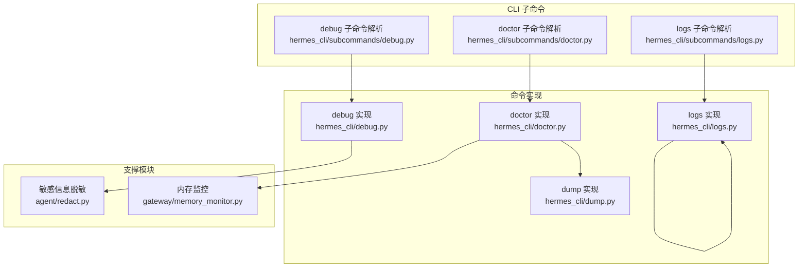
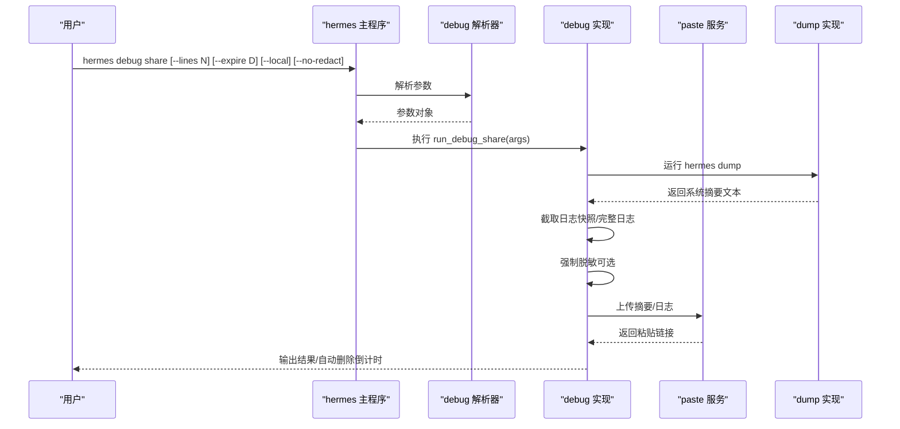
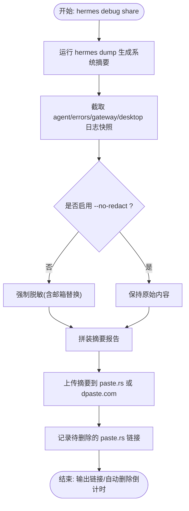
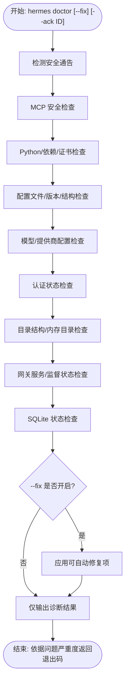
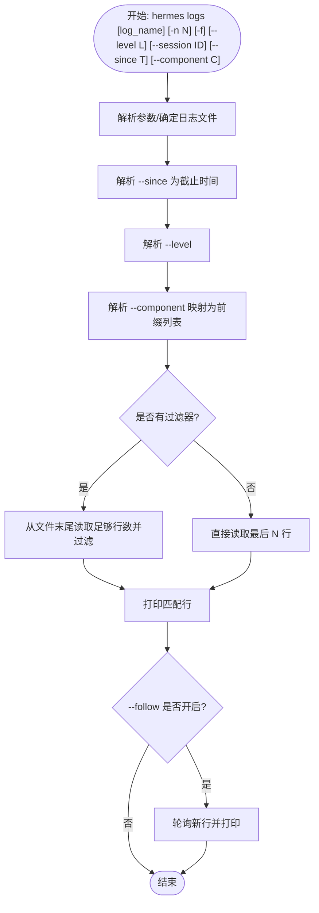
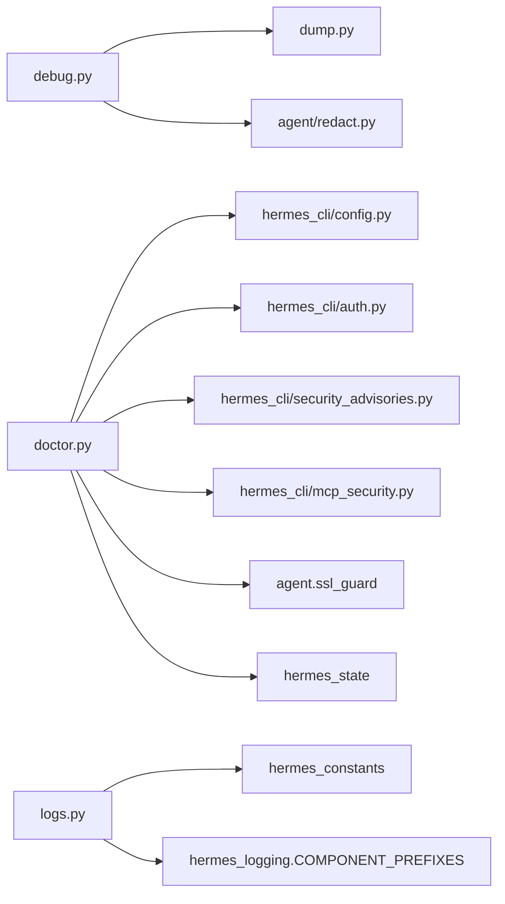

# 调试与诊断命令

<cite>
**本文档引用的文件**
- [hermes_cli/subcommands/debug.py](file://hermes_cli/subcommands/debug.py)
- [hermes_cli/debug.py](file://hermes_cli/debug.py)
- [hermes_cli/subcommands/doctor.py](file://hermes_cli/subcommands/doctor.py)
- [hermes_cli/doctor.py](file://hermes_cli/doctor.py)
- [hermes_cli/subcommands/logs.py](file://hermes_cli/subcommands/logs.py)
- [hermes_cli/logs.py](file://hermes_cli/logs.py)
- [hermes_cli/dump.py](file://hermes_cli/dump.py)
- [agent/redact.py](file://agent/redact.py)
- [gateway/memory_monitor.py](file://gateway/memory_monitor.py)
- [tests/test_hermes_logging.py](file://tests/test_hermes_logging.py)
- [tests/gateway/test_memory_monitor.py](file://tests/gateway/test_memory_monitor.py)
- [website/i18n/zh-Hans/docusaurus-plugin-content-docs/current/reference/cli-commands.md](file://website/i18n/zh-Hans/docusaurus-plugin-content-docs/current/reference/cli-commands.md)
</cite>

## 目录
1. [简介](#简介)
2. [项目结构](#项目结构)
3. [核心组件](#核心组件)
4. [架构总览](#架构总览)
5. [详细组件分析](#详细组件分析)
6. [依赖关系分析](#依赖关系分析)
7. [性能考虑](#性能考虑)
8. [故障排除指南](#故障排除指南)
9. [结论](#结论)
10. [附录](#附录)

## 简介
本文件系统化梳理 Hermes Agent 的调试与诊断能力，覆盖以下三大命令族：
- debug 命令组：用于生成并上传调试报告（系统信息 + 日志），支持本地预览、自动清理、隐私保护与粘贴服务回传链接。
- doctor 命令：对配置、依赖、认证、目录结构、证书、网关服务等进行系统性健康检查，并可自动修复可处理的问题。
- logs 命令：实时查看与过滤 agent.log、errors.log、gateway.log、gui.log、desktop.log，支持按级别、会话、组件、时间范围筛选。

同时，文档补充了内存监控、性能分析与常见问题排查的最佳实践，帮助用户快速定位与解决运行中的异常。

## 项目结构
围绕调试与诊断的核心文件组织如下：
- 子命令解析器：位于 hermes_cli/subcommands 下，负责参数定义与帮助信息展示。
- 命令实现：位于 hermes_cli 下，包含具体逻辑（上传、诊断、日志读取等）。
- 支撑模块：agent/redact.py 提供敏感信息脱敏；gateway/memory_monitor.py 提供进程内存周期性记录。
- 测试与文档：tests 下的单元测试验证日志格式与内存监控行为；网站文档提供 CLI 参考示例。

**图表来源**
- [hermes_cli/subcommands/debug.py:13-77](file://hermes_cli/subcommands/debug.py#L13-L77)
- [hermes_cli/debug.py:588-800](file://hermes_cli/debug.py#L588-L800)
- [hermes_cli/subcommands/doctor.py:12-36](file://hermes_cli/subcommands/doctor.py#L12-L36)
- [hermes_cli/doctor.py:465-503](file://hermes_cli/doctor.py#L465-L503)
- [hermes_cli/subcommands/logs.py:13-79](file://hermes_cli/subcommands/logs.py#L13-L79)
- [hermes_cli/logs.py:142-251](file://hermes_cli/logs.py#L142-L251)
- [agent/redact.py:327-428](file://agent/redact.py#L327-L428)
- [gateway/memory_monitor.py:1-30](file://gateway/memory_monitor.py#L1-L30)

**章节来源**
- [hermes_cli/subcommands/debug.py:13-77](file://hermes_cli/subcommands/debug.py#L13-L77)
- [hermes_cli/subcommands/doctor.py:12-36](file://hermes_cli/subcommands/doctor.py#L12-L36)
- [hermes_cli/subcommands/logs.py:13-79](file://hermes_cli/subcommands/logs.py#L13-L79)

## 核心组件
- debug 命令组
  - 子命令：share（上传调试报告）、delete（删除已上传的粘贴）。
  - 功能：收集系统信息（版本、平台、模型、终端后端等）、最近日志快照、完整日志片段；上传至 paste.rs 或 dpaste.com；自动记录并定时清理粘贴链接。
  - 隐私保护：默认强制脱敏（force=True），并在公共粘贴中标注脱敏提示；支持 --no-redact 关闭。
- doctor 命令
  - 功能：安全通告检查、MCP 安全校验、Python 环境、依赖包、配置文件、模型/提供商配置、认证状态、目录结构、SQLite 数据库、网关服务、证书、内存目录等。
  - 自动修复：在 --fix 模式下尝试创建缺失文件/目录、迁移配置、移除陈旧键值等。
- logs 命令
  - 功能：查看 agent.log、errors.log、gateway.log、gui.log、desktop.log；支持 -n 行数、-f 实时跟踪、--level 级别过滤、--session 会话过滤、--since 时间范围、--component 组件过滤、list 列表。
  - 性能：大文件采用从末尾分块读取策略，避免全量扫描。

**章节来源**
- [hermes_cli/debug.py:588-800](file://hermes_cli/debug.py#L588-L800)
- [hermes_cli/doctor.py:465-503](file://hermes_cli/doctor.py#L465-L503)
- [hermes_cli/logs.py:142-251](file://hermes_cli/logs.py#L142-L251)

## 架构总览
调试与诊断命令通过子命令解析器绑定到主 CLI，再由各实现模块完成具体任务。debug 与 doctor 依赖 dump 生成系统摘要；debug 依赖 redact 对日志进行脱敏；doctor 依赖内存监控模块输出内存指标；logs 读取 ~/.hermes/logs 下日志文件。

**图表来源**
- [hermes_cli/subcommands/debug.py:35-77](file://hermes_cli/subcommands/debug.py#L35-L77)
- [hermes_cli/debug.py:694-774](file://hermes_cli/debug.py#L694-L774)
- [hermes_cli/dump.py:243-404](file://hermes_cli/dump.py#L243-L404)

## 详细组件分析

### debug 命令组
- 参数与行为
  - --lines：每个日志文件包含的行数，默认 200。
  - --expire：粘贴过期天数，默认 7。
  - --local：仅本地打印报告，不上传。
  - --no-redact：关闭上传时的强制脱敏。
  - delete：删除 paste.rs 已上传的粘贴（dpaste.com 不支持 API 删除）。
- 报告组成
  - 系统摘要：版本、平台、Python、OpenAI SDK、配置文件位置、模型/提供商、终端后端、API Key 状态、特性统计、配置覆盖项等。
  - 日志快照：agent.log、errors.log、gateway.log、desktop.log 的最近若干行。
  - 完整日志：agent.log、gateway.log、desktop.log 的上限约 512KB 内容。
- 上传与清理
  - 优先 paste.rs，失败回退 dpaste.com；记录待删除的 paste.rs 链接，由网关定时任务或本地清理函数定期删除。
  - 本地模式下同样执行收集与脱敏，但不进行网络调用。
- 隐私与脱敏
  - 默认强制脱敏（force=True），覆盖用户全局设置；邮件地址也进行替换。
  - 公共粘贴前缀标注脱敏提示，便于审查者理解。

**图表来源**
- [hermes_cli/debug.py:535-691](file://hermes_cli/debug.py#L535-L691)
- [hermes_cli/dump.py:243-404](file://hermes_cli/dump.py#L243-L404)
- [agent/redact.py:327-428](file://agent/redact.py#L327-L428)

**章节来源**
- [hermes_cli/subcommands/debug.py:35-77](file://hermes_cli/subcommands/debug.py#L35-L77)
- [hermes_cli/debug.py:588-800](file://hermes_cli/debug.py#L588-L800)
- [website/i18n/zh-Hans/docusaurus-plugin-content-docs/current/reference/cli-commands.md:569-594](file://website/i18n/zh-Hans/docusaurus-plugin-content-docs/current/reference/cli-commands.md#L569-L594)

### doctor 命令
- 检查维度
  - 安全通告：检测已受威胁的包并给出修复建议。
  - MCP 安全：检查 MCP stdio 命令是否存在可疑项。
  - Python 环境：版本要求、虚拟环境状态、版本一致性。
  - 证书：CA 证书有效性。
  - 必需/可选依赖：SDK、UI、配置相关模块。
  - 配置文件：~/.hermes/.env、~/.hermes/config.yaml 的存在与结构、版本迁移、陈旧键值、迭代预算漂移。
  - 模型/提供商：model.provider 与 model.default 的一致性与合法性。
  - 认证状态：多提供商 OAuth 登录状态。
  - 目录结构：~/.hermes 下关键子目录存在性与初始化。
  - 内存目录：memories 子目录及 MEMORY.md/USER.md。
  - 网关服务：systemd linger、容器内 s6 监督状态。
  - SQLite：state.db 存在性与会话数量。
- 自动修复
  - 创建缺失文件/目录、复制示例配置、迁移配置版本、移除陈旧键值、移除 .env 中的漂移项等。
- 退出码与反馈
  - 成功：返回 0；失败：返回非 0 并提示修复步骤。

**图表来源**
- [hermes_cli/doctor.py:465-503](file://hermes_cli/doctor.py#L465-L503)
- [hermes_cli/doctor.py:883-945](file://hermes_cli/doctor.py#L883-L945)

**章节来源**
- [hermes_cli/subcommands/doctor.py:12-36](file://hermes_cli/subcommands/doctor.py#L12-L36)
- [hermes_cli/doctor.py:465-503](file://hermes_cli/doctor.py#L465-L503)

### logs 命令
- 支持的日志文件：agent、errors、gateway、gui、desktop。
- 关键参数
  - -n/--lines：显示行数，默认 50。
  - -f/--follow：实时跟踪新日志。
  - --level：最小日志级别（DEBUG/INFO/WARNING/ERROR/CRITICAL）。
  - --session：按会话 ID 子串过滤。
  - --since：相对时间范围（如 1h、30m、2d）。
  - --component：按组件前缀过滤（如 gateway、tools、cli、cron、gui）。
  - list：列出可用日志文件及其大小与修改时间。
- 实现要点
  - 从末尾分块读取大文件，避免全量扫描。
  - 正则提取时间戳、级别、组件名，进行多条件过滤。
  - 实时跟踪采用轮询 + 行读取，遇到空行短暂休眠。

**图表来源**
- [hermes_cli/subcommands/logs.py:39-78](file://hermes_cli/subcommands/logs.py#L39-L78)
- [hermes_cli/logs.py:142-251](file://hermes_cli/logs.py#L142-L251)
- [hermes_cli/logs.py:282-335](file://hermes_cli/logs.py#L282-L335)

**章节来源**
- [hermes_cli/subcommands/logs.py:13-79](file://hermes_cli/subcommands/logs.py#L13-L79)
- [hermes_cli/logs.py:142-251](file://hermes_cli/logs.py#L142-L251)

## 依赖关系分析
- debug 依赖
  - hermes_cli/dump.py：生成系统摘要。
  - agent/redact.py：强制脱敏（force=True）。
  - hermes_constants/utils：路径解析与原子写入。
- doctor 依赖
  - hermes_cli/config/env_loader：加载 .env 与 config.yaml。
  - hermes_cli.auth/security_advisories/mcp_security：认证与安全检查。
  - hermes_cli.gateway/service_manager：网关服务与监督状态。
  - agent.ssl_guard：证书有效性检查。
  - hermes_state：SQLite 数据库修复。
- logs 依赖
  - hermes_constants：日志目录解析。
  - hermes_logging.COMPONENT_PREFIXES：组件前缀映射。

**图表来源**
- [hermes_cli/debug.py:518-532](file://hermes_cli/debug.py#L518-L532)
- [hermes_cli/doctor.py:17-28](file://hermes_cli/doctor.py#L17-L28)
- [hermes_cli/logs.py:198-204](file://hermes_cli/logs.py#L198-L204)

**章节来源**
- [hermes_cli/debug.py:518-532](file://hermes_cli/debug.py#L518-L532)
- [hermes_cli/doctor.py:17-28](file://hermes_cli/doctor.py#L17-L28)
- [hermes_cli/logs.py:198-204](file://hermes_cli/logs.py#L198-L204)

## 性能考虑
- 日志读取
  - 小于 1MB 文件：一次性读取，简单高效。
  - 大于 1MB 文件：从末尾分块读取，逐步合并并解码，避免全量 IO。
- 脱敏性能
  - 使用“子串预检 + 正则”的组合，减少正则匹配次数；对无匹配输入直接跳过。
  - 对常见模式（前缀、JWT、数据库连接串、Telegram Token、电话号码）分别优化。
- 内存监控
  - 网关长期运行进程，周期性记录 RSS、GC、线程数、运行时长，便于发现缓慢泄漏。
  - 监控线程为守护线程，不影响进程退出。
- 建议
  - 优先使用 --level 与 --component 过滤缩小日志规模。
  - 大量日志分析时，先用 --since 缩短时间窗口，再配合 --session 精确过滤。
  - 合理设置 --lines，避免一次性传输过多日志导致上传耗时。

**章节来源**
- [hermes_cli/logs.py:282-335](file://hermes_cli/logs.py#L282-L335)
- [agent/redact.py:327-428](file://agent/redact.py#L327-L428)
- [gateway/memory_monitor.py:1-30](file://gateway/memory_monitor.py#L1-L30)
- [tests/gateway/test_memory_monitor.py:1-122](file://tests/gateway/test_memory_monitor.py#L1-L122)

## 故障排除指南
- debug 无法上传
  - 现象：提示上传失败，建议使用 --local 查看报告。
  - 排查：网络不可达、paste.rs/dpaste.com 服务异常；检查代理与 DNS。
  - 处理：改用 --local 本地查看；必要时手动删除 paste.rs 链接（仅限 paste.rs）。
- doctor 报错“版本不一致”
  - 现象：pyproject.toml 与 __version__ 不一致。
  - 处理：同步版本文件或重新安装。
- doctor 报错“config.yaml 版本过旧”
  - 现象：提示需要迁移。
  - 处理：hermes doctor --fix 或 hermes setup 自动迁移。
- doctor 发现“stale root-level provider/base_url”
  - 现象：根级 provider/base_url 已废弃。
  - 处理：hermes doctor --fix 将其迁移到 model: 下。
- doctor 发现“HERMES_MAX_ITERATIONS 陈旧”
  - 现象：.env 中的该变量与 config.yaml 冲突。
  - 处理：hermes doctor --fix 移除 .env 中的陈旧项。
- logs 无法找到日志文件
  - 现象：首次运行未产生日志。
  - 处理：先执行 hermes chat 生成日志；确认 ~/.hermes/logs 目录存在。
- logs 实时跟踪卡顿
  - 现象：--follow 模式 CPU 占用较高。
  - 处理：增加 --since 缩小范围；使用 --level 与 --component 进一步过滤。
- 内存增长异常
  - 现象：RSS 持续上升。
  - 处理：启用内存监控（默认配置），观察 [MEMORY] 日志；结合 --level=DEBUG 分析热点模块；必要时重启网关。

**章节来源**
- [hermes_cli/debug.py:747-756](file://hermes_cli/debug.py#L747-L756)
- [hermes_cli/doctor.py:233-258](file://hermes_cli/doctor.py#L233-L258)
- [hermes_cli/doctor.py:883-907](file://hermes_cli/doctor.py#L883-L907)
- [hermes_cli/doctor.py:909-945](file://hermes_cli/doctor.py#L909-L945)
- [hermes_cli/doctor.py:947-1002](file://hermes_cli/doctor.py#L947-L1002)
- [hermes_cli/logs.py:176-180](file://hermes_cli/logs.py#L176-L180)
- [gateway/memory_monitor.py:1-30](file://gateway/memory_monitor.py#L1-L30)

## 结论
- debug 命令组提供了标准化的“问题上报”流程，兼顾隐私与可追溯性，适合一线支持与自助排障。
- doctor 命令实现了“自诊断 + 自修复”的闭环，能覆盖配置、依赖、认证、证书、网关等多个关键面。
- logs 命令以高性能与灵活过滤满足日常运维与问题定位需求。
- 结合内存监控与脱敏机制，整体形成“可观测、可诊断、可修复”的调试体系。

## 附录
- 常用命令速查
  - hermes debug share [--lines N] [--expire D] [--local] [--no-redact]
  - hermes debug delete <url>...
  - hermes doctor [--fix] [--ack <ID>]
  - hermes logs [agent|errors|gateway|gui|desktop|list] [-n N] [-f] [--level L] [--session ID] [--since T] [--component NAME]
- 最佳实践
  - 问题复现时先用 logs --since 1h --level WARNING 定位异常时段。
  - 复杂问题用 debug share --lines 500 生成完整上下文，必要时 --no-redact 以便开发者进一步分析。
  - 定期运行 doctor --fix 保持配置与依赖最新。
  - 长期运行的服务开启内存监控，关注 [MEMORY] RSS 趋势。