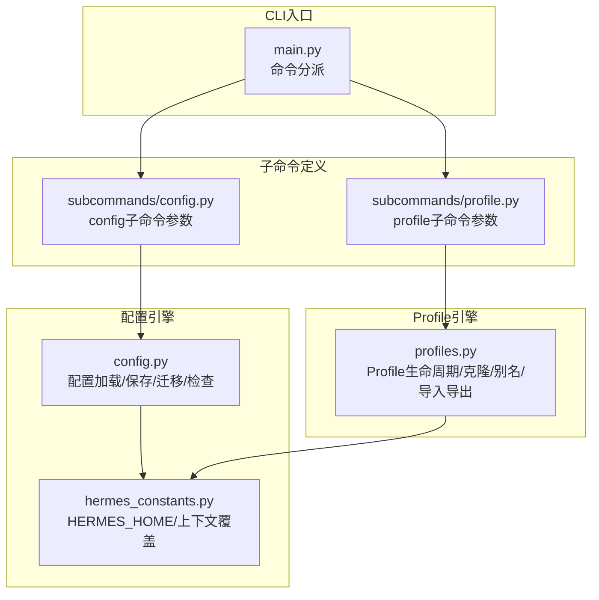
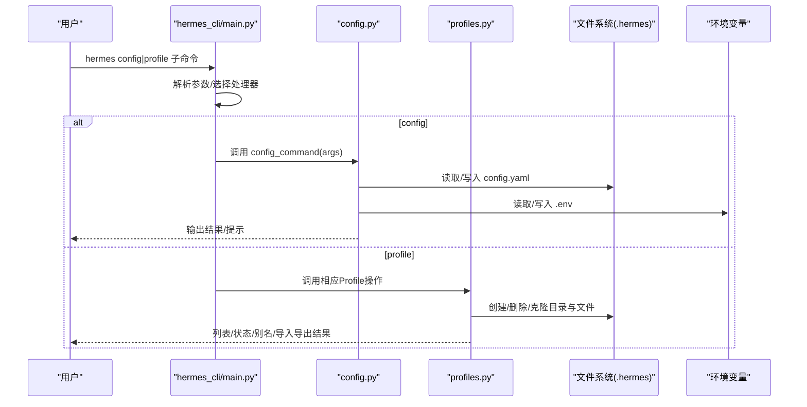
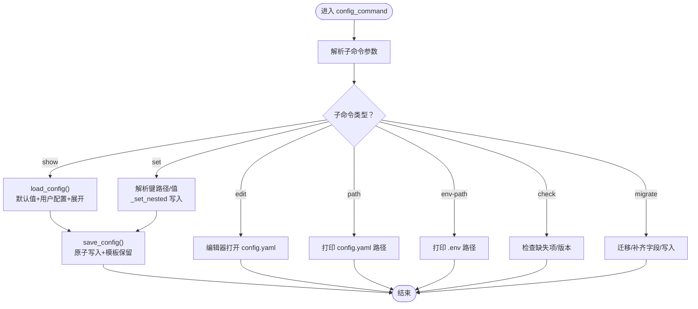
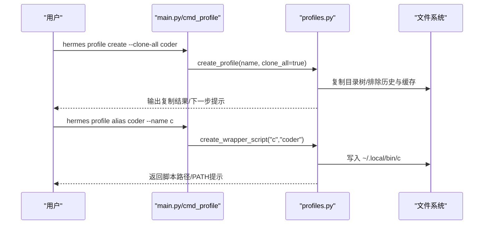
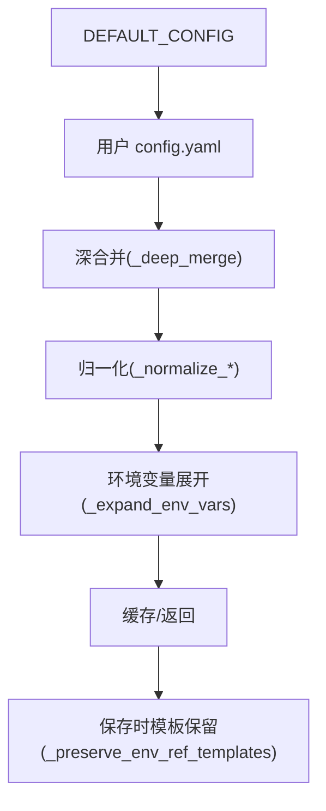
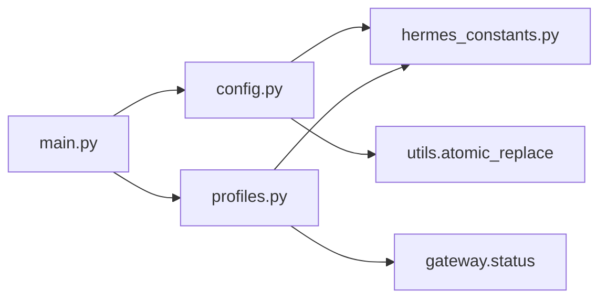

# 配置管理命令

<cite>
**本文档引用的文件**
- [hermes_cli/subcommands/config.py](file://hermes_cli/subcommands/config.py)
- [hermes_cli/subcommands/profile.py](file://hermes_cli/subcommands/profile.py)
- [hermes_cli/config.py](file://hermes_cli/config.py)
- [hermes_cli/profiles.py](file://hermes_cli/profiles.py)
- [hermes_cli/main.py](file://hermes_cli/main.py)
- [hermes_constants.py](file://hermes_constants.py)
</cite>

## 目录
1. [简介](#简介)
2. [项目结构](#项目结构)
3. [核心组件](#核心组件)
4. [架构总览](#架构总览)
5. [详细组件分析](#详细组件分析)
6. [依赖关系分析](#依赖关系分析)
7. [性能考虑](#性能考虑)
8. [故障排除指南](#故障排除指南)
9. [结论](#结论)

## 简介
本文件系统性阐述 Hermes Agent 的配置管理命令体系，重点覆盖以下内容：
- config 命令组：配置查看、编辑、设置、路径查询、环境检查与迁移等能力
- profile 命令组：多实例配置（Profile）的创建、切换、删除、描述、别名、导入导出、分发安装与更新等
- 配置文件结构与字段含义：模型设置、工具配置、界面选项、终端桥接、安全与回退策略等
- 配置迁移与备份：版本迁移、增量补齐、环境变量注入、备份与恢复
- 配置验证与故障排除：解析失败保护、权限与容器模式、denylist 安全策略
- 配置继承与覆盖规则：默认值合并、环境变量扩展、模板保留策略

## 项目结构
配置管理相关代码主要分布在以下模块：
- 子命令定义：用于注册 config 与 profile 的子命令参数与帮助信息
- 命令处理器：在主入口中分派到具体实现
- 配置引擎：负责配置加载、校验、迁移、保存与环境变量处理
- Profile 引擎：负责多实例隔离、克隆、别名、导入导出、分发安装与更新

**图表来源**
- [hermes_cli/main.py:4224-4229](file://hermes_cli/main.py#L4224-L4229)
- [hermes_cli/subcommands/config.py:12-49](file://hermes_cli/subcommands/config.py#L12-L49)
- [hermes_cli/subcommands/profile.py:12-203](file://hermes_cli/subcommands/profile.py#L12-L203)
- [hermes_cli/config.py:5329-5633](file://hermes_cli/config.py#L5329-L5633)
- [hermes_cli/profiles.py:784-800](file://hermes_cli/profiles.py#L784-L800)
- [hermes_constants.py:53-108](file://hermes_constants.py#L53-L108)

**章节来源**
- [hermes_cli/subcommands/config.py:12-49](file://hermes_cli/subcommands/config.py#L12-L49)
- [hermes_cli/subcommands/profile.py:12-203](file://hermes_cli/subcommands/profile.py#L12-L203)
- [hermes_cli/main.py:4224-4229](file://hermes_cli/main.py#L4224-L4229)

## 核心组件
- config 子命令组
  - show：显示当前配置（含默认值与环境变量展开）
  - edit：在编辑器中打开配置文件
  - set：设置单个配置键值
  - path/env-path：打印配置文件与 .env 文件路径
  - check：检查缺失项与过时配置
  - migrate：将新版本新增字段写入配置并迁移旧字段
- profile 子命令组
  - list/use/create/delete/show：列出、设置默认、创建、删除、显示详情
  - describe/alias/rename：描述、别名管理、重命名
  - export/import：导出归档、从归档导入
  - install/update/info：从源安装分发、更新分发、查看清单
  - 克隆选项：--clone/--clone-all/--clone-from、--no-alias/--no-skills、--description

上述命令均由主入口分派至对应处理器，并通过配置与 Profile 引擎完成具体逻辑。

**章节来源**
- [hermes_cli/subcommands/config.py:12-49](file://hermes_cli/subcommands/config.py#L12-L49)
- [hermes_cli/subcommands/profile.py:12-203](file://hermes_cli/subcommands/profile.py#L12-L203)
- [hermes_cli/main.py:4224-4229](file://hermes_cli/main.py#L4224-L4229)
- [hermes_cli/main.py:10107-10150](file://hermes_cli/main.py#L10107-L10150)

## 架构总览
配置与 Profile 的运行时交互如下：

**图表来源**
- [hermes_cli/main.py:4224-4229](file://hermes_cli/main.py#L4224-L4229)
- [hermes_cli/config.py:5329-5633](file://hermes_cli/config.py#L5329-L5633)
- [hermes_cli/profiles.py:784-800](file://hermes_cli/profiles.py#L784-L800)

## 详细组件分析

### config 命令组详解
- 命令与行为
  - show：输出当前合并后的配置视图（默认值 + 用户覆盖 + 环境变量展开）
  - edit：调用系统编辑器打开 config.yaml
  - set：支持点号路径键（如 model.default），自动创建嵌套结构并保存
  - path/env-path：打印 config.yaml 与 .env 的绝对路径
  - check：非交互式检查，列出缺失的必填/可选环境变量与新增配置字段
  - migrate：交互式或非交互式地补齐缺失字段、迁移旧字段、写入默认注释段落
- 关键机制
  - 加载流程：读取默认配置 → 合并用户配置 → 归一化（根级键迁移、turns迁移）→ 展开环境变量 → 缓存
  - 保存流程：规范化 → 模板保留（对 ${VAR} 占位符进行保护）→ 原子写入 → 设置安全权限
  - 环境变量：严格白名单注入（平台插件、Provider 插件声明），并有 denylist 限制危险变量
  - 错误处理：解析失败时记录日志并在 stderr 提示，同时保留 .bak 备份以防数据丢失
- 使用建议
  - 优先使用 hermes config set 进行细粒度修改，避免手改导致 YAML 语法错误
  - 使用 hermes config check 定期检查缺失项，再执行 hermes config migrate 自动补齐
  - 对于敏感值，尽量通过 .env 注入而非直接写入 config.yaml

**图表来源**
- [hermes_cli/config.py:6361-6496](file://hermes_cli/config.py#L6361-L6496)
- [hermes_cli/config.py:5329-5633](file://hermes_cli/config.py#L5329-L5633)

**章节来源**
- [hermes_cli/subcommands/config.py:12-49](file://hermes_cli/subcommands/config.py#L12-L49)
- [hermes_cli/config.py:5329-5633](file://hermes_cli/config.py#L5329-L5633)
- [hermes_cli/config.py:6361-6496](file://hermes_cli/config.py#L6361-L6496)

### profile 命令组详解
- 命令与行为
  - list/use：列出所有 Profile 并显示当前活跃 Profile；use 可设置“粘性默认”
  - create：创建新 Profile，支持 --clone/--clone-all/--clone-from、--no-alias/--no-skills、--description
  - delete：删除指定 Profile（可跳过确认）
  - show：展示 Profile 详情（模型、网关状态、技能数、别名、分发信息）
  - describe：读取/设置 Profile 描述（支持自动生成与覆盖策略）
  - alias：为 Profile 创建/移除别名脚本，支持自定义别名名称
  - rename：重命名 Profile
  - export/import：导出为归档或从归档导入
  - install/update/info：从 git 或本地目录安装分发，更新分发并保留用户数据，查看清单
- 关键机制
  - 默认 Profile：~/.hermes 作为内置 default；其他 Profile 存放于 ~/.hermes/profiles/<name>/
  - 名称规范：小写字母数字，连字符与下划线，长度限制；保留名与子命令冲突检测
  - 克隆策略：--clone 复制 config.yaml/.env/SOUL.md 与 skills；--clone-all 复制大部分内容但排除会话历史与快照
  - 分发安装：从 distribution.yaml 读取元信息，支持覆盖名称与强制覆盖
  - 别名脚本：在 ~/.local/bin 下创建可执行脚本，Windows 使用 .bat；检测 PATH 并给出提示
- 使用建议
  - 使用 --clone 保持配置一致性，使用 --clone-all 获取完整状态副本（不包含历史）
  - 通过 describe 为不同角色的 Profile 添加描述，便于任务路由
  - 导出/导入用于跨设备迁移或团队共享

**图表来源**
- [hermes_cli/main.py:10107-10299](file://hermes_cli/main.py#L10107-L10299)
- [hermes_cli/profiles.py:784-800](file://hermes_cli/profiles.py#L784-L800)

**章节来源**
- [hermes_cli/subcommands/profile.py:12-203](file://hermes_cli/subcommands/profile.py#L12-L203)
- [hermes_cli/main.py:10107-10299](file://hermes_cli/main.py#L10107-L10299)
- [hermes_cli/profiles.py:784-800](file://hermes_cli/profiles.py#L784-L800)

### 配置文件结构与字段含义
- 位置与权限
  - config.yaml：主配置文件，位于 ~/.hermes/config.yaml；首次访问确保目录存在并设置安全权限
  - .env：密钥与凭证，位于 ~/.hermes/.env；读取时进行行清理以修复拼接与占位符问题
- 关键字段类别
  - 模型设置：model.default、model.provider、model.base_url、model.context_length 等；支持根级键向 model 段迁移
  - 工具与技能：tools.*、skills.*、plugins.* 等；可通过技能元数据声明额外配置项
  - 界面与显示：display.*（如 interface、statusbar、tool_progress_command 等）
  - 终端桥接：terminal.* 映射到环境变量（如 TERMINAL_ENV、TERMINAL_TIMEOUT 等）
  - 安全与回退：security.*（如 redact_secrets）、fallback_model.*（自动回退链）
  - 其他：agent.max_turns、plugins.enabled、mcp.* 等
- 字段继承与覆盖
  - 默认值来自 DEFAULT_CONFIG，用户配置通过深合并覆盖
  - 环境变量展开：字符串中的 ${VAR} 在加载时展开，保存时若原始为模板则保留
  - 模板保留策略：当用户仅修改无关字段时，保持原配置中的 ${VAR} 模板不被明文写回

**章节来源**
- [hermes_cli/config.py:5329-5633](file://hermes_cli/config.py#L5329-L5633)
- [hermes_cli/config.py:5079-5196](file://hermes_cli/config.py#L5079-L5196)
- [hermes_cli/config.py:5406-5454](file://hermes_cli/config.py#L5406-L5454)

### 配置迁移与备份
- 迁移策略
  - 版本检查：比较 _config_version 与最新版本，自动补齐缺失字段并写入默认注释段
  - 字段迁移：根级 provider/base_url/context_length 迁移到 model.*；max_turns 迁移到 agent.max_turns
  - 交互式/非交互式：check 仅报告，migrate 支持交互确认与静默模式
- 备份与恢复
  - 解析失败保护：解析失败时自动备份为 config.yaml.corrupt.<ts>.bak，保留用户可修复内容
  - .env 清理：对拼接与占位符进行修复后重写，避免令牌污染
  - Profile 导出/导入：export 生成压缩包，import 从归档恢复；适合跨设备迁移
- 最佳实践
  - 定期运行 hermes config check，及时发现缺失项
  - 使用 hermes profile export/import 进行 Profile 级备份
  - 修改前先备份 config.yaml 与 .env

**章节来源**
- [hermes_cli/config.py:42-94](file://hermes_cli/config.py#L42-L94)
- [hermes_cli/config.py:5000-5076](file://hermes_cli/config.py#L5000-L5076)
- [hermes_cli/profiles.py:198-224](file://hermes_cli/profiles.py#L198-L224)

### 配置验证与故障排除
- 常见问题
  - YAML 解析失败：自动记录警告并保留 .bak；修复后重启生效
  - 权限问题：容器模式与受管模式下跳过权限设置；Docker 部署需注意 UID/GID 映射
  - 环境变量安全：denylist 限制危险变量写入 .env；仅允许已知安全的 SDK/平台变量
- 排查步骤
  - hermes config check：检查必填/可选变量与新增字段
  - hermes doctor：检查依赖与运行环境
  - 查看错误日志：errors.log 中包含解析失败与警告信息
  - 确认 PATH：Profile 别名脚本需要 ~/.local/bin 在 PATH 中
- 安全建议
  - 不要在 config.yaml 中硬编码密钥；使用 .env 并启用模板保留
  - 使用 denylist 保护的变量名，避免通过仪表盘写入高危环境变量

**章节来源**
- [hermes_cli/config.py:96-139](file://hermes_cli/config.py#L96-L139)
- [hermes_cli/config.py:181-217](file://hermes_cli/config.py#L181-L217)
- [hermes_cli/profiles.py:388-456](file://hermes_cli/profiles.py#L388-L456)

### 配置继承与覆盖规则
- 默认值 → 用户覆盖 → 环境变量展开
- 深合并：字典递归合并，仅覆盖显式提供的键，保留未提供的默认值
- 模板保留：若保存时值与原始模板一致，则写回原始 ${VAR} 模板，防止明文泄露
- 上下文覆盖：通过 hermes_constants 的上下文变量可在进程内临时覆盖 HERMES_HOME，用于 Profile 级测试与迁移

**图表来源**
- [hermes_cli/config.py:5079-5116](file://hermes_cli/config.py#L5079-L5116)
- [hermes_cli/config.py:5134-5195](file://hermes_cli/config.py#L5134-L5195)
- [hermes_constants.py:21-41](file://hermes_constants.py#L21-L41)

**章节来源**
- [hermes_cli/config.py:5079-5196](file://hermes_cli/config.py#L5079-L5196)
- [hermes_constants.py:21-41](file://hermes_constants.py#L21-L41)

## 依赖关系分析
- 模块耦合
  - main.py 仅负责参数解析与命令分派，config/profile 实现独立于入口
  - config.py 依赖 hermes_constants 获取 HERMES_HOME，依赖 utils.atomic_replace 进行原子写入
  - profiles.py 依赖 hermes_constants 进行根路径推断，依赖 gateway/status 获取网关状态
- 外部依赖
  - YAML 解析与安全写入
  - 环境变量与 PATH 检测
  - 文件系统权限与容器检测

**图表来源**
- [hermes_cli/main.py:4224-4229](file://hermes_cli/main.py#L4224-L4229)
- [hermes_cli/config.py:5597-5633](file://hermes_cli/config.py#L5597-L5633)
- [hermes_cli/profiles.py:614-621](file://hermes_cli/profiles.py#L614-L621)

**章节来源**
- [hermes_cli/main.py:4224-4229](file://hermes_cli/main.py#L4224-L4229)
- [hermes_cli/config.py:5597-5633](file://hermes_cli/config.py#L5597-L5633)
- [hermes_cli/profiles.py:614-621](file://hermes_cli/profiles.py#L614-L621)

## 性能考虑
- 配置读取缓存：基于 (mtime_ns, size) 的进程内缓存，避免重复解析与深合并
- 只读路径优化：load_config_readonly 跳过深拷贝，减少分配与 GC 压力
- 原子写入：save_config 使用原子写入，避免部分写入导致的解析失败
- 环境变量缓存：.env 读取按 mtime 缓存，减少重复解析成本

**章节来源**
- [hermes_cli/config.py:5291-5327](file://hermes_cli/config.py#L5291-L5327)
- [hermes_cli/config.py:5346-5366](file://hermes_cli/config.py#L5346-L5366)
- [hermes_cli/config.py:5591-5633](file://hermes_cli/config.py#L5591-L5633)

## 故障排除指南
- 配置解析失败
  - 现象：启动时出现警告，用户覆盖被忽略
  - 处理：修复 YAML 语法，系统会自动备份为 .bak；修复后重启生效
- .env 被污染
  - 现象：多个 KEY=VALUE 拼接在同一行
  - 处理：运行内部清理流程，自动拆分并移除占位符，然后重写
- 权限问题（容器/受管模式）
  - 现象：文件权限不符合预期
  - 处理：容器模式与受管模式下跳过权限设置；Docker 部署请正确设置 HERMES_UID/HERMES_GID
- 别名脚本不可用
  - 现象：命令不存在或不在 PATH 中
  - 处理：创建别名脚本并确保 ~/.local/bin 在 PATH 中

**章节来源**
- [hermes_cli/config.py:96-139](file://hermes_cli/config.py#L96-L139)
- [hermes_cli/config.py:5712-5799](file://hermes_cli/config.py#L5712-L5799)
- [hermes_cli/profiles.py:388-456](file://hermes_cli/profiles.py#L388-L456)

## 结论
Hermes Agent 的配置管理命令提供了完善的多实例隔离与配置治理能力：
- config 命令组覆盖了从查看、编辑、设置到迁移与检查的全生命周期
- profile 命令组支持多实例的创建、克隆、别名、导入导出与分发安装
- 配置引擎具备默认值合并、环境变量展开、模板保留与原子写入等高级特性
- 安全与可靠性体现在 denylist、解析失败保护、.env 清理与容器/受管模式适配
建议在日常运维中结合 hermes config check 与 hermes profile export/import，形成标准化的配置验证与备份流程。