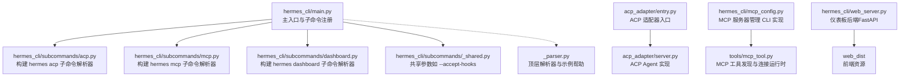
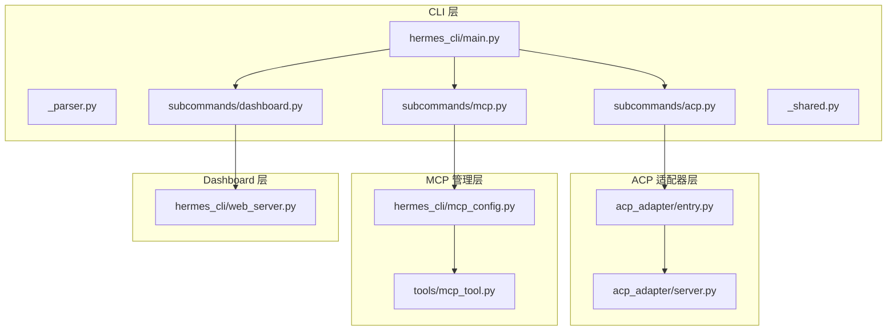
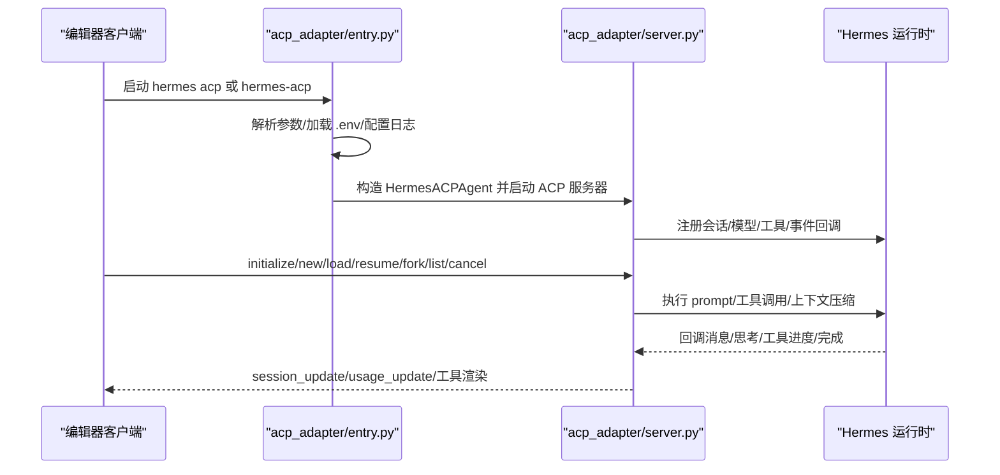
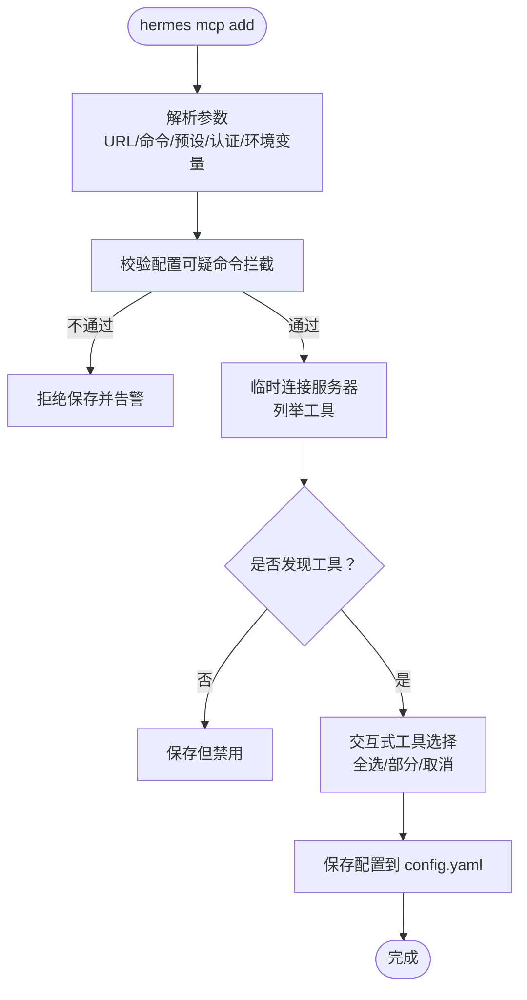
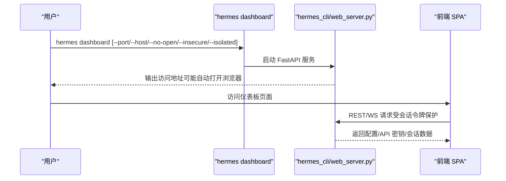
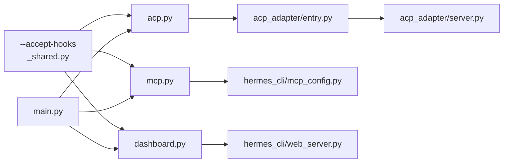

# 高级命令

<cite>
**本文引用的文件**
- [hermes_cli/subcommands/acp.py](file://hermes_cli/subcommands/acp.py)
- [hermes_cli/subcommands/mcp.py](file://hermes_cli/subcommands/mcp.py)
- [hermes_cli/subcommands/dashboard.py](file://hermes_cli/subcommands/dashboard.py)
- [hermes_cli/main.py](file://hermes_cli/main.py)
- [hermes_cli/_parser.py](file://hermes_cli/_parser.py)
- [hermes_cli/subcommands/_shared.py](file://hermes_cli/subcommands/_shared.py)
- [acp_adapter/entry.py](file://acp_adapter/entry.py)
- [acp_adapter/server.py](file://acp_adapter/server.py)
- [hermes_cli/web_server.py](file://hermes_cli/web_server.py)
- [hermes_cli/mcp_config.py](file://hermes_cli/mcp_config.py)
- [website/docs/developer-guide/acp-internals.md](file://website/docs/developer-guide/acp-internals.md)
</cite>

## 目录
1. [简介](#简介)
2. [项目结构](#项目结构)
3. [核心组件](#核心组件)
4. [架构总览](#架构总览)
5. [详细组件分析](#详细组件分析)
6. [依赖分析](#依赖分析)
7. [性能考虑](#性能考虑)
8. [故障排查指南](#故障排查指南)
9. [结论](#结论)
10. [附录](#附录)

## 简介
本文件面向企业与高级用户，系统化梳理 Hermes Agent 的三大高级命令：ACP（Agent Control Protocol）服务器命令、MCP（Model Context Protocol）命令与 dashboard 仪表板命令。内容涵盖：
- ACP 命令如何作为编辑器集成代理运行，支持会话管理、工具渲染与事件桥接。
- MCP 命令如何管理外部工具源（服务器），包括连接、认证、能力发现与工具选择。
- dashboard 命令如何启动 Web 仪表板，提供配置、API 密钥与会话管理，并说明安全与部署注意事项。
- 高级配置与自定义选项、API 密钥与认证、安全策略及企业落地实践。

## 项目结构
以下图示展示与“高级命令”直接相关的模块与入口位置，以及它们在 CLI 解析与分发中的角色。

图表来源
- [hermes_cli/main.py:290-302](file://hermes_cli/main.py#L290-L302)
- [hermes_cli/subcommands/acp.py:14-52](file://hermes_cli/subcommands/acp.py#L14-L52)
- [hermes_cli/subcommands/mcp.py:15-109](file://hermes_cli/subcommands/mcp.py#L15-L109)
- [hermes_cli/subcommands/dashboard.py:13-99](file://hermes_cli/subcommands/dashboard.py#L13-L99)
- [hermes_cli/subcommands/_shared.py:15-29](file://hermes_cli/subcommands/_shared.py#L15-L29)
- [acp_adapter/entry.py:212-267](file://acp_adapter/entry.py#L212-L267)
- [acp_adapter/server.py:446-800](file://acp_adapter/server.py#L446-L800)
- [hermes_cli/web_server.py:179-200](file://hermes_cli/web_server.py#L179-L200)
- [hermes_cli/mcp_config.py:299-500](file://hermes_cli/mcp_config.py#L299-L500)

章节来源
- [hermes_cli/main.py:290-302](file://hermes_cli/main.py#L290-L302)
- [hermes_cli/_parser.py:84-412](file://hermes_cli/_parser.py#L84-L412)

## 核心组件
- ACP 子命令与适配器
  - 子命令解析：提供版本检查、依赖检查、首次设置、浏览器工具安装等选项。
  - 适配器入口：加载环境变量、配置日志、启动 ACP 服务器，内置 MCP 工具发现。
  - ACP Agent：会话管理、模型切换、事件桥接、权限审批回调、资源处理与使用量更新。
- MCP 子命令与管理
  - 子命令解析：支持 serve、add、remove、list、test、configure、login、picker、catalog、install 等。
  - 管理实现：保存/删除服务器配置、OAuth/头部认证、一次性探测工具集、交互式工具选择、预设与环境变量注入。
- dashboard 子命令与 Web 服务
  - 子命令解析：端口/主机绑定、自动打开浏览器、非本地绑定警告、隔离模式、进程状态/停止控制、注册自托管仪表板。
  - Web 服务：FastAPI 提供 REST/WS 接口，SPA 资源托管，会话令牌保护敏感接口，桌面模式下内嵌聊天通道。

章节来源
- [hermes_cli/subcommands/acp.py:14-52](file://hermes_cli/subcommands/acp.py#L14-L52)
- [acp_adapter/entry.py:111-141](file://acp_adapter/entry.py#L111-L141)
- [acp_adapter/server.py:446-800](file://acp_adapter/server.py#L446-L800)
- [hermes_cli/subcommands/mcp.py:15-109](file://hermes_cli/subcommands/mcp.py#L15-L109)
- [hermes_cli/mcp_config.py:299-500](file://hermes_cli/mcp_config.py#L299-L500)
- [hermes_cli/subcommands/dashboard.py:13-99](file://hermes_cli/subcommands/dashboard.py#L13-L99)
- [hermes_cli/web_server.py:179-200](file://hermes_cli/web_server.py#L179-L200)

## 架构总览
下图展示三大高级命令在系统中的位置与交互路径。

图表来源
- [hermes_cli/main.py:290-302](file://hermes_cli/main.py#L290-L302)
- [acp_adapter/entry.py:212-267](file://acp_adapter/entry.py#L212-L267)
- [acp_adapter/server.py:446-800](file://acp_adapter/server.py#L446-L800)
- [hermes_cli/mcp_config.py:299-500](file://hermes_cli/mcp_config.py#L299-L500)
- [hermes_cli/web_server.py:179-200](file://hermes_cli/web_server.py#L179-L200)

## 详细组件分析

### ACP（Agent Control Protocol）命令
- 功能概述
  - 将 Hermes Agent 以 ACP 适配器形式运行，供 VS Code、Zed、JetBrains 等编辑器集成。
  - 支持版本打印、依赖检查、首次设置（终端认证）、浏览器工具安装等辅助能力。
- 关键实现要点
  - 入口解析与环境加载：解析参数、加载 .env、配置 stderr 日志、必要时进行 MCP 工具发现。
  - ACP Agent：负责会话生命周期、模型切换、事件桥接、权限审批、资源处理与上下文使用量更新。
- 使用场景
  - 在编辑器中直接发起对话、切换模型、查看工具列表、压缩上下文、队列后续提示等。
  - 与编辑器的 ACP 客户端协作，实现多模态附件、资源内联与实时会话更新。

图表来源
- [acp_adapter/entry.py:212-267](file://acp_adapter/entry.py#L212-L267)
- [acp_adapter/server.py:446-800](file://acp_adapter/server.py#L446-L800)
- [website/docs/developer-guide/acp-internals.md:22-77](file://website/docs/developer-guide/acp-internals.md#L22-L77)

章节来源
- [hermes_cli/subcommands/acp.py:14-52](file://hermes_cli/subcommands/acp.py#L14-L52)
- [acp_adapter/entry.py:111-141](file://acp_adapter/entry.py#L111-L141)
- [acp_adapter/entry.py:244-254](file://acp_adapter/entry.py#L244-L254)
- [acp_adapter/server.py:446-800](file://acp_adapter/server.py#L446-L800)
- [website/docs/developer-guide/acp-internals.md:22-77](file://website/docs/developer-guide/acp-internals.md#L22-L77)

### MCP（Model Context Protocol）命令
- 功能概述
  - 管理 MCP 服务器连接：添加/移除/列出/测试/配置工具选择、强制 OAuth 登录。
  - 作为 MCP 服务器对外暴露：将 Hermes 会话通过 MCP 暴露给其他代理。
- 关键实现要点
  - 子命令解析：支持 serve/add/remove/list/test/configure/login/picker/catalog/install 等。
  - 添加服务器：支持 HTTP(SSE)/stdio 两种传输；可选 OAuth 或 Authorization 头；支持环境变量注入；连接探测并交互式选择工具。
  - 测试与登录：一次性连接探测工具集；OAuth 登录时清理缓存并触发新流程，验证令牌是否实际落盘。
  - 配置持久化：写入 ~/.hermes/config.yaml 的 mcp_servers 字段，含工具白/黑名单、认证方式、环境变量等。
- 使用场景
  - 企业内部或第三方平台提供工具（搜索、数据库、工单、CI 等），通过 MCP 注入到 Hermes。
  - 将 Hermes 会话作为 MCP 服务器，供上层编排系统复用。

图表来源
- [hermes_cli/subcommands/mcp.py:15-109](file://hermes_cli/subcommands/mcp.py#L15-L109)
- [hermes_cli/mcp_config.py:299-500](file://hermes_cli/mcp_config.py#L299-L500)
- [hermes_cli/mcp_config.py:604-664](file://hermes_cli/mcp_config.py#L604-L664)
- [hermes_cli/mcp_config.py:668-751](file://hermes_cli/mcp_config.py#L668-L751)

章节来源
- [hermes_cli/subcommands/mcp.py:15-109](file://hermes_cli/subcommands/mcp.py#L15-L109)
- [hermes_cli/mcp_config.py:299-500](file://hermes_cli/mcp_config.py#L299-L500)
- [hermes_cli/mcp_config.py:604-664](file://hermes_cli/mcp_config.py#L604-L664)
- [hermes_cli/mcp_config.py:668-751](file://hermes_cli/mcp_config.py#L668-L751)

### dashboard 仪表板命令
- 功能概述
  - 启动 Web 仪表板，提供配置、API 密钥与会话管理；支持自动打开浏览器、非本地绑定警告、隔离模式、进程状态/停止控制。
  - 支持注册自托管仪表板到 Nous Portal，生成 OAuth 客户端并写入 ~/.hermes/.env。
- 关键实现要点
  - 子命令解析：端口/主机、是否自动打开、是否允许非本地绑定、跳过构建、隔离模式、进程生命周期控制等。
  - Web 服务：FastAPI 应用，静态资源托管，REST/WS 接口，会话令牌保护敏感端点，桌面模式内嵌聊天通道。
  - 安全注意：非本地绑定会暴露 API 密钥风险，需谨慎使用；默认仅监听 127.0.0.1。
- 使用场景
  - 企业管理员集中管理配置与密钥；开发人员快速查看/导出会话；CI/自动化脚本在受限环境中使用。

图表来源
- [hermes_cli/subcommands/dashboard.py:13-99](file://hermes_cli/subcommands/dashboard.py#L13-L99)
- [hermes_cli/web_server.py:179-200](file://hermes_cli/web_server.py#L179-L200)
- [hermes_cli/web_server.py:12066-12082](file://hermes_cli/web_server.py#L12066-L12082)

章节来源
- [hermes_cli/subcommands/dashboard.py:13-99](file://hermes_cli/subcommands/dashboard.py#L13-L99)
- [hermes_cli/web_server.py:179-200](file://hermes_cli/web_server.py#L179-L200)
- [hermes_cli/web_server.py:12066-12082](file://hermes_cli/web_server.py#L12066-L12082)

## 依赖分析
- 参数共享
  - 多个子命令共享 --accept-hooks 参数，便于在 CI/无人值守环境下自动批准未见过的 shell 钩子。
- 子命令注册
  - 主入口统一注册各子命令解析器，确保命令解析与调度一致。
- ACP/MCP/dashboard 的耦合点
  - ACP 适配器在启动前进行 MCP 工具发现，保证编辑器侧工具可用性。
  - MCP 管理 CLI 与运行时工具模块解耦，通过配置文件驱动。

图表来源
- [hermes_cli/subcommands/_shared.py:15-29](file://hermes_cli/subcommands/_shared.py#L15-L29)
- [hermes_cli/main.py:290-302](file://hermes_cli/main.py#L290-L302)
- [acp_adapter/entry.py:244-254](file://acp_adapter/entry.py#L244-L254)
- [hermes_cli/mcp_config.py:299-500](file://hermes_cli/mcp_config.py#L299-L500)
- [hermes_cli/web_server.py:179-200](file://hermes_cli/web_server.py#L179-L200)

章节来源
- [hermes_cli/subcommands/_shared.py:15-29](file://hermes_cli/subcommands/_shared.py#L15-L29)
- [hermes_cli/main.py:290-302](file://hermes_cli/main.py#L290-L302)

## 性能考虑
- ACP 适配器
  - 使用线程池并发执行同步 AIAgent，避免阻塞事件循环；会话列表分页与资源大小限制降低内存压力。
- MCP 管理
  - 一次性连接探测工具集，避免在正常会话中频繁建立连接；std:io 服务器的环境变量注入减少重复配置成本。
- dashboard
  - 静态资源按需加载，CSS 中的相对路径根据反向代理前缀动态修正；桌面模式下独立的定时器保障计划任务执行。

## 故障排查指南
- ACP
  - 若编辑器探活请求导致噪声日志，适配器已过滤特定未知方法的错误堆栈；若仍异常，检查依赖导入与环境变量加载。
  - 首次设置失败：确认终端认证流程与网络可达性；必要时手动安装浏览器工具。
- MCP
  - 连接失败：先使用 hermes mcp test 定位问题；OAuth 失败需确认令牌是否实际落盘；std:io 服务器需检查命令与环境变量。
  - 工具未显示：确认工具发现返回值与工具选择策略；必要时重新配置 include/exclude。
- dashboard
  - 无法访问：检查端口占用与主机绑定；非本地绑定存在泄露风险，建议仅在受控网络使用。
  - 自动打开失败：检测系统显示环境（Wayland/X11）与浏览器可用性；可通过 --no-open 关闭自动打开。

章节来源
- [acp_adapter/entry.py:46-94](file://acp_adapter/entry.py#L46-L94)
- [acp_adapter/entry.py:157-210](file://acp_adapter/entry.py#L157-L210)
- [hermes_cli/mcp_config.py:604-664](file://hermes_cli/mcp_config.py#L604-L664)
- [hermes_cli/mcp_config.py:668-751](file://hermes_cli/mcp_config.py#L668-L751)
- [hermes_cli/web_server.py:12041-12063](file://hermes_cli/web_server.py#L12041-L12063)

## 结论
- ACP、MCP 与 dashboard 是 Hermes 在企业与开发者生态中的三大关键扩展面：编辑器集成、工具生态与可视化运维。
- 通过清晰的命令解析、安全的认证与配置管理、稳健的事件与资源处理，三者共同支撑从开发到生产的完整链路。
- 建议在生产环境中严格控制 dashboard 的网络暴露范围，完善 MCP 服务器的认证与审计，以及在编辑器侧启用必要的权限审批策略。

## 附录
- 高级配置与自定义
  - ACP：通过 --setup/--setup-browser 快速完成首次配置与浏览器工具安装；--accept-hooks 适合 CI 场景。
  - MCP：使用 --preset、--env、--auth 等参数简化配置；结合 configure 子命令进行工具选择。
  - dashboard：--isolated 可为命名 profile 提供独立仪表板；--skip-build 适用于 CI 环境。
- API 密钥与认证
  - MCP HTTP 服务器推荐使用 OAuth 或 Authorization 头；OAuth 登录失败时检查令牌落盘与提供商支持情况。
  - dashboard 使用会话令牌保护敏感端点，避免凭空泄露；非本地绑定存在风险，应配合防火墙与反向代理。
- 安全建议
  - 限制 dashboard 绑定地址与端口；对 MCP 服务器进行最小权限授权与工具白名单控制；定期轮换 OAuth 凭据与 API 密钥。