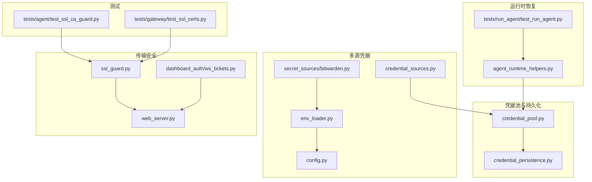
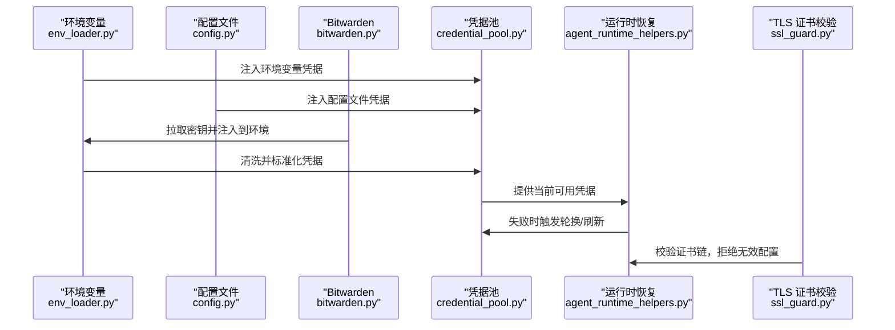
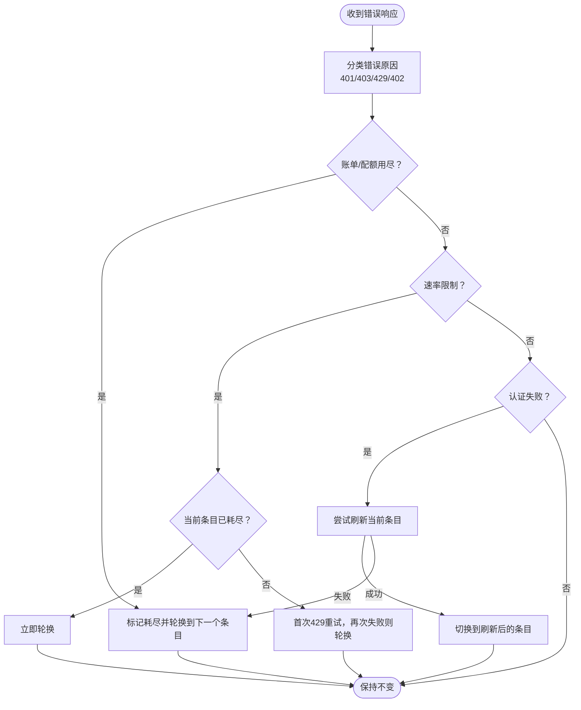
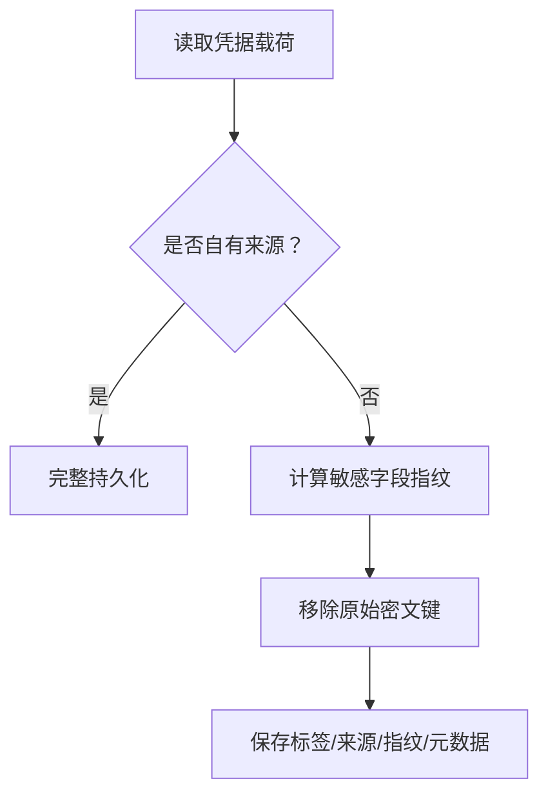
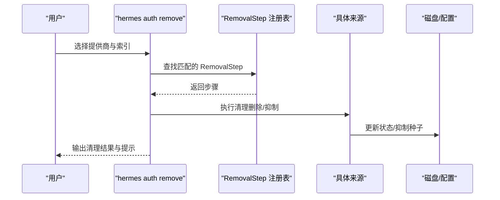
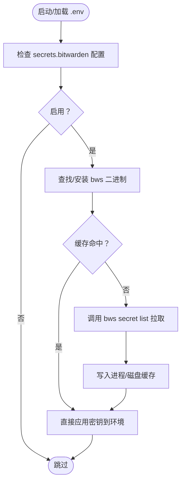
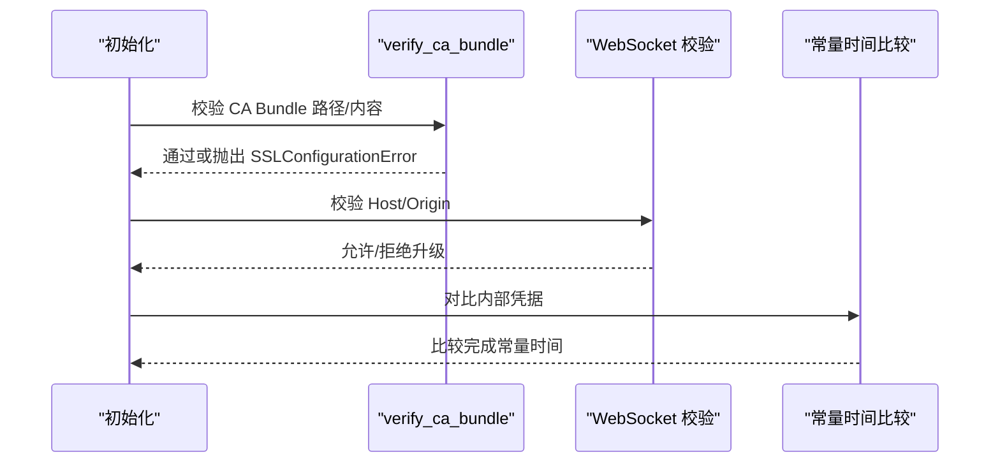
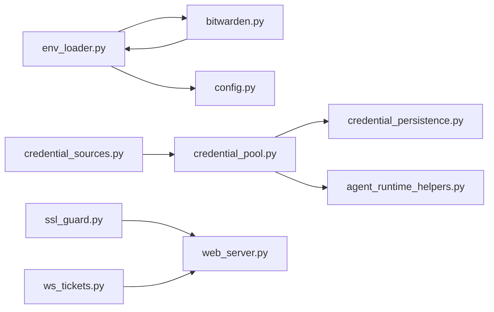

# 凭据安全

<cite>
**本文档引用的文件**
- [agent/credential_pool.py](file://agent/credential_pool.py)
- [agent/credential_persistence.py](file://agent/credential_persistence.py)
- [agent/credential_sources.py](file://agent/credential_sources.py)
- [agent/secret_sources/bitwarden.py](file://agent/secret_sources/bitwarden.py)
- [agent/ssl_guard.py](file://agent/ssl_guard.py)
- [hermes_cli/env_loader.py](file://hermes_cli/env_loader.py)
- [hermes_cli/config.py](file://hermes_cli/config.py)
- [hermes_cli/web_server.py](file://hermes_cli/web_server.py)
- [hermes_cli/dashboard_auth/ws_tickets.py](file://hermes_cli/dashboard_auth/ws_tickets.py)
- [agent/agent_runtime_helpers.py](file://agent/agent_runtime_helpers.py)
- [tests/run_agent/test_run_agent.py](file://tests/run_agent/test_run_agent.py)
- [tests/agent/test_ssl_ca_guard.py](file://tests/agent/test_ssl_ca_guard.py)
- [tests/gateway/test_ssl_certs.py](file://tests/gateway/test_ssl_certs.py)
</cite>

## 目录
1. [引言](#引言)
2. [项目结构](#项目结构)
3. [核心组件](#核心组件)
4. [架构总览](#架构总览)
5. [详细组件分析](#详细组件分析)
6. [依赖关系分析](#依赖关系分析)
7. [性能考虑](#性能考虑)
8. [故障排查指南](#故障排查指南)
9. [结论](#结论)
10. [附录](#附录)

## 引言
本文件系统性阐述本仓库中的凭据安全管理方案，覆盖以下主题：
- 凭据的加密存储与指纹化策略（密钥派生、对称加密、哈希算法）
- 凭据池设计与容错机制（动态轮换、故障转移、负载均衡）
- 多源凭据管理（环境变量注入、配置文件解析、外部密钥管理服务集成）
- 安全传输协议（TLS 加密、认证握手、中间人攻击防护）
- 凭据轮换策略（自动更新、手动刷新、回滚机制）
- 安全配置指南（密钥长度要求、轮换周期、访问日志）

## 项目结构
围绕凭据安全的关键模块分布如下：
- 凭据池与持久化：agent/credential_pool.py、agent/credential_persistence.py
- 多源凭据移除契约：agent/credential_sources.py
- 外部密钥管理集成：agent/secret_sources/bitwarden.py
- 环境变量加载与清洗：hermes_cli/env_loader.py、hermes_cli/config.py
- TLS 证书校验与传输安全：agent/ssl_guard.py、hermes_cli/web_server.py
- 内部凭据与常量时间比较：hermes_cli/dashboard_auth/ws_tickets.py
- 运行时恢复与轮换：agent/agent_runtime_helpers.py、tests/run_agent/test_run_agent.py
- TLS 证书保障测试：tests/agent/test_ssl_ca_guard.py、tests/gateway/test_ssl_certs.py

**图表来源**
- [agent/credential_pool.py:449-1385](file://agent/credential_pool.py#L449-L1385)
- [agent/credential_persistence.py:1-175](file://agent/credential_persistence.py#L1-L175)
- [agent/credential_sources.py:1-449](file://agent/credential_sources.py#L1-L449)
- [agent/secret_sources/bitwarden.py:1-693](file://agent/secret_sources/bitwarden.py#L1-L693)
- [hermes_cli/env_loader.py:1-345](file://hermes_cli/env_loader.py#L1-L345)
- [hermes_cli/config.py:5108-5143](file://hermes_cli/config.py#L5108-L5143)
- [agent/ssl_guard.py:1-95](file://agent/ssl_guard.py#L1-L95)
- [hermes_cli/web_server.py:10303-10330](file://hermes_cli/web_server.py#L10303-L10330)
- [hermes_cli/dashboard_auth/ws_tickets.py:120-149](file://hermes_cli/dashboard_auth/ws_tickets.py#L120-L149)
- [agent/agent_runtime_helpers.py:584-794](file://agent/agent_runtime_helpers.py#L584-L794)
- [tests/run_agent/test_run_agent.py:4886-4989](file://tests/run_agent/test_run_agent.py#L4886-L4989)
- [tests/agent/test_ssl_ca_guard.py:36-82](file://tests/agent/test_ssl_ca_guard.py#L36-L82)
- [tests/gateway/test_ssl_certs.py:46-80](file://tests/gateway/test_ssl_certs.py#L46-L80)

**章节来源**
- [agent/credential_pool.py:1-2185](file://agent/credential_pool.py#L1-L2185)
- [agent/credential_persistence.py:1-175](file://agent/credential_persistence.py#L1-L175)
- [agent/credential_sources.py:1-449](file://agent/credential_sources.py#L1-L449)
- [agent/secret_sources/bitwarden.py:1-693](file://agent/secret_sources/bitwarden.py#L1-L693)
- [hermes_cli/env_loader.py:1-345](file://hermes_cli/env_loader.py#L1-L345)
- [hermes_cli/config.py:5108-5143](file://hermes_cli/config.py#L5108-L5143)
- [agent/ssl_guard.py:1-95](file://agent/ssl_guard.py#L1-L95)
- [hermes_cli/web_server.py:10303-10330](file://hermes_cli/web_server.py#L10303-L10330)
- [hermes_cli/dashboard_auth/ws_tickets.py:120-149](file://hermes_cli/dashboard_auth/ws_tickets.py#L120-L149)
- [agent/agent_runtime_helpers.py:584-794](file://agent/agent_runtime_helpers.py#L584-L794)
- [tests/run_agent/test_run_agent.py:4886-4989](file://tests/run_agent/test_run_agent.py#L4886-L4989)
- [tests/agent/test_ssl_ca_guard.py:36-82](file://tests/agent/test_ssl_ca_guard.py#L36-L82)
- [tests/gateway/test_ssl_certs.py:46-80](file://tests/gateway/test_ssl_certs.py#L46-L80)

## 核心组件
- 凭据池（CredentialPool）：统一管理同一提供商的多个凭据条目，支持多种选择策略（填满优先、轮询、随机、最少使用），内置冷却与过期控制，并在失败时进行轮换或刷新。
- 持久化与指纹化：对“借用型”凭据仅保存不可逆指纹与元数据，避免将原始密文写入磁盘；对“自有型”凭据允许完整持久化。
- 多源凭据：从环境变量、外部 CLI 文件、配置文件、自定义提供商等多源读取凭据，并提供统一的移除契约以确保删除后不再被重新导入。
- 外部密钥管理：通过 Bitwarden Secrets Manager 拉取密钥，支持二进制懒安装、进程内与磁盘缓存、失败不阻塞启动。
- 传输安全：前置 CA 证书校验，防止错误配置导致的连接失败；WebSocket 层面的主机/来源限制与内部凭据常量时间比较。

**章节来源**
- [agent/credential_pool.py:449-1385](file://agent/credential_pool.py#L449-L1385)
- [agent/credential_persistence.py:1-175](file://agent/credential_persistence.py#L1-L175)
- [agent/credential_sources.py:1-449](file://agent/credential_sources.py#L1-L449)
- [agent/secret_sources/bitwarden.py:1-693](file://agent/secret_sources/bitwarden.py#L1-L693)
- [agent/ssl_guard.py:61-94](file://agent/ssl_guard.py#L61-L94)

## 架构总览
下图展示凭据从多源注入到运行时使用的整体流程，以及安全边界与保护点：

**图表来源**
- [hermes_cli/env_loader.py:212-324](file://hermes_cli/env_loader.py#L212-L324)
- [hermes_cli/config.py:5108-5143](file://hermes_cli/config.py#L5108-L5143)
- [agent/secret_sources/bitwarden.py:591-673](file://agent/secret_sources/bitwarden.py#L591-L673)
- [agent/credential_pool.py:449-1385](file://agent/credential_pool.py#L449-L1385)
- [agent/agent_runtime_helpers.py:584-794](file://agent/agent_runtime_helpers.py#L584-L794)
- [agent/ssl_guard.py:61-94](file://agent/ssl_guard.py#L61-L94)

## 详细组件分析

### 凭据池与容错机制
- 选择策略：fill_first、round_robin、random、least_used。轮询会调整条目优先级并持久化；最少使用策略会跟踪请求计数以均衡负载。
- 冷却与过期：根据状态码（401、429、默认）设置不同的冷却时间；支持从上游返回的 reset_at 时间戳或消息中的重试延迟提取。
- 终止态处理：对于已知的永久性认证失败（如 token_revoked、invalid_grant），标记为 DEAD 并排除轮换，直到显式同步刷新清除。
- 同步与一致性：针对特定提供商（如 Anthropic、Codex、xAI、Nous）从 auth.json 单例状态同步最新令牌，避免单次使用刷新令牌被重复消费导致的失败。
- 运行时恢复：当出现 401/403/429/402 等错误时，先尝试刷新当前条目，失败则按原因进行轮换或立即旋转，避免“取消-429”陷阱。

**图表来源**
- [agent/agent_runtime_helpers.py:584-794](file://agent/agent_runtime_helpers.py#L584-L794)
- [agent/credential_pool.py:510-539](file://agent/credential_pool.py#L510-L539)
- [agent/credential_pool.py:1382-1385](file://agent/credential_pool.py#L1382-L1385)

**章节来源**
- [agent/credential_pool.py:449-1385](file://agent/credential_pool.py#L449-L1385)
- [agent/agent_runtime_helpers.py:584-794](file://agent/agent_runtime_helpers.py#L584-L794)
- [tests/run_agent/test_run_agent.py:4886-4989](file://tests/run_agent/test_run_agent.py#L4886-L4989)

### 凭据持久化与指纹化
- 借用型凭据：来自外部源（如 Bitwarden、第三方 CLI）的凭据只保存标签、来源、状态/冷却元数据与不可逆指纹，原始密文不落盘。
- 自有型凭据：由 Hermes 自身管理的 OAuth/device-code 状态可完整持久化。
- 指纹生成：对敏感值计算 SHA-256 前缀作为指纹，用于后续审计与追踪但不反推出明文。

**图表来源**
- [agent/credential_persistence.py:103-175](file://agent/credential_persistence.py#L103-L175)

**章节来源**
- [agent/credential_persistence.py:1-175](file://agent/credential_persistence.py#L1-L175)

### 多源凭据管理与移除契约
- 多源注入：环境变量（含模板）、Bitwarden、外部 CLI 配置文件、自定义提供商配置、模型配置中的 API Key。
- 移除契约：为每种来源注册 RemovalStep，保证移除后不会在下次加载时被重新导入；对 shell 环境变量、外部文件等给出明确提示。
- 环境变量模板保留：在持久化配置时保留原始 ${VAR} 模板，避免将展开后的明文写回配置文件。

**图表来源**
- [agent/credential_sources.py:115-133](file://agent/credential_sources.py#L115-L133)
- [agent/credential_sources.py:143-324](file://agent/credential_sources.py#L143-L324)
- [hermes_cli/config.py:5134-5143](file://hermes_cli/config.py#L5134-L5143)

**章节来源**
- [agent/credential_sources.py:1-449](file://agent/credential_sources.py#L1-L449)
- [hermes_cli/config.py:5108-5143](file://hermes_cli/config.py#L5108-L5143)

### 外部密钥管理服务集成（Bitwarden）
- 懒安装与版本固定：首次使用时在 Hermes Home 下安装 pinned 版本的 bws 二进制，下载并校验 SHA-256。
- 缓存策略：进程内字典缓存 + 磁盘 JSON 缓存，避免频繁拉取；缓存键包含访问令牌指纹、项目 ID 与服务器地址。
- 失败不阻塞：任何异常仅记录警告并继续使用已有凭据。
- 注入策略：将拉取到的密钥注入 os.environ，跳过覆盖现有非空值，避免破坏用户本地配置。

**图表来源**
- [agent/secret_sources/bitwarden.py:439-673](file://agent/secret_sources/bitwarden.py#L439-L673)

**章节来源**
- [agent/secret_sources/bitwarden.py:1-693](file://agent/secret_sources/bitwarden.py#L1-L693)
- [hermes_cli/env_loader.py:250-324](file://hermes_cli/env_loader.py#L250-L324)

### 安全传输协议与 TLS 防护
- CA 证书前置校验：在初始化阶段验证环境变量指定的 CA Bundle 与 certifi 默认包，防止错误路径导致的连接失败。
- WebSocket 主机/来源限制：在非回环绑定场景下，严格校验 Host/Origin，阻止 DNS 重绑定等攻击。
- 内部凭据常量时间比较：对内部凭据进行常量时间比较，避免时序侧信道泄露。

**图表来源**
- [agent/ssl_guard.py:61-94](file://agent/ssl_guard.py#L61-L94)
- [hermes_cli/web_server.py:10303-10330](file://hermes_cli/web_server.py#L10303-L10330)
- [hermes_cli/dashboard_auth/ws_tickets.py:120-149](file://hermes_cli/dashboard_auth/ws_tickets.py#L120-L149)

**章节来源**
- [agent/ssl_guard.py:1-95](file://agent/ssl_guard.py#L1-L95)
- [hermes_cli/web_server.py:10303-10330](file://hermes_cli/web_server.py#L10303-L10330)
- [hermes_cli/dashboard_auth/ws_tickets.py:120-149](file://hermes_cli/dashboard_auth/ws_tickets.py#L120-L149)
- [tests/agent/test_ssl_ca_guard.py:36-82](file://tests/agent/test_ssl_ca_guard.py#L36-L82)
- [tests/gateway/test_ssl_certs.py:46-80](file://tests/gateway/test_ssl_certs.py#L46-L80)

## 依赖关系分析
- 凭据池依赖持久化模块进行磁盘写入前的指纹化与清洗；同时依赖 auth 存储锁与提供者状态以实现跨进程同步。
- 多源凭据通过 RemovalStep 注册表解耦，新增来源只需注册步骤即可自动纳入移除流程。
- 环境变量加载器在注入外部密钥后再次执行 ASCII 清洗，确保 HTTP 头兼容。
- 运行时恢复逻辑与凭据池紧密耦合，依据错误分类决定刷新或轮换策略。

**图表来源**
- [hermes_cli/env_loader.py:250-324](file://hermes_cli/env_loader.py#L250-L324)
- [agent/secret_sources/bitwarden.py:591-673](file://agent/secret_sources/bitwarden.py#L591-L673)
- [agent/credential_pool.py:449-1385](file://agent/credential_pool.py#L449-L1385)
- [agent/credential_persistence.py:1-175](file://agent/credential_persistence.py#L1-L175)
- [agent/credential_sources.py:383-449](file://agent/credential_sources.py#L383-L449)
- [agent/ssl_guard.py:61-94](file://agent/ssl_guard.py#L61-L94)
- [hermes_cli/web_server.py:10303-10330](file://hermes_cli/web_server.py#L10303-L10330)
- [hermes_cli/dashboard_auth/ws_tickets.py:120-149](file://hermes_cli/dashboard_auth/ws_tickets.py#L120-L149)

**章节来源**
- [hermes_cli/env_loader.py:1-345](file://hermes_cli/env_loader.py#L1-L345)
- [agent/credential_pool.py:1-2185](file://agent/credential_pool.py#L1-L2185)
- [agent/credential_persistence.py:1-175](file://agent/credential_persistence.py#L1-L175)
- [agent/credential_sources.py:1-449](file://agent/credential_sources.py#L1-L449)
- [agent/ssl_guard.py:1-95](file://agent/ssl_guard.py#L1-L95)
- [hermes_cli/web_server.py:10303-10330](file://hermes_cli/web_server.py#L10303-L10330)
- [hermes_cli/dashboard_auth/ws_tickets.py:120-149](file://hermes_cli/dashboard_auth/ws_tickets.py#L120-L149)

## 性能考虑
- 凭据池轮换与刷新：采用线程锁保护状态变更，避免并发竞争；冷却时间与重试策略减少无效重试。
- Bitwarden 拉取：进程内与磁盘双重缓存降低网络开销；超时与降级策略确保启动不阻塞。
- 环境变量清洗：仅对已识别的凭据后缀进行 ASCII 清理，避免对非凭据变量产生影响。
- TLS 校验：前置 CA Bundle 校验避免后续 HTTP 客户端初始化失败带来的额外成本。

[本节为通用指导，无需特定文件引用]

## 故障排查指南
- TLS 证书问题：若自定义 CA Bundle 或 certifi 包损坏，将抛出 SSLConfigurationError 并提供修复建议；可通过 HERMES_SKIP_SSL_GUARD 临时绕过（不推荐）。
- WebSocket 升级被拒：检查 Host/Origin 是否符合回环绑定规则；确认未发生 DNS 重绑定尝试。
- Bitwarden 拉取失败：查看 bws 二进制是否存在、网络可达性、访问令牌有效性；确认项目 ID 正确。
- 凭据池轮换无效：确认当前运行的提供商与池的提供商一致；检查错误上下文中的原因与重试延迟提取是否正确。
- 内部凭据不匹配：确认使用常量时间比较函数，避免时序侧信道导致的误判。

**章节来源**
- [agent/ssl_guard.py:61-94](file://agent/ssl_guard.py#L61-L94)
- [hermes_cli/web_server.py:10303-10330](file://hermes_cli/web_server.py#L10303-L10330)
- [agent/secret_sources/bitwarden.py:439-673](file://agent/secret_sources/bitwarden.py#L439-L673)
- [agent/agent_runtime_helpers.py:584-794](file://agent/agent_runtime_helpers.py#L584-L794)
- [hermes_cli/dashboard_auth/ws_tickets.py:120-149](file://hermes_cli/dashboard_auth/ws_tickets.py#L120-L149)
- [tests/agent/test_ssl_ca_guard.py:36-82](file://tests/agent/test_ssl_ca_guard.py#L36-L82)
- [tests/gateway/test_ssl_certs.py:46-80](file://tests/gateway/test_ssl_certs.py#L46-L80)

## 结论
本仓库通过“借用型凭据指纹化 + 自有型凭据完整持久化”的双轨策略，结合多源注入与统一移除契约，构建了高可用、可审计的凭据管理体系。运行时恢复机制与 TLS 前置校验进一步增强了系统的韧性与安全性。建议在生产环境中启用 CA Bundle 校验、合理配置轮换策略，并定期审查凭据来源与访问日志。

[本节为总结性内容，无需特定文件引用]

## 附录
- 凭据轮换策略最佳实践
  - 自动更新：基于上游 reset_at 或消息中的重试延迟自动计算冷却；对单次使用刷新令牌的提供商定期同步 auth.json。
  - 手动刷新：在认证失败时优先尝试刷新当前条目，失败后再轮换。
  - 回滚机制：对永久性认证失败（DEAD）保留条目状态直至显式同步刷新清除。
- 安全配置指南
  - 密钥长度：API Key/令牌应满足提供商要求；避免在 .env 中硬编码明文。
  - 轮换周期：根据配额/用量限制与业务 SLA 设定；对高频调用场景缩短冷却时间。
  - 访问日志：启用必要的审计日志，但避免记录原始密文；使用指纹化标识外部来源。

[本节为通用指导，无需特定文件引用]