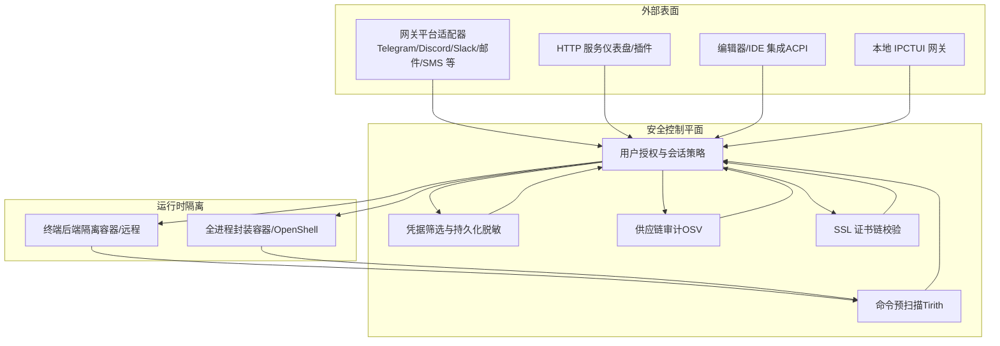
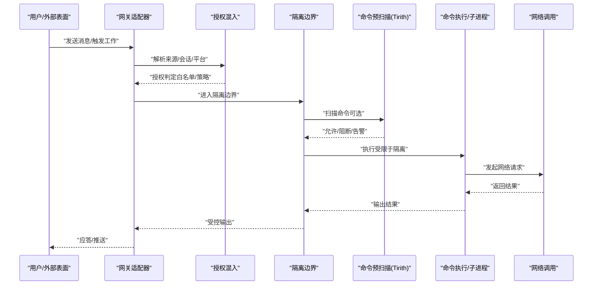
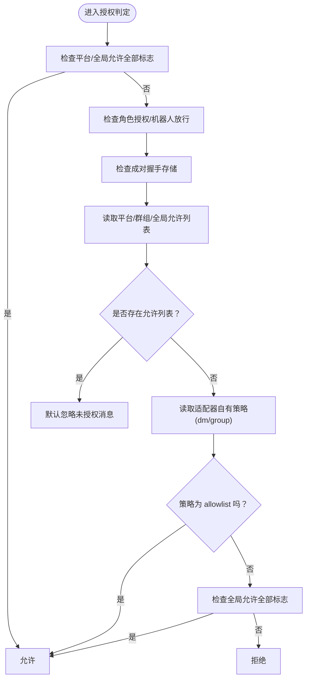
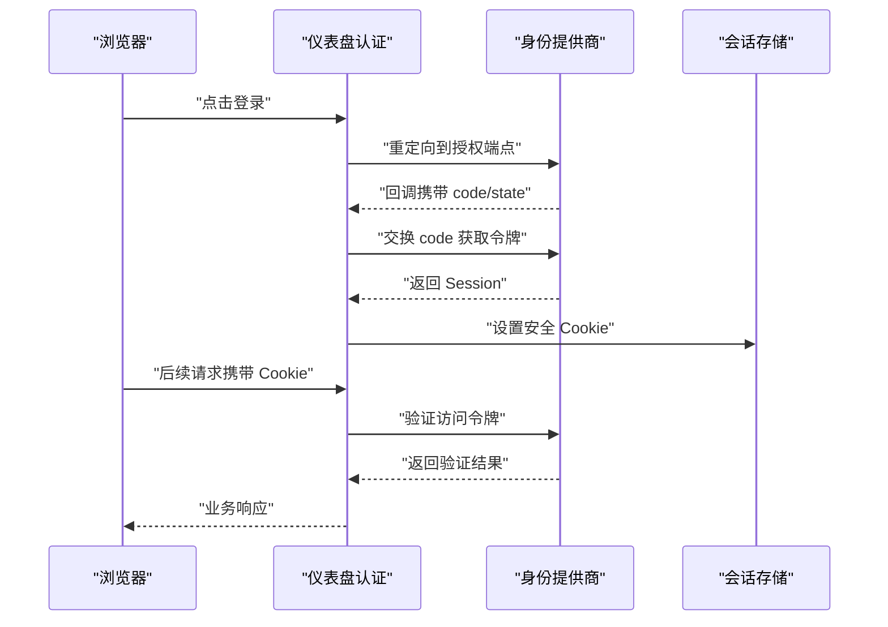
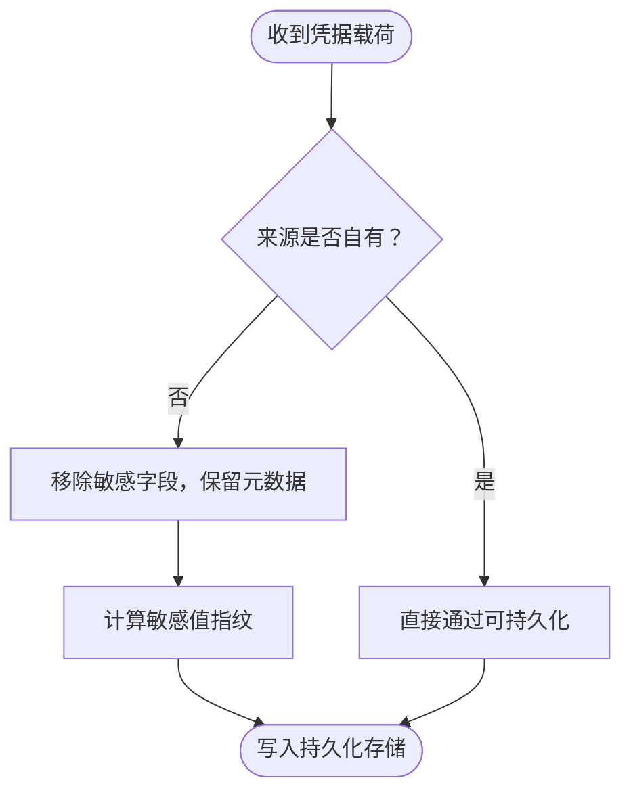
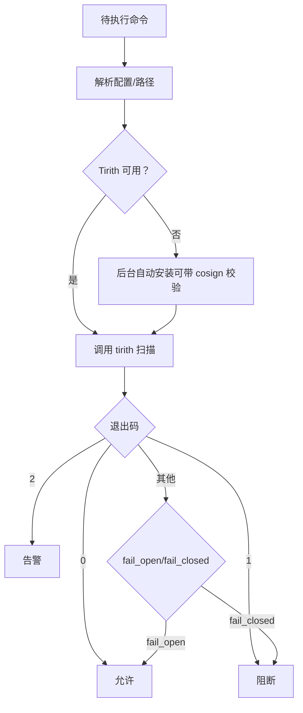
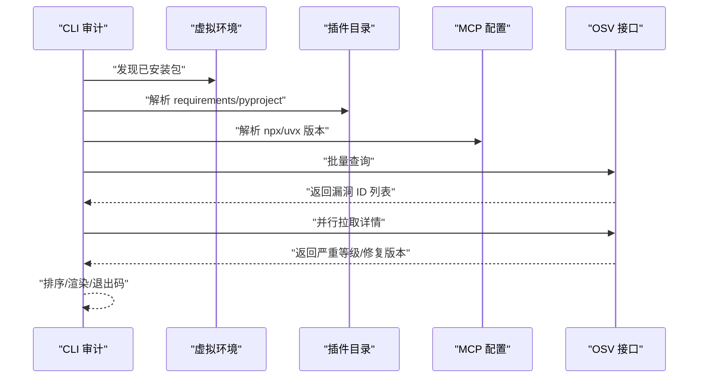
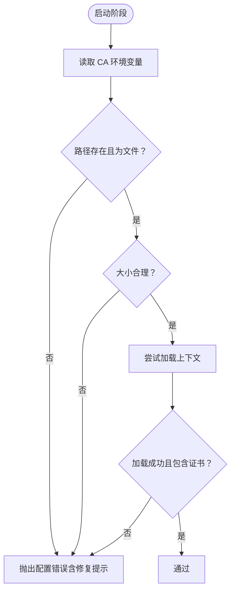
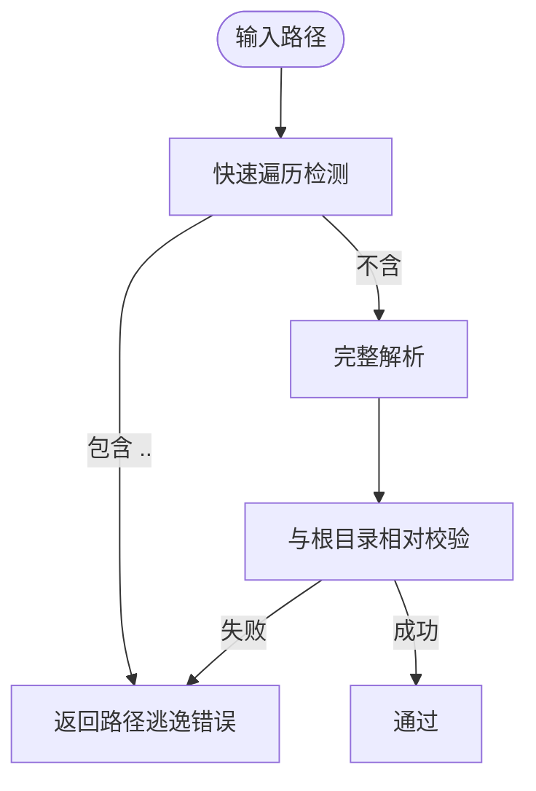
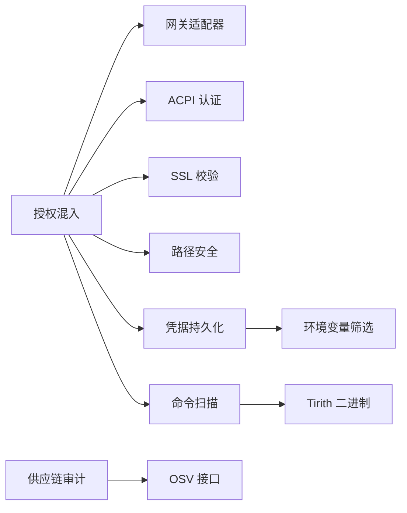

# 安全与隐私

<cite>
**本文引用的文件**
- [SECURITY.md](file://SECURITY.md)
- [ssl_guard.py](file://agent/ssl_guard.py)
- [credential_persistence.py](file://agent/credential_persistence.py)
- [mcp_security.py](file://hermes_cli/mcp_security.py)
- [security_audit.py](file://hermes_cli/security_audit.py)
- [path_security.py](file://tools/path_security.py)
- [auth.py](file://acp_adapter/auth.py)
- [authz_mixin.py](file://gateway/authz_mixin.py)
- [base.py](file://hermes_cli/dashboard_auth/base.py)
- [tirith_security.py](file://tools/tirith_security.py)
- [SOUL.md](file://docker/SOUL.md)
</cite>

## 目录
1. 引言
2. 项目结构
3. 核心组件
4. 架构总览
5. 详细组件分析
6. 依赖分析
7. 性能考虑
8. 故障排查指南
9. 结论
10. 附录

## 引言
本文件面向安全与隐私保护，系统化梳理 Hermes Agent 的安全架构与实践，覆盖访问控制、身份认证、凭据管理、容器隔离、网络安全、隐私保护、安全审计与监控、事件响应与合规建议。内容基于仓库中已有的安全策略、模块化实现与测试用例，帮助读者在不同部署形态下正确配置与使用。

## 项目结构
围绕“信任边界”与“隔离姿态”的设计主线，系统在以下层面提供安全能力：
- 外部表面与授权：网关平台适配器、HTTP 表面、编辑器/IDE 集成、本地 IPC 等统一强制授权与白名单。
- 运行时隔离：终端后端隔离（仅限制 shell/file 工具）与全进程封装（容器或 OpenShell 沙箱）两种姿态。
- 凭据与环境：对下层组件（子进程、MCP 子进程、代码执行）进行凭据筛选；持久化前对借用来源的敏感字段进行脱敏与指纹化。
- 命令预扫描：通过外部二进制对潜在危险模式进行静态扫描，支持自动安装与供应链校验。
- 供应链审计：按需扫描虚拟环境、插件与 MCP 服务器的已装依赖，对接 OSV 数据库。
- 网络安全：SSL 证书链验证前置检查，避免失败被掩盖为模糊错误；HTTPS/TLS 传输与证书校验贯穿网络调用。

图示来源
- [SECURITY.md](file://SECURITY.md)
- [authz_mixin.py](file://gateway/authz_mixin.py)
- [tirith_security.py](file://tools/tirith_security.py)
- [security_audit.py](file://hermes_cli/security_audit.py)
- [ssl_guard.py](file://agent/ssl_guard.py)

章节来源
- [SECURITY.md](file://SECURITY.md)
- [authz_mixin.py](file://gateway/authz_mixin.py)

## 核心组件
- 访问控制与授权
  - 网关授权混入：集中实现平台级允许列表、群组/频道策略、成对握手状态、未授权消息处置策略等，确保“未配置白名单即默认拒绝”。
  - ACP 身份方法：动态探测运行时提供商并注册可用认证方式，保证编辑器侧登录体验与安全一致性。
- 身份认证与会话
  - 仪表盘认证抽象：定义会话模型、OAuth/PKCE 流程、刷新/吊销语义与错误类型，统一登录页行为与安全约束（HttpOnly/Secure/SameSite/Lax）。
- 凭据管理
  - 凭据池持久化：区分“自有来源”与“借用来源”，对后者在写入 auth.json 前移除原始密钥值并保留不可逆指纹，降低磁盘泄露风险。
  - 环境变量凭据筛选：默认从下层子进程环境中剔除敏感变量，仅传递显式声明项，减少无意泄露。
- 命令与 MCP 安全
  - Tirith 预扫描：以外部二进制对命令进行内容级威胁扫描（同源/URL 欺骗、管道注入、终端注入等），支持自动下载与 cosign+SHA256 供应链校验。
  - MCP 服务器入口安全：识别 shell 解释器内联脚本中的外发工具与可疑参数，阻断高置信度外泄模式。
- 供应链审计
  - OSV 批量查询：发现虚拟环境、插件与 MCP 服务器中 pinned 依赖的已知漏洞，支持分级阈值与 JSON 输出，便于自动化集成。
- 网络安全
  - SSL 证书链前置校验：在第三方库加载前验证 CA Bundle 可用性与完整性，避免被掩盖为文件不存在类错误；支持跳过开关与修复提示。
- 路径与文件安全
  - 路径合法性校验：统一相对根目录的解析与遍历检测，防止路径穿越。

章节来源
- [authz_mixin.py](file://gateway/authz_mixin.py)
- [auth.py](file://acp_adapter/auth.py)
- [base.py](file://hermes_cli/dashboard_auth/base.py)
- [credential_persistence.py](file://agent/credential_persistence.py)
- [tirith_security.py](file://tools/tirith_security.py)
- [mcp_security.py](file://hermes_cli/mcp_security.py)
- [security_audit.py](file://hermes_cli/security_audit.py)
- [ssl_guard.py](file://agent/ssl_guard.py)
- [path_security.py](file://tools/path_security.py)

## 架构总览
下图展示从外部请求进入、经由授权与隔离边界，到命令执行与网络调用的关键路径与安全控制点。

图示来源
- [authz_mixin.py](file://gateway/authz_mixin.py)
- [tirith_security.py](file://tools/tirith_security.py)
- [SECURITY.md](file://SECURITY.md)

## 详细组件分析

### 组件一：访问控制与授权（网关）
- 设计要点
  - 平台级允许列表优先：支持按平台与群组维度的白名单，未配置则默认拒绝。
  - 适配器自有策略：当平台适配器在接入层已实施 allowlist 或禁用 DM，则网关不再重复放行。
  - 未授权处置策略：当存在任何允许列表时，默认忽略未授权消息，避免信息泄露与打扰；否则采用成对握手。
  - 用户别名与规范化：WhatsApp/简单连接等平台支持别名展开与标识规范化，提升授权一致性。
- 关键流程
  - 授权判定顺序：平台允许全部标志 → 环境变量白名单 → 成对握手 → 全局允许全部 → 默认拒绝。
  - 未授权 DM 行为：优先遵循显式配置，其次依据是否配置了允许列表决定“忽略/成对”。
- 安全收益
  - 显式授权与最小暴露：未配置白名单即拒绝，避免“默认开放”的脆弱面。
  - 适配器内生策略：将访问控制下沉至平台适配器，减少网关层逻辑复杂度与误判风险。

图示来源
- [authz_mixin.py](file://gateway/authz_mixin.py)

章节来源
- [authz_mixin.py](file://gateway/authz_mixin.py)

### 组件二：身份认证与会话（仪表盘）
- 设计要点
  - 抽象协议：LoginStart/Session/ProviderError 等数据结构与异常类型，统一 OAuth/PKCE 与密码登录路径。
  - Cookie 安全：短生命周期、HttpOnly/Secure/SameSite=Lax，避免跨站与明文泄露。
  - 失败语义：网络不可达、无效 code、刷新过期等分别映射到 503/400/401/重定向等语义，避免信息泄露。
- 关键流程
  - OAuth：start_login → 完成回调 → complete_login → verify_session/refresh/revoke。
  - 密码登录：当支持密码时，登录页渲染表单，常量时间校验未知用户，避免时序 Oracle。
- 安全收益
  - 统一错误处理与最小化披露，降低枚举与爆破价值。
  - 会话令牌透明化，便于下游（WebSocket 令牌、文件写入等）一致处理。

图示来源
- [base.py](file://hermes_cli/dashboard_auth/base.py)

章节来源
- [base.py](file://hermes_cli/dashboard_auth/base.py)

### 组件三：凭据管理与持久化
- 设计要点
  - 来源分类：自有来源（手动输入、Hermes 自有 OAuth/设备码）与借用来源（外部 Secret Store）。前者可持久化，后者仅保留元数据与不可逆指纹。
  - 键名归一：驼峰/连字符/点号归一化，结合后缀匹配识别敏感字段，避免漏扫。
  - 指纹策略：对关键敏感值生成 sha256 前缀指纹，用于审计与追踪，不回传明文。
- 关键流程
  - 写入 auth.json 前，对借用来源进行清洗；若无敏感值则保留原样。
  - 环境变量传递给子进程时，剔除敏感变量，仅保留显式声明项。
- 安全收益
  - 降低磁盘与内存中的敏感信息暴露面；即便发生泄露，也难以还原真实密钥。

图示来源
- [credential_persistence.py](file://agent/credential_persistence.py)

章节来源
- [credential_persistence.py](file://agent/credential_persistence.py)

### 组件四：命令与 MCP 安全
- 设计要点
  - Tirith 预扫描：以外部二进制对命令进行内容级威胁检测，退出码决定允许/阻断/告警；JSON 输出仅作增强，不覆盖退出码。
  - 自动安装与供应链校验：支持 SHA-256 校验与 cosign 供应链证明；失败原因持久化并在合理时间内抑制重复告警。
  - MCP 服务器入口：识别 shell 解释器内联脚本中的外发工具与可疑参数，阻断高置信度外泄模式。
- 关键流程
  - 命令执行前：解析配置与环境变量，定位/安装 tirith，超时或失败按 fail_open/fail_closed 策略处理。
  - MCP 服务器：解析命令与参数，匹配 shell 解释器与外发工具正则，生成安全警告。
- 安全收益
  - 在命令进入系统前进行静态扫描，显著降低恶意脚本与外泄风险；MCP 入口安全避免用户自定义服务器成为攻击面。

图示来源
- [tirith_security.py](file://tools/tirith_security.py)
- [mcp_security.py](file://hermes_cli/mcp_security.py)

章节来源
- [tirith_security.py](file://tools/tirith_security.py)
- [mcp_security.py](file://hermes_cli/mcp_security.py)

### 组件五：供应链审计（OSV）
- 设计要点
  - 发现范围：虚拟环境已安装包、用户插件 requirements/pyproject 中 pinned 依赖、MCP 服务器中 npx/uvx 版本引用。
  - 查询策略：批量查询 OSV，提取严重等级、摘要与修复版本，支持 JSON 输出与阈值控制。
  - 输出格式：人类可读与 JSON 两套渲染，便于集成 CI/CD 与自动化告警。
- 关键流程
  - 组件发现 → 批量查询 → 详情拉取 → 排序输出 → 退出码（满足阈值则非零）。
- 安全收益
  - 将已知漏洞纳入运维流程，降低供应链风险；支持按严重等级阈值阻断发布。

图示来源
- [security_audit.py](file://hermes_cli/security_audit.py)

章节来源
- [security_audit.py](file://hermes_cli/security_audit.py)

### 组件六：网络安全与传输
- 设计要点
  - SSL 证书链前置校验：在第三方库加载前验证 CA Bundle 路径存在、文件有效、大小合理、可加载且包含证书。
  - 环境变量与跳过策略：支持多环境变量与跳过开关，提供修复建议；缺失或损坏时抛出明确错误。
- 关键流程
  - 启动阶段扫描环境变量 → 加载 certifi 默认 bundle → 对自定义路径进行严格校验 → 抛错或通过。
- 安全收益
  - 将证书问题前置暴露，避免被掩盖为“文件不存在”等模糊错误；减少中间人攻击风险。

图示来源
- [ssl_guard.py](file://agent/ssl_guard.py)

章节来源
- [ssl_guard.py](file://agent/ssl_guard.py)

### 组件七：路径与文件安全
- 设计要点
  - 绝对路径解析与相对根目录校验：使用 resolve() 与 relative_to() 防止路径穿越。
  - 快速遍历检测：在完整解析前快速判断是否存在 “..” 组件，尽早拦截。
- 关键流程
  - 输入路径 → 快速遍历检测 → 完整解析 → 相对根目录校验 → 返回错误或通过。
- 安全收益
  - 降低路径穿越导致的越权访问风险，统一工具实现中的安全基线。

图示来源
- [path_security.py](file://tools/path_security.py)

章节来源
- [path_security.py](file://tools/path_security.py)

## 依赖分析
- 组件耦合
  - 授权混入与平台适配器：授权判定依赖平台配置与适配器策略，耦合度低但交互频繁。
  - 命令扫描与执行：Tirith 作为外部依赖，通过子进程调用；其可用性影响执行路径的 fail_open/fail_closed。
  - 凭据持久化与环境筛选：凭据池清洗与环境变量传递在多个子系统共享，避免重复逻辑。
- 外部依赖
  - OSV：批量查询与详情拉取，受网络与上游可用性影响。
  - GitHub Releases：Tirith 自动安装依赖，需考虑代理与鉴权。
- 循环依赖
  - 安全模块间无循环导入；日志延迟导入避免运行时循环。

图示来源
- [authz_mixin.py](file://gateway/authz_mixin.py)
- [tirith_security.py](file://tools/tirith_security.py)
- [security_audit.py](file://hermes_cli/security_audit.py)
- [ssl_guard.py](file://agent/ssl_guard.py)
- [path_security.py](file://tools/path_security.py)
- [credential_persistence.py](file://agent/credential_persistence.py)

章节来源
- [authz_mixin.py](file://gateway/authz_mixin.py)
- [tirith_security.py](file://tools/tirith_security.py)
- [security_audit.py](file://hermes_cli/security_audit.py)
- [ssl_guard.py](file://agent/ssl_guard.py)
- [path_security.py](file://tools/path_security.py)
- [credential_persistence.py](file://agent/credential_persistence.py)

## 性能考虑
- 延迟与吞吐
  - Tirith 扫描：超时与 fail_open/fail_closed 策略平衡安全与性能；建议在高并发场景适当提高超时或启用后台安装。
  - OSV 批量查询：分块与并行拉取详情，建议在 CI 中离线缓存常用依赖版本以减少网络开销。
- 资源占用
  - 自动安装线程：后台安装避免启动阻塞；失败标记与去重告警减少日志噪声。
- 可观测性
  - 命令扫描 JSON 输出可用于告警聚合与趋势分析；授权与供应链审计输出支持结构化日志采集。

## 故障排查指南
- SSL 证书链问题
  - 现象：第三方库报证书错误或文件不存在。
  - 处理：检查 CA 环境变量与 certifi 路径；根据修复提示重新安装依赖；必要时设置跳过开关临时缓解。
- Tirith 不可用
  - 现象：命令扫描失败、超时或路径解析为 None。
  - 处理：确认平台支持、PATH 或 $HERMES_HOME/bin 是否存在可执行文件；查看失败标记与去重告警；启用 fail_open 降级。
- 授权未生效
  - 现象：消息未被放行或被忽略。
  - 处理：检查平台/群组/全局允许列表；确认适配器自有策略是否为 allowlist；核对用户 ID/别名与成对握手状态。
- 供应链审计无结果
  - 现象：扫描不到组件或返回空。
  - 处理：确认虚拟环境、插件目录与 MCP 配置；检查 pinned 语法与版本格式；关注网络与上游接口状态。

章节来源
- [ssl_guard.py](file://agent/ssl_guard.py)
- [tirith_security.py](file://tools/tirith_security.py)
- [authz_mixin.py](file://gateway/authz_mixin.py)
- [security_audit.py](file://hermes_cli/security_audit.py)

## 结论
Hermes Agent 的安全体系以“信任边界”为核心，通过外部表面强制授权、运行时隔离、凭据与环境筛选、命令预扫描、供应链审计与 SSL 校验等多层控制，形成从入口到执行再到网络的闭环安全。建议在生产与共享部署中采用全进程封装与严格的白名单策略，并持续开展供应链审计与安全事件响应演练，以达成“最小暴露、纵深防御、可观测可追溯”的目标。

## 附录
- 安全配置最佳实践
  - 隔离姿态选择：根据输入可信度选择终端后端隔离或全进程封装；生产环境优先全进程封装。
  - 授权与白名单：为每个网络暴露的适配器配置允许列表；默认拒绝，显式放行。
  - 凭据管理：将凭据置于严格权限的文件中，避免硬编码；对借用来源仅保留元数据与指纹。
  - 传输安全：启用 TLS 与证书校验；避免跳过开关长期开启。
  - 审计与监控：启用供应链审计与命令扫描日志；建立告警与响应流程。
- 合规性指导
  - 遵循最小权限原则与数据最小化；对日志与审计记录设定保留期限与访问控制。
  - 对第三方组件与依赖定期审计，及时应用修复版本。
- 安全事件响应
  - 快速定位受影响组件与来源；回滚至稳定版本；更新白名单与策略；复盘并完善扫描规则与告警阈值。