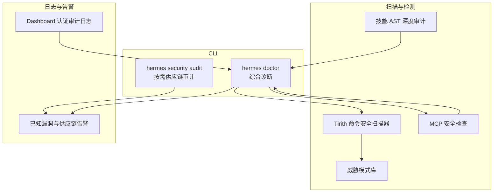
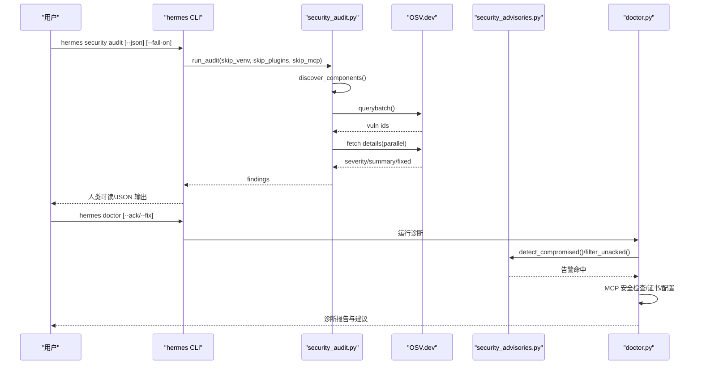
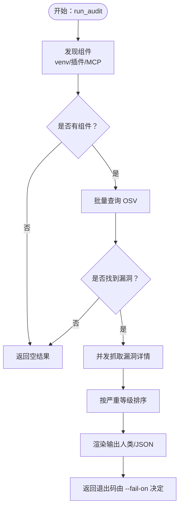
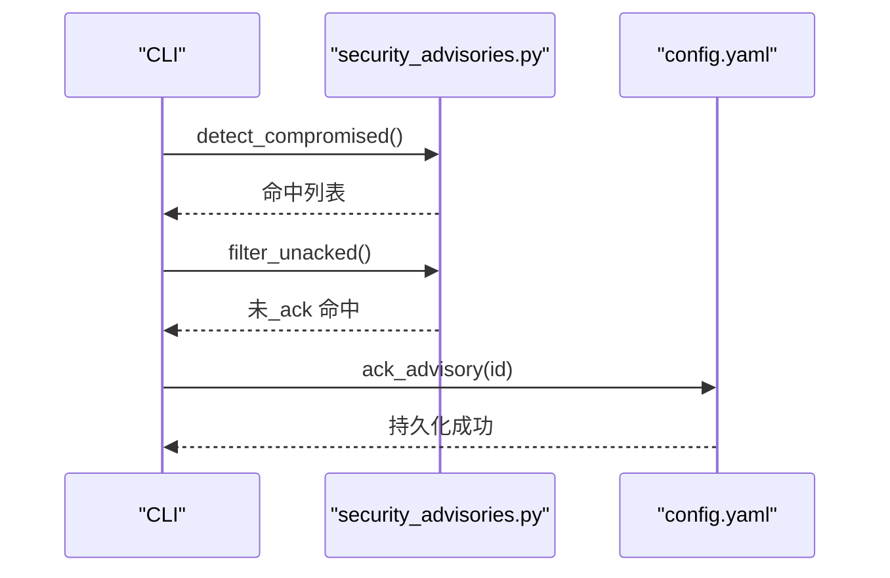
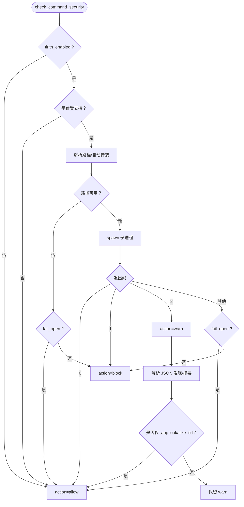
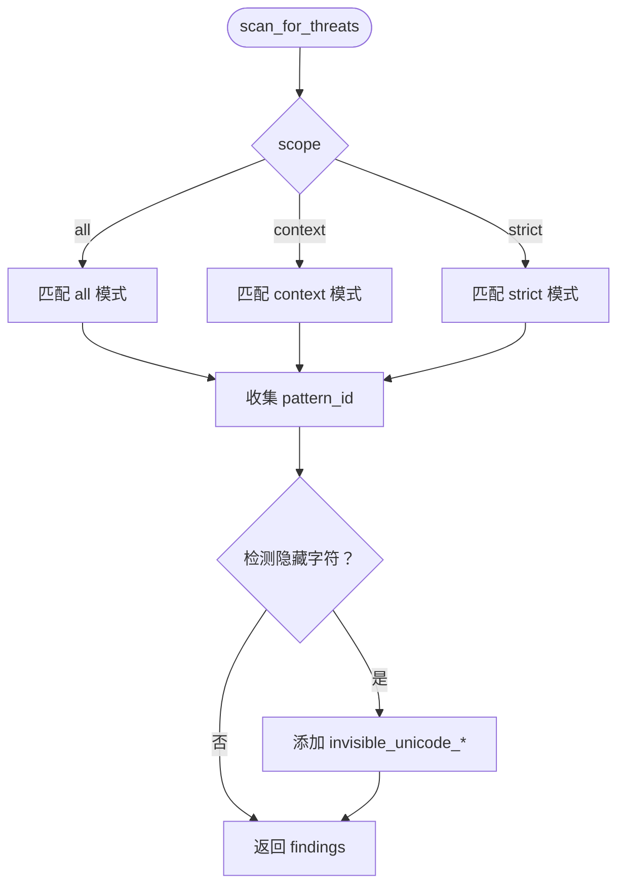
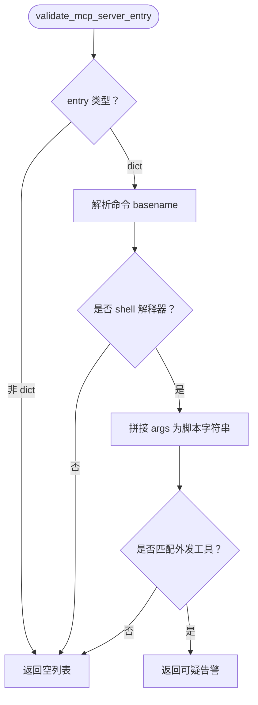
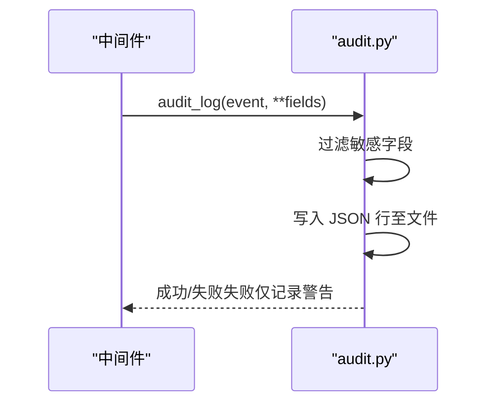
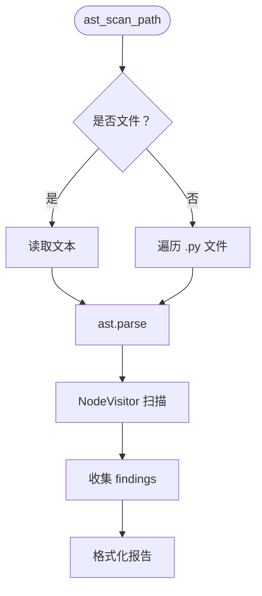
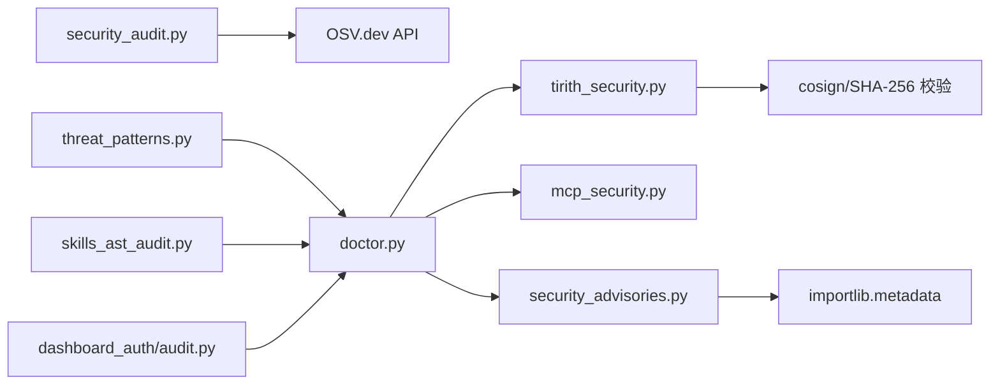

# 安全审计

<cite>
**本文引用的文件**
- [security_audit.py](file://hermes_cli/security_audit.py)
- [subcommands/security.py](file://hermes_cli/subcommands/security.py)
- [mcp_security.py](file://hermes_cli/mcp_security.py)
- [security_advisories.py](file://hermes_cli/security_advisories.py)
- [tirith_security.py](file://tools/tirith_security.py)
- [threat_patterns.py](file://tools/threat_patterns.py)
- [audit.py](file://hermes_cli/dashboard_auth/audit.py)
- [skills_ast_audit.py](file://tools/skills_ast_audit.py)
- [doctor.py](file://hermes_cli/doctor.py)
- [subcommands/doctor.py](file://hermes_cli/subcommands/doctor.py)
</cite>

## 目录
1. [简介](#简介)
2. [项目结构](#项目结构)
3. [核心组件](#核心组件)
4. [架构总览](#架构总览)
5. [详细组件分析](#详细组件分析)
6. [依赖关系分析](#依赖关系分析)
7. [性能考量](#性能考量)
8. [故障排查指南](#故障排查指南)
9. [结论](#结论)
10. [附录：安全审计配置指南](#附录安全审计配置指南)

## 简介
本技术文档聚焦于安全审计与监控体系，覆盖以下方面：
- 威胁检测与异常行为识别：内容级注入与外泄模式、命令执行前扫描、MCP 服务器可疑入口检测。
- 风险评估与告警：基于严重等级的阈值控制、可机读输出、退出码语义化。
- 安全审计日志：登录鉴权审计日志（含脱敏）、技能 AST 深度审计提示。
- 错误分类与事件处理：命令安全扫描的“允许/警告/阻断”三态决策、失败开/关策略、告警抑制规则。
- 诊断工具与合规检查：Doctor 诊断、证书校验、版本一致性检查、MCP 安全检查、已知漏洞与供应链告警。
- 安全合规配置：告警阈值、审计策略、事件响应流程的最佳实践。

## 项目结构
围绕安全审计的关键模块分布如下：
- CLI 子命令与入口
  - hermes security audit：按需供应链审计（venv、插件、MCP）。
  - hermes doctor：综合诊断，包含安全告警、MCP 安全检查、证书与配置校验。
- 工具与扫描器
  - Tirith 命令安全扫描器：自动安装、平台支持检测、超时与失败策略、JSON 结果增强。
  - 威胁模式库：上下文窗口与结果级别的注入/外泄/持久化模式匹配。
  - 技能 AST 深度审计：动态导入/属性访问等高风险语法节点提示。
- 审计日志
  - Dashboard 认证审计日志：JSON 行式日志、字段脱敏、线程安全写入。
- MCP 安全
  - MCP 服务器条目可疑检测：基于解释器与网络外发工具的启发式。

图示来源
- [security_audit.py:528-577](file://hermes_cli/security_audit.py#L528-L577)
- [subcommands/security.py:12-63](file://hermes_cli/subcommands/security.py#L12-L63)
- [doctor.py:560-583](file://hermes_cli/doctor.py#L560-L583)
- [tirith_security.py:697-800](file://tools/tirith_security.py#L697-L800)
- [threat_patterns.py:187-225](file://tools/threat_patterns.py#L187-L225)
- [mcp_security.py:64-97](file://hermes_cli/mcp_security.py#L64-L97)
- [skills_ast_audit.py:84-116](file://tools/skills_ast_audit.py#L84-L116)
- [audit.py:63-88](file://hermes_cli/dashboard_auth/audit.py#L63-L88)

章节来源
- [security_audit.py:1-577](file://hermes_cli/security_audit.py#L1-L577)
- [subcommands/security.py:1-63](file://hermes_cli/subcommands/security.py#L1-L63)
- [doctor.py:514-583](file://hermes_cli/doctor.py#L514-L583)
- [tirith_security.py:1-800](file://tools/tirith_security.py#L1-L800)
- [threat_patterns.py:1-253](file://tools/threat_patterns.py#L1-L253)
- [mcp_security.py:1-97](file://hermes_cli/mcp_security.py#L1-L97)
- [skills_ast_audit.py:1-134](file://tools/skills_ast_audit.py#L1-L134)
- [audit.py:1-88](file://hermes_cli/dashboard_auth/audit.py#L1-L88)

## 核心组件
- 供应链审计（OSV）
  - 发现目标：运行环境 venv、用户插件 requirements/pyproject、config.yaml 中的 MCP 服务器命令行。
  - 查询与聚合：批量查询 OSV.dev，提取严重等级、摘要、修复版本；按严重等级排序。
  - 输出：人类可读或 JSON；支持 --fail-on 严重等级阈值控制。
- 已知漏洞与供应链告警
  - 基于 importlib.metadata 的包版本检测，匹配已知被污染版本清单，提供修复步骤与可_ack_标记。
- 命令安全扫描（Tirith）
  - 自动下载与校验（SHA-256 或 cosign + SHA-256），平台支持检测，超时与失败策略（fail-open/fail-closed）。
  - 返回“允许/警告/阻断”，JSON 结果增强但不改变退出码决定。
- 威胁模式扫描
  - 上下文/严格作用域的注入/外泄/持久化模式匹配，含隐藏字符检测。
- MCP 安全检查
  - 针对 stdio 命令中使用 shell 解释器且包含网络外发工具的可疑组合进行告警。
- 审计日志
  - Dashboard 认证事件 JSON 行式日志，自动脱敏敏感字段，线程安全写入。
- 技能 AST 深度审计
  - 动态导入/属性访问等高风险语法节点提示，供人工复核。

章节来源
- [security_audit.py:414-458](file://hermes_cli/security_audit.py#L414-L458)
- [security_advisories.py:167-189](file://hermes_cli/security_advisories.py#L167-L189)
- [tirith_security.py:697-776](file://tools/tirith_security.py#L697-L776)
- [threat_patterns.py:187-225](file://tools/threat_patterns.py#L187-L225)
- [mcp_security.py:64-97](file://hermes_cli/mcp_security.py#L64-L97)
- [audit.py:63-88](file://hermes_cli/dashboard_auth/audit.py#L63-L88)
- [skills_ast_audit.py:84-116](file://tools/skills_ast_audit.py#L84-L116)

## 架构总览
整体流程从 CLI 入口进入，根据子命令选择不同路径：
- security audit：发现组件 → 批量查询 OSV → 聚合结果 → 渲染输出。
- doctor：综合健康检查，包含安全告警、MCP 安全检查、证书与配置校验，并调用命令安全扫描与威胁模式扫描。

图示来源
- [security_audit.py:414-577](file://hermes_cli/security_audit.py#L414-L577)
- [security_advisories.py:167-257](file://hermes_cli/security_advisories.py#L167-L257)
- [doctor.py:465-583](file://hermes_cli/doctor.py#L465-L583)

## 详细组件分析

### 组件A：供应链审计（OSV）
- 数据面
  - venv：通过 importlib.metadata 列举已安装分发包。
  - 插件：解析 requirements.txt 与 pyproject.toml 中的精确版本 pin。
  - MCP：从 config.yaml 提取命令行参数中的 npx/uvx 包名与版本。
- 查询与聚合
  - 批量查询 OSV.dev，提取每个组件的漏洞 ID；并发抓取漏洞详情，提取严重等级、摘要、修复版本。
  - 排序：按严重等级降序，其次按来源、名称、ID。
- 输出与阈值
  - 支持 JSON 与人类可读；--fail-on 控制退出码（达到或超过阈值则非零）。

图示来源
- [security_audit.py:414-458](file://hermes_cli/security_audit.py#L414-L458)
- [security_audit.py:463-510](file://hermes_cli/security_audit.py#L463-L510)
- [security_audit.py:528-577](file://hermes_cli/security_audit.py#L528-L577)

章节来源
- [security_audit.py:84-280](file://hermes_cli/security_audit.py#L84-L280)
- [security_audit.py:300-409](file://hermes_cli/security_audit.py#L300-L409)
- [security_audit.py:414-458](file://hermes_cli/security_audit.py#L414-L458)
- [security_audit.py:528-577](file://hermes_cli/security_audit.py#L528-L577)

### 组件B：已知漏洞与供应链告警
- 检测
  - 使用 importlib.metadata 版本号匹配已知被污染包版本集合。
- 处理
  - 可_ack_标记持久化到配置；启动横幅按 24 小时间隔重复提示未_ack_告警。
- 输出
  - doctor 分区展示，逐条给出修复步骤。

图示来源
- [security_advisories.py:167-189](file://hermes_cli/security_advisories.py#L167-L189)
- [security_advisories.py:222-249](file://hermes_cli/security_advisories.py#L222-L249)
- [security_advisories.py:424-454](file://hermes_cli/security_advisories.py#L424-L454)

章节来源
- [security_advisories.py:95-129](file://hermes_cli/security_advisories.py#L95-L129)
- [security_advisories.py:167-257](file://hermes_cli/security_advisories.py#L167-L257)
- [security_advisories.py:424-454](file://hermes_cli/security_advisories.py#L424-L454)

### 组件C：命令安全扫描（Tirith）
- 自动安装与校验
  - 平台检测（Darwin/Linux/Android），目标三元组解析；优先 cosign + SHA-256，否则仅 SHA-256。
  - 后台线程下载，避免启动阻塞；失败原因磁盘标记与去重警告。
- 执行与决策
  - 子进程调用，超时与 spawn 失败遵循 fail_open/fail_closed；退出码映射为“允许/警告/阻断”。
  - JSON 结果增强（最多 50 条发现，摘要最多 500 字符），但不覆盖退出码。
  - 特例：仅 .app TLD 的 lookalike_tld 发现会被抑制为“允许”。

图示来源
- [tirith_security.py:697-776](file://tools/tirith_security.py#L697-L776)
- [tirith_security.py:777-800](file://tools/tirith_security.py#L777-L800)

章节来源
- [tirith_security.py:68-88](file://tools/tirith_security.py#L68-L88)
- [tirith_security.py:356-452](file://tools/tirith_security.py#L356-L452)
- [tirith_security.py:697-800](file://tools/tirith_security.py#L697-L800)

### 组件D：威胁模式扫描（上下文/严格作用域）
- 模式组织
  - 按攻击类别与作用域划分（all/context/strict），避免通用指令语言导致的误报。
- 扫描范围
  - all：经典注入/外泄；context：提示型 C2/脑虫/角色劫持；strict：持久化/SSH 后门/敏感路径修改。
- 实现要点
  - 编译后按作用域缓存；单次遍历检测隐藏字符；首条威胁消息用于阻断路径。

图示来源
- [threat_patterns.py:187-225](file://tools/threat_patterns.py#L187-L225)

章节来源
- [threat_patterns.py:48-116](file://tools/threat_patterns.py#L48-L116)
- [threat_patterns.py:187-225](file://tools/threat_patterns.py#L187-L225)

### 组件E：MCP 安全检查
- 触发条件
  - 命令为 shell 解释器，且参数中出现网络外发工具关键词，或包含外泄特征。
- 输出
  - 返回可疑项列表，供 doctor 展示与汇总。

图示来源
- [mcp_security.py:64-97](file://hermes_cli/mcp_security.py#L64-L97)

章节来源
- [mcp_security.py:64-97](file://hermes_cli/mcp_security.py#L64-L97)

### 组件F：审计日志（Dashboard 认证）
- 日志位置与格式
  - $HERMES_HOME/logs/dashboard-auth.log，每行一个 JSON 对象。
- 脱敏策略
  - 忽略 access_token/refresh_token/code/state/ticket/cookie/Authorization 等字段。
- 可靠性
  - 线程锁保证写入安全；异常仅记录警告不抛出。

图示来源
- [audit.py:63-88](file://hermes_cli/dashboard_auth/audit.py#L63-L88)

章节来源
- [audit.py:26-50](file://hermes_cli/dashboard_auth/audit.py#L26-L50)
- [audit.py:63-88](file://hermes_cli/dashboard_auth/audit.py#L63-L88)

### 组件G：技能 AST 深度审计
- 目标
  - 识别动态导入/动态属性访问等高风险语法节点，作为人工复核提示。
- 范围
  - 单文件或递归扫描目录，忽略常见目录（如 __pycache__ 等）。

图示来源
- [skills_ast_audit.py:84-116](file://tools/skills_ast_audit.py#L84-L116)
- [skills_ast_audit.py:118-134](file://tools/skills_ast_audit.py#L118-L134)

章节来源
- [skills_ast_audit.py:25-82](file://tools/skills_ast_audit.py#L25-L82)
- [skills_ast_audit.py:84-116](file://tools/skills_ast_audit.py#L84-L116)
- [skills_ast_audit.py:118-134](file://tools/skills_ast_audit.py#L118-L134)

## 依赖关系分析
- CLI 与模块耦合
  - security audit 与 security_advisories、mcp_security、tirith_security、threat_patterns 等模块解耦，通过函数接口交互。
  - doctor 将多个诊断能力整合，形成统一的“安全健康检查”视图。
- 外部依赖
  - OSV.dev：批量查询与详情获取。
  - Tirith：外部二进制，支持自动安装与校验。
  - importlib.metadata：供应链审计与告警检测的基础。
- 潜在循环依赖
  - 审计日志模块避免引入 hermes_constants，降低启动期导入环风险。

图示来源
- [security_audit.py:300-409](file://hermes_cli/security_audit.py#L300-L409)
- [security_advisories.py:146-189](file://hermes_cli/security_advisories.py#L146-L189)
- [doctor.py:560-583](file://hermes_cli/doctor.py#L560-L583)
- [tirith_security.py:264-328](file://tools/tirith_security.py#L264-L328)
- [threat_patterns.py:187-225](file://tools/threat_patterns.py#L187-L225)
- [skills_ast_audit.py:84-116](file://tools/skills_ast_audit.py#L84-L116)
- [audit.py:63-88](file://hermes_cli/dashboard_auth/audit.py#L63-L88)

章节来源
- [security_audit.py:300-409](file://hermes_cli/security_audit.py#L300-L409)
- [security_advisories.py:146-189](file://hermes_cli/security_advisories.py#L146-L189)
- [doctor.py:560-583](file://hermes_cli/doctor.py#L560-L583)
- [tirith_security.py:264-328](file://tools/tirith_security.py#L264-L328)
- [threat_patterns.py:187-225](file://tools/threat_patterns.py#L187-L225)
- [skills_ast_audit.py:84-116](file://tools/skills_ast_audit.py#L84-L116)
- [audit.py:63-88](file://hermes_cli/dashboard_auth/audit.py#L63-L88)

## 性能考量
- 并发与批处理
  - OSV 查询采用批量请求与并发抓取详情，减少网络往返与提升吞吐。
- 缓存与去重
  - Tirith 下载失败磁盘标记与去重警告集合，避免重复网络尝试与日志刷屏。
- 轻量依赖
  - 告警检测仅依赖标准库 importlib.metadata，降低启动期依赖复杂度。
- I/O 安全
  - 审计日志写入加锁，异常仅记录警告，不影响主流程。

## 故障排查指南
- OSV 查询失败
  - 现象：审计失败并返回非零退出码。
  - 排查：检查网络连通性、超时设置、代理配置；必要时手动重试。
- Tirith 无法安装/执行
  - 现象：命令安全扫描不可用或 fail_open/fail_closed 行为。
  - 排查：确认平台支持、PATH/自定义路径、cosign 可用性、下载失败磁盘标记；查看后台安装线程状态。
- 威胁模式误报
  - 现象：合法内容触发“上下文/严格”作用域模式。
  - 排查：调整作用域或在严格路径中人工确认；隐藏字符检测可用于定位注入痕迹。
- MCP 服务器可疑告警
  - 现象：doctor 报告可疑 stdio 命令。
  - 排查：移除 shell 解释器内联脚本中的网络外发工具，或改用安全的本地命令。
- 审计日志写入失败
  - 现象：认证事件未落盘。
  - 排查：检查日志目录权限、磁盘空间、线程锁竞争；关注警告日志。

章节来源
- [security_audit.py:562-565](file://hermes_cli/security_audit.py#L562-L565)
- [tirith_security.py:740-761](file://tools/tirith_security.py#L740-L761)
- [threat_patterns.py:187-225](file://tools/threat_patterns.py#L187-L225)
- [mcp_security.py:64-97](file://hermes_cli/mcp_security.py#L64-L97)
- [audit.py:81-88](file://hermes_cli/dashboard_auth/audit.py#L81-L88)

## 结论
该安全审计体系通过“供应链审计 + 已知漏洞告警 + 命令安全扫描 + 威胁模式检测 + MCP 安全检查 + 审计日志”的多层防护，实现了从依赖到运行态的全面安全可观测性。其设计强调：
- 低侵入与可扩展：模块化接口与最小依赖。
- 可运营性：阈值控制、机读输出、失败开/关策略、告警抑制与去重。
- 可诊断性：Doctor 统一入口，串联多项健康检查与修复建议。

## 附录：安全审计配置指南
- 告警阈值设置
  - 使用 security audit 的 --fail-on 参数设定严重等级阈值（默认 critical），在 CI/CD 中结合退出码实现自动化阻断。
- 审计策略制定
  - 供应链审计：按需启用 venv/plugins/MCP 三个面；对插件与 MCP 的版本 pin 保持严格，避免模糊版本导致审计漂移。
  - 命令安全扫描：通过环境变量与配置项控制启用/禁用、超时、失败策略；在 CI 中建议 fail-closed，在开发环境可考虑 fail-open。
- 事件响应流程
  - 命中已知漏洞：立即卸载受影响包、轮换凭证、审计日志与凭据文件；使用 doctor --ack 标记已处理告警。
  - 命令安全扫描告警：阻断高危命令，记录发现与摘要；对误报进行模式微调或作用域调整。
  - MCP 可疑条目：删除或重构 stdio 命令，避免在解释器内联脚本中使用网络外发工具。
  - 审计日志：定期巡检 dashboard-auth.log，建立告警与处置闭环。
- 最佳实践
  - 在 CI 中集成 security audit 与 doctor，确保每次构建均进行供应链与配置健康检查。
  - 对 Tirith 的自动安装与校验进行策略化管理，优先启用 cosign 校验。
  - 对威胁模式库进行持续维护，结合实际误报反馈优化作用域与模式。

章节来源
- [subcommands/security.py:35-61](file://hermes_cli/subcommands/security.py#L35-L61)
- [tirith_security.py:68-88](file://tools/tirith_security.py#L68-L88)
- [doctor.py:514-583](file://hermes_cli/doctor.py#L514-L583)
- [security_advisories.py:222-249](file://hermes_cli/security_advisories.py#L222-L249)
- [mcp_security.py:64-97](file://hermes_cli/mcp_security.py#L64-L97)
- [audit.py:63-88](file://hermes_cli/dashboard_auth/audit.py#L63-L88)