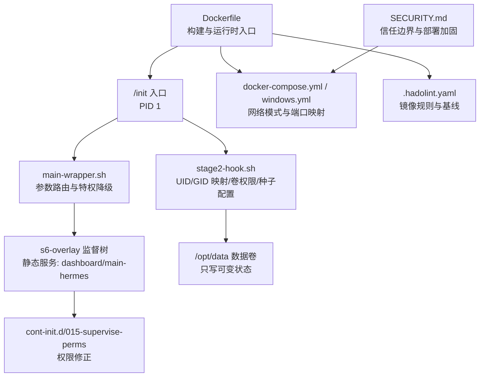
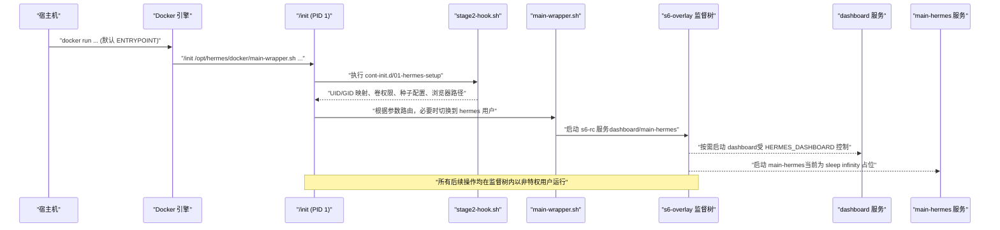
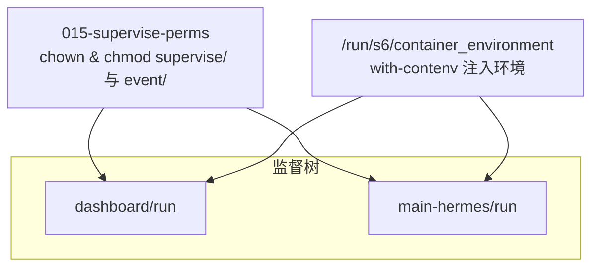
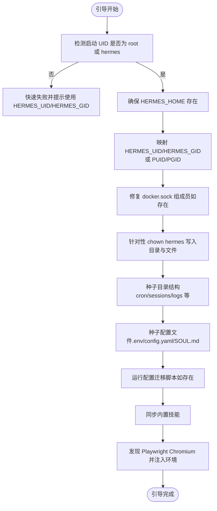
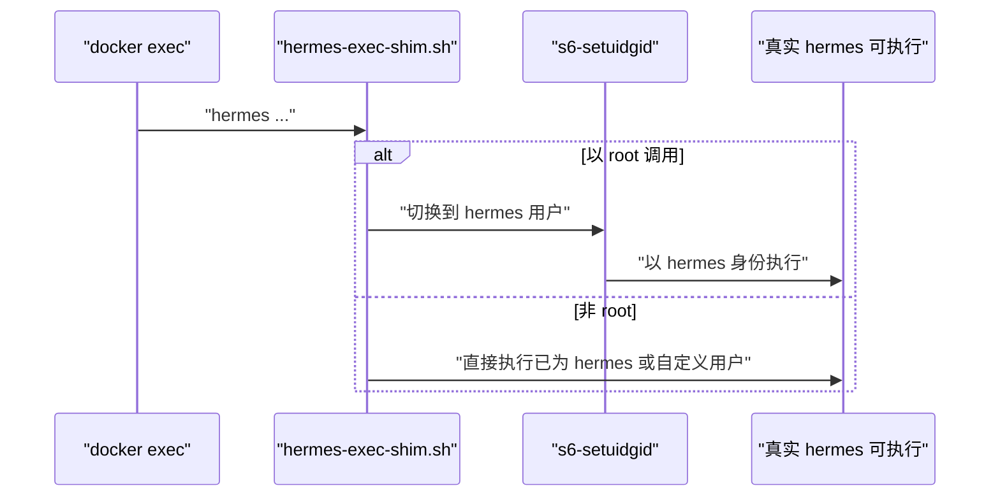
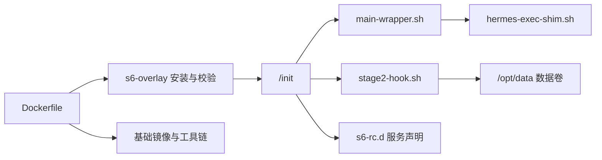

# 容器隔离

<cite>
**本文引用的文件**
- [Dockerfile](file://Dockerfile)
- [docker-compose.yml](file://docker-compose.yml)
- [docker-compose.windows.yml](file://docker-compose.windows.yml)
- [.hadolint.yaml](file://.hadolint.yaml)
- [docker/entrypoint.sh](file://docker/entrypoint.sh)
- [docker/main-wrapper.sh](file://docker/main-wrapper.sh)
- [docker/hermes-exec-shim.sh](file://docker/hermes-exec-shim.sh)
- [docker/stage2-hook.sh](file://docker/stage2-hook.sh)
- [docker/cont-init.d/015-supervise-perms](file://docker/cont-init.d/015-supervise-perms)
- [docker/s6-rc.d/main-hermes/run](file://docker/s6-rc.d/main-hermes/run)
- [docker/s6-rc.d/dashboard/run](file://docker/s6-rc.d/dashboard/run)
- [SECURITY.md](file://SECURITY.md)
</cite>

## 目录
1. [简介](#简介)
2. [项目结构](#项目结构)
3. [核心组件](#核心组件)
4. [架构总览](#架构总览)
5. [详细组件分析](#详细组件分析)
6. [依赖关系分析](#依赖关系分析)
7. [性能考量](#性能考量)
8. [故障排查指南](#故障排查指南)
9. [结论](#结论)
10. [附录：容器安全配置指南](#附录容器安全配置指南)

## 简介
本技术文档聚焦于该代码库中的容器化隔离与沙箱机制，系统性阐述以下主题：
- Docker 容器安全配置：用户命名空间映射、能力限制、挂载策略与只读根文件系统等
- s6 监督进程的安全隔离：进程树管理、特权降级、资源与信号处理
- 初始化脚本的安全实现：权限提升与回退、环境准备、健康检查与引导流程
- 容器间通信安全控制：网络隔离、IPC 限制、共享内存管理
- 文件系统安全：只读根文件系统、临时文件隔离、挂载点限制
- 容器安全配置最佳实践：镜像扫描、运行时安全、漏洞管理

## 项目结构
围绕容器隔离的关键文件主要分布在以下位置：
- 镜像构建与运行时入口：Dockerfile、docker/entrypoint.sh、docker/main-wrapper.sh、docker/hermes-exec-shim.sh
- s6 监督体系：docker/s6-rc.d/*/run、docker/cont-init.d/015-supervise-perms
- 启动阶段引导：docker/stage2-hook.sh
- 编排与安全建议：docker-compose.yml、docker-compose.windows.yml、.hadolint.yaml、SECURITY.md

**图表来源**
- [Dockerfile](file://Dockerfile)
- [docker/main-wrapper.sh](file://docker/main-wrapper.sh)
- [docker/stage2-hook.sh](file://docker/stage2-hook.sh)
- [docker/cont-init.d/015-supervise-perms](file://docker/cont-init.d/015-supervise-perms)
- [docker/s6-rc.d/dashboard/run](file://docker/s6-rc.d/dashboard/run)
- [docker/s6-rc.d/main-hermes/run](file://docker/s6-rc.d/main-hermes/run)
- [docker-compose.yml](file://docker-compose.yml)
- [.hadolint.yaml](file://.hadolint.yaml)
- [SECURITY.md](file://SECURITY.md)

**章节来源**
- [Dockerfile](file://Dockerfile)
- [docker-compose.yml](file://docker-compose.yml)
- [docker-compose.windows.yml](file://docker-compose.windows.yml)
- [.hadolint.yaml](file://.hadolint.yaml)
- [SECURITY.md](file://SECURITY.md)

## 核心组件
- s6-overlay 进程监督与 PID 1（/init）
  - 通过 /init 设置监督树，执行 cont-init.d 脚本，启动 s6-rc 声明的服务，并将最终程序以继承标准输入输出的方式 exec，保证交互式会话正常工作
- 主命令包装器（main-wrapper.sh）
  - 提供参数路由逻辑（无参、直接可执行、hermes 子命令），在需要时通过 s6-setuidgid 切换到非特权用户 hermes
- 权限下放与执行门面（hermes-exec-shim.sh）
  - 防止 docker exec 作为 root 写入 /opt/data 导致权限不一致；当以 root 身份调用时透明降权至 hermes 用户
- 引导钩子（stage2-hook.sh）
  - 在用户服务启动前完成：UID/GID 映射、数据卷 chown、配置与技能种子、浏览器二进制路径发现、Docker Socket 组成员修复等
- 监督树权限修正（015-supervise-perms）
  - 将静态服务的 supervise/ 与 event/ 目录所有权与权限调整为非特权用户可查询与控制
- 编排与网络策略（docker-compose.yml / windows.yml）
  - 默认使用 host 网络模式，便于本地服务直连；Windows 桌面版改用端口映射与本地绑定

**章节来源**
- [Dockerfile](file://Dockerfile)
- [docker/main-wrapper.sh](file://docker/main-wrapper.sh)
- [docker/hermes-exec-shim.sh](file://docker/hermes-exec-shim.sh)
- [docker/stage2-hook.sh](file://docker/stage2-hook.sh)
- [docker/cont-init.d/015-supervise-perms](file://docker/cont-init.d/015-supervise-perms)
- [docker/s6-rc.d/dashboard/run](file://docker/s6-rc.d/dashboard/run)
- [docker/s6-rc.d/main-hermes/run](file://docker/s6-rc.d/main-hermes/run)
- [docker-compose.yml](file://docker-compose.yml)
- [docker-compose.windows.yml](file://docker-compose.windows.yml)

## 架构总览
下图展示了从容器启动到服务运行的完整链路，强调安全边界与特权降级：

**图表来源**
- [Dockerfile](file://Dockerfile)
- [docker/stage2-hook.sh](file://docker/stage2-hook.sh)
- [docker/main-wrapper.sh](file://docker/main-wrapper.sh)
- [docker/s6-rc.d/dashboard/run](file://docker/s6-rc.d/dashboard/run)
- [docker/s6-rc.d/main-hermes/run](file://docker/s6-rc.d/main-hermes/run)

## 详细组件分析

### s6 监督进程与进程树管理
- 监督树职责
  - 管理 dashboard 与 main-hermes 服务槽位，支持状态查询与事件监听
  - 对动态注册的网关服务进行编排与恢复
- 权限与可见性
  - 通过 015-supervise-perms 将 supervise/ 与 event/ 的所有权与权限调整为非特权用户可访问
  - 静态服务（dashboard/main-hermes）在引导阶段即被监督，避免外部直接控制
- 信号与生命周期
  - 由 /init 作为 PID 1 接收并转发信号，确保僵尸进程回收与优雅关闭

**图表来源**
- [docker/cont-init.d/015-supervise-perms](file://docker/cont-init.d/015-supervise-perms)
- [docker/s6-rc.d/dashboard/run](file://docker/s6-rc.d/dashboard/run)
- [docker/s6-rc.d/main-hermes/run](file://docker/s6-rc.d/main-hermes/run)

**章节来源**
- [docker/cont-init.d/015-supervise-perms](file://docker/cont-init.d/015-supervise-perms)
- [docker/s6-rc.d/dashboard/run](file://docker/s6-rc.d/dashboard/run)
- [docker/s6-rc.d/main-hermes/run](file://docker/s6-rc.d/main-hermes/run)

### 初始化脚本与引导流程（stage2-hook.sh）
- 关键职责
  - UID/GID 映射：支持 HERMES_UID/HERMES_GID 或 PUID/PGID 别名，兼容 NAS 场景
  - 数据卷权限修复：仅对 hermes 实际写入的目录与文件进行针对性 chown，避免破坏宿主文件所有权
  - 配置与种子：首次启动生成 .env、config.yaml、SOUL.md；严格控制权限
  - 技能同步：内置技能目录一次性同步到 /opt/data/skills
  - 浏览器二进制路径发现：自动定位 Playwright Chromium 并注入环境变量
  - Docker Socket 组修复：检测宿主 docker.sock 所属组并为 hermes 用户添加成员关系
- 安全要点
  - 严格区分“安装树”与“数据卷”：前者保持 root 只读，后者为可写可变状态
  - 避免任意 --user 启动：若容器以非 hermes UID 启动，引导被跳过并快速失败，防止破坏监督树
  - 针对性 chown：仅修复 hermes 写入的子目录与特定文件，减少对宿主的侵扰

**图表来源**
- [docker/stage2-hook.sh](file://docker/stage2-hook.sh)

**章节来源**
- [docker/stage2-hook.sh](file://docker/stage2-hook.sh)

### 权限下放与执行门面（hermes-exec-shim.sh 与 main-wrapper.sh）
- hermes-exec-shim.sh
  - 当 docker exec 以 root 身份调用 hermes 时，透明地通过 s6-setuidgid 切换到 hermes 用户，避免写入 /opt/data 造成权限错配
  - 支持可选的完全 root 行为（HERMES_DOCKER_EXEC_AS_ROOT=1），用于诊断场景
- main-wrapper.sh
  - 参数路由：无参执行 hermes、直接可执行命令透传、其他作为 hermes 子命令
  - 特权降级：仅在 root 且非 hermes UID 时降权
  - 环境准备：设置 HOME=/opt/data，激活虚拟环境，恢复原始工作目录

**图表来源**
- [docker/hermes-exec-shim.sh](file://docker/hermes-exec-shim.sh)

**章节来源**
- [docker/hermes-exec-shim.sh](file://docker/hermes-exec-shim.sh)
- [docker/main-wrapper.sh](file://docker/main-wrapper.sh)

### 容器间通信与网络隔离
- 默认策略
  - 使用 host 网络模式，便于本地服务直连；dashboard 默认仅绑定 127.0.0.1，避免暴露
  - Windows 桌面版采用端口映射与本地绑定，dashboard 可显式开启 --insecure（不推荐）
- 安全建议
  - 不要将 dashboard 暴露到 0.0.0.0 且不加认证
  - 如需远程访问，使用 SSH 隧道或反向代理 + 认证
  - 禁止在生产环境暴露网关或 API 至公网，除非配合 VPN/Tailscale/防火墙

**章节来源**
- [docker-compose.yml](file://docker-compose.yml)
- [docker-compose.windows.yml](file://docker-compose.windows.yml)

### 文件系统安全与挂载策略
- 只读根文件系统
  - 安装树位于 /opt/hermes，构建阶段设置为非写权限，运行时保持 root 只读，防止会话自我修改
- 可变状态与数据卷
  - 所有用户数据、日志、会话、技能、计划、工作区等均位于 /opt/data（挂载点），由 stage2-hook 针对性 chown
- 临时文件与浏览器缓存
  - Playwright 浏览器缓存置于 /opt/hermes/.playwright，避免与宿主卷冲突
- 挂载点限制
  - 仅挂载 /opt/data；其他路径保持不可变，降低攻击面

**章节来源**
- [Dockerfile](file://Dockerfile)
- [docker/stage2-hook.sh](file://docker/stage2-hook.sh)

## 依赖关系分析
- 构建期依赖
  - 多阶段构建：uv 与 node 源阶段分别提供工具链，最终合并到基础镜像
  - s6-overlay 通过校验和验证完整性，确保供应链安全
- 运行期依赖
  - /init 作为 PID 1，依赖 cont-init.d 与 s6-rc.d 完成引导与服务声明
  - main-wrapper.sh 与 hermes-exec-shim.sh 依赖 s6-setuidgid 实现特权降级
  - stage2-hook.sh 依赖 /opt/data 的存在与权限，以及可选的 docker.sock

**图表来源**
- [Dockerfile](file://Dockerfile)
- [docker/main-wrapper.sh](file://docker/main-wrapper.sh)
- [docker/hermes-exec-shim.sh](file://docker/hermes-exec-shim.sh)
- [docker/stage2-hook.sh](file://docker/stage2-hook.sh)

**章节来源**
- [Dockerfile](file://Dockerfile)
- [docker/main-wrapper.sh](file://docker/main-wrapper.sh)
- [docker/hermes-exec-shim.sh](file://docker/hermes-exec-shim.sh)
- [docker/stage2-hook.sh](file://docker/stage2-hook.sh)

## 性能考量
- 层缓存优化
  - 分离前端与 Python 依赖安装层，避免源码变更导致重复安装
  - 使用 uv 与 npm 的冻结安装策略，加速冷启动
- 启动时间
  - s6-overlay 的监督树在引导阶段完成，避免运行时动态发现带来的延迟
- I/O 与磁盘
  - /opt/data 作为唯一可写卷，减少对只读层的写放大
  - Playwright 缓存独立路径，避免与宿主卷产生竞争

[本节为通用指导，无需具体文件分析]

## 故障排查指南
- 容器启动后网关未运行
  - 检查 stage2-hook 输出，确认是否因 --user 非 root 导致引导跳过
  - 确认 /opt/data 权限与归属正确
- dashboard 无法访问或报权限错误
  - 确认 HERMES_DASHBOARD 已启用，且未绑定到 0.0.0.0 且未加 --insecure
  - 若使用 Windows 桌面版，检查端口映射与本地绑定
- docker exec 写入文件权限异常
  - 使用 hermes-exec-shim.sh 门面而非直接以 root 身份执行
  - 必要时设置 HERMES_DOCKER_EXEC_AS_ROOT=1 进行诊断

**章节来源**
- [docker/stage2-hook.sh](file://docker/stage2-hook.sh)
- [docker/main-wrapper.sh](file://docker/main-wrapper.sh)
- [docker/hermes-exec-shim.sh](file://docker/hermes-exec-shim.sh)
- [docker-compose.yml](file://docker-compose.yml)
- [docker-compose.windows.yml](file://docker-compose.windows.yml)

## 结论
该容器化方案通过 s6-overlay 的监督树与严格的特权降级，结合只读根文件系统与针对性的数据卷权限修复，实现了强隔离与可审计的运行时环境。初始化脚本在启动阶段完成 UID/GID 映射、配置种子与浏览器路径发现，确保服务可用性与安全性。配合编排层的网络策略与安全建议，可在不同环境中满足从开发到生产的多种部署需求。

[本节为总结，无需具体文件分析]

## 附录：容器安全配置指南
- 镜像扫描与基线
  - 使用 .hadolint.yaml 规则集持续审查 Dockerfile，避免不必要的风险项
  - 基础镜像采用固定 SHA256，确保供应链可追溯
- 运行时安全
  - 默认以非 root 用户运行；禁止使用任意 --user 启动
  - 通过 HERMES_UID/HERMES_GID 或 PUID/PGID 映射宿主用户，避免权限错配
  - 严格限制对外暴露面：dashboard 默认仅本地绑定，不建议暴露到公网
- 漏洞管理与合规
  - 定期更新基础镜像与依赖，关注安全公告
  - 第三方技能与插件必须经过操作员审查后再安装
  - 严格控制环境变量传递，避免凭据泄露

**章节来源**
- [.hadolint.yaml](file://.hadolint.yaml)
- [Dockerfile](file://Dockerfile)
- [docker/stage2-hook.sh](file://docker/stage2-hook.sh)
- [SECURITY.md](file://SECURITY.md)