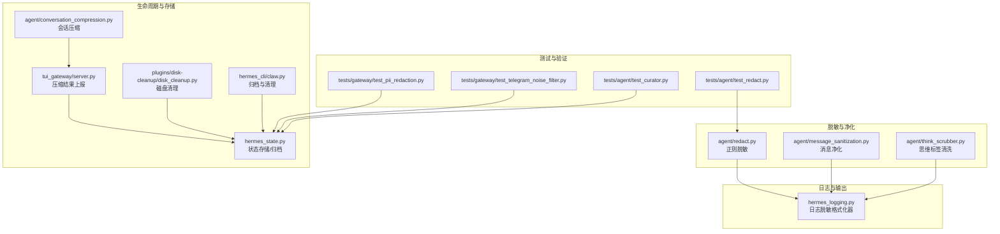
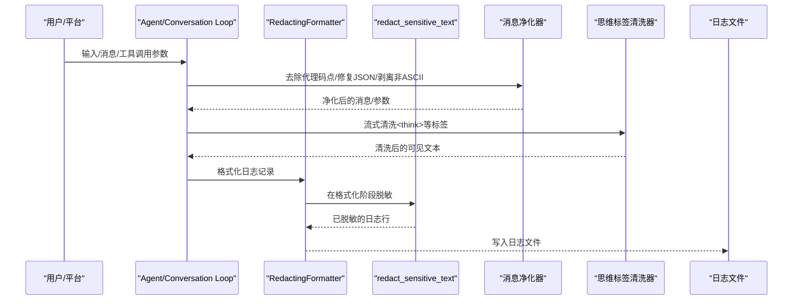
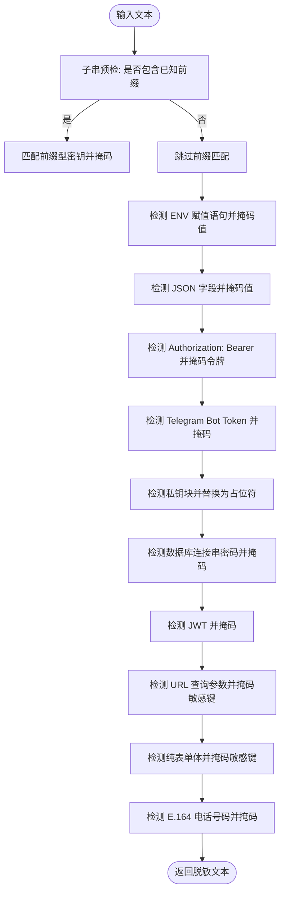
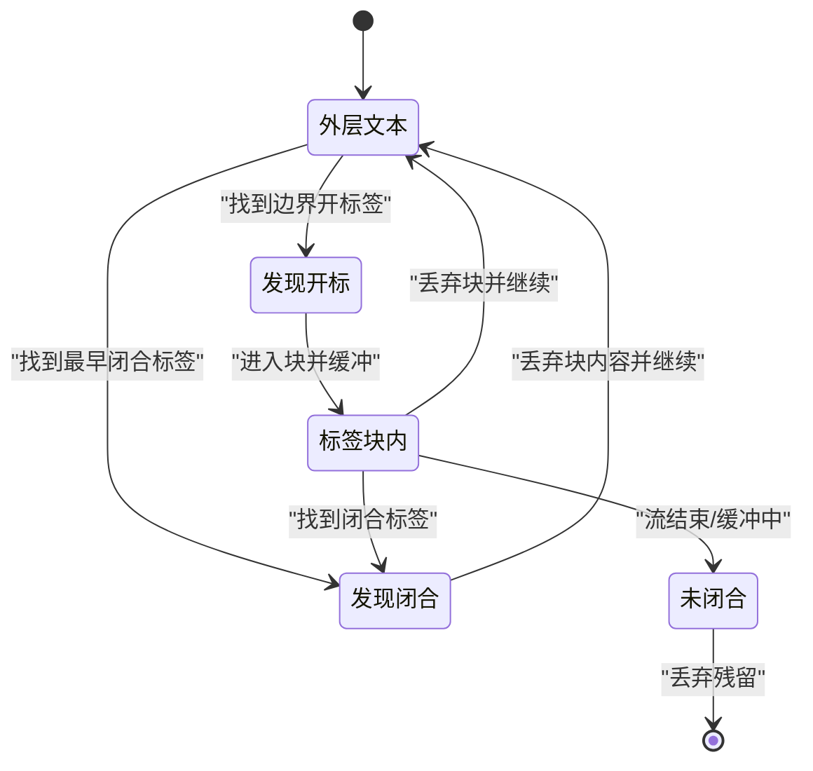
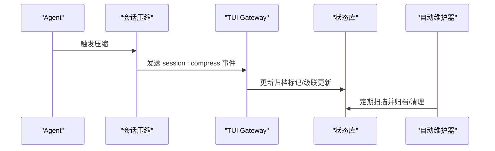
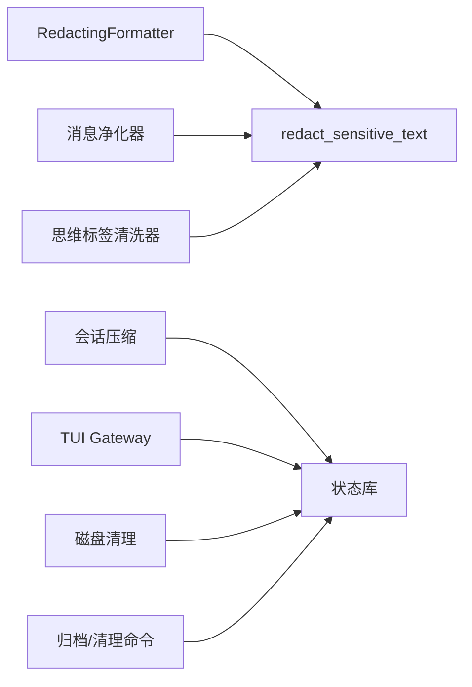

# 数据保护

<cite>
**本文引用的文件**
- [agent/redact.py](file://agent/redact.py)
- [agent/message_sanitization.py](file://agent/message_sanitization.py)
- [agent/think_scrubber.py](file://agent/think_scrubber.py)
- [hermes_logging.py](file://hermes_logging.py)
- [hermes_state.py](file://hermes_state.py)
- [tests/agent/test_redact.py](file://tests/agent/test_redact.py)
- [tests/gateway/test_pii_redaction.py](file://tests/gateway/test_pii_redaction.py)
- [tests/gateway/test_telegram_noise_filter.py](file://tests/gateway/test_telegram_noise_filter.py)
- [plugins/disk-cleanup/disk_cleanup.py](file://plugins/disk-cleanup/disk_cleanup.py)
- [agent/conversation_compression.py](file://agent/conversation_compression.py)
- [tui_gateway/server.py](file://tui_gateway/server.py)
- [hermes_cli/claw.py](file://hermes_cli/claw.py)
- [tests/agent/test_curator.py](file://tests/agent/test_curator.py)
- [agent/turn_context.py](file://agent/turn_context.py)
</cite>

## 目录
1. [简介](#简介)
2. [项目结构](#项目结构)
3. [核心组件](#核心组件)
4. [架构总览](#架构总览)
5. [详细组件分析](#详细组件分析)
6. [依赖分析](#依赖分析)
7. [性能考量](#性能考量)
8. [故障排查指南](#故障排查指南)
9. [结论](#结论)
10. [附录](#附录)

## 简介
本文件面向“数据保护与隐私保护”的综合技术文档，聚焦于以下目标：
- 敏感信息脱敏：基于正则表达式的密钥识别、查询字符串脱敏、URL 参数过滤、表单体脱敏、私钥块替换、数据库连接串密码掩码、电话号码掩码等。
- 日志脱敏策略：统一通过日志格式化器对日志进行脱敏，避免敏感信息落盘；授权头、令牌、私钥、数据库密码等均被处理。
- 消息净化机制：对工具调用参数、消息列表、结构化负载进行净化，修复或剔除非法字符，确保序列化稳定。
- 思维标签清理：流式场景下对<think>/<thinking>等推理标签进行状态机清洗，防止推理内容泄露。
- 数据最小化与生命周期管理：会话压缩、历史清理、临时文件管理、归档与过期策略、缓存与快照策略等。
- 配置与合规建议：如何通过环境变量与配置项启用/禁用脱敏、如何设置保留周期、如何审计与报告。

## 项目结构
围绕数据保护的关键模块分布如下：
- 脱敏与净化
  - 正则驱动的敏感信息脱敏：agent/redact.py
  - 消息与工具参数净化：agent/message_sanitization.py
  - 流式思维标签清洗：agent/think_scrubber.py
- 日志与输出
  - 统一日志脱敏格式化器：hermes_logging.py
- 生命周期与存储
  - 会话压缩与历史管理：agent/conversation_compression.py、tui_gateway/server.py
  - SQLite 状态存储与归档：hermes_state.py
  - 临时文件与磁盘清理：plugins/disk-cleanup/disk_cleanup.py、hermes_cli/claw.py
- 测试与验证
  - 脱敏行为测试：tests/agent/test_redact.py
  - PII 数据最小化测试：tests/gateway/test_pii_redaction.py
  - 平台最终响应脱敏测试：tests/gateway/test_telegram_noise_filter.py
  - 自动化维护与归档测试：tests/agent/test_curator.py

图表来源
- [agent/redact.py](file://agent/redact.py)
- [agent/message_sanitization.py](file://agent/message_sanitization.py)
- [agent/think_scrubber.py](file://agent/think_scrubber.py)
- [hermes_logging.py](file://hermes_logging.py)
- [agent/conversation_compression.py](file://agent/conversation_compression.py)
- [tui_gateway/server.py](file://tui_gateway/server.py)
- [hermes_state.py](file://hermes_state.py)
- [plugins/disk-cleanup/disk_cleanup.py](file://plugins/disk-cleanup/disk_cleanup.py)
- [hermes_cli/claw.py](file://hermes_cli/claw.py)
- [tests/agent/test_redact.py](file://tests/agent/test_redact.py)
- [tests/gateway/test_pii_redaction.py](file://tests/gateway/test_pii_redaction.py)
- [tests/gateway/test_telegram_noise_filter.py](file://tests/gateway/test_telegram_noise_filter.py)
- [tests/agent/test_curator.py](file://tests/agent/test_curator.py)

章节来源
- [agent/redact.py](file://agent/redact.py)
- [agent/message_sanitization.py](file://agent/message_sanitization.py)
- [agent/think_scrubber.py](file://agent/think_scrubber.py)
- [hermes_logging.py](file://hermes_logging.py)
- [agent/conversation_compression.py](file://agent/conversation_compression.py)
- [tui_gateway/server.py](file://tui_gateway/server.py)
- [hermes_state.py](file://hermes_state.py)
- [plugins/disk-cleanup/disk_cleanup.py](file://plugins/disk-cleanup/disk_cleanup.py)
- [hermes_cli/claw.py](file://hermes_cli/claw.py)
- [tests/agent/test_redact.py](file://tests/agent/test_redact.py)
- [tests/gateway/test_pii_redaction.py](file://tests/gateway/test_pii_redaction.py)
- [tests/gateway/test_telegram_noise_filter.py](file://tests/gateway/test_telegram_noise_filter.py)
- [tests/agent/test_curator.py](file://tests/agent/test_curator.py)

## 核心组件
- 正则驱动脱敏器（redact_sensitive_text）
  - 支持前缀型密钥（sk-、ghp_、xoxb- 等）、授权头、Telegram Bot Token、私钥块、数据库连接串密码、JWT、URL 查询参数、表单体、E.164 电话号码等。
  - 提供 mask_secret 辅助函数，按长度策略保留前后缀以兼顾可调试性。
  - 可通过环境变量控制全局开关，并支持强制模式绕过用户偏好。
- 消息净化器（message_sanitization）
  - 去除或替换 UTF-8 无效代理码点，修复工具调用参数 JSON 的常见畸形，剥离非 ASCII 字符（最后手段）。
  - 对消息列表与工具定义进行结构化遍历，确保序列化稳定。
- 思维标签清洗器（think_scrubber）
  - 流式状态下机地识别与丢弃<think>/<thinking>等标签块，避免推理内容泄漏；支持边界判定与部分标签缓冲。
- 日志脱敏格式化器（RedactingFormatter）
  - 所有日志记录在格式化阶段即被脱敏，避免敏感信息写入 agent.log、errors.log 等文件。
- 会话压缩与生命周期管理
  - 会话压缩后保留父链与压缩提示，事件回调通知外部同步；压缩锁释放避免死锁。
  - SQLite 状态库支持归档标记与级联更新，配合自动维护器进行周期性清理与归档。
- 临时文件与磁盘清理
  - 基于类别与年龄的快速清理策略，超过阈值自动清理；归档与清理命令支持批量执行与审计。

章节来源
- [agent/redact.py](file://agent/redact.py)
- [agent/message_sanitization.py](file://agent/message_sanitization.py)
- [agent/think_scrubber.py](file://agent/think_scrubber.py)
- [hermes_logging.py](file://hermes_logging.py)
- [agent/conversation_compression.py](file://agent/conversation_compression.py)
- [tui_gateway/server.py](file://tui_gateway/server.py)
- [hermes_state.py](file://hermes_state.py)
- [plugins/disk-cleanup/disk_cleanup.py](file://plugins/disk-cleanup/disk_cleanup.py)
- [hermes_cli/claw.py](file://hermes_cli/claw.py)

## 架构总览
从输入到落盘的全链路数据保护路径如下：

图表来源
- [agent/message_sanitization.py](file://agent/message_sanitization.py)
- [agent/think_scrubber.py](file://agent/think_scrubber.py)
- [hermes_logging.py](file://hermes_logging.py)
- [agent/redact.py](file://agent/redact.py)

## 详细组件分析

### 敏感信息脱敏机制（正则驱动）
- 关键能力
  - 前缀型密钥识别与掩码：覆盖 OpenAI、GitHub、Slack、Google、AWS、Stripe、SendGrid、HuggingFace、Replicate、npm、PyPI、DigitalOcean、ElevenLabs、Tavily、Exa、Groq、Matrix、RetainDB、Hindsight、Mem0、ByteRover、xAI、Notion 等。
  - 授权头脱敏：Authorization: Bearer …
  - Telegram Bot Token：bot<digits>:<token> 或 <digits>:<token>
  - 私钥块替换：-----BEGIN ... END----- 区间整体脱敏
  - 数据库连接串密码掩码：postgres/mysql/mongodb/redis/amqp 协议
  - JWT 令牌掩码：eyJ 开头的完整令牌
  - URL 查询参数脱敏：对敏感参数名（如 token、password、secret 等）的值进行掩码
  - 表单体脱敏：仅在纯 k=v&k=v 的情况下触发
  - 电话号码掩码：E.164 格式号码按长度保留前后缀
- 性能优化
  - 子串预检：在运行昂贵正则前先做子串存在性检查，避免全量扫描
  - 保守触发：URL 查询参数与请求目标查询参数脱敏默认关闭，避免误伤合法 OAuth 回调
- 验证与回归
  - 测试覆盖：Bearer 头、Telegram Token、短/长密钥、DB 连接串、OAuth 请求体、URL 查询参数等

图表来源
- [agent/redact.py](file://agent/redact.py)

章节来源
- [agent/redact.py](file://agent/redact.py)
- [tests/agent/test_redact.py](file://tests/agent/test_redact.py)

### 日志脱敏策略（RedactingFormatter）
- 统一入口：所有日志记录在格式化阶段即调用 redact_sensitive_text，确保不落盘敏感信息
- 组件分离：agent.log 作为主日志，errors.log 仅记录警告及以上级别，gateway.log/gui.log 分别承载网关与界面侧事件
- 会话上下文：线程本地存储注入 session_tag，便于关联与检索

章节来源
- [hermes_logging.py](file://hermes_logging.py)
- [agent/redact.py](file://agent/redact.py)

### 消息净化机制（工具参数与消息）
- 代理码点修复：[\ud800-\udfff] 替换为 U+FFFD，避免 json.dumps 抛错
- 结构化遍历：对嵌套字典/列表递归查找字符串字段，修复或剥离非法字符
- 工具调用参数修复：针对模型回退产生的畸形 JSON（尾随逗号、None、控制字符等）进行修复或转为空对象
- 非 ASCII 字符剥离：作为最后手段，确保在 ASCII 编码环境下稳定输出
- 图像内容移除：当服务端不支持图片时，移除图像内容并保持工具调用配对不变

章节来源
- [agent/message_sanitization.py](file://agent/message_sanitization.py)

### 思维标签清理（流式推理隔离）
- 状态机设计：跟踪是否处于标签块内、缓冲未闭合标签、根据边界判断是否丢弃
- 优先级：闭合块（<tag>内容</tag>）无条件丢弃；边界开标签（如<think>）仅在特定边界才丢弃
- 尾部刷新：流结束时若仍处于未闭合块，丢弃残留；否则输出剩余可见文本

图表来源
- [agent/think_scrubber.py](file://agent/think_scrubber.py)

章节来源
- [agent/think_scrubber.py](file://agent/think_scrubber.py)

### 数据最小化与会话生命周期管理
- 会话压缩
  - 压缩后保留父链与压缩提示，事件回调通知外部同步
  - 压缩锁在完成后释放，避免死锁
- 历史清理
  - 压缩触发时发出 session:compress 事件，钩子可获取旧会话详情
- 归档与过期
  - SQLite 状态库支持对压缩链上的祖先与后代进行归档标记
  - 自动维护器按配置周期性归档/清理，支持内置技能归档与抑制恢复

图表来源
- [agent/conversation_compression.py](file://agent/conversation_compression.py)
- [tui_gateway/server.py](file://tui_gateway/server.py)
- [hermes_state.py](file://hermes_state.py)
- [tests/agent/test_curator.py](file://tests/agent/test_curator.py)

章节来源
- [agent/conversation_compression.py](file://agent/conversation_compression.py)
- [tui_gateway/server.py](file://tui_gateway/server.py)
- [hermes_state.py](file://hermes_state.py)
- [tests/agent/test_curator.py](file://tests/agent/test_curator.py)

### 临时文件与磁盘清理
- 快速清理策略
  - test/temp/cron-output/research/chrome-profile 等类别按年龄阈值清理
  - 超大文件（>500MB）一律纳入提示清理队列
- 归档与清理命令
  - hermes claw cleanup 支持交互/非交互模式，dry-run 预览，批量执行并生成审计清单

章节来源
- [plugins/disk-cleanup/disk_cleanup.py](file://plugins/disk-cleanup/disk_cleanup.py)
- [hermes_cli/claw.py](file://hermes_cli/claw.py)

### PII 数据最小化与平台差异
- 用户标识最小化：不同平台对用户 ID 的使用方式不同，某些平台（如 WhatsApp、Signal）需要对用户 ID 进行哈希或匿名化，而 Discord、Slack 可能需要保留其特殊格式以便提及
- 一致性与可重复性：同一用户 ID 在相同平台下生成一致的哈希，不同平台之间互不影响

章节来源
- [tests/gateway/test_pii_redaction.py](file://tests/gateway/test_pii_redaction.py)

### 平台最终响应脱敏
- 平台错误消息可能包含认证失败细节与内部错误码，系统在最终响应阶段进行清洗，保留有用信息但去除密钥材料与敏感上下文

章节来源
- [tests/gateway/test_telegram_noise_filter.py](file://tests/gateway/test_telegram_noise_filter.py)

## 依赖分析
- 组件耦合
  - RedactingFormatter 强依赖 redact_sensitive_text，确保所有日志在落盘前被脱敏
  - 消息净化器与思维标签清洗器分别在消息构建与流式传输阶段工作，彼此独立
  - 会话压缩与状态库更新通过事件与事务协作，避免并发问题
- 外部集成
  - 日志系统：RotatingFileHandler（Windows 使用并发版本），保证多进程写入安全
  - SQLite：WAL/DELETE 模式兼容性处理，网络文件系统自动降级

图表来源
- [hermes_logging.py](file://hermes_logging.py)
- [agent/redact.py](file://agent/redact.py)
- [agent/message_sanitization.py](file://agent/message_sanitization.py)
- [agent/think_scrubber.py](file://agent/think_scrubber.py)
- [agent/conversation_compression.py](file://agent/conversation_compression.py)
- [tui_gateway/server.py](file://tui_gateway/server.py)
- [hermes_state.py](file://hermes_state.py)
- [plugins/disk-cleanup/disk_cleanup.py](file://plugins/disk-cleanup/disk_cleanup.py)
- [hermes_cli/claw.py](file://hermes_cli/claw.py)

章节来源
- [hermes_logging.py](file://hermes_logging.py)
- [agent/redact.py](file://agent/redact.py)
- [agent/message_sanitization.py](file://agent/message_sanitization.py)
- [agent/think_scrubber.py](file://agent/think_scrubber.py)
- [agent/conversation_compression.py](file://agent/conversation_compression.py)
- [tui_gateway/server.py](file://tui_gateway/server.py)
- [hermes_state.py](file://hermes_state.py)
- [plugins/disk-cleanup/disk_cleanup.py](file://plugins/disk-cleanup/disk_cleanup.py)
- [hermes_cli/claw.py](file://hermes_cli/claw.py)

## 性能考量
- 正则预检显著降低 CPU 开销：在典型日志行（无密钥）场景下，将 13 个正则扫描从约 5.6μs 降至约 1.8μs（-68%）
- 保守触发策略：URL 查询参数与请求目标查询参数脱敏默认关闭，避免误伤合法 OAuth 回调导致的额外扫描
- 流式清洗：思维标签清洗器采用状态机与缓冲策略，避免每增量都重建正则，减少内存与 CPU 压力
- 日志轮转：Windows 使用并发旋转处理器，避免 WinError 32 导致的频繁重试与崩溃

## 故障排查指南
- 日志中出现敏感信息
  - 检查是否禁用了脱敏（环境变量或配置项），确认 HERMES_REDACT_SECRETS 设置
  - 确认 RedactingFormatter 是否正确安装到日志记录器
- 脱敏未生效
  - 检查输入是否为字符串类型；非字符串会被转换为字符串后再处理
  - 确认强制模式（force=True）是否必要
- 流式输出泄露推理内容
  - 确保在流回调中使用了思维标签清洗器，并在每次增量与结束时正确调用
- 压缩后历史丢失或锁死
  - 检查压缩锁是否在完成后释放；确认 session:compress 事件是否被消费
- 磁盘清理误删
  - 使用 dry-run 预览清理计划；核对类别与年龄阈值配置

章节来源
- [agent/redact.py](file://agent/redact.py)
- [agent/think_scrubber.py](file://agent/think_scrubber.py)
- [agent/conversation_compression.py](file://agent/conversation_compression.py)
- [hermes_state.py](file://hermes_state.py)
- [plugins/disk-cleanup/disk_cleanup.py](file://plugins/disk-cleanup/disk_cleanup.py)
- [hermes_cli/claw.py](file://hermes_cli/claw.py)

## 结论
本系统通过“正则驱动脱敏 + 消息净化 + 流式思维标签清洗 + 统一日志脱敏格式化器”的多层防护，结合“会话压缩/归档/生命周期管理”与“磁盘清理/归档命令”，形成了从输入到落盘的全链路数据保护方案。测试覆盖确保关键场景（Bearer 头、Telegram Token、OAuth 表单、URL 查询参数、PII 最小化、平台错误消息清洗）得到可靠保障。建议在生产环境中默认开启脱敏、定期审查清理策略，并通过事件与日志进行持续审计。

## 附录
- 配置与开关
  - 脱敏开关：HERMES_REDACT_SECRETS=true/false
  - 全局禁用：security.redact_secrets: false（配置文件桥接至环境变量）
- 合规建议
  - 严格限制日志中敏感信息的留存时间与范围
  - 对 PII 数据进行最小化处理，遵循平台差异要求
  - 定期评估与审计清理策略，确保符合组织与法规要求