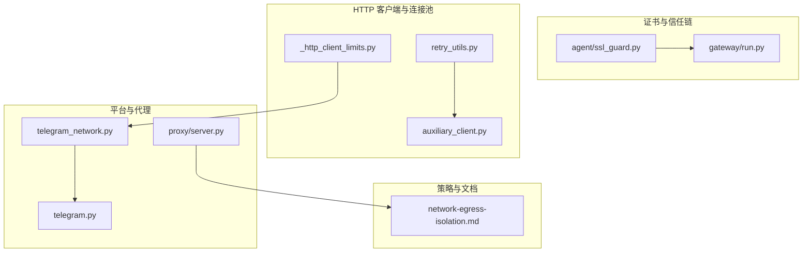
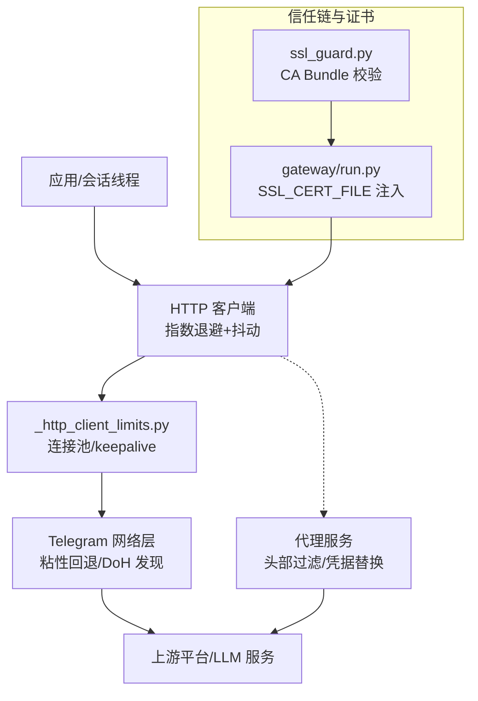
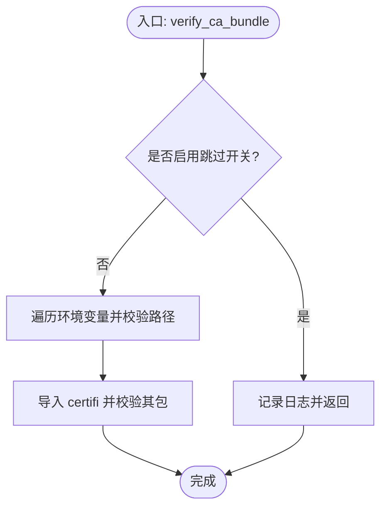
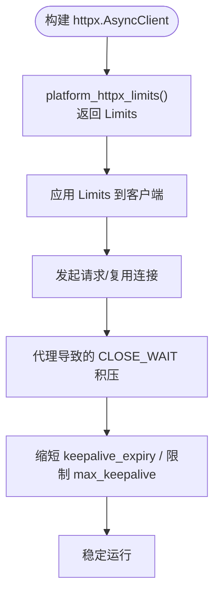
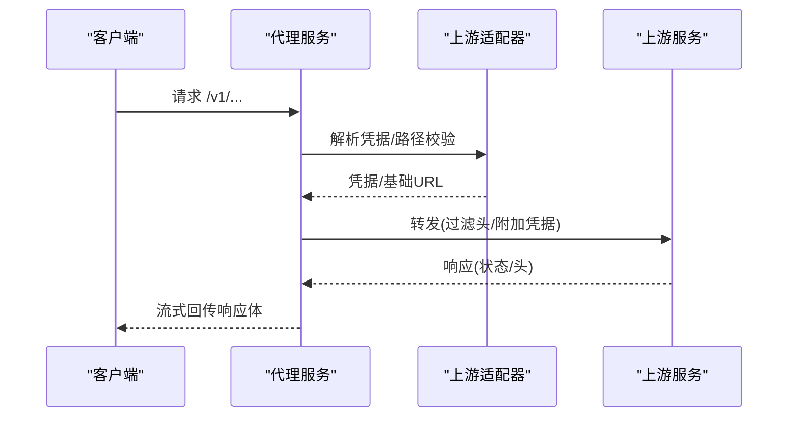
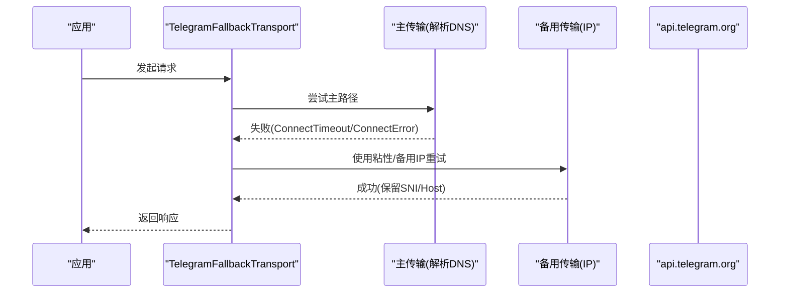
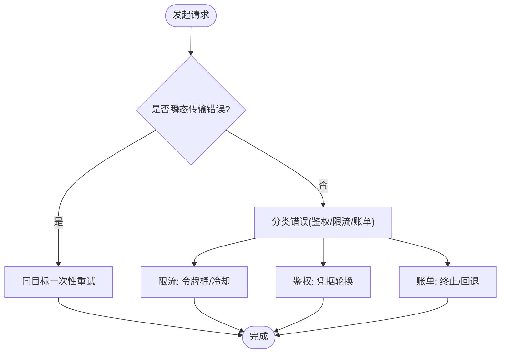
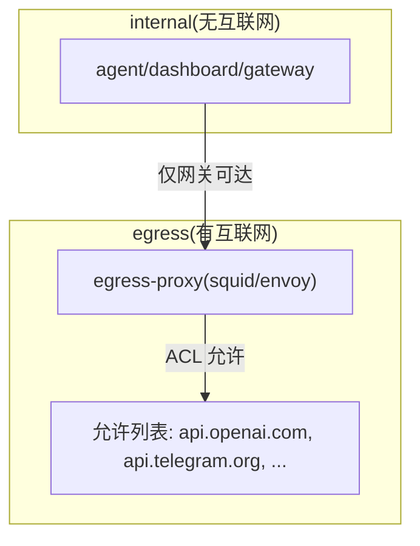
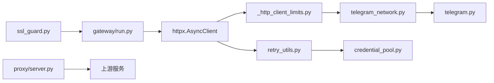

# 网络安全

<cite>
**本文引用的文件**
- [agent/ssl_guard.py](file://agent/ssl_guard.py)
- [gateway/run.py](file://gateway/run.py)
- [gateway/platforms/_http_client_limits.py](file://gateway/platforms/_http_client_limits.py)
- [gateway/platforms/telegram_network.py](file://gateway/platforms/telegram_network.py)
- [gateway/platforms/telegram.py](file://gateway/platforms/telegram.py)
- [hermes_cli/proxy/server.py](file://hermes_cli/proxy/server.py)
- [agent/retry_utils.py](file://agent/retry_utils.py)
- [agent/async_utils.py](file://agent/async_utils.py)
- [agent/auxiliary_client.py](file://agent/auxiliary_client.py)
- [agent/credential_pool.py](file://agent/credential_pool.py)
- [agent/error_classifier.py](file://agent/error_classifier.py)
- [docs/security/network-egress-isolation.md](file://docs/security/network-egress-isolation.md)
- [tests/gateway/test_ssl_certs.py](file://tests/gateway/test_ssl_certs.py)
- [tests/agent/test_ssl_ca_guard.py](file://tests/agent/test_ssl_ca_guard.py)
- [tests/gateway/test_platform_http_client_limits.py](file://tests/gateway/test_platform_http_client_limits.py)
- [tests/gateway/test_telegram_network.py](file://tests/gateway/test_telegram_network.py)
- [tests/test_retry_utils.py](file://tests/test_retry_utils.py)
- [tests/gateway/test_signal_rate_limit.py](file://tests/gateway/test_signal_rate_limit.py)
</cite>

## 目录
1. [简介](#简介)
2. [项目结构](#项目结构)
3. [核心组件](#核心组件)
4. [架构总览](#架构总览)
5. [详细组件分析](#详细组件分析)
6. [依赖分析](#依赖分析)
7. [性能考量](#性能考量)
8. [故障排查指南](#故障排查指南)
9. [结论](#结论)
10. [附录](#附录)

## 简介
本技术文档聚焦于本仓库中的网络安全防护能力，围绕以下主题展开：
- SSL/TLS 证书验证机制：证书链验证、主机名匹配、吊销检查等
- HTTP 客户端安全限制：连接超时、请求限制、重试策略
- 代理服务器安全实现：反向代理配置、请求转发安全、头部过滤
- 网络流量监控与异常检测：连接跟踪、异常检测、DDoS 防护思路
- 平台特定的网络安全实现：Telegram 网络层安全机制、速率限制、连接池管理
- 网络安全配置指南：防火墙规则、网络隔离、安全扫描

## 项目结构
本仓库的网络安全相关实现主要分布在如下模块：
- 证书与信任链：agent/ssl_guard.py、gateway/run.py
- HTTP 客户端与连接池：gateway/platforms/_http_client_limits.py、agent/retry_utils.py、agent/auxiliary_client.py
- 平台适配与网络层：gateway/platforms/telegram_network.py、gateway/platforms/telegram.py
- 代理服务：hermes_cli/proxy/server.py
- 网络隔离与策略：docs/security/network-egress-isolation.md
- 测试与回归：tests/* 下多处测试文件

**图表来源**
- [agent/ssl_guard.py:1-95](file://agent/ssl_guard.py#L1-L95)
- [gateway/run.py:1073-1108](file://gateway/run.py#L1073-L1108)
- [gateway/platforms/_http_client_limits.py:1-85](file://gateway/platforms/_http_client_limits.py#L1-L85)
- [agent/retry_utils.py:1-58](file://agent/retry_utils.py#L1-L58)
- [agent/auxiliary_client.py:2458-2488](file://agent/auxiliary_client.py#L2458-L2488)
- [gateway/platforms/telegram_network.py:1-260](file://gateway/platforms/telegram_network.py#L1-L260)
- [gateway/platforms/telegram.py:1-200](file://gateway/platforms/telegram.py#L1-L200)
- [hermes_cli/proxy/server.py:1-297](file://hermes_cli/proxy/server.py#L1-L297)
- [docs/security/network-egress-isolation.md:1-196](file://docs/security/network-egress-isolation.md#L1-L196)

**章节来源**
- [agent/ssl_guard.py:1-95](file://agent/ssl_guard.py#L1-L95)
- [gateway/run.py:1073-1108](file://gateway/run.py#L1073-L1108)
- [gateway/platforms/_http_client_limits.py:1-85](file://gateway/platforms/_http_client_limits.py#L1-L85)
- [gateway/platforms/telegram_network.py:1-260](file://gateway/platforms/telegram_network.py#L1-L260)
- [hermes_cli/proxy/server.py:1-297](file://hermes_cli/proxy/server.py#L1-L297)
- [docs/security/network-egress-isolation.md:1-196](file://docs/security/network-egress-isolation.md#L1-L196)

## 核心组件
- SSL/TLS 证书验证与信任链保护：在启动阶段校验环境变量指定的 CA Bundle、certifi 默认包，避免“找不到文件”类错误；支持跳过开关用于受管信任存储场景
- HTTP 客户端安全限制：为长连接适配器设置较短 keepalive 过期时间与合理的最大空闲连接数，减少代理环境下 CLOSE_WAIT 积压；统一的指数退避+抖动重试策略
- 平台特定网络层：Telegram 网络层在主 DNS 不可达时通过备用 IP 重写请求，同时保留 TLS SNI 与 Host 头，实现“粘性回退”
- 代理服务：最小化反向代理，严格过滤 Hop-by-Hop 与认证头，支持上游凭据轮换与超时控制
- 网络隔离：Docker 多网络隔离与出口代理 ACL，阻断任意出站访问，仅允许白名单主机
- 流量监控与异常检测：进程级事件抑制与全局断路器，防止告警风暴；结合速率限制与令牌桶实现

**章节来源**
- [agent/ssl_guard.py:61-94](file://agent/ssl_guard.py#L61-L94)
- [gateway/platforms/_http_client_limits.py:43-84](file://gateway/platforms/_http_client_limits.py#L43-L84)
- [gateway/platforms/telegram_network.py:52-130](file://gateway/platforms/telegram_network.py#L52-L130)
- [hermes_cli/proxy/server.py:32-81](file://hermes_cli/proxy/server.py#L32-L81)
- [docs/security/network-egress-isolation.md:23-61](file://docs/security/network-egress-isolation.md#L23-L61)

## 架构总览
下图展示从应用到平台适配器、再到上游服务的整体网络路径与安全控制点。

**图表来源**
- [agent/retry_utils.py:19-57](file://agent/retry_utils.py#L19-L57)
- [gateway/platforms/_http_client_limits.py:43-84](file://gateway/platforms/_http_client_limits.py#L43-L84)
- [gateway/platforms/telegram_network.py:52-130](file://gateway/platforms/telegram_network.py#L52-L130)
- [hermes_cli/proxy/server.py:107-196](file://hermes_cli/proxy/server.py#L107-L196)
- [agent/ssl_guard.py:61-94](file://agent/ssl_guard.py#L61-L94)
- [gateway/run.py:1073-1108](file://gateway/run.py#L1073-L1108)

## 详细组件分析

### 组件一：SSL/TLS 证书验证与信任链保护
- 目标：在初始化阶段尽早发现并报告 CA Bundle 配置问题，避免后续调用 OpenAI/httpx 时出现模糊的“文件不存在”错误
- 关键点：
  - 支持的环境变量：HERMES_CA_BUNDLE、SSL_CERT_FILE、REQUESTS_CA_BUNDLE、CURL_CA_BUNDLE
  - 对显式路径进行存在性、文件类型、大小（大于阈值）与可加载性校验
  - 对 certifi 默认包进行完整性校验（要求足够体积）
  - 提供跳过开关 HERMES_SKIP_SSL_GUARD 作为受管信任存储的应急通道
- 影响范围：所有依赖默认系统或 certifi 信任根的网络调用

**图表来源**
- [agent/ssl_guard.py:61-94](file://agent/ssl_guard.py#L61-L94)

**章节来源**
- [agent/ssl_guard.py:18-94](file://agent/ssl_guard.py#L18-L94)
- [gateway/run.py:1073-1108](file://gateway/run.py#L1073-L1108)
- [tests/agent/test_ssl_ca_guard.py:36-82](file://tests/agent/test_ssl_ca_guard.py#L36-L82)
- [tests/gateway/test_ssl_certs.py:72-80](file://tests/gateway/test_ssl_certs.py#L72-L80)

### 组件二：HTTP 客户端安全限制与连接池
- 目标：降低长连接在代理环境下的资源压力，缩短 CLOSE_WAIT 窗口，提升稳定性
- 关键点：
  - 默认 keepalive_expiry 缩短至 2.0 秒，max_keepalive_connections 限制在 10 左右
  - 支持通过环境变量覆盖上述参数，便于压测与调优
  - 指数退避+抖动的重试策略，避免“惊群效应”
- 影响范围：所有平台适配器使用的 httpx AsyncClient 生命周期

**图表来源**
- [gateway/platforms/_http_client_limits.py:43-84](file://gateway/platforms/_http_client_limits.py#L43-L84)
- [tests/gateway/test_platform_http_client_limits.py:34-63](file://tests/gateway/test_platform_http_client_limits.py#L34-L63)

**章节来源**
- [gateway/platforms/_http_client_limits.py:1-85](file://gateway/platforms/_http_client_limits.py#L1-L85)
- [tests/gateway/test_platform_http_client_limits.py:34-63](file://tests/gateway/test_platform_http_client_limits.py#L34-L63)

### 组件三：代理服务器的安全实现（最小化反向代理）
- 目标：仅做凭据附加与转发，不篡改、不记录、不重写正文
- 关键点：
  - 过滤 Hop-by-Hop 头部与 Authorization，上游凭据由适配器动态注入
  - 严格限制允许转发的路径集合，拒绝未授权路径
  - 上游连接超时与错误映射（502/504），支持凭据轮换
  - 响应流式回传，保持 SSE 兼容
- 影响范围：本地监听、凭据解析、上游通信

**图表来源**
- [hermes_cli/proxy/server.py:107-233](file://hermes_cli/proxy/server.py#L107-L233)

**章节来源**
- [hermes_cli/proxy/server.py:32-81](file://hermes_cli/proxy/server.py#L32-L81)
- [hermes_cli/proxy/server.py:107-233](file://hermes_cli/proxy/server.py#L107-L233)

### 组件四：平台特定网络层（Telegram 网络安全）
- 目标：在 api.telegram.org DNS 不可达时，通过备用 IP 重试，同时保留 TLS SNI 与 Host 头
- 关键点：
  - 主机名不变、TLS SNI 不变、Host 头指向 api.telegram.org
  - 仅对 IPv4 进行规范化与过滤（排除私有/环回/链路本地）
  - 支持 DoH 自动发现备用 IP，失败时回落到硬编码种子列表
  - 仅在连接超时/连接错误时触发回退，避免非连接类错误被误重试
  - 支持“粘性回退”：一旦某备用 IP 成功，后续优先尝试该 IP
- 影响范围：Telegram 平台适配器的 HTTPX 请求传输层

**图表来源**
- [gateway/platforms/telegram_network.py:73-124](file://gateway/platforms/telegram_network.py#L73-L124)
- [gateway/platforms/telegram_network.py:242-255](file://gateway/platforms/telegram_network.py#L242-L255)

**章节来源**
- [gateway/platforms/telegram_network.py:52-130](file://gateway/platforms/telegram_network.py#L52-L130)
- [gateway/platforms/telegram_network.py:195-239](file://gateway/platforms/telegram_network.py#L195-L239)
- [gateway/platforms/telegram_network.py:258-260](file://gateway/platforms/telegram_network.py#L258-L260)
- [tests/gateway/test_telegram_network.py:123-195](file://tests/gateway/test_telegram_network.py#L123-L195)

### 组件五：HTTP 客户端重试策略与异常处理
- 目标：在瞬态网络错误与 5xx/408 场景下进行一次性的同目标重试，避免对账单/鉴权/限流等错误进行盲目重试
- 关键点：
  - 识别瞬态传输错误（连接/超时/DNS/SSL 等），在同提供商内一次性重试
  - 区分支付/鉴权/限流等错误，采用凭据轮换、降级或终止策略
  - 指数退避+抖动，避免并发重试造成“惊群”
- 影响范围：辅助客户端与主流程的网络调用

**图表来源**
- [agent/auxiliary_client.py:2458-2488](file://agent/auxiliary_client.py#L2458-L2488)
- [agent/retry_utils.py:19-57](file://agent/retry_utils.py#L19-L57)
- [agent/credential_pool.py:1382-1385](file://agent/credential_pool.py#L1382-L1385)

**章节来源**
- [agent/auxiliary_client.py:2458-2488](file://agent/auxiliary_client.py#L2458-L2488)
- [agent/retry_utils.py:1-58](file://agent/retry_utils.py#L1-L58)
- [agent/credential_pool.py:1382-1385](file://agent/credential_pool.py#L1382-L1385)
- [agent/error_classifier.py:713-738](file://agent/error_classifier.py#L713-L738)
- [tests/test_retry_utils.py:30-65](file://tests/test_retry_utils.py#L30-L65)

### 组件六：网络隔离与出口代理（Docker）
- 目标：在容器内限制出站访问，仅允许白名单主机，阻断任意外联
- 关键点：
  - 内网网络（internal）：无默认路由，仅内部服务可达
  - 出口网络（egress）：仅允许经代理访问白名单主机
  - 代理 ACL 示例：仅允许 HTTPS CONNECT 至指定域名
  - 验证方法：在容器内尝试访问外部站点应失败，访问内部服务应成功
- 影响范围：容器编排与网络策略

**图表来源**
- [docs/security/network-egress-isolation.md:23-61](file://docs/security/network-egress-isolation.md#L23-L61)
- [docs/security/network-egress-isolation.md:103-152](file://docs/security/network-egress-isolation.md#L103-L152)

**章节来源**
- [docs/security/network-egress-isolation.md:1-196](file://docs/security/network-egress-isolation.md#L1-L196)

## 依赖分析
- 组件耦合与内聚
  - ssl_guard 与 gateway/run 的协作：前者负责证书校验，后者负责注入 SSL_CERT_FILE，确保后续 httpx/certifi 使用一致的信任根
  - telegram_network 与 telegram 适配器：前者提供传输层回退逻辑，后者在业务侧集成
  - proxy/server 与上游适配器：通过适配器抽象凭据与基础 URL，代理仅做转发
  - retry_utils 与 credential_pool：前者提供退避抖动，后者提供凭据轮换与冷却
- 外部依赖
  - httpx、aiohttp、python-telegram-bot 等第三方库
  - certifi、系统 CA 信任根

**图表来源**
- [agent/ssl_guard.py:61-94](file://agent/ssl_guard.py#L61-L94)
- [gateway/run.py:1073-1108](file://gateway/run.py#L1073-L1108)
- [gateway/platforms/_http_client_limits.py:43-84](file://gateway/platforms/_http_client_limits.py#L43-L84)
- [gateway/platforms/telegram_network.py:52-130](file://gateway/platforms/telegram_network.py#L52-L130)
- [gateway/platforms/telegram.py:85-89](file://gateway/platforms/telegram.py#L85-L89)
- [agent/retry_utils.py:19-57](file://agent/retry_utils.py#L19-L57)
- [agent/credential_pool.py:1382-1385](file://agent/credential_pool.py#L1382-L1385)
- [hermes_cli/proxy/server.py:107-196](file://hermes_cli/proxy/server.py#L107-L196)

**章节来源**
- [gateway/platforms/telegram.py:85-89](file://gateway/platforms/telegram.py#L85-L89)

## 性能考量
- 连接池与 keepalive
  - 较短的 keepalive_expiry 与较低的 max_keepalive 有助于在代理环境中快速释放资源，缓解 CLOSE_WAIT 积压
  - 环境变量可调，适合在高负载场景进行压测与微调
- 重试抖动
  - 指数退避+抖动有效降低并发重试的集中性，避免放大网络拥塞
- 代理转发
  - 最小化代理仅做凭据替换与头部过滤，避免额外 CPU 开销与延迟

**章节来源**
- [gateway/platforms/_http_client_limits.py:17-26](file://gateway/platforms/_http_client_limits.py#L17-L26)
- [agent/retry_utils.py:19-57](file://agent/retry_utils.py#L19-L57)
- [hermes_cli/proxy/server.py:133-165](file://hermes_cli/proxy/server.py#L133-L165)

## 故障排查指南
- 证书与信任链
  - 症状：启动时报“找不到 CA Bundle 文件”或“无法加载 CA Bundle”
  - 排查：确认环境变量 HERMES_CA_BUNDLE/SSL_CERT_FILE/REQUESTS_CA_BUNDLE/CURL_CA_BUNDLE 是否正确；若为企业自定义 CA，请修复或卸载；必要时使用跳过开关进行临时诊断
  - 参考测试：显式路径缺失、无效内容、空文件等场景的报错行为
- Telegram 回退
  - 症状：api.telegram.org DNS 不可达导致连接失败
  - 排查：检查 DoH 发现结果、备用 IP 列表、粘性回退状态；确认仅在连接类错误触发回退
- 代理转发
  - 症状：502/504、上游不可达、凭据错误
  - 排查：检查路径白名单、凭据轮换、超时配置；观察上游响应状态码与 Retry-After
- 重试与限流
  - 症状：频繁重试、突发流量、告警风暴
  - 排查：确认瞬态错误识别、退避抖动参数、凭据池轮换策略；必要时调整环境变量覆盖值

**章节来源**
- [tests/agent/test_ssl_ca_guard.py:44-82](file://tests/agent/test_ssl_ca_guard.py#L44-L82)
- [tests/gateway/test_telegram_network.py:172-195](file://tests/gateway/test_telegram_network.py#L172-L195)
- [hermes_cli/proxy/server.py:172-214](file://hermes_cli/proxy/server.py#L172-L214)
- [agent/auxiliary_client.py:2458-2488](file://agent/auxiliary_client.py#L2458-L2488)

## 结论
本仓库在网络安全方面形成了从“信任链校验—连接池与重试—平台特定网络层—代理转发—网络隔离”的完整闭环：
- 在启动阶段即拦截证书配置问题，避免后续调用暴露
- 在连接与重试层面采用稳健策略，兼顾可用性与抗拥塞
- 在平台与代理层面实施最小化原则与严格的头部过滤
- 通过容器网络隔离与出口代理 ACL，阻断任意出站访问
这些实践共同提升了系统的整体安全性与鲁棒性。

## 附录
- 配置建议
  - 证书：优先使用系统或 certifi 默认信任根；企业自定义 CA 请确保路径有效且体积充足
  - 连接池：根据平台 API 并发度设置 keepalive_expiry 与 max_keepalive；在代理环境下适当下调
  - 重试：启用指数退避+抖动；对瞬态错误进行一次性重试，对账单/鉴权/限流采取轮换或终止
  - 代理：严格过滤 Hop-by-Hop 与认证头；限制允许转发的路径；启用上游凭据轮换
  - 隔离：容器内网仅允许网关访问出口网络；出口代理仅允许白名单主机；定期验证隔离有效性
- 参考测试
  - 证书校验与回退包装器的兼容性
  - HTTP 客户端限制的默认值与环境变量覆盖
  - Telegram 网络层的回退与粘性策略
  - 重试抖动的边界条件与并发安全

**章节来源**
- [tests/agent/test_ssl_ca_guard.py:67-82](file://tests/agent/test_ssl_ca_guard.py#L67-L82)
- [tests/gateway/test_platform_http_client_limits.py:48-63](file://tests/gateway/test_platform_http_client_limits.py#L48-L63)
- [tests/gateway/test_telegram_network.py:1-195](file://tests/gateway/test_telegram_network.py#L1-L195)
- [tests/test_retry_utils.py:30-65](file://tests/test_retry_utils.py#L30-L65)