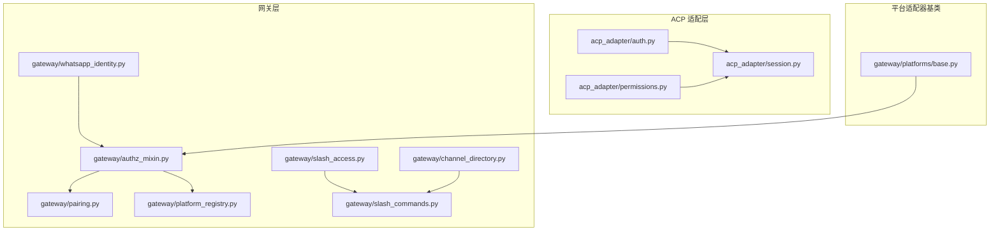
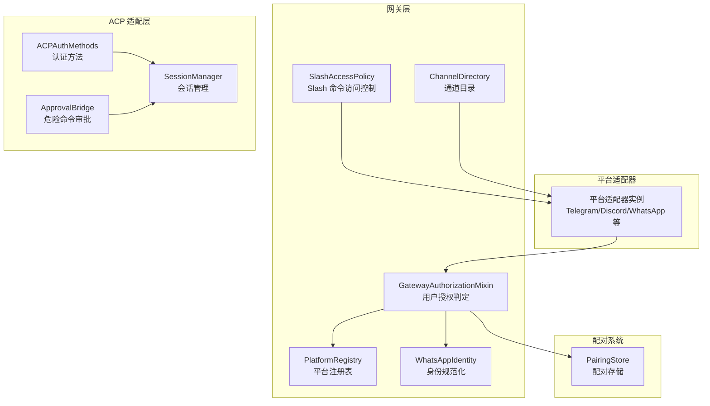
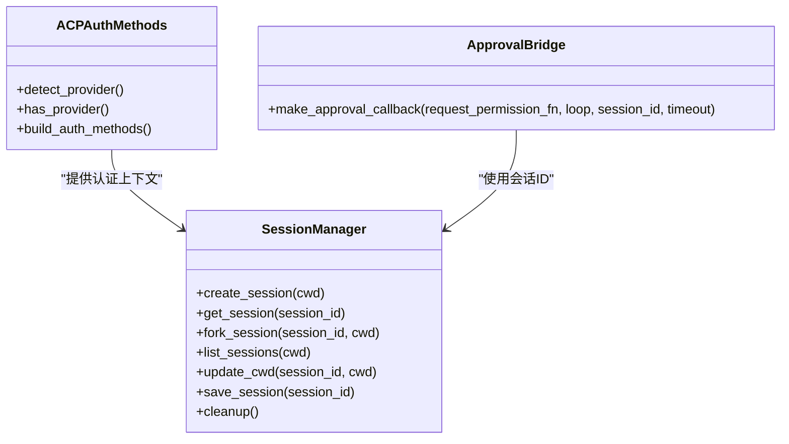
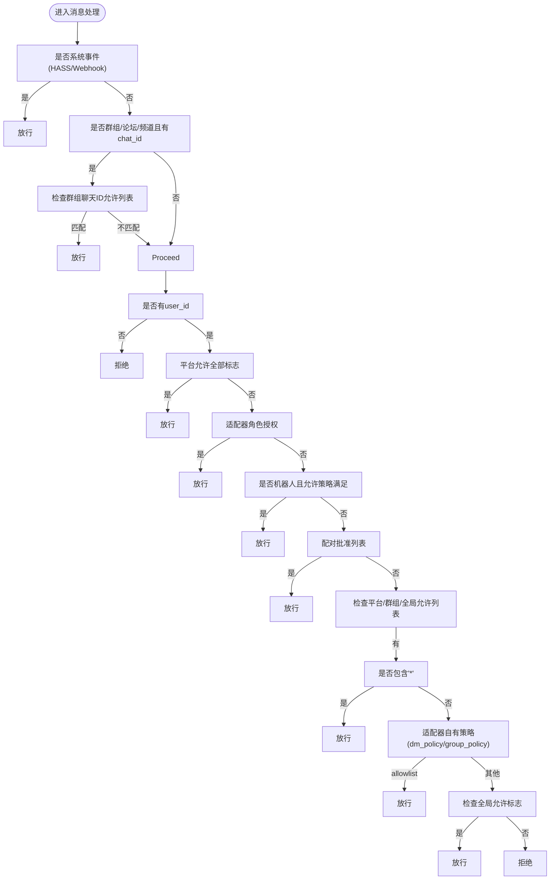
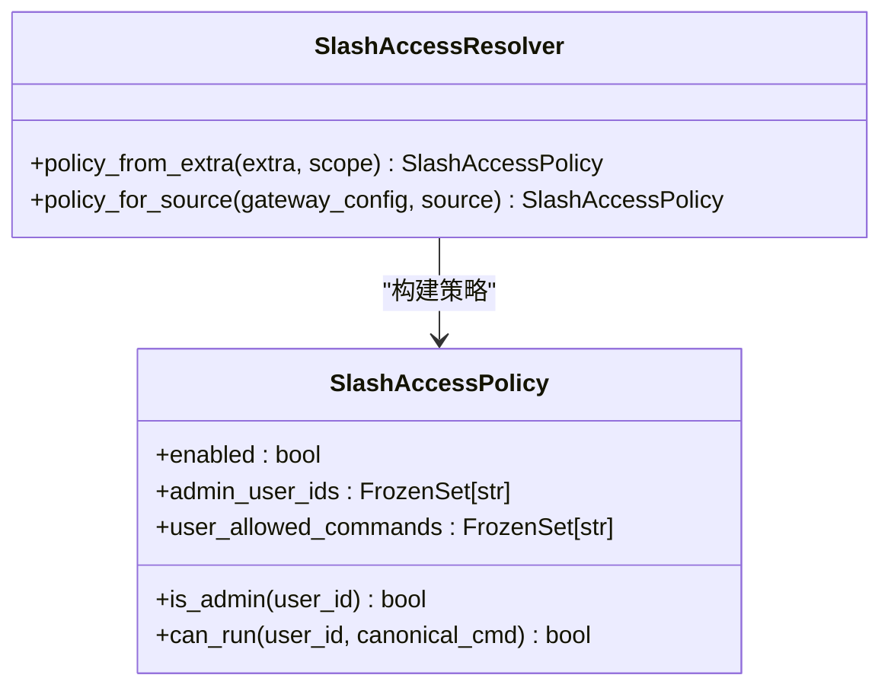
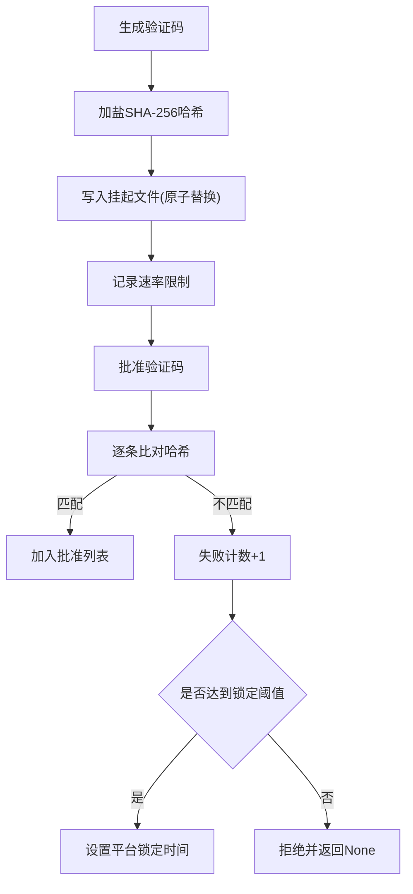
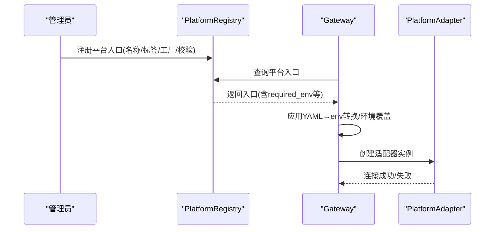
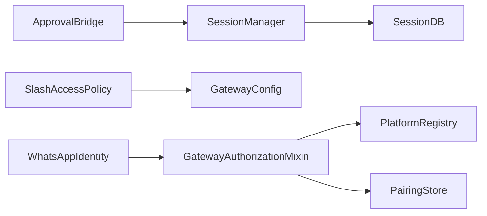

# 访问控制

<cite>
**本文引用的文件**
- [acp_adapter/auth.py](file://acp_adapter/auth.py)
- [acp_adapter/session.py](file://acp_adapter/session.py)
- [acp_adapter/permissions.py](file://acp_adapter/permissions.py)
- [gateway/pairing.py](file://gateway/pairing.py)
- [gateway/slash_access.py](file://gateway/slash_access.py)
- [gateway/authz_mixin.py](file://gateway/authz_mixin.py)
- [gateway/channel_directory.py](file://gateway/channel_directory.py)
- [gateway/platform_registry.py](file://gateway/platform_registry.py)
- [gateway/slash_commands.py](file://gateway/slash_commands.py)
- [gateway/platforms/base.py](file://gateway/platforms/base.py)
- [gateway/whatsapp_identity.py](file://gateway/whatsapp_identity.py)
</cite>

## 目录
1. [引言](#引言)
2. [项目结构](#项目结构)
3. [核心组件](#核心组件)
4. [架构总览](#架构总览)
5. [详细组件分析](#详细组件分析)
6. [依赖分析](#依赖分析)
7. [性能考虑](#性能考虑)
8. [故障排查指南](#故障排查指南)
9. [结论](#结论)
10. [附录](#附录)

## 引言
本技术文档系统性梳理访问控制系统的设计与实现，覆盖以下主题：
- 基于角色的访问控制（RBAC）与用户身份认证：通过平台适配器、环境变量与平台自有策略共同完成。
- 会话管理与持久化：统一的会话生命周期与状态存储。
- 平台特定的访问控制：Telegram、Discord、WhatsApp 等平台的白名单、分组策略、机器人放行与配对流程。
- 网关层访问控制策略：频道白名单、用户授权、平台绑定与未授权 DM 处理。
- Slash 命令访问控制：管理员与普通用户的命令权限划分与继承规则。
- 配对系统安全实现：一次性验证码、哈希存储、速率限制与锁定保护。
- 最佳实践与安全建议：权限分配原则、审计与日志记录。

## 项目结构
访问控制相关代码主要分布在以下模块：
- ACP 适配层：认证方法声明、会话管理、危险命令审批桥接。
- 网关层：用户授权混合器、Slash 命令访问控制、通道目录、平台注册表、WhatsApp 身份解析。
- 平台适配器基类：通用能力与安全工具（URL 安全、代理、SSRF 防护等）。

**图表来源**
- [acp_adapter/auth.py](file://acp_adapter/auth.py)
- [acp_adapter/session.py](file://acp_adapter/session.py)
- [acp_adapter/permissions.py](file://acp_adapter/permissions.py)
- [gateway/authz_mixin.py](file://gateway/authz_mixin.py)
- [gateway/slash_access.py](file://gateway/slash_access.py)
- [gateway/pairing.py](file://gateway/pairing.py)
- [gateway/channel_directory.py](file://gateway/channel_directory.py)
- [gateway/platform_registry.py](file://gateway/platform_registry.py)
- [gateway/slash_commands.py](file://gateway/slash_commands.py)
- [gateway/whatsapp_identity.py](file://gateway/whatsapp_identity.py)
- [gateway/platforms/base.py](file://gateway/platforms/base.py)

**章节来源**
- [acp_adapter/auth.py](file://acp_adapter/auth.py)
- [acp_adapter/session.py](file://acp_adapter/session.py)
- [acp_adapter/permissions.py](file://acp_adapter/permissions.py)
- [gateway/authz_mixin.py](file://gateway/authz_mixin.py)
- [gateway/slash_access.py](file://gateway/slash_access.py)
- [gateway/pairing.py](file://gateway/pairing.py)
- [gateway/channel_directory.py](file://gateway/channel_directory.py)
- [gateway/platform_registry.py](file://gateway/platform_registry.py)
- [gateway/slash_commands.py](file://gateway/slash_commands.py)
- [gateway/whatsapp_identity.py](file://gateway/whatsapp_identity.py)
- [gateway/platforms/base.py](file://gateway/platforms/base.py)

## 核心组件
- ACP 认证与会话
  - 认证方法发现与声明：根据运行时提供者动态生成可用认证方式。
  - 会话管理：创建、恢复、fork、清理与持久化，支持跨进程重启恢复。
  - 危险命令审批桥接：将 ACP 权限请求映射为 Hermes 审批结果。
- 网关用户授权
  - 统一授权判定：平台允许标志、环境变量白名单、配对批准列表、全局允许标志、适配器自有策略。
  - 未授权 DM 行为：按平台与策略默认“配对”或“忽略”，避免信息泄露。
- Slash 命令访问控制
  - 管理员与普通用户命令集分离；保留最小只读命令集合；支持按 DM/群组域分别配置。
- 配对系统
  - 一次性验证码、哈希存储、过期清理、速率限制与锁定保护。
- 通道目录与平台注册
  - 通道目录缓存与友好名覆盖；平台注册表支持插件自注册与环境变量驱动配置。

**章节来源**
- [acp_adapter/auth.py](file://acp_adapter/auth.py)
- [acp_adapter/session.py](file://acp_adapter/session.py)
- [acp_adapter/permissions.py](file://acp_adapter/permissions.py)
- [gateway/authz_mixin.py](file://gateway/authz_mixin.py)
- [gateway/slash_access.py](file://gateway/slash_access.py)
- [gateway/pairing.py](file://gateway/pairing.py)
- [gateway/channel_directory.py](file://gateway/channel_directory.py)
- [gateway/platform_registry.py](file://gateway/platform_registry.py)

## 架构总览
下图展示访问控制在系统中的交互关系：平台适配器负责接入与策略执行，网关层进行统一授权与命令访问控制，ACP 层负责会话与危险命令审批，配对系统保障 DM 授权闭环。

**图表来源**
- [gateway/authz_mixin.py](file://gateway/authz_mixin.py)
- [gateway/slash_access.py](file://gateway/slash_access.py)
- [gateway/channel_directory.py](file://gateway/channel_directory.py)
- [gateway/platform_registry.py](file://gateway/platform_registry.py)
- [gateway/whatsapp_identity.py](file://gateway/whatsapp_identity.py)
- [acp_adapter/auth.py](file://acp_adapter/auth.py)
- [acp_adapter/session.py](file://acp_adapter/session.py)
- [acp_adapter/permissions.py](file://acp_adapter/permissions.py)
- [gateway/pairing.py](file://gateway/pairing.py)

## 详细组件分析

### ACP 认证与会话
- 认证方法发现与声明
  - 动态检测运行时提供者（含 Azure Entra ID 提供者），生成兼容的认证方法列表，确保 ACP 握手阶段可识别。
- 会话管理
  - 支持工作目录翻译（WSL/Windows）、任务工作目录绑定、工具集扩展、会话持久化与恢复。
  - 会话元数据包含 provider/base_url/api_mode/cwd 等，用于跨进程一致性。
- 危险命令审批桥接
  - 将 ACP 的选项映射到 Hermes 审批语义（一次/会话/永久/拒绝），超时自动拒绝，线程安全调度。

**图表来源**
- [acp_adapter/auth.py](file://acp_adapter/auth.py)
- [acp_adapter/session.py](file://acp_adapter/session.py)
- [acp_adapter/permissions.py](file://acp_adapter/permissions.py)

**章节来源**
- [acp_adapter/auth.py](file://acp_adapter/auth.py)
- [acp_adapter/session.py](file://acp_adapter/session.py)
- [acp_adapter/permissions.py](file://acp_adapter/permissions.py)

### 网关用户授权（GatewayAuthorizationMixin）
- 授权判定顺序
  - 平台允许标志（如 TELEGRAM_ALLOW_ALL_USERS）、环境变量白名单、配对批准列表、全局允许标志。
  - 适配器自有策略（dm_policy/group_policy/allow_from/group_allow_from）仅在明确 allowlist 时才视为可信授权信号。
  - 特殊场景：Home Assistant/Webhook 事件直接放行；机器人放行由平台允许标志控制。
- 未授权 DM 行为
  - 默认“配对”；当存在任何允许列表或策略为 allowlist/disabled 时，默认“忽略”，避免信息泄露。

**图表来源**
- [gateway/authz_mixin.py](file://gateway/authz_mixin.py)

**章节来源**
- [gateway/authz_mixin.py](file://gateway/authz_mixin.py)

### Slash 命令访问控制
- 策略模型
  - 每个平台/域（DM/group）独立策略：管理员用户集与普通用户可执行命令集。
  - 后向兼容：未配置管理员列表则关闭门控，所有用户均可执行所有命令。
  - 最小只读集合：help/whoami 对所有用户始终开放。
- 策略应用
  - 在命令分发处统一校验，覆盖内置与插件注册命令。
  - 支持 DM 与群组域分别配置，DM 未显式配置时可回退到群组命令集。

**图表来源**
- [gateway/slash_access.py](file://gateway/slash_access.py)

**章节来源**
- [gateway/slash_access.py](file://gateway/slash_access.py)
- [gateway/slash_commands.py](file://gateway/slash_commands.py)

### 配对系统（PairingStore）
- 安全设计
  - 一次性验证码：8 字符，来自 32 字母无歧义集；SHA-256 加盐哈希存储；过期时间 1 小时。
  - 速率限制：每用户 10 分钟内最多一次请求；最大挂起请求数每平台 3。
  - 锁定保护：失败尝试超过阈值后平台级锁定 1 小时。
  - 文件权限：所有数据文件以 0600 写入，防止被其他用户读取。
- 数据结构
  - {platform}-pending.json：挂起请求（哈希+盐+创建时间）。
  - {platform}-approved.json：已批准用户列表（去重与别名合并）。
  - _rate_limits.json：速率限制与失败计数、锁定时间。
- 用户 ID 规范化与别名
  - WhatsApp：电话号与 LID 形态互转与别名集合；统一规范化后再比较。

**图表来源**
- [gateway/pairing.py](file://gateway/pairing.py)
- [gateway/whatsapp_identity.py](file://gateway/whatsapp_identity.py)

**章节来源**
- [gateway/pairing.py](file://gateway/pairing.py)
- [gateway/whatsapp_identity.py](file://gateway/whatsapp_identity.py)

### 通道目录与平台注册
- 通道目录
  - 启动时构建，周期刷新，保存至本地 JSON；支持用户友好名覆盖与按名称解析。
  - 支持 Discord/Slack 等平台枚举与会话历史发现。
- 平台注册表
  - 插件可注册平台适配器，定义所需环境变量、安装提示、配置校验、连接状态等。
  - 网关侧通过注册表查找适配器工厂并创建实例，支持插件覆盖内置适配器。

**图表来源**
- [gateway/platform_registry.py](file://gateway/platform_registry.py)
- [gateway/channel_directory.py](file://gateway/channel_directory.py)

**章节来源**
- [gateway/platform_registry.py](file://gateway/platform_registry.py)
- [gateway/channel_directory.py](file://gateway/channel_directory.py)

### 平台适配器基类与安全工具
- 通用能力
  - 线程/回复锚点/媒体类型路由、UTF-16 长度计算、消息截断、代理解析与绕过、SSRF 重定向防护。
- 安全要点
  - URL 安全检查与 SSRF 防护链路，阻止私有/内部地址重定向。
  - 图像/音频/视频缓存目录隔离与过期清理，降低资源滥用风险。

**章节来源**
- [gateway/platforms/base.py](file://gateway/platforms/base.py)

## 依赖分析
- 组件耦合
  - 网关授权混合器依赖平台注册表与配对存储，以实现环境变量白名单、平台允许标志与配对批准的统一判定。
  - Slash 命令访问控制依赖网关配置与会话源，确保命令门控在分发前生效。
  - ACP 会话管理与危险命令审批桥接共享会话 ID，保证审批上下文一致。
- 外部依赖
  - hermes_state（会话数据库）、hermes_cli（运行时提供者、配置加载）、第三方平台 SDK（Discord/Slack 等）。
- 循环依赖规避
  - ACP 认证方法延迟导入，避免与网关主流程循环依赖。

**图表来源**
- [gateway/authz_mixin.py](file://gateway/authz_mixin.py)
- [gateway/slash_access.py](file://gateway/slash_access.py)
- [gateway/pairing.py](file://gateway/pairing.py)
- [acp_adapter/session.py](file://acp_adapter/session.py)
- [acp_adapter/permissions.py](file://acp_adapter/permissions.py)
- [gateway/whatsapp_identity.py](file://gateway/whatsapp_identity.py)

**章节来源**
- [gateway/authz_mixin.py](file://gateway/authz_mixin.py)
- [gateway/slash_access.py](file://gateway/slash_access.py)
- [gateway/pairing.py](file://gateway/pairing.py)
- [acp_adapter/session.py](file://acp_adapter/session.py)
- [acp_adapter/permissions.py](file://acp_adapter/permissions.py)
- [gateway/whatsapp_identity.py](file://gateway/whatsapp_identity.py)

## 性能考虑
- 会话持久化
  - 使用原子写入与增量更新，减少磁盘争用；会话列表按最后活跃时间排序，避免全量扫描。
- 通道目录
  - 缓存与定时刷新，避免频繁调用平台 API；名称解析采用前缀匹配与分组策略，提升命中率。
- 授权判定
  - 优先短路路径（允许全部/角色授权/配对批准），减少后续检查成本；环境变量白名单采用集合查找。
- ACP 审批
  - 异步调度与超时控制，避免阻塞主线程；线程锁粒度最小化。

## 故障排查指南
- 配对验证码无法使用
  - 检查平台是否处于锁定状态；确认验证码是否过期；核对挂起文件中是否存在对应哈希项。
- Slash 命令不可用
  - 确认管理员列表是否配置；检查用户是否在普通用户允许命令集中；验证命令是否在最小只读集合中。
- 未授权 DM 被静默忽略
  - 若已配置允许列表或策略为 allowlist/disabled，则默认忽略；需调整策略或改为“配对”模式。
- WhatsApp 身份不一致导致授权失败
  - 使用规范化与别名扩展函数，确保同一联系人的不同形态（电话/LID）被正确归一。

**章节来源**
- [gateway/pairing.py](file://gateway/pairing.py)
- [gateway/slash_access.py](file://gateway/slash_access.py)
- [gateway/authz_mixin.py](file://gateway/authz_mixin.py)
- [gateway/whatsapp_identity.py](file://gateway/whatsapp_identity.py)

## 结论
该访问控制系统通过“平台适配器 + 网关授权 + ACP 会话 + 配对系统”的多层协同，实现了细粒度的用户授权、命令门控与会话安全。平台特定策略与通用门控相结合，在保证易用性的同时强化了安全性与可观测性。建议在生产环境中启用严格的允许列表与配对策略，并结合审计日志与定期审查，持续优化权限分配与策略配置。

## 附录
- 最佳实践
  - 权限分配原则：最小权限、职责分离、定期复核；管理员列表与命令集应与业务需求一一对应。
  - 安全建议：启用配对模式、限制挂起数量、开启速率限制与锁定保护；严格控制文件权限与日志输出。
  - 审计与日志：记录授权决策、命令执行、配对操作与异常事件；定期导出与归档日志。
- 参考实现位置
  - 授权判定与未授权 DM 处理：[gateway/authz_mixin.py](file://gateway/authz_mixin.py)
  - Slash 命令门控：[gateway/slash_access.py](file://gateway/slash_access.py)
  - 配对系统：[gateway/pairing.py](file://gateway/pairing.py)
  - 会话与审批：[acp_adapter/session.py](file://acp_adapter/session.py)、[acp_adapter/permissions.py](file://acp_adapter/permissions.py)
  - 平台注册与通道目录：[gateway/platform_registry.py](file://gateway/platform_registry.py)、[gateway/channel_directory.py](file://gateway/channel_directory.py)
  - 身份规范化：[gateway/whatsapp_identity.py](file://gateway/whatsapp_identity.py)
  - 安全工具与防护：[gateway/platforms/base.py](file://gateway/platforms/base.py)