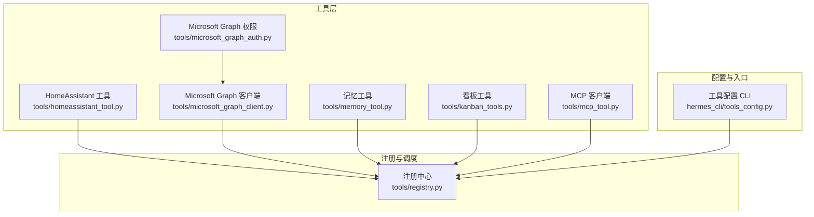
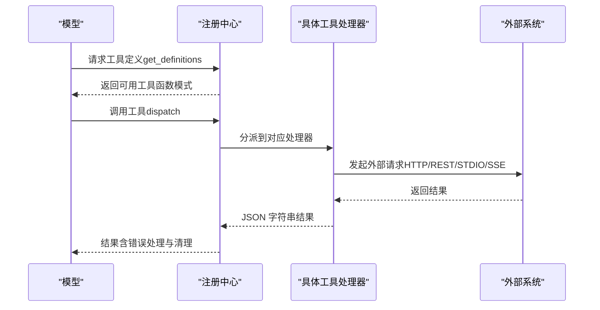
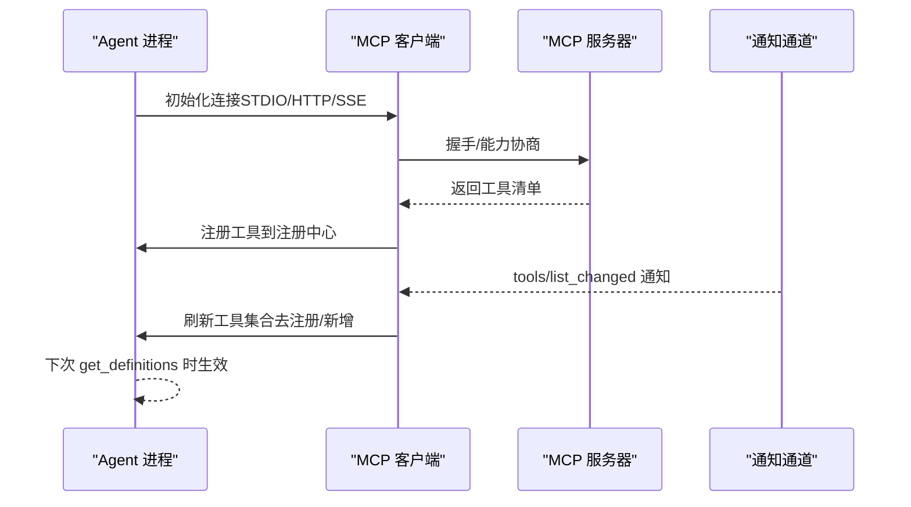
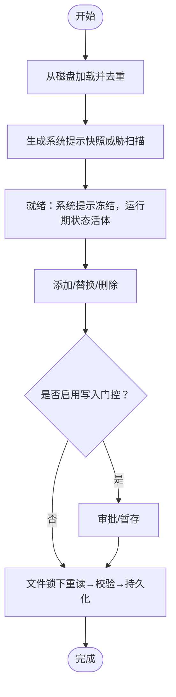
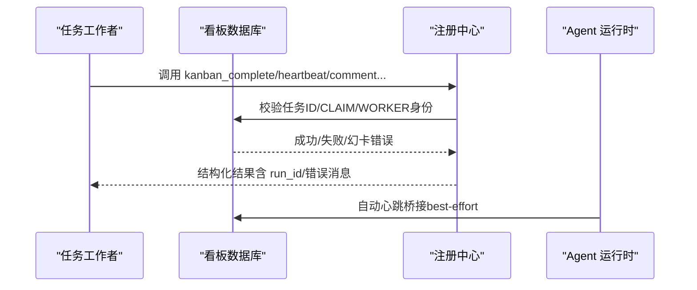
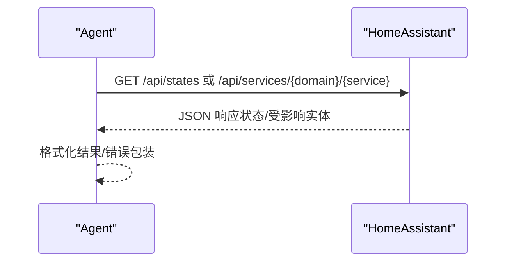
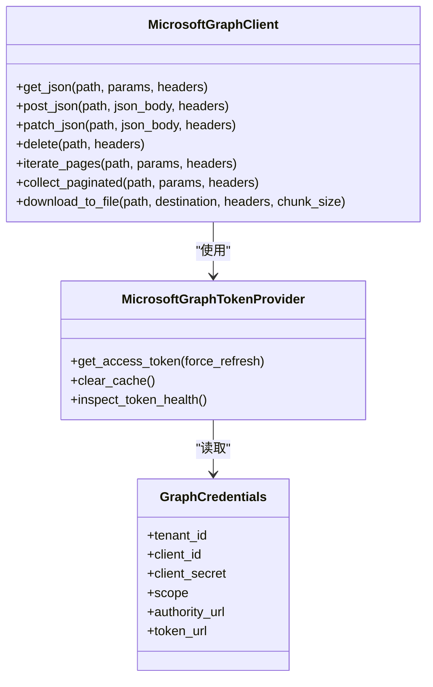
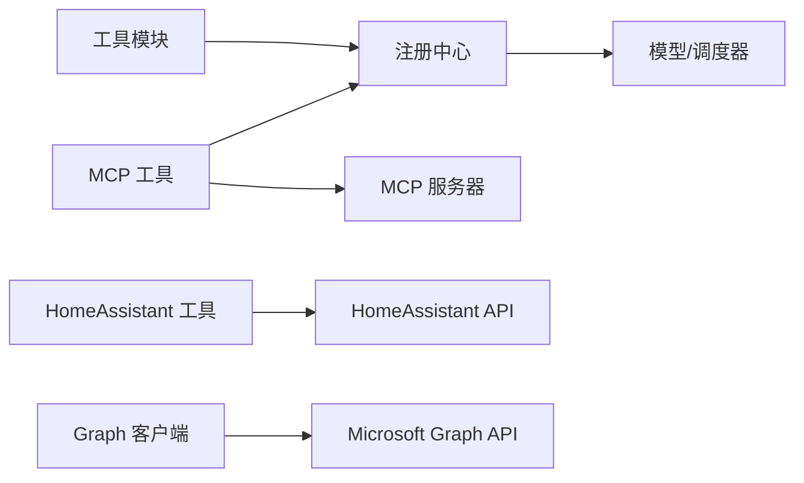

# 专用工具

<cite>
**本文引用的文件**
- [tools/homeassistant_tool.py](file://tools/homeassistant_tool.py)
- [tools/microsoft_graph_client.py](file://tools/microsoft_graph_client.py)
- [tools/microsoft_graph_auth.py](file://tools/microsoft_graph_auth.py)
- [tools/memory_tool.py](file://tools/memory_tool.py)
- [tools/kanban_tools.py](file://tools/kanban_tools.py)
- [tools/mcp_tool.py](file://tools/mcp_tool.py)
- [tools/registry.py](file://tools/registry.py)
- [hermes_cli/tools_config.py](file://hermes_cli/tools_config.py)
</cite>

## 目录
1. [简介](#简介)
2. [项目结构](#项目结构)
3. [核心组件](#核心组件)
4. [架构总览](#架构总览)
5. [详细组件分析](#详细组件分析)
6. [依赖分析](#依赖分析)
7. [性能考虑](#性能考虑)
8. [故障排查指南](#故障排查指南)
9. [结论](#结论)
10. [附录](#附录)

## 简介
本文件面向“专用工具”的综合技术文档，围绕以下主题展开：  
- 技能管理工具（技能工具、技能Hub、技能同步与分发）  
- MCP 工具协议实现与能力发现机制  
- 记忆工具的数据存储与检索策略  
- 看板工具的任务管理与协作功能  
- HomeAssistant 智能家居集成方案  
- Microsoft Graph 客户端的 API 调用与权限管理  
- 配置选项与扩展开发指南  
- 最佳实践与使用场景  
- 新专用工具与第三方集成的开发方法  

## 项目结构
专用工具在代码库中以“工具模块”形式存在，每个工具通过注册中心统一暴露给模型调用。核心路径如下：
- 工具实现：tools/*（如 homeassistant_tool.py、microsoft_graph_client.py、memory_tool.py、kanban_tools.py、mcp_tool.py）
- 注册中心：tools/registry.py（集中注册、可用性检查、动态刷新）
- CLI 配置：hermes_cli/tools_config.py（平台化工具集开关、凭据配置）

图示来源
- [tools/homeassistant_tool.py:477-514](file://tools/homeassistant_tool.py#L477-L514)
- [tools/microsoft_graph_client.py:45-72](file://tools/microsoft_graph_client.py#L45-L72)
- [tools/microsoft_graph_auth.py:104-130](file://tools/microsoft_graph_auth.py#L104-L130)
- [tools/memory_tool.py:793-800](file://tools/memory_tool.py#L793-L800)
- [tools/kanban_tools.py:36-38](file://tools/kanban_tools.py#L36-L38)
- [tools/mcp_tool.py:1-120](file://tools/mcp_tool.py#L1-L120)
- [tools/registry.py:151-168](file://tools/registry.py#L151-L168)
- [hermes_cli/tools_config.py:50-82](file://hermes_cli/tools_config.py#L50-L82)

章节来源
- [tools/registry.py:1-120](file://tools/registry.py#L1-L120)
- [hermes_cli/tools_config.py:1-120](file://hermes_cli/tools_config.py#L1-L120)

## 核心组件
- 注册中心（ToolRegistry）：负责工具注册、可用性检查缓存、动态刷新、调度与错误处理。
- 工具实现：各自封装独立的外部系统交互（HomeAssistant、Microsoft Graph、看板数据库、MCP 服务器等），并通过注册中心暴露给模型。
- 配置入口：CLI 提供工具集开关与凭据配置，按平台与工具集维度进行管理。

章节来源
- [tools/registry.py:151-417](file://tools/registry.py#L151-L417)
- [hermes_cli/tools_config.py:50-120](file://hermes_cli/tools_config.py#L50-L120)

## 架构总览
专用工具的整体运行时架构如下：

图示来源
- [tools/registry.py:337-417](file://tools/registry.py#L337-L417)
- [tools/mcp_tool.py:63-78](file://tools/mcp_tool.py#L63-L78)

## 详细组件分析

### 技能管理工具
- 组件职责
  - 技能工具：封装技能的查看、列表、管理等操作，作为工具集的一部分注册到模型。
  - 技能 Hub：提供技能索引、同步与分发能力，支持多源技能仓库。
  - 技能同步：从远端或本地仓库拉取技能清单，更新本地索引。
- 关键点
  - 与注册中心配合，通过工具集（toolset）进行启用/禁用控制。
  - 与 CLI 的技能子命令联动，支持安装、导入、备份等生命周期管理。
- 使用场景
  - 在特定任务中按需加载技能，避免一次性注入过多工具导致上下文膨胀。
  - 通过 Hub 实现团队共享与版本化管理。

[本节为概念性说明，不直接分析具体文件]

### MCP 工具协议实现与能力发现机制
- 协议支持
  - 支持 STDIO、HTTP/StreamableHTTP、SSE 三种传输方式。
  - 自动重连与指数退避，最大重试次数可配置。
  - 环境变量过滤（仅允许安全变量进入子进程），降低泄露风险。
- 能力发现
  - 动态订阅工具列表变更通知（tools/list_changed），支持热刷新。
  - 对工具描述进行内容扫描，识别潜在提示注入风险并记录告警。
- 错误与安全
  - 统一错误格式，屏蔽敏感信息（令牌、密钥等）。
  - 支持采样回调（sampling/createMessage），限制速率与轮次。
- 并发与线程安全
  - 后台事件循环与守护线程，工具调用通过线程安全接口调度。
- 配置
  - 基于配置文件的 per-server 超时、认证头、mTLS 客户端证书等。

图示来源
- [tools/mcp_tool.py:1-120](file://tools/mcp_tool.py#L1-L120)
- [tools/mcp_tool.py:224-256](file://tools/mcp_tool.py#L224-L256)
- [tools/registry.py:307-332](file://tools/registry.py#L307-L332)

章节来源
- [tools/mcp_tool.py:1-200](file://tools/mcp_tool.py#L1-L200)
- [tools/mcp_tool.py:200-420](file://tools/mcp_tool.py#L200-L420)
- [tools/mcp_tool.py:420-800](file://tools/mcp_tool.py#L420-L800)
- [tools/registry.py:307-332](file://tools/registry.py#L307-L332)

### 记忆工具：数据存储与检索策略
- 存储模型
  - 双文件持久化：MEMORY.md（个人笔记/观察）、USER.md（用户画像）。
  - 文件锁与原子写入，避免并发写入破坏。
  - 内容分隔符“§”，保证多行条目正确序列化/反序列化。
- 系统提示注入
  - 加载时生成“冻结快照”，仅对系统提示注入；运行期变更不影响已注入的前缀缓存。
  - 对威胁模式进行严格扫描，异常条目在快照中替换为占位符，保留原始条目供用户删除。
- 写入门控与审计
  - 可选写入审批（write approval），支持后台审批与交互式确认。
  - 外部漂移检测（round-trip 不一致或单条目超限），拒绝覆盖非工具形状内容。
- 限额与去重
  - 两份存储分别设置字符上限，自动去重，超出时返回合并建议。
- 查询与响应
  - 读取实时状态，返回当前条目、用量百分比与条数统计。

图示来源
- [tools/memory_tool.py:124-171](file://tools/memory_tool.py#L124-L171)
- [tools/memory_tool.py:297-448](file://tools/memory_tool.py#L297-L448)
- [tools/memory_tool.py:522-576](file://tools/memory_tool.py#L522-L576)

章节来源
- [tools/memory_tool.py:1-120](file://tools/memory_tool.py#L1-L120)
- [tools/memory_tool.py:120-220](file://tools/memory_tool.py#L120-L220)
- [tools/memory_tool.py:297-448](file://tools/memory_tool.py#L297-L448)
- [tools/memory_tool.py:522-607](file://tools/memory_tool.py#L522-L607)
- [tools/memory_tool.py:609-737](file://tools/memory_tool.py#L609-L737)

### 看板工具：任务管理与协作
- 上下文与可见性
  - 仅在“看板任务模式”或“看板工具集被启用”的配置下暴露工具；普通聊天会话默认不可见。
  - 任务生命周期工具（完成/阻塞/心跳）与编排工具（列出/解封）分离，避免任务工作者越权。
- 身份与所有权
  - 任务工作者仅能修改自身任务；跨任务变更被拒绝，防止竞态与数据污染。
  - 心跳桥接：在运行时自动延长 CLAIM 与 Worker 心跳，避免误判为过期。
- 数据访问
  - 延迟连接数据库，支持按板选择（board 参数）覆盖默认解析链。
- 批量与安全
  - 严格参数校验（JSON、布尔、列表、路径等），对 artifacts 合并去重。
  - HallucinatedCards 检测：若 created_cards 中包含不存在卡片，明确提示并保持任务未变。

图示来源
- [tools/kanban_tools.py:62-91](file://tools/kanban_tools.py#L62-L91)
- [tools/kanban_tools.py:132-162](file://tools/kanban_tools.py#L132-L162)
- [tools/kanban_tools.py:476-596](file://tools/kanban_tools.py#L476-L596)
- [tools/kanban_tools.py:636-685](file://tools/kanban_tools.py#L636-L685)

章节来源
- [tools/kanban_tools.py:1-120](file://tools/kanban_tools.py#L1-L120)
- [tools/kanban_tools.py:164-261](file://tools/kanban_tools.py#L164-L261)
- [tools/kanban_tools.py:476-596](file://tools/kanban_tools.py#L476-L596)
- [tools/kanban_tools.py:598-721](file://tools/kanban_tools.py#L598-L721)
- [tools/kanban_tools.py:723-800](file://tools/kanban_tools.py#L723-L800)

### HomeAssistant 工具：智能家居集成
- 工具集
  - 列实体、查询状态、列服务、调用服务（turn_on/turn_off/set_* 等）。
- 安全与输入校验
  - 强制实体 ID 与服务名格式校验，阻止路径遍历与越权域执行。
  - 屏蔽高危服务域（如 shell_command、command_line、python_script 等）。
- 通信与鉴权
  - 使用长链接访问令牌（HASS_TOKEN）与可配置实例地址（HASS_URL）。
  - 异步 HTTP 客户端，带超时与错误处理。
- 可用性
  - 仅当 HASS_TOKEN 设置时才对外暴露工具。

图示来源
- [tools/homeassistant_tool.py:105-140](file://tools/homeassistant_tool.py#L105-L140)
- [tools/homeassistant_tool.py:177-201](file://tools/homeassistant_tool.py#L177-L201)
- [tools/homeassistant_tool.py:251-289](file://tools/homeassistant_tool.py#L251-L289)
- [tools/homeassistant_tool.py:344-347](file://tools/homeassistant_tool.py#L344-L347)

章节来源
- [tools/homeassistant_tool.py:1-120](file://tools/homeassistant_tool.py#L1-L120)
- [tools/homeassistant_tool.py:105-140](file://tools/homeassistant_tool.py#L105-L140)
- [tools/homeassistant_tool.py:177-201](file://tools/homeassistant_tool.py#L177-L201)
- [tools/homeassistant_tool.py:251-289](file://tools/homeassistant_tool.py#L251-L289)
- [tools/homeassistant_tool.py:344-347](file://tools/homeassistant_tool.py#L344-L347)

### Microsoft Graph 客户端与权限管理
- 客户端能力
  - 异步 HTTP 客户端，支持重试、分页迭代、流式下载、错误解析与重试延迟计算。
  - 支持 mTLS 客户端证书（单文件或证书+私钥组合）。
- 权限与令牌
  - 应用仅权限（App-only）：基于租户/客户端/密钥获取访问令牌，内置过期与刷新逻辑。
  - 缓存与并发安全：令牌缓存带过期边界与锁保护。
- 错误与可观测性
  - 统一错误类型，提取 Graph 错误码与消息；支持 Retry-After 头与指数退避。
  - 下载失败时保留临时文件，最终原子替换目标文件。

图示来源
- [tools/microsoft_graph_client.py:45-154](file://tools/microsoft_graph_client.py#L45-L154)
- [tools/microsoft_graph_client.py:259-330](file://tools/microsoft_graph_client.py#L259-L330)
- [tools/microsoft_graph_auth.py:104-130](file://tools/microsoft_graph_auth.py#L104-L130)
- [tools/microsoft_graph_auth.py:31-86](file://tools/microsoft_graph_auth.py#L31-L86)

章节来源
- [tools/microsoft_graph_client.py:1-120](file://tools/microsoft_graph_client.py#L1-L120)
- [tools/microsoft_graph_client.py:120-220](file://tools/microsoft_graph_client.py#L120-L220)
- [tools/microsoft_graph_client.py:259-409](file://tools/microsoft_graph_client.py#L259-L409)
- [tools/microsoft_graph_auth.py:1-120](file://tools/microsoft_graph_auth.py#L1-L120)
- [tools/microsoft_graph_auth.py:104-246](file://tools/microsoft_graph_auth.py#L104-L246)

## 依赖分析
- 工具到注册中心：所有工具在模块级通过 registry.register 注册，形成“自注册”模式，避免集中式维护。
- 注册中心到模型：model_tools 通过 registry.get_definitions 获取工具模式，再由调度器执行。
- MCP 与外部系统：MCP 工具通过 SDK 连接外部服务器，动态刷新工具集合；与注册中心交互采用线程安全接口。
- HomeAssistant 与 Microsoft Graph：均通过 HTTP 客户端访问远程服务，具备超时、错误处理与重试策略。

图示来源
- [tools/registry.py:234-306](file://tools/registry.py#L234-L306)
- [tools/mcp_tool.py:175-256](file://tools/mcp_tool.py#L175-L256)
- [tools/homeassistant_tool.py:105-140](file://tools/homeassistant_tool.py#L105-L140)
- [tools/microsoft_graph_client.py:259-330](file://tools/microsoft_graph_client.py#L259-L330)

章节来源
- [tools/registry.py:234-306](file://tools/registry.py#L234-L306)
- [tools/mcp_tool.py:175-256](file://tools/mcp_tool.py#L175-L256)

## 性能考虑
- 注册中心缓存：check_fn 结果 TTL 约 30 秒，减少重复探测开销。
- MCP 后台线程：专用事件循环与守护线程，避免阻塞主流程。
- 记忆工具原子写入：临时文件+原子替换，避免部分写入与并发竞争。
- Graph 客户端重试与退避：指数退避与 Retry-After 头结合，提升稳定性。
- 看板自动心跳：最佳努力写入，限制最小间隔，避免频繁 DB 写。

[本节为通用指导，不直接分析具体文件]

## 故障排查指南
- MCP 连接失败
  - 检查 URL 格式与端点类型（Streamable HTTP vs SSE），确认 mTLS 证书路径有效。
  - 查看 MCP stderr 日志（~/.hermes/logs/mcp-stderr.log）定位子进程输出。
  - 使用 _format_connect_error 解析嵌套错误，定位缺失可执行文件或环境问题。
- HomeAssistant 工具报错
  - 确认 HASS_TOKEN/HASS_URL 环境变量；检查实体 ID 与服务名格式。
  - 若提示域被屏蔽，确认服务域不在黑名单内。
- 记忆工具写入失败
  - 检查外部漂移（非工具形状内容）与条目超限；根据提示修复 .bak 文件后重试。
  - 写入门控开启时，查看审批记录与暂存状态。
- 看板工具越权/失败
  - 核对 HERMES_KANBAN_TASK/HERMES_KANBAN_RUN_ID 环境变量，确保任务所有权。
  - artifacts 列表合并去重，确保路径合法且存在。
- Graph 客户端错误
  - 检查租户/客户端/密钥配置；关注 401 时自动清除缓存并重试。
  - 下载失败保留 .part 文件，检查目标目录权限与磁盘空间。

章节来源
- [tools/mcp_tool.py:698-756](file://tools/mcp_tool.py#L698-L756)
- [tools/homeassistant_tool.py:251-289](file://tools/homeassistant_tool.py#L251-L289)
- [tools/memory_tool.py:522-576](file://tools/memory_tool.py#L522-L576)
- [tools/kanban_tools.py:132-162](file://tools/kanban_tools.py#L132-L162)
- [tools/microsoft_graph_client.py:314-352](file://tools/microsoft_graph_client.py#L314-L352)

## 结论
专用工具通过“自注册 + 统一调度 + 动态刷新”的架构，实现了对多种外部系统的稳定接入。MCP 工具协议提供了强大的外部能力扩展能力；记忆工具保障了跨会话的知识沉淀与安全；看板工具构建了任务驱动的协作闭环；HomeAssistant 与 Microsoft Graph 则分别覆盖智能硬件与企业云服务两大场景。借助 CLI 的工具集配置与凭据管理，用户可以按需启用与安全地使用这些工具。

[本节为总结性内容，不直接分析具体文件]

## 附录

### 配置选项与扩展开发指南
- 工具集开关与凭据
  - 通过 hermes tools 与 hermes setup tools 进行平台化配置，按工具集维度启用/禁用，并引导完成凭据配置。
  - 默认关闭类工具集（如 moa、homeassistant、spotify、discord 等）可在需要时手动开启。
- 新工具开发步骤
  - 在 tools/ 下新增工具模块，定义工具 schema 与 handler。
  - 在模块末尾调用 registry.register 注册工具（指定 toolset、check_fn、emoji 等）。
  - 如需动态 schema 覆盖，提供 dynamic_schema_overrides 回调。
  - 如工具需要外部依赖，提供 check_fn 以控制可用性。
- MCP 服务器集成
  - 在配置中声明 mcp_servers，支持 STDIO/HTTP/SSE 与采样能力。
  - 使用 Microsoft Graph 客户端风格（异步、重试、分页、错误建模）实现稳定调用。
- 最佳实践
  - 输入严格校验与输出安全脱敏（MCP 错误中的凭证）。
  - 使用冻结快照注入系统提示，避免运行期状态影响前缀缓存。
  - 为长耗时操作提供心跳桥接或显式心跳工具，防止误判过期。
  - 对高危操作启用写入门控与审批流程。

章节来源
- [hermes_cli/tools_config.py:50-120](file://hermes_cli/tools_config.py#L50-L120)
- [tools/registry.py:234-306](file://tools/registry.py#L234-L306)
- [tools/mcp_tool.py:1-120](file://tools/mcp_tool.py#L1-L120)
- [tools/memory_tool.py:124-171](file://tools/memory_tool.py#L124-L171)
- [tools/kanban_tools.py:204-261](file://tools/kanban_tools.py#L204-L261)