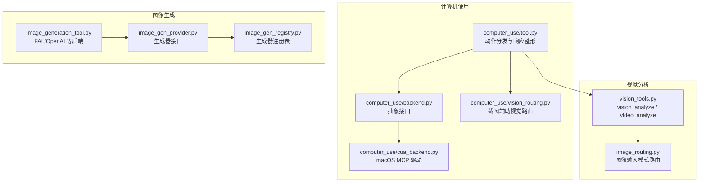
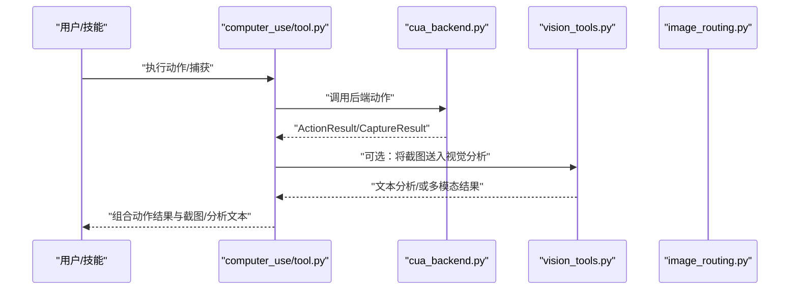
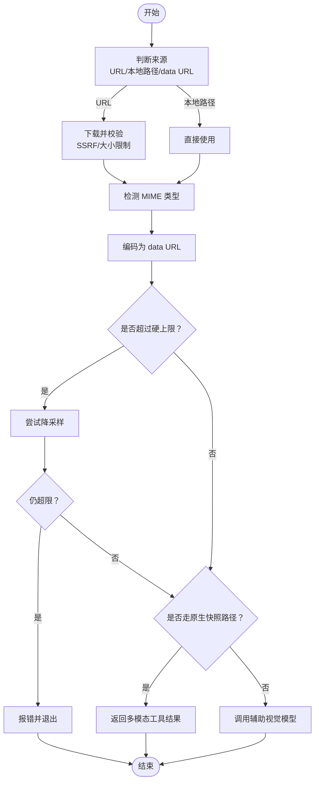
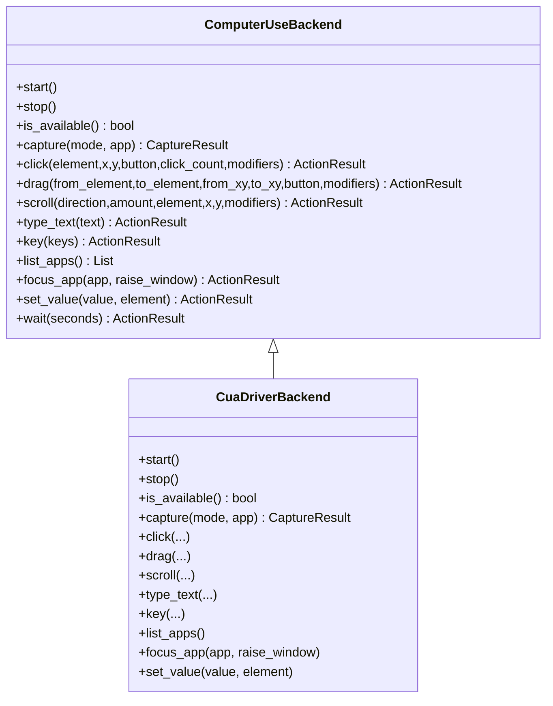
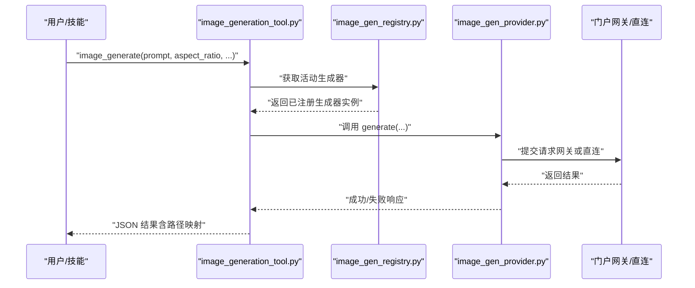
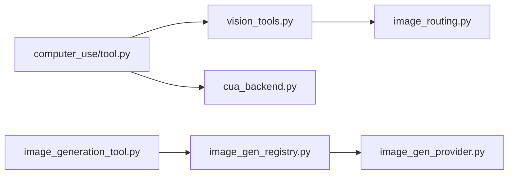

# 图像与视觉工具

<cite>
**本文档引用的文件**
- [tools/vision_tools.py](file://tools/vision_tools.py)
- [tools/computer_use/tool.py](file://tools/computer_use/tool.py)
- [tools/computer_use/backend.py](file://tools/computer_use/backend.py)
- [tools/computer_use/cua_backend.py](file://tools/computer_use/cua_backend.py)
- [tools/image_generation_tool.py](file://tools/image_generation_tool.py)
- [agent/image_gen_provider.py](file://agent/image_gen_provider.py)
- [agent/image_gen_registry.py](file://agent/image_gen_registry.py)
- [agent/image_routing.py](file://agent/image_routing.py)
- [tools/computer_use/vision_routing.py](file://tools/computer_use/vision_routing.py)
</cite>

## 目录
1. [简介](#简介)
2. [项目结构](#项目结构)
3. [核心组件](#核心组件)
4. [架构总览](#架构总览)
5. [详细组件分析](#详细组件分析)
6. [依赖关系分析](#依赖关系分析)
7. [性能考量](#性能考量)
8. [故障排查指南](#故障排查指南)
9. [结论](#结论)
10. [附录](#附录)

## 简介
本技术文档聚焦于图像与视觉工具体系，涵盖以下能力：
- 图像生成：通过多后端（如 FAL、OpenAI、自定义）统一接口生成图片，并支持自动上采样与缓存路径转换。
- 视觉分析：对图片与视频进行描述、问答与理解，支持本地文件、远程 URL 与数据 URL；内置原生快照路径与辅助路由。
- 计算机使用：在 macOS 上通过 cua-driver 后端实现屏幕捕获与交互模拟（点击、拖拽、滚动、输入、按键等），并可选将截图送入视觉分析。
- 安全与隐私：严格的 URL 校验、SSRF 防护、下载大小限制、临时文件清理与最小权限原则。

## 项目结构
围绕“图像与视觉”主题，相关模块分布如下：
- 视觉分析工具：tools/vision_tools.py 提供 vision_analyze 与 video_analyze 工具，负责下载、编码、路由与错误处理。
- 计算机使用工具：tools/computer_use 下的 tool.py、backend.py、cua_backend.py 实现跨平台抽象与 macOS 的 MCP 驱动。
- 图像生成工具：tools/image_generation_tool.py 负责模型选择、负载构建、请求提交与结果后处理。
- 生成器注册与路由：agent/image_gen_provider.py、agent/image_gen_registry.py、agent/image_routing.py 提供统一的生成器接口、注册表与图像输入模式路由。
- 辅助路由：tools/computer_use/vision_routing.py 控制捕获截图是否经由辅助视觉分析。

**图表来源**
- [tools/vision_tools.py:800-1592](file://tools/vision_tools.py#L800-L1592)
- [tools/computer_use/tool.py:1-824](file://tools/computer_use/tool.py#L1-L824)
- [tools/computer_use/backend.py:1-159](file://tools/computer_use/backend.py#L1-L159)
- [tools/computer_use/cua_backend.py:1-780](file://tools/computer_use/cua_backend.py#L1-L780)
- [tools/computer_use/vision_routing.py](file://tools/computer_use/vision_routing.py)
- [tools/image_generation_tool.py:1-1181](file://tools/image_generation_tool.py#L1-L1181)
- [agent/image_gen_provider.py:1-325](file://agent/image_gen_provider.py#L1-L325)
- [agent/image_gen_registry.py:1-146](file://agent/image_gen_registry.py#L1-L146)
- [agent/image_routing.py:1-541](file://agent/image_routing.py#L1-L541)

**章节来源**
- [tools/vision_tools.py:1-1592](file://tools/vision_tools.py#L1-L1592)
- [tools/computer_use/tool.py:1-824](file://tools/computer_use/tool.py#L1-L824)
- [tools/computer_use/backend.py:1-159](file://tools/computer_use/backend.py#L1-L159)
- [tools/computer_use/cua_backend.py:1-780](file://tools/computer_use/cua_backend.py#L1-L780)
- [tools/image_generation_tool.py:1-1181](file://tools/image_generation_tool.py#L1-L1181)
- [agent/image_gen_provider.py:1-325](file://agent/image_gen_provider.py#L1-L325)
- [agent/image_gen_registry.py:1-146](file://agent/image_gen_registry.py#L1-L146)
- [agent/image_routing.py:1-541](file://agent/image_routing.py#L1-L541)

## 核心组件
- 视觉分析工具（vision_analyze）
  - 支持 URL、本地路径与 data URL；自动下载与 MIME 检测；基于 OpenRouter/Gemini 的统一路由；失败时自动重试与降采样。
  - 原生快照路径：当主模型具备原生视觉能力时，直接返回多模态工具结果，避免二次 API 调用。
- 视频分析工具（video_analyze）
  - 支持 mp4、webm、mov、avi、mkv、mpeg；统一转码为 data URL 并发送至多模态模型。
- 计算机使用工具（computer_use）
  - 抽象后端接口，macOS 使用 cua-driver 通过 MCP 通信；支持捕获（AX/SOM/Vision）、点击、拖拽、滚动、键鼠操作、应用聚焦等。
  - 可选将捕获截图送入辅助视觉分析，或直接返回多模态截图。
- 图像生成工具（image_generate）
  - 统一模型目录与参数白名单；支持 FAL、OpenAI 等；可选 Clarity 上采样；支持门户网关与直连两种出账路径。

**章节来源**
- [tools/vision_tools.py:800-1592](file://tools/vision_tools.py#L800-L1592)
- [tools/computer_use/tool.py:1-824](file://tools/computer_use/tool.py#L1-L824)
- [tools/computer_use/backend.py:1-159](file://tools/computer_use/backend.py#L1-L159)
- [tools/computer_use/cua_backend.py:1-780](file://tools/computer_use/cua_backend.py#L1-L780)
- [tools/image_generation_tool.py:1-1181](file://tools/image_generation_tool.py#L1-L1181)

## 架构总览
视觉与图像工具的整体交互流程如下：

**图表来源**
- [tools/computer_use/tool.py:318-782](file://tools/computer_use/tool.py#L318-L782)
- [tools/computer_use/cua_backend.py:424-780](file://tools/computer_use/cua_backend.py#L424-L780)
- [tools/vision_tools.py:800-1082](file://tools/vision_tools.py#L800-L1082)
- [agent/image_routing.py:316-346](file://agent/image_routing.py#L316-L346)

## 详细组件分析

### 视觉分析组件（vision_analyze）
- 输入解析与安全
  - 支持 file://、http(s) 与本地绝对/相对路径；对 URL 进行 SSRF 校验与重定向防护；限制最大下载体积（50 MB）。
- 编码与尺寸控制
  - 自动检测 MIME 类型；优先使用 Pillow 进行降采样（按像素边长与字节上限双重约束）；若失败则回退到原始编码。
- 原生快照路径
  - 当主模型具备原生视觉能力且满足路由条件时，直接返回多模态工具结果（含 image_url），避免额外 API 调用。
- 错误处理与调试
  - 对空内容、超限、格式不支持等情况给出明确提示；支持 VISION_TOOLS_DEBUG 开启调试日志。

**图表来源**
- [tools/vision_tools.py:155-263](file://tools/vision_tools.py#L155-L263)
- [tools/vision_tools.py:372-516](file://tools/vision_tools.py#L372-L516)
- [tools/vision_tools.py:603-630](file://tools/vision_tools.py#L603-L630)
- [tools/vision_tools.py:800-1082](file://tools/vision_tools.py#L800-L1082)

**章节来源**
- [tools/vision_tools.py:50-107](file://tools/vision_tools.py#L50-L107)
- [tools/vision_tools.py:155-263](file://tools/vision_tools.py#L155-L263)
- [tools/vision_tools.py:314-370](file://tools/vision_tools.py#L314-L370)
- [tools/vision_tools.py:372-516](file://tools/vision_tools.py#L372-L516)
- [tools/vision_tools.py:603-630](file://tools/vision_tools.py#L603-L630)
- [tools/vision_tools.py:800-1082](file://tools/vision_tools.py#L800-L1082)

### 计算机使用组件（computer_use）
- 动作分发与安全
  - 对破坏性动作（点击、拖拽、滚动、输入、按键）进行审批与黑名单过滤；支持会话级自动批准。
- 捕获与响应整形
  - 支持三种模式：vision（仅截图）、ax（仅可访问元素树）、som（两者皆有）。根据 provider 最小尺寸限制决定是否返回图片。
  - 可选将截图送入辅助视觉分析，得到文本描述并与 AX 元素索引合并。
- 后端抽象与 macOS 实现
  - 抽象接口定义了 capture、click、drag、scroll、type_text、key、list_apps、focus_app、set_value 等方法；macOS 使用 cua-driver 通过 MCP 通信，具备会话复用与断线重连机制。

**图表来源**
- [tools/computer_use/backend.py:71-159](file://tools/computer_use/backend.py#L71-L159)
- [tools/computer_use/cua_backend.py:398-780](file://tools/computer_use/cua_backend.py#L398-L780)

**章节来源**
- [tools/computer_use/tool.py:214-410](file://tools/computer_use/tool.py#L214-L410)
- [tools/computer_use/tool.py:513-610](file://tools/computer_use/tool.py#L513-L610)
- [tools/computer_use/tool.py:616-744](file://tools/computer_use/tool.py#L616-L744)
- [tools/computer_use/backend.py:1-159](file://tools/computer_use/backend.py#L1-L159)
- [tools/computer_use/cua_backend.py:1-780](file://tools/computer_use/cua_backend.py#L1-L780)

### 图像生成组件（image_generate）
- 模型目录与参数白名单
  - 内置 FAL 模型目录（如 FLUX 2、Z-Image、Nano Banana、GPT Image 等），按模型支持字段过滤参数，确保只传递受支持的键。
- 请求提交与网关
  - 优先使用门户网关（nous）代理，若未配置或不可用则直连后端；对 4xx 网关错误给出清晰提示。
- 结果后处理
  - 对本地生成结果附加主机可见路径与代理可见路径映射，保证不同运行环境下的路径一致性。

**图表来源**
- [tools/image_generation_tool.py:724-800](file://tools/image_generation_tool.py#L724-L800)
- [agent/image_gen_registry.py:75-139](file://agent/image_gen_registry.py#L75-L139)
- [agent/image_gen_provider.py:130-143](file://agent/image_gen_provider.py#L130-L143)

**章节来源**
- [tools/image_generation_tool.py:97-375](file://tools/image_generation_tool.py#L97-L375)
- [tools/image_generation_tool.py:433-474](file://tools/image_generation_tool.py#L433-L474)
- [tools/image_generation_tool.py:692-722](file://tools/image_generation_tool.py#L692-L722)
- [agent/image_gen_registry.py:1-146](file://agent/image_gen_registry.py#L1-L146)
- [agent/image_gen_provider.py:1-325](file://agent/image_gen_provider.py#L1-L325)

### 图像输入模式路由（image_routing）
- 决策逻辑
  - 依据配置（agent.image_input_mode）与模型能力（supports_vision）决定“原生直传”或“文本描述”；显式指定辅助视觉后端时强制文本模式。
- 原生直传
  - 将本地图片转为 data URL，远程图片透传 URL；提供统一的 content 列表构造函数，支持自动收缩与重试。
- 大小处理
  - 采用“先直传再收缩”的策略，遇到提供商拒绝时自动缩小并重试，避免对高带宽提供商施加不必要的质量损失。

**章节来源**
- [agent/image_routing.py:316-346](file://agent/image_routing.py#L316-L346)
- [agent/image_routing.py:447-533](file://agent/image_routing.py#L447-L533)

## 依赖关系分析
- 视觉分析依赖
  - tools/vision_tools.py 依赖辅助客户端与配置系统；在原生快照路径下依赖 image_routing 的能力判定。
- 计算机使用依赖
  - tools/computer_use/tool.py 依赖 backend 抽象与 cua_backend 实现；可选依赖 vision_tools 进行截图预分析。
- 图像生成依赖
  - tools/image_generation_tool.py 依赖注册表与生成器接口；生成器接口依赖统一的成功/失败响应结构。

**图表来源**
- [tools/vision_tools.py:603-630](file://tools/vision_tools.py#L603-L630)
- [tools/computer_use/tool.py:616-645](file://tools/computer_use/tool.py#L616-L645)
- [tools/image_generation_tool.py:433-474](file://tools/image_generation_tool.py#L433-L474)
- [agent/image_gen_registry.py:36-57](file://agent/image_gen_registry.py#L36-L57)
- [agent/image_gen_provider.py:130-143](file://agent/image_gen_provider.py#L130-L143)

**章节来源**
- [tools/vision_tools.py:603-630](file://tools/vision_tools.py#L603-L630)
- [tools/computer_use/tool.py:616-645](file://tools/computer_use/tool.py#L616-L645)
- [tools/image_generation_tool.py:433-474](file://tools/image_generation_tool.py#L433-L474)
- [agent/image_gen_registry.py:36-57](file://agent/image_gen_registry.py#L36-L57)
- [agent/image_gen_provider.py:130-143](file://agent/image_gen_provider.py#L130-L143)

## 性能考量
- 视觉分析
  - 下载阶段采用指数回退与最大重试次数；编码前估算 base64 字节大小，避免不必要的全量读取与编码。
  - 原生快照路径减少一次外部 API 调用，显著降低延迟与成本。
- 计算机使用
  - cua_backend 使用后台 asyncio 循环与会话复用，减少启动开销；断线后单次自动重连。
- 图像生成
  - 参数白名单与模型目录减少无效键传输；门户网关优先可提升稳定性与可观测性。

[本节为通用指导，无需具体文件分析]

## 故障排查指南
- 视觉分析
  - “图像过大”：检查是否超过 20 MB 硬上限或 5 MB 重试目标；建议安装 Pillow 以获得更好的自动降采样。
  - “模型不支持视觉”：确认主模型 capabilities 或配置中的 supports_vision 覆盖；或切换到辅助视觉后端。
  - “空内容/推理模式”：工具已内置一次性重试；若仍失败，检查提示词与网络状态。
- 计算机使用
  - “无可用后端”：确认 macOS 且 cua-driver 已安装；查看安装提示与版本固定变量。
  - “动作被阻断”：检查破坏性动作黑名单与审批回调；必要时调整会话自动批准策略。
- 图像生成
  - “门户网关 4xx”：检查账户余额、配额与模型白名单；参考工具返回的可操作提示。
  - “直连失败”：确认密钥配置与网络可达性。

**章节来源**
- [tools/vision_tools.py:910-922](file://tools/vision_tools.py#L910-L922)
- [tools/vision_tools.py:1023-1070](file://tools/vision_tools.py#L1023-L1070)
- [tools/computer_use/tool.py:224-248](file://tools/computer_use/tool.py#L224-L248)
- [tools/computer_use/cua_backend.py:274-275](file://tools/computer_use/cua_backend.py#L274-L275)
- [tools/image_generation_tool.py:449-473](file://tools/image_generation_tool.py#L449-L473)

## 结论
该工具体系通过统一的路由与抽象层，实现了从“图像生成”到“视觉分析”再到“计算机使用”的完整闭环。其设计强调安全性（URL 校验、SSRF 防护、大小限制）、性能（原生快照路径、降采样、会话复用）与可扩展性（插件化生成器、多后端支持）。对于新能力扩展，建议遵循现有接口与路由规范，确保一致的用户体验与安全基线。

[本节为总结性内容，无需具体文件分析]

## 附录

### 配置选项与参数调优
- 视觉分析
  - auxiliary.vision.timeout：辅助视觉模型请求超时（秒，默认值来自配置）。
  - auxiliary.vision.temperature：辅助视觉模型温度（默认低温度以稳定输出）。
  - auxiliary.vision.download_timeout：远程图片下载超时（秒）。
  - VISION_TOOLS_DEBUG：启用调试日志记录。
- 计算机使用
  - HERMES_COMPUTER_USE_BACKEND：选择后端（默认 cua）。
  - HERMES_CUA_DRIVER_VERSION：固定 cua-driver 版本以保证兼容性。
  - 审批回调：用于破坏性动作的会话级自动批准。
- 图像生成
  - image_gen.provider：活动生成器名称。
  - image_gen.model：当前模型 ID。
  - 门户网关偏好：当未配置直连密钥时自动走门户网关。

**章节来源**
- [tools/vision_tools.py:53-68](file://tools/vision_tools.py#L53-L68)
- [tools/vision_tools.py:951-973](file://tools/vision_tools.py#L951-L973)
- [tools/computer_use/tool.py:135-143](file://tools/computer_use/tool.py#L135-L143)
- [tools/computer_use/cua_backend.py:45-47](file://tools/computer_use/cua_backend.py#L45-L47)
- [tools/image_generation_tool.py:480-511](file://tools/image_generation_tool.py#L480-L511)

### 扩展新视觉处理能力与图像生成模型
- 新增视觉模型
  - 在辅助视觉路由中新增模型标识与温度/超时配置；确保在原生快照路径下正确识别主模型能力。
- 新增图像生成后端
  - 实现 ImageGenProvider 接口，提供 name/display_name/list_models/get_setup_schema/default_model/generate 等方法；通过注册表暴露给工具链。
  - 在 image_generation_tool 中完善参数白名单与模型目录映射。

**章节来源**
- [agent/image_gen_provider.py:51-143](file://agent/image_gen_provider.py#L51-L143)
- [agent/image_gen_registry.py:36-57](file://agent/image_gen_registry.py#L36-L57)
- [tools/image_generation_tool.py:514-554](file://tools/image_generation_tool.py#L514-L554)

### 安全使用指南与隐私保护
- URL 与下载
  - 严格校验 http(s) URL，禁止私有/内部地址；对重定向再次校验；限制最大下载体积。
- 临时文件与缓存
  - 下载的临时文件在使用后及时删除；本地缓存文件不被覆盖。
- 权限与最小暴露
  - 仅在必要时下载远程资源；避免将敏感路径暴露给下游模型；对失败场景提供明确错误提示而非泄露细节。

**章节来源**
- [tools/vision_tools.py:92-106](file://tools/vision_tools.py#L92-L106)
- [tools/vision_tools.py:175-235](file://tools/vision_tools.py#L175-L235)
- [tools/vision_tools.py:1072-1082](file://tools/vision_tools.py#L1072-L1082)