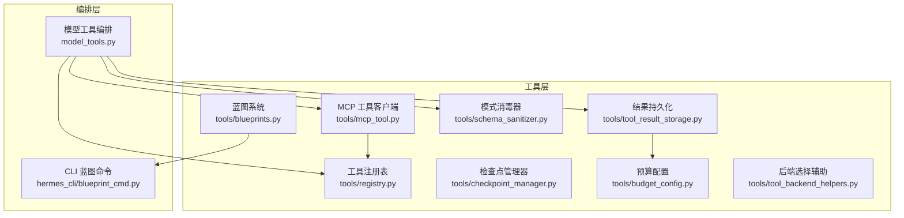
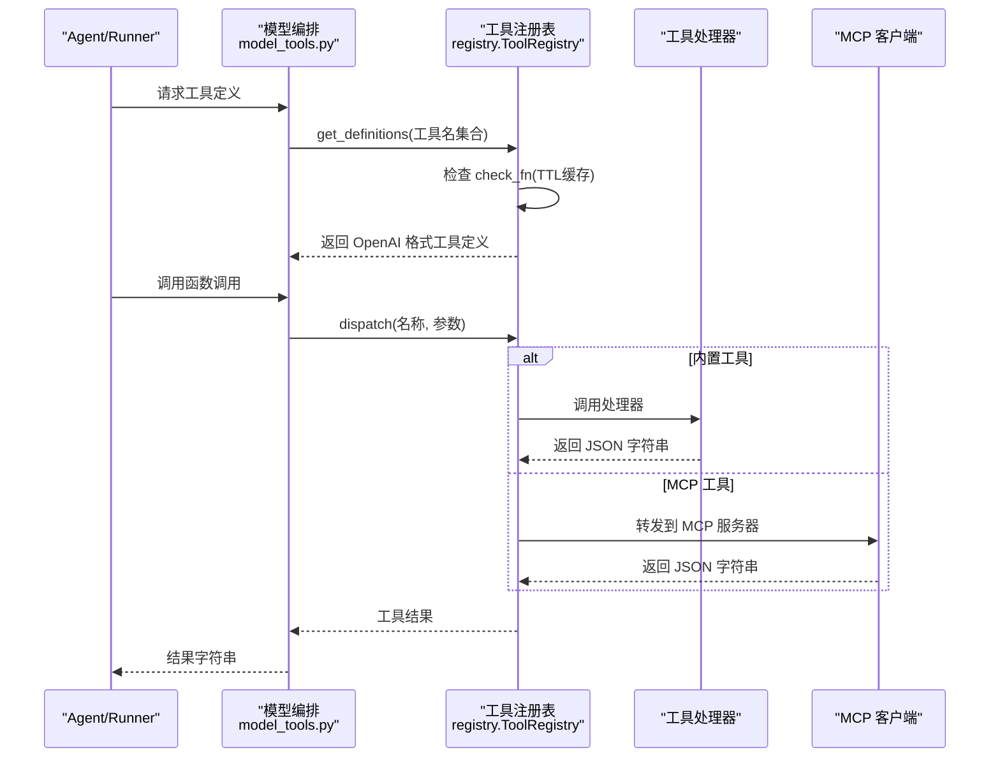
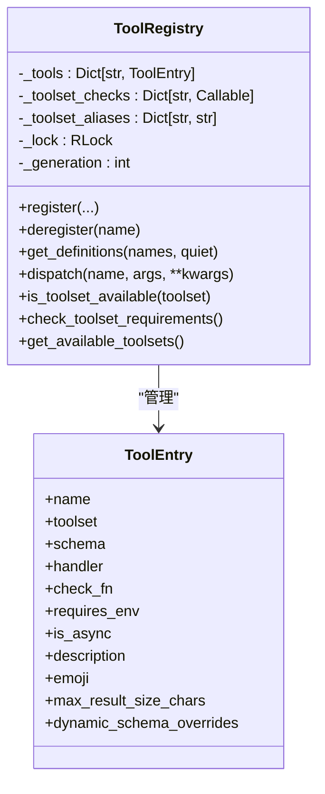
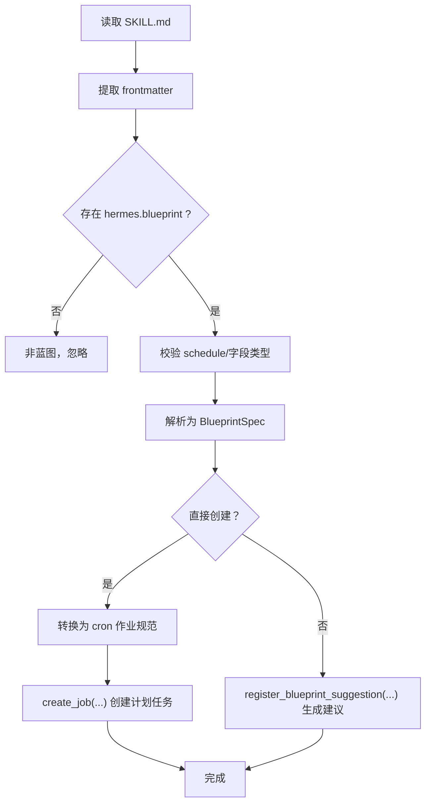
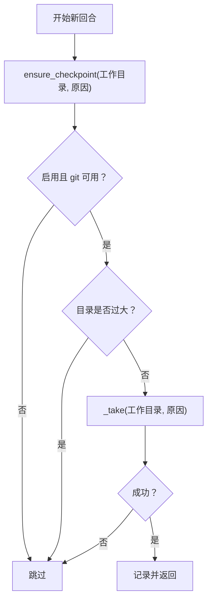
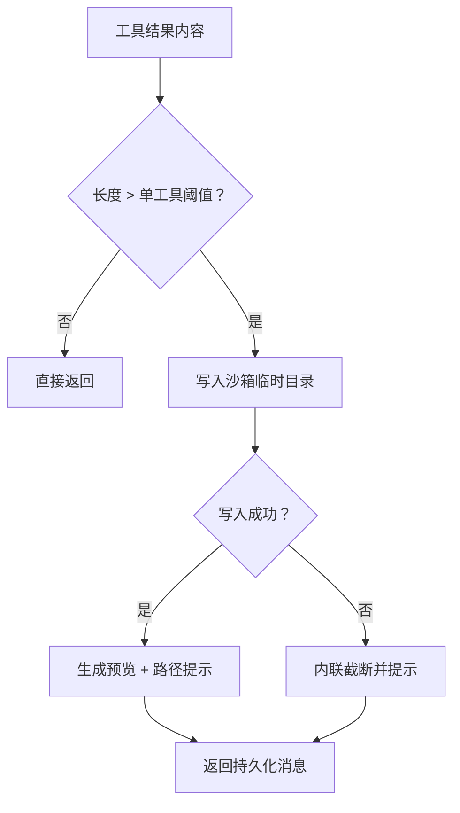
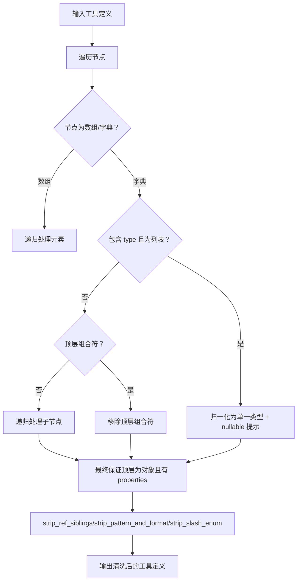
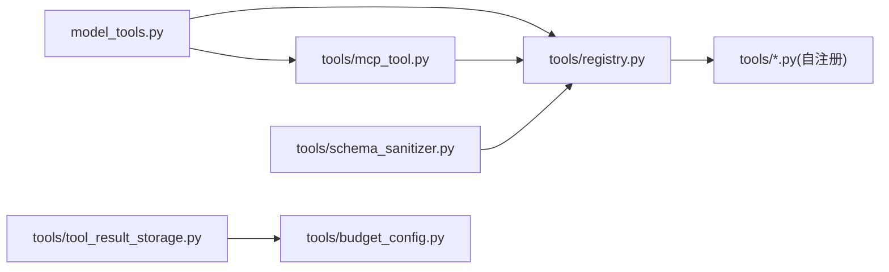

# 工具框架

<cite>
**本文引用的文件**
- [tools/registry.py](file://tools/registry.py)
- [tools/blueprints.py](file://tools/blueprints.py)
- [tools/checkpoint_manager.py](file://tools/checkpoint_manager.py)
- [tools/budget_config.py](file://tools/budget_config.py)
- [tools/schema_sanitizer.py](file://tools/schema_sanitizer.py)
- [tools/tool_result_storage.py](file://tools/tool_result_storage.py)
- [tools/tool_backend_helpers.py](file://tools/tool_backend_helpers.py)
- [tools/mcp_tool.py](file://tools/mcp_tool.py)
- [model_tools.py](file://model_tools.py)
- [hermes_cli/blueprint_cmd.py](file://hermes_cli/blueprint_cmd.py)
- [tests/tools/test_mcp_dynamic_discovery.py](file://tests/tools/test_mcp_dynamic_discovery.py)
</cite>

## 目录
1. [简介](#简介)
2. [项目结构](#项目结构)
3. [核心组件](#核心组件)
4. [架构总览](#架构总览)
5. [详细组件分析](#详细组件分析)
6. [依赖分析](#依赖分析)
7. [性能考虑](#性能考虑)
8. [故障排查指南](#故障排查指南)
9. [结论](#结论)
10. [附录](#附录)

## 简介
本文件系统性梳理工具框架的实现与使用，覆盖以下主题：
- 工具注册表：自注册机制、工具发现流程、可用性检查与缓存、动态 MCP 刷新。
- 蓝图系统：基于技能的可分享自动化模板，调度与建议流程。
- 检查点管理器：透明文件系统快照、自动维护与回收。
- 预算配置：三层结果持久化与预算控制（单工具阈值、转写阈值、每轮聚合预算）。
- 模式消毒器：LLM 后端兼容的 JSON Schema 清洗策略。
- 扩展接口与自定义开发：如何新增工具、工具集别名、后端选择辅助。
- 架构设计与性能优化：线程安全、TTL 缓存、异步桥接、持久化路径选择。
- 测试策略与质量保障：单元测试覆盖动态发现与注册表行为。

## 项目结构
工具框架主要由以下模块构成：
- 工具注册与发现：tools/registry.py 提供注册表与工具发现；model_tools.py 触发内置工具导入与插件发现。
- 蓝图系统：tools/blueprints.py 解析技能中的元数据块，生成计划任务或建议。
- 检查点管理：tools/checkpoint_manager.py 提供透明快照与回滚能力。
- 预算与持久化：tools/budget_config.py、tools/tool_result_storage.py 定义阈值与三层持久化策略。
- 模式消毒：tools/schema_sanitizer.py 统一清洗不兼容的 JSON Schema。
- 后端选择辅助：tools/tool_backend_helpers.py 提供浏览器、Modal、网关等后端决策。
- MCP 工具：tools/mcp_tool.py 连接外部 MCP 服务器，动态注入工具到注册表。
- CLI 蓝图命令：hermes_cli/blueprint_cmd.py 提供蓝图目录与实例化入口。

图表来源
- [tools/registry.py:151-544](file://tools/registry.py#L151-L544)
- [tools/blueprints.py:57-326](file://tools/blueprints.py#L57-L326)
- [tools/checkpoint_manager.py:579-800](file://tools/checkpoint_manager.py#L579-L800)
- [tools/budget_config.py:22-52](file://tools/budget_config.py#L22-L52)
- [tools/tool_result_storage.py:122-233](file://tools/tool_result_storage.py#L122-L233)
- [tools/schema_sanitizer.py:46-101](file://tools/schema_sanitizer.py#L46-L101)
- [tools/tool_backend_helpers.py:17-183](file://tools/tool_backend_helpers.py#L17-L183)
- [tools/mcp_tool.py:1-200](file://tools/mcp_tool.py#L1-L200)
- [model_tools.py:176-200](file://model_tools.py#L176-L200)
- [hermes_cli/blueprint_cmd.py:267-304](file://hermes_cli/blueprint_cmd.py#L267-L304)

章节来源
- [tools/registry.py:1-590](file://tools/registry.py#L1-L590)
- [tools/blueprints.py:1-326](file://tools/blueprints.py#L1-L326)
- [tools/checkpoint_manager.py:1-800](file://tools/checkpoint_manager.py#L1-L800)
- [tools/budget_config.py:1-52](file://tools/budget_config.py#L1-L52)
- [tools/tool_result_storage.py:1-233](file://tools/tool_result_storage.py#L1-L233)
- [tools/schema_sanitizer.py:1-484](file://tools/schema_sanitizer.py#L1-L484)
- [tools/tool_backend_helpers.py:1-183](file://tools/tool_backend_helpers.py#L1-L183)
- [tools/mcp_tool.py:1-4157](file://tools/mcp_tool.py#L1-L4157)
- [model_tools.py:1-200](file://model_tools.py#L1-L200)
- [hermes_cli/blueprint_cmd.py:267-304](file://hermes_cli/blueprint_cmd.py#L267-L304)

## 核心组件
- 工具注册表（ToolRegistry）
  - 自注册：每个工具模块在导入时调用 registry.register(...) 注册自身。
  - 发现：discover_builtin_tools() 扫描 tools/ 下符合条件的模块并导入。
  - 可用性检查：check_fn 支持 TTL 缓存，避免频繁探测外部环境。
  - 动态刷新：支持 MCP 工具列表变更后的去重与重建。
- 蓝图系统（Blueprints）
  - 基于技能的 frontmatter 中 hermes: blueprint 字段解析与校验。
  - 将蓝图转换为计划任务或建议项，统一走 cron 管道。
- 检查点管理器（CheckpointManager）
  - 单共享存储布局，按项目哈希隔离引用与索引。
  - 自动维护：过期清理、GC 回收、大小上限控制。
- 预算与持久化（BudgetConfig + ToolResultStorage）
  - 三层预算：单工具阈值（可被固定阈值覆盖）、转写阈值、每轮聚合预算。
  - 持久化：超阈值结果写入沙箱临时目录，返回预览与路径提示。
- 模式消毒器（SchemaSanitizer）
  - 针对严格后端（如 llama.cpp）清洗 schema，移除不兼容组合符与顶层约束。
- 后端选择辅助（ToolBackendHelpers）
  - 浏览器云提供商归一化、Modal 执行模式解析、网关可用性判断等。
- MCP 工具客户端（MCP Tool）
  - 多传输协议连接外部 MCP 服务器，动态注册工具，支持采样与并发。

章节来源
- [tools/registry.py:151-544](file://tools/registry.py#L151-L544)
- [tools/blueprints.py:57-326](file://tools/blueprints.py#L57-L326)
- [tools/checkpoint_manager.py:579-800](file://tools/checkpoint_manager.py#L579-L800)
- [tools/budget_config.py:22-52](file://tools/budget_config.py#L22-L52)
- [tools/tool_result_storage.py:122-233](file://tools/tool_result_storage.py#L122-L233)
- [tools/schema_sanitizer.py:46-101](file://tools/schema_sanitizer.py#L46-L101)
- [tools/tool_backend_helpers.py:17-183](file://tools/tool_backend_helpers.py#L17-L183)
- [tools/mcp_tool.py:1-200](file://tools/mcp_tool.py#L1-L200)

## 架构总览
工具框架通过“自注册 + 编排层”实现解耦与扩展：
- 注册表集中管理工具元数据、处理器与可用性检查。
- 编排层（model_tools.py）负责发现工具、生成工具定义、执行工具与错误处理。
- MCP 客户端在运行时动态注入外部工具，保持与内置工具一致的调用体验。
- 蓝图系统将“技能 + 调度”无缝接入现有技能生态与 cron 管道。
- 预算与持久化在结果层面保护上下文窗口，避免溢出。
- 检查点管理器提供透明的文件系统快照与回滚，降低破坏性操作风险。

图表来源
- [model_tools.py:176-200](file://model_tools.py#L176-L200)
- [tools/registry.py:337-417](file://tools/registry.py#L337-L417)
- [tools/mcp_tool.py:1-200](file://tools/mcp_tool.py#L1-L200)

章节来源
- [model_tools.py:1-200](file://model_tools.py#L1-L200)
- [tools/registry.py:337-417](file://tools/registry.py#L337-L417)
- [tools/mcp_tool.py:1-200](file://tools/mcp_tool.py#L1-L200)

## 详细组件分析

### 工具注册表与工具发现
- 自注册机制
  - 工具模块在导入时调用 registry.register(...)，传入名称、工具集、参数 schema、处理器、可选 check_fn、环境变量需求、是否异步、描述、emoji、最大结果长度、动态 schema 覆盖回调等。
  - 注册时支持覆盖策略：MCP 间覆盖允许，显式 override=True 允许插件替换内置工具。
- 工具发现
  - discover_builtin_tools() 通过 AST 检测模块顶层是否存在 registry.register(...) 调用，过滤 __init__.py、registry.py、mcp_tool.py 等，然后导入匹配模块以触发注册。
- 可用性检查与缓存
  - _check_fn_cached(fn) 对 check_fn 的结果进行 TTL 缓存（默认约 30 秒），减少对外部状态探测的开销。
  - invalidate_check_fn_cache() 在配置变化后主动清空缓存。
- 动态 MCP 刷新
  - deregister(name) 会清理工具集检查与别名映射，确保 MCP 列表变更后的一致性。
- 调度与执行
  - get_definitions() 返回 OpenAI 格式的工具定义，应用动态 schema 覆盖与 check_fn 过滤。
  - dispatch() 统一执行工具，支持同步与异步处理器，并对异常进行清洗与格式化。

图表来源
- [tools/registry.py:77-107](file://tools/registry.py#L77-L107)
- [tools/registry.py:151-544](file://tools/registry.py#L151-L544)

章节来源
- [tools/registry.py:57-149](file://tools/registry.py#L57-L149)
- [tests/tools/test_mcp_dynamic_discovery.py:122-165](file://tests/tools/test_mcp_dynamic_discovery.py#L122-L165)

### 蓝图系统：设计原理与工作流程
- 设计要点
  - 蓝图即技能：通过 SKILL.md 的 frontmatter 中 metadata.hermes.blueprint 声明调度计划，从而复用技能生态的搜索、审核、发布、索引等完整管道。
  - 两阶段：解析（parse_blueprint）与落地（create_blueprint_job/register_blueprint_suggestion）。
- 关键流程
  - 解析：从 SKILL.md 提取 blueprint 字段，校验 schedule 必填、enabled_toolsets 类型等。
  - 落地：将 BlueprintSpec 转换为 cron 作业规范，支持直接创建或转化为建议项供用户确认。
  - 导出：将已存在的 cron 作业反向渲染为可发布的 SKILL.md（含 blueprint 块）。
- 与 CLI 的衔接
  - hermes_cli/blueprint_cmd.py 提供蓝图目录浏览与实例化快捷方式，支持交互式填充字段或直接确定性创建。

图表来源
- [tools/blueprints.py:95-142](file://tools/blueprints.py#L95-L142)
- [tools/blueprints.py:172-215](file://tools/blueprints.py#L172-L215)
- [tools/blueprints.py:217-244](file://tools/blueprints.py#L217-L244)
- [hermes_cli/blueprint_cmd.py:267-304](file://hermes_cli/blueprint_cmd.py#L267-L304)

章节来源
- [tools/blueprints.py:57-326](file://tools/blueprints.py#L57-L326)
- [hermes_cli/blueprint_cmd.py:267-304](file://hermes_cli/blueprint_cmd.py#L267-L304)

### 检查点管理器：状态保存与恢复
- 存储布局
  - 单共享存储 store/，按项目哈希隔离 refs 与索引，避免跨项目对象重复。
  - 默认排除规则（依赖缓存、虚拟环境、日志、媒体等）减少快照体积。
- 初始化与迁移
  - 首次使用初始化裸仓库，设置用户信息与禁用 GC 自动化，写入默认排除列表。
  - 旧版每目录阴影仓库存储迁移至 legacy-<timestamp>/ 目录。
- 快照与回滚
  - ensure_checkpoint() 在每次对话回合内按目录去重快照，支持原因标记。
  - list_checkpoints()/diff()/restore() 提供列出、差异与回滚能力。
- 维护与回收
  - prune_checkpoints() 删除孤儿与过期引用并执行 gc --prune=now。
  - 按项目丢弃最老快照直到总大小低于 max_total_size_mb。

图表来源
- [tools/checkpoint_manager.py:619-660](file://tools/checkpoint_manager.py#L619-L660)
- [tools/checkpoint_manager.py:627-660](file://tools/checkpoint_manager.py#L627-L660)

章节来源
- [tools/checkpoint_manager.py:1-800](file://tools/checkpoint_manager.py#L1-L800)

### 预算配置与资源管理
- 三层预算
  - 单工具阈值：优先固定阈值（如 read_file），其次工具覆盖，再次注册表阈值，最后默认阈值。
  - 转写阈值：超过阈值的结果写入沙箱临时目录，返回预览与路径提示。
  - 每轮聚合预算：对一轮内所有工具结果进行排序，优先持久化最大的未持久化结果，直至总字符数不超过 turn_budget。
- 配置来源
  - BudgetConfig 提供默认阈值与覆盖字典，resolve_threshold() 按优先级解析。
  - DEFAULT_BUDGET 与 DEFAULT_RESULT_SIZE_CHARS/TURN_BUDGET_CHARS/PREVIEW_SIZE_CHARS 保持与历史一致。

图表来源
- [tools/budget_config.py:22-52](file://tools/budget_config.py#L22-L52)
- [tools/tool_result_storage.py:122-179](file://tools/tool_result_storage.py#L122-L179)
- [tools/tool_result_storage.py:181-233](file://tools/tool_result_storage.py#L181-L233)

章节来源
- [tools/budget_config.py:1-52](file://tools/budget_config.py#L1-L52)
- [tools/tool_result_storage.py:1-233](file://tools/tool_result_storage.py#L1-L233)

### 模式消毒器：数据验证与清理策略
- 目标
  - 适配严格后端（如 llama.cpp 的 json-schema-to-grammar），修复常见不兼容形状。
- 主要策略
  - 替换裸字符串 schema 为标准对象形式；为空对象注入 properties: {}。
  - 将 type: ["string","null"] 归一化为 type: "string" 并保留 nullable: true 提示。
  - 去除顶层 anyOf/oneOf/allOf/enum/not；递归保留嵌套属性中的组合器。
  - 去除与 $ref 同级的 default 等关键字；strip_pattern_and_format()/strip_slash_enum() 在失败时作为恢复手段。
- 使用场景
  - 在最终工具定义输出前调用 sanitize_tool_schemas()，保证不同后端一致性。

图表来源
- [tools/schema_sanitizer.py:46-101](file://tools/schema_sanitizer.py#L46-L101)
- [tools/schema_sanitizer.py:166-229](file://tools/schema_sanitizer.py#L166-L229)
- [tools/schema_sanitizer.py:346-421](file://tools/schema_sanitizer.py#L346-L421)

章节来源
- [tools/schema_sanitizer.py:1-484](file://tools/schema_sanitizer.py#L1-L484)

### 扩展接口与自定义开发指南
- 新增工具
  - 在 tools/ 下新建模块，定义工具 schema 与处理器，导入 registry 并在模块级调用 registry.register(...)。
  - 若需要外部环境探测，提供 check_fn 并返回布尔值；注册表会缓存其结果。
- 工具集别名
  - 使用 register_toolset_alias(alias, canonical) 为工具集建立别名，便于 UI 展示与用户理解。
- 后端选择
  - 使用 tools/tool_backend_helpers 提供的工具（如浏览器云提供商、Modal 模式、网关偏好）进行决策。
- MCP 工具
  - 在配置中添加 mcp_servers 条目，启动时由 mcp_tool.py 自动发现并注册到注册表，支持 stdio、HTTP/StreamableHTTP、SSE 传输与采样。

章节来源
- [tools/registry.py:208-229](file://tools/registry.py#L208-L229)
- [tools/tool_backend_helpers.py:71-183](file://tools/tool_backend_helpers.py#L71-L183)
- [tools/mcp_tool.py:1-200](file://tools/mcp_tool.py#L1-L200)

## 依赖分析
- 组件耦合
  - model_tools.py 仅依赖 tools/registry 与工具集解析，避免直接耦合具体工具实现。
  - 注册表对工具模块采用延迟导入（通过 discover_builtin_tools），降低启动时的循环依赖风险。
  - MCP 客户端独立于注册表之外，通过 deregister/register 实现动态刷新。
- 外部依赖
  - MCP 客户端依赖 mcp 包（可选），未安装时模块为无操作状态。
  - 检查点管理器依赖 git 子进程与系统路径，具备完善的错误处理与超时控制。
- 循环依赖规避
  - registry.py 不导入 model_tools 或工具模块，避免循环导入；工具模块导入 registry 实现自注册。

图表来源
- [model_tools.py:176-200](file://model_tools.py#L176-L200)
- [tools/registry.py:57-75](file://tools/registry.py#L57-L75)
- [tools/mcp_tool.py:1-200](file://tools/mcp_tool.py#L1-L200)
- [tools/tool_result_storage.py:30-35](file://tools/tool_result_storage.py#L30-L35)
- [tools/budget_config.py:22-52](file://tools/budget_config.py#L22-L52)
- [tools/schema_sanitizer.py:46-62](file://tools/schema_sanitizer.py#L46-L62)

章节来源
- [model_tools.py:176-200](file://model_tools.py#L176-L200)
- [tools/registry.py:57-75](file://tools/registry.py#L57-L75)
- [tools/mcp_tool.py:1-200](file://tools/mcp_tool.py#L1-L200)
- [tools/tool_result_storage.py:30-35](file://tools/tool_result_storage.py#L30-L35)
- [tools/budget_config.py:22-52](file://tools/budget_config.py#L22-L52)
- [tools/schema_sanitizer.py:46-62](file://tools/schema_sanitizer.py#L46-L62)

## 性能考虑
- 注册表查询与缓存
  - check_fn TTL 缓存（约 30 秒）减少外部探测成本；_check_fn_cached 内部还有一层按调用缓存，避免同一轮内重复探测。
  - 生成器计数（_generation）用于缓存失效标记，确保 MCP 刷新后缓存正确失效。
- 异步桥接
  - _run_async 使用持久事件循环，避免“事件循环已关闭”问题，提升异步工具稳定性与复用率。
- 持久化与 IO
  - maybe_persist_tool_result 通过 env.execute() 将内容经 stdin 推送，绕过命令行参数长度限制，适合大结果写入。
  - enforce_turn_budget 采用贪心策略（按大小排序）优先持久化最大结果，降低二次 IO 成本。
- 检查点
  - 单共享存储显著减少对象重复；定期 prune 与大小上限控制避免无限增长。

章节来源
- [tools/registry.py:126-149](file://tools/registry.py#L126-L149)
- [model_tools.py:84-174](file://model_tools.py#L84-L174)
- [tools/tool_result_storage.py:78-95](file://tools/tool_result_storage.py#L78-L95)
- [tools/tool_result_storage.py:181-233](file://tools/tool_result_storage.py#L181-L233)
- [tools/checkpoint_manager.py:44-49](file://tools/checkpoint_manager.py#L44-L49)

## 故障排查指南
- 工具不可用
  - 检查工具的 check_fn 是否返回 False；可通过 invalidate_check_fn_cache() 清理缓存后重试。
  - 使用 check_toolset_requirements()/check_tool_availability() 获取工具集可用性详情。
- MCP 工具异常
  - 确认 MCP 服务器配置正确、网络可达；查看 mcp-stderr.log 定位子进程输出。
  - 若出现 schema 不兼容导致的后端报错，启用 schema_sanitizer 的清洗逻辑。
- 检查点相关
  - git 未安装或权限不足会导致快照失败；确认 PATH 与 HOME 目录权限。
  - 存储空间不足或磁盘满会影响写入；使用 prune 与清理策略释放空间。
- 预算与持久化
  - 若结果仍被截断，检查 BudgetConfig 的阈值设置与 resolve_threshold 优先级。
  - 沙箱写入失败时会回退为内联截断，确认环境执行器可用性与临时目录权限。

章节来源
- [tools/registry.py:144-149](file://tools/registry.py#L144-L149)
- [tools/registry.py:469-541](file://tools/registry.py#L469-L541)
- [tools/mcp_tool.py:121-170](file://tools/mcp_tool.py#L121-L170)
- [tools/checkpoint_manager.py:275-336](file://tools/checkpoint_manager.py#L275-L336)
- [tools/tool_result_storage.py:159-179](file://tools/tool_result_storage.py#L159-L179)

## 结论
该工具框架通过“自注册 + 编排层 + 动态扩展”的设计，实现了高内聚、低耦合的工具体系：
- 注册表统一管理工具元数据与可用性，结合 TTL 缓存与动态刷新，兼顾性能与实时性。
- 蓝图系统复用技能生态，将“自动化模板”无缝接入现有工作流。
- 检查点管理器提供透明快照与回滚，降低破坏性操作风险。
- 预算与持久化三层策略有效保护上下文窗口，避免溢出。
- 模式消毒器提升多后端兼容性，减少 schema 不一致带来的失败。
- 扩展接口清晰，MCP、工具集别名与后端选择辅助使自定义开发更简单。

## 附录
- 测试策略与质量保障
  - 单元测试覆盖动态发现与注册表行为，例如 deregister 对工具集检查与别名的影响。
  - 建议在新增工具或修改 schema 时补充针对 get_definitions 与 dispatch 的测试，确保可用性检查与错误处理正常。
- 最佳实践
  - 工具应提供明确的 check_fn，避免在每轮都进行昂贵探测。
  - 使用 BudgetConfig 的工具覆盖与固定阈值，针对易产生大结果的工具设置合理阈值。
  - 对于严格后端，提前启用 schema_sanitizer 的清洗步骤。
  - MCP 工具变更频繁时，及时调用 invalidate_check_fn_cache() 以刷新可用性状态。

章节来源
- [tests/tools/test_mcp_dynamic_discovery.py:122-165](file://tests/tools/test_mcp_dynamic_discovery.py#L122-L165)