# 工具系统

<cite>
**本文引用的文件**
- [tools/__init__.py](file://tools/__init__.py)
- [tools/registry.py](file://tools/registry.py)
- [agent/tool_executor.py](file://agent/tool_executor.py)
- [agent/tool_guardrails.py](file://agent/tool_guardrails.py)
- [tools/tool_backend_helpers.py](file://tools/tool_backend_helpers.py)
- [tools/web_tools.py](file://tools/web_tools.py)
- [tools/file_tools.py](file://tools/file_tools.py)
- [tools/terminal_tool.py](file://tools/terminal_tool.py)
- [tools/browser_tool.py](file://tools/browser_tool.py)
- [tools/image_generation_tool.py](file://tools/image_generation_tool.py)
</cite>

## 目录
1. [简介](#简介)
2. [项目结构](#项目结构)
3. [核心组件](#核心组件)
4. [架构总览](#架构总览)
5. [详细组件分析](#详细组件分析)
6. [依赖分析](#依赖分析)
7. [性能考虑](#性能考虑)
8. [故障排查指南](#故障排查指南)
9. [结论](#结论)
10. [附录](#附录)

## 简介
本文件系统性梳理工具系统的注册与发现机制、工具定义规范与接口标准、各类工具实现原理与使用方法，并深入探讨安全机制与沙箱隔离策略、参数校验与结果处理、错误恢复策略、自定义工具开发指南、性能优化与并发处理策略，以及丰富的使用示例与集成方案。

## 项目结构
工具系统围绕“注册中心 + 执行器 + 安全与守卫 + 后端选择与网关”展开：
- 注册中心：集中管理工具元数据、可用性检查、动态刷新与并发安全。
- 执行器：顺序与并发调度工具调用，统一错误捕获与结果后处理。
- 守卫：循环与非进展检测，避免重复失败与无效轮询。
- 后端与网关：按需选择本地/容器/云后端，支持托管网关与凭据切换。

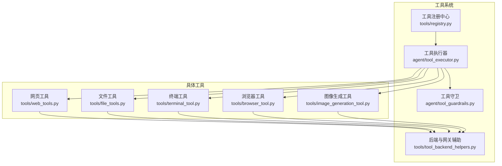

**图表来源**
- [tools/registry.py](file://tools/registry.py)
- [agent/tool_executor.py](file://agent/tool_executor.py)
- [agent/tool_guardrails.py](file://agent/tool_guardrails.py)
- [tools/tool_backend_helpers.py](file://tools/tool_backend_helpers.py)
- [tools/web_tools.py](file://tools/web_tools.py)
- [tools/file_tools.py](file://tools/file_tools.py)
- [tools/terminal_tool.py](file://tools/terminal_tool.py)
- [tools/browser_tool.py](file://tools/browser_tool.py)
- [tools/image_generation_tool.py](file://tools/image_generation_tool.py)

**章节来源**
- [tools/__init__.py](file://tools/__init__.py)
- [tools/registry.py](file://tools/registry.py)

## 核心组件
- 工具注册中心（ToolRegistry）
  - 提供工具注册、注销、查询、可用性检查、动态刷新、并发安全快照、工具集别名映射等能力。
  - 支持 TTL 缓存 check_fn 结果以降低外部探测开销。
- 工具执行器（顺序/并发）
  - 统一解析参数、预检（工具搜索解包、中间件、守卫）、并发执行、结果持久化与预算控制、后处理与回调。
- 工具守卫（循环与非进展检测）
  - 基于签名与结果哈希识别重复失败与无进展，提供警告与硬停止策略。
- 后端与网关辅助
  - 提供浏览器/Modal/图像生成等后端选择与托管网关决策逻辑。

**章节来源**
- [tools/registry.py](file://tools/registry.py)
- [agent/tool_executor.py](file://agent/tool_executor.py)
- [agent/tool_guardrails.py](file://agent/tool_guardrails.py)
- [tools/tool_backend_helpers.py](file://tools/tool_backend_helpers.py)

## 架构总览
工具系统通过“模块级注册 + 运行时查询”的方式实现松耦合与可扩展性。每个工具在导入时向注册中心注册自身模式、处理器、可用性检查与环境要求；运行时由模型工具层或执行器按需查询并分发调用。

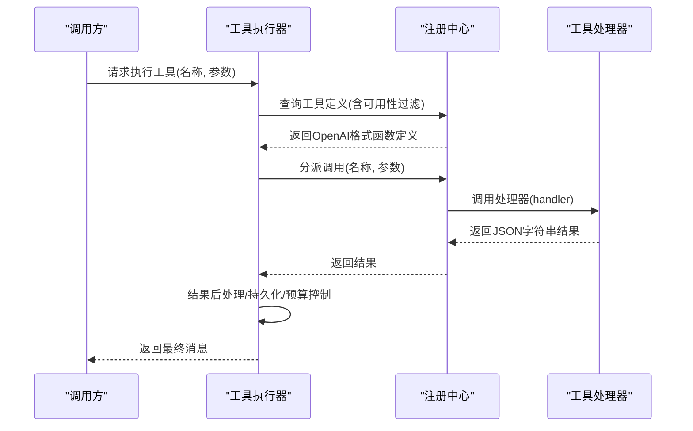

**图表来源**
- [agent/tool_executor.py](file://agent/tool_executor.py)
- [tools/registry.py](file://tools/registry.py)

## 详细组件分析

### 工具注册与发现机制
- 自动发现
  - 通过 AST 检测模块顶层是否存在 registry.register(...) 调用来判断是否为自注册工具模块。
  - 发现过程仅导入工具模块，避免过早初始化重型后端。
- 注册项（ToolEntry）
  - 字段覆盖：名称、工具集、模式、处理器、可用性检查、异步标记、描述、表情、最大结果长度、动态模式覆盖等。
- 可用性检查与缓存
  - 对 check_fn 的结果进行 TTL 缓存（默认约30秒），减少对 Playwright、Docker、Modal 等外部状态的频繁探测。
  - 支持显式失效（如启用/禁用工具后）。
- 并发安全与快照
  - 使用重入锁保护注册表变更；读取侧返回稳定快照，避免读写竞争。
- 动态刷新与别名
  - 支持 MCP 等动态刷新场景；提供工具集别名映射，便于兼容与迁移。

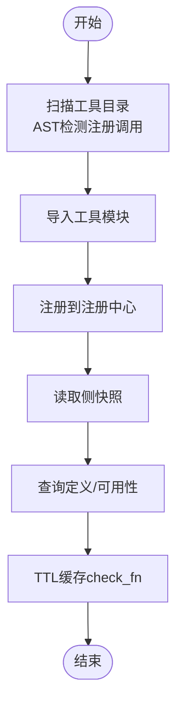

**图表来源**
- [tools/registry.py](file://tools/registry.py)

**章节来源**
- [tools/registry.py](file://tools/registry.py)

### 工具执行器（顺序与并发）
- 顺序执行
  - 逐个解析参数、预检（工具搜索解包、中间件、守卫）、执行、记录文件变更、持久化、预算控制、回调与进度反馈。
- 并发执行
  - 最大工作线程数受控；每个任务在独立线程中执行，支持中断传播与心跳；对未开始的任务尝试取消；完成后统一汇总结果与统计。
  - 支持中间件请求钩子、后置回调、守护与撤销提示、多模态结果归一化、子目录提示注入等。
- 错误处理
  - 统一捕获异常并经净化器输出一致的错误格式；对键盘中断与用户取消给出明确状态与消息。

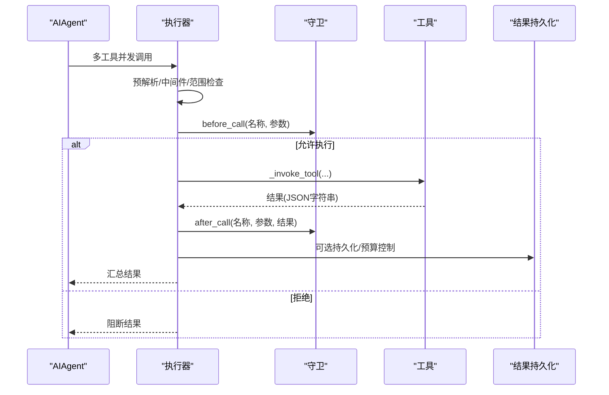

**图表来源**
- [agent/tool_executor.py](file://agent/tool_executor.py)
- [agent/tool_guardrails.py](file://agent/tool_guardrails.py)

**章节来源**
- [agent/tool_executor.py](file://agent/tool_executor.py)
- [agent/tool_guardrails.py](file://agent/tool_guardrails.py)

### 工具守卫（循环与非进展检测）
- 关键阈值
  - 精确失败警告/阻断、相同工具失败警告/阻断、无进展警告/阻断等阈值可配置。
- 签名与哈希
  - 基于工具名与规范化参数哈希构建稳定签名，避免误判。
- 行为策略
  - 警告：仅提示，允许继续；阻断：阻止当前轮次；硬停止：终止整回合。
- 结果分类
  - 针对不同工具（如 terminal/memory）采用专用失败判定，提升一致性。

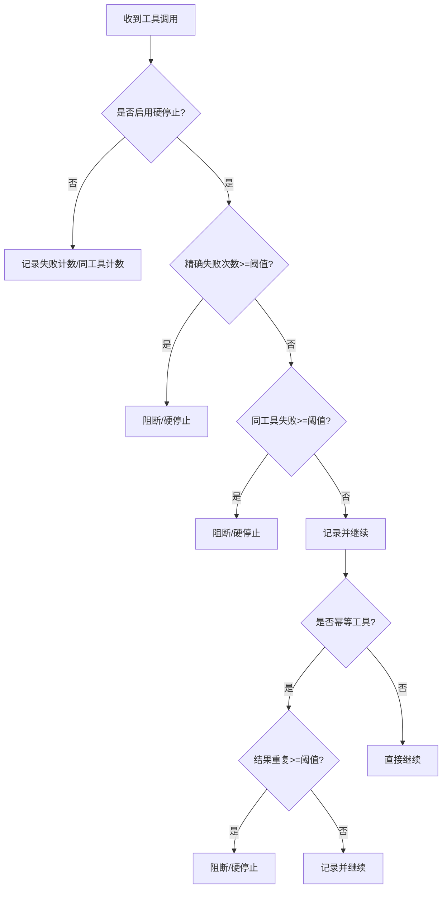

**图表来源**
- [agent/tool_guardrails.py](file://agent/tool_guardrails.py)

**章节来源**
- [agent/tool_guardrails.py](file://agent/tool_guardrails.py)

### 网络搜索工具（web_tools）
- 后端选择
  - 支持 Tavily、Exa、Parallel、Firecrawl、SearXNG、Brave-Free、DDGS、XAI 等；优先级可按能力拆分（搜索/提取）。
  - 自动探测可用后端，必要时回退至托管网关。
- 内容处理
  - 对超长内容进行分块并行摘要，再合成最终摘要；失败时回退到截断原文。
- 辅助能力
  - 通过辅助模型进行智能摘要，限制输出大小，保障上下文安全。
- 安全与调试
  - URL 安全检查与规范化；支持调试会话记录。

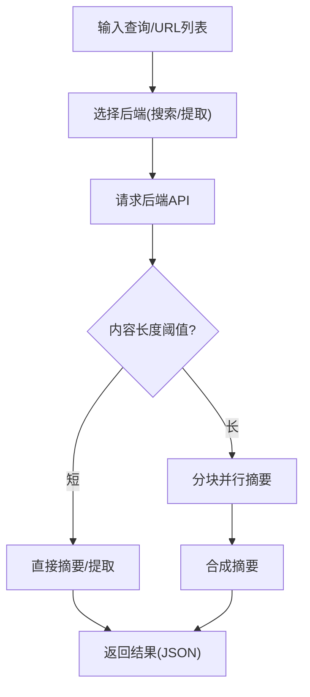

**图表来源**
- [tools/web_tools.py](file://tools/web_tools.py)

**章节来源**
- [tools/web_tools.py](file://tools/web_tools.py)

### 文件操作工具（file_tools）
- 路径解析与工作区锚定
  - 优先使用“实时终端工作目录”作为基座，其次任务级覆盖，再次绝对且非哨兵的 TERMINAL_CWD，最后进程工作目录。
  - 防止相对路径误落到错误工作树。
- 设备路径与敏感路径防护
  - 明确禁止读取无限输出/阻塞输入设备；拒绝写入系统关键路径与 Hermes 配置文件。
- 读写去重与历史追踪
  - 基于键值与时间戳的去重与历史上限控制，避免重复读取与内存膨胀。
- 容器镜像与跨档案警告
  - 检测跨档案/沙箱镜像写入，给出软警告提示。
- 文件操作对象
  - 通过 ShellFileOperations 在本地/容器/云沙箱中执行读写与补丁。

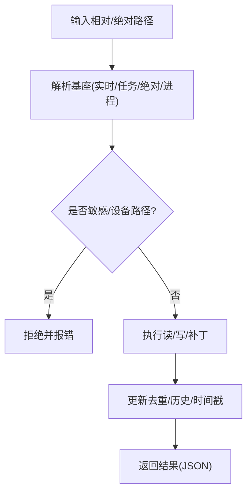

**图表来源**
- [tools/file_tools.py](file://tools/file_tools.py)

**章节来源**
- [tools/file_tools.py](file://tools/file_tools.py)

### 终端执行工具（terminal_tool）
- 多后端支持
  - 本地、Docker、Modal、SSH、Singularity、Daytona 等；支持持久化文件系统与自动清理。
- 危险命令审批与 sudo 管理
  - 集成危险命令守卫与交互式 sudo 密码缓存；支持回调注入以适配 CLI/TUI。
- 子进程与后台任务
  - 复合后台命令重写以避免子壳等待问题；支持前台超时上限与磁盘用量预警。
- 环境隔离与清理
  - 任务级环境创建与回收；清理线程与空闲回收。

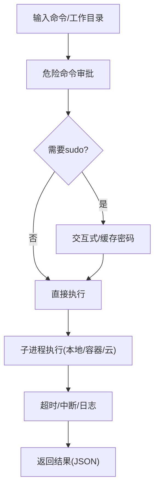

**图表来源**
- [tools/terminal_tool.py](file://tools/terminal_tool.py)

**章节来源**
- [tools/terminal_tool.py](file://tools/terminal_tool.py)

### 浏览器自动化工具（browser_tool）
- 后端选择
  - 本地（Chromium/轻引擎）、Browserbase、Browser Use（云）；支持 Camofox 代理模式。
- 会话与快照
  - 任务感知会话隔离；基于可访问性树的文本快照；元素交互通过引用选择器。
- 引擎与回退
  - Lightpanda 引擎导航更快但无截图；当结果不满足条件时自动回退 Chrome。
- CDP 与监督者
  - 支持 CDP 直连与对话框/帧树监督；可配置对话框策略与超时。

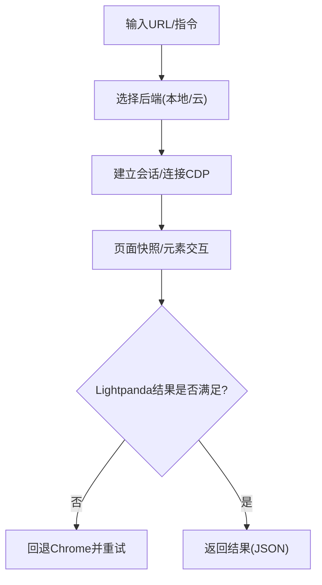

**图表来源**
- [tools/browser_tool.py](file://tools/browser_tool.py)

**章节来源**
- [tools/browser_tool.py](file://tools/browser_tool.py)

### 图像生成工具（image_generation_tool）
- 模型目录与参数白名单
  - 统一输入（提示词、宽高比）映射到各模型原生负载，严格按 supports 白名单过滤。
- 托管网关与凭据
  - 当未配置直接密钥或用户偏好网关时，走 Nous 门户托管队列；错误时给出清晰指引。
- 超分辨率
  - 针对部分模型链式调用 Clarity 超分辨率；失败时回退原图。
- 后端可见路径映射
  - 将宿主路径映射为后端可见路径，确保后续工具可访问生成物。

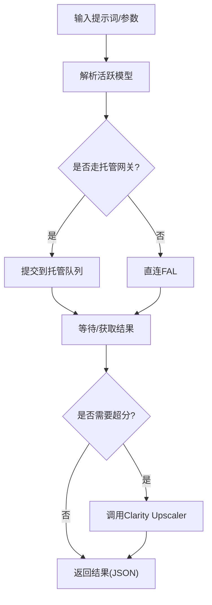

**图表来源**
- [tools/image_generation_tool.py](file://tools/image_generation_tool.py)

**章节来源**
- [tools/image_generation_tool.py](file://tools/image_generation_tool.py)

### 视觉处理工具（通用）
- 多模态结果归一化
  - 将多模态字典转换为 OpenAI 风格内容数组，保证下游模型接收一致格式。
- 文本摘要与子目录提示
  - 对多模态文本摘要，附加子目录提示以增强检索与定位。

**章节来源**
- [agent/tool_executor.py](file://agent/tool_executor.py)

## 依赖分析
- 模块内聚与耦合
  - 工具注册中心与执行器低耦合：前者只负责元数据与分发，后者负责生命周期与错误处理。
  - 守卫独立于执行器，仅提供决策与元数据，便于复用。
  - 后端辅助模块被多个工具共享，形成横切关注点（后端选择、网关、凭据）。
- 外部依赖与集成点
  - 网页工具依赖插件生态（Firecrawl/Tavily/Parallel/Exa 等）与辅助模型。
  - 文件工具依赖终端后端（本地/容器/云）与文件系统安全规则。
  - 终端工具依赖系统命令、sudo、容器/云后端。
  - 浏览器工具依赖 agent-browser CLI、CDP、云提供商 SDK。
  - 图像生成工具依赖 FAL SDK 与托管网关。

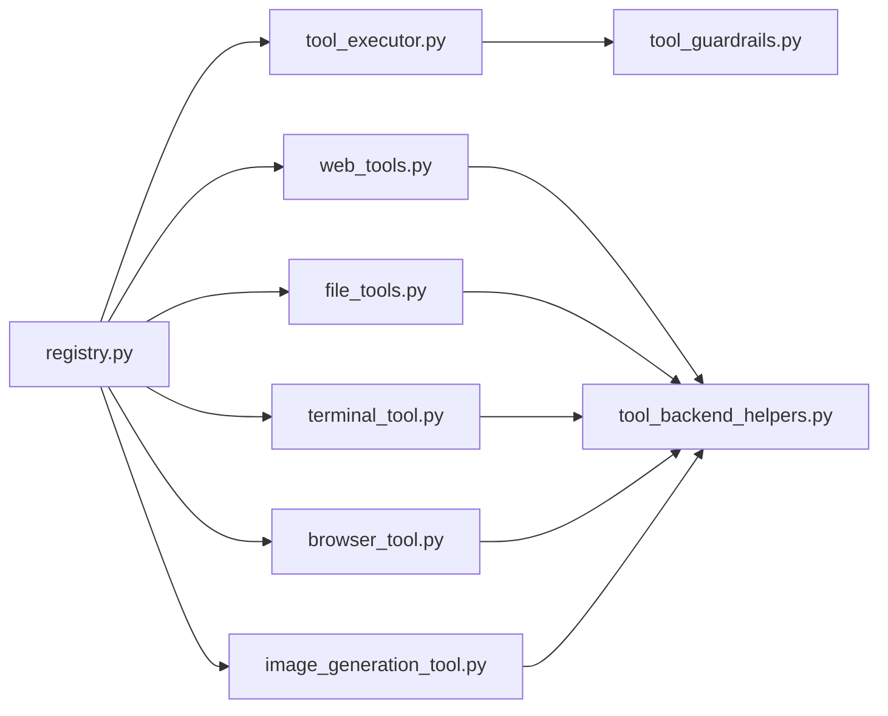

**图表来源**
- [tools/registry.py](file://tools/registry.py)
- [agent/tool_executor.py](file://agent/tool_executor.py)
- [agent/tool_guardrails.py](file://agent/tool_guardrails.py)
- [tools/tool_backend_helpers.py](file://tools/tool_backend_helpers.py)
- [tools/web_tools.py](file://tools/web_tools.py)
- [tools/file_tools.py](file://tools/file_tools.py)
- [tools/terminal_tool.py](file://tools/terminal_tool.py)
- [tools/browser_tool.py](file://tools/browser_tool.py)
- [tools/image_generation_tool.py](file://tools/image_generation_tool.py)

**章节来源**
- [tools/registry.py](file://tools/registry.py)
- [agent/tool_executor.py](file://agent/tool_executor.py)
- [agent/tool_guardrails.py](file://agent/tool_guardrails.py)
- [tools/tool_backend_helpers.py](file://tools/tool_backend_helpers.py)
- [tools/web_tools.py](file://tools/web_tools.py)
- [tools/file_tools.py](file://tools/file_tools.py)
- [tools/terminal_tool.py](file://tools/terminal_tool.py)
- [tools/browser_tool.py](file://tools/browser_tool.py)
- [tools/image_generation_tool.py](file://tools/image_generation_tool.py)

## 性能考虑
- 注册中心 TTL 缓存
  - 降低 check_fn 频繁探测带来的外部依赖抖动成本。
- 并发执行
  - 控制最大工作线程数；对未开始任务尝试取消，缩短总耗时；定期心跳防止网关超时。
- 结果处理与预算
  - 按回合强制预算控制，避免上下文膨胀；对多模态结果进行归一化与截断。
- 后端选择
  - 优先使用托管网关与更优后端；对长内容采用分块并行摘要。
- 路径解析与去重
  - 严格的基座解析与去重/历史上限，避免重复 IO 与内存占用。

[本节为通用指导，无需特定文件引用]

## 故障排查指南
- 工具不可用
  - 检查注册中心可用性检查日志与 TTL 缓存；必要时手动失效缓存。
- 并发执行卡住
  - 查看线程池状态与未开始任务取消情况；确认用户中断信号正确传播。
- 终端命令失败
  - 检查 sudo 权限与密码缓存；查看危险命令审批与工作目录合法性。
- 浏览器结果为空/小尺寸
  - 观察是否触发 Lightpanda 回退；检查 CDP 连接与会话状态。
- 图像生成失败
  - 切换直连/网关；核对模型是否在门户允许列表；检查超分辨率链路。

**章节来源**
- [tools/registry.py](file://tools/registry.py)
- [agent/tool_executor.py](file://agent/tool_executor.py)
- [tools/terminal_tool.py](file://tools/terminal_tool.py)
- [tools/browser_tool.py](file://tools/browser_tool.py)
- [tools/image_generation_tool.py](file://tools/image_generation_tool.py)

## 结论
工具系统通过“注册中心 + 执行器 + 守卫 + 后端与网关辅助”的分层设计，实现了高内聚、低耦合、强扩展与强安全的工具生态。其在可用性检查、并发执行、结果处理、错误恢复与后端选择方面均有完善的工程化实践，既适合快速集成，也便于定制扩展。

[本节为总结，无需特定文件引用]

## 附录

### 工具接口与参数规范
- 接口约定
  - 工具处理器必须返回 JSON 字符串（成功或错误），注册中心统一封装为 OpenAI 函数定义。
  - 支持异步处理器桥接与统一错误净化。
- 参数校验
  - 执行前解析与类型校验；对 JSON 解析失败与非字典型参数进行兜底。
- 动态模式覆盖
  - 支持在获取定义时应用动态模式覆盖（如委托任务描述随配置变化）。

**章节来源**
- [tools/registry.py](file://tools/registry.py)
- [agent/tool_executor.py](file://agent/tool_executor.py)

### 安全机制与沙箱隔离
- 路径与设备防护
  - 明确禁止读取无限输出/阻塞输入设备；拒绝写入系统关键路径与配置文件。
- 危险命令审批
  - 集成守卫与交互式审批流程，支持 sudo 密码缓存与回调注入。
- 会话隔离
  - 任务级工作目录与会话隔离；容器/云后端持久化文件系统与自动清理。
- 网络与代理
  - 浏览器支持 Camofox 代理与 CDP 直连；图像生成支持托管网关与凭据切换。

**章节来源**
- [tools/file_tools.py](file://tools/file_tools.py)
- [tools/terminal_tool.py](file://tools/terminal_tool.py)
- [tools/browser_tool.py](file://tools/browser_tool.py)
- [tools/image_generation_tool.py](file://tools/image_generation_tool.py)

### 自定义工具开发指南
- 注册步骤
  - 在工具模块中定义处理器函数与 OpenAI 形式的 schema；在模块顶层调用 registry.register(...) 完成注册。
  - 提供 check_fn 用于可用性检查；声明 requires_env 以便 UI 展示。
- 参数与结果
  - 严格校验参数类型与范围；返回 JSON 字符串；必要时使用工具助手（tool_error/tool_result）。
- 并发与错误
  - 如为异步处理器，设置 is_async；统一捕获异常并返回标准化错误。
- 后端与网关
  - 若涉及外部后端，遵循后端辅助模块的凭据与网关选择逻辑。

**章节来源**
- [tools/registry.py](file://tools/registry.py)
- [tools/tool_backend_helpers.py](file://tools/tool_backend_helpers.py)

### 使用示例与集成方案
- 网页搜索与提取
  - 通过 web_tools 选择后端，自动摘要超长内容，返回精炼结果。
- 文件读写与补丁
  - 使用 file_tools 的路径解析与安全防护，结合终端后端在容器/云环境中执行。
- 终端命令
  - 通过 terminal_tool 在本地/容器/云后端执行命令，支持 sudo 与危险命令审批。
- 浏览器自动化
  - 使用 browser_tool 的统一 API，在本地或云后端完成导航、快照与交互。
- 图像生成
  - 通过 image_generation_tool 选择模型与后端，自动超分辨率与路径映射。

**章节来源**
- [tools/web_tools.py](file://tools/web_tools.py)
- [tools/file_tools.py](file://tools/file_tools.py)
- [tools/terminal_tool.py](file://tools/terminal_tool.py)
- [tools/browser_tool.py](file://tools/browser_tool.py)
- [tools/image_generation_tool.py](file://tools/image_generation_tool.py)