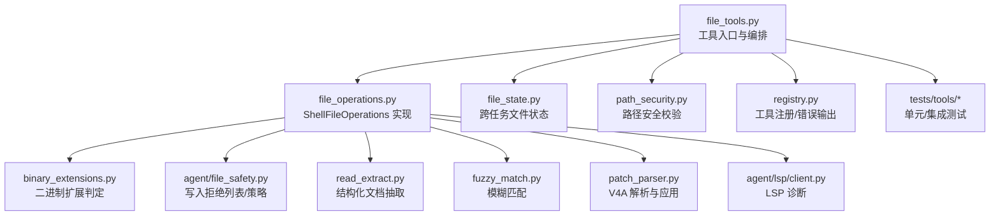
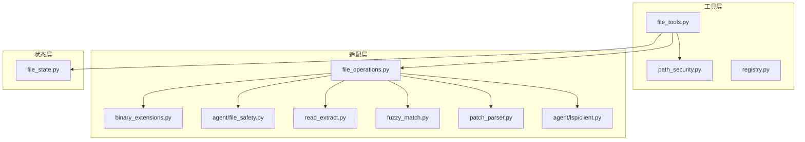
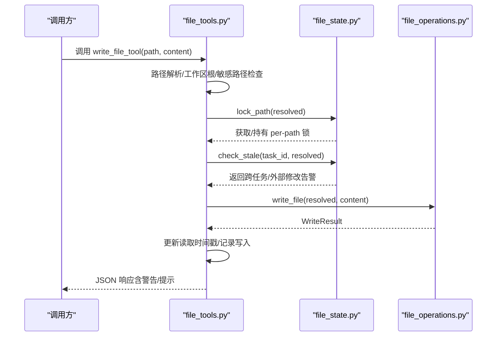
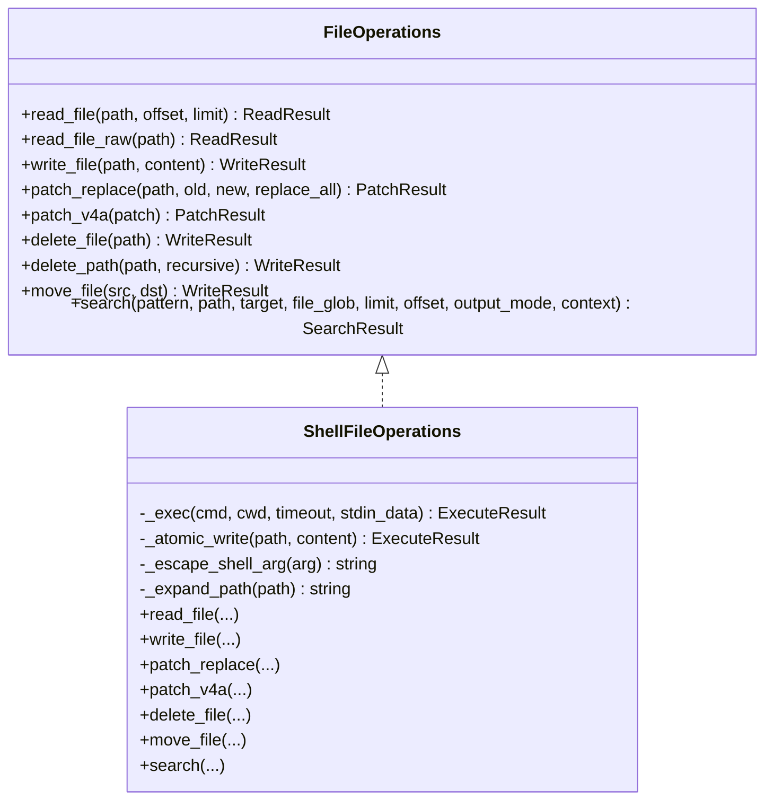
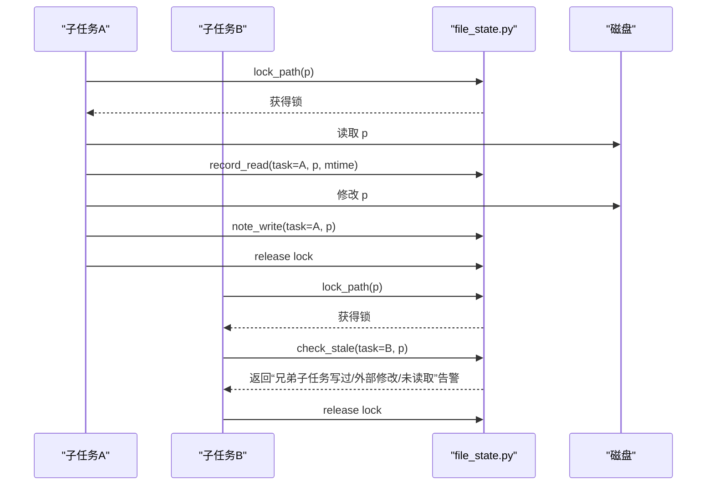
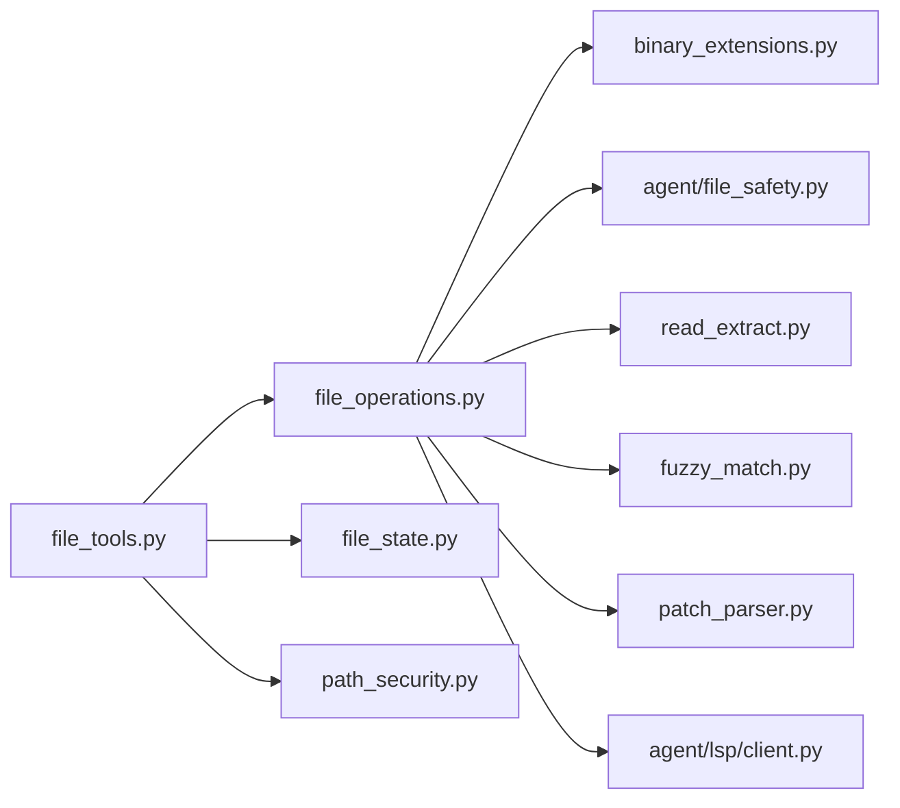

# 文件工具

<cite>
**本文引用的文件**
- [tools/file_tools.py](file://tools/file_tools.py)
- [tools/file_operations.py](file://tools/file_operations.py)
- [tools/file_state.py](file://tools/file_state.py)
- [tools/path_security.py](file://tools/path_security.py)
- [tools/registry.py](file://tools/registry.py)
- [tests/tools/test_file_tools.py](file://tests/tools/test_file_tools.py)
- [tests/tools/test_file_operations.py](file://tests/tools/test_file_operations.py)
- [tests/tools/test_file_state_registry.py](file://tests/tools/test_file_state_registry.py)
- [tests/tools/test_file_read_guards.py](file://tests/tools/test_file_read_guards.py)
- [tests/tools/test_file_tools_live.py](file://tests/tools/test_file_tools_live.py)
- [agent/file_safety.py](file://agent/file_safety.py)
- [tools/binary_extensions.py](file://tools/binary_extensions.py)
- [tools/read_extract.py](file://tools/read_extract.py)
- [tools/fuzzy_match.py](file://tools/fuzzy_match.py)
- [tools/patch_parser.py](file://tools/patch_parser.py)
- [agent/lsp/client.py](file://agent/lsp/client.py)
</cite>

## 目录
1. [简介](#简介)
2. [项目结构](#项目结构)
3. [核心组件](#核心组件)
4. [架构总览](#架构总览)
5. [详细组件分析](#详细组件分析)
6. [依赖关系分析](#依赖关系分析)
7. [性能考量](#性能考量)
8. [故障排查指南](#故障排查指南)
9. [结论](#结论)
10. [附录：扩展与最佳实践](#附录扩展与最佳实践)

## 简介
本文件工具是面向多终端后端（本地、Docker、SSH、Singularity、Modal、Daytona）统一抽象的文件操作能力集合，提供读取、写入、补丁替换、V4A 多文件补丁、删除、移动、搜索等能力，并内置路径安全校验、权限控制、并发与文件状态管理、错误处理与异常恢复、以及针对大文件与二进制文件的安全策略。本文档从系统架构、数据流、处理逻辑、并发与锁机制、错误处理与恢复、性能优化与最佳实践等维度进行深入解析。

## 项目结构
围绕文件工具的关键模块与测试如下：
- 工具层入口与业务编排：tools/file_tools.py
- 终端后端适配与具体实现：tools/file_operations.py
- 跨进程/跨子任务文件状态协调：tools/file_state.py
- 路径安全与目录遍历校验：tools/path_security.py
- 工具注册与错误输出：tools/registry.py
- 安全与敏感路径策略：agent/file_safety.py
- 二进制类型判定：tools/binary_extensions.py
- 结构化文档抽取：tools/read_extract.py
- 模糊匹配与补丁应用：tools/fuzzy_match.py、tools/patch_parser.py
- LSP 客户端与诊断：agent/lsp/client.py
- 单元测试与集成测试：tests/tools 下的多个测试文件

图示来源
- [tools/file_tools.py](file://tools/file_tools.py)
- [tools/file_operations.py](file://tools/file_operations.py)
- [tools/file_state.py](file://tools/file_state.py)
- [tools/path_security.py](file://tools/path_security.py)
- [tools/registry.py](file://tools/registry.py)
- [agent/file_safety.py](file://agent/file_safety.py)
- [tools/binary_extensions.py](file://tools/binary_extensions.py)
- [tools/read_extract.py](file://tools/read_extract.py)
- [tools/fuzzy_match.py](file://tools/fuzzy_match.py)
- [tools/patch_parser.py](file://tools/patch_parser.py)
- [agent/lsp/client.py](file://agent/lsp/client.py)
- [tests/tools/test_file_tools.py](file://tests/tools/test_file_tools.py)

章节来源
- [tools/file_tools.py](file://tools/file_tools.py)
- [tools/file_operations.py](file://tools/file_operations.py)
- [tools/file_state.py](file://tools/file_state.py)
- [tools/path_security.py](file://tools/path_security.py)
- [tools/registry.py](file://tools/registry.py)
- [agent/file_safety.py](file://agent/file_safety.py)
- [tools/binary_extensions.py](file://tools/binary_extensions.py)
- [tools/read_extract.py](file://tools/read_extract.py)
- [tools/fuzzy_match.py](file://tools/fuzzy_match.py)
- [tools/patch_parser.py](file://tools/patch_parser.py)
- [agent/lsp/client.py](file://agent/lsp/client.py)
- [tests/tools/test_file_tools.py](file://tests/tools/test_file_tools.py)

## 核心组件
- 工具入口与编排（file_tools）
  - 提供 read_file_tool、write_file_tool、patch_tool、search_tool 等工具函数，负责参数归一化、路径解析、工作区根目录选择、设备路径与二进制文件保护、重复读取去重、字符数上限、敏感内容脱敏、跨代理文件状态检查、并发锁、写后时间戳更新、错误包装等。
  - 关键点：路径解析顺序、工作树/会话 CWD 管理、设备路径阻断、二进制文件阻断、结构化文档抽取、重复读取去重与连续读循环防护、跨代理写冲突检测、跨配置文件写入保护。
- 终端后端适配（file_operations）
  - 抽象接口 FileOperations 与 ShellFileOperations 实现，屏蔽不同后端差异，统一通过终端环境 execute 接口执行命令。
  - 支持读取（含分页、行号、BOM/行尾处理）、写入（原子写、目录创建、Lint/LSP 钩子）、补丁（替换模式与 V4A）、删除、移动、搜索（基于 ripgrep）。
  - 关键点：路径展开与转义、原子写（同分区 rename 原子性）、行尾与 BOM 保持、预写内容采样用于差分 Lint/LSP、跨平台删除实现。
- 文件状态协调（file_state）
  - 进程级单例，记录每个任务对文件的读取时间戳与 mtime，跟踪最后写者，提供 per-path 锁，支持跨子任务写冲突检测与“外部修改”告警。
  - 关键点：per-path Lock、读写账本、最后写者映射、溢出淘汰策略、禁用开关。
- 路径安全（path_security）
  - 提供路径是否在允许根目录内校验、是否存在 .. 遍历组件快速检查。
- 工具注册与错误输出（registry）
  - 统一工具注册表与错误返回格式，便于上层调度器与前端展示。

章节来源
- [tools/file_tools.py](file://tools/file_tools.py)
- [tools/file_operations.py](file://tools/file_operations.py)
- [tools/file_state.py](file://tools/file_state.py)
- [tools/path_security.py](file://tools/path_security.py)
- [tools/registry.py](file://tools/registry.py)

## 架构总览
文件工具采用“工具层 + 后端适配层 + 状态协调层”的三层架构：
- 工具层：负责业务编排、安全策略、并发控制、状态更新与错误包装。
- 后端适配层：屏蔽不同终端后端差异，统一以 shell 命令形式执行文件操作。
- 状态协调层：跨任务/子任务文件一致性保障，避免竞态与覆盖。

图示来源
- [tools/file_tools.py](file://tools/file_tools.py)
- [tools/file_operations.py](file://tools/file_operations.py)
- [tools/file_state.py](file://tools/file_state.py)
- [tools/path_security.py](file://tools/path_security.py)
- [tools/registry.py](file://tools/registry.py)
- [agent/file_safety.py](file://agent/file_safety.py)
- [tools/binary_extensions.py](file://tools/binary_extensions.py)
- [tools/read_extract.py](file://tools/read_extract.py)
- [tools/fuzzy_match.py](file://tools/fuzzy_match.py)
- [tools/patch_parser.py](file://tools/patch_parser.py)
- [agent/lsp/client.py](file://agent/lsp/client.py)

## 详细组件分析

### 组件A：工具层（file_tools）
- 路径解析与工作区根
  - 优先使用“实时终端 CWD”（会话运行时），其次使用“任务注册的 CWD 覆盖”，再次使用“绝对且非哨兵的 $TERMINAL_CWD”，最后回退到进程 CWD；防止工作树/CWD 分歧导致的相对路径误解析。
- 设备路径与二进制保护
  - 对 /dev/*、/proc/*、stdin/stdout/stderr、fd alias 等阻断读取；对二进制扩展与内容采样进行阻断；对可提取文档（如 .docx/.xlsx）先抽取文本再按需分页。
- 读取去重与连续循环防护
  - 基于 (path, offset, limit) 的 mtime 缓存，若文件未变化则返回“未变更”提示或直接 stub；超过阈值后硬性阻止，避免模型陷入循环。
- 字符数与大文件提示
  - 读取内容长度超过阈值（可配置）时拒绝并建议分页；对超大文件给出 offset 建议。
- 敏感路径与跨配置文件保护
  - 写入前检查敏感路径（/etc、/boot、/usr/lib/systemd、/var/run/docker.sock 等）与当前 Hermes 配置文件路径，拒绝直接修改。
- 并发与文件状态
  - 使用 file_state.lock_path 对同一路径序列化 read→modify→write；写后更新 mtime 与“已读时间戳”，并记录最后写者，跨任务检测“兄弟子任务”写冲突与“外部修改”。
- 错误处理与脱敏
  - 统一封装为 JSON，敏感信息脱敏；区分预期写入异常（权限/只读）与非预期异常。

图示来源
- [tools/file_tools.py](file://tools/file_tools.py)
- [tools/file_state.py](file://tools/file_state.py)
- [tools/file_operations.py](file://tools/file_operations.py)

章节来源
- [tools/file_tools.py](file://tools/file_tools.py)
- [tools/file_state.py](file://tools/file_state.py)
- [tests/tools/test_file_tools.py](file://tests/tools/test_file_tools.py)
- [tests/tools/test_file_read_guards.py](file://tests/tools/test_file_read_guards.py)

### 组件B：后端适配层（file_operations）
- 抽象接口与实现
  - FileOperations 抽象定义 read_file/read_file_raw/write_file/patch_replace/patch_v4a/delete_file/delete_path/move_file/search。
  - ShellFileOperations 通过终端环境 execute 执行 shell 命令，支持任意后端（本地、容器、云沙箱等）。
- 读取实现
  - 支持分页与行号；探测 BOM 与行尾；对图片/二进制进行阻断；提供相似文件建议。
- 写入实现
  - 原子写：同分区临时文件 + rename，避免半写；保留原文件权限；目录自动创建；预读取用于差分 Lint/LSP；写后统计字节数。
- 补丁实现
  - 替换模式：模糊匹配定位并替换，支持一次性替换全部；V4A 模式：解析并应用多文件补丁。
- 删除与移动
  - 跨平台删除（Windows/PowerShell 场景）通过 Python 片段实现；移动通过 mv。
- 搜索
  - 基于 ripgrep，支持内容/文件名搜索、偏移与限制、上下文行、结果密度化输出。

图示来源
- [tools/file_operations.py](file://tools/file_operations.py)

章节来源
- [tools/file_operations.py](file://tools/file_operations.py)
- [tests/tools/test_file_operations.py](file://tests/tools/test_file_operations.py)

### 组件C：文件状态协调（file_state）
- 功能要点
  - per-path Lock 序列化同一路径上的 read→modify→write，避免并发写覆盖。
  - 记录每个任务对该路径的读取时间戳与 mtime，维护“最后写者”全局映射。
  - 提供 check_stale 判定三类过期风险：兄弟子任务写过、外部修改、从未读取。
  - 支持 writes_since 查询某时刻后其他任务对指定路径的写入情况。
- 性能与容量
  - 限制每任务与全局条目数量，按插入顺序淘汰最旧项，避免长期会话内存膨胀。

图示来源
- [tools/file_state.py](file://tools/file_state.py)
- [tests/tools/test_file_state_registry.py](file://tests/tools/test_file_state_registry.py)

章节来源
- [tools/file_state.py](file://tools/file_state.py)
- [tests/tools/test_file_state_registry.py](file://tests/tools/test_file_state_registry.py)

### 组件D：路径安全与权限控制
- 路径安全
  - validate_within_dir：确保解析后路径位于允许根目录内；has_traversal_component：快速检测 .. 遍历。
- 权限与敏感路径
  - 写入拒绝列表来自 agent/file_safety，覆盖系统路径、凭证目录、特定 socket 等；同时禁止直接修改 Hermes 配置文件。
- 文档与二进制
  - 对二进制与图像文件阻断文本读取；对可提取文档（如 Office/Notebook）先抽取文本再分页。

章节来源
- [tools/path_security.py](file://tools/path_security.py)
- [agent/file_safety.py](file://agent/file_safety.py)
- [tools/binary_extensions.py](file://tools/binary_extensions.py)
- [tools/read_extract.py](file://tools/read_extract.py)
- [tools/file_tools.py](file://tools/file_tools.py)

### 组件E：并发处理与锁机制
- per-path 锁
  - file_state.lock_path 为每个已解析路径维护独立锁，不同路径可并行，同一路径串行，避免竞态。
- 任务级缓存与去重
  - file_tools 中的 _read_tracker 对同一任务内的 (path, offset, limit) 进行 mtime 缓存与连续读循环防护。
- 死锁规避
  - 多文件 V4A 补丁场景中，对所有涉及路径按排序获取锁，保证锁顺序一致，避免死锁。

章节来源
- [tools/file_state.py](file://tools/file_state.py)
- [tools/file_tools.py](file://tools/file_tools.py)
- [tests/tools/test_file_tools.py](file://tests/tools/test_file_tools.py)

### 组件F：错误处理与异常恢复
- 工具层统一错误包装
  - 通过 registry.tool_error 输出 JSON 错误，包含错误类型、消息与上下文。
- 预期写入异常
  - 对 EACCES/EPERM/EROFS 等预期异常不计入错误日志，仅记录调试日志。
- 异常恢复
  - 读取失败时提供相似文件建议；补丁失败时提供“未找到旧字符串”的提示与重试建议；写后验证失败时明确提示持久化失败。
- Lint/LSP 钩子
  - 写后进行语法检查与语义诊断，仅报告本次写入引入的新问题，过滤历史遗留问题。

章节来源
- [tools/file_tools.py](file://tools/file_tools.py)
- [tools/file_operations.py](file://tools/file_operations.py)
- [tools/registry.py](file://tools/registry.py)

## 依赖关系分析
- 工具层依赖
  - file_tools 依赖 file_operations（后端适配）、file_state（并发与状态）、path_security（路径安全）、agent/file_safety（敏感路径）、tools/binary_extensions（二进制判定）、tools/read_extract（文档抽取）、tools/fuzzy_match/patch_parser（补丁）、agent/lsp/client（语义诊断）。
- 测试覆盖
  - 单元测试覆盖读取分页归一化、二进制阻断、结构化文档抽取、写入行为、大内容处理、去重与循环防护、跨任务状态检测、路径安全校验等。

图示来源
- [tools/file_tools.py](file://tools/file_tools.py)
- [tools/file_operations.py](file://tools/file_operations.py)
- [tools/file_state.py](file://tools/file_state.py)
- [tools/path_security.py](file://tools/path_security.py)
- [agent/file_safety.py](file://agent/file_safety.py)
- [tools/binary_extensions.py](file://tools/binary_extensions.py)
- [tools/read_extract.py](file://tools/read_extract.py)
- [tools/fuzzy_match.py](file://tools/fuzzy_match.py)
- [tools/patch_parser.py](file://tools/patch_parser.py)
- [agent/lsp/client.py](file://agent/lsp/client.py)

章节来源
- [tools/file_tools.py](file://tools/file_tools.py)
- [tools/file_operations.py](file://tools/file_operations.py)
- [tests/tools/test_file_tools.py](file://tests/tools/test_file_tools.py)
- [tests/tools/test_file_operations.py](file://tests/tools/test_file_operations.py)

## 性能考量
- 读取性能
  - 分页与行号输出采用 sed + wc，避免一次性加载大文件；对未变更文件使用 mtime 缓存去重，显著减少上下文占用。
  - 对超大文件与高字符数读取设置上限，避免模型上下文爆炸。
- 写入性能
  - 原子写通过同分区临时文件 + rename，避免跨设备复制与半写风险；目录创建与权限保留尽量最小化额外命令。
  - 预读取仅在需要 Lint/LSP 的扩展上启用，减少不必要的 IO。
- 搜索性能
  - 基于 ripgrep，支持偏移/限制与上下文行，结果密度化输出降低冗余。
- 并发与锁
  - per-path 锁避免全局互斥，提升吞吐；任务级去重与连续循环防护减少无效请求。

## 故障排查指南
- 读取被拒
  - 检查是否命中设备路径阻断（/dev/*、/proc/*、stdin/stdout/stderr）或二进制阻断；确认路径是否为可提取文档类型。
- 写入失败
  - 检查是否命中敏感路径/凭证路径/系统路径；确认后端是否支持所需命令；查看 Lint/LSP 是否报告新问题。
- 补丁失败
  - 若提示“未找到旧字符串”，请重新读取文件或增加上下文；对于 V4A，请检查文件头路径是否包含 .. 遍历。
- 并发冲突
  - 若出现“兄弟子任务写过/外部修改/未读取”告警，先重新读取文件，再进行编辑。
- 大文件与二进制
  - 大文件建议使用 offset/limit 分段读取；二进制文件请改用视觉分析工具或终端查看。

章节来源
- [tests/tools/test_file_tools.py](file://tests/tools/test_file_tools.py)
- [tests/tools/test_file_tools_live.py](file://tests/tools/test_file_tools_live.py)
- [tests/tools/test_file_read_guards.py](file://tests/tools/test_file_read_guards.py)
- [tools/file_tools.py](file://tools/file_tools.py)
- [tools/file_operations.py](file://tools/file_operations.py)

## 结论
该文件工具体系通过清晰的分层设计与严格的边界控制，在多终端后端上提供了统一、安全、高性能的文件操作能力。其在路径安全、权限控制、并发与状态管理、错误处理与恢复、以及大文件与二进制文件处理方面均具备完善的机制与测试覆盖，适合在复杂会话与多子任务场景下稳定运行。

## 附录：扩展与最佳实践
- 扩展开发建议
  - 新增后端：实现 FileOperations 抽象并在 file_tools 中通过 _get_file_ops 选择对应实现。
  - 新增工具：在 tools/registry.py 注册工具 Schema，遵循统一错误输出格式。
  - 新增 Lint/LSP：在 file_operations 中扩展 LINTERS/LINTERS_INPROC 或 LSP 钩子。
- 最佳实践
  - 读取：优先使用分页 offset/limit；对大文件与高字符数读取设置合理上限。
  - 写入：使用 patch 进行局部替换；必要时使用 write_file 完整覆盖；注意行尾与 BOM 保持。
  - 并发：避免在同一路径上并发写入；多文件补丁按路径排序加锁。
  - 安全：严格遵守敏感路径与凭证路径白/黑名单；对二进制与图像文件采用专用工具链。
  - 可观测性：关注 Lint/LSP 输出，结合工具层提示与告警进行迭代修复。