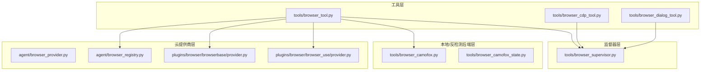
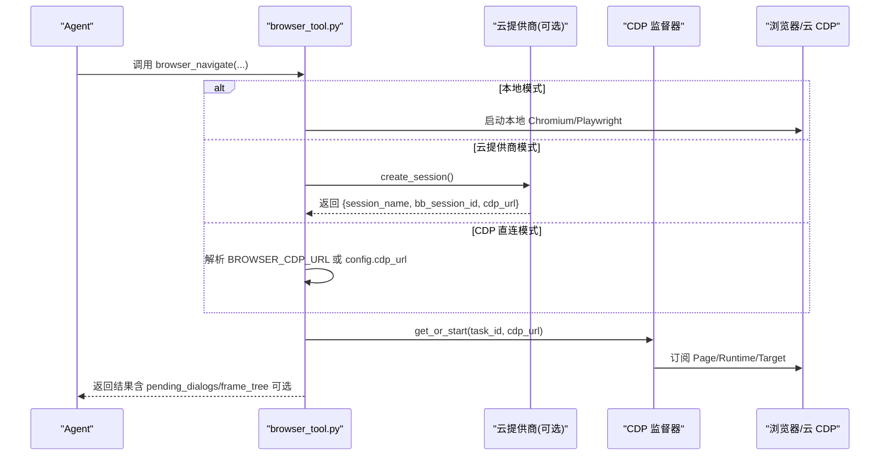
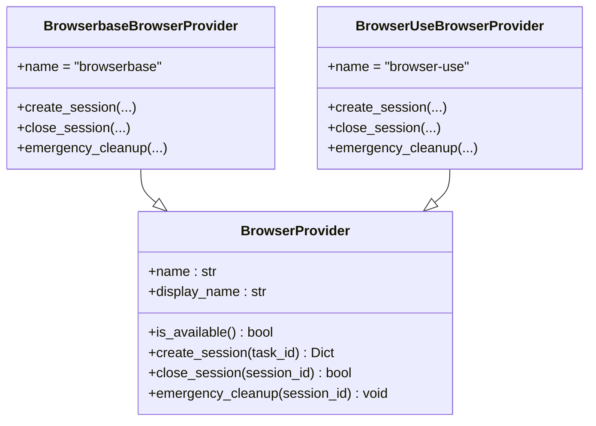
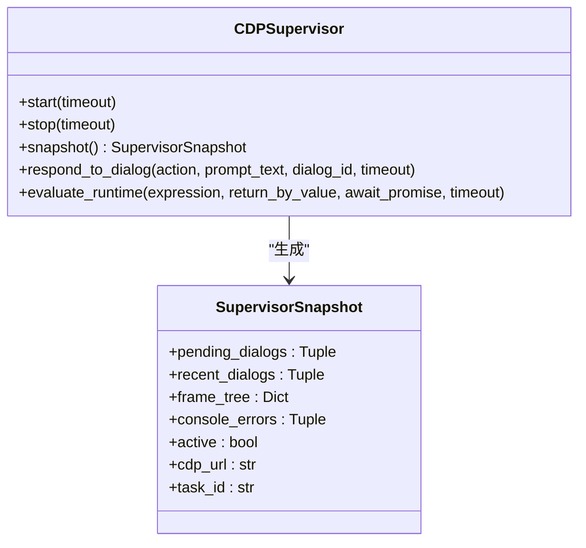
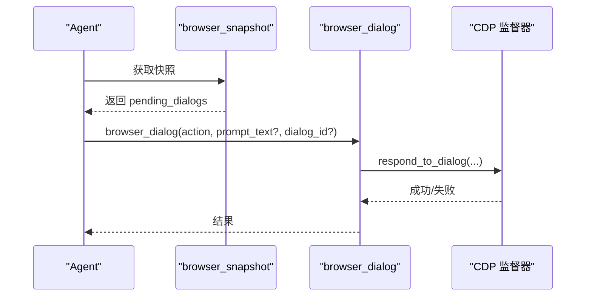
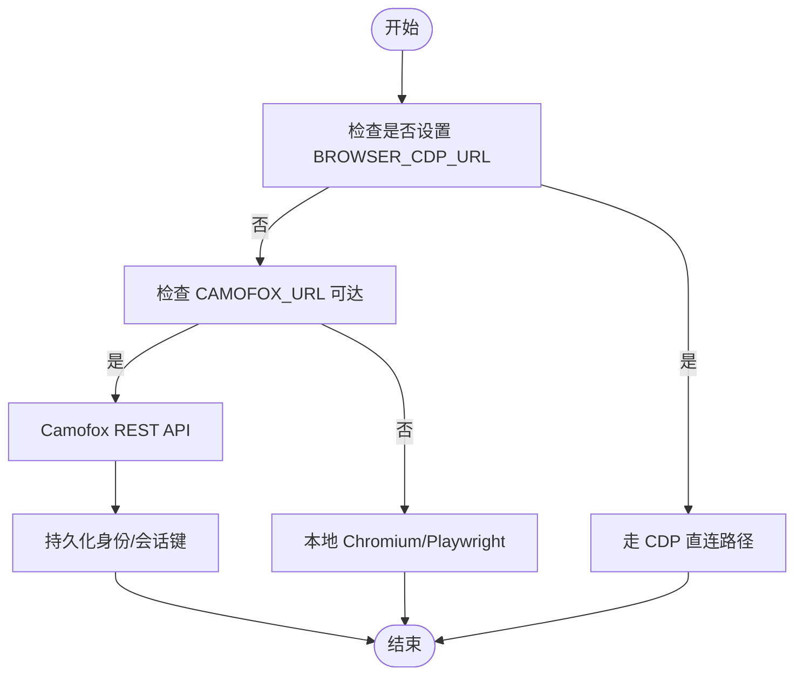
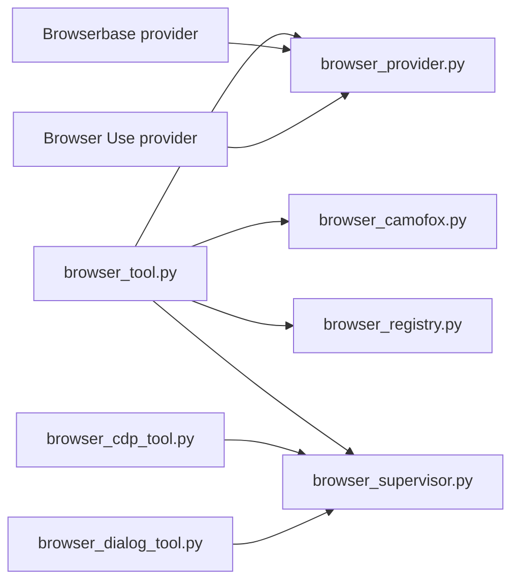

# 浏览器工具

<cite>
**本文档引用的文件**
- [browser_provider.py](file://agent/browser_provider.py)
- [browser_registry.py](file://agent/browser_registry.py)
- [browser_tool.py](file://tools/browser_tool.py)
- [browser_supervisor.py](file://tools/browser_supervisor.py)
- [browser_cdp_tool.py](file://tools/browser_cdp_tool.py)
- [browser_camofox.py](file://tools/browser_camofox.py)
- [browser_camofox_state.py](file://tools/browser_camofox_state.py)
- [provider.py（Browserbase）](file://plugins/browser/browserbase/provider.py)
- [provider.py（Browser Use）](file://plugins/browser/browser_use/provider.py)
- [browser_dialog_tool.py](file://tools/browser_dialog_tool.py)
</cite>

## 目录
1. [简介](#简介)
2. [项目结构](#项目结构)
3. [核心组件](#核心组件)
4. [架构总览](#架构总览)
5. [详细组件分析](#详细组件分析)
6. [依赖分析](#依赖分析)
7. [性能考虑](#性能考虑)
8. [故障排除指南](#故障排除指南)
9. [结论](#结论)
10. [附录](#附录)

## 简介
本文件系统化梳理浏览器自动化工具的设计与实现，覆盖以下主题：
- CDP 协议使用与 Chrome DevTools 集成
- 浏览器监督器（CDP Supervisor）工作机制与进程管理策略
- 无头/有头浏览器切换机制
- 浏览器状态管理与会话保持
- 安全防护与沙箱隔离
- 自动化最佳实践与性能优化
- 复杂网页交互与动态内容加载处理
- 故障排除与调试

## 项目结构
浏览器工具由“工具层”“云提供商层”“监督器层”“本地/反检测后端层”四部分构成：
- 工具层：统一的浏览器工具接口（如 browser_navigate、browser_snapshot、browser_click），支持本地与云提供商两种后端
- 云提供商层：抽象与注册表，按配置选择 Browserbase/Browser Use/Firecrawl 等后端
- 监督器层：基于 CDP 的持久连接，负责对话框检测、帧树维护、运行时表达式求值等
- 本地/反检测后端层：本地 Chromium（agent-browser）、Camofox（反检测 Firefox Fork）

图示来源
- [browser_tool.py](file://tools/browser_tool.py)
- [browser_supervisor.py](file://tools/browser_supervisor.py)
- [browser_cdp_tool.py](file://tools/browser_cdp_tool.py)
- [browser_camofox.py](file://tools/browser_camofox.py)
- [browser_provider.py](file://agent/browser_provider.py)
- [browser_registry.py](file://agent/browser_registry.py)
- [provider.py（Browserbase）](file://plugins/browser/browserbase/provider.py)
- [provider.py（Browser Use）](file://plugins/browser/browser_use/provider.py)

章节来源
- [browser_tool.py](file://tools/browser_tool.py)
- [browser_supervisor.py](file://tools/browser_supervisor.py)
- [browser_cdp_tool.py](file://tools/browser_cdp_tool.py)
- [browser_camofox.py](file://tools/browser_camofox.py)
- [browser_provider.py](file://agent/browser_provider.py)
- [browser_registry.py](file://agent/browser_registry.py)
- [provider.py（Browserbase）](file://plugins/browser/browserbase/provider.py)
- [provider.py（Browser Use）](file://plugins/browser/browser_use/provider.py)

## 核心组件
- 云浏览器提供商抽象与注册表
  - 抽象类定义生命周期方法（创建/关闭/紧急清理），并保留向后兼容别名
  - 注册表负责按优先级解析活动提供商（显式配置优先，其次历史偏好）
- 浏览器工具主入口
  - 统一 API（导航、快照、点击、滚动、键盘输入、记录等）
  - 支持本地（Chromium/Playwright）、Camofox（反检测）、云提供商（Browserbase/Browser Use）
  - CDP 端点覆盖：/browser connect、config.yaml、云提供商返回的 CDP URL
- CDP 监督器
  - 每任务一个 supervisor，持久 WebSocket 订阅 Page/Runtime/Target 事件
  - 自动注入对话框桥接脚本，拦截 alert/confirm/prompt 并通过 Fetch 拦截
  - 提供线程安全快照、对话框响应、运行时表达式求值
- CDP 工具与对话框工具
  - browser_cdp：原生 CDP 调用的“逃生舱”，支持目标级 attach 与帧级路由
  - browser_dialog：仅响应型工具，配合监督器使用
- Camofox 后端
  - 通过 REST API 实现与工具层一致的浏览器能力
  - 支持持久化身份、容器内回环地址改写、VNC 可视化等

章节来源
- [browser_provider.py](file://agent/browser_provider.py)
- [browser_registry.py](file://agent/browser_registry.py)
- [browser_tool.py](file://tools/browser_tool.py)
- [browser_supervisor.py](file://tools/browser_supervisor.py)
- [browser_cdp_tool.py](file://tools/browser_cdp_tool.py)
- [browser_dialog_tool.py](file://tools/browser_dialog_tool.py)
- [browser_camofox.py](file://tools/browser_camofox.py)
- [browser_camofox_state.py](file://tools/browser_camofox_state.py)

## 架构总览
浏览器工具的执行路径分为“本地模式”“云提供商模式”“CDP 直连模式”。监督器在本地或云提供商场景下均可启用，用于增强对话框与帧树感知。

图示来源
- [browser_tool.py](file://tools/browser_tool.py)
- [browser_supervisor.py](file://tools/browser_supervisor.py)
- [provider.py（Browserbase）](file://plugins/browser/browserbase/provider.py)
- [provider.py（Browser Use）](file://plugins/browser/browser_use/provider.py)

## 详细组件分析

### 云提供商抽象与注册表
- 抽象类职责
  - 规范化名称、展示名、可用性检查、会话生命周期
  - 保留向后兼容方法名，确保旧调用方不中断
- 注册表解析策略
  - 显式配置优先（local 关闭云）
  - 历史偏好顺序（Browser Use → Browserbase），仅过滤可用性
  - 未匹配则回落到本地模式

图示来源
- [browser_provider.py](file://agent/browser_provider.py)
- [provider.py（Browserbase）](file://plugins/browser/browserbase/provider.py)
- [provider.py（Browser Use）](file://plugins/browser/browser_use/provider.py)

章节来源
- [browser_provider.py](file://agent/browser_provider.py)
- [browser_registry.py](file://agent/browser_registry.py)
- [provider.py（Browserbase）](file://plugins/browser/browserbase/provider.py)
- [provider.py（Browser Use）](file://plugins/browser/browser_use/provider.py)

### 浏览器工具主入口（browser_tool.py）
- 功能要点
  - 统一 API：导航、快照、点击、输入、滚动、后退、键盘、记录、截图、控制台、错误
  - 后端选择：本地（Chromium/Playwright）、Camofox、云提供商
  - CDP 端点解析：环境变量优先于配置文件，云提供商返回的 CDP URL 其次
  - 引擎选择：Chrome/Lightpanda，默认 Chrome；Lightpanda 不支持截图时自动回退 Chrome
  - 超时与摘要：命令超时、快照长度阈值、摘要模型
  - 安全与合规：URL 安全检查、SSRF 防护（本地后端豁免）
- 关键流程
  - provider 解析：显式配置 → 历史偏好 → 本地
  - CDP 监督器挂载：_ensure_cdp_supervisor
  - 本地/云差异：_is_local_mode/_is_local_backend/_get_browser_engine

章节来源
- [browser_tool.py](file://tools/browser_tool.py)

### CDP 监督器（browser_supervisor.py）
- 设计目标
  - 每任务一个 supervisor，持久 WebSocket，订阅 Page/Runtime/Target
  - 自动注入对话框桥接脚本，拦截 alert/confirm/prompt，通过 Fetch 拦截实现响应
  - 维护帧树（frame_tree），记录最近对话框（recent_dialogs），收集控制台事件
- 关键能力
  - 线程安全快照：冻结数据结构，供工具同步读取
  - 对话框策略：must_respond/auto_dismiss/auto_accept，带超时保护
  - 运行时表达式求值：重试 returnByValue 失败，降级为描述字符串
  - 断线重连：指数退避，断开后重建订阅
- 数据模型
  - PendingDialog/DialogRecord/FrameInfo/ConsoleEvent/SupervisorSnapshot

图示来源
- [browser_supervisor.py](file://tools/browser_supervisor.py)

章节来源
- [browser_supervisor.py](file://tools/browser_supervisor.py)

### CDP 工具与对话框工具
- browser_cdp
  - 原生 CDP 调用“逃生舱”，支持目标 attach 与帧级路由
  - 仅在可达 CDP 端点时可用（/browser connect 或 config.cdp_url）
  - 云提供商当前不暴露 CDP 给该工具（计划中）
- browser_dialog
  - 仅响应型工具，从监督器快照中读取 pending_dialogs
  - 支持多对话框时通过 dialog_id 消歧

图示来源
- [browser_dialog_tool.py](file://tools/browser_dialog_tool.py)
- [browser_supervisor.py](file://tools/browser_supervisor.py)

章节来源
- [browser_cdp_tool.py](file://tools/browser_cdp_tool.py)
- [browser_dialog_tool.py](file://tools/browser_dialog_tool.py)

### Camofox 后端（反检测本地浏览器）
- 特性
  - 通过 REST API 提供与工具层一致的能力
  - 支持持久化身份（profile-scoped）、容器内回环地址改写、可选 VNC 可视化
  - 当设置 BROWSER_CDP_URL 时，优先 CDP 直连而非 Camofox
- 会话管理
  - 按任务维护用户 ID 与标签页 ID
  - 可软清理（保留服务器端上下文）或硬关闭

图示来源
- [browser_camofox.py](file://tools/browser_camofox.py)
- [browser_camofox_state.py](file://tools/browser_camofox_state.py)

章节来源
- [browser_camofox.py](file://tools/browser_camofox.py)
- [browser_camofox_state.py](file://tools/browser_camofox_state.py)

## 依赖分析
- 组件耦合
  - browser_tool 依赖注册表与云提供商，同时可直接对接 CDP 或 Camofox
  - browser_supervisor 与 browser_tool 通过任务 ID 绑定，彼此解耦
  - browser_cdp_tool 与 browser_dialog_tool 依赖监督器存在性
- 外部依赖
  - requests（云提供商 API）
  - websockets（CDP 连接）
  - hermes_cli.config（配置读取）
  - agent.async_utils（线程安全调度）

图示来源
- [browser_tool.py](file://tools/browser_tool.py)
- [browser_supervisor.py](file://tools/browser_supervisor.py)
- [browser_cdp_tool.py](file://tools/browser_cdp_tool.py)
- [browser_dialog_tool.py](file://tools/browser_dialog_tool.py)
- [browser_provider.py](file://agent/browser_provider.py)
- [browser_registry.py](file://agent/browser_registry.py)
- [provider.py（Browserbase）](file://plugins/browser/browserbase/provider.py)
- [provider.py（Browser Use）](file://plugins/browser/browser_use/provider.py)

章节来源
- [browser_tool.py](file://tools/browser_tool.py)
- [browser_supervisor.py](file://tools/browser_supervisor.py)
- [browser_cdp_tool.py](file://tools/browser_cdp_tool.py)
- [browser_dialog_tool.py](file://tools/browser_dialog_tool.py)
- [browser_provider.py](file://agent/browser_provider.py)
- [browser_registry.py](file://agent/browser_registry.py)
- [provider.py（Browserbase）](file://plugins/browser/browserbase/provider.py)
- [provider.py（Browser Use）](file://plugins/browser/browser_use/provider.py)

## 性能考虑
- 引擎选择
  - Lightpanda 更快但无图形渲染；当返回空快照或极小截图时自动回退 Chrome
- 超时与节流
  - 命令超时可配置；截图清理节流避免重复扫描
- 快照与摘要
  - 超长快照自动摘要，减少传输与处理成本
- 会话复用
  - 云提供商会话复用；监督器持久连接减少握手开销
- 回环地址改写
  - Docker 场景下改写 127.0.0.1 为 host.docker.internal，避免容器内回环失效

章节来源
- [browser_tool.py](file://tools/browser_tool.py)
- [browser_camofox.py](file://tools/browser_camofox.py)

## 故障排除指南
- 无法连接 CDP
  - 检查 /browser connect 是否成功、BROWSER_CDP_URL 是否正确、config.cdp_url 是否设置
  - 云提供商需等待会话建立后再挂载监督器
- 对话框导致卡死
  - 使用 browser_snapshot 查看 pending_dialogs，调用 browser_dialog 响应
  - 若策略为 must_respond，需在超时前响应
- 跨域 iframe 评估失败
  - 使用 browser_cdp 并传入 frame_id，通过监督器的 live 会话路由
- Camofox 不可用
  - 确认 CAMOFOX_URL 可达，必要时开启回环地址改写
- 本地后端 SSRF 防护
  - 本地后端不进行 SSRF 检查，注意不要让 agent 访问内部资源
- 云提供商错误
  - Browserbase/Browser Use 402/4xx 错误时检查凭据与功能开关

章节来源
- [browser_cdp_tool.py](file://tools/browser_cdp_tool.py)
- [browser_dialog_tool.py](file://tools/browser_dialog_tool.py)
- [browser_supervisor.py](file://tools/browser_supervisor.py)
- [browser_camofox.py](file://tools/browser_camofox.py)
- [provider.py（Browserbase）](file://plugins/browser/browserbase/provider.py)
- [provider.py（Browser Use）](file://plugins/browser/browser_use/provider.py)

## 结论
本浏览器工具通过统一抽象与模块化设计，实现了对本地、云提供商与反检测后端的无缝衔接。CDP 监督器提供了强大的对话框与帧树感知能力，结合浏览器工具的统一接口，能够稳定地处理复杂网页交互与动态内容加载。通过合理的引擎选择、超时与摘要策略以及会话复用，系统在易用性与性能之间取得良好平衡。建议在生产环境中优先使用 CDP 直连或云提供商模式，并根据业务需求配置对话框策略与会话参数。

## 附录
- 最佳实践
  - 明确后端选择：本地用于无头自动化，云提供商用于反检测与代理需求
  - 合理配置对话框策略：must_respond 保障稳定性，auto_dismiss/auto_accept 用于特定场景
  - 使用 browser_cdp 处理特殊 CDP 场景，避免重复造轮子
  - 对长快照启用摘要，减少传输与处理成本
  - Docker 场景下启用 Camofox 回环地址改写
- 安全与隔离
  - 本地后端不进行 SSRF 检查，注意权限与网络访问范围
  - 云提供商会话具备隔离与配额控制，避免滥用
  - Camofox 通过 REST API 与反指纹浏览器降低被识别风险