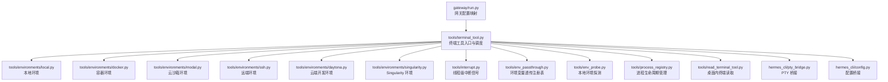
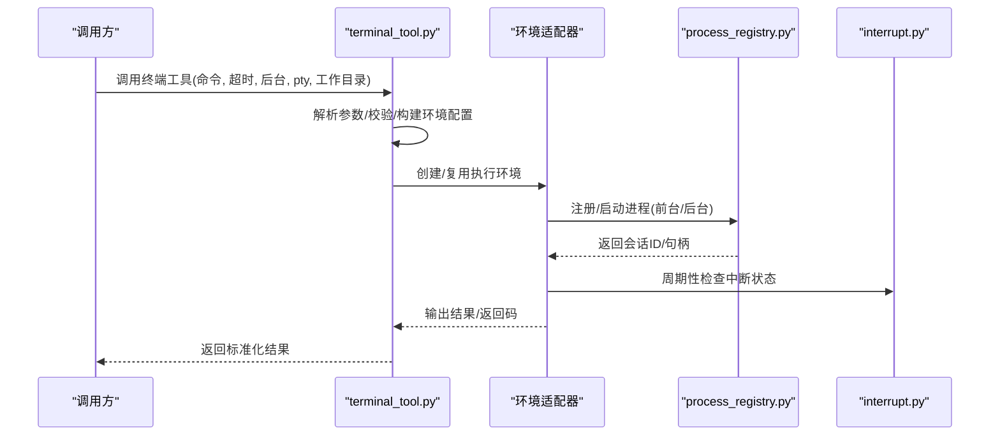
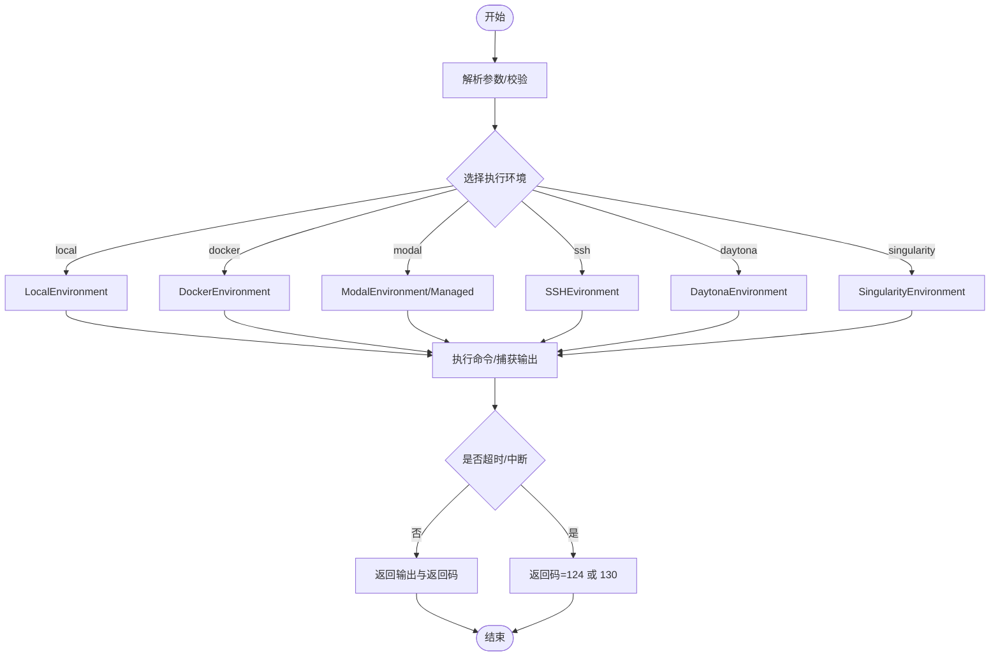
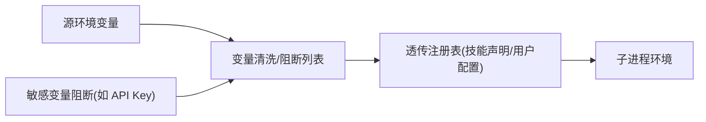
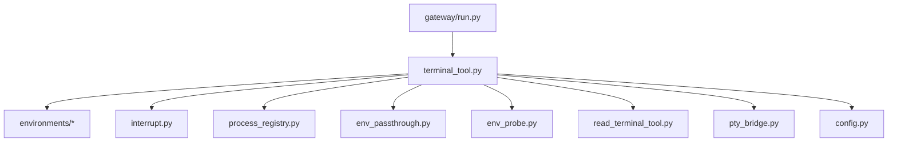

# 终端工具

<cite>
**本文引用的文件**
- [tools/terminal_tool.py](file://tools/terminal_tool.py)
- [tools/interrupt.py](file://tools/interrupt.py)
- [tools/env_passthrough.py](file://tools/env_passthrough.py)
- [tools/env_probe.py](file://tools/env_probe.py)
- [tools/read_terminal_tool.py](file://tools/read_terminal_tool.py)
- [tools/process_registry.py](file://tools/process_registry.py)
- [tools/code_execution_tool.py](file://tools/code_execution_tool.py)
- [tools/environments/local.py](file://tools/environments/local.py)
- [tools/environments/docker.py](file://tools/environments/docker.py)
- [hermes_cli/pty_bridge.py](file://hermes_cli/pty_bridge.py)
- [hermes_cli/config.py](file://hermes_cli/config.py)
- [gateway/run.py](file://gateway/run.py)
- [tests/tools/test_terminal_tool.py](file://tests/tools/test_terminal_tool.py)
- [tests/tools/test_terminal_timeout_output.py](file://tests/tools/test_terminal_timeout_output.py)
- [tests/tools/test_terminal_foreground_timeout_cap.py](file://tests/tools/test_terminal_foreground_timeout_cap.py)
- [tests/tools/test_terminal_exit_semantics.py](file://tests/tools/test_terminal_exit_semantics.py)
- [tests/tools/test_terminal_task_cwd.py](file://tests/tools/test_terminal_task_cwd.py)
- [tests/tools/test_terminal_config_env_sync.py](file://tests/tools/test_terminal_config_env_sync.py)
- [tests/tools/test_terminal_requirement.py](file://tests/tools/test_terminal_requirement.py)
- [tests/tools/test_terminal_tool_pty_fallback.py](file://tests/tools/test_terminal_tool_pty_fallback.py)
- [tests/tools/test_terminal_compound_background.py](file://tests/tools/test_terminal_compound_background.py)
- [tests/tools/test_terminal_output_transform_hook.py](file://tests/tools/test_terminal_output_transform_hook.py)
- [tests/tools/test_terminal_none_command_guard.py](file://tests/tools/test_terminal_none_command_guard.py)
- [tests/tools/test_terminal_requirements.py](file://tests/tools/test_terminal_requirements.py)
- [tests/tools/test_terminal_menu_fallbacks.py](file://tests/tools/test_terminal_menu_fallbacks.py)
- [tests/tools/test_terminal_shortcuts.py](file://tests/tools/test_terminal_shortcuts.py)
- [tests/tools/test_cli_terminal_response_sanitizer.py](file://tests/tools/test_cli_terminal_response_sanitizer.py)
- [tests/tools/test_tui_terminal_reset_on_exit.py](file://tests/tools/test_tui_terminal_reset_on_exit.py)
- [tests/hermes_cli/test_dump_terminal_backend.py](file://tests/hermes_cli/test_dump_terminal_backend.py)
- [tests/tools/test_mcp_tool.py](file://tests/tools/test_mcp_tool.py)
</cite>

## 目录
1. [简介](#简介)
2. [项目结构](#项目结构)
3. [核心组件](#核心组件)
4. [架构总览](#架构总览)
5. [详细组件分析](#详细组件分析)
6. [依赖分析](#依赖分析)
7. [性能考虑](#性能考虑)
8. [故障排查指南](#故障排查指南)
9. [结论](#结论)
10. [附录](#附录)

## 简介
本文件面向“终端工具”的技术实现与使用，覆盖以下主题：
- 进程创建、命令执行与输出捕获机制
- 安全沙箱与隔离策略（本地、容器、云沙箱）
- 环境变量传递与系统环境探测
- 超时控制与中断处理
- 配置项与性能调优
- 安全最佳实践与风险防范
- 扩展新终端命令与自定义执行环境的方法

## 项目结构
终端工具位于 tools 子模块中，围绕统一的工具注册表对外暴露能力；其后端通过环境适配器（local、docker、modal、ssh、daytona 等）实现跨平台与跨环境的一致行为。

图示来源
- [tools/terminal_tool.py](file://tools/terminal_tool.py)
- [tools/environments/local.py](file://tools/environments/local.py)
- [tools/environments/docker.py](file://tools/environments/docker.py)
- [tools/interrupt.py](file://tools/interrupt.py)
- [tools/env_passthrough.py](file://tools/env_passthrough.py)
- [tools/env_probe.py](file://tools/env_probe.py)
- [tools/process_registry.py](file://tools/process_registry.py)
- [tools/read_terminal_tool.py](file://tools/read_terminal_tool.py)
- [hermes_cli/pty_bridge.py](file://hermes_cli/pty_bridge.py)
- [hermes_cli/config.py](file://hermes_cli/config.py)
- [gateway/run.py](file://gateway/run.py)

章节来源
- [tools/terminal_tool.py](file://tools/terminal_tool.py)
- [tools/environments/local.py](file://tools/environments/local.py)
- [tools/environments/docker.py](file://tools/environments/docker.py)
- [tools/interrupt.py](file://tools/interrupt.py)
- [tools/env_passthrough.py](file://tools/env_passthrough.py)
- [tools/env_probe.py](file://tools/env_probe.py)
- [tools/process_registry.py](file://tools/process_registry.py)
- [tools/read_terminal_tool.py](file://tools/read_terminal_tool.py)
- [hermes_cli/pty_bridge.py](file://hermes_cli/pty_bridge.py)
- [hermes_cli/config.py](file://hermes_cli/config.py)
- [gateway/run.py](file://gateway/run.py)

## 核心组件
- 终端工具入口：负责参数解析、环境选择、超时与中断处理、后台任务与进程管理、输出转换与限制等。
- 环境适配器：封装不同后端（本地、Docker、Modal、SSH、Daytona、Singularity）的执行细节。
- 中断系统：基于线程 ID 的细粒度中断信号，避免会话间互相影响。
- 环境变量透传：在安全前提下允许特定变量进入沙箱子进程。
- 系统环境探测：对本地后端进行轻量探测，向系统提示提供上下文信息。
- 进程注册表：统一管理前台/后台进程的生命周期、输入写入、等待与清理。
- PTY 桥接：为交互式工具提供伪终端支持。
- 配置桥接：将用户配置映射到环境变量，确保一致性。

章节来源
- [tools/terminal_tool.py](file://tools/terminal_tool.py)
- [tools/interrupt.py](file://tools/interrupt.py)
- [tools/env_passthrough.py](file://tools/env_passthrough.py)
- [tools/env_probe.py](file://tools/env_probe.py)
- [tools/process_registry.py](file://tools/process_registry.py)
- [hermes_cli/pty_bridge.py](file://hermes_cli/pty_bridge.py)
- [hermes_cli/config.py](file://hermes_cli/config.py)

## 架构总览
终端工具采用“统一入口 + 多后端适配 + 线程级中断 + 变量透传 + 探测与配置桥接”的分层设计，保证在多环境下一致的行为与可观察性。

图示来源
- [tools/terminal_tool.py](file://tools/terminal_tool.py)
- [tools/process_registry.py](file://tools/process_registry.py)
- [tools/interrupt.py](file://tools/interrupt.py)

## 详细组件分析

### 终端工具入口与执行流程
- 参数与工作目录解析：支持 per-命令 workdir、环境 cwd 与初始化 cwd 的优先级链路，避免相对路径在容器后端失效。
- 命令预处理：sudo 重写、危险命令审批、背景任务复合语义修正、命令预览与日志安全。
- 环境创建：根据 TERMINAL_ENV 选择后端，按需加载容器资源、持久化、卷挂载、宿主机用户映射等配置。
- 执行与输出：统一返回结构包含输出文本与返回码；超时以 124 退出码标识；中断触发即时终止。
- 后台任务：返回 session_id，结合 process(action=...) 查询状态、等待完成、写入 stdin、关闭 stdin。
- PTY 支持：交互式工具（REPL、编辑器）启用 pty=true，提升兼容性与体验。

图示来源
- [tools/terminal_tool.py](file://tools/terminal_tool.py)
- [tools/environments/local.py](file://tools/environments/local.py)
- [tools/environments/docker.py](file://tools/environments/docker.py)

章节来源
- [tools/terminal_tool.py](file://tools/terminal_tool.py)
- [tools/process_registry.py](file://tools/process_registry.py)

### 安全沙箱与隔离策略
- 本地后端隔离：通过阻断列表剔除敏感凭据变量，仅允许白名单前缀与显式透传变量进入子进程；支持强制注入 Hermes 主目录变量。
- 容器后端隔离：默认丢弃非必需变量，仅转发经透传注册表允许的变量；镜像与资源限制可控；支持持久化文件系统与孤儿容器清理。
- 云沙箱隔离：Modal/Managed Modal/Daytona 等后端遵循各自平台的隔离模型，终端工具负责参数映射与生命周期管理。
- 危险命令审批：集中守卫系统在执行前拦截高危命令，必要时要求人工审批或提示替代方案。

图示来源
- [tools/environments/local.py](file://tools/environments/local.py)
- [tools/env_passthrough.py](file://tools/env_passthrough.py)
- [tools/code_execution_tool.py](file://tools/code_execution_tool.py)

章节来源
- [tools/environments/local.py](file://tools/environments/local.py)
- [tools/environments/docker.py](file://tools/environments/docker.py)
- [tools/env_passthrough.py](file://tools/env_passthrough.py)
- [tools/code_execution_tool.py](file://tools/code_execution_tool.py)

### 环境变量传递与系统环境探测
- 透传注册表：技能声明 required_environment_variables 与用户配置 terminal.env_passthrough 共同构成允许集合；禁止覆盖 Hermes 管理的提供商凭据。
- 配置桥接：用户配置中的 terminal.* 键值映射到对应环境变量，优先级与回退逻辑明确。
- 系统环境探测：本地后端对 Python/Pip/PEP 668 等进行一次性探测，生成简短提示行，避免模型误判。

章节来源
- [tools/env_passthrough.py](file://tools/env_passthrough.py)
- [hermes_cli/config.py](file://hermes_cli/config.py)
- [tools/env_probe.py](file://tools/env_probe.py)

### 超时控制与中断处理机制
- 超时上限：前台命令最大超时可通过环境变量覆盖；后台任务建议配合通知完成。
- 中断信号：基于线程 ID 的 per-thread 中断事件，工具轮询 is_interrupted() 并在检测到时立即返回中断结果码。
- 心跳与活动触达：长时间运行时定期上报活动状态，确保网关感知活跃。

章节来源
- [tools/terminal_tool.py](file://tools/terminal_tool.py)
- [tools/interrupt.py](file://tools/interrupt.py)

### 进程生命周期与 PTY 支持
- 进程注册表：统一管理前台/后台进程，支持写入 stdin、提交输入、关闭 stdin、等待完成、列出/轮询/清理。
- PTY 桥接：在支持平台上创建伪终端，设置 TERM 默认值，提供跨平台的交互式体验；失败时自动降级至管道模式。
- 桌面内终端读取：通过网关回调读取嵌入式终端缓冲区内容，返回 JSON 结构。

章节来源
- [tools/process_registry.py](file://tools/process_registry.py)
- [hermes_cli/pty_bridge.py](file://hermes_cli/pty_bridge.py)
- [tools/read_terminal_tool.py](file://tools/read_terminal_tool.py)

## 依赖分析
- 组件耦合：终端工具对环境适配器存在直接依赖；对中断系统与进程注册表存在间接依赖（通过调用）。
- 外部依赖：Docker 命令可用性、Modal/Daytona SDK、PTY 库等；工具在不可用时提供降级路径。
- 循环依赖：通过延迟导入与模块级函数避免循环。

图示来源
- [tools/terminal_tool.py](file://tools/terminal_tool.py)
- [tools/environments/local.py](file://tools/environments/local.py)
- [tools/environments/docker.py](file://tools/environments/docker.py)
- [tools/interrupt.py](file://tools/interrupt.py)
- [tools/process_registry.py](file://tools/process_registry.py)
- [tools/env_passthrough.py](file://tools/env_passthrough.py)
- [tools/env_probe.py](file://tools/env_probe.py)
- [tools/read_terminal_tool.py](file://tools/read_terminal_tool.py)
- [hermes_cli/pty_bridge.py](file://hermes_cli/pty_bridge.py)
- [hermes_cli/config.py](file://hermes_cli/config.py)
- [gateway/run.py](file://gateway/run.py)

章节来源
- [tools/terminal_tool.py](file://tools/terminal_tool.py)
- [tools/environments/local.py](file://tools/environments/local.py)
- [tools/environments/docker.py](file://tools/environments/docker.py)
- [tools/interrupt.py](file://tools/interrupt.py)
- [tools/process_registry.py](file://tools/process_registry.py)
- [tools/env_passthrough.py](file://tools/env_passthrough.py)
- [tools/env_probe.py](file://tools/env_probe.py)
- [tools/read_terminal_tool.py](file://tools/read_terminal_tool.py)
- [hermes_cli/pty_bridge.py](file://hermes_cli/pty_bridge.py)
- [hermes_cli/config.py](file://hermes_cli/config.py)
- [gateway/run.py](file://gateway/run.py)

## 性能考虑
- 资源与持久化：容器后端支持 CPU/内存/磁盘限制与持久化文件系统；合理设置可减少冷启动与重复安装成本。
- 清理策略：空闲回收线程周期清理不活跃环境；Docker 孤儿容器清理器在进程启动时扫描并回收。
- PTY 降级：在不支持 PTY 的平台自动回退，避免额外开销。
- 超时上限：前台命令最大超时限制防止长尾阻塞；后台任务配合通知完成降低轮询成本。

章节来源
- [tools/terminal_tool.py](file://tools/terminal_tool.py)
- [tools/environments/docker.py](file://tools/environments/docker.py)

## 故障排查指南
- 超时与中断：确认前台超时上限与后台任务通知；检查 is_interrupted() 是否被正确设置。
- 环境变量问题：核对透传注册表与配置桥接；避免将敏感凭据放入允许列表。
- PTY 不可用：在 Windows 上确认 WSL/ptyprocess 安装；查看降级日志。
- 容器后端：检查 Docker 可用性、镜像拉取、卷挂载与权限；关注孤儿容器清理器日志。
- 进程无法停止：使用 process(action='kill') 强制终止；注意持久化后端的停机策略。

章节来源
- [tools/terminal_tool.py](file://tools/terminal_tool.py)
- [tools/interrupt.py](file://tools/interrupt.py)
- [tools/env_passthrough.py](file://tools/env_passthrough.py)
- [hermes_cli/pty_bridge.py](file://hermes_cli/pty_bridge.py)
- [tools/environments/docker.py](file://tools/environments/docker.py)
- [tools/process_registry.py](file://tools/process_registry.py)

## 结论
终端工具通过统一入口与多后端适配，在安全性、可观测性与易用性之间取得平衡。借助变量透传、环境探测、中断与超时控制、进程生命周期管理与 PTY 支持，能够在本地、容器与云沙箱环境中稳定执行命令并捕获输出。建议在生产中结合配置桥接与清理策略，持续监控与优化资源与超时参数。

## 附录

### 配置选项与调优要点
- 终端环境与资源
  - TERMINAL_ENV：选择后端（local、docker、modal、ssh、daytona、singularity）
  - TERMINAL_TIMEOUT：默认命令超时
  - TERMINAL_MAX_FOREGROUND_TIMEOUT：前台命令最大超时
  - TERMINAL_LIFETIME_SECONDS：空闲回收时间
  - TERMINAL_CONTAINER_CPU/MEMORY/DISK：容器资源限制
  - TERMINAL_CONTAINER_PERSISTENT：容器持久化文件系统
  - TERMINAL_DOCKER_MOUNT_CWD_TO_WORKSPACE：将宿主工作目录挂载到 /workspace
  - TERMINAL_DOCKER_RUN_AS_HOST_USER：以宿主用户运行容器
  - TERMINAL_DOCKER_PERSIST_ACROSS_PROCESSES：跨进程复用容器
  - TERMINAL_DOCKER_ORPHAN_REAPER：孤儿容器清理器开关
- SSH 与 Modal
  - TERMINAL_SSH_HOST/USER/PORT/KEY：SSH 连接参数
  - TERMINAL_MODAL_MODE：Modal 后端模式（direct/managed/auto）
- 环境变量透传
  - terminal.env_passthrough：用户配置允许列表
  - 技能声明 required_environment_variables：自动加入允许列表
- PTY 与交互
  - pty=true：启用伪终端（交互式工具）
  - notify_on_complete=true：后台任务完成后通知

章节来源
- [tools/terminal_tool.py](file://tools/terminal_tool.py)
- [hermes_cli/config.py](file://hermes_cli/config.py)
- [gateway/run.py](file://gateway/run.py)

### 安全最佳实践
- 严格控制变量透传：仅允许必要的第三方 API 密钥与业务变量；禁止覆盖 Hermes 管理的提供商凭据。
- 使用持久化文件系统时注意数据隔离与清理策略。
- 对高危命令启用审批流程，避免破坏性操作。
- 在容器后端开启最小权限与资源限制，避免逃逸与资源滥用。
- 定期清理孤儿容器与过期环境，降低长期运行风险。

章节来源
- [tools/env_passthrough.py](file://tools/env_passthrough.py)
- [tools/environments/local.py](file://tools/environments/local.py)
- [tools/environments/docker.py](file://tools/environments/docker.py)

### 扩展新终端命令与自定义执行环境
- 新增工具：在工具注册表中注册新工具，定义参数模式与处理函数。
- 自定义环境：新增环境适配器类，实现 execute() 与生命周期方法，接入统一调度。
- 集成 PTY：在需要交互式工具时启用 pty=true，并在不支持时自动降级。
- 配置桥接：通过配置桥接将用户配置映射到环境变量，保持一致性。

章节来源
- [tools/terminal_tool.py](file://tools/terminal_tool.py)
- [hermes_cli/config.py](file://hermes_cli/config.py)
- [hermes_cli/pty_bridge.py](file://hermes_cli/pty_bridge.py)