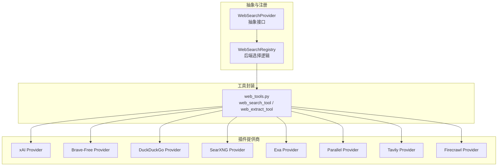
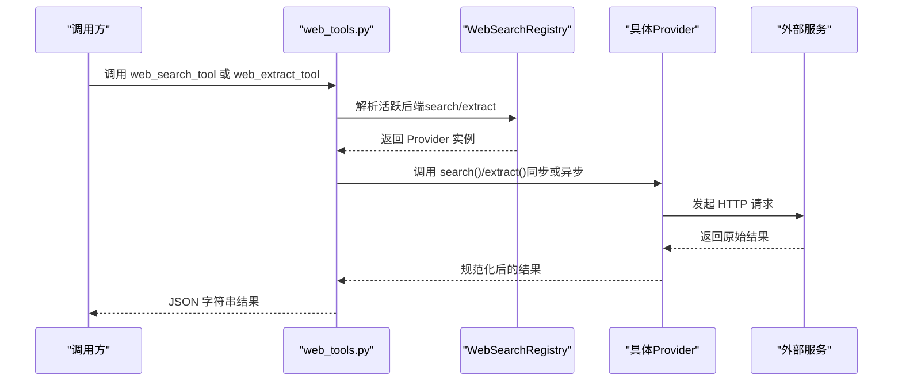
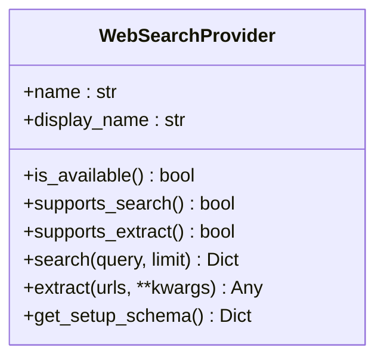
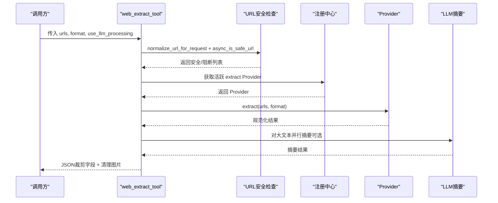
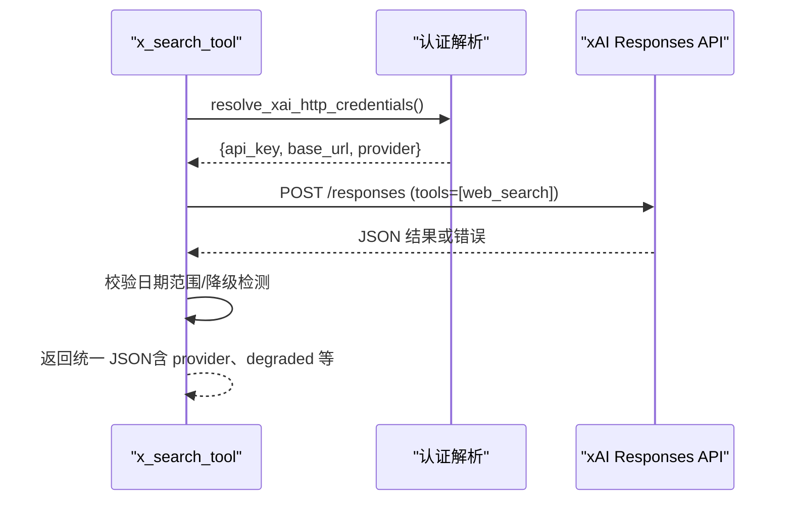
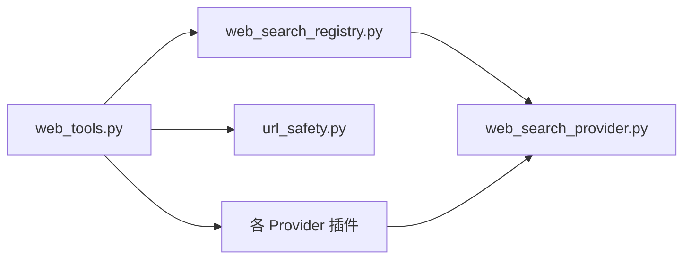

# 网络工具

<cite>
**本文引用的文件**
- [web_search_provider.py](file://agent/web_search_provider.py)
- [web_search_registry.py](file://agent/web_search_registry.py)
- [web_tools.py](file://tools/web_tools.py)
- [x_search_tool.py](file://tools/x_search_tool.py)
- [url_safety.py](file://tools/url_safety.py)
- [provider.py（xAI）](file://plugins/web/xai/provider.py)
- [provider.py（Brave Free）](file://plugins/web/brave_free/provider.py)
- [provider.py（DuckDuckGo）](file://plugins/web/ddgs/provider.py)
- [provider.py（SearXNG）](file://plugins/web/searxng/provider.py)
- [provider.py（Exa）](file://plugins/web/exa/provider.py)
- [provider.py（Parallel）](file://plugins/web/parallel/provider.py)
- [provider.py（Tavily）](file://plugins/web/tavily/provider.py)
- [provider.py（Firecrawl）](file://plugins/web/firecrawl/provider.py)
</cite>

## 目录
1. [简介](#简介)
2. [项目结构](#项目结构)
3. [核心组件](#核心组件)
4. [架构总览](#架构总览)
5. [详细组件分析](#详细组件分析)
6. [依赖分析](#依赖分析)
7. [性能考虑](#性能考虑)
8. [故障排查指南](#故障排查指南)
9. [结论](#结论)
10. [附录：配置与参数调优](#附录配置与参数调优)

## 简介
本文件系统性梳理网络工具的技术实现，覆盖以下主题：
- 网络搜索工具的插件化架构与多提供商集成
- 各搜索引擎提供商的适配方式与调用规范
- X 搜索工具（xAI）的特殊能力与使用场景
- 安全机制（URL 验证、内容过滤、防注入策略）
- 错误处理与重试机制
- 配置项与参数调优
- 实际使用示例与最佳实践
- 如何扩展新的网络搜索提供商与自定义搜索工具

## 项目结构
网络工具由“抽象后端接口 + 注册中心 + 工具封装 + 多插件提供商”构成：
- 抽象接口层：统一的 WebSearchProvider 接口定义
- 注册中心：按配置与可用性解析当前活跃后端
- 工具封装：web_search_tool/web_extract_tool 的统一入口
- 插件提供商：各搜索引擎/提取器的独立实现

图示来源
- [web_search_provider.py:63-186](file://agent/web_search_provider.py#L63-L186)
- [web_search_registry.py:44-246](file://agent/web_search_registry.py#L44-L246)
- [web_tools.py:787-1378](file://tools/web_tools.py#L787-L1378)
- [provider.py（xAI）:96-558](file://plugins/web/xai/provider.py#L96-L558)
- [provider.py（Brave Free）:33-138](file://plugins/web/brave_free/provider.py#L33-L138)
- [provider.py（DuckDuckGo）:23-105](file://plugins/web/ddgs/provider.py#L23-L105)
- [provider.py（SearXNG）:47-154](file://plugins/web/searxng/provider.py#L47-L154)
- [provider.py（Exa）:85-213](file://plugins/web/exa/provider.py#L85-L213)
- [provider.py（Parallel）:143-292](file://plugins/web/parallel/provider.py#L143-L292)
- [provider.py（Tavily）:128-221](file://plugins/web/tavily/provider.py#L128-L221)
- [provider.py（Firecrawl）:367-595](file://plugins/web/firecrawl/provider.py#L367-L595)

章节来源
- [web_search_provider.py:1-186](file://agent/web_search_provider.py#L1-L186)
- [web_search_registry.py:1-246](file://agent/web_search_registry.py#L1-L246)
- [web_tools.py:1-1378](file://tools/web_tools.py#L1-L1378)

## 核心组件
- WebSearchProvider 抽象基类：定义 name/display_name/is_available/supported_* 能力标识与 search/extract 接口
- WebSearchRegistry：集中注册与解析活跃后端，支持 per-capability 与共享 fallback
- web_search_tool/web_extract_tool：统一的工具入口，负责安全检查、并发调度与结果规整
- 各插件提供商：实现具体 API 调用、响应归一化与错误处理

章节来源
- [web_search_provider.py:63-186](file://agent/web_search_provider.py#L63-L186)
- [web_search_registry.py:44-246](file://agent/web_search_registry.py#L44-L246)
- [web_tools.py:787-1378](file://tools/web_tools.py#L787-L1378)

## 架构总览
网络工具采用“插件化后端 + 统一调度”的设计。工具调用链如下：

图示来源
- [web_search_registry.py:133-240](file://agent/web_search_registry.py#L133-L240)
- [web_tools.py:843-1044](file://tools/web_tools.py#L843-L1044)
- [provider.py（Firecrawl）:420-577](file://plugins/web/firecrawl/provider.py#L420-L577)

## 详细组件分析

### 抽象接口：WebSearchProvider
- 能力标识：supports_search/supports_extract
- 关键方法：search/extract（可为同步或异步），is_available（不进行网络 I/O）
- setup 元数据：get_setup_schema 提供 UI 展示与环境变量提示

图示来源
- [web_search_provider.py:63-186](file://agent/web_search_provider.py#L63-L186)

章节来源
- [web_search_provider.py:63-186](file://agent/web_search_provider.py#L63-L186)

### 注册中心：WebSearchRegistry
- 注册：register_provider（线程安全，支持热重载）
- 解析优先级：
  1) 显式配置（web.search_backend/web.extract_backend）
  2) 共享配置（web.backend）
  3) 单能力可用时直接使用
  4) 旧有偏好顺序（保留历史兼容）
- is_available 包装异常，避免单个 Provider 导致解析失败

```mermaid
flowchart TD
Start(["开始解析"]) --> CheckCfg["读取配置键<br/>web.search_backend / web.extract_backend / web.backend"]
CheckCfg --> HasCfg{"配置存在且可用？"}
HasCfg --> |是| UseCfg["使用配置指定 Provider"]
HasCfg --> |否| OneCap{"是否存在唯一可用 Provider？"}
OneCap --> |是| UseOne["使用该 Provider"]
OneCap --> |否| Legacy["按旧有偏好顺序遍历"]
Legacy --> Avail{"某 Provider 可用？"}
Avail --> |是| UseLegacy["使用该 Provider"]
Avail --> |否| None["返回空交由上层报错"]
UseCfg --> End(["结束"])
UseOne --> End
UseLegacy --> End
None --> End
```

图示来源
- [web_search_registry.py:98-240](file://agent/web_search_registry.py#L98-L240)

章节来源
- [web_search_registry.py:44-246](file://agent/web_search_registry.py#L44-L246)

### 工具封装：web_search_tool 与 web_extract_tool
- web_search_tool
  - 参数：query、limit（1..100）
  - 安全：自动加载插件、解析活跃 Provider、记录调试信息
  - 结果：统一 JSON 结构（success/data/web 列表）
- web_extract_tool
  - URL 安全：secret 过滤、SSRF 检查、网站策略再校验
  - 并发：对异步 Provider 使用 asyncio；对同步 Provider 使用线程池
  - LLM 增强：对大文本进行分块/合成摘要，控制输出大小
  - 输出裁剪：仅保留必要字段，移除 base64 图片

图示来源
- [web_tools.py:894-1181](file://tools/web_tools.py#L894-L1181)
- [url_safety.py:314-403](file://tools/url_safety.py#L314-L403)

章节来源
- [web_tools.py:787-1378](file://tools/web_tools.py#L787-L1378)
- [url_safety.py:1-403](file://tools/url_safety.py#L1-L403)

### 各提供商实现要点

#### xAI（xAI Web Search）
- 能力：search-only（通过 Responses API 的 web_search 工具）
- 认证：OAuth（SuperGrok）优先，其次 XAI_API_KEY
- 特殊信号：from_date/to_date 客户端校验；降级检测（无引用时标记 degraded）
- 重试：OAuth 401 自动刷新并重试一次

图示来源
- [x_search_tool.py:274-453](file://tools/x_search_tool.py#L274-L453)
- [provider.py（xAI）:96-336](file://plugins/web/xai/provider.py#L96-L336)

章节来源
- [x_search_tool.py:1-526](file://tools/x_search_tool.py#L1-L526)
- [provider.py（xAI）:1-558](file://plugins/web/xai/provider.py#L1-L558)

#### Brave-Free（Brave Search 免费版）
- 能力：search-only
- 调用：/res/v1/web/search，限制每页最多 20 条
- 认证：BRAVE_SEARCH_API_KEY

章节来源
- [provider.py（Brave Free）:33-138](file://plugins/web/brave_free/provider.py#L33-L138)

#### DuckDuckGo（ddgs）
- 能力：search-only
- 调用：ddgs 包的 text()，无需 API Key
- 注意：异常被包装为错误响应

章节来源
- [provider.py（DuckDuckGo）:23-105](file://plugins/web/ddgs/provider.py#L23-L105)

#### SearXNG
- 能力：search-only
- 调用：/search?format=json，支持排序与限制
- 认证：SEARXNG_URL

章节来源
- [provider.py（SearXNG）:47-154](file://plugins/web/searxng/provider.py#L47-L154)

#### Exa
- 能力：search + extract（均同步）
- 调用：exa-py SDK，搜索返回高亮摘要，提取返回完整内容
- 认证：EXA_API_KEY

章节来源
- [provider.py（Exa）:85-213](file://plugins/web/exa/provider.py#L85-L213)

#### Parallel
- 能力：search + extract（extract 异步）
- 调用：Parallel/AsyncParallel SDK，search 支持模式（agentic/fast/one-shot）
- 认证：PARALLEL_API_KEY
- 特点：extract 支持 per-URL 错误回退

章节来源
- [provider.py（Parallel）:143-292](file://plugins/web/parallel/provider.py#L143-L292)

#### Tavily
- 能力：search + extract（均同步）
- 调用：/search 与 /extract，支持 include_raw_content 等参数
- 认证：TAVILY_API_KEY（可选 TAVILY_BASE_URL）

章节来源
- [provider.py（Tavily）:128-221](file://plugins/web/tavily/provider.py#L128-L221)

#### Firecrawl
- 能力：search + extract（extract 异步）
- 认证：直接 API（FIRECRAWL_API_KEY/FIRECRAWL_API_URL）或工具网关（FIRECRAWL_GATEWAY_URL/TOOL_GATEWAY_*）
- 特点：响应归一化、60s 超时、重定向后再次策略校验、格式优先选择

章节来源
- [provider.py（Firecrawl）:367-595](file://plugins/web/firecrawl/provider.py#L367-L595)

## 依赖分析
- 工具到注册中心：web_search_tool/web_extract_tool 在调用前确保插件发现，并通过注册中心解析活跃 Provider
- Provider 到外部服务：各 Provider 封装具体 SDK/HTTP 客户端
- 安全依赖：URL 安全模块在提取阶段前置校验，避免 SSRF 与内网探测

图示来源
- [web_tools.py:758-881](file://tools/web_tools.py#L758-L881)
- [web_search_registry.py:44-91](file://agent/web_search_registry.py#L44-L91)
- [url_safety.py:314-403](file://tools/url_safety.py#L314-L403)
- [provider.py（xAI）:96-144](file://plugins/web/xai/provider.py#L96-L144)

章节来源
- [web_tools.py:758-881](file://tools/web_tools.py#L758-L881)
- [web_search_registry.py:44-91](file://agent/web_search_registry.py#L44-L91)
- [url_safety.py:314-403](file://tools/url_safety.py#L314-L403)

## 性能考虑
- 并发与线程池
  - 异步 Provider（如 Firecrawl、Parallel）直接异步执行
  - 同步 Provider（如 Exa、Tavily、Brave-Free、SearXNG、DuckDuckGo）在事件循环外以线程执行，避免阻塞
- LLM 摘要
  - 内容长度阈值与分块策略：>500k 分块并行摘要，>2M 拒绝处理
  - 输出上限：最终摘要不超过 5000 字，保证上下文窗口友好
- 超时与重试
  - Firecrawl 提供 60 秒超时与 per-URL 错误回退
  - xAI 提供 5xx 透明重试与 OAuth 401 自动刷新
- 缓存与懒加载
  - SDK 懒导入（Firecrawl、Parallel、Exa）降低冷启动成本

章节来源
- [web_tools.py:342-714](file://tools/web_tools.py#L342-L714)
- [provider.py（Firecrawl）:420-577](file://plugins/web/firecrawl/provider.py#L420-L577)
- [provider.py（Parallel）:212-277](file://plugins/web/parallel/provider.py#L212-L277)
- [provider.py（Exa）:111-198](file://plugins/web/exa/provider.py#L111-L198)
- [provider.py（Tavily）:149-206](file://plugins/web/tavily/provider.py#L149-L206)
- [provider.py（xAI）:255-302](file://plugins/web/xai/provider.py#L255-L302)

## 故障排查指南
- 无可用 Provider
  - 现象：返回“未配置任何网络搜索/提取提供程序”
  - 排查：运行 hermes tools 设置 web.search_backend/web.extract_backend，或安装所需 SDK/设置 API Key
- SSRF 阻断
  - 现象：提取 URL 被阻断（私有地址、内部主机名）
  - 排查：确认 URL 不含凭据；允许私有地址需开启 security.allow_private_urls（谨慎使用）
- 认证失败
  - 现象：401/403 或“缺少 API Key”
  - 排查：核对环境变量；xAI 支持 OAuth 自动刷新
- 超时与限流
  - 现象：Firecrawl 60s 超时；第三方 API 限流
  - 排查：缩短 URL 列表、降低并发、调整超时与重试参数
- 结果为空
  - 现象：搜索返回空列表
  - 排查：更换 Provider 或调整查询词；部分 Provider（如 Brave-Free）对结果数量有限制

章节来源
- [web_tools.py:861-891](file://tools/web_tools.py#L861-L891)
- [url_safety.py:314-394](file://tools/url_safety.py#L314-L394)
- [provider.py（Firecrawl）:494-507](file://plugins/web/firecrawl/provider.py#L494-L507)
- [provider.py（xAI）:265-298](file://plugins/web/xai/provider.py#L265-L298)

## 结论
该网络工具体系通过统一抽象与插件化架构，实现了多提供商的无缝切换与一致的调用体验。在安全、性能与可维护性之间取得平衡：严格的 URL 安全策略、并发与缓存优化、完善的错误处理与重试机制。扩展新提供商只需实现 WebSearchProvider 并注册即可，工具层无需改动。

## 附录：配置与参数调优
- 通用配置
  - web.search_backend/web.extract_backend：显式指定搜索/提取后端
  - web.backend：共享回退
  - web.use_gateway：当同时具备直连与网关时，优先网关（Firecrawl）
- Provider 特定配置
  - xAI：web.xai.model、web.xai.allowed_domains、web.xai.excluded_domains、web.xai.timeout
  - Parallel：PARALLEL_SEARCH_MODE（agentic/fast/one-shot）
  - Tavily：TAVILY_BASE_URL（可选）
  - Firecrawl：FIRECRAWL_API_KEY/API_URL、FIRECRAWL_GATEWAY_URL、TOOL_GATEWAY_*（网关）
  - Exa/Parallel/Tavily：对应 API Key
  - Brave-Free/SearXNG：BRAVE_SEARCH_API_KEY、SEARXNG_URL
  - DuckDuckGo：无需 API Key，但需安装 ddgs 包
- 参数调优建议
  - 限流与稳定性：适度降低并发，启用 5xx 重试（xAI）
  - 成本控制：合理设置 limit，避免过长查询词
  - 安全：默认启用 SSRF 检查；仅在受控环境开启 allow_private_urls
  - LLM 摘要：对 >5k 字节的内容启用摘要，控制输出上限

章节来源
- [provider.py（xAI）:12-31](file://plugins/web/xai/provider.py#L12-L31)
- [provider.py（Parallel）:135-140](file://plugins/web/parallel/provider.py#L135-L140)
- [provider.py（Tavily）:11-22](file://plugins/web/tavily/provider.py#L11-L22)
- [provider.py（Firecrawl）:27-44](file://plugins/web/firecrawl/provider.py#L27-L44)
- [provider.py（Exa）:8-18](file://plugins/web/exa/provider.py#L8-L18)
- [provider.py（Brave Free）:9-18](file://plugins/web/brave_free/provider.py#L9-L18)
- [provider.py（SearXNG）:12-22](file://plugins/web/searxng/provider.py#L12-L22)
- [provider.py（DuckDuckGo）:1-11](file://plugins/web/ddgs/provider.py#L1-L11)