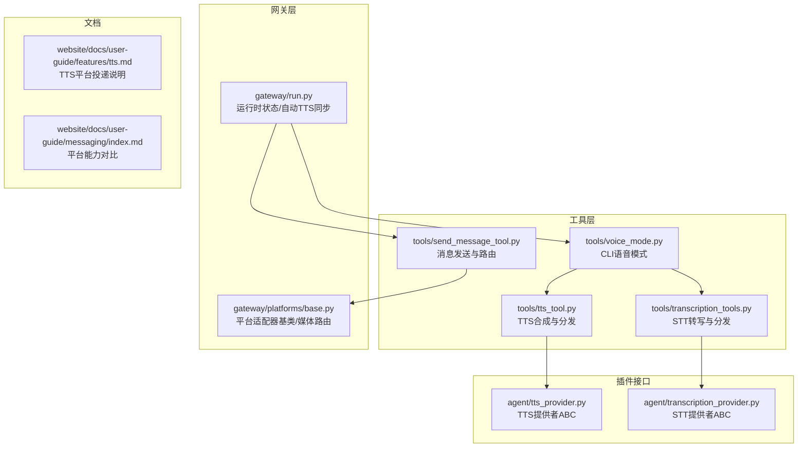
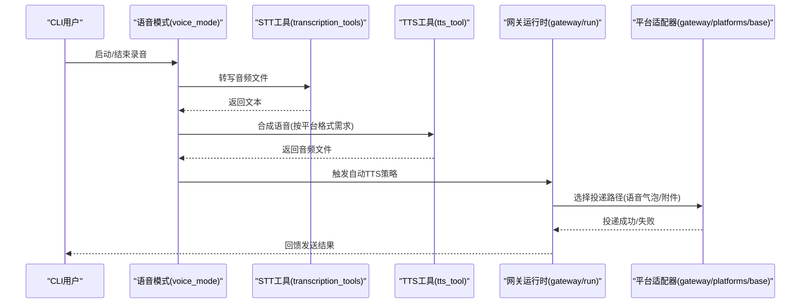
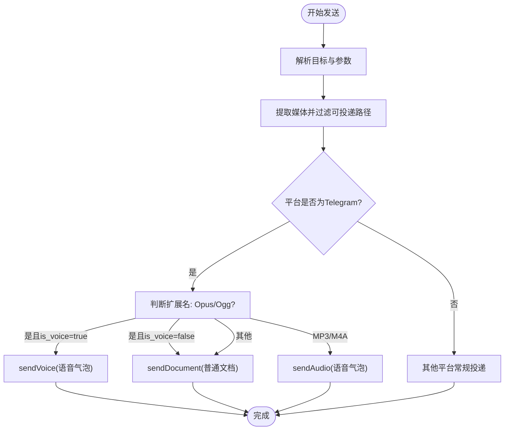
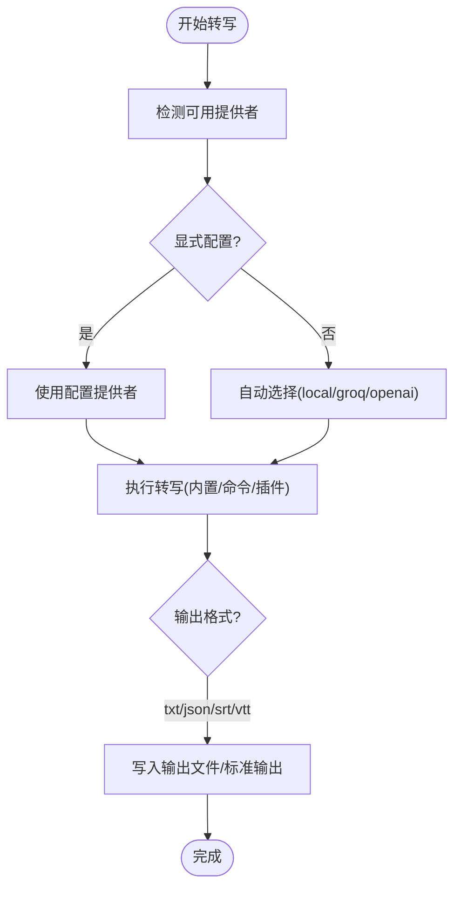
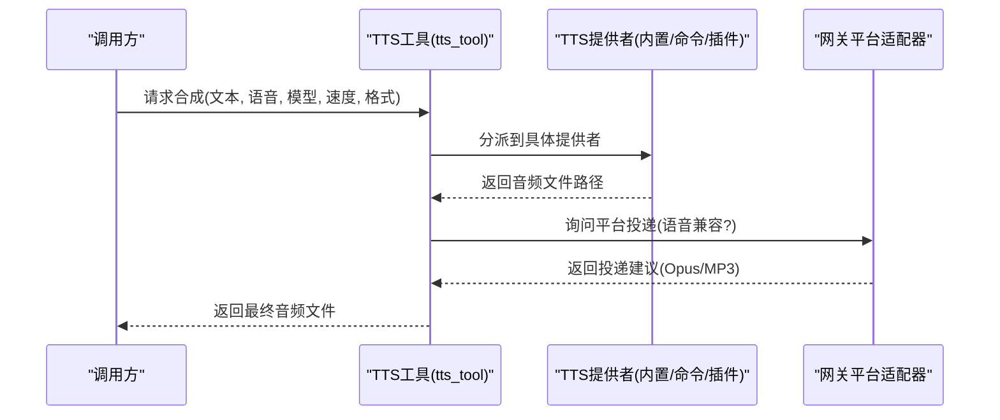
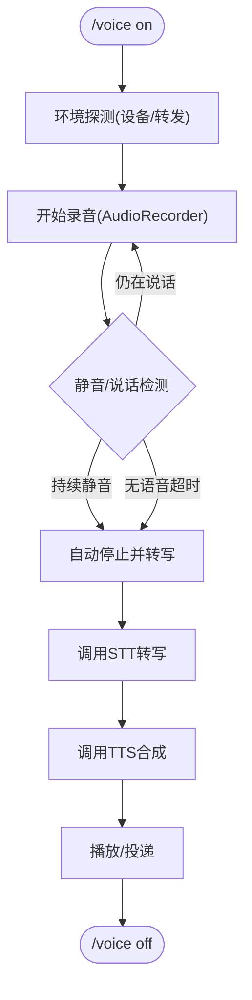
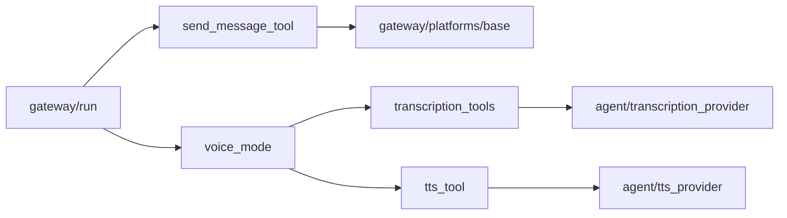

# 通信工具

<cite>
**本文引用的文件**
- [send_message_tool.py](file://tools/send_message_tool.py)
- [tts_tool.py](file://tools/tts_tool.py)
- [transcription_tools.py](file://tools/transcription_tools.py)
- [voice_mode.py](file://tools/voice_mode.py)
- [base.py](file://agent/transcription_provider.py)
- [base.py](file://agent/tts_provider.py)
- [base.py](file://gateway/platforms/base.py)
- [run.py](file://gateway/run.py)
- [tts.md](file://website/docs/user-guide/features/tts.md)
- [index.md](file://website/docs/user-guide/messaging/index.md)
</cite>

## 目录
1. [简介](#简介)
2. [项目结构](#项目结构)
3. [核心组件](#核心组件)
4. [架构总览](#架构总览)
5. [详细组件分析](#详细组件分析)
6. [依赖关系分析](#依赖关系分析)
7. [性能考量](#性能考量)
8. [故障排除指南](#故障排除指南)
9. [结论](#结论)
10. [附录](#附录)

## 简介
本文件系统化梳理通信工具在本仓库中的实现与使用方式，重点覆盖以下方面：
- 多平台消息路由与格式转换：跨平台消息发送、目标解析、线程与话题路由、媒体交付策略（含语音气泡与音频附件）。
- 语音转文字（STT）：本地与云端多种后端、命令行桥接、输入格式与大小限制、错误处理与超时控制。
- 文字转语音（TTS）：内置与插件化TTS后端、命令型提供者、输出格式适配（Opus/MP3）、语音兼容性与网关投递。
- 语音模式与自动切换：CLI推话语音录制、静音检测、自动停止、TTS/STT联动与网关自动TTS策略。
- 配置项与质量调优：TTS/STT提供者选择、输出格式、字符长度限制、代理与网络访问控制、缓存目录与清理。
- 最佳实践与延迟优化：平台特性利用、格式选择、并发与重试、资源管理与环境探测。
- 扩展指南：新增通信协议与音频处理算法的接入点与接口契约。

## 项目结构
围绕通信能力的关键模块分布如下：
- 工具层（tools）：消息发送、TTS、STT、语音模式等。
- 网关层（gateway）：平台适配器基类、运行时状态同步、会话上下文。
- 插件接口（agent）：TTS/STT提供者抽象类，定义统一扩展契约。
- 文档（website）：功能说明与平台对比，指导配置与使用。

图表来源
- [send_message_tool.py:174-466](file://tools/send_message_tool.py#L174-L466)
- [tts_tool.py:1-120](file://tools/tts_tool.py#L1-L120)
- [transcription_tools.py:1-120](file://tools/transcription_tools.py#L1-L120)
- [voice_mode.py:1-120](file://tools/voice_mode.py#L1-L120)
- [base.py:27-131](file://gateway/platforms/base.py#L27-L131)
- [run.py:2635-2658](file://gateway/run.py#L2635-L2658)
- [base.py:64-275](file://agent/tts_provider.py#L64-L275)
- [base.py:61-194](file://agent/transcription_provider.py#L61-L194)
- [tts.md:1-39](file://website/docs/user-guide/features/tts.md#L1-L39)
- [index.md:17-44](file://website/docs/user-guide/messaging/index.md#L17-L44)

章节来源
- [send_message_tool.py:174-466](file://tools/send_message_tool.py#L174-L466)
- [tts_tool.py:1-200](file://tools/tts_tool.py#L1-L200)
- [transcription_tools.py:1-200](file://tools/transcription_tools.py#L1-L200)
- [voice_mode.py:1-200](file://tools/voice_mode.py#L1-L200)
- [base.py:27-131](file://gateway/platforms/base.py#L27-L131)
- [run.py:2635-2658](file://gateway/run.py#L2635-L2658)
- [base.py:64-275](file://agent/tts_provider.py#L64-L275)
- [base.py:61-194](file://agent/transcription_provider.py#L61-L194)
- [tts.md:1-39](file://website/docs/user-guide/features/tts.md#L1-L39)
- [index.md:17-44](file://website/docs/user-guide/messaging/index.md#L17-L44)

## 核心组件
- 消息发送工具（send_message_tool）：负责跨平台消息发送、目标解析、线程/话题路由、媒体提取与投递策略（含Telegram语音气泡与音频附件）。
- 语音转文字工具（transcription_tools）：封装本地与云端STT后端，支持命令行桥接，具备超时与输出格式控制。
- 文字转语音工具（tts_tool）：封装TTS提供者（内置/命令/插件），按平台要求输出格式（Opus/MP3），并支持语音兼容性与网关投递。
- 语音模式（voice_mode）：CLI推话语音录制、静音检测、自动停止、TTS/STT联动与播放。
- 平台适配器基类（gateway/platforms/base）：定义媒体扩展名集合、Telegram语音/音频区分逻辑、线程元数据构建与消息截断。
- TTS/STT提供者抽象（agent/tts_provider、agent/transcription_provider）：定义插件化扩展接口，统一响应契约与可用性检查。

章节来源
- [send_message_tool.py:174-466](file://tools/send_message_tool.py#L174-L466)
- [transcription_tools.py:120-260](file://tools/transcription_tools.py#L120-L260)
- [tts_tool.py:160-260](file://tools/tts_tool.py#L160-L260)
- [voice_mode.py:140-271](file://tools/voice_mode.py#L140-L271)
- [base.py:27-131](file://gateway/platforms/base.py#L27-L131)
- [base.py:64-275](file://agent/tts_provider.py#L64-L275)
- [base.py:61-194](file://agent/transcription_provider.py#L61-L194)

## 架构总览
通信工具的整体工作流：
- CLI语音模式采集音频，触发STT转写，得到文本后进入对话循环。
- 对话结果若需要语音回复，由TTS生成音频，再经平台适配器路由到目标平台。
- 平台适配器根据平台特性决定采用“语音气泡”或“音频附件”投递，并进行格式转换（如Opus）。
- 网关运行时维护每平台的自动TTS策略，支持按聊天维度覆盖全局设置。

图表来源
- [voice_mode.py:1-120](file://tools/voice_mode.py#L1-L120)
- [transcription_tools.py:1-120](file://tools/transcription_tools.py#L1-L120)
- [tts_tool.py:1-120](file://tools/tts_tool.py#L1-L120)
- [run.py:2635-2658](file://gateway/run.py#L2635-L2658)
- [base.py:27-131](file://gateway/platforms/base.py#L27-L131)

## 详细组件分析

### 消息发送工具（跨平台路由与格式转换）
- 目标解析与通道选择：支持平台名、频道名/ID、线程/话题标识，自动解析为平台特定ID；对Slack用户ID需先打开DM会话。
- 媒体提取与投递策略：
  - 从消息中识别“MEDIA:”占位符，提取本地路径并过滤可投递媒体。
  - Telegram对音频/语音有差异化投递：sendAudio仅接受MP3/M4A，sendVoice用于Opus/Ogg，其他格式作为普通文档。
  - 强制文档投递标记“[[as_document]]”可绕过平台特定投递，保留原始字节（如避免Telegram图片压缩）。
- 线程/话题路由：根据平台差异构建thread_id、message_thread_id、reply_to等元数据，确保回复锚定在正确话题。
- 错误与重试：针对Telegram的限流/超时进行指数退避重试；对不可达/私网URL进行安全拦截（SSRF防护）。

图表来源
- [send_message_tool.py:375-466](file://tools/send_message_tool.py#L375-L466)
- [base.py:110-131](file://gateway/platforms/base.py#L110-L131)

章节来源
- [send_message_tool.py:174-466](file://tools/send_message_tool.py#L174-L466)
- [base.py:27-131](file://gateway/platforms/base.py#L27-L131)

### 语音转文字工具（STT）集成与音频处理
- 提供者选择与可用性：
  - 内置：local（faster-whisper本地）、local_command（自定义命令）、groq、openai、mistral、xai、elevenlabs。
  - 自动检测：当未显式配置时，优先尝试local/faster-whisper，否则按groq/openai顺序回退。
  - 可用性检查：对缺少SDK或密钥的情况给出明确提示。
- 输入规范与限制：
  - 支持格式：mp3/mp4/mpeg/mpga/m4a/wav/webm/ogg/aac/flac。
  - 文件大小上限：25MB；模型名称映射与本地二进制查找。
- 命令型提供者：支持以模板语法注入占位符（输入/输出路径、语言、模型、格式），并提供超时与进程树终止保障。
- 输出格式：txt/json/srt/vtt，命令提供者可直接读取文件或stdout。

图表来源
- [transcription_tools.py:120-260](file://tools/transcription_tools.py#L120-L260)
- [transcription_tools.py:260-480](file://tools/transcription_tools.py#L260-L480)
- [transcription_tools.py:616-743](file://tools/transcription_tools.py#L616-L743)

章节来源
- [transcription_tools.py:120-260](file://tools/transcription_tools.py#L120-L260)
- [transcription_tools.py:260-480](file://tools/transcription_tools.py#L260-L480)
- [transcription_tools.py:616-743](file://tools/transcription_tools.py#L616-L743)

### 文字转语音工具（TTS）实现与音频合成
- 提供者生态：
  - 内置：Edge TTS、ElevenLabs、OpenAI TTS、MiniMax TTS、Mistral Voxtral、Google Gemini TTS、xAI TTS、NeuTTS/KittenTTS/Piper（本地）。
  - 插件注册：通过agent.tts_provider定义的ABC注册插件提供者。
  - 命令型提供者：用户可在配置中声明type: command，通过模板占位符驱动任意本地CLI。
- 输出格式与平台适配：
  - Telegram语音气泡：推荐Opus(.ogg)，其他平台默认MP3。
  - 语音兼容性：插件提供者可声明voice_compatible，网关将自动进行ffmpeg转换（如需）。
- 字符长度限制：各提供者存在最大文本长度限制，工具会按提供者表与配置进行截断。
- 缓存与输出：默认输出目录位于~/.hermes/cache/audio，便于后续复用与镜像。

图表来源
- [tts_tool.py:1-120](file://tools/tts_tool.py#L1-L120)
- [tts_tool.py:459-574](file://tools/tts_tool.py#L459-L574)
- [base.py:64-275](file://agent/tts_provider.py#L64-L275)

章节来源
- [tts_tool.py:1-120](file://tools/tts_tool.py#L1-L120)
- [tts_tool.py:459-574](file://tools/tts_tool.py#L459-L574)
- [base.py:64-275](file://agent/tts_provider.py#L64-L275)

### 语音模式与自动切换（CLI推话语音）
- 录音与静音检测：基于sounddevice实时采样，使用RMS阈值与滑动窗口策略检测说话开始/结束，支持“无语音等待超时”与“持续静音自动停止”。
- Termux回退：在Android Termux环境下，使用termux-microphone-record命令进行录音，避免对PortAudio的依赖。
- 环境探测：检测SSH/Docker/WSL/容器等场景下的音频转发与设备可用性，提供安装与配置指引。
- 与网关协作：记录当前录音状态、峰值RMS、自动停止回调；网关运行时可同步语音模式状态到平台适配器，实现按聊天维度的自动TTS开关。

图表来源
- [voice_mode.py:140-271](file://tools/voice_mode.py#L140-L271)
- [voice_mode.py:460-800](file://tools/voice_mode.py#L460-L800)
- [run.py:2635-2658](file://gateway/run.py#L2635-L2658)

章节来源
- [voice_mode.py:140-271](file://tools/voice_mode.py#L140-L271)
- [voice_mode.py:460-800](file://tools/voice_mode.py#L460-L800)
- [run.py:2635-2658](file://gateway/run.py#L2635-L2658)

### 平台投递与格式转换（跨平台）
- 平台投递矩阵（节选）：
  - Telegram：语音气泡（内联播放）Opus .ogg；音频附件MP3/M4A；文档附件通用。
  - Discord：语音气泡（Opus/OGG），回退为文件附件；MP3/OGG。
  - WhatsApp：音频文件附件MP3。
  - CLI：保存至~/.hermes/audio_cache/目录MP3。
- 媒体扩展名与投递策略：
  - 统一的音频扩展名集合：.ogg/.opus/.mp3/.wav/.m4a/.flac。
  - Telegram对Opus/Ogg的“语音气泡”与MP3/M4A的“音频附件”分流逻辑。
  - 语音兼容性：插件提供者可声明voice_compatible，网关将按需转换为Opus以满足语音气泡要求。

章节来源
- [tts.md:32-39](file://website/docs/user-guide/features/tts.md#L32-L39)
- [base.py:27-131](file://gateway/platforms/base.py#L27-L131)

## 依赖关系分析
- 工具层内部耦合：
  - send_message_tool依赖gateway.platforms.base的媒体路由与线程元数据。
  - tts_tool与transcription_tools分别依赖各自提供者抽象（agent/tts_provider、agent/transcription_provider）与插件注册。
- 运行时耦合：
  - gateway.run维护每平台的自动TTS策略，与voice_mode的状态同步，确保按聊天维度覆盖全局设置。
- 第三方依赖：
  - STT：faster-whisper、openai、mistralai、elevenlabs等SDK按需懒加载。
  - TTS：edge-tts、elevenlabs、openai、mistral、piper、kittentts、neutts等按需懒加载。
  - 语音模式：sounddevice、numpy（可选），Termux命令回退。

图表来源
- [send_message_tool.py:174-466](file://tools/send_message_tool.py#L174-L466)
- [tts_tool.py:1-120](file://tools/tts_tool.py#L1-L120)
- [transcription_tools.py:1-120](file://tools/transcription_tools.py#L1-L120)
- [voice_mode.py:1-120](file://tools/voice_mode.py#L1-L120)
- [run.py:2635-2658](file://gateway/run.py#L2635-L2658)
- [base.py:64-275](file://agent/tts_provider.py#L64-L275)
- [base.py:61-194](file://agent/transcription_provider.py#L61-L194)

章节来源
- [send_message_tool.py:174-466](file://tools/send_message_tool.py#L174-L466)
- [tts_tool.py:1-120](file://tools/tts_tool.py#L1-L120)
- [transcription_tools.py:1-120](file://tools/transcription_tools.py#L1-L120)
- [voice_mode.py:1-120](file://tools/voice_mode.py#L1-L120)
- [run.py:2635-2658](file://gateway/run.py#L2635-L2658)
- [base.py:64-275](file://agent/tts_provider.py#L64-L275)
- [base.py:61-194](file://agent/transcription_provider.py#L61-L194)

## 性能考量
- 延迟优化要点：
  - 选择合适的STT/TTS提供者：本地faster-whisper适合低延迟与隐私场景；云端提供者在准确度与多语言上更优。
  - 平台格式选择：Telegram语音气泡优先Opus，减少转换开销；其他平台默认MP3。
  - 命令型提供者：通过模板占位符直接输出目标格式，避免中间文件与二次编码。
  - 静音检测参数：合理设置RMS阈值与静音/恢复容忍时间，平衡误触与等待时长。
- 资源与稳定性：
  - 超时与重试：STT/TTS命令提供者与第三方API均设置超时与进程树终止，避免阻塞。
  - 缓存策略：图像/音频缓存目录定期清理，避免磁盘膨胀。
  - SSRF保护：下载媒体前进行URL白名单校验，防止内部地址泄露。

## 故障排除指南
- 常见问题与定位：
  - 无法录音/无设备：检查PortAudio/alsa、PulseAudio/PipeWire转发、Termux:API安装与权限。
  - 语音模式不可用：查看环境探测警告与安装提示，确认依赖已安装。
  - 发送失败/被限流：关注Telegram限流返回码与指数退避；检查平台令牌与权限。
  - STT/命令提供者失败：核对命令模板占位符、输出格式、超时与进程树终止日志。
  - TTS输出格式不符：确认插件提供者voice_compatible与网关转换链路。
- 诊断建议：
  - 启用详细日志，观察转写/合成阶段的错误信息与返回码。
  - 使用最小化配置快速验证：先启用本地STT与本地TTS，逐步引入外部服务。
  - 检查代理与NO_PROXY配置，确保平台域名可达。

章节来源
- [voice_mode.py:140-271](file://tools/voice_mode.py#L140-L271)
- [send_message_tool.py:91-132](file://tools/send_message_tool.py#L91-L132)
- [transcription_tools.py:543-584](file://tools/transcription_tools.py#L543-L584)
- [tts_tool.py:703-753](file://tools/tts_tool.py#L703-L753)

## 结论
本通信工具通过清晰的分层设计与丰富的扩展接口，实现了跨平台消息路由、STT/ TTS合成与投递、以及CLI语音模式的完整闭环。其关键优势在于：
- 提供者抽象与插件化扩展，便于接入新协议与算法；
- 平台适配器统一媒体路由与格式转换，保证一致体验；
- 运行时状态同步与自动TTS策略，提升交互效率；
- 完善的错误处理、超时与SSRF保护，增强稳定性与安全性。

## 附录

### 配置选项与质量调优要点
- TTS：
  - provider：选择内置/命令/插件提供者。
  - providers.<name>：命令型提供者模板与输出格式。
  - max_text_length：按提供者与模型调整，避免超限。
  - voice_compatible：启用语音气泡投递时需声明。
- STT：
  - provider：local/local_command/groq/openai/mistral/xai。
  - format/language/model：按提供者能力配置。
  - timeout：命令型提供者超时控制。
- 平台：
  - HOME_CHANNEL与线程元数据：确保回复锚定与话题一致性。
  - 代理与NO_PROXY：在受限网络下确保平台可达。

章节来源
- [tts_tool.py:321-338](file://tools/tts_tool.py#L321-L338)
- [transcription_tools.py:120-135](file://tools/transcription_tools.py#L120-L135)
- [base.py:27-131](file://gateway/platforms/base.py#L27-L131)