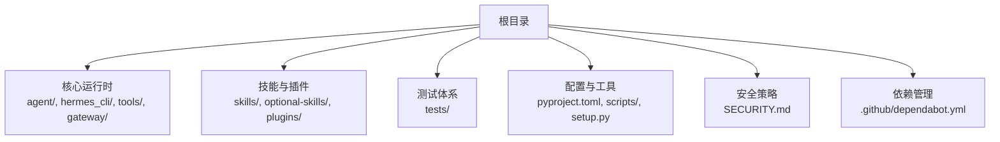
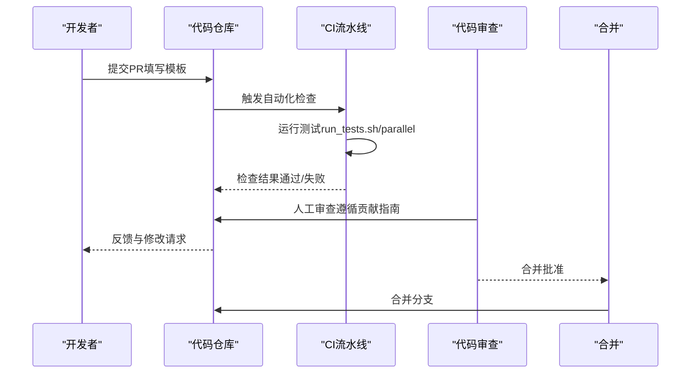
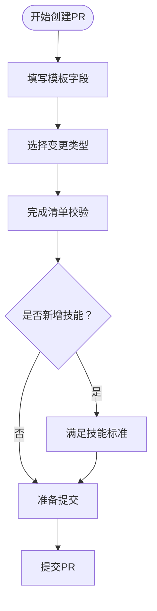
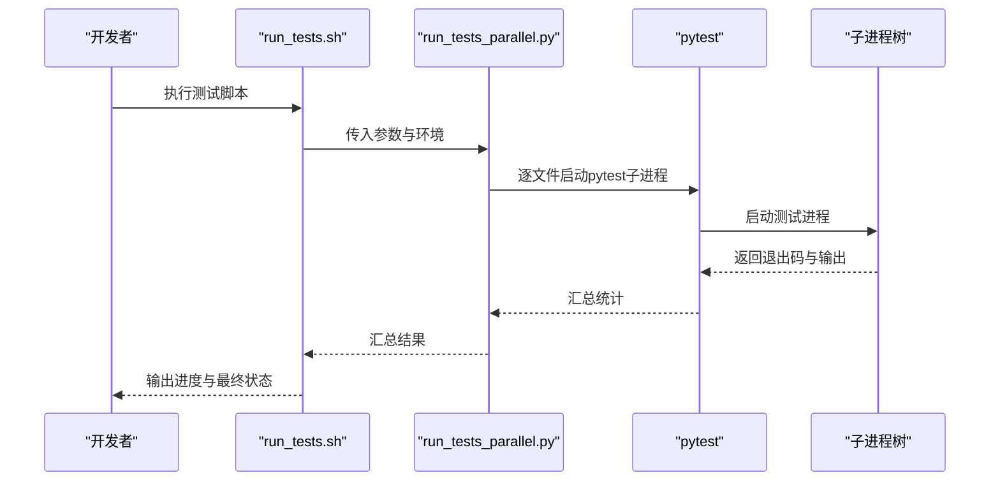
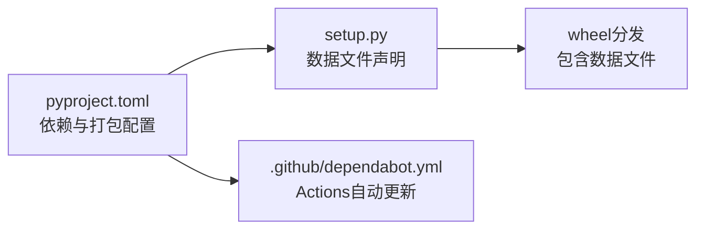

# Pull Request工作流程

<cite>
**本文档引用的文件**
- [.github/PULL_REQUEST_TEMPLATE.md](file://.github/PULL_REQUEST_TEMPLATE.md)
- [CONTRIBUTING.md](file://CONTRIBUTING.md)
- [scripts/run_tests.sh](file://scripts/run_tests.sh)
- [scripts/run_tests_parallel.py](file://scripts/run_tests_parallel.py)
- [pyproject.toml](file://pyproject.toml)
- [.github/dependabot.yml](file://.github/dependabot.yml)
- [SECURITY.md](file://SECURITY.md)
- [setup.py](file://setup.py)
</cite>

## 目录
1. [简介](#简介)
2. [项目结构](#项目结构)
3. [核心组件](#核心组件)
4. [架构总览](#架构总览)
5. [详细组件分析](#详细组件分析)
6. [依赖关系分析](#依赖关系分析)
7. [性能考虑](#性能考虑)
8. [故障排除指南](#故障排除指南)
9. [结论](#结论)
10. [附录](#附录)

## 简介
本指南面向贡献者与维护者，系统阐述该代码库的Pull Request（PR）工作流程：从PR创建、描述规范、变更范围评估，到代码审查、CI检查与合并条件；并提供测试要求、代码质量门禁标准、最佳实践与常见问题解决方案。所有流程均以仓库内现有配置与文档为依据，确保可执行与可追溯。

## 项目结构
该仓库采用模块化组织方式，核心模块包括：
- 核心运行时与CLI：agent/、hermes_cli/、tools/、gateway/
- 技能与插件：skills/、optional-skills/、plugins/
- 测试体系：tests/
- 配置与工具：pyproject.toml、scripts/、setup.py
- 安全策略：SECURITY.md
- 依赖管理：.github/dependabot.yml

[本图为概念性结构示意，不直接映射具体源码文件，故无图表来源]

**章节来源**
- [CONTRIBUTING.md: 第172-254行:172-254](file://CONTRIBUTING.md#L172-L254)

## 核心组件
- PR模板：用于标准化PR描述、类型选择、变更清单、测试步骤与清单校验。
- 贡献指南：定义优先级、技能/工具决策、跨平台兼容性、代码风格与作者署名等。
- 测试运行器：统一本地与CI测试环境，保证隔离与确定性。
- 依赖更新策略：仅对GitHub Actions启用自动更新，源依赖严格锁定。
- 安全策略：漏洞报告渠道、信任模型、部署加固与披露流程。
- 打包与分发：setup.py与pyproject.toml共同定义数据文件与打包规则。

**章节来源**
- [.github/PULL_REQUEST_TEMPLATE.md: 第1-76行:1-76](file://.github/PULL_REQUEST_TEMPLATE.md#L1-L76)
- [CONTRIBUTING.md: 第1-100行:1-100](file://CONTRIBUTING.md#L1-L100)
- [scripts/run_tests.sh: 第1-80行:1-80](file://scripts/run_tests.sh#L1-L80)
- [scripts/run_tests_parallel.py: 第1-120行:1-120](file://scripts/run_tests_parallel.py#L1-L120)
- [.github/dependabot.yml: 第1-45行:1-45](file://.github/dependabot.yml#L1-L45)
- [SECURITY.md: 第1-60行:1-60](file://SECURITY.md#L1-L60)
- [setup.py: 第1-29行:1-29](file://setup.py#L1-L29)
- [pyproject.toml: 第257-289行:257-289](file://pyproject.toml#L257-L289)

## 架构总览
下图展示PR生命周期中的关键交互：从创建PR到CI检查、代码审查与合并。

[本图为概念性流程示意，不直接映射具体源码文件，故无图表来源]

## 详细组件分析

### PR创建与描述规范
- 必填字段：变更动机、关联Issue、变更类型、变更清单、测试步骤、清单校验。
- 类型分类：缺陷修复、新功能、安全修复、文档更新、测试、重构、新增技能等。
- 清单校验：需包含“已阅读贡献指南”、“遵循约定式提交”、“搜索重复PR”、“仅包含相关变更”、“运行pytest并通过”、“添加测试”、“指定平台”等。
- 新技能专项：需满足“广泛适用性”、“标准格式”、“无额外外部依赖”、“端到端测试”。

**图表来源**
- [.github/PULL_REQUEST_TEMPLATE.md: 第13-76行:13-76](file://.github/PULL_REQUEST_TEMPLATE.md#L13-L76)
- [CONTRIBUTING.md: 第516-574行:516-574](file://CONTRIBUTING.md#L516-L574)

**章节来源**
- [.github/PULL_REQUEST_TEMPLATE.md: 第1-76行:1-76](file://.github/PULL_REQUEST_TEMPLATE.md#L1-L76)
- [CONTRIBUTING.md: 第516-574行:516-574](file://CONTRIBUTING.md#L516-L574)

### 变更范围评估
- 优先级排序：缺陷修复、跨平台兼容性、安全加固、性能与鲁棒性、技能、工具、文档。
- 技能与工具选择：优先技能，除非需要与认证、密钥管理或实时事件处理强耦合。
- 内存提供程序：不再接受新的内置内存提供程序，建议作为独立插件发布。

**章节来源**
- [CONTRIBUTING.md: 第7-66行:7-66](file://CONTRIBUTING.md#L7-L66)

### 代码审查流程
- 代码风格：PEP 8，注释仅在必要时解释非显而易见意图，错误处理捕获特定异常。
- 跨平台：避免假设Unix，使用平台检测与替代方案（如psutil、shutil.which）。
- 审查重点：变更影响面、测试覆盖、安全边界、依赖更新策略、打包与分发。

**章节来源**
- [CONTRIBUTING.md: 第287-300行:287-300](file://CONTRIBUTING.md#L287-L300)
- [CONTRIBUTING.md: 第627-800行:627-800](file://CONTRIBUTING.md#L627-L800)

### CI检查与测试要求
- 统一测试入口：使用scripts/run_tests.sh启动，内部调用scripts/run_tests_parallel.py实现每文件隔离并行。
- 环境约束：TZ=UTC、LANG=C.UTF-8、PYTHONHASHSEED=0、干净环境变量、激活虚拟环境。
- 并行策略：基于CPU核数×2的默认工作进程数，支持切片分片（--slice I/N）按估计耗时均衡分配。
- 超时控制：单文件超时默认约140秒，超时后递归终止子进程树。
- 跳过策略：默认跳过integration/e2e/docker目录，除非显式包含或使用特殊标志。

**图表来源**
- [scripts/run_tests.sh: 第1-80行:1-80](file://scripts/run_tests.sh#L1-L80)
- [scripts/run_tests_parallel.py: 第596-800行:596-800](file://scripts/run_tests_parallel.py#L596-L800)

**章节来源**
- [scripts/run_tests.sh: 第1-80行:1-80](file://scripts/run_tests.sh#L1-L80)
- [scripts/run_tests_parallel.py: 第1-120行:1-120](file://scripts/run_tests_parallel.py#L1-L120)
- [scripts/run_tests_parallel.py: 第596-800行:596-800](file://scripts/run_tests_parallel.py#L596-L800)

### 代码质量门禁标准
- 依赖锁定：核心依赖精确版本，禁止范围依赖；源依赖严格锁定，避免未经审查的升级。
- 依赖更新：仅对GitHub Actions启用自动更新，源依赖通过安全更新PR触发。
- 打包与分发：setup.py与pyproject.toml共同声明数据文件与打包规则，确保wheel包含必需资源。

**章节来源**
- [pyproject.toml: 第24-133行:24-133](file://pyproject.toml#L24-L133)
- [.github/dependabot.yml: 第1-45行:1-45](file://.github/dependabot.yml#L1-L45)
- [setup.py: 第1-29行:1-29](file://setup.py#L1-L29)

### 合并条件
- 通过CI测试：本地与CI环境一致，测试全部通过。
- 代码审查：至少一名维护者批准，遵循贡献指南与安全策略。
- 安全合规：涉及安全修复或可能越界行为的变更需特别审查。
- 依赖与打包：依赖更新遵循策略，打包元数据完整。

**章节来源**
- [SECURITY.md: 第222-332行:222-332](file://SECURITY.md#L222-L332)
- [CONTRIBUTING.md: 第159-168行:159-168](file://CONTRIBUTING.md#L159-L168)

### PR最佳实践
- 使用约定式提交消息（fix(scope):、feat(scope):等），便于变更追踪与发布。
- 在PR描述中明确问题背景、解决方案与验证方法，提供复现步骤与结果证明。
- 将变更限定在单一主题内，避免无关提交混杂。
- 对新增或修改的功能补充测试，确保在CI环境中可重现。
- 关注跨平台兼容性，避免使用Windows不兼容的系统调用或路径约定。

**章节来源**
- [.github/PULL_REQUEST_TEMPLATE.md: 第43-61行:43-61](file://.github/PULL_REQUEST_TEMPLATE.md#L43-L61)
- [CONTRIBUTING.md: 第627-800行:627-800](file://CONTRIBUTING.md#L627-L800)

### 常见问题与解决方案
- CI测试失败：优先使用scripts/run_tests.sh复现，确认环境变量与工作目录正确。
- Windows兼容性问题：参考跨平台兼容性指南，使用psutil替代os.kill(pid,0)，使用shutil.which检测工具可用性。
- 依赖冲突：遵循精确版本锁定策略，避免引入范围依赖；通过uv.lock保持一致性。
- 打包缺失资源：确认setup.py与pyproject.toml的数据文件声明，确保wheel包含所需目录。

**章节来源**
- [scripts/run_tests.sh: 第1-80行:1-80](file://scripts/run_tests.sh#L1-L80)
- [CONTRIBUTING.md: 第627-800行:627-800](file://CONTRIBUTING.md#L627-L800)
- [pyproject.toml: 第257-289行:257-289](file://pyproject.toml#L257-L289)
- [setup.py: 第1-29行:1-29](file://setup.py#L1-L29)

## 依赖关系分析
- 依赖锁定策略：核心依赖精确版本，源依赖严格锁定，避免未经审查的升级。
- 自动更新范围：仅限GitHub Actions，按周批量更新，安全更新例外。
- 打包依赖：setup.py与pyproject.toml共同声明数据文件，确保wheel包含skills与optional-skills。

**图表来源**
- [pyproject.toml: 第257-289行:257-289](file://pyproject.toml#L257-L289)
- [setup.py: 第1-29行:1-29](file://setup.py#L1-L29)
- [.github/dependabot.yml: 第1-45行:1-45](file://.github/dependabot.yml#L1-L45)

**章节来源**
- [pyproject.toml: 第24-133行:24-133](file://pyproject.toml#L24-L133)
- [.github/dependabot.yml: 第1-45行:1-45](file://.github/dependabot.yml#L1-L45)
- [setup.py: 第1-29行:1-29](file://setup.py#L1-L29)

## 性能考虑
- 测试并行：run_tests_parallel.py按文件粒度并行，减少跨文件状态泄漏风险，提升整体吞吐。
- 超时与清理：单文件超时与进程树递归终止，避免CI卡死与僵尸进程。
- 切片分片：基于历史耗时的LPT算法均衡分配，缩短最长作业时间，提升CI稳定性。

**章节来源**
- [scripts/run_tests_parallel.py: 第1-120行:1-120](file://scripts/run_tests_parallel.py#L1-L120)
- [scripts/run_tests_parallel.py: 第530-594行:530-594](file://scripts/run_tests_parallel.py#L530-L594)

## 故障排除指南
- 测试环境不一致：使用scripts/run_tests.sh确保TZ、LANG、PYTHONHASHSEED与干净环境变量。
- 单文件超时：检查文件耗时与依赖加载，必要时拆分测试或优化初始化逻辑。
- Windows兼容性：替换不兼容调用，使用平台检测与替代方案。
- 依赖更新冲突：遵循精确版本锁定策略，避免范围依赖导致的解析漂移。

**章节来源**
- [scripts/run_tests.sh: 第1-80行:1-80](file://scripts/run_tests.sh#L1-L80)
- [scripts/run_tests_parallel.py: 第188-244行:188-244](file://scripts/run_tests_parallel.py#L188-L244)
- [CONTRIBUTING.md: 第627-800行:627-800](file://CONTRIBUTING.md#L627-L800)

## 结论
本指南基于仓库内的PR模板、贡献指南、测试脚本与配置文件，建立了从创建到合并的完整工作流程。遵循约定式提交、严格的测试与质量门禁、跨平台兼容性与安全策略，可显著提升协作效率与代码质量。建议在每次PR前先运行本地测试脚本，并在PR描述中清晰说明变更动机、范围与验证方法。

## 附录
- PR模板字段速览：变更动机、关联Issue、变更类型、变更清单、测试步骤、清单校验、新技能专项、截图/日志。
- 贡献指南要点：优先级、技能/工具决策、跨平台兼容性、代码风格、作者署名。
- CI测试要点：统一入口、环境约束、并行策略、超时与清理、跳过策略。
- 依赖与打包：精确版本锁定、自动更新范围、数据文件声明。

**章节来源**
- [.github/PULL_REQUEST_TEMPLATE.md: 第1-76行:1-76](file://.github/PULL_REQUEST_TEMPLATE.md#L1-L76)
- [CONTRIBUTING.md: 第1-100行:1-100](file://CONTRIBUTING.md#L1-L100)
- [scripts/run_tests.sh: 第1-80行:1-80](file://scripts/run_tests.sh#L1-L80)
- [scripts/run_tests_parallel.py: 第1-120行:1-120](file://scripts/run_tests_parallel.py#L1-L120)
- [pyproject.toml: 第257-289行:257-289](file://pyproject.toml#L257-L289)
- [setup.py: 第1-29行:1-29](file://setup.py#L1-L29)