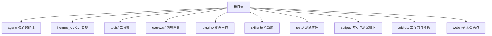
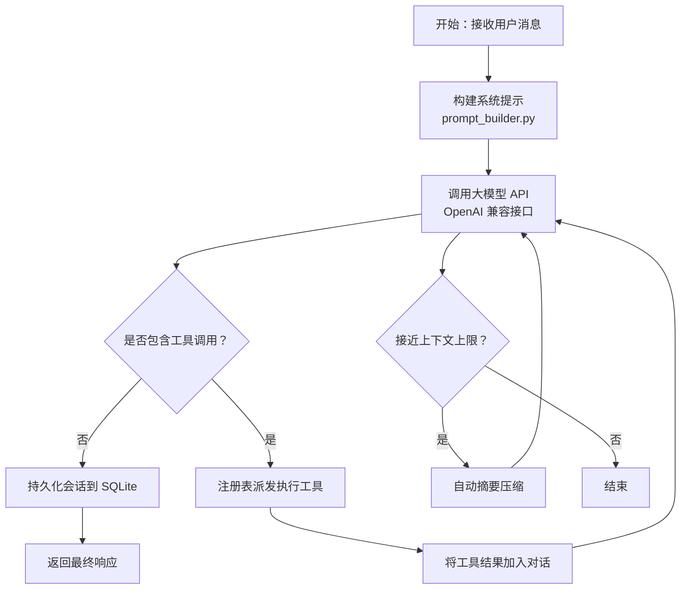
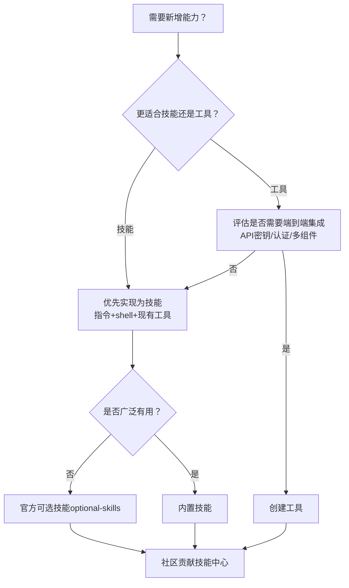
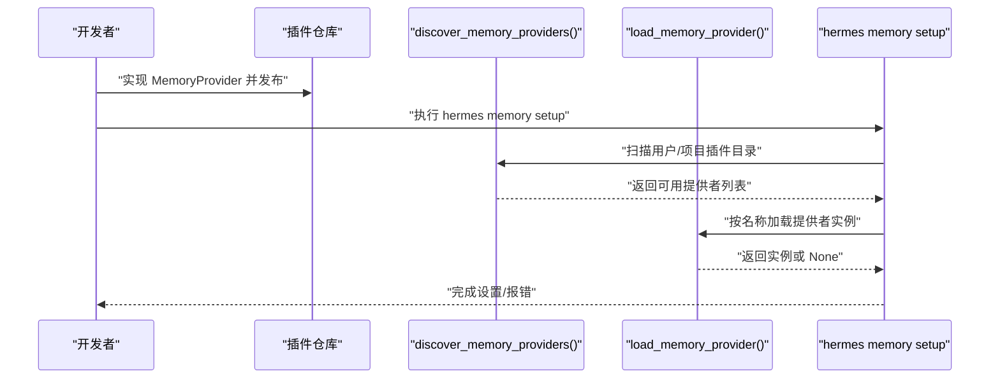
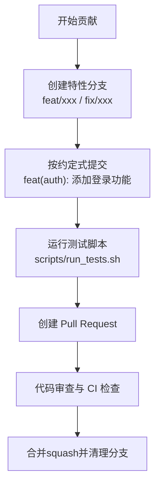
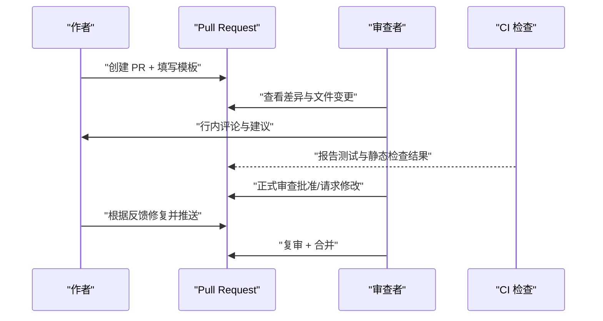
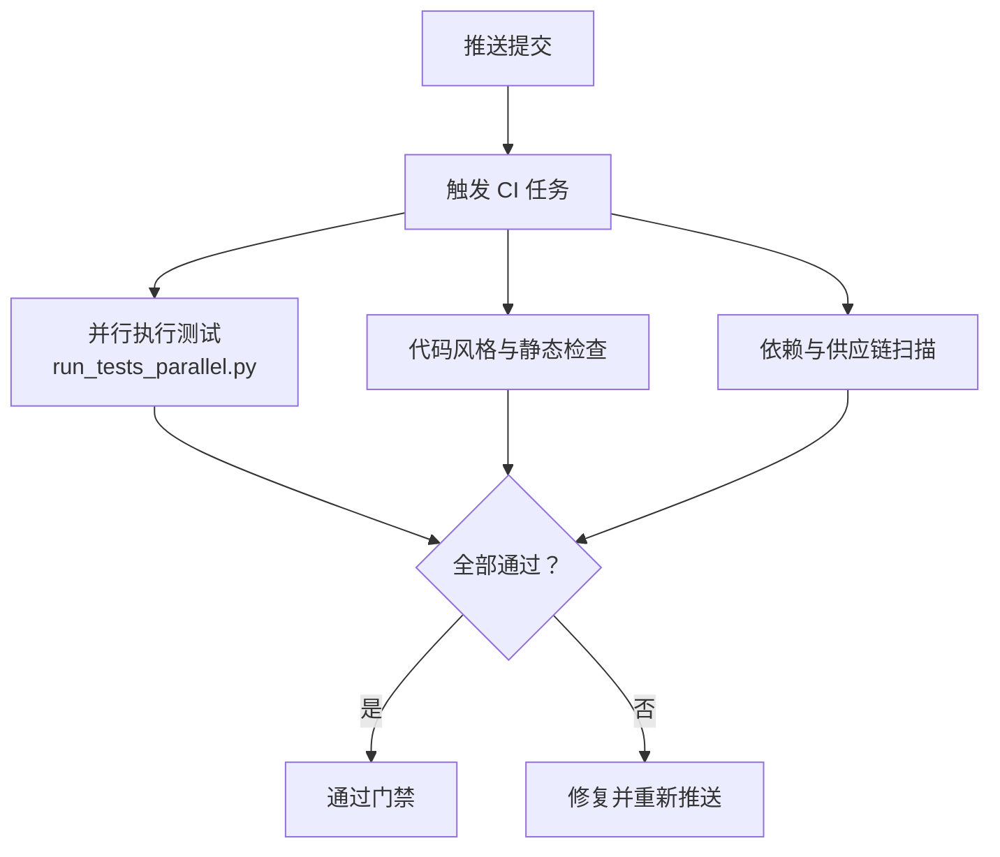
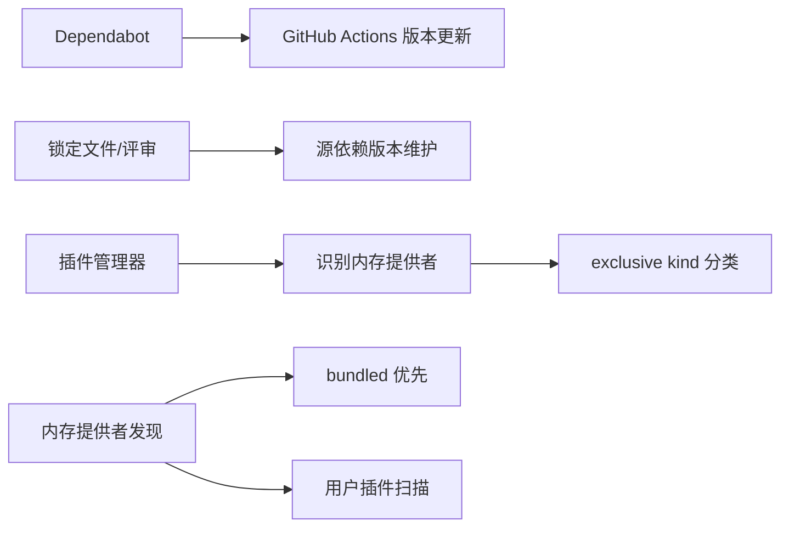

# 代码贡献流程

<cite>
**本文引用的文件**
- [CONTRIBUTING.md](file://CONTRIBUTING.md)
- [SECURITY.md](file://SECURITY.md)
- [.github/PULL_REQUEST_TEMPLATE.md](file://.github/PULL_REQUEST_TEMPLATE.md)
- [README.md](file://README.md)
- [.github/dependabot.yml](file://.github/dependabot.yml)
- [scripts/run_tests.sh](file://scripts/run_tests.sh)
- [scripts/run_tests_parallel.py](file://scripts/run_tests_parallel.py)
- [skills/github/github-pr-workflow/SKILL.md](file://skills/github/github-pr-workflow/SKILL.md)
- [skills/github/github-code-review/SKILL.md](file://skills/github/github-code-review/SKILL.md)
- [plugins/memory/__init__.py](file://plugins/memory/__init__.py)
- [hermes_cli/plugins.py](file://hermes_cli/plugins.py)
- [tests/agent/test_memory_provider.py](file://tests/agent/test_memory_provider.py)
- [optional-skills/DESCRIPTION.md](file://optional-skills/DESCRIPTION.md)
- [website/docs/user-guide/git-worktrees.md](file://website/docs/user-guide/git-worktrees.md)
</cite>

## 目录
1. [引言](#引言)
2. [项目结构](#项目结构)
3. [核心组件](#核心组件)
4. [架构总览](#架构总览)
5. [详细组件分析](#详细组件分析)
6. [依赖关系分析](#依赖关系分析)
7. [性能考量](#性能考量)
8. [故障排查指南](#故障排查指南)
9. [结论](#结论)
10. [附录](#附录)

## 引言
本指南面向所有希望为 Hermes Agent 贡献代码的开发者，系统化阐述贡献优先级与原则、技能与工具的选择标准、内存提供者的独立插件发布流程、分支与提交规范、代码审查流程、Pull Request 的创建与合并流程、CI 检查与代码质量门禁，以及贡献者行为准则与社区参与方式。内容基于仓库现有贡献文档、安全政策、模板与脚本，确保可执行、可落地。

## 项目结构
Hermes Agent 采用模块化分层组织，核心入口与运行时分布在多个子目录中，便于贡献者快速定位职责边界与开发路径。下图展示主要模块与其职责概览：

图表来源
- [CONTRIBUTING.md:172-254](file://CONTRIBUTING.md#L172-L254)

章节来源
- [CONTRIBUTING.md:172-254](file://CONTRIBUTING.md#L172-L254)

## 核心组件
- 贡献优先级与原则
  - 优先级排序：缺陷修复、跨平台兼容性、安全加固、性能与鲁棒性、新技能、新工具、文档。
  - 选择标准：技能优先于工具；仅当需要端到端集成、自定义处理逻辑或实时事件时才考虑工具。
  - 内存提供者：不再接受内置内存提供者，建议以独立插件形式发布至用户插件目录或 pip 入口点。
- 开发环境与测试
  - 推荐使用标准安装器创建开发环境，确保与 CI 一致的测试执行。
  - 使用统一测试脚本与并行执行器保证无泄漏、确定性与隔离。
- 安全与合规
  - 遵循安全政策，明确信任边界与外部表面授权模型。
  - 依赖更新策略：仅对 GitHub Actions 启用 Dependabot，源依赖通过锁定文件与手动评审维护。

章节来源
- [CONTRIBUTING.md:7-18](file://CONTRIBUTING.md#L7-L18)
- [CONTRIBUTING.md:21-49](file://CONTRIBUTING.md#L21-L49)
- [CONTRIBUTING.md:52-68](file://CONTRIBUTING.md#L52-L68)
- [SECURITY.md:1-332](file://SECURITY.md#L1-L332)
- [.github/dependabot.yml:1-45](file://.github/dependabot.yml#L1-L45)

## 架构总览
Hermes Agent 的核心对话循环由智能体驱动，围绕系统提示构建、工具调用调度、会话持久化与上下文压缩展开。下图给出关键流程示意：

图表来源
- [CONTRIBUTING.md:257-284](file://CONTRIBUTING.md#L257-L284)

章节来源
- [CONTRIBUTING.md:257-284](file://CONTRIBUTING.md#L257-L284)

## 详细组件分析

### 贡献优先级与决策树
- 优先级排序
  - 缺陷修复（崩溃、行为异常、数据丢失）优先级最高。
  - 跨平台兼容性（macOS、Linux、WSL2、Windows）必须满足。
  - 安全加固（注入、路径遍历、权限提升）严格把关。
  - 性能与鲁棒性（重试、错误处理、优雅降级）持续优化。
  - 新技能（广泛有用）、新工具（极少需要）、文档（修复与示例）。
- 技能与工具选择决策树
  - 优先技能：可通过“指令 + shell + 现有工具”表达的能力；不需在代理中内置密钥管理或自定义 Python 集成。
  - 工具适用场景：需要端到端集成 API 密钥、认证流程、多组件配置；需要精确执行的定制逻辑；处理二进制、流式或实时事件。
  - 是否打包：广泛有用的内置技能；官方可选技能放入 optional-skills；社区贡献放入技能中心。
- 内存提供者独立插件发布
  - 不再接受内置内存提供者；建议以独立插件发布至 ~/.hermes/plugins/ 或 pip 入口点。
  - 遵循 MemoryProvider 抽象与发现机制，支持 setup 集成与 CLI 子命令注册。

图表来源
- [CONTRIBUTING.md:21-49](file://CONTRIBUTING.md#L21-L49)
- [CONTRIBUTING.md:52-68](file://CONTRIBUTING.md#L52-L68)

章节来源
- [CONTRIBUTING.md:7-18](file://CONTRIBUTING.md#L7-L18)
- [CONTRIBUTING.md:21-49](file://CONTRIBUTING.md#L21-L49)
- [CONTRIBUTING.md:52-68](file://CONTRIBUTING.md#L52-L68)

### 内存提供者独立插件发布流程与要求
- 发布要求
  - 实现 MemoryProvider 抽象（sync_turn、prefetch、shutdown，可选 post_setup）。
  - 使用 discover_memory_providers() 发现用户/项目插件目录与 pip 入口点。
  - 通过 hermes memory setup 的 post_setup() 集成设置向导。
  - 可在 cli.py 中注册自有 CLI 子命令。
  - 享有与内置提供者相同的生命周期钩子与配置管线。
- 加载与发现
  - bundled 优先于用户安装插件；非内存类用户插件会被跳过。
  - hermes_cli.plugins 自动识别并归类为 exclusive kind 的内存提供者。
- 回归与测试
  - 单元测试覆盖发现、加载与冲突处理；确保 bundled 优先与去重。

图表来源
- [CONTRIBUTING.md:52-68](file://CONTRIBUTING.md#L52-L68)
- [plugins/memory/__init__.py:74-216](file://plugins/memory/__init__.py#L74-L216)
- [hermes_cli/plugins.py:1422-1448](file://hermes_cli/plugins.py#L1422-L1448)
- [tests/agent/test_memory_provider.py:419-529](file://tests/agent/test_memory_provider.py#L419-L529)

章节来源
- [CONTRIBUTING.md:52-68](file://CONTRIBUTING.md#L52-L68)
- [plugins/memory/__init__.py:74-216](file://plugins/memory/__init__.py#L74-L216)
- [hermes_cli/plugins.py:1422-1448](file://hermes_cli/plugins.py#L1422-L1448)
- [tests/agent/test_memory_provider.py:419-529](file://tests/agent/test_memory_provider.py#L419-L529)

### 分支管理策略与提交信息规范
- 分支命名
  - feat/description：新功能
  - fix/description：缺陷修复
  - refactor/description：重构
  - docs/description：文档
  - ci/description：CI/CD 变更
- 提交信息规范
  - 遵循约定式提交（Conventional Commits），例如 feat(scope)、fix(scope)、perf(scope) 等。
  - 支持 BREAKING CHANGE 标记与脚本解析。
- 工作流与实验
  - 使用 git worktree 为不同实验创建干净检出，避免相互干扰。
  - 结合分支记录实验历史，配合检查点与回滚机制。

图表来源
- [skills/github/github-pr-workflow/SKILL.md:76-88](file://skills/github/github-pr-workflow/SKILL.md#L76-L88)
- [skills/github/github-pr-workflow/SKILL.md:295-305](file://skills/github/github-pr-workflow/SKILL.md#L295-L305)
- [website/docs/user-guide/git-worktrees.md:55-104](file://website/docs/user-guide/git-worktrees.md#L55-L104)

章节来源
- [skills/github/github-pr-workflow/SKILL.md:76-88](file://skills/github/github-pr-workflow/SKILL.md#L76-L88)
- [skills/github/github-pr-workflow/SKILL.md:295-305](file://skills/github/github-pr-workflow/SKILL.md#L295-L305)
- [website/docs/user-guide/git-worktrees.md:55-104](file://website/docs/user-guide/git-worktrees.md#L55-L104)

### 代码审查流程与 PR 模板
- PR 模板要点
  - 清晰描述变更目的、解决的问题与方法论。
  - 明确类型标签（缺陷修复、新功能、安全修复、文档、测试、重构、新技能等）。
  - 包含变更列表、测试步骤与平台验证信息。
  - 新技能需满足“广泛有用”“遵循标准格式”“无额外外部依赖”“端到端测试”等要求。
- 审查清单与实践
  - 正确性、安全性、代码质量、测试、性能、文档。
  - 使用行内评论与正式审查（批准/请求修改/评论）。
  - 本地检出 PR 进行完整审查与自动化检查。

图表来源
- [.github/PULL_REQUEST_TEMPLATE.md:1-76](file://.github/PULL_REQUEST_TEMPLATE.md#L1-L76)
- [skills/github/github-code-review/SKILL.md:371-425](file://skills/github/github-code-review/SKILL.md#L371-L425)

章节来源
- [.github/PULL_REQUEST_TEMPLATE.md:1-76](file://.github/PULL_REQUEST_TEMPLATE.md#L1-L76)
- [skills/github/github-code-review/SKILL.md:371-425](file://skills/github/github-code-review/SKILL.md#L371-L425)

### CI 检查、代码质量门禁与测试执行
- 统一测试执行
  - 使用 scripts/run_tests.sh 与 scripts/run_tests_parallel.py，确保每文件隔离、确定性环境变量与并行执行。
  - CI 行为一致性：TZ=UTC、LANG=C.UTF-8、PYTHONHASHSEED=0、无凭证泄露风险。
- 代码质量门禁
  - 依赖更新：仅对 GitHub Actions 启用 Dependabot；源依赖通过锁定文件与手动评审维护。
  - 依赖安全更新：仅在 CVE 影响已锁定版本时开启安全更新 PR。
- 常见 CI 失败诊断
  - 测试失败：定位具体文件与断言，修复或更新测试。
  - Lint/格式失败：按 linter 报告修正或本地修复后再提交。

图表来源
- [scripts/run_tests.sh:1-80](file://scripts/run_tests.sh#L1-L80)
- [scripts/run_tests_parallel.py:246-341](file://scripts/run_tests_parallel.py#L246-L341)
- [.github/dependabot.yml:1-45](file://.github/dependabot.yml#L1-L45)

章节来源
- [scripts/run_tests.sh:1-80](file://scripts/run_tests.sh#L1-L80)
- [scripts/run_tests_parallel.py:246-341](file://scripts/run_tests_parallel.py#L246-L341)
- [.github/dependabot.yml:1-45](file://.github/dependabot.yml#L1-L45)

### 贡献者行为准则与社区参与
- 行为准则
  - 私密漏洞报告：通过 GitHub Security Advisories 或邮件提交，避免公开 issue。
  - 信任模型与边界：仅操作系统隔离构成真实边界；内部启发式仅为辅助。
  - 外部表面授权：网络暴露适配器必须配置允许列表；本地 IPC 遵守 OS 级访问控制。
- 社区参与
  - Discord 社区、技能中心（Skills Hub）、GitHub Issues。
  - 重要文档与参考：安装、入门、CLI、配置、安全、工具与技能系统、架构、贡献指南等。

章节来源
- [SECURITY.md:7-332](file://SECURITY.md#L7-L332)
- [README.md:180-224](file://README.md#L180-L224)

## 依赖关系分析
- 依赖更新策略
  - 仅启用 GitHub Actions 的 Dependabot，定期批量更新动作版本，减少噪音。
  - 源依赖通过锁定文件与手动评审维护，CVE 触发的安全更新单独处理。
- 插件与内存提供者发现
  - 插件管理器自动识别内存提供者插件并归类为 exclusive kind。
  - 内存提供者发现扫描 bundled 与用户插件目录，bundled 优先且去重。

图表来源
- [.github/dependabot.yml:1-45](file://.github/dependabot.yml#L1-L45)
- [hermes_cli/plugins.py:1422-1448](file://hermes_cli/plugins.py#L1422-L1448)
- [plugins/memory/__init__.py:74-216](file://plugins/memory/__init__.py#L74-L216)

章节来源
- [.github/dependabot.yml:1-45](file://.github/dependabot.yml#L1-L45)
- [hermes_cli/plugins.py:1422-1448](file://hermes_cli/plugins.py#L1422-L1448)
- [plugins/memory/__init__.py:74-216](file://plugins/memory/__init__.py#L74-L216)

## 性能考量
- 测试执行性能
  - 每文件隔离与并行执行降低长尾与资源竞争，缩短反馈周期。
  - 确定性环境变量（UTC、UTF-8、哈希种子）避免随机性导致的不稳定。
- 代码质量与可维护性
  - 严格遵循约定式提交与审查清单，减少回归与技术债积累。
  - 通过 git worktree 与检查点机制加速迭代与回滚。

## 故障排查指南
- CI 失败常见模式
  - 测试失败：定位断言与异常栈，区分逻辑错误与过期断言。
  - Lint/格式失败：按 linter 报告逐项修正，保持一致风格。
- 本地测试与并行执行
  - 使用统一测试脚本与并行执行器，确保与 CI 环境一致。
  - 对大型 PR，先查看 stat 与文件列表，再逐文件核对差异与上下文。

章节来源
- [skills/github/github-pr-workflow/SKILL.md:170-293](file://skills/github/github-pr-workflow/SKILL.md#L170-L293)
- [scripts/run_tests.sh:1-80](file://scripts/run_tests.sh#L1-L80)
- [scripts/run_tests_parallel.py:495-725](file://scripts/run_tests_parallel.py#L495-L725)

## 结论
本指南将贡献优先级、技能与工具选择、内存提供者独立插件发布、分支与提交规范、代码审查与 CI 门禁、安全与合规、以及社区参与方式整合为一套可执行的流程。建议贡献者在提交前对照模板与清单，确保变更清晰、测试完备、安全可控，并通过社区渠道积极沟通协作。

## 附录
- 官方可选技能说明
  - optional-skills 用于存放不默认激活但官方维护的技能，通过技能中心发现与安装。
- 相关文档链接
  - 安装与入门、CLI、配置、安全、工具与技能系统、架构、贡献指南等文档位于网站文档站点。

章节来源
- [optional-skills/DESCRIPTION.md:1-25](file://optional-skills/DESCRIPTION.md#L1-L25)
- [README.md:126-148](file://README.md#L126-L148)