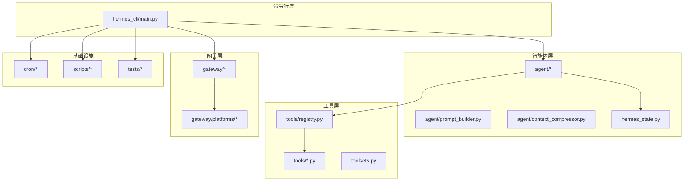
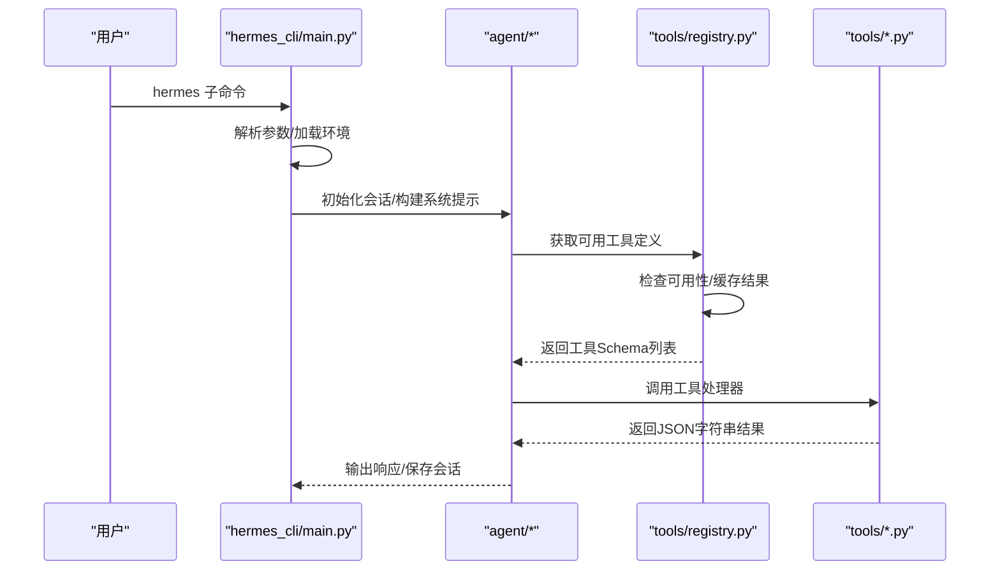
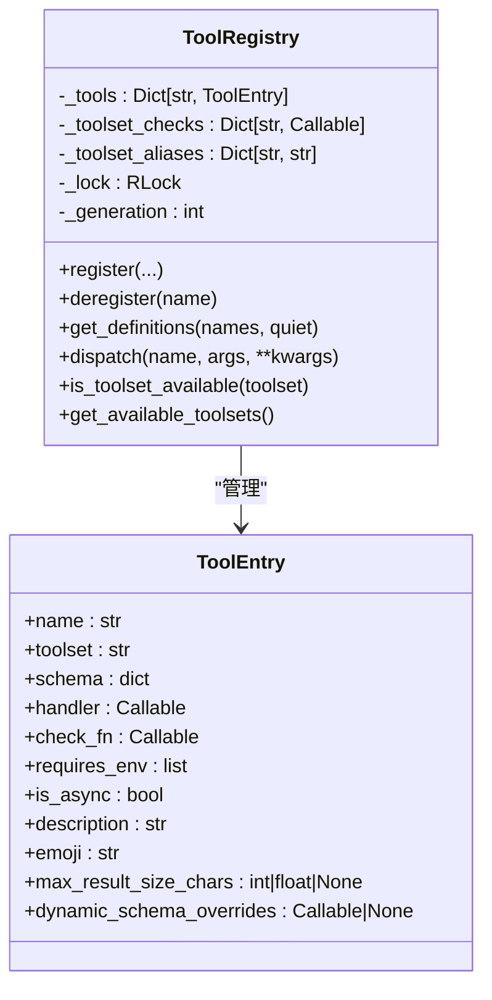
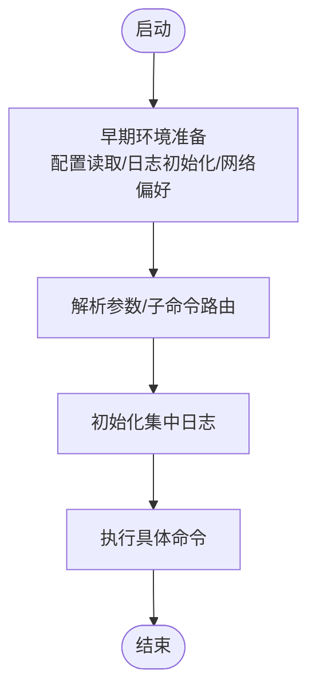
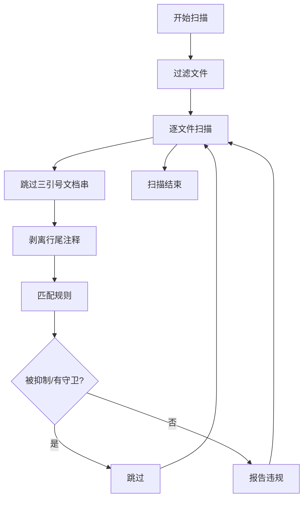
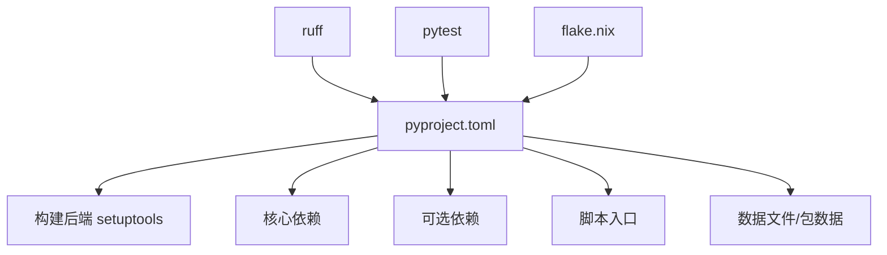

# 代码风格与标准

<cite>
**本文档引用的文件**
- [CONTRIBUTING.md](file://CONTRIBUTING.md)
- [README.md](file://README.md)
- [pyproject.toml](file://pyproject.toml)
- [flake.nix](file://flake.nix)
- [.github/PULL_REQUEST_TEMPLATE.md](file://.github/PULL_REQUEST_TEMPLATE.md)
- [.github/dependabot.yml](file://.github/dependabot.yml)
- [scripts/check-windows-footguns.py](file://scripts/check-windows-footguns.py)
- [hermes_cli/main.py](file://hermes_cli/main.py)
- [tools/registry.py](file://tools/registry.py)
- [agent/errors.py](file://agent/errors.py)
</cite>

## 目录
1. [简介](#简介)
2. [项目结构](#项目结构)
3. [核心组件](#核心组件)
4. [架构总览](#架构总览)
5. [详细组件分析](#详细组件分析)
6. [依赖关系分析](#依赖关系分析)
7. [性能考虑](#性能考虑)
8. [故障排除指南](#故障排除指南)
9. [结论](#结论)
10. [附录](#附录)

## 简介
本文件系统化整理了本项目的代码风格与标准，涵盖以下方面：
- 编码规范：PEP 8 及实践性例外
- 注释编写标准：何时写注释、如何写注释
- 错误处理模式：异常捕获、日志记录、错误返回
- 跨平台编程要求：Windows、macOS、Linux 的差异与防护
- 代码审查标准：分支命名、PR 描述、变更范围
- 测试要求：单元测试、集成测试、跨平台测试
- 文档规范：README、贡献指南、工具文档
- 提交信息格式：Conventional Commits 规范
- 具体示例与违规案例：通过仓库中的真实实现进行说明

## 项目结构
本项目采用模块化分层组织，核心模块包括：
- hermes_cli：命令行入口与子命令解析
- agent：智能体内核（提示词构建、上下文压缩、会话持久化等）
- tools：工具注册与调度（自注册机制）
- gateway：消息网关（多平台适配器）
- cron：定时任务调度
- acp_adapter：ACP 协议适配器
- plugins：插件系统
- scripts：安装与脚本工具
- tests：测试套件

**图示来源**
- [hermes_cli/main.py:1-120](file://hermes_cli/main.py#L1-L120)
- [tools/registry.py:1-120](file://tools/registry.py#L1-L120)
- [pyproject.toml:290-341](file://pyproject.toml#L290-L341)

**章节来源**
- [README.md:170-238](file://README.md#L170-L238)
- [pyproject.toml:290-341](file://pyproject.toml#L290-L341)

## 核心组件
- 命令行入口与生命周期管理：负责进程标题设置、早期接口选择、环境变量加载、日志初始化、配置读取与 IPv4 强制偏好设置等。
- 工具注册中心：集中式工具注册与发现，支持异步工具桥接、可用性检查缓存、动态 schema 覆盖、并发安全快照。
- 跨平台脚本：Windows 安全隐患扫描器，用于在提交前识别潜在的 Windows 不兼容问题。

**章节来源**
- [hermes_cli/main.py:68-158](file://hermes_cli/main.py#L68-L158)
- [tools/registry.py:151-306](file://tools/registry.py#L151-L306)
- [scripts/check-windows-footguns.py:1-120](file://scripts/check-windows-footguns.py#L1-L120)

## 架构总览
下图展示了从命令行到工具执行的关键调用链路，体现“自注册工具”与“工具集”的协作方式。

**图示来源**
- [hermes_cli/main.py:255-320](file://hermes_cli/main.py#L255-L320)
- [tools/registry.py:337-417](file://tools/registry.py#L337-L417)

## 详细组件分析

### 组件A：工具注册中心（ToolRegistry）
- 设计要点
  - 自注册：每个工具文件在导入时调用注册函数，注册中心统一收集。
  - 并发安全：使用可重入锁保护注册表状态，读操作返回稳定快照。
  - 可用性检查：对工具集检查函数进行 TTL 缓存，避免频繁探测外部状态。
  - 动态 schema：支持运行时动态覆盖工具描述，以反映当前配置限制。
  - 错误处理：工具执行异常统一包装为 JSON 错误字符串，便于模型消费。
- 关键流程
  - 注册：校验工具名与工具集冲突，支持 MCP 覆盖场景。
  - 查询：按工具名集合返回 OpenAI 格式的函数 schema 列表。
  - 分发：根据是否异步自动桥接，捕获异常并进行错误净化。
  - 可用性：评估工具集整体可用性，输出 UI 所需元数据。

**图示来源**
- [tools/registry.py:151-306](file://tools/registry.py#L151-L306)
- [tools/registry.py:77-107](file://tools/registry.py#L77-L107)

**章节来源**
- [tools/registry.py:151-306](file://tools/registry.py#L151-L306)
- [tools/registry.py:337-417](file://tools/registry.py#L337-L417)
- [tools/registry.py:563-590](file://tools/registry.py#L563-L590)

### 组件B：命令行入口（hermes_cli/main.py）
- 设计要点
  - 早期优化：鼠标残留抑制、终端接口快速判定、Termux 启动路径优化。
  - 配置与环境：优先级策略（命令行 > 环境变量 > 配置文件），IPv4 强制偏好。
  - 日志初始化：集中式文件日志，GUI/CLI 模式区分。
  - 安全与兼容：UTF-8 标准输入输出设置，进程标题设置（跨平台）。
- 关键流程
  - 参数解析前的环境准备（配置读取、日志初始化、网络偏好）。
  - 子命令解析与路由。
  - 版本信息与项目根路径打印。

**图示来源**
- [hermes_cli/main.py:508-576](file://hermes_cli/main.py#L508-L576)
- [hermes_cli/main.py:255-320](file://hermes_cli/main.py#L255-L320)

**章节来源**
- [hermes_cli/main.py:68-158](file://hermes_cli/main.py#L68-L158)
- [hermes_cli/main.py:508-576](file://hermes_cli/main.py#L508-L576)

### 组件C：跨平台脚本（check-windows-footguns.py）
- 设计要点
  - 规则驱动：内置一组常见 Windows 不兼容模式（如 os.kill(pid,0)、裸 os.setsid、信号常量等）。
  - 抑制机制：支持行内抑制标记与路径白名单，减少误报。
  - 扫描范围：默认扫描暂存区变更，支持全仓库扫描或指定路径。
- 关键流程
  - 文件过滤：排除目录、后缀、特定文件。
  - 行级扫描：跳过三引号文档串，剥离注释，应用正则匹配与后置过滤。
  - 结果输出：统计匹配数并给出修复建议。

**图示来源**
- [scripts/check-windows-footguns.py:411-485](file://scripts/check-windows-footguns.py#L411-L485)
- [scripts/check-windows-footguns.py:553-628](file://scripts/check-windows-footguns.py#L553-L628)

**章节来源**
- [scripts/check-windows-footguns.py:138-327](file://scripts/check-windows-footguns.py#L138-L327)
- [scripts/check-windows-footguns.py:553-628](file://scripts/check-windows-footguns.py#L553-L628)

### 组件D：错误类型（agent/errors.py）
- 设计要点
  - 明确的异常类型：SSL/TLS 证书配置失败专用异常，便于上层捕获与处理。
  - 语义化命名：异常类名直接表达错误场景，提升可读性与可维护性。

**章节来源**
- [agent/errors.py:1-4](file://agent/errors.py#L1-L4)

## 依赖关系分析
- 包管理与构建
  - 使用 setuptools 构建后端，明确版本范围与上限约束，确保可重复构建。
  - 严格控制依赖上限（尤其是 PyPI 包），防止供应链攻击。
- 开发工具
  - pytest：测试框架；ruff：lint 工具，仅启用关键规则（如未显式指定 encoding）。
  - flake.nix：Nix 构建入口，定义系统与包集合。
- 依赖策略
  - 仅在必要时懒加载第三方后端，降低安装体积与启动时间。
  - 依赖固定与安全更新：依赖机器人仅处理 GitHub Actions，源依赖通过安全更新 PR 处理已知漏洞版本。

**图示来源**
- [pyproject.toml:1-133](file://pyproject.toml#L1-L133)
- [pyproject.toml:359-379](file://pyproject.toml#L359-L379)
- [flake.nix:28-44](file://flake.nix#L28-L44)

**章节来源**
- [pyproject.toml:1-133](file://pyproject.toml#L1-L133)
- [pyproject.toml:359-379](file://pyproject.toml#L359-L379)
- [.github/dependabot.yml:1-45](file://.github/dependabot.yml#L1-L45)

## 性能考虑
- 工具可用性检查缓存：对工具集检查函数进行 TTL 缓存，避免高频探测外部状态（如容器守护进程、二进制可用性）。
- 运行时动态 schema：仅在需要时计算动态覆盖（如委托任务的并发限制），并通过生成器计数器保证缓存有效性。
- 启动路径优化：命令行入口在早期阶段完成最小化配置读取与日志初始化，减少不必要的开销。
- 跨平台兼容：通过 psutil 替代 POSIX 特有 API（如 os.kill(pid,0)），在 Windows 上避免静默杀进程与广播事件。

**章节来源**
- [tools/registry.py:121-148](file://tools/registry.py#L121-L148)
- [tools/registry.py:337-384](file://tools/registry.py#L337-L384)
- [hermes_cli/main.py:508-576](file://hermes_cli/main.py#L508-L576)
- [CONTRIBUTING.md:627-798](file://CONTRIBUTING.md#L627-L798)

## 故障排除指南
- 常见错误类型
  - SSL/TLS 配置错误：使用专用异常类型以便上层统一处理。
  - 工具执行失败：统一包装为 JSON 字符串错误，经净化后返回给模型，避免结构噪声。
- 跨平台问题
  - Windows 安全隐患：使用脚本扫描常见陷阱（如裸 os.kill(pid,0)、信号常量、进程分离等），并在 CI 中强制执行。
  - 文件编码与换行：文本文件读写必须显式指定 encoding；Windows 脚本生成使用 CRLF。
- 审计与抑制
  - 对于确有必要的平台差异，使用行内抑制标记或路径白名单，但应配合注释说明原因。

**章节来源**
- [agent/errors.py:1-4](file://agent/errors.py#L1-L4)
- [tools/registry.py:405-416](file://tools/registry.py#L405-L416)
- [scripts/check-windows-footguns.py:420-485](file://scripts/check-windows-footguns.py#L420-L485)
- [CONTRIBUTING.md:627-798](file://CONTRIBUTING.md#L627-L798)

## 结论
本项目的代码风格与标准围绕“可维护、可扩展、可跨平台”展开，强调：
- 严格的依赖管理与供应链安全
- 清晰的错误处理与日志记录
- 跨平台兼容性的主动防御
- 以工具注册为中心的模块化设计
- 以 Conventional Commits 与 PR 模板为核心的协作流程

这些实践共同保障了系统的稳定性与可演进性。

## 附录

### 代码风格与标准清单
- 编码规范
  - 遵循 PEP 8，不强制严格行长限制
  - 函数/类/模块注释：解释非显而易见的设计意图、权衡与 API 差异
  - 错误处理：捕获具体异常；使用 logger.warning/logger.error，并在意外错误时开启 exc_info
  - 跨平台：避免假设 Unix 环境，遵循跨平台兼容指南
- 注释编写
  - 仅在解释非显而易见之处添加注释，避免“叙述代码做了什么”
  - 对 API 差异、历史原因、安全注意事项进行说明
- 错误处理模式
  - 工具执行失败统一返回 JSON 字符串错误
  - 异常净化：去除可能影响模型结构的特殊字符
  - 专用异常类型用于明确错误场景
- 跨平台编程要求
  - 使用 psutil 替代 os.kill(pid,0)、os.setsid、os.killpg 等
  - 使用 shutil.which 检测工具存在性，Windows 下回退到 PowerShell
  - 文件路径使用 pathlib，避免硬编码分隔符
  - 文本文件读写显式指定 encoding，Windows 脚本生成使用 CRLF
- 代码审查标准
  - 分支命名：fix/feat/docs/test/refactor/chore
  - PR 描述：说明变更内容、动机、测试方法、平台覆盖
  - 提交信息：Conventional Commits，scope 限定在 cli/gateway/tools/skills/agent 等
- 测试要求
  - 单元测试：pytest，尽量使用标准库与 pytest、unittest.mock
  - 集成测试：带标记，CI 默认禁用，可通过选项启用
  - 跨平台测试：对 POSIX-only 系统调用使用 pytest 标记跳过
- 文档规范
  - README 与贡献指南保持一致，技能文档遵循标准格式
  - 依赖固定与安全更新策略清晰可见
- 提交信息格式
  - 类型(scope): 描述
  - 示例：fix(cli): 防止保存配置值时的崩溃；feat(gateway): 添加 WhatsApp 多用户会话隔离

**章节来源**
- [CONTRIBUTING.md:287-294](file://CONTRIBUTING.md#L287-L294)
- [CONTRIBUTING.md:884-937](file://CONTRIBUTING.md#L884-L937)
- [pyproject.toml:343-350](file://pyproject.toml#L343-L350)
- [.github/PULL_REQUEST_TEMPLATE.md:1-76](file://.github/PULL_REQUEST_TEMPLATE.md#L1-L76)
- [.github/dependabot.yml:1-45](file://.github/dependabot.yml#L1-L45)

### 具体示例与违规案例（基于仓库实现）
- 正确示例
  - 工具注册：在工具文件中调用注册函数，schema 与 handler 明确分离，支持动态覆盖与异步桥接
  - 错误返回：工具处理器统一返回 JSON 字符串，失败时包含错误字段
  - 跨平台检测：使用 shutil.which 检测工具存在性，Windows 回退到 PowerShell
- 违规案例（依据脚本规则）
  - os.kill(pid,0)：在 Windows 上会广播 Ctrl+C 事件，可能导致目标进程及其同组进程被意外终止
  - 裸 os.setsid/os.killpg：Windows 上不存在该 API，会导致 AttributeError
  - 未显式指定 encoding 的 open()：在 Windows 上默认编码为 cp1252，可能导致文件损坏
  - 信号常量引用：SIGKILL/SIGALRM 等在 Windows 上不存在，引用会触发 AttributeError
  - 子进程 shebang 调用：在 Windows 上无法直接执行以 ./ 开头的脚本，需显式指定解释器

**章节来源**
- [tools/registry.py:248-306](file://tools/registry.py#L248-L306)
- [tools/registry.py:563-590](file://tools/registry.py#L563-L590)
- [scripts/check-windows-footguns.py:138-327](file://scripts/check-windows-footguns.py#L138-L327)
- [CONTRIBUTING.md:627-798](file://CONTRIBUTING.md#L627-L798)