# 内存提供者发布政策

<cite>
**本文档引用的文件**
- [memory_provider.py](file://agent/memory_provider.py)
- [memory_manager.py](file://agent/memory_manager.py)
- [memory_setup.py](file://hermes_cli/memory_setup.py)
- [plugins/memory/__init__.py](file://plugins/memory/__init__.py)
- [plugins/memory/honcho/__init__.py](file://plugins/memory/honcho/__init__.py)
- [plugins/memory/mem0/__init__.py](file://plugins/memory/mem0/__init__.py)
- [plugins/memory/supermemory/__init__.py](file://plugins/memory/supermemory/__init__.py)
- [CONTRIBUTING.md](file://CONTRIBUTING.md)
- [tests/agent/test_memory_provider.py](file://tests/agent/test_memory_provider.py)
- [tests/agent/test_memory_async_sync.py](file://tests/agent/test_memory_async_sync.py)
- [tests/plugins/memory/test_openviking_provider.py](file://tests/plugins/memory/test_openviking_provider.py)
- [tests/hermes_cli/test_plugin_cli_registration.py](file://tests/hermes_cli/test_plugin_cli_registration.py)
</cite>

## 目录
1. [简介](#简介)
2. [项目结构](#项目结构)
3. [核心组件](#核心组件)
4. [架构概览](#架构概览)
5. [详细组件分析](#详细组件分析)
6. [依赖关系分析](#依赖关系分析)
7. [性能考虑](#性能考虑)
8. [故障排除指南](#故障排除指南)
9. [结论](#结论)
10. [附录](#附录)

## 简介

本文档详细说明了Hermes Agent项目的内存提供者发布政策。根据项目贡献指南，**不再接受新的内存提供者进入主仓库**，所有内存提供者必须以独立插件的形式发布。

这一决策基于以下考虑：
- **耦合性和维护性**：内存提供者是最常见的插件类型，不应全部驻留在主仓库中
- **质量控制**：通过独立发布确保更好的质量保证和版本管理
- **生态系统发展**：鼓励社区开发和维护自己的内存提供者插件

## 项目结构

Hermes Agent采用模块化架构，内存提供者系统由多个关键组件组成：

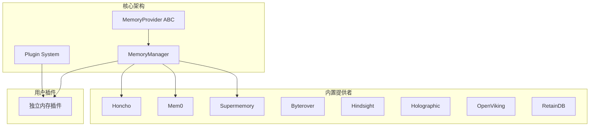

**图表来源**
- [memory_provider.py:1-297](file://agent/memory_provider.py#L1-L297)
- [memory_manager.py:313-318](file://agent/memory_manager.py#L313-L318)
- [plugins/memory/__init__.py:1-216](file://plugins/memory/__init__.py#L1-L216)

**章节来源**
- [CONTRIBUTING.md:52-69](file://CONTRIBUTING.md#L52-L69)
- [plugins/memory/__init__.py:1-216](file://plugins/memory/__init__.py#L1-L216)

## 核心组件

### MemoryProvider 抽象基类

MemoryProvider是所有内存提供者的抽象基类，定义了完整的生命周期接口：

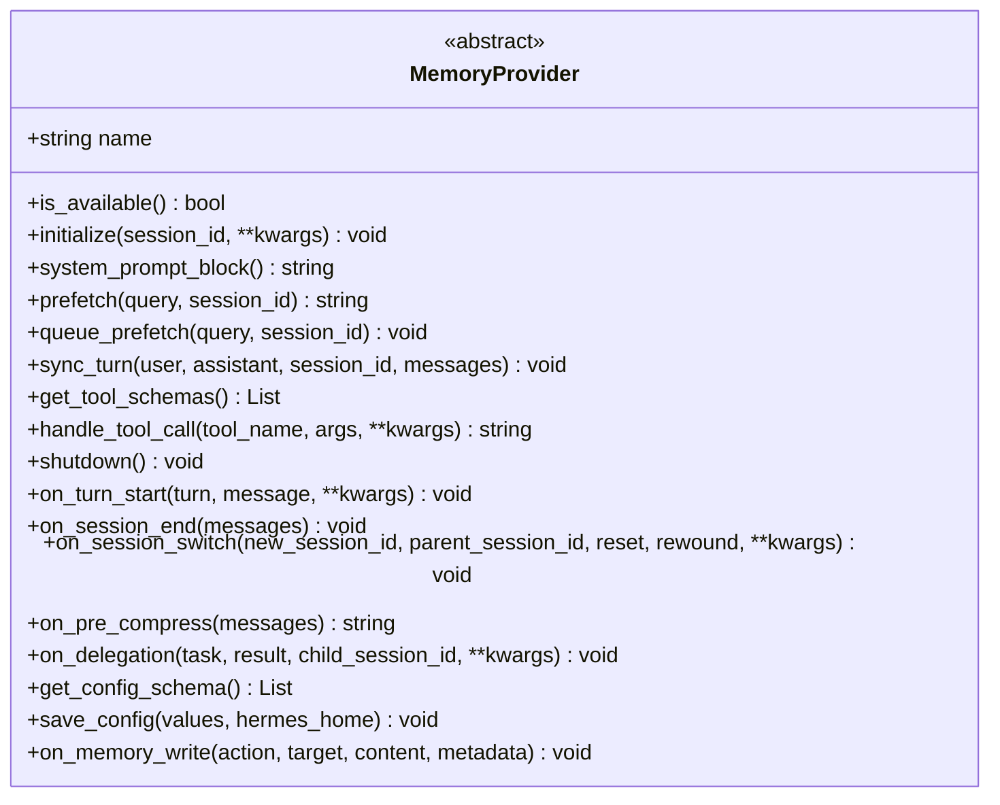

**图表来源**
- [memory_provider.py:42-297](file://agent/memory_provider.py#L42-L297)

### MemoryManager 管理器

MemoryManager负责协调内存提供者，确保一次只激活一个外部提供者：

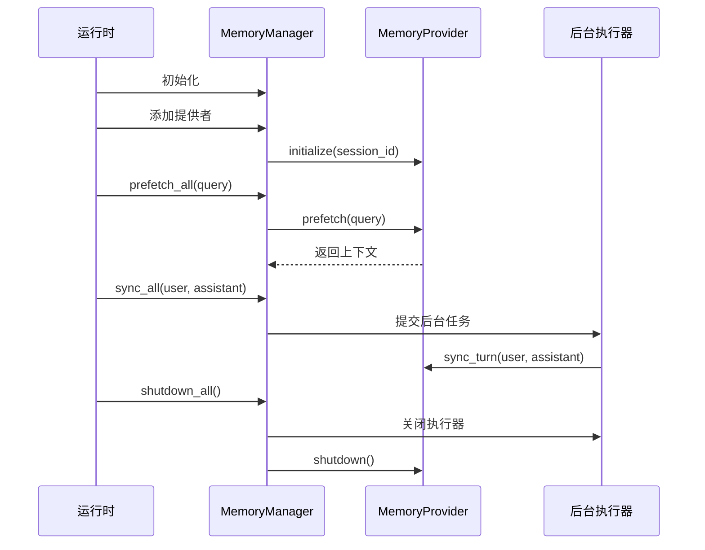

**图表来源**
- [memory_manager.py:313-800](file://agent/memory_manager.py#L313-L800)

**章节来源**
- [memory_provider.py:1-297](file://agent/memory_provider.py#L1-L297)
- [memory_manager.py:1-800](file://agent/memory_manager.py#L1-L800)

## 架构概览

内存提供者系统的整体架构设计体现了松耦合和高内聚的原则：

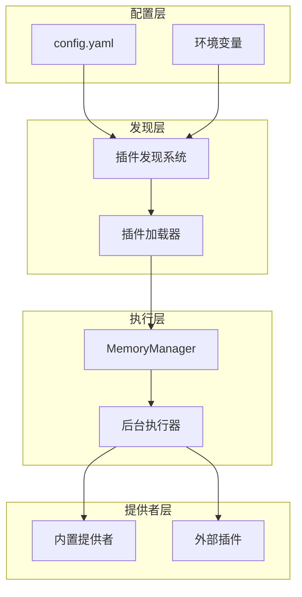

**图表来源**
- [plugins/memory/__init__.py:146-183](file://plugins/memory/__init__.py#L146-L183)
- [memory_manager.py:313-360](file://agent/memory_manager.py#L313-L360)

## 详细组件分析

### 插件发现系统

插件发现系统支持两种类型的内存提供者：

1. **内置提供者**：位于`plugins/memory/`目录下
2. **用户安装的提供者**：位于`$HERMES_HOME/plugins/`目录下

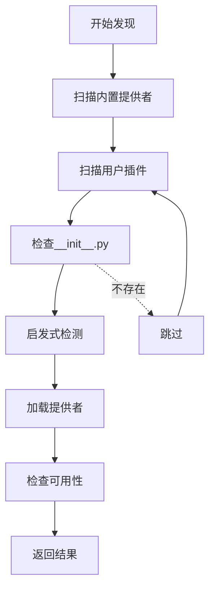

**图表来源**
- [plugins/memory/__init__.py:74-108](file://plugins/memory/__init__.py#L74-L108)
- [plugins/memory/__init__.py:183-216](file://plugins/memory/__init__.py#L183-L216)

### 独立插件开发要求

#### 必需实现

每个独立内存插件必须实现以下要求：

1. **实现MemoryProvider ABC**：完整实现所有抽象方法
2. **使用发现系统**：通过插件发现机制自动识别
3. **集成hermes memory setup**：支持配置向导
4. **注册CLI子命令**：可选但推荐

#### 配置系统

插件需要提供配置模式定义：

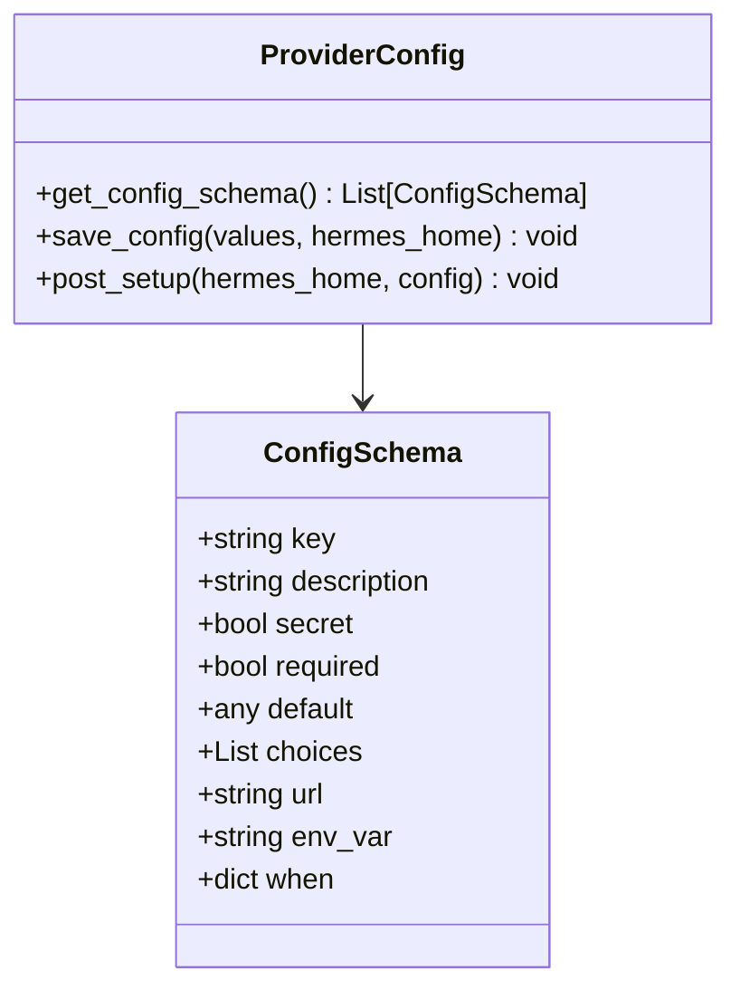

**图表来源**
- [memory_provider.py:244-277](file://agent/memory_provider.py#L244-L277)
- [memory_setup.py:270-360](file://hermes_cli/memory_setup.py#L270-L360)

### 具体插件实现示例

#### Honcho 提供者

Honcho提供了完整的AI原生内存实现：

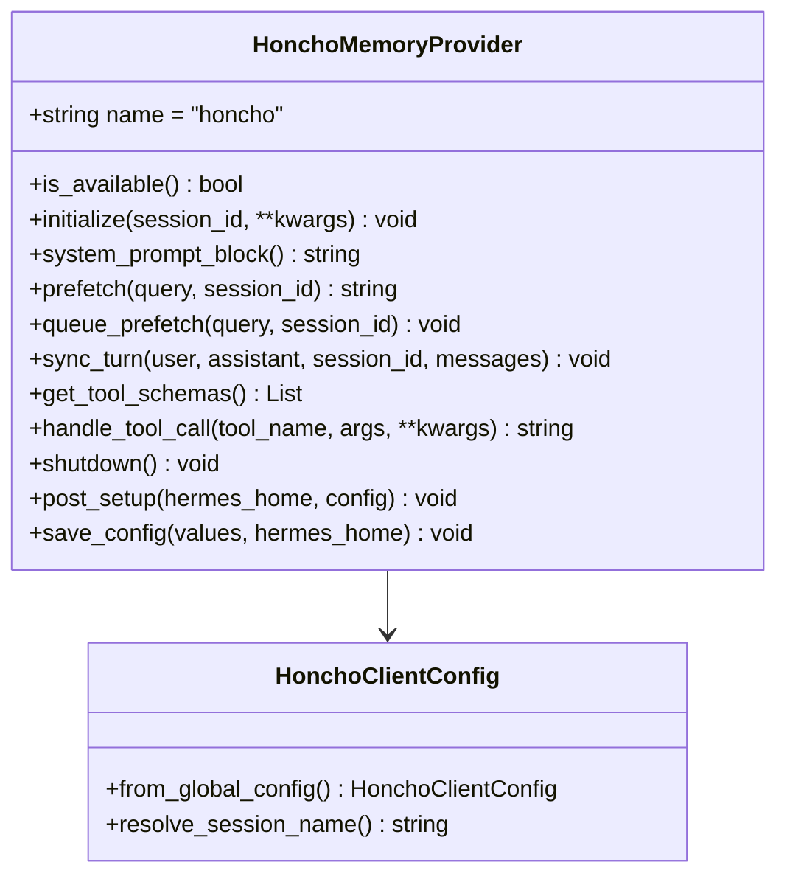

**图表来源**
- [plugins/memory/honcho/__init__.py:191-280](file://plugins/memory/honcho/__init__.py#L191-L280)

#### Mem0 提供者

Mem0实现了服务器端LLM事实提取：

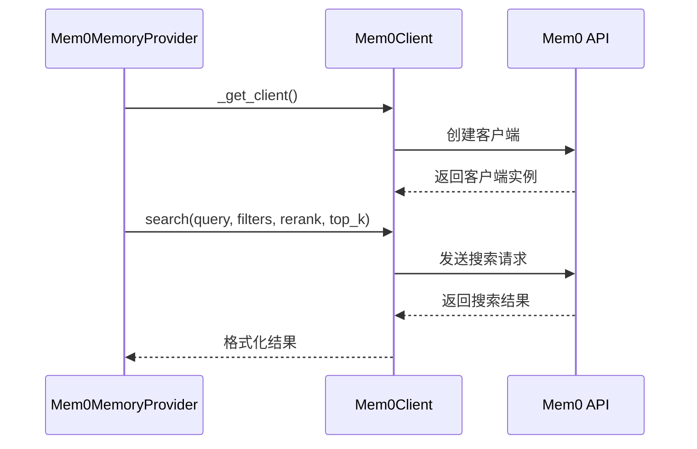

**图表来源**
- [plugins/memory/mem0/__init__.py:169-203](file://plugins/memory/mem0/__init__.py#L169-L203)

**章节来源**
- [plugins/memory/honcho/__init__.py:1-800](file://plugins/memory/honcho/__init__.py#L1-L800)
- [plugins/memory/mem0/__init__.py:1-375](file://plugins/memory/mem0/__init__.py#L1-L375)
- [plugins/memory/supermemory/__init__.py:1-800](file://plugins/memory/supermemory/__init__.py#L1-L800)

## 依赖关系分析

内存提供者系统的依赖关系体现了清晰的层次结构：

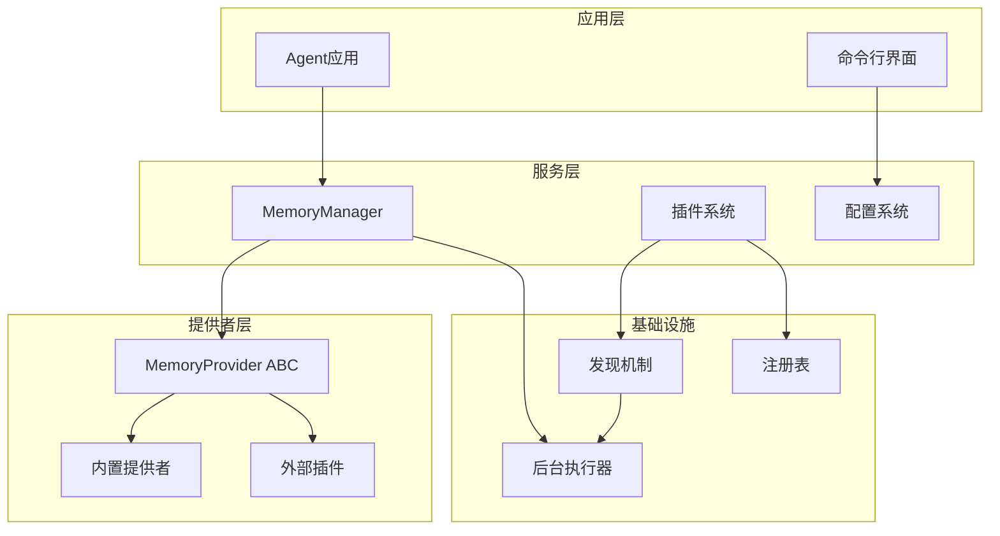

**图表来源**
- [memory_manager.py:313-403](file://agent/memory_manager.py#L313-L403)
- [plugins/memory/__init__.py:146-183](file://plugins/memory/__init__.py#L146-L183)

**章节来源**
- [memory_manager.py:313-800](file://agent/memory_manager.py#L313-L800)
- [plugins/memory/__init__.py:1-216](file://plugins/memory/__init__.py#L1-L216)

## 性能考虑

### 异步处理机制

内存提供者系统采用了多线程异步处理来避免阻塞：

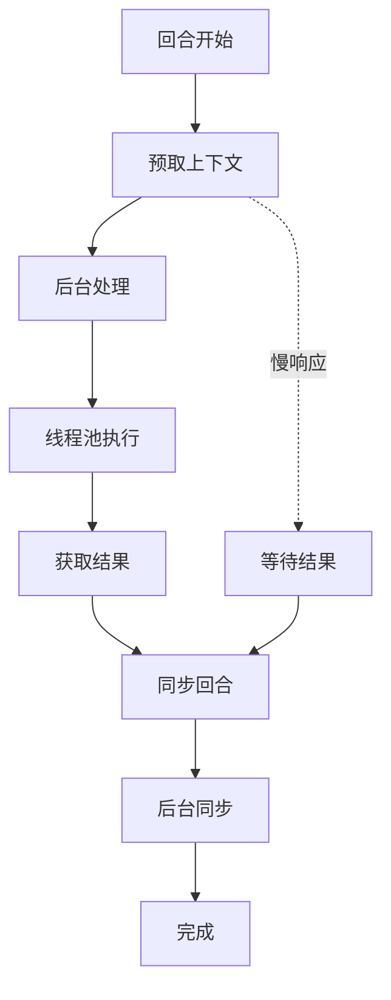

**图表来源**
- [memory_manager.py:575-642](file://agent/memory_manager.py#L575-L642)

### 资源管理

系统实现了完善的资源管理机制：

- **后台执行器**：单线程串行处理确保数据一致性
- **超时控制**：防止慢提供者阻塞整个系统
- **优雅关闭**：确保在进程退出时正确清理资源

**章节来源**
- [memory_manager.py:859-890](file://agent/memory_manager.py#L859-L890)
- [tests/agent/test_memory_async_sync.py:75-116](file://tests/agent/test_memory_async_sync.py#L75-L116)

## 故障排除指南

### 常见问题诊断

#### 插件未被发现

1. **检查目录结构**：确保插件位于正确的目录结构中
2. **验证__init__.py**：确认包含有效的提供者实现
3. **检查权限**：确保插件目录具有适当的读取权限

#### 配置问题

1. **验证配置文件**：检查config.yaml中的memory.provider设置
2. **检查环境变量**：确认必要的环境变量已正确设置
3. **验证API密钥**：确保第三方服务的API密钥有效

#### 性能问题

1. **监控后台任务**：检查是否有长时间运行的后台任务
2. **调整超时设置**：根据网络状况调整超时参数
3. **检查资源限制**：监控内存和CPU使用情况

**章节来源**
- [tests/agent/test_memory_provider.py:419-449](file://tests/agent/test_memory_provider.py#L419-L449)
- [tests/plugins/memory/test_openviking_provider.py:1008-1036](file://tests/plugins/memory/test_openviking_provider.py#L1008-L1036)

## 结论

Hermes Agent的内存提供者发布政策体现了现代软件架构的最佳实践：

1. **模块化设计**：通过独立插件形式实现松耦合
2. **标准化接口**：统一的MemoryProvider ABC确保兼容性
3. **生态友好**：鼓励社区参与和创新
4. **质量保证**：通过独立发布流程确保插件质量

这一政策不仅解决了代码库的维护问题，更重要的是为整个Hermes生态系统的发展奠定了坚实基础。

## 附录

### 开发最佳实践

#### 代码组织
- 使用清晰的目录结构：`plugins/memory/{provider_name}/`
- 实现标准的插件接口
- 提供完整的配置支持

#### 测试策略
- 编写单元测试覆盖核心功能
- 实现集成测试验证端到端流程
- 包含性能测试确保响应时间

#### 文档要求
- 提供详细的README文件
- 包含安装和配置说明
- 提供使用示例和常见问题解答

### 示例插件结构

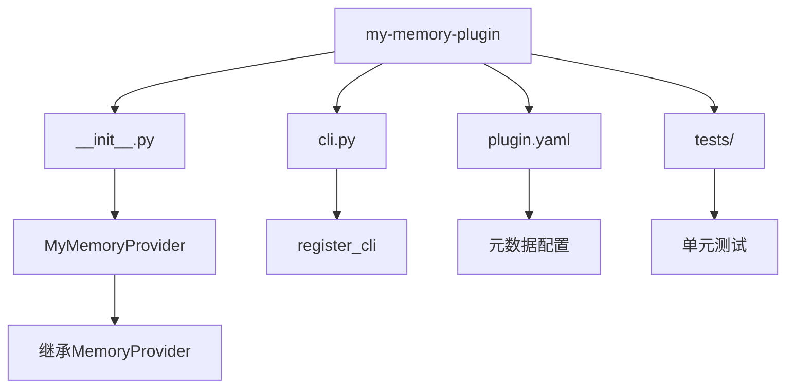

**图表来源**
- [plugins/memory/honcho/__init__.py:994-996](file://plugins/memory/honcho/__init__.py#L994-L996)