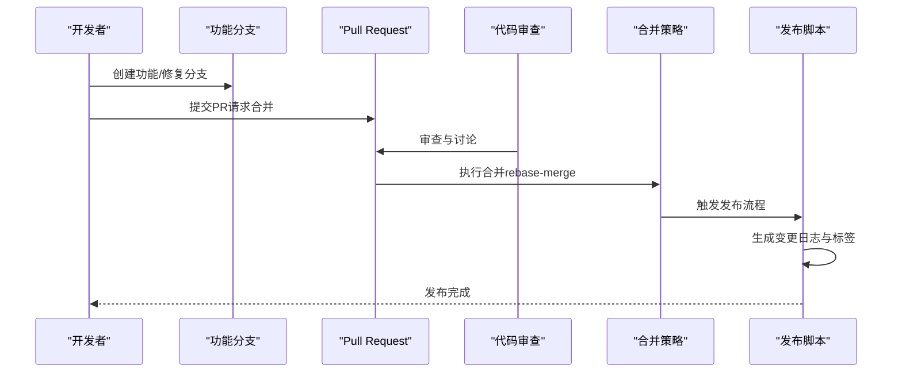
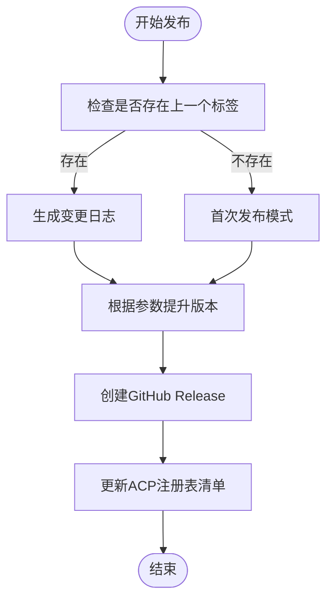
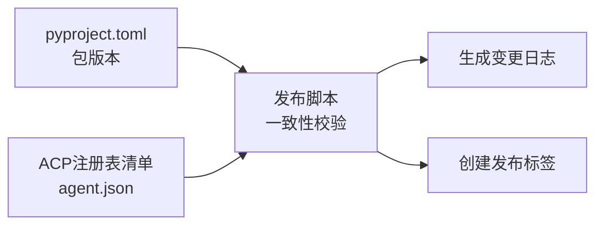

# 分支管理策略

<cite>
**本文档引用的文件**
- [CONTRIBUTING.md](file://CONTRIBUTING.md)
- [AGENTS.md](file://AGENTS.md)
- [README.md](file://README.md)
- [scripts/release.py](file://scripts/release.py)
- [.github/PULL_REQUEST_TEMPLATE.md](file://.github/PULL_REQUEST_TEMPLATE.md)
- [hermes_cli/__init__.py](file://hermes_cli/__init__.py)
- [pyproject.toml](file://pyproject.toml)
</cite>

## 目录
1. [简介](#简介)
2. [项目结构](#项目结构)
3. [核心组件](#核心组件)
4. [架构概览](#架构概览)
5. [详细组件分析](#详细组件分析)
6. [依赖关系分析](#依赖关系分析)
7. [性能考虑](#性能考虑)
8. [故障排除指南](#故障排除指南)
9. [结论](#结论)
10. [附录](#附录)

## 简介
本文件系统性阐述 Hermes Agent 项目的分支管理策略，涵盖分支命名约定、功能分支创建流程、特性开发工作流程、分支保护规则、合并策略以及版本发布流程。同时提供最佳实践建议与常见问题解决方案，帮助贡献者高效协作并维护代码质量。

## 项目结构
Hermes Agent 采用集中式主干（main）分支模型，所有变更通过 Pull Request（PR）进行审查与合并。仓库中未发现显式的 GitHub Actions 工作流配置文件，但通过贡献指南与发布脚本可推断出分支与发布策略的关键要素。

```mermaid
graph TB
subgraph "主干分支"
MAIN["main<br/>稳定发布基线"]
end
subgraph "功能分支"
FEAT_FIX["功能/修复分支<br/>fix/*, feat/*, chore/*"]
DOC_REVIEW["文档/评审分支<br/>docs/*, review/*"]
end
subgraph "发布分支"
RELEASE["release/*<br/>CalVer 标签"]
end
subgraph "工具链"
PR["Pull Request<br/>代码审查"]
CI["发布脚本<br/>scripts/release.py"]
end
MAIN <- --> FEAT_FIX
MAIN <- --> DOC_REVIEW
MAIN <- --> RELEASE
FEAT_FIX --> PR
DOC_REVIEW --> PR
PR --> MAIN
CI --> RELEASE
```

**图表来源**
- [CONTRIBUTING.md:100-108](file://CONTRIBUTING.md#L100-L108)
- [scripts/release.py:1-22](file://scripts/release.py#L1-L22)

**章节来源**
- [CONTRIBUTING.md:100-108](file://CONTRIBUTING.md#L100-L108)
- [README.md:180-206](file://README.md#L180-L206)

## 核心组件
- 分支命名约定：统一使用前缀区分变更类型，确保语义清晰、便于检索与自动化处理。
- 功能分支创建流程：基于主干创建短期分支，完成开发后提交 PR 进行审查。
- 特性开发工作流程：遵循 Conventional Commits 提交规范，保持提交历史整洁。
- 合并策略：优先采用 rebase-merge 以保留作者归属与线性历史；避免使用可能隐藏变更的 squash 合并。
- 版本发布流程：使用发布脚本生成变更日志并创建 CalVer 标签，确保版本号与包元数据一致。

**章节来源**
- [CONTRIBUTING.md:100-108](file://CONTRIBUTING.md#L100-L108)
- [AGENTS.md:92-94](file://AGENTS.md#L92-L94)
- [scripts/release.py:1-22](file://scripts/release.py#L1-L22)

## 架构概览
下图展示从功能分支到主干合并及发布的整体流程，包括分支命名、PR 审查与发布脚本的作用。



**图表来源**
- [CONTRIBUTING.md:100-108](file://CONTRIBUTING.md#L100-L108)
- [AGENTS.md:92-94](file://AGENTS.md#L92-L94)
- [scripts/release.py:1-22](file://scripts/release.py#L1-L22)

## 详细组件分析

### 分支命名约定
- 前缀规范
  - `fix/*`：修复缺陷或回归问题
  - `feat/*`：新增功能或能力
  - `chore/*`：常规维护、依赖更新等非用户可见变更
  - `docs/*`：文档相关变更
  - `review/*`：用于代码评审的临时分支
- 命名风格
  - 使用连字符分隔单词，避免大写与特殊字符
  - 描述简洁明确，能快速识别变更范围与目的
- 自动化友好
  - 统一前缀便于脚本筛选与批量处理
  - 避免与现有分支冲突，确保唯一性

**章节来源**
- [CONTRIBUTING.md:100-108](file://CONTRIBUTING.md#L100-L108)

### 功能分支创建流程
- 基于主干创建分支
  - 从 `main` 派生新分支，确保起点为最新稳定状态
  - 在本地完成开发与测试，确保通过 CI 要求
- 提交与推送
  - 使用 Conventional Commits 规范编写提交信息
  - 将分支推送到远程仓库，准备发起 PR
- PR 创建与审查
  - 在 PR 模板中填写变更描述、相关问题与测试步骤
  - 确保 PR 内容聚焦，避免无关提交混入

**章节来源**
- [CONTRIBUTING.md:100-108](file://CONTRIBUTING.md#L100-L108)
- [.github/PULL_REQUEST_TEMPLATE.md:1-76](file://.github/PULL_REQUEST_TEMPLATE.md#L1-L76)

### 特性开发工作流程
- 开发阶段
  - 在功能分支上迭代开发，保持提交粒度适中
  - 遵循代码风格与测试要求，确保质量
- 提交规范
  - 使用 Conventional Commits 前缀（如 `fix(scope):`, `feat(scope):`）
  - 提交信息简洁明了，必要时补充变更影响说明
- 测试与验证
  - 在本地运行测试套件，确保无回归
  - 如涉及平台差异，进行跨平台验证

**章节来源**
- [.github/PULL_REQUEST_TEMPLATE.md:45-51](file://.github/PULL_REQUEST_TEMPLATE.md#L45-L51)

### 分支保护规则
- 主干保护
  - `main` 分支应受保护，禁止直接推送与强制推送
  - 合并必须通过 PR，并满足审查与 CI 要求
- 审查要求
  - 至少一名维护者批准
  - 关键模块变更需相关领域专家参与审查
- CI 要求
  - 所有测试通过，覆盖率达标
  - 依赖安全扫描通过（如启用）

注：仓库未提供显式的 GitHub 分支保护配置文件，以上规则基于贡献指南与最佳实践推断。

**章节来源**
- [CONTRIBUTING.md:100-108](file://CONTRIBUTING.md#L100-L108)

### 合并策略
- 优先级
  - 重构与提取：推荐使用 rebase-merge，保留作者归属与线性历史
  - 功能与修复：在确保分支最新的前提下，可采用 rebase-merge 或 squash 合并
- 避免 squash 的场景
  - 合并可能隐藏近期修复，导致历史丢失
  - 对于长期存在的分支，建议先同步主干再合并
- 合并前检查
  - 确认分支已同步主干，避免引入不必要的冲突
  - 保证提交历史清晰，必要时进行交互式变基整理

**章节来源**
- [AGENTS.md:92-94](file://AGENTS.md#L92-L94)
- [AGENTS.md:1217-1220](file://AGENTS.md#L1217-L1220)

### 版本发布流程
- 发布触发
  - 通过发布脚本生成变更日志并创建 GitHub Release
  - 支持预览模式与正式发布模式，支持首次发布与日期覆盖
- 版本号策略
  - 采用 Calendar Versioning（CalVer）标签格式
  - 版本号与包元数据（如 pyproject.toml）保持一致
- 自动化保障
  - 发布脚本自动映射提交作者至 GitHub 用户名
  - 锁定 ACP 注册表清单与包版本，确保一致性



**图表来源**
- [scripts/release.py:1-22](file://scripts/release.py#L1-L22)
- [scripts/release.py:37-41](file://scripts/release.py#L37-L41)

**章节来源**
- [scripts/release.py:1-22](file://scripts/release.py#L1-L22)
- [scripts/release.py:37-41](file://scripts/release.py#L37-L41)

## 依赖关系分析
- 版本锁定与一致性
  - ACP 注册表清单与 pyproject.toml 必须保持版本步调一致
  - 发布脚本在执行时强制校验该一致性，防止版本漂移
- 依赖策略
  - 依赖采用上限约束，降低供应链攻击面
  - GitHub Actions 使用提交 SHA 固定版本，确保可追溯性



**图表来源**
- [scripts/release.py:37-41](file://scripts/release.py#L37-L41)
- [pyproject.toml](file://pyproject.toml)

**章节来源**
- [scripts/release.py:37-41](file://scripts/release.py#L37-L41)
- [pyproject.toml](file://pyproject.toml)

## 性能考虑
- 分支数量控制
  - 避免长期存在的孤立分支，定期清理不再使用的分支
- 合并方式选择
  - 大型重构优先使用 rebase-merge，减少合并提交对历史的影响
- CI 成本优化
  - 合理设置 CI 并行度与缓存策略，缩短构建时间
- 发布效率
  - 使用发布脚本自动化生成变更日志与标签，减少手工操作错误

## 故障排除指南
- 合并冲突
  - 在合并前先同步主干，解决冲突后再提交
  - 对于复杂冲突，拆分为更小的提交以便审查
- 历史污染
  - 避免使用可能隐藏变更的 squash 合并
  - 对于已合并的分支，如需回滚请谨慎处理
- 发布失败
  - 检查版本号与包元数据是否一致
  - 确认 ACP 注册表清单未被意外修改
- PR 被拒
  - 仔细阅读审查意见，按要求修改
  - 确保符合 Conventional Commits 规范与测试要求

**章节来源**
- [AGENTS.md:1217-1220](file://AGENTS.md#L1217-L1220)
- [scripts/release.py:37-41](file://scripts/release.py#L37-L41)

## 结论
Hermes Agent 的分支管理策略以主干保护、规范化命名与严格的合并策略为核心，辅以自动化发布脚本确保版本一致性。遵循本文档的约定与流程，有助于提高协作效率、保障代码质量并简化发布过程。

## 附录
- 参考文件
  - 贡献指南：定义开发环境、提交规范与合并策略
  - 开发指南：强调 rebase-merge 的重要性与历史完整性
  - 发布脚本：实现变更日志生成与 CalVer 标签创建
  - PR 模板：规范 PR 描述与审查清单

**章节来源**
- [CONTRIBUTING.md:100-108](file://CONTRIBUTING.md#L100-L108)
- [AGENTS.md:92-94](file://AGENTS.md#L92-L94)
- [scripts/release.py:1-22](file://scripts/release.py#L1-L22)
- [.github/PULL_REQUEST_TEMPLATE.md:1-76](file://.github/PULL_REQUEST_TEMPLATE.md#L1-L76)