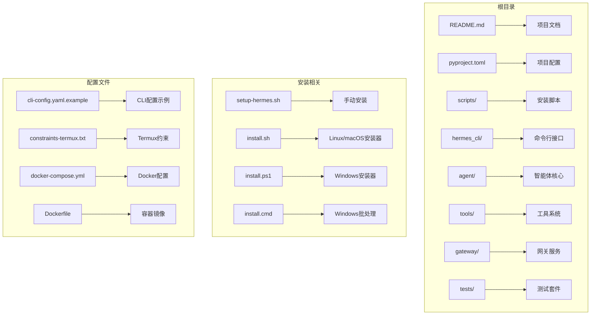
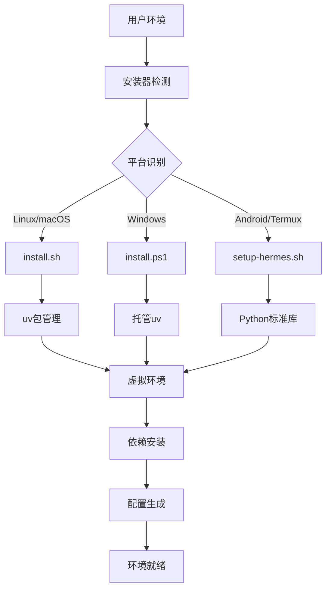
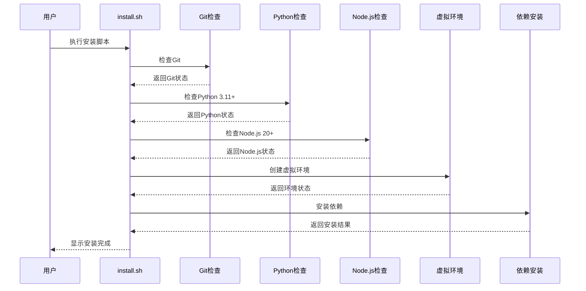
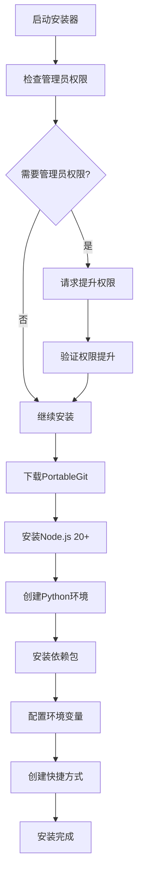

# 开发环境搭建

<cite>
**本文档引用的文件**
- [README.md](file://README.md)
- [CONTRIBUTING.md](file://CONTRIBUTING.md)
- [pyproject.toml](file://pyproject.toml)
- [scripts/install.sh](file://scripts/install.sh)
- [scripts/install.ps1](file://scripts/install.ps1)
- [scripts/install.cmd](file://scripts/install.cmd)
- [setup-hermes.sh](file://setup-hermes.sh)
- [cli-config.yaml.example](file://cli-config.yaml.example)
- [constraints-termux.txt](file://constraints-termux.txt)
- [docker-compose.yml](file://docker-compose.yml)
- [Dockerfile](file://Dockerfile)
</cite>

## 目录
1. [简介](#简介)
2. [项目结构](#项目结构)
3. [核心组件](#核心组件)
4. [架构概览](#架构概览)
5. [详细组件分析](#详细组件分析)
6. [依赖关系分析](#依赖关系分析)
7. [性能考虑](#性能考虑)
8. [故障排除指南](#故障排除指南)
9. [结论](#结论)

## 简介

Hermes Agent 是一个自改进的AI智能体，由Nous Research开发构建。该项目提供了完整的开发环境搭建指南，包括先决条件检查、标准安装器方法和手动克隆回退方案。

本项目支持多平台开发环境，包括Linux、macOS、Windows（原生和WSL2）以及Android/Termux。开发环境的核心要求包括Git版本控制、Python 3.11+、uv包管理器和Node.js 20+。

## 项目结构

Hermes Agent采用模块化架构设计，主要包含以下核心目录结构：



**图表来源**
- [README.md:175-239](file://README.md#L175-L239)
- [CONTRIBUTING.md:172-254](file://CONTRIBUTING.md#L172-L254)

**章节来源**
- [README.md:175-239](file://README.md#L175-L239)
- [CONTRIBUTING.md:172-254](file://CONTRIBUTING.md#L172-L254)

## 核心组件

### 先决条件检查

项目对开发环境有明确的要求：

| 组件 | 版本要求 | 用途 |
|------|----------|------|
| Git | 最新版本 | 版本控制系统，支持git-lfs扩展 |
| Python | 3.11+ | 主要运行时环境 |
| uv | 最新版本 | 快速Python包管理器 |
| Node.js | 20+ | 浏览器工具和WhatsApp桥接 |

### 安装器架构

项目提供了三种安装路径：

1. **标准安装器**：自动检测平台并执行相应安装流程
2. **手动克隆回退**：适用于CI或特殊环境的直接克隆方式
3. **桌面应用安装**：可选的GUI安装向导

**章节来源**
- [CONTRIBUTING.md:72-80](file://CONTRIBUTING.md#L72-L80)
- [README.md:34-66](file://README.md#L34-L66)

## 架构概览

Hermes Agent的开发环境架构采用分层设计，确保跨平台兼容性和可维护性：



**图表来源**
- [scripts/install.sh:449-484](file://scripts/install.sh#L449-L484)
- [scripts/install.ps1:125-154](file://scripts/install.ps1#L125-L154)
- [setup-hermes.sh:38-48](file://setup-hermes.sh#L38-L48)

## 详细组件分析

### Linux/macOS安装器 (install.sh)

Linux和macOS平台使用统一的安装脚本，具备以下特性：

#### 核心功能
- **平台检测**：自动识别操作系统和发行版
- **依赖管理**：检查并安装必需的系统依赖
- **Python环境**：使用uv管理Python 3.11环境
- **Node.js支持**：安装Node.js 20+用于浏览器工具

#### 安装流程



**图表来源**
- [scripts/install.sh:553-594](file://scripts/install.sh#L553-L594)
- [scripts/install.sh:741-771](file://scripts/install.sh#L741-L771)

#### 关键特性
- **自动依赖检测**：智能检测缺失的系统组件
- **错误恢复**：失败时提供详细的诊断信息
- **跨平台兼容**：支持多种Linux发行版和macOS

**章节来源**
- [scripts/install.sh:1-800](file://scripts/install.sh#L1-L800)

### Windows安装器 (install.ps1)

Windows平台提供专门的PowerShell安装器，具有以下特点：

#### 平台特定功能
- **PortableGit集成**：下载并安装独立的Git Bash
- **Node.js管理**：安装Node.js 20+ LTS版本
- **路径配置**：正确设置环境变量和PATH
- **权限处理**：处理Windows特有的权限要求

#### 安装流程



**图表来源**
- [scripts/install.ps1:535-693](file://scripts/install.ps1#L535-L693)
- [scripts/install.ps1:747-800](file://scripts/install.ps1#L747-L800)

**章节来源**
- [scripts/install.ps1:1-800](file://scripts/install.ps1#L1-L800)

### 手动克隆回退方案 (setup-hermes.sh)

对于特殊环境或CI场景，提供手动克隆回退方案：

#### 核心功能
- **Termux支持**：使用Python标准库vem替代uv
- **约束安装**：使用constraints-termux.txt确保稳定性
- **环境隔离**：创建独立的Python虚拟环境
- **技能同步**：自动同步内置技能到用户目录

**章节来源**
- [setup-hermes.sh:1-463](file://setup-hermes.sh#L1-L463)

### 配置文件系统

项目包含多个配置文件，用于不同层面的配置管理：

#### CLI配置 (cli-config.yaml.example)
- **模型配置**：支持多种大语言模型提供商
- **终端工具**：本地、SSH、Docker等多种执行后端
- **安全设置**：Triton安全扫描和sudo支持
- **浏览器工具**：自动关闭不活动的浏览器会话

#### 依赖约束 (constraints-termux.txt)
- **Termux兼容性**：确保Android环境的稳定性
- **版本锁定**：防止上游包的快速变化影响安装

**章节来源**
- [cli-config.yaml.example:1-800](file://cli-config.yaml.example#L1-L800)
- [constraints-termux.txt:1-16](file://constraints-termux.txt#L1-L16)

## 依赖关系分析

### Python依赖管理

项目使用pyproject.toml进行依赖管理，采用严格的版本控制策略：

```mermaid
graph LR
A[pyproject.toml] --> B[核心依赖]
A --> C[可选依赖]
A --> D[开发依赖]
B --> E[openai==2.24.0]
B --> F[pydantic==2.13.4]
B --> G[httpx[socks]==0.28.1]
C --> H[anthropic==0.87.0]
C --> I[firecrawl-py==4.17.0]
C --> J[edge-tts==7.2.7]
D --> K[pytest==9.0.2]
D --> L[ruff==0.15.10]
D --> M[debugpy==1.8.20]
```

**图表来源**
- [pyproject.toml:24-133](file://pyproject.toml#L24-L133)
- [pyproject.toml:135-289](file://pyproject.toml#L135-L289)

### Node.js依赖管理

前端和工具链使用npm进行管理，支持多种构建工具：

#### 前端技术栈
- **Web应用**：基于Vite的现代前端应用
- **TUI界面**：基于TypeScript的终端用户界面
- **Electron桌面应用**：可选的桌面应用程序

**章节来源**
- [pyproject.toml:256-289](file://pyproject.toml#L256-L289)

## 性能考虑

### 安装性能优化

项目在安装过程中采用了多项性能优化措施：

1. **缓存策略**：利用uv的缓存机制减少重复下载
2. **并行安装**：同时安装多个依赖包以提高效率
3. **增量更新**：只更新必要的组件而非完全重装

### 运行时性能

- **延迟加载**：非核心功能按需加载
- **内存管理**：优化的内存使用策略
- **并发处理**：支持多线程和异步操作

## 故障排除指南

### 常见问题及解决方案

#### Python版本问题
**症状**：安装过程中提示Python版本不兼容
**解决方案**：
1. 使用uv自动安装Python 3.11
2. 或者手动安装Python 3.11+

#### Git安装问题
**症状**：找不到Git命令或版本过低
**解决方案**：
1. Linux/macOS：使用包管理器安装最新Git
2. Windows：使用PortableGit替代系统Git

#### Node.js版本问题
**症状**：Node.js版本过低导致构建失败
**解决方案**：
1. 升级到Node.js 20+
2. 或使用项目提供的托管Node.js版本

#### 权限问题
**症状**：安装过程中出现权限错误
**解决方案**：
1. 确保有足够的磁盘空间
2. 检查防火墙设置
3. 在Windows上以管理员身份运行

**章节来源**
- [scripts/install.sh:663-722](file://scripts/install.sh#L663-L722)
- [scripts/install.ps1:535-693](file://scripts/install.ps1#L535-L693)

## 结论

Hermes Agent提供了完整的开发环境搭建解决方案，具有以下优势：

1. **跨平台支持**：统一的安装体验支持Linux、macOS、Windows和Android
2. **自动化程度高**：智能检测和自动修复大部分常见问题
3. **灵活性强**：提供多种安装路径适应不同使用场景
4. **文档完善**：详细的安装指南和故障排除说明

推荐使用标准安装器作为首选方案，仅在特殊情况下使用手动克隆回退方案。安装完成后，建议运行`hermes doctor`命令验证环境配置的正确性。