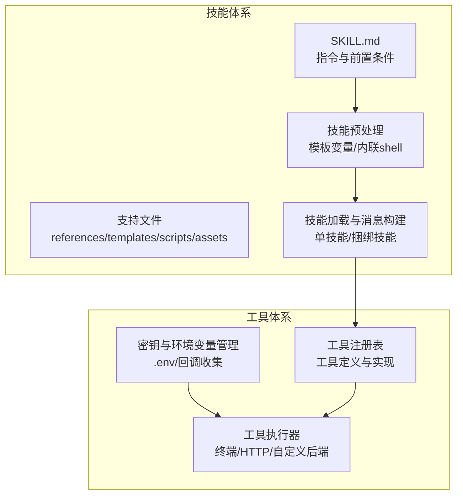
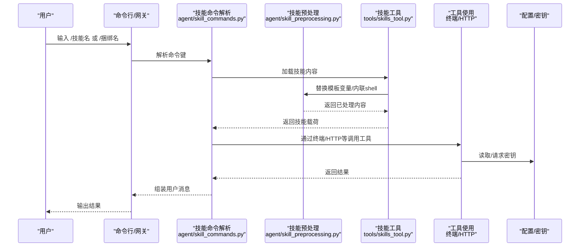
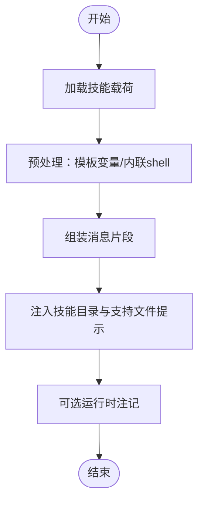
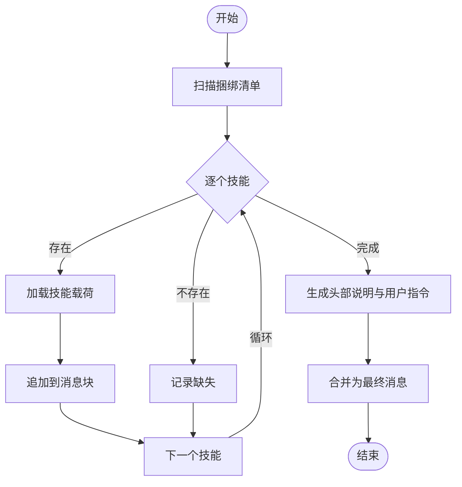
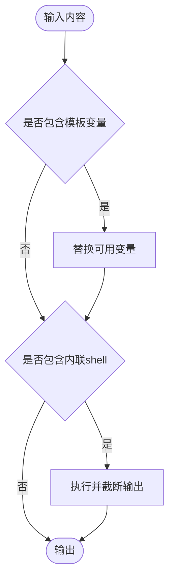
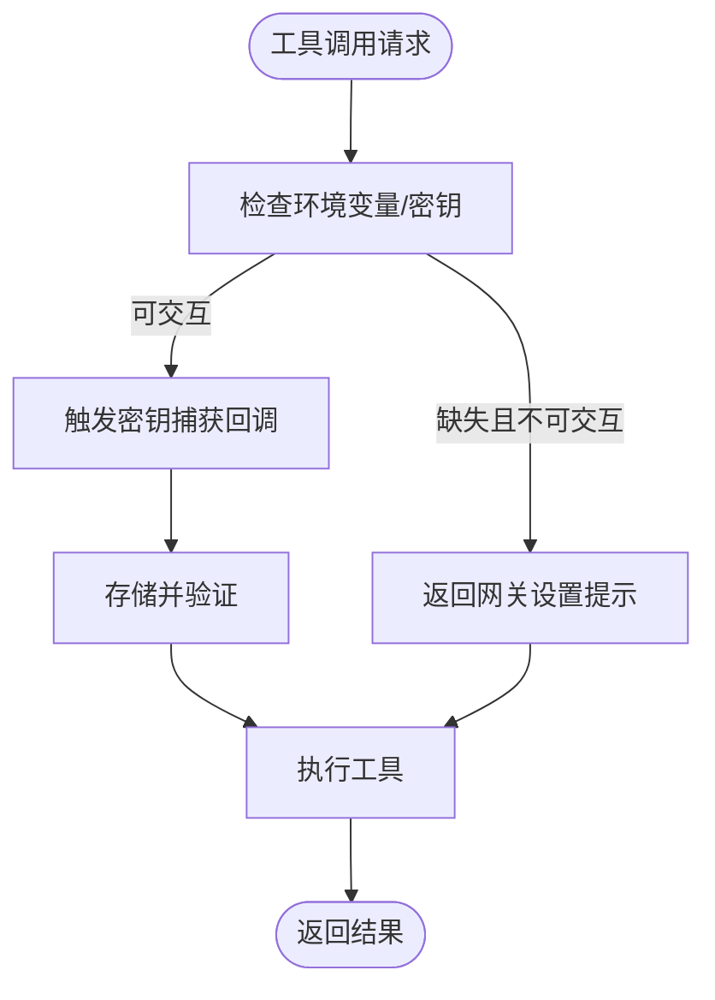
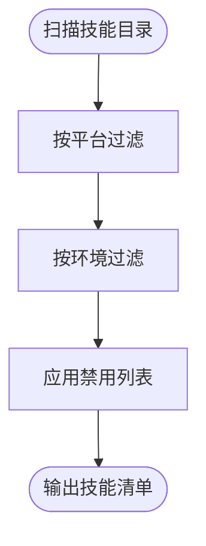
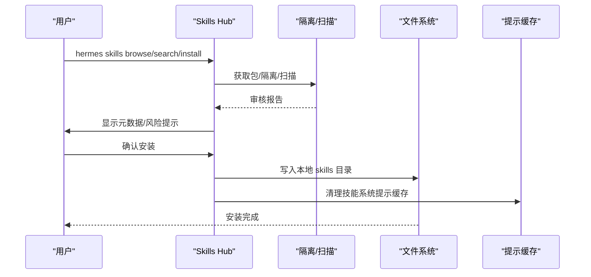
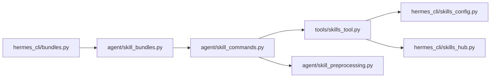
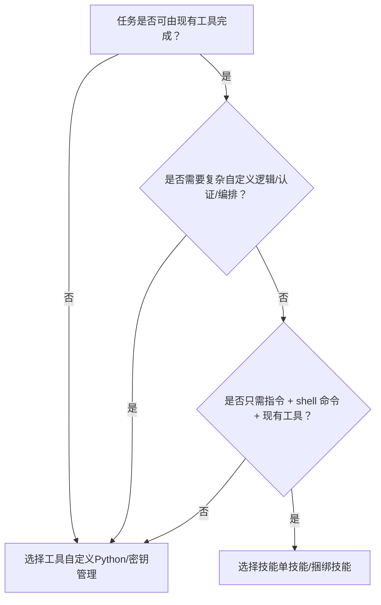

# 技能与工具的选择标准

<cite>
**本文引用的文件**
- [agent/skill_bundles.py](file://agent/skill_bundles.py)
- [agent/skill_commands.py](file://agent/skill_commands.py)
- [agent/skill_preprocessing.py](file://agent/skill_preprocessing.py)
- [agent/skill_utils.py](file://agent/skill_utils.py)
- [tools/skills_tool.py](file://tools/skills_tool.py)
- [hermes_cli/bundles.py](file://hermes_cli/bundles.py)
- [hermes_cli/skills_config.py](file://hermes_cli/skills_config.py)
- [hermes_cli/skills_hub.py](file://hermes_cli/skills_hub.py)
- [optional-skills/DESCRIPTION.md](file://optional-skills/DESCRIPTION.md)
- [skills/autonomous-ai-agents/DESCRIPTION.md](file://skills/autonomous-ai-agents/DESCRIPTION.md)
- [skills/creative/DESCRIPTION.md](file://skills/creative/DESCRIPTION.md)
</cite>

## 目录
1. [引言](#引言)
2. [项目结构](#项目结构)
3. [核心组件](#核心组件)
4. [架构总览](#架构总览)
5. [详细组件分析](#详细组件分析)
6. [依赖分析](#依赖分析)
7. [性能考量](#性能考量)
8. [故障排查指南](#故障排查指南)
9. [结论](#结论)
10. [附录](#附录)

## 引言
本指南围绕“技能（Skill）”与“工具（Tool）”的选择标准，结合代码库中的实现细节，给出一套可操作的决策流程：在什么场景下使用“技能（instruction + shell 命令 + 现有工具）”，在什么场景下使用“工具（需要自定义 Python 集成或 API 密钥管理）”。同时，文档还解释了“捆绑技能”“可选技能”“社区技能”的不同发布渠道与要求，并提供决策树、示例与最佳实践。

## 项目结构
该仓库以“技能优先”的设计为核心：技能是“指令 + 可执行脚本 + 现存工具”的组合体；工具是“独立能力模块”，通常需要自定义 Python 实现与密钥管理。两者通过统一的加载、预处理与调用机制衔接。

图示来源
- [tools/skills_tool.py:1-800](file://tools/skills_tool.py#L1-L800)
- [agent/skill_preprocessing.py:1-141](file://agent/skill_preprocessing.py#L1-L141)
- [agent/skill_commands.py:1-613](file://agent/skill_commands.py#L1-L613)
- [agent/skill_bundles.py:1-411](file://agent/skill_bundles.py#L1-L411)

章节来源
- [tools/skills_tool.py:1-800](file://tools/skills_tool.py#L1-L800)
- [agent/skill_preprocessing.py:1-141](file://agent/skill_preprocessing.py#L1-L141)
- [agent/skill_commands.py:1-613](file://agent/skill_commands.py#L1-L613)
- [agent/skill_bundles.py:1-411](file://agent/skill_bundles.py#L1-L411)

## 核心组件
- 技能加载与消息构建
  - 单技能：解析 SKILL.md，注入模板变量与内联 shell，拼装用户消息，记录使用统计。
  - 捆绑技能：按清单批量加载多个技能，合并为一次用户消息，保留缺失技能提示。
- 技能预处理
  - 模板变量替换（HERMES_SKILL_DIR、HERMES_SESSION_ID）
  - 内联 shell 执行（限制输出长度与超时），失败返回错误标记
- 工具与密钥
  - 工具注册与执行由工具子系统负责；技能侧通过终端工具等调用外部能力
  - 密钥与环境变量通过 .env 或交互式回调收集，支持网关/桌面等不同表面
- 技能发现与配置
  - 技能目录扫描、平台/环境过滤、禁用列表、外部目录扩展
  - 技能 Hub 支持官方/社区/第三方来源，提供搜索、浏览、安装、安全扫描

章节来源
- [agent/skill_commands.py:517-613](file://agent/skill_commands.py#L517-L613)
- [agent/skill_bundles.py:253-341](file://agent/skill_bundles.py#L253-L341)
- [agent/skill_preprocessing.py:23-141](file://agent/skill_preprocessing.py#L23-L141)
- [tools/skills_tool.py:141-483](file://tools/skills_tool.py#L141-L483)
- [hermes_cli/skills_config.py:1-184](file://hermes_cli/skills_config.py#L1-L184)

## 架构总览
技能与工具的协作路径如下：

图示来源
- [agent/skill_commands.py:517-613](file://agent/skill_commands.py#L517-L613)
- [agent/skill_preprocessing.py:124-141](file://agent/skill_preprocessing.py#L124-L141)
- [tools/skills_tool.py:687-754](file://tools/skills_tool.py#L687-L754)

## 详细组件分析

### 单技能加载与消息构建
- 关键点
  - 解析 SKILL.md，提取 frontmatter 与正文
  - 注入模板变量与内联 shell 扩展
  - 记录技能使用次数，支持“会话级”激活注记
  - 生成“技能目录”“支持文件”提示，便于后续直接运行脚本
- 典型流程

图示来源
- [agent/skill_commands.py:245-346](file://agent/skill_commands.py#L245-L346)
- [agent/skill_preprocessing.py:124-141](file://agent/skill_preprocessing.py#L124-L141)

章节来源
- [agent/skill_commands.py:517-562](file://agent/skill_commands.py#L517-L562)
- [agent/skill_commands.py:245-346](file://agent/skill_commands.py#L245-L346)

### 捆绑技能（多技能聚合）
- 关键点
  - YAML 定义一组技能名称，按顺序加载并拼接为一条用户消息
  - 若部分技能缺失，仍继续加载其余技能，并在头部标注缺失项
  - 支持为捆绑设置额外“指令”，作为全局指导
- 典型流程

图示来源
- [agent/skill_bundles.py:253-341](file://agent/skill_bundles.py#L253-L341)

章节来源
- [agent/skill_bundles.py:168-245](file://agent/skill_bundles.py#L168-L245)
- [agent/skill_bundles.py:253-341](file://agent/skill_bundles.py#L253-L341)

### 技能预处理（模板变量与内联 Shell）
- 关键点
  - 模板变量：HERMES_SKILL_DIR、HERMES_SESSION_ID（仅在可用时替换）
  - 内联 shell：!`cmd` 单行模式，限制输出长度，超时/异常安全处理
- 典型流程

图示来源
- [agent/skill_preprocessing.py:37-141](file://agent/skill_preprocessing.py#L37-L141)

章节来源
- [agent/skill_preprocessing.py:23-141](file://agent/skill_preprocessing.py#L23-L141)

### 工具与密钥管理
- 关键点
  - 工具通过注册表与执行器统一调度
  - 密钥与环境变量从 .env 或交互式回调读取；网关表面可能不支持交互，会回退为“设置提示”
  - 平台/环境过滤确保技能仅在适用环境中显示与加载
- 典型流程

图示来源
- [tools/skills_tool.py:338-414](file://tools/skills_tool.py#L338-L414)
- [agent/skill_utils.py:163-304](file://agent/skill_utils.py#L163-L304)

章节来源
- [tools/skills_tool.py:141-483](file://tools/skills_tool.py#L141-L483)
- [agent/skill_utils.py:353-397](file://agent/skill_utils.py#L353-L397)

### 技能发现、分类与禁用控制
- 关键点
  - 技能目录扫描，支持本地与外部目录
  - 平台匹配（macOS/Linux/Windows/Android/Termux）、环境匹配（kanban/docker/s6）
  - 禁用列表（全局/按平台），可通过 CLI 交互式配置
- 典型流程

图示来源
- [agent/skill_utils.py:163-304](file://agent/skill_utils.py#L163-L304)
- [hermes_cli/skills_config.py:27-54](file://hermes_cli/skills_config.py#L27-L54)

章节来源
- [agent/skill_utils.py:604-629](file://agent/skill_utils.py#L604-L629)
- [hermes_cli/skills_config.py:58-184](file://hermes_cli/skills_config.py#L58-L184)

### 技能 Hub 与发布渠道
- 官方可选技能（optional-skills）
  - 不默认启用，通过 Skills Hub 浏览/搜索/安装至本地 skills 目录
  - 适合“小众/实验性/重依赖”技能，保持默认集合精简
- 社区与第三方技能（skills_hub）
  - 支持多源（official/trusted/community/github 等），提供搜索、浏览、安装、安全扫描
  - 安装前进行隔离、扫描与用户确认
- 发布与安装流程

图示来源
- [hermes_cli/skills_hub.py:478-745](file://hermes_cli/skills_hub.py#L478-L745)
- [optional-skills/DESCRIPTION.md:1-25](file://optional-skills/DESCRIPTION.md#L1-L25)

章节来源
- [hermes_cli/skills_hub.py:248-476](file://hermes_cli/skills_hub.py#L248-L476)
- [hermes_cli/skills_hub.py:478-745](file://hermes_cli/skills_hub.py#L478-L745)
- [optional-skills/DESCRIPTION.md:1-25](file://optional-skills/DESCRIPTION.md#L1-L25)

## 依赖分析
- 技能侧依赖
  - agent/skill_commands.py 依赖 tools/skills_tool.py 进行技能视图与目录扫描
  - agent/skill_bundles.py 依赖 agent/skill_commands.py 的技能载荷加载与消息拼装
  - agent/skill_preprocessing.py 提供模板变量与内联 shell 处理
- 工具侧依赖
  - tools/skills_tool.py 负责技能目录、平台/环境过滤、密钥收集与工具调用
  - hermes_cli/skills_config.py 提供禁用列表配置 UI
  - hermes_cli/bundles.py 提供捆绑技能的 CLI 管理

图示来源
- [agent/skill_commands.py:138-204](file://agent/skill_commands.py#L138-L204)
- [agent/skill_bundles.py:273-316](file://agent/skill_bundles.py#L273-L316)
- [agent/skill_preprocessing.py:23-35](file://agent/skill_preprocessing.py#L23-L35)
- [tools/skills_tool.py:602-680](file://tools/skills_tool.py#L602-L680)
- [hermes_cli/skills_config.py:58-184](file://hermes_cli/skills_config.py#L58-L184)
- [hermes_cli/bundles.py:23-31](file://hermes_cli/bundles.py#L23-L31)

章节来源
- [agent/skill_commands.py:138-204](file://agent/skill_commands.py#L138-L204)
- [agent/skill_bundles.py:273-316](file://agent/skill_bundles.py#L273-L316)
- [agent/skill_preprocessing.py:23-35](file://agent/skill_preprocessing.py#L23-L35)
- [tools/skills_tool.py:602-680](file://tools/skills_tool.py#L602-L680)
- [hermes_cli/skills_config.py:58-184](file://hermes_cli/skills_config.py#L58-L184)
- [hermes_cli/bundles.py:23-31](file://hermes_cli/bundles.py#L23-L31)

## 性能考量
- 技能扫描与缓存
  - 技能与捆绑均采用基于 mtime 的缓存策略，避免重复扫描
  - 技能系统提示缓存可在安装新技能后清理，保证即时生效
- 预处理开销
  - 内联 shell 限制输出长度与超时，防止长输出或死循环影响上下文
- 工具执行
  - 工具执行器按需加载，避免导入链过长导致启动延迟

章节来源
- [agent/skill_bundles.py:195-206](file://agent/skill_bundles.py#L195-L206)
- [agent/skill_preprocessing.py:63-100](file://agent/skill_preprocessing.py#L63-L100)
- [hermes_cli/skills_hub.py:735-744](file://hermes_cli/skills_hub.py#L735-L744)

## 故障排查指南
- 技能未出现或被隐藏
  - 检查平台/环境过滤：技能声明的 platforms/environments 是否与当前环境匹配
  - 检查禁用列表：是否被全局或平台禁用
- 捆绑技能部分缺失
  - 捆绑消息头部会列出缺失技能；请确认对应技能是否已安装
- 内联 shell 失败
  - 查看错误标记（超时/找不到 bash/其他异常），确认命令可执行与权限
- 密钥/环境变量缺失
  - 在 .env 中添加或通过交互式回调补全；网关表面可能不支持交互，会提示“设置提示”

章节来源
- [agent/skill_utils.py:163-304](file://agent/skill_utils.py#L163-L304)
- [agent/skill_bundles.py:320-341](file://agent/skill_bundles.py#L320-L341)
- [agent/skill_preprocessing.py:63-100](file://agent/skill_preprocessing.py#L63-L100)
- [tools/skills_tool.py:338-414](file://tools/skills_tool.py#L338-L414)

## 结论
- 当任务可以由“指令 + shell 命令 + 现有工具”完整表达，且无需复杂自定义逻辑与密钥管理时，优先选择“技能”
- 当任务涉及第三方 API、复杂认证、跨服务编排或需要自定义 Python 集成时，应选择“工具”
- 对于小众/实验性/重依赖的场景，使用“可选技能”并通过 Skills Hub 安装
- 对于社区/第三方技能，使用 Skills Hub 的搜索/浏览/安装与安全扫描流程

## 附录

### 决策树：何时选择技能 vs 工具

### 示例与最佳实践
- 使用技能
  - 场景：批量生成创意内容、自动化脚本执行、多步骤研究检索
  - 最佳实践：将 shell 命令写为内联片段，配合模板变量动态注入路径/会话 ID；必要时使用捆绑技能聚合相关步骤
- 使用工具
  - 场景：调用第三方 API、管理 OAuth 凭证、跨服务编排
  - 最佳实践：在工具中集中处理密钥与网络层，技能仅负责“如何做”的指令；通过 .env 或交互式回调管理敏感信息

### 发布渠道与要求
- 官方可选技能（optional-skills）
  - 通过 Skills Hub 浏览/搜索/安装；适合“小众/实验性/重依赖”
- 社区与第三方技能（skills_hub）
  - 多源支持，安装前隔离与安全扫描；安装后清理技能系统提示缓存以即时生效
- 捆绑技能
  - 通过 hermes bundles CLI 创建/管理；支持列出、展示、删除、重载

章节来源
- [optional-skills/DESCRIPTION.md:1-25](file://optional-skills/DESCRIPTION.md#L1-L25)
- [hermes_cli/skills_hub.py:478-745](file://hermes_cli/skills_hub.py#L478-L745)
- [hermes_cli/bundles.py:1-230](file://hermes_cli/bundles.py#L1-L230)