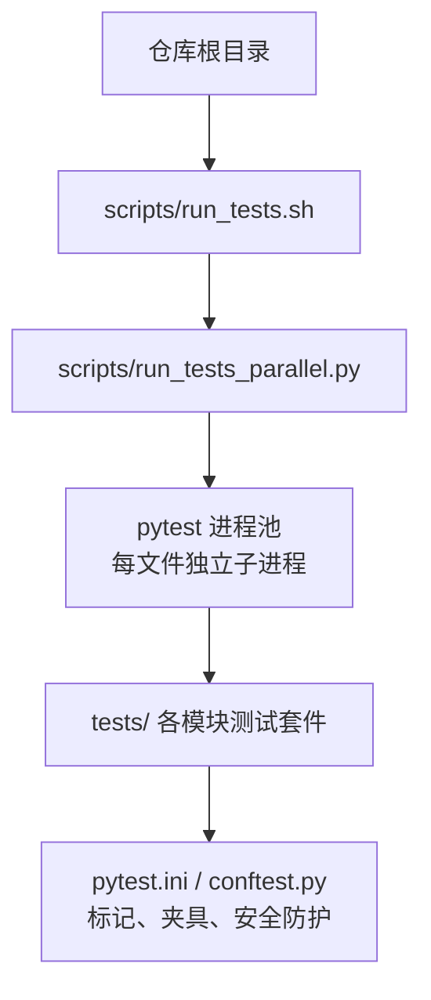
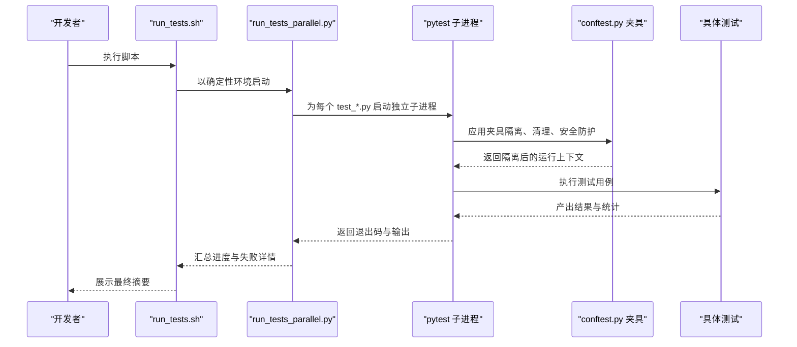
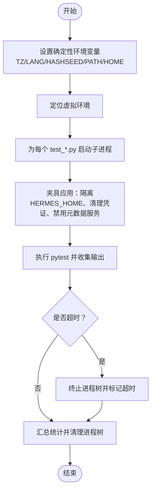
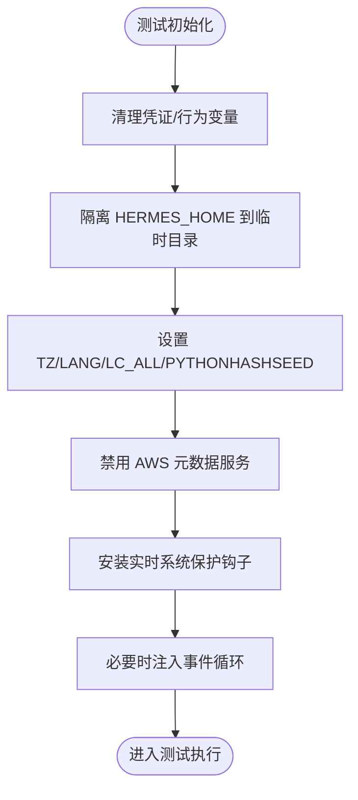
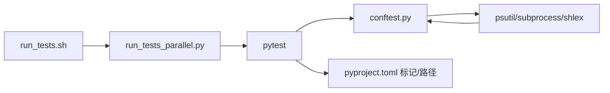

# 测试指南

<cite>
**本文引用的文件**
- [README.md](file://README.md)
- [CONTRIBUTING.md](file://CONTRIBUTING.md)
- [pyproject.toml](file://pyproject.toml)
- [scripts/run_tests.sh](file://scripts/run_tests.sh)
- [scripts/run_tests_parallel.py](file://scripts/run_tests_parallel.py)
- [tests/conftest.py](file://tests/conftest.py)
- [tests/test_hermes_state.py](file://tests/test_hermes_state.py)
- [skills/creative/comfyui/tests/pytest.ini](file://skills/creative/comfyui/tests/pytest.ini)
</cite>

## 目录
1. [简介](#简介)
2. [项目结构](#项目结构)
3. [核心组件](#核心组件)
4. [架构总览](#架构总览)
5. [详细组件分析](#详细组件分析)
6. [依赖关系分析](#依赖关系分析)
7. [性能考量](#性能考量)
8. [故障排查指南](#故障排查指南)
9. [结论](#结论)
10. [附录](#附录)

## 简介
本指南面向开发者与贡献者，系统化阐述 Hermes Agent 的测试体系：包括测试环境搭建、测试运行方式、测试覆盖策略、CI 测试流程、单元测试编写规范、集成测试策略、性能测试方法以及测试数据管理。文档同时提供最佳实践与常见问题的解决方案，帮助在多平台（Linux、macOS、Windows）与多组件（CLI、工具、网关、技能等）场景下稳定推进质量保障。

## 项目结构
- 测试根目录 tests/ 下按功能域划分：agent、gateway、hermes_cli、tools、plugins、cron、integration、e2e、stress 等。
- 核心测试运行器为 scripts/run_tests.sh 与 scripts/run_tests_parallel.py，二者共同确保“每文件隔离、确定性环境、并行执行、超时与清理”。
- pytest 配置集中在 pyproject.toml 与 tests/conftest.py 中，统一约束标记、默认过滤、环境隔离与安全防护。

图表来源
- [scripts/run_tests.sh:1-80](file://scripts/run_tests.sh#L1-L80)
- [scripts/run_tests_parallel.py:1-120](file://scripts/run_tests_parallel.py#L1-L120)
- [pyproject.toml:343-351](file://pyproject.toml#L343-L351)
- [tests/conftest.py:1-60](file://tests/conftest.py#L1-L60)

章节来源
- [README.md:180-206](file://README.md#L180-L206)
- [CONTRIBUTING.md:159-168](file://CONTRIBUTING.md#L159-L168)
- [pyproject.toml:343-351](file://pyproject.toml#L343-L351)

## 核心组件
- 测试运行器
  - scripts/run_tests.sh：封装确定性环境变量、虚拟环境激活、调用 run_tests_parallel.py，保证本地与 CI 行为一致。
  - scripts/run_tests_parallel.py：发现测试文件、按文件并行执行、设置每文件超时、记录耗时缓存、支持切片分片。
- 夹具与安全防护
  - tests/conftest.py：统一清理凭证类环境变量、隔离 HERMES_HOME、设定时区与语言、禁用 AWS 元数据服务、拦截真实系统信号与命令，避免误伤宿主系统。
- 标记与默认行为
  - pyproject.toml：定义测试路径、默认排除集成测试、添加自定义标记；各子模块可按需覆盖或扩展。

章节来源
- [scripts/run_tests.sh:1-80](file://scripts/run_tests.sh#L1-L80)
- [scripts/run_tests_parallel.py:52-120](file://scripts/run_tests_parallel.py#L52-L120)
- [tests/conftest.py:327-394](file://tests/conftest.py#L327-L394)
- [pyproject.toml:343-351](file://pyproject.toml#L343-L351)

## 架构总览
测试运行的端到端流程如下：

图表来源
- [scripts/run_tests.sh:61-80](file://scripts/run_tests.sh#L61-L80)
- [scripts/run_tests_parallel.py:246-341](file://scripts/run_tests_parallel.py#L246-L341)
- [tests/conftest.py:327-394](file://tests/conftest.py#L327-L394)

## 详细组件分析

### 组件A：测试运行器与并行执行
- 设计要点
  - 每文件隔离：通过独立子进程避免跨文件模块级状态泄漏。
  - 确定性环境：固定 TZ、LANG、哈希种子、清空凭证变量，减少非 determinism。
  - 并行与切片：基于 CPU 数量与可选切片参数均衡分配文件，提升吞吐。
  - 超时与清理：单文件超时、进程树清理，防止僵尸进程与卡死。
- 关键实现位置
  - run_tests.sh：环境准备、虚拟环境定位、调用 run_tests_parallel.py。
  - run_tests_parallel.py：文件发现、并行执行、进度打印、失败内联展示、耗时缓存与切片分发。

图表来源
- [scripts/run_tests.sh:61-80](file://scripts/run_tests.sh#L61-L80)
- [scripts/run_tests_parallel.py:246-341](file://scripts/run_tests_parallel.py#L246-L341)
- [tests/conftest.py:327-394](file://tests/conftest.py#L327-L394)

章节来源
- [scripts/run_tests.sh:1-80](file://scripts/run_tests.sh#L1-L80)
- [scripts/run_tests_parallel.py:52-120](file://scripts/run_tests_parallel.py#L52-L120)
- [scripts/run_tests_parallel.py:694-711](file://scripts/run_tests_parallel.py#L694-L711)

### 组件B：夹具与安全防护
- 环境隔离
  - 清理凭证类变量：对所有形如 *_API_KEY、*_TOKEN 等进行批量剔除，避免本地密钥泄漏。
  - 行为控制变量：强制清除影响测试语义的 HERMES_* 变量，确保一致性。
  - HERMES_HOME 隔离：将测试 HOME 指向临时目录，避免读写真实用户目录。
  - 时区与语言：统一 UTC 与 C.UTF-8，消除时间与编码差异。
- 安全防护
  - 实时系统保护：拦截 os.kill/os.killpg、systemctl 变更类命令、进程杀手命令（pkill/killall/taskkill），防止误杀宿主进程。
  - 特殊命令阻断：拦截 hermes update 等可能破坏后续子进程的命令。
- 事件循环兼容
  - 对同步测试自动注入可用事件循环，避免 get_event_loop() 在新版本 Python 中无当前循环导致的失败。

图表来源
- [tests/conftest.py:327-394](file://tests/conftest.py#L327-L394)
- [tests/conftest.py:528-800](file://tests/conftest.py#L528-L800)

章节来源
- [tests/conftest.py:327-394](file://tests/conftest.py#L327-L394)
- [tests/conftest.py:528-800](file://tests/conftest.py#L528-L800)

### 组件C：单元测试编写规范
- 基本原则
  - 每个文件独立运行，不依赖其他文件的状态；同一文件内的顺序由作者负责。
  - 使用夹具隔离外部状态（如临时目录、环境变量），避免全局污染。
  - 不进行真实网络调用，使用 unittest.mock 或内存态模拟。
- 示例参考
  - hermes_state 单测展示了如何通过自定义 sqlite3 连接模拟缺失 FTS5 的场景，验证降级路径与错误处理。

章节来源
- [tests/test_hermes_state.py:10-51](file://tests/test_hermes_state.py#L10-L51)
- [tests/test_hermes_state.py:53-60](file://tests/test_hermes_state.py#L53-L60)

### 组件D：集成测试策略
- 默认策略
  - 通过 pyproject.toml 的默认标记过滤，普通测试不会运行需要外部服务的集成用例。
- 运行方式
  - 可通过 -k 过滤表达式显式选择集成测试；或在 run_tests_parallel.py 中传入 --include-integration 以包含集成/e2e/docker 子树。
- 注意事项
  - 集成测试通常依赖真实外部服务（模型网关、容器守护进程等），建议在专用 CI 作业中运行，避免与常规单元测试争抢资源。

章节来源
- [pyproject.toml:343-351](file://pyproject.toml#L343-L351)
- [scripts/run_tests_parallel.py:689-693](file://scripts/run_tests_parallel.py#L689-L693)

### 组件E：性能测试方法
- 文件级耗时统计
  - run_tests_parallel.py 支持记录每个文件的子进程耗时，并持久化到 test_durations.json，用于后续切片分发。
- 切片分发（CI 平衡）
  - 基于 LPT（最长处理时间优先）算法将耗时较长的文件均匀分配到多个切片，降低最长作业时间。
- 建议实践
  - 在本地首次运行后生成耗时缓存；在 CI 中使用 --slice I/N 将测试矩阵拆分为多个均衡的作业。

章节来源
- [scripts/run_tests_parallel.py:495-528](file://scripts/run_tests_parallel.py#L495-L528)
- [scripts/run_tests_parallel.py:530-594](file://scripts/run_tests_parallel.py#L530-L594)

### 组件F：测试数据管理
- 临时目录与隔离
  - 使用 tmp_path/tmp_path_factory 提供的临时目录作为测试工作区，避免污染真实用户目录。
  - conftest 已将 HERMES_HOME 指向临时目录，确保对 ~/.hermes/* 的访问仅作用于测试环境。
- 配置与最小化
  - 提供 mock_config 夹具返回最小可用配置字典，便于快速构造测试场景。
- 数据持久化与回放
  - 对于需要持久化的场景（如会话数据库），可在测试中创建临时数据库文件并在结束后关闭。

章节来源
- [tests/conftest.py:421-443](file://tests/conftest.py#L421-L443)
- [tests/test_hermes_state.py:53-60](file://tests/test_hermes_state.py#L53-L60)

## 依赖关系分析
- 运行器依赖
  - run_tests.sh 依赖 run_tests_parallel.py 与 pytest。
  - run_tests_parallel.py 依赖 pytest 发现机制与 conftest 夹具。
- 夹具依赖
  - conftest 依赖 pytest 生命周期钩子、psutil（用于进程树检查）、subprocess/shlex（用于命令字符串解析）。
- 标记与配置
  - pyproject.toml 定义测试路径、默认排除规则与自定义标记；子模块可通过各自 pytest.ini 覆盖。

图表来源
- [scripts/run_tests.sh:1-80](file://scripts/run_tests.sh#L1-L80)
- [scripts/run_tests_parallel.py:1-120](file://scripts/run_tests_parallel.py#L1-L120)
- [tests/conftest.py:528-800](file://tests/conftest.py#L528-L800)
- [pyproject.toml:343-351](file://pyproject.toml#L343-L351)

章节来源
- [scripts/run_tests.sh:1-80](file://scripts/run_tests.sh#L1-L80)
- [scripts/run_tests_parallel.py:1-120](file://scripts/run_tests_parallel.py#L1-L120)
- [tests/conftest.py:528-800](file://tests/conftest.py#L528-L800)
- [pyproject.toml:343-351](file://pyproject.toml#L343-L351)

## 性能考量
- 并行度与资源
  - 默认并行度基于 CPU 数量与可选 HERMES_TEST_WORKERS 控制；在 CI 中建议根据作业规模调整。
- 超时与稳定性
  - 单文件超时默认约 140 秒，避免个别慢文件拖垮整体；必要时通过 HERMES_TEST_FILE_TIMEOUT 调整。
- 切片分发
  - 使用耗时缓存进行 LPT 分配，减少长尾任务，提高矩阵作业均衡性。
- 网络与外部依赖
  - 集成测试应尽量在专用作业中运行，避免与单元测试共享资源。

## 故障排查指南
- 常见问题与解决
  - “找不到虚拟环境”
    - 现象：run_tests.sh 报错提示未找到 .venv/venv 或 ~/.hermes/hermes-agent/venv。
    - 解决：确保已在仓库根目录或 ~/.hermes/hermes-agent 下创建并激活虚拟环境。
  - “凭证变量泄漏导致断言不稳定”
    - 现象：涉及凭据检测的断言在本地通过但在 CI 失败。
    - 解决：确认 conftest 是否正确清理了匹配 *_API_KEY、*_TOKEN 等模式的变量。
  - “实时系统保护触发 RuntimeError”
    - 现象：os.kill/systemctl 等被拦截，抛出异常。
    - 解决：在测试中使用合适的桩函数或标记 @pytest.mark.live_system_guard_bypass（仅在确有需要时）。
  - “hermes update 命令误触真实仓库”
    - 现象：子进程尝试执行 hermes update 导致覆盖仓库文件。
    - 解决：在测试中显式 mock subprocess.Popen/run。
  - “集成测试无法运行”
    - 现象：默认不运行集成测试。
    - 解决：使用 -k 过滤或 --include-integration 参数启用。
- 推荐排查步骤
  - 使用 scripts/run_tests.sh 保证与 CI 一致的环境。
  - 查看 run_tests_parallel.py 输出中的“内联失败摘要”，快速定位问题文件与最后失败行。
  - 通过 --slice 与耗时缓存定位最慢文件，优化其执行路径。

章节来源
- [scripts/run_tests.sh:35-47](file://scripts/run_tests.sh#L35-L47)
- [tests/conftest.py:528-800](file://tests/conftest.py#L528-L800)
- [scripts/run_tests_parallel.py:464-493](file://scripts/run_tests_parallel.py#L464-L493)
- [pyproject.toml:343-351](file://pyproject.toml#L343-L351)

## 结论
本测试指南提供了从环境搭建到运行、从单元到集成、从性能到安全的完整落地方案。通过 run_tests.sh 与 run_tests_parallel.py 的确定性与隔离能力，结合 conftest 的强防护与标记体系，能够在多平台、多组件环境下稳定推进质量保障。建议在日常开发中遵循夹具隔离与桩替换原则，合理使用切片与超时配置，持续优化测试矩阵的均衡性与执行效率。

## 附录

### A. 测试环境搭建与运行
- 开发环境
  - 使用标准安装器创建受管布局，再在仓库中安装开发依赖。
  - 运行 scripts/run_tests.sh 触发完整测试套件；也可直接运行 pytest tests/ 并通过 conftest 保持隔离。
- CI 环境
  - run_tests.sh 与 run_tests_parallel.py 保证与 CI 的环境变量、并行度与超时一致。

章节来源
- [CONTRIBUTING.md:81-107](file://CONTRIBUTING.md#L81-L107)
- [CONTRIBUTING.md:159-168](file://CONTRIBUTING.md#L159-L168)
- [scripts/run_tests.sh:1-80](file://scripts/run_tests.sh#L1-L80)

### B. 单元测试编写标准
- 不依赖外部服务；使用夹具与桩替代真实网络调用。
- 明确断言边界，避免跨文件状态耦合。
- 对异常路径与降级路径进行显式测试（如 SQLite 缺失 FTS5 的场景）。

章节来源
- [tests/test_hermes_state.py:10-51](file://tests/test_hermes_state.py#L10-L51)

### C. 集成测试策略
- 通过 -k 或 --include-integration 启用；建议在专用 CI 作业中运行。
- 子模块可自定义 pytest.ini 覆盖默认行为（如云侧测试标记）。

章节来源
- [pyproject.toml:343-351](file://pyproject.toml#L343-L351)
- [scripts/run_tests_parallel.py:689-693](file://scripts/run_tests_parallel.py#L689-L693)
- [skills/creative/comfyui/tests/pytest.ini:1-6](file://skills/creative/comfyui/tests/pytest.ini#L1-L6)

### D. 性能测试与切片
- 使用 --slice I/N 在 CI 中均衡分配；首次运行后生成 test_durations.json 以指导后续分发。
- 调整 HERMES_TEST_WORKERS 与 HERMES_TEST_FILE_TIMEOUT 以适配不同硬件与网络条件。

章节来源
- [scripts/run_tests_parallel.py:530-594](file://scripts/run_tests_parallel.py#L530-L594)
- [scripts/run_tests_parallel.py:694-711](file://scripts/run_tests_parallel.py#L694-L711)

### E. 测试数据管理最佳实践
- 使用 tmp_path/tmp_path_factory 创建临时工作区。
- 对需要持久化的数据（如数据库）在测试中创建临时文件并在结束后关闭。
- 通过 mock_config 快速构造最小化配置，减少测试间干扰。

章节来源
- [tests/conftest.py:421-443](file://tests/conftest.py#L421-L443)
- [tests/test_hermes_state.py:53-60](file://tests/test_hermes_state.py#L53-L60)