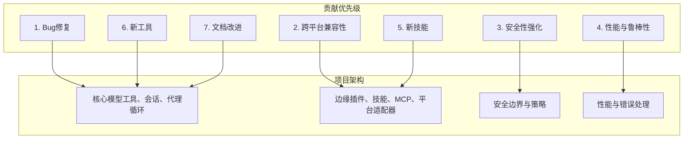
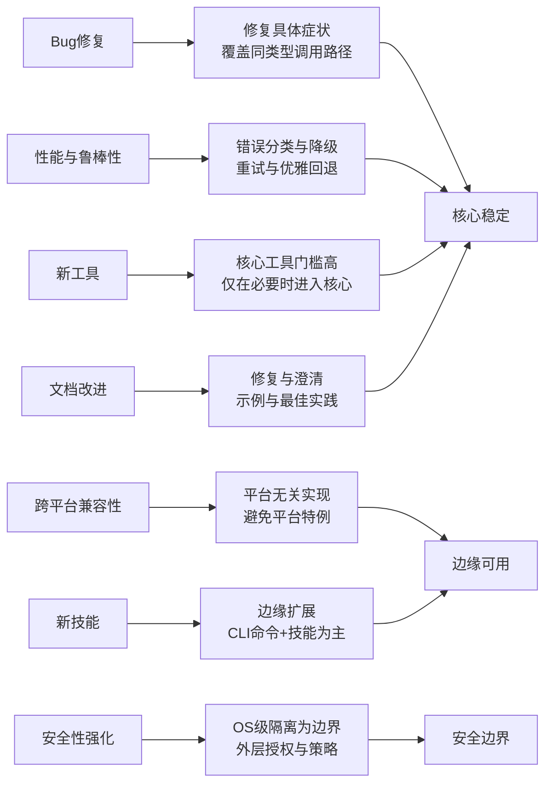
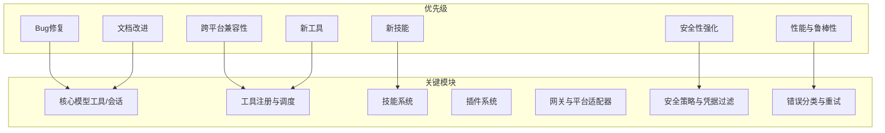

# 贡献优先级与原则

<cite>
**本文档引用的文件**
- [CONTRIBUTING.md](file://CONTRIBUTING.md)
- [SECURITY.md](file://SECURITY.md)
- [AGENTS.md](file://AGENTS.md)
- [.github/PULL_REQUEST_TEMPLATE.md](file://.github/PULL_REQUEST_TEMPLATE.md)
- [tools/skills_guard.py](file://tools/skills_guard.py)
- [tools/approval.py](file://tools/approval.py)
- [agent/error_classifier.py](file://agent/error_classifier.py)
- [agent/conversation_loop.py](file://agent/conversation_loop.py)
- [scripts/check-windows-footguns.py](file://scripts/check-windows-footguns.py)
</cite>

## 目录
1. [简介](#简介)
2. [项目结构](#项目结构)
3. [核心组件](#核心组件)
4. [架构总览](#架构总览)
5. [详细组件分析](#详细组件分析)
6. [依赖关系分析](#依赖关系分析)
7. [性能考量](#性能考量)
8. [故障排查指南](#故障排查指南)
9. [结论](#结论)
10. [附录](#附录)

## 简介
本文件系统化阐述本项目的贡献优先级与原则，围绕七项优先级展开：bug修复、跨平台兼容性、安全性强化、性能与鲁棒性、新增技能、新增工具、文档改进。我们旨在帮助贡献者快速理解项目的质量要求、评估标准与决策流程，确保每次提交都能对整体系统产生积极影响。

## 项目结构
本项目采用“核心保守、边缘扩展”的设计哲学：核心模型工具与系统提示保持最小表面，能力主要通过插件、技能与外部MCP服务扩展。贡献优先级直接服务于这一架构目标，确保“最小表面”不被无谓膨胀，同时保证用户价值最大化。

图示来源
- [CONTRIBUTING.md:7-17](file://CONTRIBUTING.md#L7-L17)
- [AGENTS.md:16-50](file://AGENTS.md#L16-L50)

章节来源
- [CONTRIBUTING.md:7-17](file://CONTRIBUTING.md#L7-L17)
- [AGENTS.md:16-50](file://AGENTS.md#L16-L50)

## 核心组件
- 贡献优先级清单与评估标准
  - 七项优先级明确且可操作，覆盖从基础稳定性到产品扩展的关键维度。
- 安全策略与信任模型
  - 明确OS级隔离为唯一安全边界，内生启发式仅为辅助；对外部表面与授权有严格规范。
- 性能与鲁棒性实践
  - 错误分类与降级、指数退避与节流、中断感知与优雅回退等机制贯穿运行期。
- 贡献流程与模板
  - PR模板与检查清单确保变更可追踪、可验证、可回归。

章节来源
- [CONTRIBUTING.md:7-17](file://CONTRIBUTING.md#L7-L17)
- [SECURITY.md:32-120](file://SECURITY.md#L32-L120)
- [AGENTS.md:29-95](file://AGENTS.md#L29-L95)
- [.github/PULL_REQUEST_TEMPLATE.md:13-76](file://.github/PULL_REQUEST_TEMPLATE.md#L13-L76)

## 架构总览
贡献优先级与架构目标高度一致：核心工具最小化、能力在边缘扩展、安全边界清晰、性能鲁棒性贯穿始终。下图展示贡献优先级如何映射到系统关键路径。

图示来源
- [CONTRIBUTING.md:7-17](file://CONTRIBUTING.md#L7-L17)
- [SECURITY.md:32-120](file://SECURITY.md#L32-L120)
- [AGENTS.md:16-50](file://AGENTS.md#L16-L50)

## 详细组件分析

### 1. Bug修复（最高优先级）
- 重要性
  - 修复崩溃、行为异常、数据丢失等直接影响用户体验与系统稳定性的缺陷。
- 评估标准
  - 必须能复现当前主分支上的症状，并定位到具体行号；修复需覆盖同类调用路径，而非仅修复单点。
- 判断依据
  - 优先级第一，评审与合并节奏应快于其他类型。
- 决策流程
  - 提交PR时标注“修复问题”类型，提供复现步骤与修复范围；测试需覆盖主干与同类场景。

章节来源
- [CONTRIBUTING.md:11](file://CONTRIBUTING.md#L11)
- [AGENTS.md:127-169](file://AGENTS.md#L127-L169)

### 2. 跨平台兼容性
- 重要性
  - 在Linux、macOS、Windows（含WSL2/Windows终端）与移动端（Termux）均稳定运行。
- 评估标准
  - 避免平台特例调用（如`os.kill(pid, 0)`），统一使用跨平台库或条件分支。
  - 对Windows特有的路径、编码、进程管理差异进行显式处理。
- 判断依据
  - 提交前运行跨平台脚本检测常见不安全模式；涉及平台差异的变更必须在多平台验证。
- 决策流程
  - 在PR中勾选跨平台影响评估；提供平台列表与验证结果。

章节来源
- [CONTRIBUTING.md:12](file://CONTRIBUTING.md#L12)
- [CONTRIBUTING.md:627-800](file://CONTRIBUTING.md#L627-L800)
- [scripts/check-windows-footguns.py](file://scripts/check-windows-footguns.py)

### 3. 安全性强化
- 重要性
  - OS级隔离是唯一安全边界，内生启发式仅为辅助；对外部表面与授权严格控制。
- 评估标准
  - 外部表面（网关、HTTP、编辑器适配器、本地IPC）必须强制授权；允许白名单配置缺失即为缺陷。
  - 凭证作用域与环境变量过滤需符合策略；第三方插件/技能安装前必须经人工审查。
- 判断依据
  - 安全漏洞报告与处置遵循既定政策；任何绕过OS级隔离或破坏授权控制的行为属于高优修复。
- 决策流程
  - 涉及安全的PR需标注“安全修复”，并附带风险评估与缓解方案；必要时进行安全审计。

章节来源
- [CONTRIBUTING.md:13](file://CONTRIBUTING.md#L13)
- [SECURITY.md:32-120](file://SECURITY.md#L32-L120)
- [tools/skills_guard.py:203-260](file://tools/skills_guard.py#L203-L260)
- [tools/approval.py](file://tools/approval.py)

### 4. 性能与鲁棒性
- 重要性
  - 通过错误分类、重试与优雅降级提升系统在不稳定环境下的可用性。
- 评估标准
  - 错误分类需区分请求格式错误（不可重试）与服务器错误（可重试）；对超载与限流场景给出明确策略。
  - 重试需具备指数退避与抖动，避免雪崩；在等待期间保持活动心跳，防止监控误判。
- 判断依据
  - 性能与鲁棒性变更应有明确的失败模式与恢复策略；避免盲目增加重试导致资源浪费。
- 决策流程
  - 在PR中描述失败场景、重试参数与观测指标；提供测试用例覆盖重试耗尽与瞬时故障。

章节来源
- [CONTRIBUTING.md:14](file://CONTRIBUTING.md#L14)
- [agent/error_classifier.py:866-901](file://agent/error_classifier.py#L866-L901)
- [agent/conversation_loop.py:1363-1384](file://agent/conversation_loop.py#L1363-L1384)

### 5. 新技能
- 重要性
  - 技能是能力扩展的主要方式，优先采用CLI命令+技能模式，避免向核心工具增加负担。
- 评估标准
  - 技能应广泛适用，避免引入重型依赖；若非通用，建议放入可选技能或Skills Hub。
  - 技能内容需遵循标准格式（frontmatter、触发条件、步骤、陷阱、验证）。
- 判断依据
  - 新增技能的优先级低于bug修复与跨平台兼容性；若能通过现有工具/技能组合解决，则不新增。
- 决策流程
  - 在PR中勾选“新增技能”，提供技能用途、安装与验证方法；确保end-to-end测试通过。

章节来源
- [CONTRIBUTING.md:15](file://CONTRIBUTING.md#L15)
- [CONTRIBUTING.md:21-49](file://CONTRIBUTING.md#L21-L49)
- [.github/PULL_REQUEST_TEMPLATE.md:23](file://.github/PULL_REQUEST_TEMPLATE.md#L23-L71)

### 6. 新工具
- 重要性
  - 核心工具随每次API调用发送，新增成本高；优先通过插件、MCP或技能替代。
- 评估标准
  - 仅当能力无法通过终端+文件工具或MCP服务器满足时才考虑核心工具；需在工具集与插件间权衡。
- 判断依据
  - 工具新增优先级低于技能；若已有等效能力，不应重复造轮子。
- 决策流程
  - 在PR中说明“工具集/插件/MCP替代方案是否已存在”；提供Schema与注册流程。

章节来源
- [CONTRIBUTING.md:16](file://CONTRIBUTING.md#L16)
- [AGENTS.md:171-201](file://AGENTS.md#L171-L201)
- [.github/PULL_REQUEST_TEMPLATE.md:22](file://.github/PULL_REQUEST_TEMPLATE.md#L22)

### 7. 文档改进
- 重要性
  - 修复与澄清文档有助于降低学习成本与使用风险。
- 评估标准
  - 文档更新需准确、简洁、可操作；示例应与实际实现一致。
- 判断依据
  - 文档优先级低于安全与性能；但对安全边界、跨平台差异等关键信息的修正应优先处理。
- 决策流程
  - 在PR中勾选“文档更新”，提供修改前后对比与验证路径。

章节来源
- [CONTRIBUTING.md:17](file://CONTRIBUTING.md#L17)
- [.github/PULL_REQUEST_TEMPLATE.md:53-62](file://.github/PULL_REQUEST_TEMPLATE.md#L53-L62)

## 依赖关系分析
贡献优先级与系统关键模块的耦合关系如下：

图示来源
- [CONTRIBUTING.md:7-17](file://CONTRIBUTING.md#L7-L17)
- [SECURITY.md:121-169](file://SECURITY.md#L121-L169)
- [AGENTS.md:171-201](file://AGENTS.md#L171-L201)

章节来源
- [CONTRIBUTING.md:7-17](file://CONTRIBUTING.md#L7-L17)
- [SECURITY.md:121-169](file://SECURITY.md#L121-L169)
- [AGENTS.md:171-201](file://AGENTS.md#L171-L201)

## 性能考量
- 错误分类与降级
  - 将错误分为“请求格式错误（不可重试）”、“服务器错误（可重试）”、“超载/限流（可重试）”三类，指导后续动作。
- 重试策略
  - 指数退避+抖动，避免雪崩；在等待期间定期“触活”以维持监控感知。
- 中断与优雅回退
  - 在重试等待期间响应中断，保存会话状态并返回明确提示，避免无效占用。

章节来源
- [agent/error_classifier.py:866-901](file://agent/error_classifier.py#L866-L901)
- [agent/conversation_loop.py:1363-1384](file://agent/conversation_loop.py#L1363-L1384)

## 故障排查指南
- 安全性相关
  - 若怀疑技能/插件存在注入或越权风险，参考安全策略中的信任模型与边界定义；必要时进行安装前审查。
- 跨平台问题
  - 使用跨平台检测脚本识别潜在不安全模式；针对Windows特有的路径、编码、进程管理差异逐一修正。
- 性能与鲁棒性
  - 检查错误分类逻辑是否正确区分可重试与不可重试；确认重试参数与日志记录完整。
- 文档一致性
  - 对照PR模板与贡献指南，确保变更描述、测试步骤与平台验证齐全。

章节来源
- [SECURITY.md:222-294](file://SECURITY.md#L222-L294)
- [CONTRIBUTING.md:627-800](file://CONTRIBUTING.md#L627-L800)
- [.github/PULL_REQUEST_TEMPLATE.md:25-76](file://.github/PULL_REQUEST_TEMPLATE.md#L25-L76)

## 结论
贡献优先级与项目架构目标高度契合：以最小核心换取最大扩展性，以安全边界与鲁棒性保障系统稳定，以跨平台兼容性扩大可用范围。贡献者应以此为准则，在每个PR中明确其优先级类别、评估标准与决策依据，确保每次提交都能推动项目向更安全、更可靠、更易用的方向演进。

## 附录
- 贡献流程速查
  - 在PR模板中勾选变更类型，按需填写测试步骤与平台验证；对安全、跨平台与性能变更提供额外说明。
- 关键文件索引
  - 贡献指南与优先级：[CONTRIBUTING.md](file://CONTRIBUTING.md)
  - 安全策略与信任模型：[SECURITY.md](file://SECURITY.md)
  - 架构与贡献取舍：[AGENTS.md](file://AGENTS.md)
  - PR模板与检查清单：[PULL_REQUEST_TEMPLATE.md](file://.github/PULL_REQUEST_TEMPLATE.md)