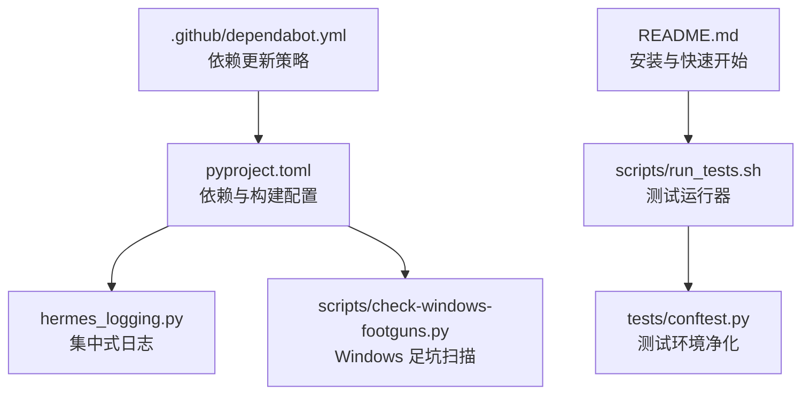
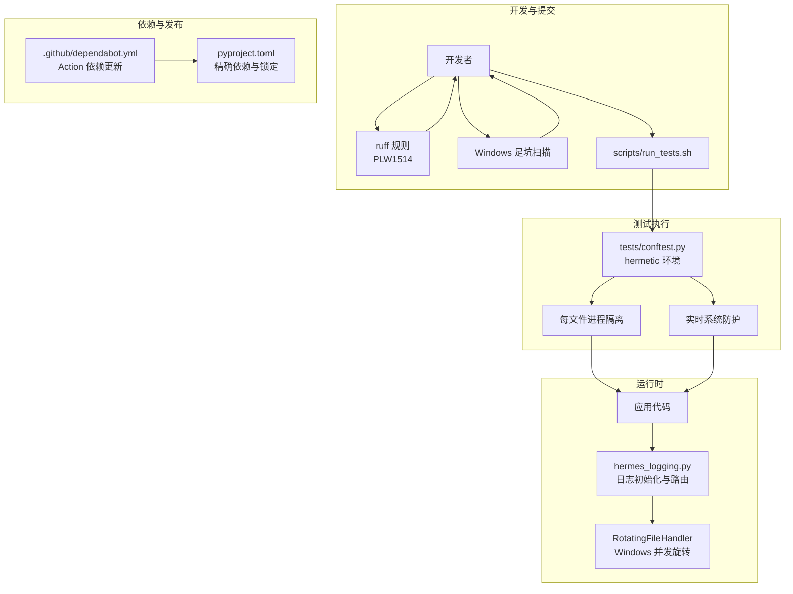
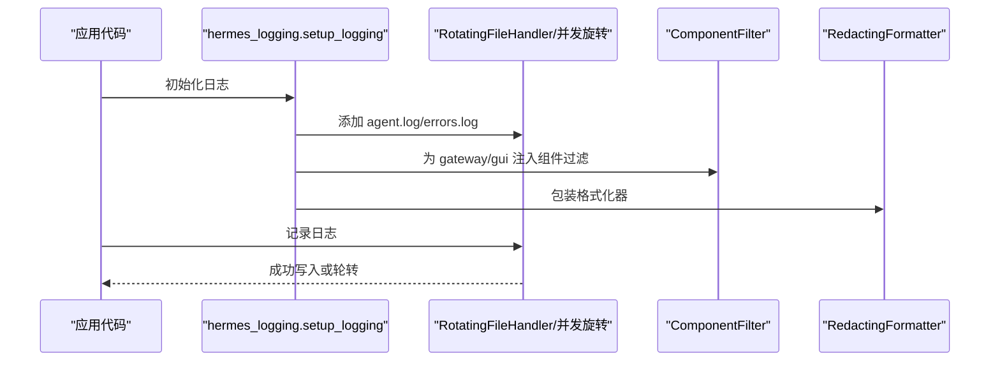
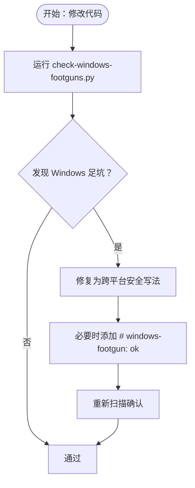
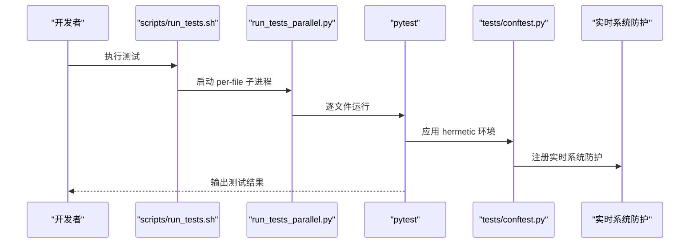
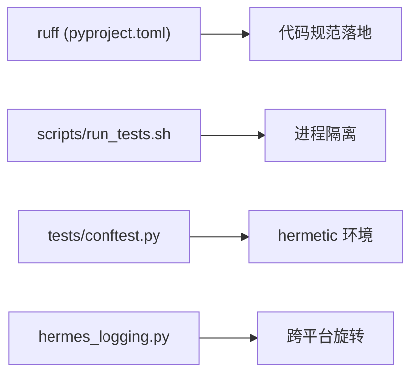

# 代码质量保证

<cite>
**本文档引用的文件**
- [pyproject.toml](file://pyproject.toml)
- [CONTRIBUTING.md](file://CONTRIBUTING.md)
- [hermes_logging.py](file://hermes_logging.py)
- [scripts/check-windows-footguns.py](file://scripts/check-windows-footguns.py)
- [scripts/run_tests.sh](file://scripts/run_tests.sh)
- [tests/conftest.py](file://tests/conftest.py)
- [.github/dependabot.yml](file://.github/dependabot.yml)
- [README.md](file://README.md)
</cite>

## 目录
1. [简介](#简介)
2. [项目结构](#项目结构)
3. [核心组件](#核心组件)
4. [架构总览](#架构总览)
5. [详细组件分析](#详细组件分析)
6. [依赖分析](#依赖分析)
7. [性能考虑](#性能考虑)
8. [故障排查指南](#故障排查指南)
9. [结论](#结论)
10. [附录](#附录)

## 简介
本指南面向 Hermes Agent 的贡献者与维护者，系统化阐述代码质量保证策略，覆盖以下方面：
- 代码风格规范（PEP 8 及项目特例）
- 错误处理最佳实践（异常捕获、日志记录、栈追踪）
- 跨平台兼容性（Windows、macOS、Linux 差异处理）
- 静态分析工具使用与配置
- 代码覆盖率与 CI 质量门禁
- 代码审查清单与常见问题解决

## 项目结构
Hermes Agent 是一个多模块 Python 应用，包含 CLI、网关、工具集、技能系统、测试套件等。质量保证体系围绕以下关键点展开：
- 统一的依赖与构建配置（pyproject.toml）
- 跨平台脚本与检查器（scripts/）
- 集中式日志系统（hermes_logging.py）
- 测试隔离与环境净化（tests/conftest.py、scripts/run_tests.sh）
- 依赖更新策略（Dependabot）

图表来源
- [pyproject.toml:1-379](file://pyproject.toml#L1-L379)
- [hermes_logging.py:1-566](file://hermes_logging.py#L1-L566)
- [scripts/check-windows-footguns.py:1-633](file://scripts/check-windows-footguns.py#L1-L633)
- [scripts/run_tests.sh:1-80](file://scripts/run_tests.sh#L1-L80)
- [tests/conftest.py:1-878](file://tests/conftest.py#L1-L878)
- [.github/dependabot.yml:1-45](file://.github/dependabot.yml#L1-L45)
- [README.md:1-224](file://README.md#L1-L224)

章节来源
- [pyproject.toml:1-379](file://pyproject.toml#L1-L379)
- [README.md:1-224](file://README.md#L1-L224)

## 核心组件
- 代码风格与静态分析：遵循 PEP 8 并在 pyproject.toml 中通过 ruff 启用关键规则（如 PLW1514），同时提供 per-file 忽略策略以适配测试与用户插件目录。
- 日志系统：统一的日志初始化、按组件路由、会话上下文注入、跨平台旋转处理器选择（Windows 使用并发旋转）。
- 跨平台检查：专用脚本扫描常见 Windows 不安全模式，提供抑制标记与路径白名单。
- 测试环境：严格的 hermetic 环境（凭据变量清空、独立 HERMES_HOME、确定性时区/语言、进程隔离）。
- 依赖管理：仅对 GitHub Actions 启用 Dependabot；源依赖采用精确锁定与手动升级。

章节来源
- [pyproject.toml:359-379](file://pyproject.toml#L359-L379)
- [hermes_logging.py:231-349](file://hermes_logging.py#L231-L349)
- [scripts/check-windows-footguns.py:138-327](file://scripts/check-windows-footguns.py#L138-L327)
- [tests/conftest.py:327-401](file://tests/conftest.py#L327-L401)
- [.github/dependabot.yml:1-45](file://.github/dependabot.yml#L1-L45)

## 架构总览
下图展示质量保证相关组件之间的交互关系：

图表来源
- [pyproject.toml:359-379](file://pyproject.toml#L359-L379)
- [scripts/check-windows-footguns.py:553-628](file://scripts/check-windows-footguns.py#L553-L628)
- [scripts/run_tests.sh:61-79](file://scripts/run_tests.sh#L61-L79)
- [tests/conftest.py:528-800](file://tests/conftest.py#L528-L800)
- [hermes_logging.py:38-66](file://hermes_logging.py#L38-L66)
- [.github/dependabot.yml:24-45](file://.github/dependabot.yml#L24-L45)

## 详细组件分析

### 代码风格与静态分析
- 基础规范：遵循 PEP 8，并在项目文档中明确“不强制严格行长”等务实例外。
- 关键规则启用：ruff 在 pyproject.toml 中启用 PLW1514（文本文件 open 缺少显式 encoding），这是为避免 Windows 默认编码导致的非 ASCII 文件损坏。
- 忽略范围：针对 tests/、skills/、optional-skills/、plugins/ 等目录放宽该规则，允许这些区域用于用户或外部内容的编写灵活性。
- 类型检查：保留类型检查通道（ty），但当前重点是通过 ruff 强制关键规则，后续可逐步扩展类型检查覆盖面。

建议实践
- 新增文件前先运行 ruff 检查，修复 PLW1514 等关键警告。
- 对于测试与示例代码，若确需覆盖忽略范围，请在对应文件顶部添加注释说明原因（参考 per-file-ignores 的使用方式）。

章节来源
- [CONTRIBUTING.md:287-293](file://CONTRIBUTING.md#L287-L293)
- [pyproject.toml:359-379](file://pyproject.toml#L359-L379)

### 错误处理与日志记录
- 统一入口：setup_logging 提供集中式日志初始化，支持多文件处理器、组件过滤、会话上下文注入。
- 跨平台旋转：Windows 使用并发旋转处理器（ConcurrentRotatingFileHandler）避免 rename 冲突；其他平台使用标准 RotatingFileHandler。
- 安全格式化：所有处理器均使用 RedactingFormatter，防止敏感信息落盘。
- 控制台调试：setup_verbose_logging 支持 --verbose 输出到 stderr，确保 Unicode 兼容。

图表来源
- [hermes_logging.py:231-349](file://hermes_logging.py#L231-L349)
- [hermes_logging.py:38-66](file://hermes_logging.py#L38-L66)

章节来源
- [hermes_logging.py:231-349](file://hermes_logging.py#L231-L349)
- [hermes_logging.py:387-504](file://hermes_logging.py#L387-L504)

### 跨平台兼容性
- Windows 特定风险扫描：脚本 check-windows-footguns.py 覆盖 os.kill(pid,0)、裸信号常量、裸 os.setsid/os.killpg、子进程 shebang 调用、wmic 使用、OneDrive Desktop 路径陷阱等。
- 运行前检查：CONTRIBUTING.md 明确在 PR 前运行该脚本，且提供抑制标记（# windows-footgun: ok）。
- 代码级防护：hermes_logging.py 在 Windows 上自动切换到并发旋转处理器；tests/conftest.py 在测试期间拦截真实信号与 systemd/systemctl 调用，避免误伤宿主系统。

图表来源
- [scripts/check-windows-footguns.py:138-327](file://scripts/check-windows-footguns.py#L138-L327)
- [CONTRIBUTING.md:627-797](file://CONTRIBUTING.md#L627-L797)

章节来源
- [scripts/check-windows-footguns.py:138-327](file://scripts/check-windows-footguns.py#L138-L327)
- [CONTRIBUTING.md:627-797](file://CONTRIBUTING.md#L627-L797)

### 测试与质量门禁
- hermetic 环境：tests/conftest.py 清理凭据与行为相关环境变量、重定向 HERMES_HOME 到临时目录、设置确定性时区与语言、禁用 AWS IMDS、清理插件单例。
- 进程隔离：scripts/run_tests.sh 通过 scripts/run_tests_parallel.py 以“每文件独立子进程”的方式运行，避免模块级状态泄漏。
- 实时系统防护：tests/conftest.py 拦截 os.kill/os.killpg/subprocess.* 等可能影响宿主系统的调用，除非显式标注 bypass。
- CI 一致性：scripts/run_tests.sh 设置 TZ=UTC、LANG=C.UTF-8、PYTHONHASHSEED=0、PYTHONDONTWRITEBYTECODE=1 等环境变量，确保本地与 CI 行为一致。

图表来源
- [scripts/run_tests.sh:61-79](file://scripts/run_tests.sh#L61-L79)
- [tests/conftest.py:327-401](file://tests/conftest.py#L327-L401)
- [tests/conftest.py:528-800](file://tests/conftest.py#L528-L800)

章节来源
- [scripts/run_tests.sh:1-80](file://scripts/run_tests.sh#L1-L80)
- [tests/conftest.py:327-401](file://tests/conftest.py#L327-L401)
- [tests/conftest.py:528-800](file://tests/conftest.py#L528-L800)

### 依赖与版本管理
- Dependabot 作用域：仅对 GitHub Actions 启用，避免对源依赖（pip/npm）进行自动版本提升，保持精确锁定策略。
- 安全更新：通过仓库的安全更新设置单独触发已知 CVE 的安全补丁 PR。
- 依赖策略：pyproject.toml 中对关键依赖（如 pydantic、requests、urllib3 等）采用精确版本，降低供应链风险。

章节来源
- [.github/dependabot.yml:1-45](file://.github/dependabot.yml#L1-L45)
- [pyproject.toml:24-133](file://pyproject.toml#L24-L133)

## 依赖分析
- 工具链耦合：ruff 作为静态检查工具，与 pyproject.toml 的 lint 配置强耦合；PLW1514 的启用直接驱动编码规范落地。
- 测试隔离：scripts/run_tests.sh 与 tests/conftest.py 形成“运行器 + 固定夹具”的组合，确保测试稳定性与可重复性。
- 日志系统：hermes_logging.py 与平台特性（Windows 并发旋转）存在条件依赖，避免了跨平台文件锁差异带来的问题。

图表来源
- [pyproject.toml:359-379](file://pyproject.toml#L359-L379)
- [scripts/run_tests.sh:61-79](file://scripts/run_tests.sh#L61-L79)
- [tests/conftest.py:327-401](file://tests/conftest.py#L327-L401)
- [hermes_logging.py:38-66](file://hermes_logging.py#L38-L66)

章节来源
- [pyproject.toml:359-379](file://pyproject.toml#L359-L379)
- [scripts/run_tests.sh:61-79](file://scripts/run_tests.sh#L61-L79)
- [tests/conftest.py:327-401](file://tests/conftest.py#L327-L401)
- [hermes_logging.py:38-66](file://hermes_logging.py#L38-L66)

## 性能考虑
- 测试运行器通过“每文件独立子进程”避免共享状态开销，提高稳定性而非追求极致速度。
- 日志轮转在 Windows 上采用并发旋转，减少文件锁竞争；在 POSIX 上使用标准旋转，避免额外依赖。
- hermetic 环境设置（确定性 locale/hashseed）有助于减少测试抖动，间接提升回归效率。

## 故障排查指南
- Windows 足坑误报/漏报
  - 使用脚本列出规则：python scripts/check-windows-footguns.py --list
  - 对于明显受保护的代码，添加 # windows-footgun: ok 抑制标记
  - 对整文件进行测试覆盖的场景，可在规则定义中加入 path_allowlist
- 日志文件无法轮转（Windows）
  - 确认 concurrent-log-handler 依赖已安装（仅 Windows 条件引入）
  - 检查是否存在其他进程持有日志文件句柄（并发访问）
- 测试误触宿主系统
  - 若测试需要真实信号行为，使用 @pytest.mark.live_system_guard_bypass 标记
  - 避免在测试中直接调用 os.kill/os.killpg/subprocess.* 或 systemctl hermes-* 命令
- 编码问题（Windows）
  - 文本文件读写必须显式指定 encoding='utf-8' 或 'utf-8-sig'
  - 避免使用 open(path, 'r') 等默认编码

章节来源
- [scripts/check-windows-footguns.py:544-551](file://scripts/check-windows-footguns.py#L544-L551)
- [hermes_logging.py:38-66](file://hermes_logging.py#L38-L66)
- [tests/conftest.py:528-800](file://tests/conftest.py#L528-L800)

## 结论
本指南基于现有代码库提炼出一套可操作的质量保证流程：以 ruff 和 Windows 足坑扫描为静态防线，以 hermetic 测试与实时系统防护为动态保障，以集中式日志与跨平台旋转为运行期可观测性基础。建议在日常开发中坚持：
- 提交前运行静态检查与 Windows 足坑扫描
- 使用 scripts/run_tests.sh 保证测试环境一致性
- 在日志与文件 I/O 中遵循显式编码与跨平台约定
- 对依赖更新采用“手动升级 + 安全补丁”策略

## 附录

### 代码风格规范要点
- 遵循 PEP 8，注释仅在必要时解释非显而易见的设计意图
- 错误处理：捕获具体异常，使用 logger.warning/error 记录，遇到意外错误时开启 exc_info
- 跨平台：避免假设 Unix 行为，优先使用 psutil、pathlib、shutil.which 等跨平台能力

章节来源
- [CONTRIBUTING.md:287-293](file://CONTRIBUTING.md#L287-L293)

### 代码审查清单
- 是否通过 ruff PLW1514 检查？
- 是否通过 Windows 足坑扫描？必要时添加抑制标记
- 是否使用显式 encoding='utf-8' 处理文本文件？
- 是否使用 psutil 替代 os.kill(pid,0) 等平台特定调用？
- 测试是否在 hermetic 环境下运行？是否避免真实信号与系统命令？
- 日志输出是否使用 RedactingFormatter？敏感信息是否被脱敏？

章节来源
- [pyproject.toml:359-379](file://pyproject.toml#L359-L379)
- [scripts/check-windows-footguns.py:553-628](file://scripts/check-windows-footguns.py#L553-L628)
- [tests/conftest.py:528-800](file://tests/conftest.py#L528-L800)
- [hermes_logging.py:288-300](file://hermes_logging.py#L288-L300)