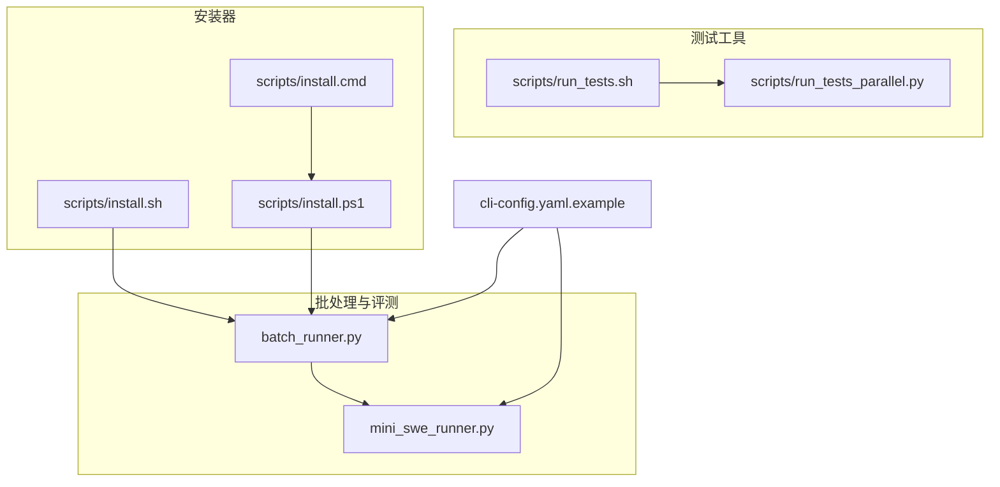
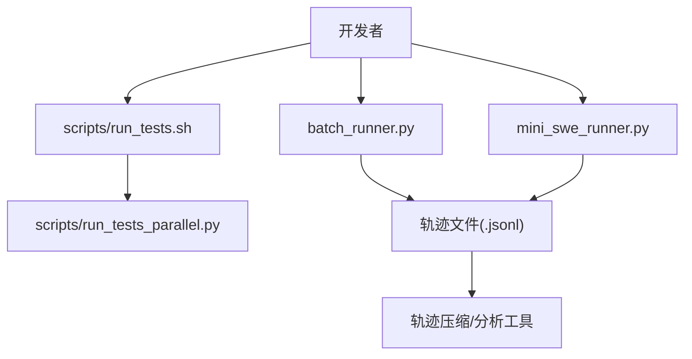
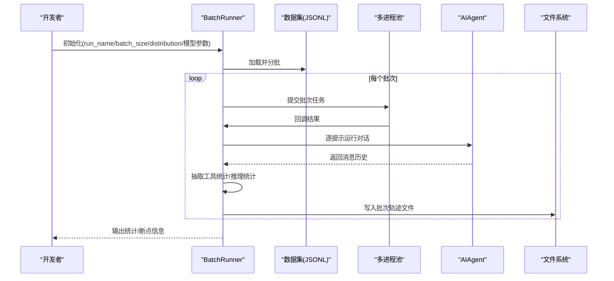
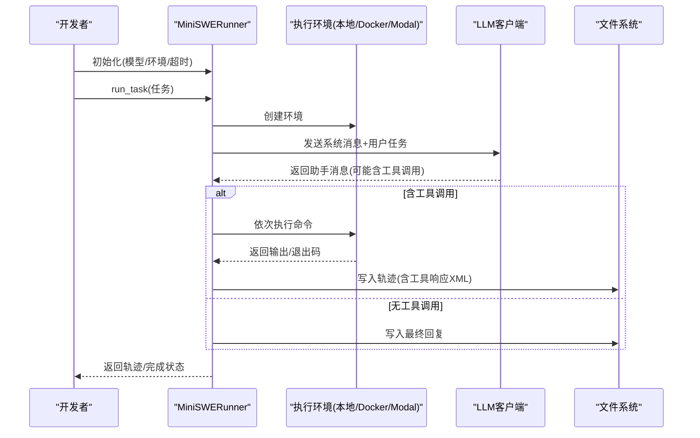
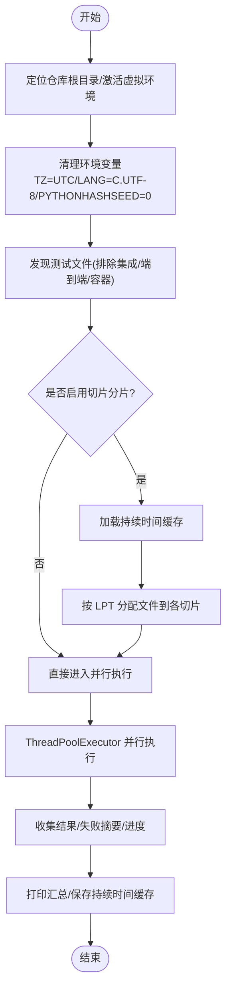
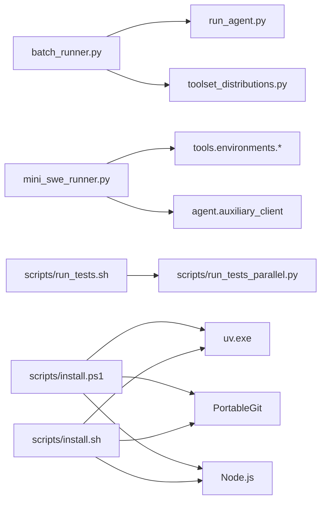

# 开发工具与脚本

<cite>
**本文引用的文件**
- [batch_runner.py](file://batch_runner.py)
- [mini_swe_runner.py](file://mini_swe_runner.py)
- [scripts/run_tests.sh](file://scripts/run_tests.sh)
- [scripts/run_tests_parallel.py](file://scripts/run_tests_parallel.py)
- [scripts/install.sh](file://scripts/install.sh)
- [scripts/install.ps1](file://scripts/install.ps1)
- [scripts/install.cmd](file://scripts/install.cmd)
- [cli-config.yaml.example](file://cli-config.yaml.example)
</cite>

## 目录
1. [简介](#简介)
2. [项目结构](#项目结构)
3. [核心组件](#核心组件)
4. [架构总览](#架构总览)
5. [详细组件分析](#详细组件分析)
6. [依赖分析](#依赖分析)
7. [性能考虑](#性能考虑)
8. [故障排查指南](#故障排查指南)
9. [结论](#结论)
10. [附录](#附录)

## 简介
本指南聚焦于项目中的开发工具与脚本体系，涵盖以下方面：
- 测试执行脚本：统一入口、并行执行、隔离与可重复性保障
- 批量处理工具：批处理运行器与迷你 SWE 跑分器，支持轨迹输出与复用
- 辅助脚本：跨平台安装器（Linux/macOS/Android/Termux 与 Windows）
- 配置与定制：环境变量、工具链配置、CLI 示例配置
- 自动化方案：代码格式化、静态分析、测试执行等常见任务的流水线化
- 效率提升：并行度控制、切片分片、确定性环境、失败快速反馈

## 项目结构
围绕“开发工具与脚本”的关键目录与文件：
- 批处理与评测
  - batch_runner.py：多提示并行批处理、断点续跑、轨迹保存、统计聚合
  - mini_swe_runner.py：面向 SWE 的轻量执行器，兼容批处理轨迹格式
- 测试框架
  - scripts/run_tests.sh：统一测试入口，确保与 CI 行为一致
  - scripts/run_tests_parallel.py：按文件粒度并行执行，避免模块级状态泄漏
- 安装与环境准备
  - scripts/install.sh：Linux/macOS/Android/Termux 安装器
  - scripts/install.ps1：Windows 安装器（含便携 Git/Node/uv）
  - scripts/install.cmd：Windows CMD 包装器
- 配置参考
  - cli-config.yaml.example：CLI 配置示例

图表来源
- [scripts/run_tests.sh:1-80](file://scripts/run_tests.sh#L1-L80)
- [scripts/run_tests_parallel.py:1-120](file://scripts/run_tests_parallel.py#L1-L120)
- [batch_runner.py:1-120](file://batch_runner.py#L1-L120)
- [mini_swe_runner.py:1-120](file://mini_swe_runner.py#L1-L120)
- [scripts/install.sh:1-120](file://scripts/install.sh#L1-L120)
- [scripts/install.ps1:1-120](file://scripts/install.ps1#L1-L120)
- [scripts/install.cmd:1-29](file://scripts/install.cmd#L1-L29)
- [cli-config.yaml.example](file://cli-config.yaml.example)

章节来源
- [scripts/run_tests.sh:1-80](file://scripts/run_tests.sh#L1-L80)
- [scripts/run_tests_parallel.py:1-120](file://scripts/run_tests_parallel.py#L1-L120)
- [batch_runner.py:1-120](file://batch_runner.py#L1-L120)
- [mini_swe_runner.py:1-120](file://mini_swe_runner.py#L1-L120)
- [scripts/install.sh:1-120](file://scripts/install.sh#L1-L120)
- [scripts/install.ps1:1-120](file://scripts/install.ps1#L1-L120)
- [scripts/install.cmd:1-29](file://scripts/install.cmd#L1-L29)
- [cli-config.yaml.example](file://cli-config.yaml.example)

## 核心组件
- 批处理运行器（batch_runner.py）
  - 功能：加载数据集、分批、并行处理、断点续跑、轨迹保存、工具使用统计、推理覆盖率统计
  - 关键特性：容器镜像沙箱选择、轨迹格式标准化、错误计数归一化、按提示文本恢复
- 迷你 SWE 跑分器（mini_swe_runner.py）
  - 功能：单任务或多任务执行，终端工具驱动，Hermes 轨迹格式输出，兼容批处理压缩管线
  - 关键特性：本地/Docker/Modal 多后端、温度适配、系统消息格式化、最终输出标记
- 统一测试执行（scripts/run_tests.sh + scripts/run_tests_parallel.py）
  - 功能：以脚本为单位并行执行，隔离每个文件的 Python 子进程，清理环境变量，设定时区与哈希种子
  - 关键特性：通过 run_tests_parallel.py 实现 per-file 并行；支持切片分片（CI 均衡）
- 跨平台安装器
  - Linux/macOS/Android/Termux：scripts/install.sh（uv/Python/Node/Git 检测与安装）
  - Windows：scripts/install.ps1（便携 Git/Node/uv，环境变量同步），scripts/install.cmd 包装

章节来源
- [batch_runner.py:527-720](file://batch_runner.py#L527-L720)
- [mini_swe_runner.py:157-242](file://mini_swe_runner.py#L157-L242)
- [scripts/run_tests.sh:1-80](file://scripts/run_tests.sh#L1-L80)
- [scripts/run_tests_parallel.py:596-720](file://scripts/run_tests_parallel.py#L596-L720)
- [scripts/install.sh:490-620](file://scripts/install.sh#L490-L620)
- [scripts/install.ps1:321-422](file://scripts/install.ps1#L321-L422)
- [scripts/install.cmd:1-29](file://scripts/install.cmd#L1-L29)

## 架构总览
下图展示测试执行与批处理工具在整体开发流程中的位置与交互。

图表来源
- [scripts/run_tests.sh:1-80](file://scripts/run_tests.sh#L1-L80)
- [scripts/run_tests_parallel.py:596-720](file://scripts/run_tests_parallel.py#L596-L720)
- [batch_runner.py:400-525](file://batch_runner.py#L400-L525)
- [mini_swe_runner.py:579-630](file://mini_swe_runner.py#L579-L630)

## 详细组件分析

### 批处理运行器（batch_runner.py）
- 设计要点
  - 使用 multiprocessing 并行处理批次，结合断点续跑与进度统计
  - 工具使用统计与推理覆盖率统计标准化，保证数据集一致性
  - 支持容器镜像沙箱（Docker/Modal/Singularity/Daytona）按提示动态覆盖
- 关键流程（序列图）

图表来源
- [batch_runner.py:527-641](file://batch_runner.py#L527-L641)
- [batch_runner.py:400-525](file://batch_runner.py#L400-L525)
- [batch_runner.py:244-398](file://batch_runner.py#L244-L398)

章节来源
- [batch_runner.py:527-720](file://batch_runner.py#L527-L720)
- [batch_runner.py:720-800](file://batch_runner.py#L720-L800)

### 迷你 SWE 跑分器（mini_swe_runner.py）
- 设计要点
  - 以终端工具为核心，驱动命令执行，输出符合 Hermes 轨迹格式的消息序列
  - 支持本地/容器/云后端，自动选择合适环境
  - 将工具定义注入系统消息，便于模型正确调用
- 关键流程（序列图）

图表来源
- [mini_swe_runner.py:157-242](file://mini_swe_runner.py#L157-L242)
- [mini_swe_runner.py:414-578](file://mini_swe_runner.py#L414-L578)
- [mini_swe_runner.py:579-630](file://mini_swe_runner.py#L579-L630)

章节来源
- [mini_swe_runner.py:157-242](file://mini_swe_runner.py#L157-L242)
- [mini_swe_runner.py:414-578](file://mini_swe_runner.py#L414-L578)
- [mini_swe_runner.py:579-630](file://mini_swe_runner.py#L579-L630)

### 统一测试执行（scripts/run_tests.sh + scripts/run_tests_parallel.py）
- 设计要点
  - run_tests.sh 以脚本为单位并行执行，确保每文件独立 Python 解释器，避免模块级状态泄漏
  - run_tests_parallel.py 支持工作线程数、发现根路径、文件超时、切片分片、持续时间缓存
  - 清理环境变量（TZ/LANG/PYTHONHASHSEED 等），保证可重复性
- 关键流程（流程图）

图表来源
- [scripts/run_tests.sh:1-80](file://scripts/run_tests.sh#L1-L80)
- [scripts/run_tests_parallel.py:596-800](file://scripts/run_tests_parallel.py#L596-L800)

章节来源
- [scripts/run_tests.sh:1-80](file://scripts/run_tests.sh#L1-L80)
- [scripts/run_tests_parallel.py:1-120](file://scripts/run_tests_parallel.py#L1-L120)
- [scripts/run_tests_parallel.py:596-800](file://scripts/run_tests_parallel.py#L596-L800)

### 跨平台安装器
- Linux/macOS/Android/Termux（scripts/install.sh）
  - 检测/安装 uv、Python 3.11、Git、Node.js（可选桌面构建）
  - FHS 布局（root 用户）与用户布局（非 root/Android）
  - 可选跳过浏览器依赖、技能种子、交互式设置
- Windows（scripts/install.ps1 + install.cmd）
  - 便携式 Git/Node/uv 安装，注册表刷新 PATH，检测 bash.exe
  - 支持证书问题提示、TLS 信任修复建议
  - install.cmd 作为 CMD 包装器启动 PowerShell 安装器

章节来源
- [scripts/install.sh:490-620](file://scripts/install.sh#L490-L620)
- [scripts/install.sh:741-771](file://scripts/install.sh#L741-L771)
- [scripts/install.ps1:321-422](file://scripts/install.ps1#L321-L422)
- [scripts/install.ps1:535-746](file://scripts/install.ps1#L535-L746)
- [scripts/install.cmd:1-29](file://scripts/install.cmd#L1-L29)

## 依赖分析
- 组件耦合
  - 批处理运行器依赖 run_agent 与工具集分布模块，输出轨迹供后续压缩/分析
  - 迷你 SWE 跑分器依赖终端工具与执行环境工厂，输出轨迹与批处理兼容
  - 测试并行器与 run_tests.sh 之间为脚本-实现关系，后者承载复杂逻辑
  - 安装器与运行时工具链（uv/Python/Node/Git）强相关，需在不同平台分别处理
- 外部依赖
  - Python 第三方库：fire、rich、dotenv、openai 等（由 run_tests.sh 与 run_tests_parallel.py 的运行环境提供）
  - 平台工具：Docker/Modal/Singularity/Daytona（批处理运行器）、Node/npm（Windows 安装器）

图表来源
- [batch_runner.py:49-56](file://batch_runner.py#L49-L56)
- [mini_swe_runner.py:36-40](file://mini_swe_runner.py#L36-L40)
- [scripts/run_tests.sh:69-80](file://scripts/run_tests.sh#L69-L80)
- [scripts/install.ps1:321-422](file://scripts/install.ps1#L321-L422)
- [scripts/install.sh:490-620](file://scripts/install.sh#L490-L620)

章节来源
- [batch_runner.py:49-56](file://batch_runner.py#L49-L56)
- [mini_swe_runner.py:36-40](file://mini_swe_runner.py#L36-L40)
- [scripts/run_tests.sh:69-80](file://scripts/run_tests.sh#L69-L80)
- [scripts/install.ps1:321-422](file://scripts/install.ps1#L321-L422)
- [scripts/install.sh:490-620](file://scripts/install.sh#L490-L620)

## 性能考虑
- 测试执行
  - 按文件并行显著降低启动开销，避免 xdist 的持久工作进程累积状态
  - 文件级超时与进程树清理，防止卡死导致 CI 卡住
  - 持续时间缓存用于切片均衡，缩短 CI 总时长
- 批处理运行
  - 多进程并行与断点续跑减少重跑成本
  - 工具统计与错误计数归一化，便于后续统计与对比
  - 按提示文本恢复机制，增强容错能力
- 安装器
  - 便携式工具（PortableGit/Node/uv）避免系统级安装冲突
  - Windows 下 PATH 注册与注册表刷新，确保子进程可见

章节来源
- [scripts/run_tests_parallel.py:1-120](file://scripts/run_tests_parallel.py#L1-L120)
- [scripts/run_tests_parallel.py:596-800](file://scripts/run_tests_parallel.py#L596-L800)
- [batch_runner.py:527-720](file://batch_runner.py#L527-L720)
- [scripts/install.ps1:365-376](file://scripts/install.ps1#L365-L376)
- [scripts/install.sh:490-620](file://scripts/install.sh#L490-L620)

## 故障排查指南
- 测试执行
  - run_tests.sh 报错：检查虚拟环境激活、环境变量是否被外部污染
  - run_tests_parallel.py 文件超时：调整 HERMES_TEST_FILE_TIMEOUT 或减少并发
  - 切片分片不均衡：删除 test_durations.json 重新生成缓存
- 批处理运行
  - Docker 镜像不可用：确认镜像存在或网络可达；必要时在本地预拉取
  - 轨迹为空或失败：检查断点续跑是否正确识别已完成提示；查看批次输出文件
  - 工具统计异常：确认工具集分布与工具映射一致
- 安装器
  - Windows：TLS 证书问题提示，按提示设置 NODE_EXTRA_CA_CERTS 或临时关闭严格 SSL
  - Git/Bash 不见：检查 HERMES_GIT_BASH_PATH 是否正确设置；刷新注册表 PATH
  - Node 版本过低：安装 Hermes 管理的 Node LTS 或满足桌面构建要求

章节来源
- [scripts/run_tests.sh:61-80](file://scripts/run_tests.sh#L61-L80)
- [scripts/run_tests_parallel.py:618-640](file://scripts/run_tests_parallel.py#L618-L640)
- [batch_runner.py:267-315](file://batch_runner.py#L267-L315)
- [scripts/install.ps1:188-215](file://scripts/install.ps1#L188-L215)
- [scripts/install.ps1:695-745](file://scripts/install.ps1#L695-L745)

## 结论
本指南梳理了项目中的开发工具与脚本体系，覆盖测试执行、批处理运行、安装配置与常见问题排查。通过统一入口、并行执行、断点续跑与轨迹标准化，开发者可以高效地进行本地验证与大规模评测，并在多平台上获得一致的体验。

## 附录

### 常用开发任务自动化方案
- 代码格式化与静态分析
  - 在 CI 中使用安装器提供的工具链（uv/Python/Node），并在本地通过安装器统一版本
  - 将格式化与静态分析纳入提交前检查（pre-commit hook 可基于安装器环境）
- 测试执行流水线
  - 本地：scripts/run_tests.sh 全量或按目录/文件运行
  - CI：使用切片分片策略，结合持续时间缓存均衡作业
- 批处理与评测
  - 使用 batch_runner.py 进行大规模提示批处理，断点续跑与轨迹保存
  - 使用 mini_swe_runner.py 生成兼容批处理格式的轨迹，接入压缩/分析管线

章节来源
- [scripts/run_tests.sh:1-80](file://scripts/run_tests.sh#L1-L80)
- [scripts/run_tests_parallel.py:596-800](file://scripts/run_tests_parallel.py#L596-L800)
- [batch_runner.py:527-720](file://batch_runner.py#L527-L720)
- [mini_swe_runner.py:579-630](file://mini_swe_runner.py#L579-L630)

### 环境变量与工具链配置
- 测试执行
  - TZ=UTC、LANG=C.UTF-8、PYTHONHASHSEED=0、PYTHONDONTWRITEBYTECODE=1
  - HERMES_TEST_WORKERS、HERMES_TEST_PATHS、HERMES_TEST_FILE_TIMEOUT、HERMES_TEST_SLICE
- 批处理运行
  - TERMINAL_ENV 控制容器镜像沙箱类型（docker/modal/singularity/daytona）
  - 可通过环境变量传递 base_url、api_key、providers_* 等模型路由参数
- 安装器
  - Windows：HERMES_GIT_BASH_PATH、NODE_EXTRA_CA_CERTS（证书问题）
  - Linux/macOS/Android：HERMES_HOME、HERMES_INSTALL_DIR、UV_PYTHON_INSTALL_DIR 等

章节来源
- [scripts/run_tests.sh:61-80](file://scripts/run_tests.sh#L61-L80)
- [scripts/run_tests_parallel.py:596-640](file://scripts/run_tests_parallel.py#L596-L640)
- [batch_runner.py:272-315](file://batch_runner.py#L272-L315)
- [scripts/install.ps1:246-259](file://scripts/install.ps1#L246-L259)
- [scripts/install.ps1:188-215](file://scripts/install.ps1#L188-L215)
- [scripts/install.sh:490-620](file://scripts/install.sh#L490-L620)

### CLI 配置参考
- 参考文件：cli-config.yaml.example
- 建议用途：存放常用模型、工具集、网关与安全配置，配合 hermes CLI 使用

章节来源
- [cli-config.yaml.example](file://cli-config.yaml.example)