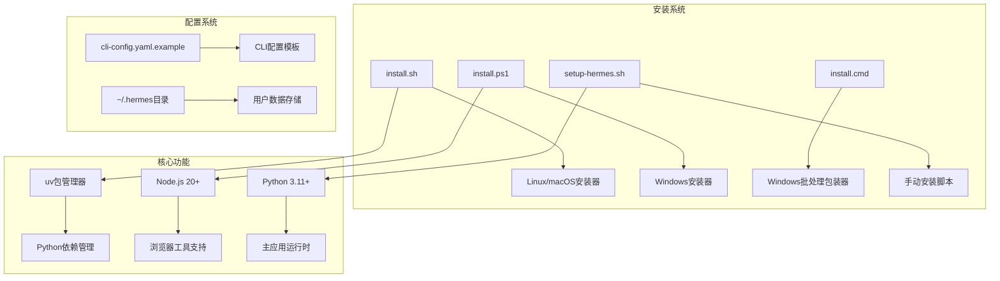
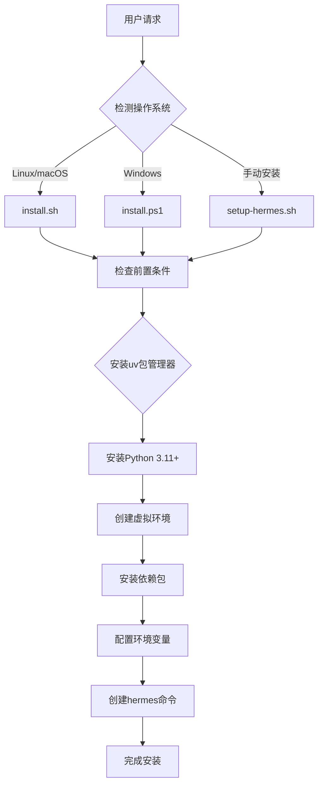
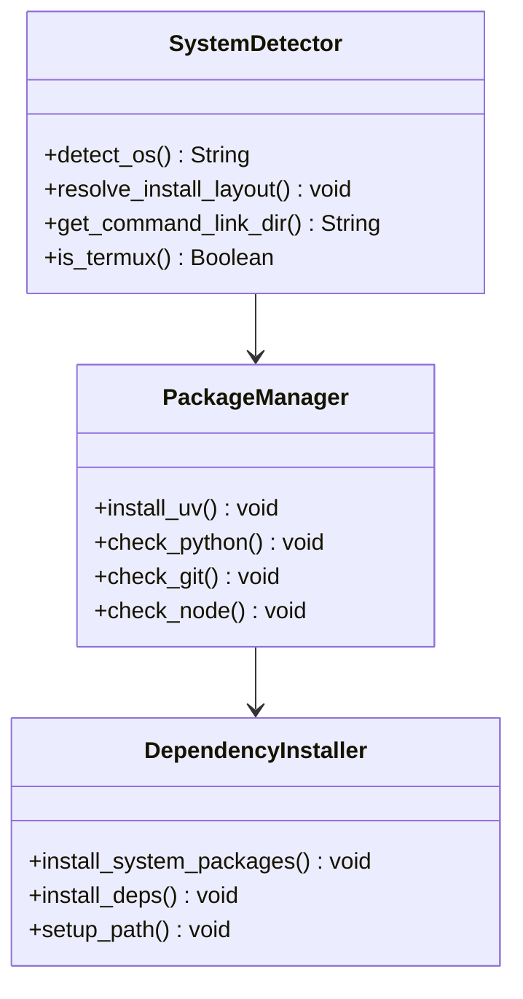
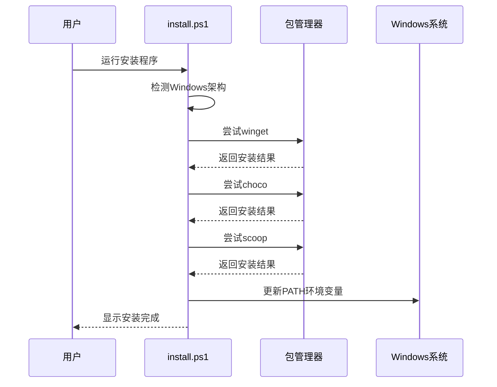
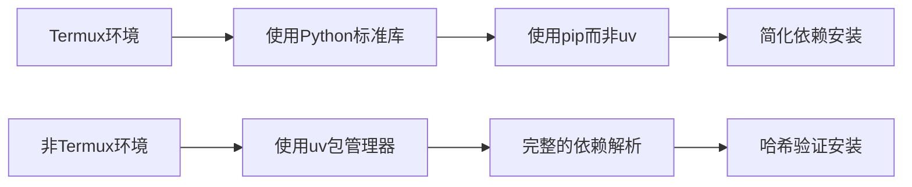
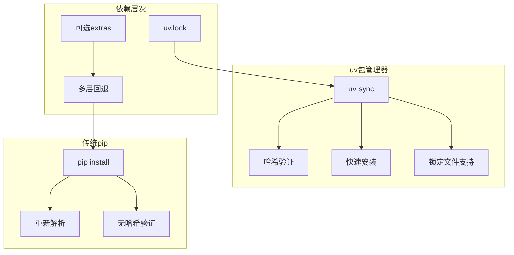

# 开发环境搭建

<cite>
**本文档引用的文件**
- [setup-hermes.sh](file://setup-hermes.sh)
- [install.sh](file://scripts/install.sh)
- [install.ps1](file://scripts/install.ps1)
- [install.cmd](file://scripts/install.cmd)
- [cli-config.yaml.example](file://cli-config.yaml.example)
</cite>

## 目录
1. [简介](#简介)
2. [项目结构](#项目结构)
3. [核心组件](#核心组件)
4. [架构概览](#架构概览)
5. [详细组件分析](#详细组件分析)
6. [依赖关系分析](#依赖关系分析)
7. [性能考虑](#性能考虑)
8. [故障排除指南](#故障排除指南)
9. [结论](#结论)

## 简介

本指南提供了Hermes Agent项目的完整开发环境搭建文档。Hermes是一个开源的AI代理平台，支持多操作系统部署，包括Linux、macOS、Windows以及Android/Termux环境。

该平台提供了两种主要的安装方式：标准安装器和手动克隆方式。标准安装器通过curl命令自动下载并执行安装脚本，而手动克隆方式则允许开发者从GitHub仓库获取源码进行本地开发。

## 项目结构

Hermes Agent项目采用模块化架构设计，主要包含以下关键组件：



**图表来源**
- [install.sh:1-100](file://scripts/install.sh#L1-L100)
- [install.ps1:1-100](file://scripts/install.ps1#L1-L100)
- [setup-hermes.sh:1-100](file://setup-hermes.sh#L1-L100)

**章节来源**
- [install.sh:1-200](file://scripts/install.sh#L1-L200)
- [install.ps1:1-200](file://scripts/install.ps1#L1-L200)
- [setup-hermes.sh:1-100](file://setup-hermes.sh#L1-L100)

## 核心组件

### 前置条件

Hermes Agent开发环境需要满足以下系统要求：

#### 必需组件
- **Git**: 版本控制系统，用于代码仓库管理
- **Python 3.11+**: 主要运行时环境
- **uv包管理器**: 高速Python包管理工具
- **Node.js 20+**: 浏览器工具和桌面应用支持

#### 可选组件
- **ripgrep**: 快速文件搜索工具
- **ffmpeg**: 音频处理和TTS语音消息
- **浏览器工具**: Playwright/Chromium支持

**章节来源**
- [install.sh:59-60](file://scripts/install.sh#L59-L60)
- [install.ps1:97-98](file://scripts/install.ps1#L97-L98)
- [setup-hermes.sh:36-36](file://setup-hermes.sh#L36-L36)

### 安装器类型

#### 标准安装器（推荐）
适用于大多数用户，通过curl命令一键安装：

```bash
# Linux/macOS
curl -fsSL https://hermes-agent.nousresearch.com/install.sh | bash

# Windows PowerShell
iex (irm https://hermes-agent.nousresearch.com/install.ps1)
```

#### 手动克隆方式
适用于开发者需要从源码进行修改和调试：

```bash
git clone https://github.com/NousResearch/hermes-agent.git
cd hermes-agent
./setup-hermes.sh
```

**章节来源**
- [install.sh:8-12](file://scripts/install.sh#L8-L12)
- [install.ps1:7-11](file://scripts/install.ps1#L7-L11)
- [setup-hermes.sh:8-9](file://setup-hermes.sh#L8-L9)

## 架构概览

Hermes Agent的安装架构采用多层设计，确保在不同操作系统上的一致体验：



**图表来源**
- [install.sh:449-484](file://scripts/install.sh#L449-L484)
- [install.ps1:15-60](file://scripts/install.ps1#L15-L60)
- [setup-hermes.sh:62-127](file://setup-hermes.sh#L62-L127)

## 详细组件分析

### Linux/macOS安装器 (install.sh)

#### 系统检测与布局
安装器能够智能识别不同的Linux发行版和macOS系统：



**图表来源**
- [install.sh:449-484](file://scripts/install.sh#L449-L484)
- [install.sh:339-394](file://scripts/install.sh#L339-L394)
- [install.sh:489-551](file://scripts/install.sh#L489-L551)

#### Node.js版本要求
安装器对Node.js版本有严格要求，确保桌面应用构建的兼容性：

| Node.js版本 | 最低要求 | 描述 |
|------------|----------|------|
| 20.x | 20.19及以上 | 支持桌面应用构建 |
| 22.x | 22.12及以上 | 推荐版本，支持最新特性 |
| 18.x | 不支持 | 太旧，无法构建桌面应用 |

**章节来源**
- [install.sh:724-739](file://scripts/install.sh#L724-L739)

### Windows安装器 (install.ps1)

#### Windows特定功能
Windows安装器提供了完整的包管理器支持：



**图表来源**
- [install.ps1:931-1093](file://scripts/install.ps1#L931-L1093)

#### Git集成
Windows安装器特别处理了Git的兼容性问题：

- **PortableGit**: 自定义Git分发，避免系统Git冲突
- **Git Bash**: 为终端工具提供POSIX兼容性
- **Windows文件系统兼容**: 解决原子文件操作问题

**章节来源**
- [install.ps1:535-693](file://scripts/install.ps1#L535-L693)

### 手动安装脚本 (setup-hermes.sh)

#### Termux支持
对于Android设备，脚本提供了专门的优化：



**图表来源**
- [setup-hermes.sh:38-40](file://setup-hermes.sh#L38-L40)
- [setup-hermes.sh:135-151](file://setup-hermes.sh#L135-L151)

**章节来源**
- [setup-hermes.sh:38-163](file://setup-hermes.sh#L38-L163)

## 依赖关系分析

### Python依赖管理

Hermes Agent使用uv作为主要的Python包管理器，提供以下优势：



**图表来源**
- [install.sh:1384-1427](file://scripts/install.sh#L1384-L1427)
- [install.ps1:1490-1531](file://scripts/install.ps1#L1490-L1531)

### 跨平台兼容性

不同操作系统间的依赖差异：

| 组件 | Linux | macOS | Windows | Android/Termux |
|------|-------|-------|---------|----------------|
| Python | 系统Python | Homebrew | 系统Python | Termux Python |
| 包管理 | apt/dnf/arch | Homebrew | winget/choco/scoop | pkg |
| Node.js | 系统Node | Homebrew | winget | pkg |
| Git | 系统Git | Homebrew | PortableGit | pkg |

**章节来源**
- [install.sh:923-1093](file://scripts/install.sh#L923-L1093)
- [install.ps1:931-1093](file://scripts/install.ps1#L931-L1093)

## 性能考虑

### 安装性能优化

1. **uv缓存机制**: 利用哈希验证减少重复下载
2. **并行安装**: 同时处理多个依赖包
3. **增量更新**: 仅更新变更的包
4. **网络优化**: 智能重试和镜像选择

### 运行时性能

- **虚拟环境隔离**: 避免全局包冲突
- **依赖预编译**: 减少首次启动时间
- **内存管理**: 优化大型会话处理
- **并发控制**: 限制同时运行的任务数量

## 故障排除指南

### 常见安装问题

#### Python版本问题
**问题**: Python 3.11+未正确安装
**解决方案**:
```bash
# 检查Python版本
python3 --version
# 或
python --version

# 在Linux上安装
sudo apt update && sudo apt install python3.11 python3.11-venv python3.11-dev

# 在macOS上安装
brew install python@3.11
```

#### uv安装失败
**问题**: uv包管理器下载失败
**解决方案**:
```bash
# 手动安装uv
curl -LsSf https://astral.sh/uv/install.sh | sh

# 或使用pip
pip install uv

# 验证安装
uv --version
```

#### Node.js版本不兼容
**问题**: Node.js版本过旧导致桌面应用构建失败
**解决方案**:
```bash
# 检查Node.js版本
node --version

# 升级到推荐版本
# Linux/macOS: 使用nvm或包管理器
nvm install 22
nvm use 22

# Windows: 使用nvm-windows
nvm install 22.12.0
nvm use 22.12.0
```

#### 权限问题
**问题**: 安装过程中权限不足
**解决方案**:
```bash
# Linux/macOS - 使用sudo（谨慎使用）
sudo ./install.sh

# Windows - 以管理员身份运行PowerShell
# 右键点击PowerShell -> "以管理员身份运行"

# Android/Termux - 无需特殊权限
./setup-hermes.sh
```

#### 网络连接问题
**问题**: 无法访问PyPI或其他依赖源
**解决方案**:
```bash
# 配置代理（如果需要）
export HTTP_PROXY=http://proxy:port
export HTTPS_PROXY=https://proxy:port

# 使用国内镜像源
pip install --index-url https://pypi.tuna.tsinghua.edu.cn/simple/

# 检查网络连接
ping pypi.org
curl -I https://pypi.org/simple/
```

### 环境变量配置

#### Heremes专用环境变量
```bash
# 设置Hermes数据目录
export HERMES_HOME="$HOME/.hermes"

# 设置安装目录
export HERMES_INSTALL_DIR="$HOME/.hermes/hermes-agent"

# 设置Python路径（可选）
export PYENV_ROOT="$HOME/.pyenv"
export PATH="$PYENV_ROOT/bin:$PATH"
```

#### 通用开发环境变量
```bash
# 设置Git配置
git config --global user.name "Your Name"
git config --global user.email "your.email@example.com"

# 设置编辑器
export EDITOR=vim
export VISUAL=vim

# 设置终端编码
export LANG=en_US.UTF-8
export LC_ALL=en_US.UTF-8
```

**章节来源**
- [install.sh:888-921](file://scripts/install.sh#L888-L921)
- [install.ps1:188-215](file://scripts/install.ps1#L188-L215)

### 验证安装

安装完成后，验证所有组件是否正常工作：

```bash
# 检查Hermes命令
hermes --version

# 检查Python环境
python3 -c "import hermes; print('Hermes导入成功')"

# 检查uv状态
uv --version

# 检查Node.js状态
node --version

# 检查Git状态
git --version

# 查看帮助信息
hermes --help
```

### 卸载和清理

如果需要完全卸载Hermes Agent：

```bash
# 删除安装目录
rm -rf ~/.hermes/hermes-agent

# 删除可执行文件链接
rm -f ~/.local/bin/hermes
rm -f ~/bin/hermes

# 清理uv缓存
uv cache clean

# 删除Hermes数据目录
rm -rf ~/.hermes

# 重新初始化Git配置
git config --global --unset-all hermes
```

**章节来源**
- [install.sh:1535-1599](file://scripts/install.sh#L1535-L1599)
- [install.ps1:1420-1464](file://scripts/install.ps1#L1420-L1464)

## 结论

Hermes Agent提供了完整的跨平台开发环境搭建方案，通过标准化的安装流程确保在不同操作系统上的一致体验。安装器具备强大的错误处理能力和用户友好的交互界面，能够自动处理大部分常见的安装问题。

建议开发者根据自己的需求选择合适的安装方式：
- **新用户**: 使用标准安装器，享受一键安装的便利
- **开发者**: 使用手动克隆方式，便于进行源码修改和调试
- **企业环境**: 使用自定义配置，满足特定的安全和合规要求

通过遵循本指南，您应该能够成功搭建Hermes Agent的开发环境，并开始探索这个强大的AI代理平台。