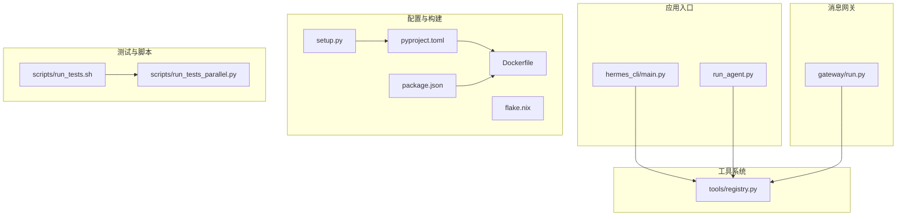
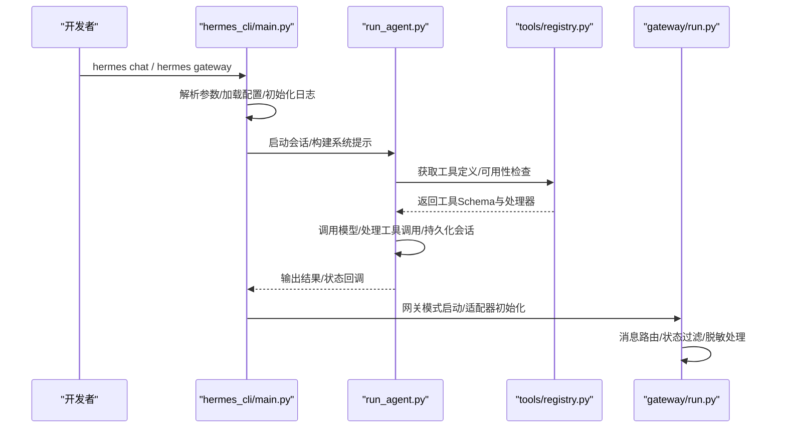
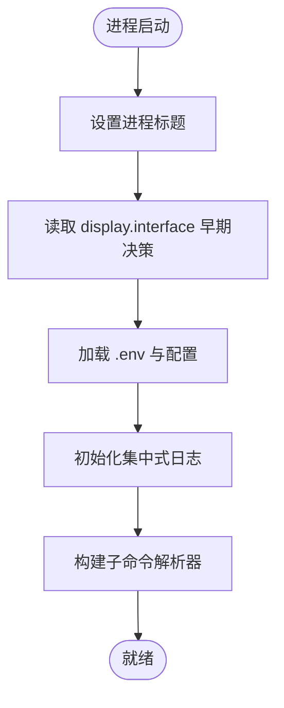
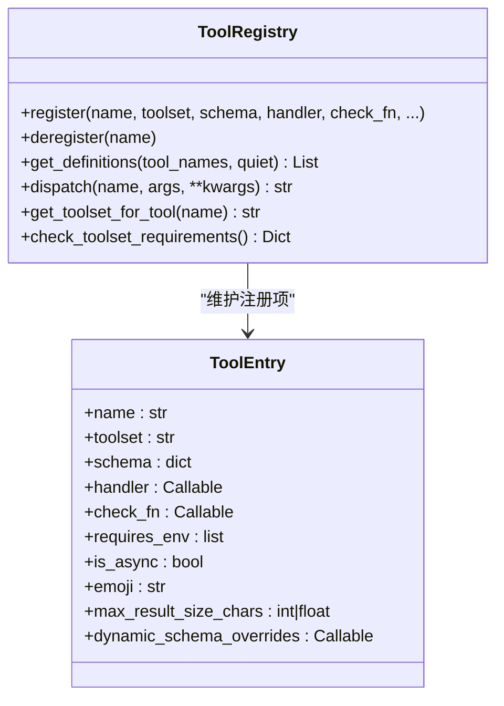
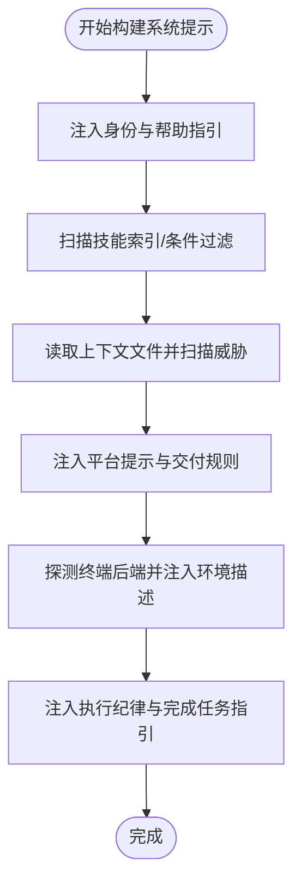
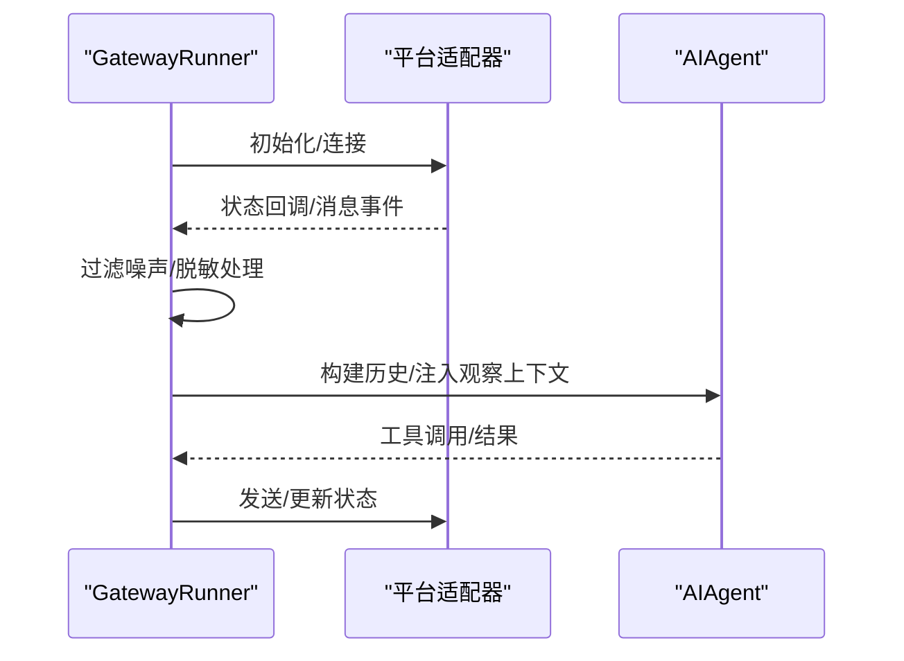
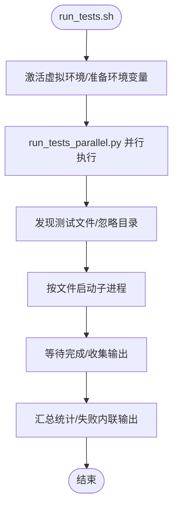
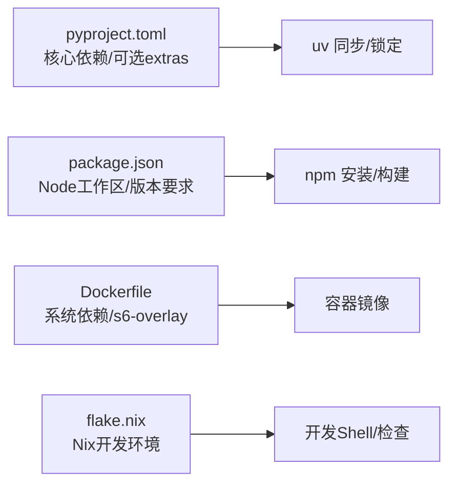

# 开发者指南

<cite>
**本文档引用的文件**
- [CONTRIBUTING.md](file://CONTRIBUTING.md)
- [README.md](file://README.md)
- [pyproject.toml](file://pyproject.toml)
- [package.json](file://package.json)
- [setup.py](file://setup.py)
- [Dockerfile](file://Dockerfile)
- [flake.nix](file://flake.nix)
- [scripts/run_tests.sh](file://scripts/run_tests.sh)
- [scripts/run_tests_parallel.py](file://scripts/run_tests_parallel.py)
- [hermes_cli/main.py](file://hermes_cli/main.py)
- [run_agent.py](file://run_agent.py)
- [tools/registry.py](file://tools/registry.py)
- [agent/prompt_builder.py](file://agent/prompt_builder.py)
- [gateway/run.py](file://gateway/run.py)
</cite>

## 目录
1. [简介](#简介)
2. [项目结构](#项目结构)
3. [核心组件](#核心组件)
4. [架构总览](#架构总览)
5. [详细组件分析](#详细组件分析)
6. [依赖分析](#依赖分析)
7. [性能考虑](#性能考虑)
8. [故障排查指南](#故障排查指南)
9. [结论](#结论)
10. [附录](#附录)

## 简介
本指南面向希望参与 Hermes Agent 开发的工程师，覆盖从开发环境搭建、代码贡献流程、测试与质量保障、构建与打包、到日常开发工具使用的完整工作流。文档基于仓库中的实际配置与脚本进行梳理，确保读者能够快速上手并在本地复现 CI 级别的测试与运行体验。

## 项目结构
Hermes Agent 采用模块化分层设计，核心由以下部分组成：
- 运行时入口与 CLI：hermes_cli/main.py 提供命令行入口与子命令解析；run_agent.py 提供独立的 AI Agent 运行器。
- 工具系统：tools/registry.py 实现自注册工具注册表，model_tools 通过该注册表发现与调度工具。
- 消息网关：gateway/run.py 管理多平台适配器（Telegram、Discord、Slack 等）生命周期与消息路由。
- 配置与依赖：pyproject.toml 定义 Python 依赖与可选特性；package.json 管理前端与 Node 依赖；Dockerfile 提供容器镜像构建；flake.nix 提供 Nix 开发环境。
- 测试与脚本：scripts/run_tests.sh 与 scripts/run_tests_parallel.py 提供可复现的测试执行环境。

**图表来源**
- [hermes_cli/main.py](file://hermes_cli/main.py)
- [run_agent.py](file://run_agent.py)
- [tools/registry.py](file://tools/registry.py)
- [gateway/run.py](file://gateway/run.py)
- [pyproject.toml](file://pyproject.toml)
- [package.json](file://package.json)
- [Dockerfile](file://Dockerfile)
- [flake.nix](file://flake.nix)
- [setup.py](file://setup.py)
- [scripts/run_tests.sh](file://scripts/run_tests.sh)
- [scripts/run_tests_parallel.py](file://scripts/run_tests_parallel.py)

**章节来源**
- [README.md](file://README.md)
- [pyproject.toml](file://pyproject.toml)
- [package.json](file://package.json)
- [Dockerfile](file://Dockerfile)
- [flake.nix](file://flake.nix)
- [setup.py](file://setup.py)

## 核心组件
- 命令行入口与子命令解析：负责参数解析、默认界面选择、日志初始化、配置加载与早期环境探测。
- 工具注册与调度：集中式工具注册表，支持按需可用性检查、动态 schema 覆盖、异步工具桥接与错误统一格式化。
- 系统提示词构建：根据平台、终端后端、技能索引、上下文文件等生成系统提示，注入执行指导与安全约束。
- 网关运行器：管理各平台适配器生命周期、消息路由、状态回调过滤与敏感信息脱敏、自动续跑窗口控制等。

**章节来源**
- [hermes_cli/main.py](file://hermes_cli/main.py)
- [tools/registry.py](file://tools/registry.py)
- [agent/prompt_builder.py](file://agent/prompt_builder.py)
- [gateway/run.py](file://gateway/run.py)

## 架构总览
下图展示了从 CLI 到工具执行再到网关消息传递的关键路径，以及测试执行的隔离与并行策略。

**图表来源**
- [hermes_cli/main.py](file://hermes_cli/main.py)
- [run_agent.py](file://run_agent.py)
- [tools/registry.py](file://tools/registry.py)
- [gateway/run.py](file://gateway/run.py)

## 详细组件分析

### 组件A：命令行入口与运行时初始化
- 关键职责
  - 早期进程标题设置、终端鼠标残留抑制、Termux 快速版本信息输出。
  - 配置默认界面、解析 --cli/--tui、读取 display.interface。
  - 加载 .env、桥接 security.redact_secrets 与 network.force_ipv4。
  - 初始化集中式日志与 IPv4 强制偏好。
  - 批量导入子命令解析器，构建命令树。
- 设计要点
  - 将“是否需要 TUI”判断前置到 YAML 解析之前，避免不必要的依赖导入。
  - 对 profile 覆盖进行预解析，确保后续模块读取 HERMES_HOME 一致。
  - 在 Windows 上优先使用 setproctitle 或 ctypes 设置进程名，提升可观测性。

**图表来源**
- [hermes_cli/main.py](file://hermes_cli/main.py)

**章节来源**
- [hermes_cli/main.py](file://hermes_cli/main.py)

### 组件B：工具注册与调度
- 关键职责
  - 自注册：每个工具文件在模块级调用 registry.register() 注册 schema、处理器与可用性检查。
  - 可用性缓存：对 check_fn 的结果进行 TTL 缓存，减少外部状态探测开销。
  - 动态 schema：支持运行时动态覆盖工具 schema 字段（如 delegate_task 的描述随配置变化）。
  - 异步桥接：异步处理器通过 _run_async 桥接，统一返回 JSON 字符串。
  - 错误标准化：异常被捕获并以统一的 {"error": "..."} 结构返回，便于模型侧处理。
- 设计要点
  - 使用线程锁保护注册表变更，读写分离快照，避免并发读取不一致。
  - 支持 MCP 工具集覆盖与别名映射，增强动态刷新能力。

**图表来源**
- [tools/registry.py](file://tools/registry.py)

**章节来源**
- [tools/registry.py](file://tools/registry.py)

### 组件C：系统提示词构建
- 关键职责
  - 组装身份、平台提示、技能索引、上下文文件与内存提示。
  - 扫描上下文文件内容，阻断潜在的注入与提示工程。
  - 平台特定渲染：针对 Telegram、Discord、Slack、WhatsApp 等平台注入合适的格式与媒体交付说明。
  - 终端后端探测：对非本地后端（Docker/Modal/SSH）注入远程环境描述，避免误导。
- 设计要点
  - 将“工具使用强制”“完成任务”“执行纪律”等指导作为系统提示的一部分，降低跨模型失败率。
  - 对于计算机控制场景，提供背景模式下的安全与操作规则。

**图表来源**
- [agent/prompt_builder.py](file://agent/prompt_builder.py)

**章节来源**
- [agent/prompt_builder.py](file://agent/prompt_builder.py)

### 组件D：网关运行器与消息适配
- 关键职责
  - 生命周期管理：启动/停止/重启平台适配器，处理连接超时与断连重试。
  - 状态回调过滤：对噪声状态（压缩摘要、速率限制等待等）进行过滤，仅保留必要通知。
  - 敏感信息脱敏：对可能泄露密钥或策略文本的内容进行脱敏与用户友好提示。
  - 自动续跑窗口：基于最后活动时间戳判断中断会话是否应在新鲜期内自动恢复。
- 设计要点
  - 事件循环异常处理：捕获瞬时网络错误（如 Telegram TimedOut），避免崩溃。
  - 多平台显示策略：对高噪声平台（如 Mattermost）默认关闭某些展示选项，需显式开启。

**图表来源**
- [gateway/run.py](file://gateway/run.py)

**章节来源**
- [gateway/run.py](file://gateway/run.py)

### 组件E：测试执行与并行策略
- 关键职责
  - scripts/run_tests.sh：以 hermetic 环境（TZ=UTC、LANG=C.UTF-8、PYTHONHASHSEED=0）运行，激活虚拟环境，调用 run_tests_parallel.py。
  - scripts/run_tests_parallel.py：按文件粒度并行执行 pytest，避免 xdist 的持久工作线程带来的模块级泄漏；支持切片分摊与持续时间缓存。
- 设计要点
  - 每个测试文件在独立子进程中运行，确保模块级状态隔离。
  - 对 Windows/POSIX 的进程树清理采用平台原生方式（taskkill / SIGKILL），防止僵尸进程。
  - 支持通过 HERMES_TEST_WORKERS、HERMES_TEST_PATHS、HERMES_TEST_FILE_TIMEOUT 等环境变量微调执行行为。

**图表来源**
- [scripts/run_tests.sh](file://scripts/run_tests.sh)
- [scripts/run_tests_parallel.py](file://scripts/run_tests_parallel.py)

**章节来源**
- [scripts/run_tests.sh](file://scripts/run_tests.sh)
- [scripts/run_tests_parallel.py](file://scripts/run_tests_parallel.py)

## 依赖分析
- Python 依赖与可选特性
  - pyproject.toml 定义了核心依赖与可选 extras（如 dev、messaging、web、acp 等），并声明了严格的版本锁定策略，以降低供应链风险。
  - [all] 仅包含无法惰性安装的依赖（例如 cron、cli、pty、mcp、web 等），其余后端（如 anthropic、firecrawl、edge-tts 等）通过惰性安装在首次使用时拉取。
- Node 与前端
  - package.json 管理根工作区（apps/*、ui-tui、web），并声明 Node 版本要求与依赖覆盖策略。
- 容器与系统依赖
  - Dockerfile 使用 s6-overlay 进行进程监督，安装系统依赖（curl、git、ffmpeg、gcc 等），并烘焙构建时的 Git SHA 以便诊断。
- Nix 开发环境
  - flake.nix 提供多平台（x86_64-linux、aarch64-linux、aarch64-darwin）的开发环境与检查项。

**图表来源**
- [pyproject.toml](file://pyproject.toml)
- [package.json](file://package.json)
- [Dockerfile](file://Dockerfile)
- [flake.nix](file://flake.nix)

**章节来源**
- [pyproject.toml](file://pyproject.toml)
- [package.json](file://package.json)
- [Dockerfile](file://Dockerfile)
- [flake.nix](file://flake.nix)

## 性能考虑
- 工具可用性探测缓存：registry 中对 check_fn 的 TTL 缓存（约 30 秒）减少外部状态探测成本，同时允许配置变更在近实时范围内生效。
- 测试并行与隔离：按文件粒度并行执行，避免 xdist 的持久工作线程导致的模块级状态泄漏；对 Windows/POSIX 采用平台原生进程树清理，避免僵尸进程。
- 网关事件循环异常处理：对瞬时网络错误进行吞没记录，避免进程崩溃影响整体稳定性。
- 前端构建与缓存：Dockerfile 分离前端与 Python 依赖安装层，利用 npm 与 Playwright 的缓存层加速构建。

[本节为通用指导，无需具体文件分析]

## 故障排查指南
- 测试执行失败
  - 使用 scripts/run_tests.sh 以与 CI 一致的 hermetic 环境运行；若单文件失败，脚本会打印失败文件的尾部输出与可直接复制的重现实例。
  - 若出现僵尸进程或子进程泄漏，确认 run_tests_parallel.py 的进程树清理逻辑已生效（Windows 使用 taskkill，POSIX 使用 SIGKILL）。
- 网关崩溃或瞬时错误
  - 检查 _gateway_loop_exception_handler 是否正确捕获瞬时网络错误（如 Telegram TimedOut）；确认未将瞬时错误视为真实 Bug。
  - 对于高噪声平台（如 Telegram），确认状态回调已被过滤或脱敏，避免将原始 provider 错误正文发送给用户。
- 工具不可用或工具集缺失
  - 使用 registry.check_toolset_requirements() 检查工具集可用性；核对 check_fn 的返回值与缓存是否过期（可通过 invalidate_check_fn_cache() 清理）。
- 构建与镜像问题
  - Dockerfile 中若缺少系统依赖或 s6-overlay 校验失败，请检查 ARG 与校验和；确认 PLAYWRIGHT_BROWSERS_PATH 与 /opt/data 卷挂载关系正确。
- Nix 开发环境
  - 若 flake.nix 导入失败，检查 inputs 与系统列表；确保 pyproject-nix、uv2nix 等输入版本兼容。

**章节来源**
- [scripts/run_tests.sh](file://scripts/run_tests.sh)
- [scripts/run_tests_parallel.py](file://scripts/run_tests_parallel.py)
- [gateway/run.py](file://gateway/run.py)
- [tools/registry.py](file://tools/registry.py)
- [Dockerfile](file://Dockerfile)
- [flake.nix](file://flake.nix)

## 结论
本指南围绕开发环境搭建、贡献流程、测试与质量保障、构建与打包、以及日常开发工具使用进行了系统化梳理。通过遵循本文档的步骤与最佳实践，开发者可以高效地在本地复现 CI 行为、稳定地扩展工具与技能，并在多平台环境下可靠地运行 Hermes Agent。

[本节为总结性内容，无需具体文件分析]

## 附录

### 开发环境搭建
- 先决条件
  - Python 3.11+（推荐使用 uv）
  - Node.js 20+（用于浏览器工具与 WhatsApp 桥接）
  - Git（建议启用 git-lfs）
- 推荐安装路径
  - 使用标准安装器创建受管布局，随后在克隆的仓库中进行开发与测试。
  - 在受管布局基础上，安装 [all,dev] 可选特性与前端依赖。
- 配置与运行
  - 创建 ~/.hermes 目录与基础配置文件，添加至少一个 LLM 提供商的密钥。
  - 使用 hermes doctor 与 hermes chat -q "Hello" 验证环境。

**章节来源**
- [CONTRIBUTING.md](file://CONTRIBUTING.md)
- [README.md](file://README.md)

### 代码贡献流程
- 分支管理与提交规范
  - 使用短横线分隔的描述性分支命名（如 fix/description）。
  - 提交信息应清晰表达变更意图，避免无意义的提交注释。
- 代码审查标准
  - 遵循 PEP 8（不强制严格行长），注释仅解释非显而易见的设计权衡。
  - 跨平台代码避免假设 Unix 行为，参考 CONTRIBUTING.md 中的 Windows 安全实践清单。
- 技能与工具的取舍
  - 优先修复缺陷、提升跨平台兼容性与安全性；新技能应具备广泛实用性。
  - 工具优先级：绝大多数能力应通过技能实现，仅在确有需要时引入工具。

**章节来源**
- [CONTRIBUTING.md](file://CONTRIBUTING.md)

### 测试策略与实践
- 单元测试与集成测试
  - 使用 scripts/run_tests.sh 触发 hermetic 测试执行；默认排除 integration/e2e/docker 子套件，可在明确意图时通过 include_integration 参数启用。
  - run_tests_parallel.py 支持按文件并行执行、切片分摊与持续时间缓存，提升大规模测试集的执行效率。
- 端到端测试
  - e2e 套件在专用 CI 作业中运行，避免与常规测试矩阵膨胀。
- 质量保障
  - pytest 标记 integration 用于长耗时外部服务测试；ruff 仅启用 PLW1514（未指定编码）以避免 Windows 默认编码导致的文件损坏。

**章节来源**
- [scripts/run_tests.sh](file://scripts/run_tests.sh)
- [scripts/run_tests_parallel.py](file://scripts/run_tests_parallel.py)
- [pyproject.toml](file://pyproject.toml)

### 构建与打包流程
- 多平台编译与依赖管理
  - pyproject.toml 明确核心依赖与可选 extras；[all] 仅包含无法惰性安装的依赖，其余通过惰性安装在首次使用时拉取。
  - package.json 管理前端工作区与 Node 版本要求，确保浏览器工具与桌面应用依赖一致。
- 容器镜像
  - Dockerfile 使用 s6-overlay 进行进程监督，安装系统依赖并烘焙构建时 Git SHA；分层缓存优化前端与 Python 依赖安装。
- Nix 开发环境
  - flake.nix 提供多平台开发 Shell 与检查项，确保一致性与可复现性。

**章节来源**
- [pyproject.toml](file://pyproject.toml)
- [package.json](file://package.json)
- [Dockerfile](file://Dockerfile)
- [flake.nix](file://flake.nix)

### 开发工具与脚本
- 测试脚本
  - scripts/run_tests.sh：统一的测试入口，设置 hermetic 环境并调用 run_tests_parallel.py。
  - scripts/run_tests_parallel.py：按文件并行执行 pytest，支持切片与持续时间缓存。
- CLI 与运行器
  - hermes_cli/main.py：命令行入口，负责参数解析、配置加载与日志初始化。
  - run_agent.py：独立 Agent 运行器，封装工具调用循环与会话持久化。
- 工具注册
  - tools/registry.py：自注册工具注册表，支持可用性缓存、动态 schema 与异步桥接。
- 网关
  - gateway/run.py：网关运行器，管理适配器生命周期、消息路由与状态回调过滤。

**章节来源**
- [scripts/run_tests.sh](file://scripts/run_tests.sh)
- [scripts/run_tests_parallel.py](file://scripts/run_tests_parallel.py)
- [hermes_cli/main.py](file://hermes_cli/main.py)
- [run_agent.py](file://run_agent.py)
- [tools/registry.py](file://tools/registry.py)
- [gateway/run.py](file://gateway/run.py)

### 常见开发问题与最佳实践
- Windows 安全实践
  - 避免使用 os.kill(pid, 0) 进行存活检测；使用 psutil 或平台特定替代方案。
  - 使用 shutil.which() 检查工具存在性，避免假设 Linux 工具在 Windows 上可用。
  - 文件编码：注意 .env 的 cp1252 与 config.yaml 的 UTF-8 BOM，采用适当的编码读取。
- 跨平台进程管理
  - 使用 psutil 进行进程树清理，避免僵尸进程；在 Windows 上使用 taskkill，在 POSIX 上使用 SIGKILL。
- 测试隔离
  - 使用 run_tests_parallel.py 的 per-file 子进程隔离，避免 xdist 的持久工作线程导致的状态泄漏。
- 网关稳定性
  - 对瞬时网络错误进行吞没记录，避免进程崩溃；对高噪声平台进行状态回调过滤与脱敏。

**章节来源**
- [CONTRIBUTING.md](file://CONTRIBUTING.md)
- [scripts/run_tests_parallel.py](file://scripts/run_tests_parallel.py)
- [gateway/run.py](file://gateway/run.py)

### 社区参与与贡献途径
- 文档与快速开始
  - 参考 README.md 与 CONTRIBUTING.md 的贡献指南与快速开始步骤。
- 讨论与协作
  - Discord 社区、Skills Hub、GitHub Issues 与相关生态项目（如 computer-use-linux）是主要沟通渠道。
- 迁移与兼容
  - 支持从 OpenClaw 迁移设置、记忆与技能；提供迁移工具与交互式向导。

**章节来源**
- [README.md](file://README.md)
- [CONTRIBUTING.md](file://CONTRIBUTING.md)