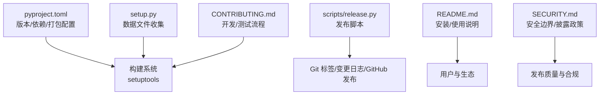
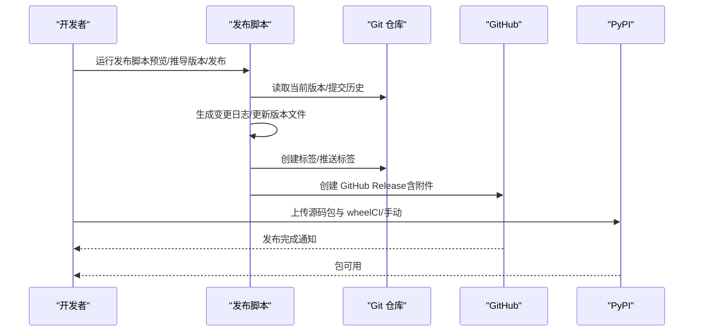
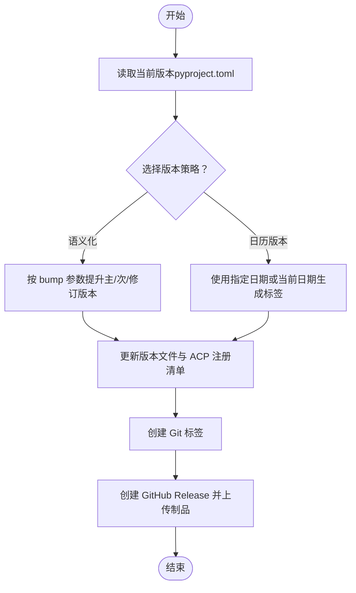
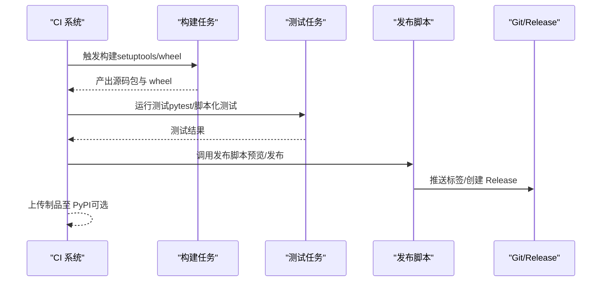
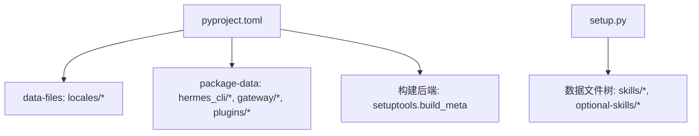

# 发布管理

<cite>
**本文档引用的文件**
- [pyproject.toml](file://pyproject.toml)
- [setup.py](file://setup.py)
- [scripts/release.py](file://scripts/release.py)
- [README.md](file://README.md)
- [CONTRIBUTING.md](file://CONTRIBUTING.md)
- [SECURITY.md](file://SECURITY.md)
</cite>

## 目录
1. [简介](#简介)
2. [项目结构](#项目结构)
3. [核心组件](#核心组件)
4. [架构总览](#架构总览)
5. [详细组件分析](#详细组件分析)
6. [依赖分析](#依赖分析)
7. [性能考虑](#性能考虑)
8. [故障排除指南](#故障排除指南)
9. [结论](#结论)
10. [附录](#附录)

## 简介
本文件系统性阐述本项目的发布管理流程，覆盖版本号管理策略（语义化版本与日历版本）、发布自动化（CI/CD 流水线、自动构建与测试）、发布包生成与分发（PyPI 上传、源码发布、wheel 构建）、变更日志与发布说明规范、回滚与紧急修复流程，以及发布前检查清单与质量保障措施。内容基于仓库中现有的发布脚本、打包配置与文档进行归纳总结。

## 项目结构
围绕发布管理的关键文件与职责如下：
- 版本与打包元数据：pyproject.toml 定义项目名称、版本、依赖、可选特性与打包数据；setup.py 负责在传统安装模式下收集技能与可选技能目录作为数据文件。
- 发布脚本：scripts/release.py 提供版本号推导、变更日志生成、GitHub 发布创建与标签打标等能力。
- 文档与政策：README.md 展示安装与使用信息；CONTRIBUTING.md 描述开发与测试流程；SECURITY.md 规定安全披露与隔离边界，为发布质量与合规提供基础。

**图表来源**
- [pyproject.toml](file://pyproject.toml)
- [setup.py](file://setup.py)
- [scripts/release.py](file://scripts/release.py)
- [README.md](file://README.md)
- [CONTRIBUTING.md](file://CONTRIBUTING.md)
- [SECURITY.md](file://SECURITY.md)

**章节来源**
- [pyproject.toml](file://pyproject.toml)
- [setup.py](file://setup.py)
- [scripts/release.py](file://scripts/release.py)
- [README.md](file://README.md)
- [CONTRIBUTING.md](file://CONTRIBUTING.md)
- [SECURITY.md](file://SECURITY.md)

## 核心组件
- 版本与依赖管理
  - 使用 PEP 639 的 SPDX 许可表达式与 setuptools≥77 的构建后端，确保许可证文件与构建稳定性。
  - 严格固定核心依赖版本（精确到修订版），降低供应链风险；可选特性通过 extras 分离，避免默认安装引入重型依赖。
  - Python 版本约束为 3.11≤x<3.14，以规避某些 Rust 支持的二进制依赖在新版本解释器上的兼容问题。
- 打包与分发
  - 使用 setuptools 的 data-files 与 package-data 将本地化资源、可选 MCP 目录与插件清单打包入轮子；setup.py 在传统安装路径下收集 skills 与 optional-skills 目录。
  - 项目脚本入口通过 [project.scripts] 注册 hermes、hermes-agent、hermes-acp 等命令。
- 发布脚本
  - scripts/release.py 支持预览变更日志、按语义化版本或日历版本推导新版本、创建 GitHub 发布与标签，并与 ACP 注册清单保持版本锁定。

**章节来源**
- [pyproject.toml](file://pyproject.toml)
- [setup.py](file://setup.py)
- [scripts/release.py](file://scripts/release.py)

## 架构总览
发布流程从版本号推导开始，贯穿变更日志生成、构建与测试、包产物生成、上传与发布，最终完成标签与发布说明的同步。

**图表来源**
- [scripts/release.py](file://scripts/release.py)
- [pyproject.toml](file://pyproject.toml)

## 详细组件分析

### 组件A：版本号管理策略
- 语义化版本控制
  - 项目采用语义化主版本/次版本/修订版本号（如 0.16.0）。发布脚本支持按语义化规则提升主版本、次版本或修订版本。
  - 依赖与 extras 的版本均严格固定，避免因上游不兼容导致的非预期升级。
- 日历版本（CalVer）与标签规则
  - 发布脚本支持以日历年.月.日格式的标签（例如 2026.3.15），可用于“延后发布”场景或与里程碑对齐。
  - 标签与版本文件需原子更新，确保 ACP 注册清单与 pyproject.toml 锁定一致，防止发布不一致。
- 版本文件与锁文件
  - 版本在 pyproject.toml 中集中管理；当更新版本时需同步生成/更新锁文件，确保传递依赖解析稳定。

**图表来源**
- [scripts/release.py](file://scripts/release.py)
- [pyproject.toml](file://pyproject.toml)

**章节来源**
- [scripts/release.py](file://scripts/release.py)
- [pyproject.toml](file://pyproject.toml)

### 组件B：发布自动化流程
- 自动化触发
  - 建议通过 CI 工作流在合并到主分支或特定分支时触发构建与测试；若仓库未包含工作流文件，可在 CI 中调用发布脚本与打包命令。
- 构建与测试
  - 构建阶段：使用 setuptools 与构建后端生成源码包与 wheel；确保 Python 版本满足要求（3.11≤x<3.14）。
  - 测试阶段：运行脚本化的测试套件（参考贡献指南中的测试命令），确保关键功能与回归测试通过。
- 变更日志与发布说明
  - 发布脚本自动生成变更日志；建议在 PR 合并时维护变更摘要，便于生成准确的发布说明。
- 上传与发布
  - PyPI 上传可通过 CI 凭证自动执行；也可在本地使用 twine 或 CI 任务完成。发布完成后在 GitHub 上创建 Release 并附带制品。

**图表来源**
- [scripts/release.py](file://scripts/release.py)
- [pyproject.toml](file://pyproject.toml)
- [CONTRIBUTING.md](file://CONTRIBUTING.md)

**章节来源**
- [scripts/release.py](file://scripts/release.py)
- [pyproject.toml](file://pyproject.toml)
- [CONTRIBUTING.md](file://CONTRIBUTING.md)

### 组件C：发布包的生成与分发
- 源码发布与 wheel 构建
  - 使用 setuptools 构建源码包与纯 Python wheel；pyproject.toml 中声明了构建后端与最低 setuptools 版本，确保构建一致性。
  - setup.py 在传统安装路径下收集 skills 与 optional-skills 目录，确保安装时包含必要的技能资源。
- PyPI 上传
  - 建议在 CI 中配置 PyPI 凭证，自动上传构建产物；本地可使用 twine 手动上传。
- 分发范围
  - 通过 extras 控制可选功能的安装面，减少默认安装的体积与复杂度；同时确保关键资源（本地化、MCP 目录、插件清单）被打包入 wheel。

**章节来源**
- [pyproject.toml](file://pyproject.toml)
- [setup.py](file://setup.py)

### 组件D：变更日志与发布说明规范
- 变更日志生成
  - 发布脚本支持生成变更日志，建议在每次 PR 合并时补充变更摘要，以便自动生成准确的发布说明。
- 发布说明编写
  - 发布说明应包含：版本号、主要变更概要、已知问题与迁移提示、安全注意事项（如依赖升级带来的影响）。
  - 对于破坏性变更，应在发布说明中明确迁移步骤与兼容性策略。

**章节来源**
- [scripts/release.py](file://scripts/release.py)

### 组件E：回滚策略与紧急修复流程
- 回滚策略
  - 若发布后出现严重问题，优先回退到上一稳定版本；回滚时同步删除错误标签与 Release，并重新创建正确的标签与发布。
- 紧急修复流程
  - 针对高危漏洞或崩溃类缺陷，采用热修复分支快速修复并在 CI 中验证，随后以修订版本发布。
  - 安全相关修复遵循安全披露政策，先在内部评估并修复，再按协调窗口发布。

**章节来源**
- [SECURITY.md](file://SECURITY.md)

## 依赖分析
- 版本锁定与供应链安全
  - 核心依赖严格固定版本，降低供应链攻击风险；可选特性通过 extras 分离，避免默认安装引入重型依赖。
- 构建与打包依赖
  - 构建后端与 setuptools 版本上限/下限受许可证表达式与第三方二进制依赖支持情况约束，需保持与 pyproject.toml 的一致性。
- 数据文件与资源打包
  - 通过 setuptools 的 data-files 与 package-data 将 locales、MCP 目录与插件清单打包入 wheel；setup.py 在传统安装路径下收集 skills 与 optional-skills 目录。

**图表来源**
- [pyproject.toml](file://pyproject.toml)
- [setup.py](file://setup.py)

**章节来源**
- [pyproject.toml](file://pyproject.toml)
- [setup.py](file://setup.py)

## 性能考虑
- 构建性能
  - 通过固定依赖版本与最小化 extras，缩短构建时间并减少构建失败概率。
  - 使用纯 Python wheel（py3-none-any）可降低平台特定编译需求，提升安装速度。
- 测试性能
  - 在 CI 中并行运行测试，结合脚本化测试命令，缩短反馈周期。

## 故障排除指南
- 版本不一致
  - 当更新版本时，确保 ACP 注册清单与 pyproject.toml 同步更新，避免发布后版本不一致。
- 构建失败
  - 检查 Python 版本是否在允许范围内（3.11≤x<3.14）；确认 setuptools 版本满足 pyproject.toml 的要求。
- PyPI 上传失败
  - 检查凭据配置与网络连通性；在 CI 中确保凭证变量正确注入。
- 安全相关问题
  - 遵循安全披露政策，先内部修复再发布；对高危漏洞采用热修复流程。

**章节来源**
- [scripts/release.py](file://scripts/release.py)
- [pyproject.toml](file://pyproject.toml)
- [SECURITY.md](file://SECURITY.md)

## 结论
本项目的发布管理以严格的版本与依赖策略为基础，结合自动化脚本与打包配置，形成从版本推导、变更日志生成、构建测试到包产物上传与发布的完整闭环。通过固定依赖、分离可选特性与资源打包、遵循安全披露政策，确保发布质量与合规性。建议在现有脚本基础上完善 CI 工作流与发布说明模板，持续优化发布效率与透明度。

## 附录
- 发布前检查清单
  - 版本文件与 ACP 注册清单已同步更新
  - 变更日志已生成并审阅
  - 构建与测试通过
  - PyPI 凭据与 CI 配置正确
  - 安全与合规审查完成
- 质量保证措施
  - 严格依赖版本固定与最小化 extras
  - 资源打包完整性校验（locales、MCP 目录、插件清单）
  - 安全披露与隔离边界遵循