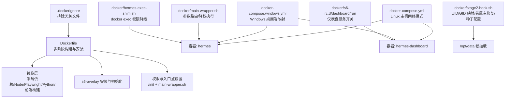
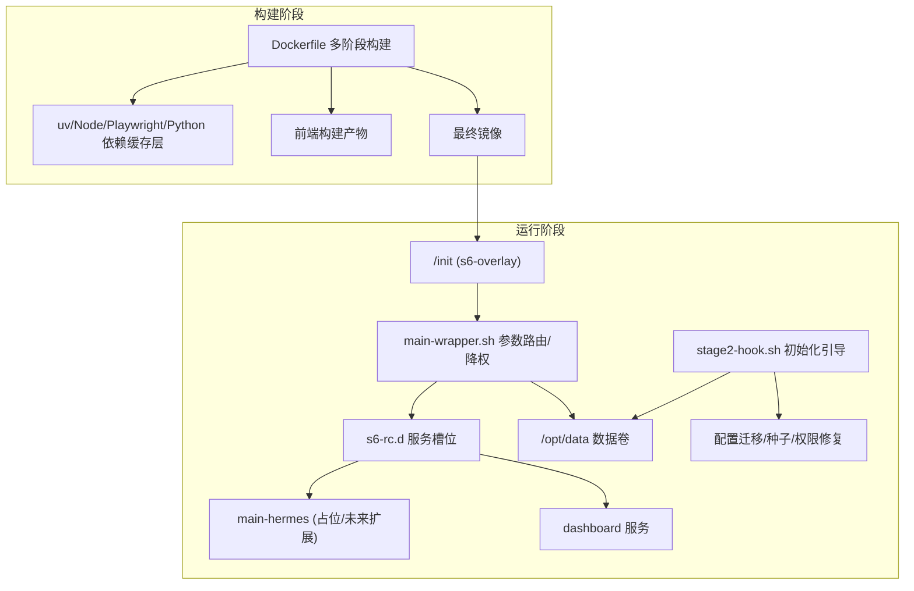
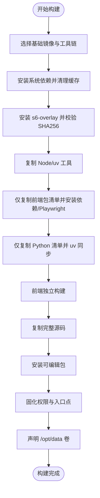
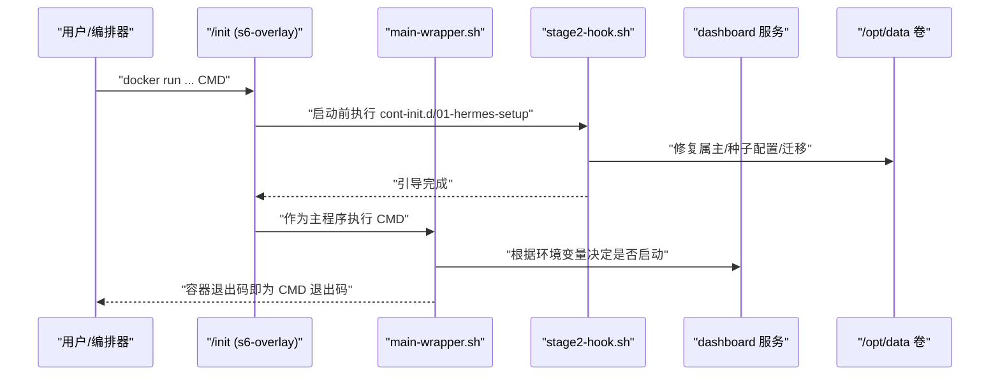
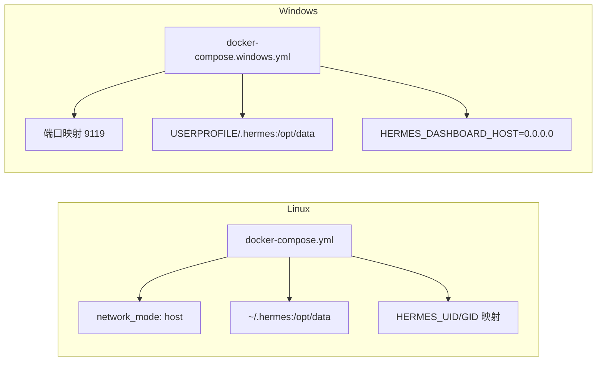
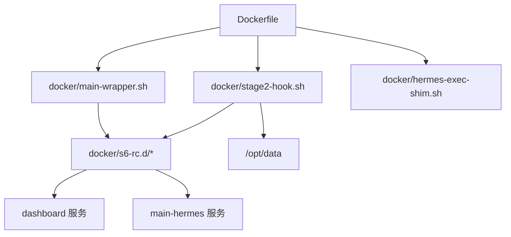

# 容器化部署

<cite>
**本文引用的文件**   
- [Dockerfile](file://Dockerfile)
- [docker-compose.yml](file://docker-compose.yml)
- [docker-compose.windows.yml](file://docker-compose.windows.yml)
- [.dockerignore](file://.dockerignore)
- [docker/entrypoint.sh](file://docker/entrypoint.sh)
- [docker/main-wrapper.sh](file://docker/main-wrapper.sh)
- [docker/stage2-hook.sh](file://docker/stage2-hook.sh)
- [docker/hermes-exec-shim.sh](file://docker/hermes-exec-shim.sh)
- [docker/s6-rc.d/main-hermes/run](file://docker/s6-rc.d/main-hermes/run)
- [docker/s6-rc.d/dashboard/run](file://docker/s6-rc.d/dashboard/run)
- [scripts/docker_config_migrate.py](file://scripts/docker_config_migrate.py)
</cite>

## 目录
1. [简介](#简介)
2. [项目结构](#项目结构)
3. [核心组件](#核心组件)
4. [架构总览](#架构总览)
5. [详细组件分析](#详细组件分析)
6. [依赖关系分析](#依赖关系分析)
7. [性能考量](#性能考量)
8. [故障排除指南](#故障排除指南)
9. [结论](#结论)
10. [附录](#附录)

## 简介
本指南面向希望在生产环境中稳定运行 Hermes Agent 的工程团队与运维人员，系统讲解基于 Docker 的多阶段构建、Compose 编排、跨平台（Linux 与 Windows）部署策略、容器安全最佳实践、可观测性与日志管理、以及常见问题排查与性能优化建议。内容直接来源于仓库中的 Dockerfile、Compose 配置与配套脚本，确保可操作性与一致性。

## 项目结构
围绕容器化部署的关键文件与目录如下：
- 构建与镜像：Dockerfile、.dockerignore
- 编排与运行：docker-compose.yml、docker-compose.windows.yml
- 运行时引导与监督：docker/entrypoint.sh、docker/main-wrapper.sh、docker/stage2-hook.sh、docker/hermes-exec-shim.sh
- s6-overlay 服务定义：docker/s6-rc.d/main-hermes/run、docker/s6-rc.d/dashboard/run
- 配置迁移工具：scripts/docker_config_migrate.py

**图表来源**
- [Dockerfile:1-338](file://Dockerfile#L1-L338)
- [.dockerignore:1-108](file://.dockerignore#L1-L108)
- [docker-compose.yml:1-77](file://docker-compose.yml#L1-L77)
- [docker-compose.windows.yml:1-39](file://docker-compose.windows.yml#L1-L39)
- [docker/stage2-hook.sh:1-434](file://docker/stage2-hook.sh#L1-L434)
- [docker/main-wrapper.sh:1-83](file://docker/main-wrapper.sh#L1-L83)
- [docker/hermes-exec-shim.sh:1-88](file://docker/hermes-exec-shim.sh#L1-L88)
- [docker/s6-rc.d/dashboard/run:1-56](file://docker/s6-rc.d/dashboard/run#L1-L56)

**章节来源**
- [Dockerfile:1-338](file://Dockerfile#L1-L338)
- [.dockerignore:1-108](file://.dockerignore#L1-L108)
- [docker-compose.yml:1-77](file://docker-compose.yml#L1-L77)
- [docker-compose.windows.yml:1-39](file://docker-compose.windows.yml#L1-L39)

## 核心组件
- 多阶段构建与依赖安装
  - 基础镜像与工具链：使用上游 Node LTS 与 Python 发行版，结合 Debian 基础镜像；系统依赖通过单层安装并清理缓存，减少层数与体积。
  - s6-overlay 安装：按架构校验并验证 SHA256，确保供应链安全；支持多架构自动识别。
  - 前端与 Python 依赖分层缓存：仅复制包清单与必要源树，最大化复用缓存；Playwright 浏览器预装路径隔离于数据卷之外。
- 运行时引导与监督
  - s6-overlay 作为 PID 1，负责初始化、服务注册与进程监督；入口点为 /init + main-wrapper.sh，实现参数路由与降权执行。
  - stage2-hook 在用户服务启动前完成 UID/GID 映射、卷属主修复、配置种子、技能同步与浏览器二进制发现等。
  - hermes-exec-shim 防止 docker exec 以 root 写入 /opt/data 导致权限不一致。
- 编排与跨平台
  - Linux 使用 host 网络模式与卷挂载 ~/.hermes 到 /opt/data；Windows 使用端口映射与 USERPROFILE 路径。
  - 支持通过环境变量控制仪表盘绑定地址、是否启用不安全模式、API 服务器暴露等。

**章节来源**
- [Dockerfile:10-338](file://Dockerfile#L10-L338)
- [docker/stage2-hook.sh:1-434](file://docker/stage2-hook.sh#L1-L434)
- [docker/main-wrapper.sh:1-83](file://docker/main-wrapper.sh#L1-L83)
- [docker/hermes-exec-shim.sh:1-88](file://docker/hermes-exec-shim.sh#L1-L88)
- [docker-compose.yml:1-77](file://docker-compose.yml#L1-L77)
- [docker-compose.windows.yml:1-39](file://docker-compose.windows.yml#L1-L39)

## 架构总览
下图展示从镜像构建到容器运行、服务监督与数据卷的全链路：

**图表来源**
- [Dockerfile:10-338](file://Dockerfile#L10-L338)
- [docker/main-wrapper.sh:1-83](file://docker/main-wrapper.sh#L1-L83)
- [docker/s6-rc.d/main-hermes/run:1-28](file://docker/s6-rc.d/main-hermes/run#L1-L28)
- [docker/s6-rc.d/dashboard/run:1-56](file://docker/s6-rc.d/dashboard/run#L1-L56)
- [docker/stage2-hook.sh:1-434](file://docker/stage2-hook.sh#L1-L434)

## 详细组件分析

### 多阶段构建流程与策略
- 基础与工具链阶段
  - 使用上游 Node 22 与 Python 发行版镜像，避免系统过时导致的兼容性问题；Debian 基础镜像用于稳定运行时。
  - 系统依赖一次性安装并清理缓存，降低镜像体积与攻击面。
- s6-overlay 安装
  - 通过 curl 动态下载对应架构 tarball 并校验 SHA256，保证供应链安全；保留旧版 tini 兼容符号链接。
- 依赖安装与缓存
  - 分别对前端与 Python 依赖进行分层缓存：仅复制包清单与必要源树，避免每次源变更重装依赖。
  - Playwright 浏览器安装至独立目录，避免被数据卷覆盖。
- 前端与源码构建
  - 前端单独构建，避免 Python 变更触发前端重建；随后复制完整源码并安装可编辑包。
- 权限与入口点
  - 创建非 root 用户，固化可执行入口与 PATH，确保 docker exec 与监督进程一致的权限模型。
  - 通过 /opt/hermes/bin/hermes 提供权限降级 shim，防止 root 写入 /opt/data。

**图表来源**
- [Dockerfile:10-338](file://Dockerfile#L10-L338)

**章节来源**
- [Dockerfile:10-338](file://Dockerfile#L10-L338)

### 运行时引导与参数路由
- main-wrapper.sh
  - 解析 CMD 参数：无参执行 hermes、直接执行可执行命令、或透传为 hermes 子命令。
  - 在非 root 场景下降权执行，确保与监督进程一致的 UID/GID。
  - 保存原始工作目录并在交接前恢复，保持与宿主行为一致。
- hermes-exec-shim.sh
  - 当 docker exec 以 root 身份调用 hermes 时，自动降权到 hermes 用户，避免写入 /opt/data 的权限错配。
  - 对于需要诊断场景，可通过环境变量禁用降权。
- stage2-hook.sh（引导）
  - 支持 HERMES_UID/HERMES_GID 或 PUID/PGID 映射，修正 hermes 用户 UID/GID。
  - 修复 /opt/data 及其子目录属主，仅针对 hermes 写入的目录与文件，避免破坏宿主已有文件。
  - 种子配置文件（.env、config.yaml、SOUL.md），并应用严格权限。
  - 执行配置迁移脚本，保持 schema 最新。
  - 同步内置技能，确保首次启动可用。
  - 自动发现 Playwright Chromium 二进制并通过 s6 环境传播给监督服务。

**图表来源**
- [docker/main-wrapper.sh:1-83](file://docker/main-wrapper.sh#L1-L83)
- [docker/stage2-hook.sh:1-434](file://docker/stage2-hook.sh#L1-L434)
- [docker/s6-rc.d/dashboard/run:1-56](file://docker/s6-rc.d/dashboard/run#L1-L56)

**章节来源**
- [docker/main-wrapper.sh:1-83](file://docker/main-wrapper.sh#L1-L83)
- [docker/hermes-exec-shim.sh:1-88](file://docker/hermes-exec-shim.sh#L1-L88)
- [docker/stage2-hook.sh:1-434](file://docker/stage2-hook.sh#L1-L434)

### 编排与跨平台部署策略
- Linux（宿主机网络）
  - 使用 host 网络模式，简化网关与仪表盘通信；通过 ~/.hermes 绑定到 /opt/data。
  - 支持通过 HERMES_UID/HERMES_GID 或 PUID/PGID 使容器内文件与宿主用户一致。
  - 仪表盘默认仅监听 127.0.0.1，如需远程访问请通过 SSH 隧道或反向代理加认证。
- Windows（Docker Desktop）
  - 不支持 host 网络，改用端口映射与 USERPROFILE 路径；仪表盘默认对外暴露并允许不安全模式（谨慎使用）。
  - 通过环境变量控制仪表盘绑定地址与端口。

**图表来源**
- [docker-compose.yml:1-77](file://docker-compose.yml#L1-L77)
- [docker-compose.windows.yml:1-39](file://docker-compose.windows.yml#L1-L39)

**章节来源**
- [docker-compose.yml:1-77](file://docker-compose.yml#L1-L77)
- [docker-compose.windows.yml:1-39](file://docker-compose.windows.yml#L1-L39)

### 容器安全最佳实践
- 非 root 运行与最小权限
  - 默认以 root 启动，通过 HERMES_UID/HERMES_GID 映射到 hermes 用户；监督进程与服务均以 s6-setuidgid 降权执行。
  - /opt/hermes 安装目录保持 root 只读，运行时状态全部位于 /opt/data。
- 供应链安全
  - s6-overlay 通过多架构 tarball 与 SHA256 校验，避免中间人攻击。
  - 前端与 Python 依赖分层缓存，减少外部网络交互。
- 机密与配置
  - .env 与 config.yaml 由 stage2-hook 种子并设置严格权限；auth.json 仅在首次启动写入，避免覆盖刷新令牌。
  - dashboard 默认仅本地监听，远程访问需显式开启不安全模式或通过反向代理。
- Docker-in-Docker
  - 若挂载 docker.sock，stage2-hook 自动为 hermes 用户添加匹配 GID 的补充组，避免权限错误。

**章节来源**
- [Dockerfile:90-216](file://Dockerfile#L90-L216)
- [docker/stage2-hook.sh:118-172](file://docker/stage2-hook.sh#L118-L172)
- [docker/s6-rc.d/dashboard/run:33-48](file://docker/s6-rc.d/dashboard/run#L33-L48)

### 监控与日志管理
- 日志输出
  - 关闭 Python 缓冲，确保实时日志；Playwright 浏览器缓存路径与 /opt/data 分离，避免 IO 干扰。
- 观测性
  - dashboard 服务可选启用；通过环境变量控制绑定地址与不安全模式。
  - 建议结合外部日志收集（如 systemd-journald、Fluent Bit、Promtail）采集 /opt/data 下的日志文件与容器标准输出。

**章节来源**
- [Dockerfile:12-20](file://Dockerfile#L12-L20)
- [docker/s6-rc.d/dashboard/run:30-48](file://docker/s6-rc.d/dashboard/run#L30-L48)

## 依赖关系分析
- 构建期依赖
  - Dockerfile 依赖 .dockerignore 排除不必要的上下文文件，缩短构建时间并提升安全性。
  - stage2-hook 依赖 /opt/hermes/.venv 中的 Python 与工具链，确保配置迁移与技能同步可用。
- 运行期依赖
  - s6-overlay 作为 PID 1，依赖 cont-init.d 与 s6-rc.d 的服务定义。
  - main-wrapper.sh 依赖 with-contenv 注入环境变量，并激活虚拟环境。
  - dashboard 服务依赖 HERMES_DASHBOARD 等环境变量决定启停。

**图表来源**
- [Dockerfile:10-338](file://Dockerfile#L10-L338)
- [docker/stage2-hook.sh:1-434](file://docker/stage2-hook.sh#L1-L434)
- [docker/main-wrapper.sh:1-83](file://docker/main-wrapper.sh#L1-L83)
- [docker/s6-rc.d/dashboard/run:1-56](file://docker/s6-rc.d/dashboard/run#L1-L56)
- [docker/s6-rc.d/main-hermes/run:1-28](file://docker/s6-rc.d/main-hermes/run#L1-L28)

**章节来源**
- [Dockerfile:10-338](file://Dockerfile#L10-L338)
- [docker/stage2-hook.sh:1-434](file://docker/stage2-hook.sh#L1-L434)
- [docker/main-wrapper.sh:1-83](file://docker/main-wrapper.sh#L1-L83)
- [docker/s6-rc.d/dashboard/run:1-56](file://docker/s6-rc.d/dashboard/run#L1-L56)
- [docker/s6-rc.d/main-hermes/run:1-28](file://docker/s6-rc.d/main-hermes/run#L1-L28)

## 性能考量
- 构建性能
  - 分层缓存策略显著减少重复安装时间；仅当包清单变化才重新安装依赖。
  - 前端与 Python 依赖分离构建，避免相互影响。
- 运行性能
  - Playwright 浏览器缓存与 /opt/data 分离，减少卷覆盖带来的 IO 抖动。
  - s6-overlay 以非阻塞方式回收僵尸进程，降低 CPU 开销。
- 资源占用
  - 通过只读安装目录与最小化运行时依赖，降低内存与磁盘占用。

[本节为通用指导，无需列出具体文件来源]

## 故障排除指南
- 启动后网关未运行
  - 检查 /opt/data/gateway_state.json 是否存在；若为空卷，可设置 HERMES_GATEWAY_BOOTSTRAP_STATE=running 以引导首次启动。
  - 确认 stage2-hook 是否正确修复 /opt/data 属主与权限。
- 仪表盘无法访问或提示认证失败
  - Linux：确认未将仪表盘暴露到非回环地址；如需远程访问，请通过 SSH 隧道或反向代理。
  - Windows：确认已设置 HERMES_DASHBOARD_HOST=0.0.0.0 且端口映射正确。
- docker exec 写入文件权限异常
  - 使用 docker exec hermes 时会自动降权；如需以 root 身份调试，请设置 HERMES_DOCKER_EXEC_AS_ROOT=1。
- 配置迁移失败或 schema 不兼容
  - stage2-hook 会在启动时调用配置迁移脚本；如需跳过，可设置 HERMES_SKIP_CONFIG_MIGRATION=1。
- Playwright 浏览器找不到
  - stage2-hook 会自动在启动时查找 Playwright Chromium 并注入环境变量；如自定义构建移除了 Playwright，需手动指定 AGENT_BROWSER_EXECUTABLE_PATH。

**章节来源**
- [docker/stage2-hook.sh:322-331](file://docker/stage2-hook.sh#L322-L331)
- [docker/stage2-hook.sh:367-372](file://docker/stage2-hook.sh#L367-L372)
- [docker/s6-rc.d/dashboard/run:33-48](file://docker/s6-rc.d/dashboard/run#L33-L48)
- [docker/hermes-exec-shim.sh:36-39](file://docker/hermes-exec-shim.sh#L36-L39)
- [scripts/docker_config_migrate.py:44-46](file://scripts/docker_config_migrate.py#L44-L46)
- [docker/stage2-hook.sh:385-431](file://docker/stage2-hook.sh#L385-L431)

## 结论
该容器化方案通过多阶段构建、s6-overlay 监督、严格的权限与供应链安全策略，提供了稳定、可审计、易维护的运行环境。配合 Linux 与 Windows 的差异化编排，既满足开发者的便捷性，也兼顾生产环境的安全与合规要求。建议在生产中结合外部日志与告警系统，持续监控容器健康与资源使用情况。

[本节为总结性内容，无需列出具体文件来源]

## 附录
- 关键环境变量速览
  - HERMES_UID/HERMES_GID 或 PUID/PGID：映射容器内 hermes 用户 UID/GID。
  - HERMES_DASHBOARD：启用仪表盘服务。
  - HERMES_DASHBOARD_HOST/PORT/INSECURE：控制仪表盘绑定与安全模式。
  - API_SERVER_HOST/API_SERVER_KEY：启用开放接口服务器（谨慎使用）。
  - HERMES_GATEWAY_BOOTSTRAP_STATE：引导网关初始状态。
  - HERMES_SKIP_CONFIG_MIGRATION：跳过启动时配置迁移。
  - HERMES_DOCKER_EXEC_AS_ROOT：禁用 docker exec 权限降级。
  - AGENT_BROWSER_EXECUTABLE_PATH：自定义浏览器二进制路径。
- 常见问题定位
  - 查看 s6-overlay 日志与服务状态：使用 s6-svstat、s6-sudo 与容器日志。
  - 检查 /opt/data 权限与文件属主：确保 hermes 用户可读写。
  - 确认 Playwright 缓存路径与二进制发现：检查环境变量与启动日志。

[本节为通用附录，无需列出具体文件来源]