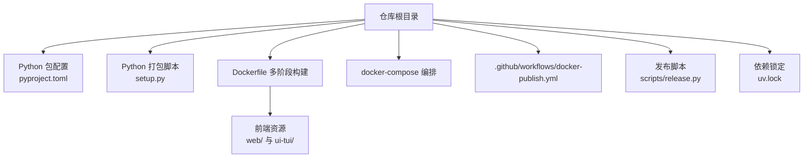
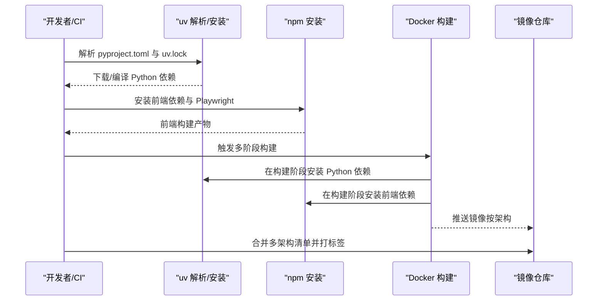
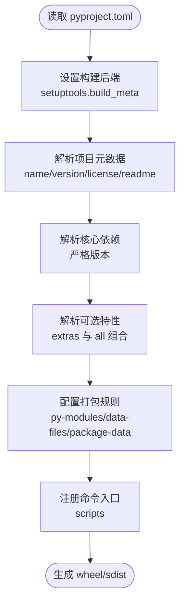
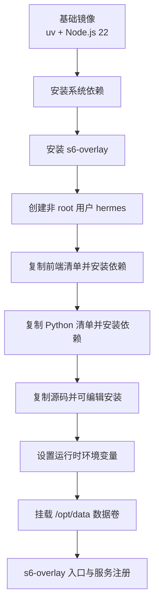
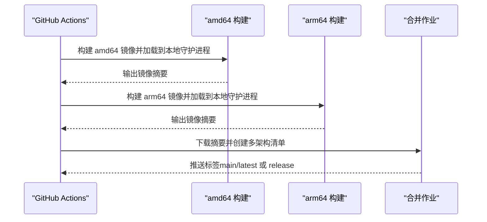
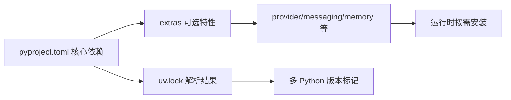

# 构建与部署

<cite>
**本文档引用的文件**
- [pyproject.toml](file://pyproject.toml)
- [setup.py](file://setup.py)
- [Dockerfile](file://Dockerfile)
- [docker-compose.yml](file://docker-compose.yml)
- [.github/workflows/docker-publish.yml](file://.github/workflows/docker-publish.yml)
- [scripts/release.py](file://scripts/release.py)
- [uv.lock](file://uv.lock)
</cite>

## 目录
1. [简介](#简介)
2. [项目结构](#项目结构)
3. [核心组件](#核心组件)
4. [架构总览](#架构总览)
5. [详细组件分析](#详细组件分析)
6. [依赖分析](#依赖分析)
7. [性能考虑](#性能考虑)
8. [故障排除指南](#故障排除指南)
9. [结论](#结论)
10. [附录](#附录)

## 简介
本指南面向构建与部署工程师，系统阐述该项目的构建系统（Python 打包与依赖管理）、多平台编译流程、打包过程（wheel 与源码分发）、Docker 容器化部署（镜像构建、多阶段构建、运行时配置）、发布流程（版本管理、变更日志、发布标签）以及 CI/CD 流水线与自动化部署策略，并提供最佳实践与故障排除建议。

## 项目结构
本项目采用现代 Python 包管理与多语言前端工程组织方式：
- Python 应用主体位于仓库根目录，使用 setuptools/pyproject.toml 进行打包与元数据声明。
- 前端资源分为 web（Web 应用）与 ui-tui（Electron/Tauri 桌面应用）两套，通过独立的 package.json 管理依赖。
- Docker 镜像构建采用多阶段策略，结合 uv 与 npm 的分层缓存优化，确保构建速度与可重复性。
- CI/CD 使用 GitHub Actions，实现跨平台镜像构建、多架构合并与发布。

图示来源
- [pyproject.toml](file://pyproject.toml)
- [setup.py](file://setup.py)
- [Dockerfile](file://Dockerfile)
- [docker-compose.yml](file://docker-compose.yml)
- [.github/workflows/docker-publish.yml](file://.github/workflows/docker-publish.yml)
- [scripts/release.py](file://scripts/release.py)
- [uv.lock](file://uv.lock)

章节来源
- [pyproject.toml](file://pyproject.toml)
- [setup.py](file://setup.py)
- [Dockerfile](file://Dockerfile)
- [docker-compose.yml](file://docker-compose.yml)
- [.github/workflows/docker-publish.yml](file://.github/workflows/docker-publish.yml)
- [scripts/release.py](file://scripts/release.py)
- [uv.lock](file://uv.lock)

## 核心组件
- 构建后端与元数据：pyproject.toml 声明项目元信息、依赖、可选特性与打包规则；setup.py 用于在 sdist 中打包技能与插件等数据文件。
- 依赖管理：使用 uv 作为 Python 依赖解析与安装工具，uv.lock 固定解析结果，确保一致性。
- 打包与分发：wheel 与 sdist 双通道，wheel 由 setuptools/pyproject.toml 生成，sdist 由 setup.py 配合 MANIFEST 收集。
- 容器化：Dockerfile 多阶段构建，前端与 Python 依赖分层缓存，s6-overlay 运行时监督。
- 发布与 CI：GitHub Actions 自动化镜像构建、测试与发布，支持 amd64/arm64 并合并为多架构清单。

章节来源
- [pyproject.toml](file://pyproject.toml)
- [setup.py](file://setup.py)
- [Dockerfile](file://Dockerfile)
- [.github/workflows/docker-publish.yml](file://.github/workflows/docker-publish.yml)

## 架构总览
下图展示从本地开发到容器发布的整体流程：本地或 CI 使用 uv 解析 Python 依赖，npm 安装前端依赖，Docker 多阶段构建镜像，最终推送至镜像仓库并生成多架构清单。

图示来源
- [Dockerfile](file://Dockerfile)
- [.github/workflows/docker-publish.yml](file://.github/workflows/docker-publish.yml)

章节来源
- [Dockerfile](file://Dockerfile)
- [.github/workflows/docker-publish.yml](file://.github/workflows/docker-publish.yml)

## 详细组件分析

### Python 构建与打包（pyproject.toml）
- 构建后端：setuptools.build_meta，要求 setuptools >=77，确保 SPDX 许可表达式正确解析。
- 版本与元数据：名称、版本、描述、许可证、README、Python 版本范围（>=3.11,<3.14）。
- 依赖策略：核心依赖严格精确版本，降低供应链风险；可选特性通过 extras 分离，避免在基础镜像中引入不兼容的原生扩展。
- 打包规则：py-modules 列表声明模块；data-files 与 package-data 明确打包 i18n、MCP 目录与插件清单等资源；MANIFEST 收集技能与可选 MCP 清单以保证封顶安装可用。
- 脚本入口：hermes、hermes-agent、hermes-acp 三个命令入口。

图示来源
- [pyproject.toml](file://pyproject.toml)

章节来源
- [pyproject.toml](file://pyproject.toml)

### Python 打包脚本（setup.py）
- 作用：在 sdist 中收集 skills 与 optional-skills 目录树，确保封顶安装时包含这些数据文件。
- 实现：遍历指定目录树，按相对路径分组，返回 data_files 列表供 setuptools 使用。

章节来源
- [setup.py](file://setup.py)

### 依赖管理与锁定（uv 与 uv.lock）
- 解析器：uv 作为解析与安装工具，支持基于锁文件的确定性安装。
- 锁文件：uv.lock 固定解析结果与平台标记，确保不同环境一致。
- Python 版本约束：requires-python = ">=3.11, <3.14"，与 Dockerfile 中的 Python 基础镜像保持一致。
- 依赖粒度：核心依赖最小化，可选特性通过 extras 控制，减少攻击面。

章节来源
- [uv.lock](file://uv.lock)
- [Dockerfile](file://Dockerfile)

### Docker 多阶段构建
- 基础镜像：使用 Astral uv 官方镜像作为 Python 基础，Node.js 22 来源镜像复制到容器内，确保前端工具链稳定。
- 系统依赖：apt 安装必要系统包（证书、网络、编译工具、Docker CLI 等），并清理缓存。
- s6-overlay：作为 PID 1 的监督系统，替代 tini，负责僵尸进程回收与服务生命周期管理。
- 用户与权限：非 root 用户 hermes 运行时，通过 s6-setuidgid 切换用户，确保安全隔离。
- 前端与 Python 分层：先复制前端清单并安装依赖，再复制 Python 清单并安装依赖，最后复制源码并进行可编辑安装，最大化缓存命中。
- 构建时注入 Git 提交：通过 HERMES_GIT_SHA 构建参数写入镜像内的 .hermes_build_sha 文件，便于运行时显示准确版本信息。
- 运行时环境：设置 HOME、TUI/WEB 资源路径、禁用懒安装等，确保容器内行为与打包发行一致。

图示来源
- [Dockerfile](file://Dockerfile)

章节来源
- [Dockerfile](file://Dockerfile)

### docker-compose 编排
- 服务：gateway 与 dashboard 两个服务，均使用主机网络模式，便于本地调试与 API 服务暴露。
- 数据卷：~/.hermes -> /opt/data，确保配置、日志与状态持久化。
- 环境变量：HERMES_UID/HERMES_GID 控制宿主机文件权限；可选开启 OpenAI 兼容 API 服务器与特定平台网关。
- 安全提示：dashboard 默认仅监听 127.0.0.1，如需远程访问请通过 SSH 隧道或反向代理加鉴权。

章节来源
- [docker-compose.yml](file://docker-compose.yml)

### CI/CD 流水线（GitHub Actions）
- 触发条件：对 Dockerfile、pyproject.toml、uv.lock、Docker 相关目录与工作流文件的变更进行路径过滤；PR 与主分支推送都会触发。
- 并发策略：主分支与发布事件不取消，PR 事件可复用组并允许快速取消。
- 任务拆分：
  - amd64 与 arm64 两套作业，分别在本地守护进程加载镜像进行冒烟测试。
  - arm64 使用 ghcr.io 的 registry 类型缓存，避免 GHA 内部缓存令牌过期问题。
  - 合并作业：根据两架构产物创建多架构清单并打上标签（main/latest 或发布标签）。
- 测试：在已加载镜像的环境中运行 docker 集成测试，避免重复构建。
- 登录与推送：按事件类型登录镜像仓库，推送按架构摘要并输出摘要文件供后续合并作业使用。

图示来源
- [.github/workflows/docker-publish.yml](file://.github/workflows/docker-publish.yml)

章节来源
- [.github/workflows/docker-publish.yml](file://.github/workflows/docker-publish.yml)

### 发布流程（版本管理、变更日志、标签）
- 版本策略：CalVer（Calendar Versioning）风格，版本号与日期绑定；支持预览（dry-run）与实际发布。
- 变更日志：自动生成变更日志，包含贡献者映射与提交摘要。
- 标签与发布：根据事件选择推送 main/latest 或具体 release 标签；发布脚本同时更新相关清单文件以保持版本一致性。

章节来源
- [scripts/release.py](file://scripts/release.py)

## 依赖分析
- Python 依赖解析：uv.lock 固定解析结果，覆盖多 Python 版本标记，确保跨平台一致性。
- 前端依赖：web 与 ui-tui 分别维护独立的 package.json，Playwright 与 npm 工具链在构建阶段安装。
- 可选特性：通过 extras 将第三方提供商、消息平台、语音/图像等能力延迟到首次使用，减少镜像体积与构建时间。
- 供应链安全：严格 pin 核心依赖，对高风险包（如 urllib3、starlette 等）进行版本加固。

图示来源
- [pyproject.toml](file://pyproject.toml)
- [uv.lock](file://uv.lock)

章节来源
- [pyproject.toml](file://pyproject.toml)
- [uv.lock](file://uv.lock)

## 性能考虑
- 分层缓存：Dockerfile 将前端与 Python 依赖安装拆分为独立层，仅当清单变化才重建对应层，显著缩短增量构建时间。
- 构建参数：HERMES_GIT_SHA 注入构建时提交，避免容器内无法读取 .git 导致的运行时回退逻辑开销。
- 运行时优化：禁用 Python 编译缓存与标准输出缓冲，确保日志实时可见；s6-overlay 替代 tini，减少僵尸进程与额外开销。
- CI 缓存：arm64 使用 registry 类型缓存，避免 GHA 内部缓存令牌过期导致的冷启动失败。

章节来源
- [Dockerfile](file://Dockerfile)
- [.github/workflows/docker-publish.yml](file://.github/workflows/docker-publish.yml)

## 故障排除指南
- 容器启动后服务不可用
  - 检查 s6-overlay 是否正常接管 PID 1，确认 cont-init.d 脚本执行成功。
  - 查看 /opt/data 权限是否正确映射（HERMES_UID/HERMES_GID）。
- 前端构建失败
  - 确认 npm_config_install_links=false 设置生效，避免旧版 npm 的符号链接问题。
  - 检查 Playwright 二进制安装是否完成，必要时重新安装。
- Python 依赖安装失败
  - 确认 uv.lock 与 pyproject.toml 一致，且构建上下文包含 README.md 占位文件。
  - 检查 extras 选择是否与目标平台匹配（如 Matrix 依赖在容器内已内置）。
- CI 构建超时或失败
  - arm64 作业使用 registry 缓存，若缓存损坏可删除对应 ref 后重试。
  - 主分支与 PR 的缓存策略不同，注意区分缓存读写权限。
- 运行时权限问题
  - 使用 docker exec 时默认 root，可能导致写入 /opt/data 的文件权限异常；可通过特权降级 shim 或设置 HERMES_UID/HERMES_GID 解决。

章节来源
- [Dockerfile](file://Dockerfile)
- [docker-compose.yml](file://docker-compose.yml)
- [.github/workflows/docker-publish.yml](file://.github/workflows/docker-publish.yml)

## 结论
本项目通过严格的依赖管理（uv + 锁文件）、清晰的打包规则（wheel/sdist）、稳健的 Docker 多阶段构建与 CI/CD 自动化，实现了可复现、可审计、可扩展的交付体系。建议在生产环境中遵循本文档的最佳实践，持续完善安全基线与监控告警，确保交付质量与运维效率。

## 附录
- 命令入口
  - hermes：主命令入口
  - hermes-agent：Agent 运行入口
  - hermes-acp：ACPs 适配器入口
- 关键环境变量
  - HERMES_UID/HERMES_GID：控制宿主机文件权限
  - HERMES_HOME：用户数据根目录
  - HERMES_WEB_DIST/HERMES_TUI_DIR：静态资源路径
  - HERMES_DISABLE_LAZY_INSTALLS：禁用运行时懒安装
- Docker Compose 服务
  - gateway：主服务，支持主机网络与数据卷
  - dashboard：本地仪表盘，支持 SSH 隧道访问

章节来源
- [pyproject.toml](file://pyproject.toml)
- [docker-compose.yml](file://docker-compose.yml)
- [Dockerfile](file://Dockerfile)