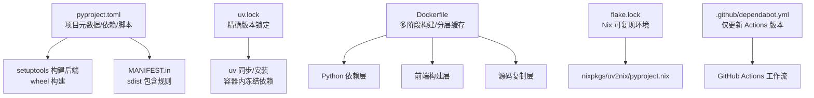
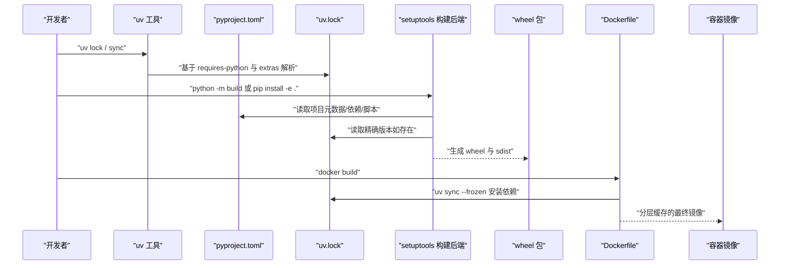
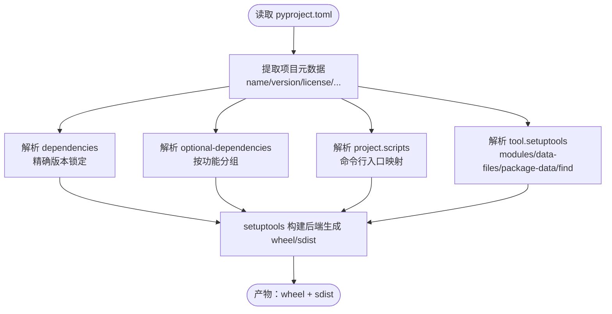
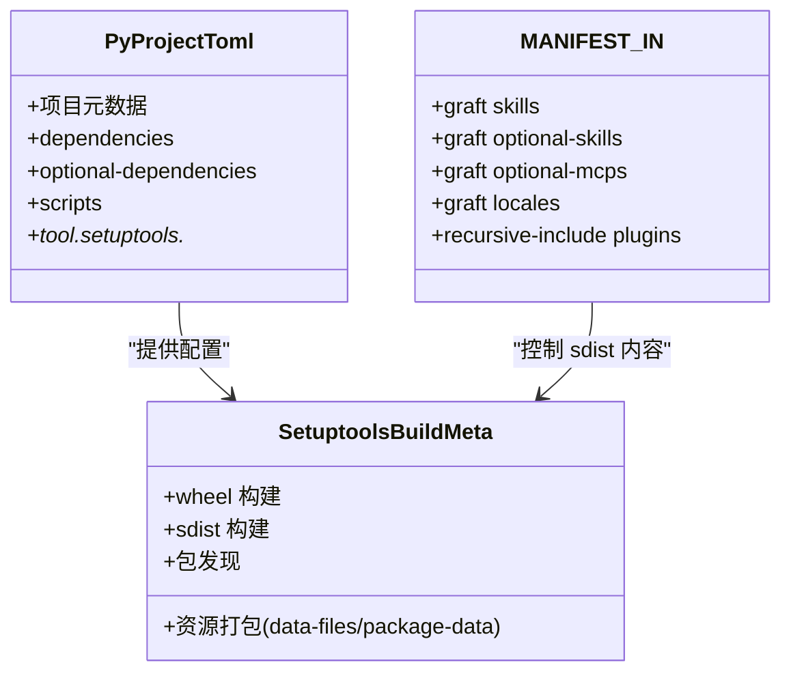
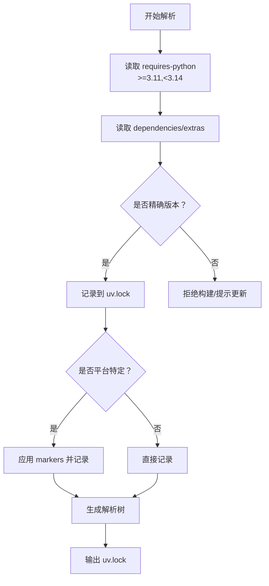
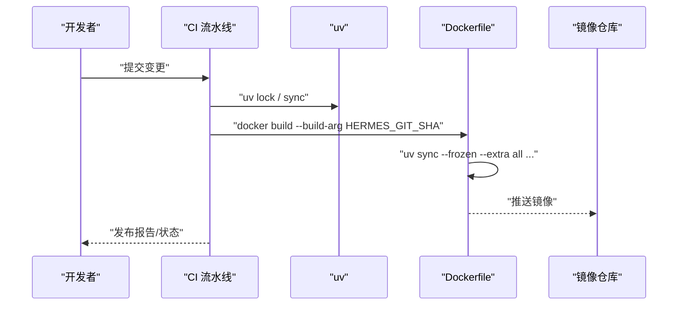
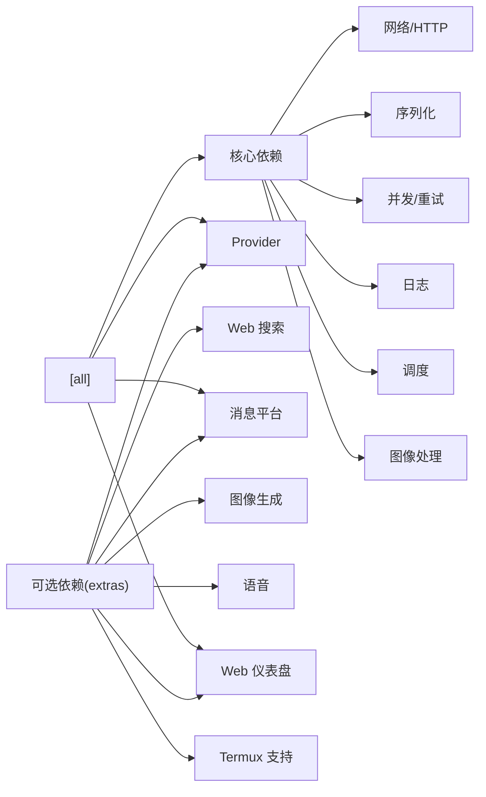

# 构建系统

<cite>
**本文档引用的文件**
- [pyproject.toml](file://pyproject.toml)
- [setup.py](file://setup.py)
- [uv.lock](file://uv.lock)
- [MANIFEST.in](file://MANIFEST.in)
- [Dockerfile](file://Dockerfile)
- [.github/dependabot.yml](file://.github/dependabot.yml)
- [flake.lock](file://flake.lock)
</cite>

## 目录
1. [简介](#简介)
2. [项目结构](#项目结构)
3. [核心组件](#核心组件)
4. [架构总览](#架构总览)
5. [详细组件分析](#详细组件分析)
6. [依赖分析](#依赖分析)
7. [性能考虑](#性能考虑)
8. [故障排除指南](#故障排除指南)
9. [结论](#结论)

## 简介
本文件系统性阐述该代码库的构建系统，覆盖以下主题：
- pyproject.toml 配置结构与作用：项目元数据、依赖管理、脚本定义
- setuptools 构建后端工作机制：wheel 构建、源码分发、包发现机制
- 依赖解析策略：精确版本锁定、可选依赖、平台特定依赖
- uv.lock 文件的作用与维护方法
- 构建脚本与自动化流程：CI/CD 集成
- 构建环境配置与故障排除

## 项目结构
该仓库采用现代 Python 包管理与多语言前端工程化实践：
- 使用 pyproject.toml 定义项目元数据、依赖、脚本与 setuptools 配置
- 使用 uv 作为包管理器与锁文件工具，生成 uv.lock 并在容器中使用
- 使用 MANIFEST.in 控制 sdist 的包含内容，确保打包完整
- 使用 Dockerfile 实现分层缓存的多阶段构建，结合 s6-overlay 运行时监督
- 使用 Nix flake 提供可复现的开发与构建环境（flake.lock）
- GitHub Dependabot 仅对 GitHub Actions 生效，避免破坏精确版本锁定策略

**图表来源**
- [pyproject.toml](file://pyproject.toml)
- [uv.lock](file://uv.lock)
- [MANIFEST.in](file://MANIFEST.in)
- [Dockerfile](file://Dockerfile)
- [flake.lock](file://flake.lock)
- [.github/dependabot.yml](file://.github/dependabot.yml)

**章节来源**
- [pyproject.toml](file://pyproject.toml)
- [MANIFEST.in](file://MANIFEST.in)
- [Dockerfile](file://Dockerfile)
- [flake.lock](file://flake.lock)
- [.github/dependabot.yml](file://.github/dependabot.yml)

## 核心组件
- 项目元数据与脚本
  - 项目名称、版本、描述、许可证、README、Python 版本范围等
  - 命令行入口脚本映射（hermes、hermes-agent、hermes-acp）
- 依赖管理
  - 核心依赖严格精确版本锁定，降低供应链风险
  - 可选依赖通过 extras 组织，按需安装
  - 平台特定依赖通过 markers 条件声明
- setuptools 配置
  - 显式声明 py-modules 与 packages.find.include
  - data-files 与 package-data 确保资源文件进入 wheel/sdist
- 锁文件与构建
  - uv.lock 提供精确解析结果；Dockerfile 在构建阶段冻结依赖
  - MANIFEST.in 保证 sdist 包含必要的目录与清单文件

**章节来源**
- [pyproject.toml](file://pyproject.toml)
- [setup.py](file://setup.py)
- [MANIFEST.in](file://MANIFEST.in)

## 架构总览
下图展示从配置到产物的关键路径：pyproject.toml 与 uv.lock 驱动 setuptools 构建，Dockerfile 将依赖与前端产物固化为镜像。

**图表来源**
- [pyproject.toml](file://pyproject.toml)
- [uv.lock](file://uv.lock)
- [Dockerfile](file://Dockerfile)

## 详细组件分析

### pyproject.toml：项目元数据与依赖策略
- 构建后端与 Python 版本
  - 指定 setuptools>=77 与 build-backend=“setuptools.build_meta”
  - requires-python 设为 “>=3.11,<3.14”，限制解释器版本以避免不兼容的原生扩展
- 项目元数据
  - name/version/description/readme/license/license-files/authors
- 依赖与可选依赖
  - dependencies：核心依赖全部精确版本，强调供应链安全
  - optional-dependencies：按功能拆分为 extras，如 anthropic、exa、firecrawl、messaging、web、matrix 等
  - all：仅包含“不能懒加载”的依赖集合，避免将可能被 Quarantined 的包纳入默认安装
- 脚本定义
  - hermes、hermes-agent、hermes-acp 三个命令行入口
- setuptools 配置
  - tool.setuptools.py-modules：显式声明模块
  - tool.setuptools.data-files：locales 与 optional-mcps 清单打包
  - tool.setuptools.package-data：插件清单与网关资源打包
  - tool.setuptools.packages.find.include：自动发现 agent、tools、hermes_cli、gateway 等子包

**图表来源**
- [pyproject.toml](file://pyproject.toml)

**章节来源**
- [pyproject.toml](file://pyproject.toml)

### setuptools 构建后端与包发现机制
- wheel 构建
  - 由 setuptools.build_meta 驱动，遵循 pyproject.toml 中的配置
  - 通过 tool.setuptools.py-modules 与 tool.setuptools.packages.find.include 明确包与模块边界
- 源码分发（sdist）
  - MANIFEST.in 控制哪些目录与文件进入 sdist
  - 关键点：skills、optional-skills、optional-mcps、locales 目录必须包含
  - 插件清单（plugin.yaml/yml）也需包含，否则打包后运行时装载不到插件
- 包发现与资源打包
  - data-files：将 locales 与 optional-mcps 清单打入 wheel，确保密封安装可用
  - package-data：插件清单与网关资源随包分发

**图表来源**
- [pyproject.toml](file://pyproject.toml)
- [MANIFEST.in](file://MANIFEST.in)

**章节来源**
- [pyproject.toml](file://pyproject.toml)
- [setup.py](file://setup.py)
- [MANIFEST.in](file://MANIFEST.in)

### 依赖解析策略：精确版本锁定、可选依赖、平台特定依赖
- 精确版本锁定
  - dependencies 全部使用精确版本，避免 PyPI 上游的意外升级
  - uv.lock 记录解析结果，Dockerfile 在构建阶段使用 uv sync --frozen 强制一致
- 可选依赖（extras）
  - 将 provider/backends（如 anthropic、exa、firecrawl、edge-tts、matrix 等）放入 extras
  - all 仅包含“不能懒加载”的依赖，避免将可能被 Quarantined 的包纳入默认安装
- 平台特定依赖
  - 使用 markers（如 sys_platform == "win32"）声明 Windows/Mac/Linux 差异
  - 示例：tzdata、concurrent-log-handler、ptyprocess/pywinpty、pillow 等
- 供应链安全
  - 对已知漏洞的依赖进行精确升级或替换（如 urllib3、starlette、pillow 等）
  - 严格区分“核心依赖”与“可选依赖”，缩小攻击面

**图表来源**
- [pyproject.toml](file://pyproject.toml)
- [uv.lock](file://uv.lock)

**章节来源**
- [pyproject.toml](file://pyproject.toml)
- [uv.lock](file://uv.lock)

### uv.lock：作用与维护方法
- 作用
  - 记录精确版本与解析结果，确保跨环境一致性
  - Dockerfile 在构建阶段使用 uv sync --frozen 强制冻结安装
- 维护方法
  - 当 pyproject.toml 中 dependencies/extras 变更时，执行 uv lock 更新锁文件
  - 在 CI 中校验 uv.lock 未被修改（防止意外变更）
  - 仅当上游 CVE 发布且当前版本受影响时，才打开 Dependabot 安全 PR 更新锁文件中的版本

**章节来源**
- [uv.lock](file://uv.lock)
- [.github/dependabot.yml](file://.github/dependabot.yml)

### 构建脚本与自动化流程（CI/CD 集成）
- 依赖同步与安装
  - 在容器构建阶段使用 uv sync --frozen --no-install-project --extra all 等参数，确保生产镜像包含必要依赖
- 前端构建
  - 分离前端构建层，避免 Python 变更导致重复编译
- 可复现环境
  - flake.lock 与 nixpkgs/uv2nix/pyproject.nix 协作，提供可复现的开发与构建环境
- 依赖更新策略
  - 仅对 GitHub Actions 生效，避免破坏精确版本锁定

**图表来源**
- [Dockerfile](file://Dockerfile)
- [uv.lock](file://uv.lock)
- [.github/dependabot.yml](file://.github/dependabot.yml)

**章节来源**
- [Dockerfile](file://Dockerfile)
- [uv.lock](file://uv.lock)
- [.github/dependabot.yml](file://.github/dependabot.yml)

## 依赖分析
- 核心依赖（dependencies）
  - 严格精确版本，涵盖网络、序列化、并发、日志、调度、图像处理等基础能力
  - 部分依赖因上游问题（CVE 或崩溃）进行了强制升级
- 可选依赖（optional-dependencies）
  - 按功能域拆分：provider（anthropic、bedrock、azure-identity）、搜索（exa、firecrawl、parallel-web）、消息（messaging、matrix、slack、wecom）、图像（fal）、语音（edge-tts、faster-whisper）、web 仪表盘（web）、termux 支持等
  - all：仅包含“不能懒加载”的依赖，避免将可能被 Quarantined 的包纳入默认安装
- 平台特定依赖
  - Windows：tzdata、concurrent-log-handler、pywinpty
  - POSIX：ptyprocess
  - 通过 markers 精确控制

**图表来源**
- [pyproject.toml](file://pyproject.toml)

**章节来源**
- [pyproject.toml](file://pyproject.toml)

## 性能考虑
- 分层缓存
  - Dockerfile 将前端构建与 Python 依赖安装分离，减少不必要的重建
  - 仅在锁文件或包清单变更时触发依赖层重建
- 二进制与轮子优先
  - 通过精确版本与预编译 wheel，避免源码编译带来的耗时
- 运行时监督
  - s6-overlay 替代 tini，非阻塞地回收僵尸进程并监督多个服务

[本节为通用指导，无需列出具体文件来源]

## 故障排除指南
- 安装失败或版本不匹配
  - 确认本地 uv.lock 与 pyproject.toml 一致，必要时重新执行 uv lock
  - 在容器中使用 uv sync --frozen 强制冻结安装
- 插件/资源缺失
  - 检查 MANIFEST.in 是否包含 plugins 的 plugin.yaml/yml
  - 确认 tool.setuptools.data-files 与 package-data 配置正确
- 平台差异导致的导入错误
  - 检查 sys_platform 标记是否正确，确认目标平台的依赖已安装
- Windows 日志轮转异常
  - concurrent-log-handler 仅在 Windows 安装，确认 markers 生效
- 供应链安全告警
  - 若出现 CVE，先在 uv.lock 中提升至修复版本，再触发 CI 验证

**章节来源**
- [pyproject.toml](file://pyproject.toml)
- [MANIFEST.in](file://MANIFEST.in)
- [Dockerfile](file://Dockerfile)

## 结论
该构建系统通过 pyproject.toml 的严格配置、uv.lock 的精确锁定、MANIFEST.in 的 sdist 控制以及 Dockerfile 的分层缓存，实现了高可复现、低风险、高性能的构建与交付。配合 flake.lock 与 Nix 工具链，进一步提升了开发与打包的一致性。建议持续遵循“精确版本 + 可选依赖 + 平台标记”的策略，并仅在 CVE 场景下更新锁文件版本。