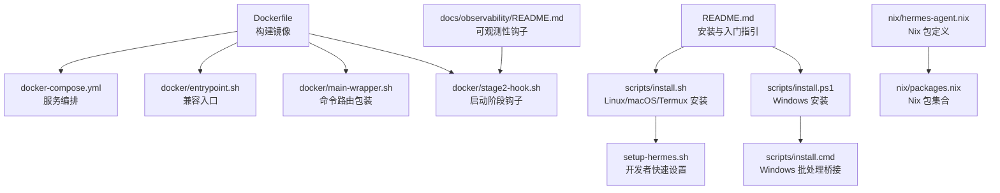
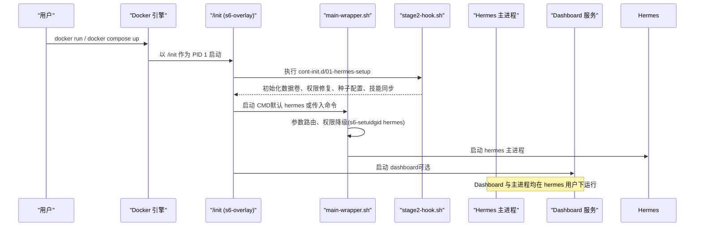
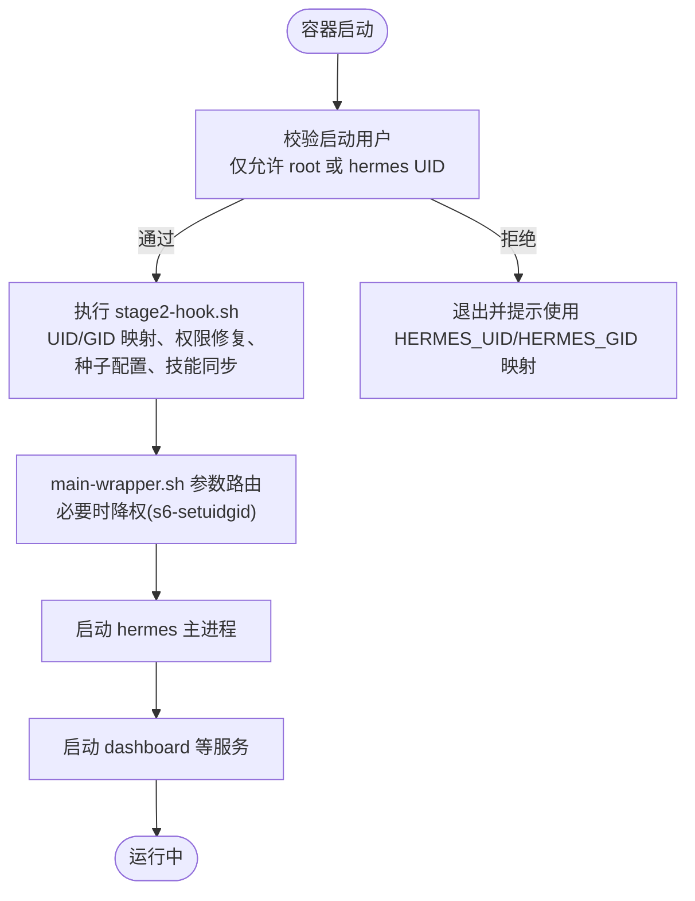
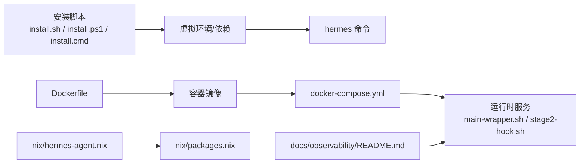

# 部署策略

<cite>
**本文引用的文件**
- [Dockerfile](file://Dockerfile)
- [docker-compose.yml](file://docker-compose.yml)
- [setup-hermes.sh](file://setup-hermes.sh)
- [scripts/install.sh](file://scripts/install.sh)
- [scripts/install.ps1](file://scripts/install.ps1)
- [scripts/install.cmd](file://scripts/install.cmd)
- [nix/hermes-agent.nix](file://nix/hermes-agent.nix)
- [nix/packages.nix](file://nix/packages.nix)
- [docker/entrypoint.sh](file://docker/entrypoint.sh)
- [docker/main-wrapper.sh](file://docker/main-wrapper.sh)
- [docker/stage2-hook.sh](file://docker/stage2-hook.sh)
- [README.md](file://README.md)
- [docs/observability/README.md](file://docs/observability/README.md)
</cite>

## 目录
1. [简介](#简介)
2. [项目结构](#项目结构)
3. [核心组件](#核心组件)
4. [架构总览](#架构总览)
5. [详细组件分析](#详细组件分析)
6. [依赖关系分析](#依赖关系分析)
7. [性能考量](#性能考量)
8. [故障排查指南](#故障排查指南)
9. [结论](#结论)
10. [附录](#附录)

## 简介
本指南系统性梳理 Hermes Agent 的多种部署策略与最佳实践，覆盖源码安装、包管理器安装、容器部署、Nix 包管理等路径；详述各安装脚本的使用方法与配置选项；针对 Linux、Windows、macOS、Android（Termux）给出特殊注意事项；并提供云平台（AWS、Azure、GCP）部署建议、高可用与负载均衡策略、部署监控与健康检查、以及自动扩缩容配置思路。

## 项目结构
围绕部署相关的顶层文件与目录如下：
- 容器镜像与编排：Dockerfile、docker-compose.yml、docker/* 启动与引导脚本
- 跨平台安装脚本：scripts/install.sh（Linux/macOS/Termux）、scripts/install.ps1（Windows）、scripts/install.cmd（Windows）
- 源码一键安装：setup-hermes.sh
- Nix 包管理：nix/hermes-agent.nix、nix/packages.nix
- 文档与参考：README.md、docs/observability/README.md

图示来源
- [Dockerfile](file://Dockerfile)
- [docker-compose.yml](file://docker-compose.yml)
- [docker/entrypoint.sh](file://docker/entrypoint.sh)
- [docker/main-wrapper.sh](file://docker/main-wrapper.sh)
- [docker/stage2-hook.sh](file://docker/stage2-hook.sh)
- [scripts/install.sh](file://scripts/install.sh)
- [scripts/install.ps1](file://scripts/install.ps1)
- [scripts/install.cmd](file://scripts/install.cmd)
- [setup-hermes.sh](file://setup-hermes.sh)
- [nix/hermes-agent.nix](file://nix/hermes-agent.nix)
- [nix/packages.nix](file://nix/packages.nix)
- [README.md](file://README.md)
- [docs/observability/README.md](file://docs/observability/README.md)

章节来源
- [Dockerfile](file://Dockerfile)
- [docker-compose.yml](file://docker-compose.yml)
- [scripts/install.sh](file://scripts/install.sh)
- [scripts/install.ps1](file://scripts/install.ps1)
- [scripts/install.cmd](file://scripts/install.cmd)
- [setup-hermes.sh](file://setup-hermes.sh)
- [nix/hermes-agent.nix](file://nix/hermes-agent.nix)
- [nix/packages.nix](file://nix/packages.nix)
- [README.md](file://README.md)
- [docs/observability/README.md](file://docs/observability/README.md)

## 核心组件
- 容器镜像与运行时
  - 基于多阶段构建，内置 uv、Node.js、Playwright 浏览器、s6-overlay 进程监督、非 root 用户运行、数据卷隔离等特性
  - 默认入口为 s6-overlay 的 /init + main-wrapper.sh，负责参数路由、权限降级、工作目录恢复等
- 安装脚本族
  - Linux/macOS/Termux：scripts/install.sh 与 setup-hermes.sh，支持 uv、虚拟环境、可选依赖、技能同步、PATH 注册
  - Windows：scripts/install.ps1 与 scripts/install.cmd，集成 Git Bash、Node、uv、浏览器工具链
- Nix 包管理
  - hermes-agent.nix 定义包与封装，packages.nix 提供预置依赖组合（如 full、messaging），支持插件与技能打包

章节来源
- [Dockerfile](file://Dockerfile)
- [docker/main-wrapper.sh](file://docker/main-wrapper.sh)
- [scripts/install.sh](file://scripts/install.sh)
- [setup-hermes.sh](file://setup-hermes.sh)
- [scripts/install.ps1](file://scripts/install.ps1)
- [scripts/install.cmd](file://scripts/install.cmd)
- [nix/hermes-agent.nix](file://nix/hermes-agent.nix)
- [nix/packages.nix](file://nix/packages.nix)

## 架构总览
下图展示容器部署的启动流程与关键组件交互：

图示来源
- [docker/main-wrapper.sh](file://docker/main-wrapper.sh)
- [docker/stage2-hook.sh](file://docker/stage2-hook.sh)
- [docker-compose.yml](file://docker-compose.yml)

章节来源
- [docker/main-wrapper.sh](file://docker/main-wrapper.sh)
- [docker/stage2-hook.sh](file://docker/stage2-hook.sh)
- [docker-compose.yml](file://docker-compose.yml)

## 详细组件分析

### 容器部署（Docker）
- 镜像构建要点
  - 多阶段：基础镜像、Node 源、uv 源、安装系统依赖、s6-overlay、前端构建、源码复制、权限加固
  - 非 root 运行：默认用户 hermes（UID 10000），通过 s6-setuidgid 在服务内降权
  - 数据隔离：/opt/data 为可写卷，/opt/hermes 为只读安装树，防止会话修改安装内容
  - 进程监督：s6-overlay /init 作为 PID 1，管理 main-hermes、dashboard、按配置动态注册的网关服务
- 启动流程
  - 兼容入口：docker/entrypoint.sh 为旧版入口的兼容 shim，实际默认入口为 /init + main-wrapper.sh
  - stage2-hook.sh：在用户服务启动前执行，完成 UID/GID 映射、数据卷权限修复、配置种子、技能同步、浏览器二进制发现等
  - main-wrapper.sh：根据参数决定直接执行传入命令或转交 hermes 子命令；在需要时进行权限降级与工作目录恢复
- 编排与环境变量
  - docker-compose.yml 支持主机网络模式、数据卷绑定、HERMES_UID/HERMES_GID 映射、可选暴露网关 API、本地化 dashboard 访问
  - 关键环境变量：HERMES_UID/HERMES_GID、API_SERVER_HOST/API_SERVER_KEY（启用网关 API 时）、GOOGLE_CHAT_*、TEAMS_* 等平台密钥注入

图示来源
- [docker/main-wrapper.sh](file://docker/main-wrapper.sh)
- [docker/stage2-hook.sh](file://docker/stage2-hook.sh)

章节来源
- [Dockerfile](file://Dockerfile)
- [docker/entrypoint.sh](file://docker/entrypoint.sh)
- [docker/main-wrapper.sh](file://docker/main-wrapper.sh)
- [docker/stage2-hook.sh](file://docker/stage2-hook.sh)
- [docker-compose.yml](file://docker-compose.yml)

### 源码安装（Linux/macOS/Termux）
- 脚本能力
  - 自动检测平台（Linux、macOS、Android/Termux），选择 uv 或 Python stdlib venv
  - 创建虚拟环境、安装依赖（优先 uv.lock 的哈希校验安装，失败回退到 PyPI 重新解析）
  - 可选安装 ripgrep、下载 Playwright Chromium、种子技能、配置 PATH 与 hermes 命令链接
  - Termux 路径：使用标准库 venv + pip，安装 tested Android bundle
- 关键选项（scripts/install.sh）
  - --no-venv、--skip-setup、--skip-browser、--no-skills、--branch/--commit、--dir、--hermes-home、--ensure、--postinstall、--include-desktop 等
- 使用步骤
  - curl 一键安装后，按提示 source 配置文件，运行 hermes 进入交互式 CLI 或 hermes gateway 启动消息网关

章节来源
- [scripts/install.sh](file://scripts/install.sh)
- [setup-hermes.sh](file://setup-hermes.sh)
- [README.md](file://README.md)

### Windows 安装（PowerShell 与批处理）
- 脚本能力
  - 自动检测架构与系统版本，安装/复用 uv、Node.js、PortableGit（Git for Windows），必要时安装浏览器工具链
  - 支持 Stage 协议（manifest、stage、json、non-interactive），便于自动化驱动
  - 支持 IncludeDesktop 构建桌面应用（Tauri/Electron）
- 关键选项（scripts/install.ps1）
  - -NoVenv、-SkipSetup、-Branch/-Commit/-Tag、-HermesHome、-InstallDir、-Manifest/-Stage/-Json/-NonInteractive、-Ensure/-PostInstall、-IncludeDesktop
- 使用步骤
  - PowerShell 中执行 iex (irm ...) 一键安装；或下载 install.cmd 以 CMD 启动 PowerShell 安装器

章节来源
- [scripts/install.ps1](file://scripts/install.ps1)
- [scripts/install.cmd](file://scripts/install.cmd)

### Nix 包管理
- 包定义（hermes-agent.nix）
  - 使用 uv2nix/pyproject-nix 将 pyproject.toml/uv.lock 解析为 Nix 可构建的 Python 环境
  - 打包技能、插件、国际化资源，通过 makeWrapper 注入环境变量（HERMES_*），导出 hermes、hermes-agent、hermes-acp 等命令
  - 支持额外 Python 包与依赖组叠加，提供冲突检测
- 包集合（packages.nix）
  - default：基础包
  - messaging/full：预置常用可选依赖（如 messaging、anthropic、bedrock、matrix 等）
  - tui/web/desktop：分别导出 TUI、Web、桌面应用
  - fix-lockfiles：辅助修复锁文件问题
- 使用建议
  - 在 flake 中调用 packages.nix 导出的包，按需选择 full 或 messaging 组合，减少首次运行懒安装带来的阻塞

章节来源
- [nix/hermes-agent.nix](file://nix/hermes-agent.nix)
- [nix/packages.nix](file://nix/packages.nix)

### 跨平台特殊考虑
- Linux
  - 推荐使用包管理器安装 ripgrep、ffmpeg、git、openssh 等系统依赖；容器部署时注意主机网络模式与数据卷权限映射
- Windows
  - 原生 Windows 支持，安装器自动处理 Git Bash、Node、uv；若企业网络拦截证书，按提示设置 NODE_EXTRA_CA_CERTS
- macOS
  - 若系统自带 git 为占位符（CLT 未安装），安装器会引导安装 Command Line Tools；建议使用 Homebrew 安装依赖
- Android/Termux
  - 使用 setup-hermes.sh 或 scripts/install.sh 的 --dir 指定安装位置；安装 tested Android bundle，避免不兼容依赖

章节来源
- [scripts/install.sh](file://scripts/install.sh)
- [scripts/install.ps1](file://scripts/install.ps1)
- [README.md](file://README.md)

### 云平台部署方案（AWS/Azure/GCP）
- 基本原则
  - 使用容器镜像（Dockerfile 构建）在云厂商容器服务上部署（ECS、EKS、AKS、GKE、Cloud Run 等）
  - 将 /opt/data 映射为持久卷（EBS、Azure Disk、Persistent Disk），确保配置、日志、会话等数据持久化
  - 通过环境变量注入 API 密钥与平台凭据（如 GOOGLE_CHAT_*、TEAMS_*），避免硬编码
- AWS
  - ECS/Fargate：使用任务定义挂载 EBS 卷，设置 HERMES_UID/HERMES_GID 与 API 环境变量
  - EKS：使用 Helm/Kubernetes Deployment，Secret/ConfigMap 管理敏感信息，PVC 持久化
- Azure
  - AKS：结合 Azure Files/Persistent Disk，使用 Azure Key Vault 注入密钥
- GCP
  - GKE：使用 Secret Manager 注入密钥，Filestore/Persistent Disk 作为存储后端
- 负载均衡与高可用
  - 多实例部署，使用 LB（Application Load Balancer/Ingress）分发请求
  - 状态共享：将状态数据库与会话存储迁移至共享存储或外部数据库（需评估一致性与性能）

章节来源
- [Dockerfile](file://Dockerfile)
- [docker-compose.yml](file://docker-compose.yml)
- [README.md](file://README.md)

### 高可用部署架构与负载均衡策略
- 架构建议
  - 前端/网关层：多个容器实例，通过 Ingress/LB 分发
  - 应用层：无状态网关进程，会话与状态由共享存储/数据库承载
  - 数据层：独立数据库与对象存储，支持读写分离与备份
- 负载均衡
  - 健康检查：基于 /api/health 或进程存活探测，剔除不健康实例
  - 会话亲和：若需跨实例保持会话连续，可采用粘性会话或外部会话存储
- 自动扩缩容
  - CPU/内存/请求数指标触发扩缩容；容器内进程由 s6-overlay 监督，异常重启不影响整体稳定性

章节来源
- [docker-compose.yml](file://docker-compose.yml)
- [docs/observability/README.md](file://docs/observability/README.md)

### 部署监控、健康检查与可观测性
- 观测性钩子
  - hermes 提供 observer hooks，涵盖会话生命周期、回合级 LLM 请求、工具调用、审批与子代理事件
  - 插件可通过注册回调收集遥测，支持 Langfuse、OpenTelemetry、NeMo Relay 等生态
- 健康检查
  - 建议在容器层面配置 liveness/readiness 探针，探测网关 API 可达性与内部健康状态
  - 结合日志与指标（CPU、内存、磁盘、网络）进行综合告警
- 自动化运维
  - 使用 CI/CD 自动构建镜像并推送至镜像仓库；通过滚动更新实现零停机升级

章节来源
- [docs/observability/README.md](file://docs/observability/README.md)

## 依赖关系分析
- 组件耦合
  - Dockerfile 决定镜像结构与运行时行为，docker-compose.yml 定义服务编排与环境变量
  - scripts/install.* 与 setup-hermes.sh 提供源码安装路径，与 Docker 镜像形成互补
  - nix/hermes-agent.nix 与 nix/packages.nix 将项目纳入 Nix 生态，提供可重现构建
- 外部依赖
  - uv、Node.js、Git、Playwright、ripgrep、ffmpeg 等通过安装脚本或镜像内置解决
  - 平台网关（Telegram、Discord、Slack 等）通过环境变量注入密钥

图示来源
- [scripts/install.sh](file://scripts/install.sh)
- [scripts/install.ps1](file://scripts/install.ps1)
- [scripts/install.cmd](file://scripts/install.cmd)
- [Dockerfile](file://Dockerfile)
- [docker-compose.yml](file://docker-compose.yml)
- [docker/main-wrapper.sh](file://docker/main-wrapper.sh)
- [docker/stage2-hook.sh](file://docker/stage2-hook.sh)
- [nix/hermes-agent.nix](file://nix/hermes-agent.nix)
- [nix/packages.nix](file://nix/packages.nix)
- [docs/observability/README.md](file://docs/observability/README.md)

章节来源
- [scripts/install.sh](file://scripts/install.sh)
- [scripts/install.ps1](file://scripts/install.ps1)
- [scripts/install.cmd](file://scripts/install.cmd)
- [Dockerfile](file://Dockerfile)
- [docker-compose.yml](file://docker-compose.yml)
- [docker/main-wrapper.sh](file://docker/main-wrapper.sh)
- [docker/stage2-hook.sh](file://docker/stage2-hook.sh)
- [nix/hermes-agent.nix](file://nix/hermes-agent.nix)
- [nix/packages.nix](file://nix/packages.nix)
- [docs/observability/README.md](file://docs/observability/README.md)

## 性能考量
- 容器镜像优化
  - 分层缓存：前端与 Python 依赖分层安装，减少变更导致的全量重装
  - 只读安装树 + 可写数据卷，降低 I/O 抖动与权限问题
- 启动与运行
  - s6-overlay 进程监督替代 tini，提升僵尸进程回收与服务稳定性
  - main-wrapper.sh 与 stage2-hook.sh 将权限降级与初始化前置，缩短首包延迟
- 平台差异
  - Windows 安装器对 TLS 证书问题提供明确提示与修复路径
  - Termux 路径使用 tested bundle，避免不兼容依赖导致的运行时失败

章节来源
- [Dockerfile](file://Dockerfile)
- [docker/main-wrapper.sh](file://docker/main-wrapper.sh)
- [docker/stage2-hook.sh](file://docker/stage2-hook.sh)
- [scripts/install.ps1](file://scripts/install.ps1)
- [scripts/install.sh](file://scripts/install.sh)

## 故障排查指南
- 容器启动失败（--user 非 root）
  - 症状：启动即因权限问题失败
  - 处理：不要使用 --user 固定 UID/GID，改为传递 HERMES_UID/HERMES_GID 或 PUID/PGID，让镜像在启动时进行 UID/GID 映射与权限修复
- 数据卷权限问题
  - 症状：首次启动或重启后出现权限错误
  - 处理：stage2-hook.sh 已做针对性 chown 修复；如为 rootless 容器，部分 chown 可能失败属预期
- 网关 API 未暴露
  - 症状：无法从外网访问网关 API
  - 处理：按 docker-compose.yml 注释启用 API_SERVER_HOST 与 API_SERVER_KEY，并配合反向代理与认证
- Windows TLS 证书问题
  - 症状：npm 安装失败，报证书相关错误
  - 处理：按提示设置 NODE_EXTRA_CA_CERTS 或临时关闭严格 SSL 后再恢复
- Termux 依赖缺失
  - 症状：某些功能不可用
  - 处理：使用 tested Android bundle，或按提示安装受限依赖

章节来源
- [docker/main-wrapper.sh](file://docker/main-wrapper.sh)
- [docker/stage2-hook.sh](file://docker/stage2-hook.sh)
- [docker-compose.yml](file://docker-compose.yml)
- [scripts/install.ps1](file://scripts/install.ps1)
- [scripts/install.sh](file://scripts/install.sh)

## 结论
Hermes Agent 提供了从源码到容器再到 Nix 的完整部署路径，安装脚本覆盖主流平台，容器镜像与编排文件提供了生产级的权限控制、数据隔离与进程监督。结合云平台的容器服务与可观测性钩子，可构建高可用、可扩展且易于维护的部署体系。建议在生产环境中优先采用容器镜像与编排，配合持久化存储、健康检查与自动扩缩容策略，并通过可观测性插件完善监控闭环。

## 附录
- 快速开始
  - Linux/macOS/Termux：curl -fsSL https://hermes-agent.nousresearch.com/install.sh | bash
  - Windows：iex (irm https://hermes-agent.nousresearch.com/install.ps1)
  - 容器：docker-compose up -d（按需调整 HERMES_UID/HERMES_GID 与 API 密钥）
- 参考文档
  - README.md：安装与入门指引
  - docs/observability/README.md：可观测性钩子与插件开发

章节来源
- [README.md](file://README.md)
- [docs/observability/README.md](file://docs/observability/README.md)