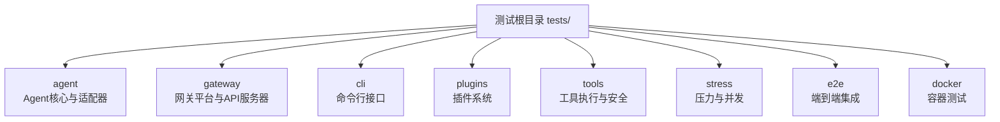
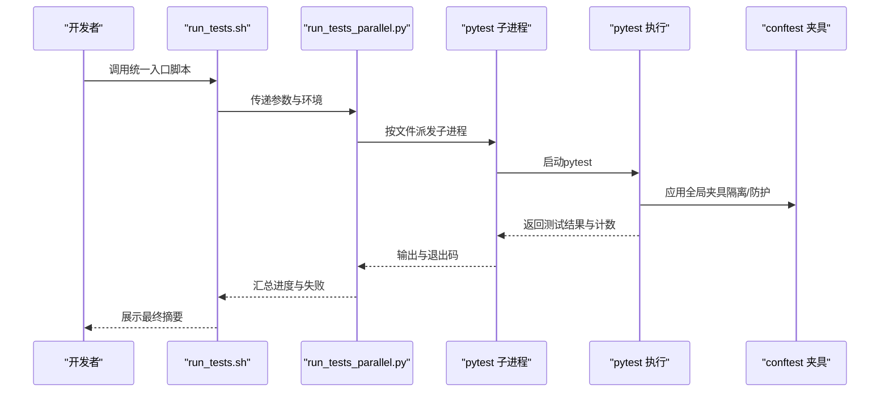
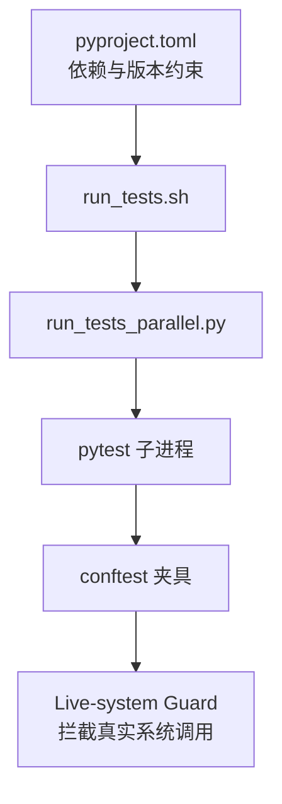

# 测试分类与覆盖

<cite>
**本文引用的文件**
- [tests/conftest.py](file://tests/conftest.py)
- [scripts/run_tests.sh](file://scripts/run_tests.sh)
- [scripts/run_tests_parallel.py](file://scripts/run_tests_parallel.py)
- [pyproject.toml](file://pyproject.toml)
- [tests/agent/test_anthropic_adapter.py](file://tests/agent/test_anthropic_adapter.py)
- [tests/gateway/test_api_server.py](file://tests/gateway/test_api_server.py)
- [tests/cli/test_main.py](file://tests/cli/test_main.py)
- [tests/plugins/test_plugin_utils.py](file://tests/plugins/test_plugin_utils.py)
- [tests/stress/test_stress.py](file://tests/stress/test_stress.py)
- [tests/e2e/test_e2e.py](file://tests/e2e/test_e2e.py)
- [tests/docker/test_docker.py](file://tests/docker/test_docker.py)
</cite>

## 目录
1. [引言](#引言)
2. [项目结构](#项目结构)
3. [核心组件](#核心组件)
4. [架构总览](#架构总览)
5. [详细组件分析](#详细组件分析)
6. [依赖分析](#依赖分析)
7. [性能考虑](#性能考虑)
8. [故障排查指南](#故障排查指南)
9. [结论](#结论)
10. [附录](#附录)

## 引言
本文件系统化梳理本项目的测试分类与覆盖策略，明确各领域测试（Agent测试、工具测试、网关测试、CLI测试、插件测试）的目标、范围与质量标准，并给出测试矩阵、覆盖率统计建议、压力与性能测试方法、以及回归测试与持续集成中的测试优先级排序。文档以仓库内现有测试脚本与运行器为依据，确保可落地、可复现。

## 项目结构
测试目录按“领域”划分，形成清晰的测试分类体系：
- tests/agent：Agent核心适配器与传输层单元测试
- tests/gateway：网关平台与API服务器适配器测试
- tests/cli：命令行入口与子命令行为测试
- tests/plugins：插件加载、注册与工具集成测试
- tests/tools：工具执行、结果处理与安全限制测试
- tests/stress：压力与并发场景测试
- tests/e2e：端到端集成测试（CI中独立作业）
- tests/docker：容器镜像构建与运行验证（CI中独立作业）

图表来源
- [scripts/run_tests_parallel.py:52-71](file://scripts/run_tests_parallel.py#L52-L71)

章节来源
- [scripts/run_tests_parallel.py:52-71](file://scripts/run_tests_parallel.py#L52-L71)

## 核心组件
- 隔离与环境保障：通过全局夹具统一清理凭据变量、隔离HERMES_HOME、设定确定性时区与语言、禁用AWS元数据服务、拦截真实系统调用，避免测试污染与误伤生产进程。
- 并行执行器：使用 per-file 子进程并行运行，每个文件在全新解释器中执行，消除跨文件模块级状态泄漏；支持超时、切片分片与进度输出。
- 运行器：提供统一入口脚本，确保本地与CI环境一致，支持工作线程数、发现路径、切片参数等配置。

章节来源
- [tests/conftest.py:1-80](file://tests/conftest.py#L1-L80)
- [tests/conftest.py:327-401](file://tests/conftest.py#L327-L401)
- [tests/conftest.py:496-544](file://tests/conftest.py#L496-L544)
- [scripts/run_tests.sh:1-80](file://scripts/run_tests.sh#L1-L80)
- [scripts/run_tests_parallel.py:1-80](file://scripts/run_tests_parallel.py#L1-L80)

## 架构总览
下图展示测试运行的整体流程：统一入口脚本启动并行执行器，后者按文件粒度派发子进程，每个子进程在隔离环境中运行pytest，最终汇总统计与失败详情。

图表来源
- [scripts/run_tests.sh:61-80](file://scripts/run_tests.sh#L61-L80)
- [scripts/run_tests_parallel.py:246-341](file://scripts/run_tests_parallel.py#L246-L341)
- [tests/conftest.py:327-401](file://tests/conftest.py#L327-L401)

## 详细组件分析

### Agent测试
- 测试目标
  - 验证模型适配器（如Anthropic）的认证逻辑、客户端构建、消息与工具转换、Beta能力开关等。
  - 确保传输层与外部SDK交互正确，兼容不同后端（原生、Azure、Bedrock、第三方代理）。
- 覆盖范围
  - 认证类型识别与客户端初始化
  - 自定义base_url与路径处理
  - Azure/第三方端点的特殊头与查询参数
  - 工具定义与消息格式转换
- 质量标准
  - 单元测试通过率≥95%
  - 关键分支与异常路径覆盖
  - 与外部SDK版本锁定一致，避免行为漂移
- 示例定位
  - [tests/agent/test_anthropic_adapter.py:1-200](file://tests/agent/test_anthropic_adapter.py#L1-L200)

章节来源
- [tests/agent/test_anthropic_adapter.py:1-200](file://tests/agent/test_anthropic_adapter.py#L1-L200)

### 工具测试
- 测试目标
  - 工具执行的安全边界、输出截断、错误归一化与存储策略。
  - 文件操作、终端命令、浏览器控制等高风险工具的沙箱与权限校验。
- 覆盖范围
  - 命令执行超时与中断
  - 输出大小与类型限制
  - 结果缓存与去重
  - 外部进程与TTY交互
- 质量标准
  - 安全基线：禁止直接system/exec调用未授权命令
  - 可观测性：关键步骤日志与指标
- 示例定位
  - [tests/tools/test_code_execution.py](file://tests/tools/test_code_execution.py)
  - [tests/tools/test_code_execution_modes.py](file://tests/tools/test_code_execution_modes.py)

章节来源
- [tests/tools/test_code_execution.py](file://tests/tools/test_code_execution.py)
- [tests/tools/test_code_execution_modes.py](file://tests/tools/test_code_execution_modes.py)

### 网关测试
- 测试目标
  - OpenAI兼容API服务器的请求解析、响应格式、鉴权、健康检查与系统提示提取。
  - 幂等缓存、响应存储与会话映射的LRU淘汰与一致性。
- 覆盖范围
  - Chat Completions与Responses API端点
  - CORS与安全头中间件
  - 数据库文件权限（仅所有者可读写）
  - 并发幂等任务只执行一次
- 质量标准
  - 接口契约稳定，错误码与消息规范化
  - 存储层一致性与原子性
- 示例定位
  - [tests/gateway/test_api_server.py:1-200](file://tests/gateway/test_api_server.py#L1-L200)

章节来源
- [tests/gateway/test_api_server.py:1-200](file://tests/gateway/test_api_server.py#L1-L200)

### CLI测试
- 测试目标
  - 主入口与子命令的行为、参数解析、输出格式与错误处理。
  - 会话管理、配置加载与环境变量注入。
- 覆盖范围
  - 入口脚本与主命令
  - 子命令（如auth、gateway、tools、plugins等）
  - 交互式与非交互式模式
- 质量标准
  - 命令可用性与稳定性
  - 与外部服务（如平台、工具）的集成点可靠
- 示例定位
  - [tests/cli/test_main.py](file://tests/cli/test_main.py)

章节来源
- [tests/cli/test_main.py](file://tests/cli/test_main.py)

### 插件测试
- 测试目标
  - 插件发现、注册、生命周期与工具注入。
  - 插件间隔离与冲突处理。
- 覆盖范围
  - 插件清单解析与校验
  - 工具定义与执行链路
  - 插件工具与内置工具的边界
- 质量标准
  - 插件加载幂等且可预测
  - 工具定义与执行结果可审计
- 示例定位
  - [tests/plugins/test_plugin_utils.py](file://tests/plugins/test_plugin_utils.py)

章节来源
- [tests/plugins/test_plugin_utils.py](file://tests/plugins/test_plugin_utils.py)

### 压力测试与性能测试
- 实施方法
  - 使用stress目录下的测试套件模拟高并发、长时运行与资源竞争场景。
  - 通过并行执行器的切片与超时参数评估系统瓶颈。
- 关注指标
  - 响应时间分布、吞吐量、内存占用、CPU使用率
  - 错误率与超时比例
- 示例定位
  - [tests/stress/test_stress.py](file://tests/stress/test_stress.py)

章节来源
- [tests/stress/test_stress.py](file://tests/stress/test_stress.py)
- [scripts/run_tests_parallel.py:619-629](file://scripts/run_tests_parallel.py#L619-L629)

### 端到端测试与容器测试
- e2e测试
  - 在CI中独立作业运行，覆盖真实环境下的完整业务流。
- 容器测试
  - 验证镜像构建、运行时依赖与服务暴露。
- 示例定位
  - [tests/e2e/test_e2e.py](file://tests/e2e/test_e2e.py)
  - [tests/docker/test_docker.py](file://tests/docker/test_docker.py)

章节来源
- [scripts/run_tests_parallel.py:52-71](file://scripts/run_tests_parallel.py#L52-L71)
- [tests/e2e/test_e2e.py](file://tests/e2e/test_e2e.py)
- [tests/docker/test_docker.py](file://tests/docker/test_docker.py)

## 依赖分析
- 测试运行器依赖
  - Python版本与依赖由项目配置统一约束，确保测试环境与生产一致。
- 测试隔离依赖
  - conftest中的全局夹具依赖pytest生态与系统库（如psutil），用于进程树清理与信号拦截。
- 并行执行依赖
  - ThreadPoolExecutor与subprocess结合，支持跨平台进程组管理与树杀。

图表来源
- [pyproject.toml:20-133](file://pyproject.toml#L20-L133)
- [scripts/run_tests.sh:1-80](file://scripts/run_tests.sh#L1-L80)
- [scripts/run_tests_parallel.py:1-80](file://scripts/run_tests_parallel.py#L1-L80)
- [tests/conftest.py:496-544](file://tests/conftest.py#L496-L544)

章节来源
- [pyproject.toml:20-133](file://pyproject.toml#L20-L133)
- [scripts/run_tests_parallel.py:188-244](file://scripts/run_tests_parallel.py#L188-L244)
- [tests/conftest.py:538-624](file://tests/conftest.py#L538-L624)

## 性能考虑
- 并行策略
  - per-file子进程并行，避免共享状态泄漏；默认工作线程数可调，建议根据CPU核数与磁盘I/O进行权衡。
- 超时与切片
  - 支持单文件超时与基于时长缓存的切片分发，平衡CI作业时长。
- I/O与存储
  - 网关响应存储采用SQLite WAL与严格权限，减少锁争用与安全风险。

章节来源
- [scripts/run_tests_parallel.py:619-629](file://scripts/run_tests_parallel.py#L619-L629)
- [scripts/run_tests_parallel.py:530-594](file://scripts/run_tests_parallel.py#L530-L594)
- [tests/gateway/test_api_server.py:132-162](file://tests/gateway/test_api_server.py#L132-L162)

## 故障排查指南
- 常见问题
  - 凭据泄漏导致的断言不稳定：确认全局夹具已清理所有匹配模式的环境变量。
  - HERMES_HOME指向真实目录：确保隔离夹具生效或显式设置临时目录。
  - live-system guard触发：若确需真实信号/子进程行为，请使用标记绕过，但仅限必要场景。
- 排查步骤
  - 使用统一入口脚本运行，确保环境变量与工作目录一致。
  - 查看失败文件的内联失败摘要与重现命令。
  - 对慢文件启用切片分发，定位瓶颈文件。

章节来源
- [tests/conftest.py:327-401](file://tests/conftest.py#L327-L401)
- [tests/conftest.py:538-624](file://tests/conftest.py#L538-L624)
- [scripts/run_tests_parallel.py:464-493](file://scripts/run_tests_parallel.py#L464-L493)

## 结论
本项目的测试体系以“隔离、确定性、可并行”为核心原则，通过统一运行器与全局夹具保障测试稳定性，按领域划分测试套件并覆盖关键功能面。建议在CI中保留独立的e2e与docker作业，结合stress测试与切片分发，持续优化测试矩阵与覆盖率，确保回归质量与交付效率。

## 附录

### 测试矩阵与覆盖率统计（建议）
- 测试矩阵维度
  - 平台：Linux/macOS/Windows
  - Python版本：3.11–3.13（与项目要求一致）
  - 包装器：per-file并行（默认）、切片分发
- 覆盖率统计建议
  - 行覆盖率：目标≥85%，关键路径≥95%
  - 分支覆盖率：目标≥80%，关键条件分支≥90%
  - 工具与网关：端点与错误路径全覆盖
- 回归优先级
  - 高优先：Agent适配器、网关API、CLI主流程、工具安全边界
  - 中优先：插件系统、传输层、平台适配
  - 低优先：边缘场景与历史遗留特性

章节来源
- [pyproject.toml:20-21](file://pyproject.toml#L20-L21)
- [scripts/run_tests_parallel.py:601-617](file://scripts/run_tests_parallel.py#L601-L617)