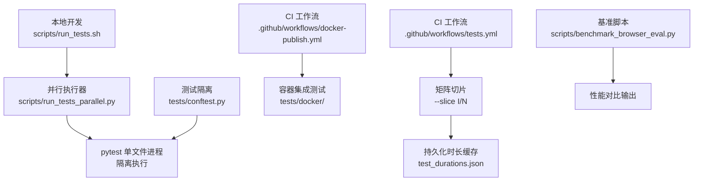
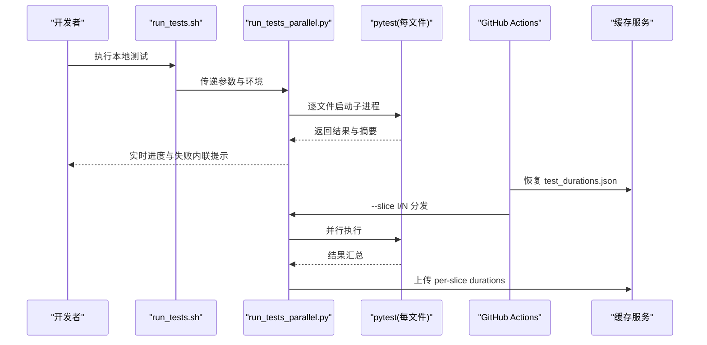
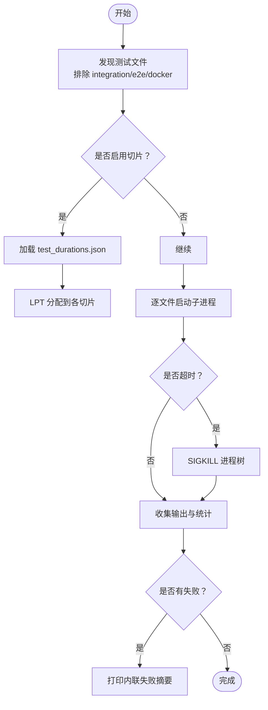
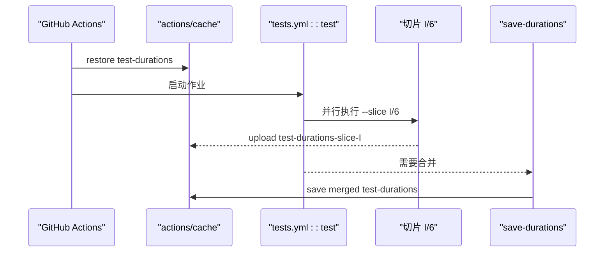
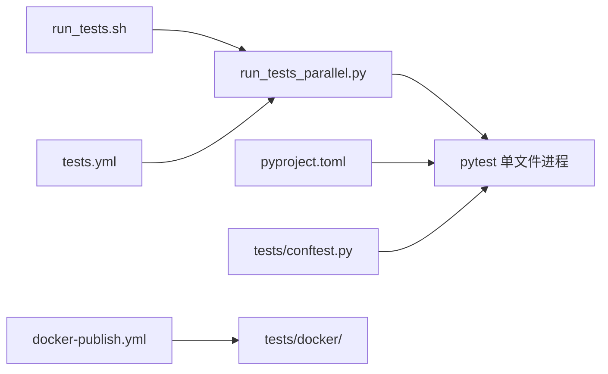

# 测试执行与CI/CD

<cite>
**本文档引用的文件**
- [scripts/run_tests.sh](file://scripts/run_tests.sh)
- [scripts/run_tests_parallel.py](file://scripts/run_tests_parallel.py)
- [pyproject.toml](file://pyproject.toml)
- [.github/workflows/tests.yml](file://.github/workflows/tests.yml)
- [.github/workflows/docker-publish.yml](file://.github/workflows/docker-publish.yml)
- [tests/conftest.py](file://tests/conftest.py)
- [scripts/benchmark_browser_eval.py](file://scripts/benchmark_browser_eval.py)
</cite>

## 目录
1. [简介](#简介)
2. [项目结构](#项目结构)
3. [核心组件](#核心组件)
4. [架构总览](#架构总览)
5. [详细组件分析](#详细组件分析)
6. [依赖分析](#依赖分析)
7. [性能考虑](#性能考虑)
8. [故障排查指南](#故障排查指南)
9. [结论](#结论)
10. [附录](#附录)

## 简介
本文件系统化阐述本项目的测试执行与持续集成（CI/CD）实践，覆盖本地测试运行（单文件、批量、并行）、CI 工作流（矩阵切片、缓存、失败处理）、性能优化（缓存、增量切片、隔离）、测试报告与分析（覆盖率与基准），以及故障排查与日志分析技巧。目标是帮助开发者在本地快速定位问题，在 CI 中稳定高效地推进合并。

## 项目结构
围绕测试与 CI 的关键文件组织如下：
- 本地测试入口：scripts/run_tests.sh
- 并行测试执行器：scripts/run_tests_parallel.py
- 测试框架配置：pyproject.toml（pytest 配置）
- CI 工作流：.github/workflows/tests.yml、.github/workflows/docker-publish.yml
- 测试环境隔离：tests/conftest.py
- 性能基准脚本：scripts/benchmark_browser_eval.py

图表来源
- [scripts/run_tests.sh:1-80](file://scripts/run_tests.sh#L1-L80)
- [scripts/run_tests_parallel.py:1-863](file://scripts/run_tests_parallel.py#L1-L863)
- [.github/workflows/tests.yml:1-223](file://.github/workflows/tests.yml#L1-L223)
- [.github/workflows/docker-publish.yml:1-358](file://.github/workflows/docker-publish.yml#L1-L358)
- [tests/conftest.py:1-878](file://tests/conftest.py#L1-L878)
- [scripts/benchmark_browser_eval.py:1-139](file://scripts/benchmark_browser_eval.py#L1-L139)

章节来源
- [scripts/run_tests.sh:1-80](file://scripts/run_tests.sh#L1-L80)
- [scripts/run_tests_parallel.py:1-863](file://scripts/run_tests_parallel.py#L1-L863)
- [pyproject.toml:343-351](file://pyproject.toml#L343-L351)
- [.github/workflows/tests.yml:1-223](file://.github/workflows/tests.yml#L1-L223)
- [.github/workflows/docker-publish.yml:1-358](file://.github/workflows/docker-publish.yml#L1-L358)
- [tests/conftest.py:1-878](file://tests/conftest.py#L1-L878)
- [scripts/benchmark_browser_eval.py:1-139](file://scripts/benchmark_browser_eval.py#L1-L139)

## 核心组件
- 本地测试运行器：scripts/run_tests.sh
  - 统一入口，确保与 CI 行为一致（确定性环境变量、虚拟环境激活、插件注入等）
  - 通过 scripts/run_tests_parallel.py 实现“按文件并行”，避免共享状态泄漏
- 并行执行器：scripts/run_tests_parallel.py
  - 按文件发现与并行执行，支持切片分发、超时控制、进度与失败内联提示
  - 支持环境变量覆盖（HERMES_TEST_WORKERS、HERMES_TEST_PATHS、HERMES_TEST_SLICE 等）
- CI 工作流：tests.yml 与 docker-publish.yml
  - tests.yml：矩阵切片（6 份）+ 持久化时长缓存，平衡作业耗时
  - docker-publish.yml：构建镜像后在同作业中运行 docker 集成测试，避免重复构建
- 测试隔离：tests/conftest.py
  - 清理凭证与行为相关环境变量、隔离 HERMES_HOME、设定确定性时区与语言
  - 提供“活系统防护”钩子，阻断真实系统命令对开发机造成影响
- 基准脚本：scripts/benchmark_browser_eval.py
  - 对比浏览器评估路径（WebSocket 与子进程）的性能，辅助优化决策

章节来源
- [scripts/run_tests.sh:1-80](file://scripts/run_tests.sh#L1-L80)
- [scripts/run_tests_parallel.py:25-36](file://scripts/run_tests_parallel.py#L25-L36)
- [scripts/run_tests_parallel.py:596-640](file://scripts/run_tests_parallel.py#L596-L640)
- [.github/workflows/tests.yml:23-127](file://.github/workflows/tests.yml#L23-L127)
- [.github/workflows/docker-publish.yml:83-132](file://.github/workflows/docker-publish.yml#L83-L132)
- [tests/conftest.py:327-394](file://tests/conftest.py#L327-L394)
- [tests/conftest.py:528-800](file://tests/conftest.py#L528-L800)
- [scripts/benchmark_browser_eval.py:58-139](file://scripts/benchmark_browser_eval.py#L58-L139)

## 架构总览
下图展示从本地到 CI 的测试执行链路，强调隔离、并行与缓存：

图表来源
- [scripts/run_tests.sh:69-80](file://scripts/run_tests.sh#L69-L80)
- [scripts/run_tests_parallel.py:774-787](file://scripts/run_tests_parallel.py#L774-L787)
- [.github/workflows/tests.yml:35-127](file://.github/workflows/tests.yml#L35-L127)

## 详细组件分析

### 本地测试执行器（scripts/run_tests.sh）
- 功能要点
  - 定位仓库根目录与虚拟环境，确保使用正确的 Python 解释器
  - 设置确定性环境变量（TZ、LANG、PYTHONHASHSEED 等），清空敏感环境变量
  - 可选注入额外插件（如 live-guard 插件）以增强安全
  - 调用 scripts/run_tests_parallel.py 进行并行执行
- 使用方式
  - 全量：scripts/run_tests.sh
  - 限制并行度：scripts/run_tests.sh -j 4
  - 指定目录或文件：scripts/run_tests.sh tests/agent/ tests/acp/
  - 透传 pytest 参数：scripts/run_tests.sh tests/foo.py -- --tb=long

章节来源
- [scripts/run_tests.sh:16-27](file://scripts/run_tests.sh#L16-L27)
- [scripts/run_tests.sh:61-79](file://scripts/run_tests.sh#L61-L79)

### 并行测试执行器（scripts/run_tests_parallel.py）
- 发现与过滤
  - 默认在 tests/ 下递归发现 test_*.py；可显式指定路径或文件
  - 自动忽略 integration、e2e、docker 子树（除非显式包含）
- 并行策略
  - 每文件一个子进程，避免跨文件模块级状态泄漏
  - 支持 HERMES_TEST_WORKERS 覆盖并发数，默认为 CPU 数×2
- 切片与缓存
  - 支持 --slice I/N，基于 test_durations.json 的 LPT（最长处理时间优先）分配
  - 保存/加载时长缓存，CI 合并阶段汇总各切片缓存
- 超时与清理
  - 单文件超时可配置（HERMES_TEST_FILE_TIMEOUT），超时后递归 SIGKILL 子进程树
  - 输出解析统计（通过/失败/跳过/错误/xpass/xfail）
- 失败内联提示
  - 文件失败时打印尾部失败信息与可直接复制的重现实验命令

图表来源
- [scripts/run_tests_parallel.py:141-185](file://scripts/run_tests_parallel.py#L141-L185)
- [scripts/run_tests_parallel.py:530-594](file://scripts/run_tests_parallel.py#L530-L594)
- [scripts/run_tests_parallel.py:246-341](file://scripts/run_tests_parallel.py#L246-L341)
- [scripts/run_tests_parallel.py:464-493](file://scripts/run_tests_parallel.py#L464-L493)

章节来源
- [scripts/run_tests_parallel.py:52-71](file://scripts/run_tests_parallel.py#L52-L71)
- [scripts/run_tests_parallel.py:596-640](file://scripts/run_tests_parallel.py#L596-L640)
- [scripts/run_tests_parallel.py:694-711](file://scripts/run_tests_parallel.py#L694-L711)
- [scripts/run_tests_parallel.py:794-800](file://scripts/run_tests_parallel.py#L794-L800)

### CI 工作流（tests.yml）
- 触发条件
  - 推送主分支且非文档变更；拉取请求始终运行以保证检查状态
- 并发控制
  - 同一 PR/分支仅保留最新一次运行，其余取消
- 任务矩阵
  - 6 个切片并行执行，每个切片运行 scripts/run_tests_parallel.py --slice I/6
- 缓存与合并
  - 恢复 test_durations.json，上传各切片 durations，合并步骤汇总为单一缓存
- 额外测试
  - e2e 专用作业，独立运行端到端测试套件

图表来源
- [.github/workflows/tests.yml:18-22](file://.github/workflows/tests.yml#L18-L22)
- [.github/workflows/tests.yml:27-30](file://.github/workflows/tests.yml#L27-L30)
- [.github/workflows/tests.yml:128-160](file://.github/workflows/tests.yml#L128-L160)

章节来源
- [.github/workflows/tests.yml:3-14](file://.github/workflows/tests.yml#L3-L14)
- [.github/workflows/tests.yml:23-127](file://.github/workflows/tests.yml#L23-L127)
- [.github/workflows/tests.yml:161-223](file://.github/workflows/tests.yml#L161-L223)

### CI 工作流（docker-publish.yml）
- 目标
  - 构建镜像并在同一作业中运行 docker 集成测试，避免重复构建
- 关键点
  - 使用 HERMES_TEST_IMAGE 指向已加载的镜像，跳过重建
  - 仅安装测试所需依赖（dev），不引入完整可选依赖

章节来源
- [.github/workflows/docker-publish.yml:83-132](file://.github/workflows/docker-publish.yml#L83-L132)

### 测试隔离与安全（tests/conftest.py）
- 环境隔离
  - 清理所有以“_API_KEY”、“_TOKEN”等结尾的环境变量
  - 清理大量 HERMES_* 行为相关变量，防止测试间语义漂移
  - 将 HERMES_HOME 指向临时目录，避免读写真实用户数据
  - 设定 TZ=UTC、LANG=C.UTF-8、PYTHONHASHSEED=0
- 活系统防护
  - 拦截 os.kill/os.killpg、systemctl 变更类调用、进程杀手命令
  - 对 subprocess.* 的命令字符串进行全行扫描，阻断对 hermes/gateway 的误操作
  - 提供标记 @pytest.mark.live_system_guard_bypass 用于确需真实行为的测试

章节来源
- [tests/conftest.py:51-160](file://tests/conftest.py#L51-L160)
- [tests/conftest.py:327-394](file://tests/conftest.py#L327-L394)
- [tests/conftest.py:528-800](file://tests/conftest.py#L528-L800)

### 基准测试（scripts/benchmark_browser_eval.py）
- 目的
  - 对比浏览器评估路径：WebSocket（supervisor）与子进程（agent-browser）
- 方法
  - 启动相同 Chrome 实例，循环执行相同表达式，统计均值/中位数/极值
  - 输出速度提升倍数，便于优化与回归监控

章节来源
- [scripts/benchmark_browser_eval.py:58-139](file://scripts/benchmark_browser_eval.py#L58-L139)

## 依赖分析
- 本地与 CI 的一致性
  - run_tests.sh 强制确定性环境变量与虚拟环境，确保本地与 CI 行为一致
  - run_tests_parallel.py 在 CI 中通过 --slice I/N 与缓存协同，实现均衡分布
- 测试框架配置
  - pyproject.toml 中的 pytest.ini_options 指定默认测试目录与标记，屏蔽 integration 测试于常规 CI
- 容器集成测试
  - docker-publish.yml 与 tests/docker/ 协作，利用已加载镜像直接运行集成测试

图表来源
- [scripts/run_tests.sh:69-80](file://scripts/run_tests.sh#L69-L80)
- [scripts/run_tests_parallel.py:774-787](file://scripts/run_tests_parallel.py#L774-L787)
- [pyproject.toml:343-351](file://pyproject.toml#L343-L351)
- [tests/conftest.py:327-394](file://tests/conftest.py#L327-L394)
- [.github/workflows/tests.yml:88-127](file://.github/workflows/tests.yml#L88-L127)
- [.github/workflows/docker-publish.yml:120-132](file://.github/workflows/docker-publish.yml#L120-L132)

章节来源
- [scripts/run_tests.sh:61-79](file://scripts/run_tests.sh#L61-L79)
- [scripts/run_tests_parallel.py:694-711](file://scripts/run_tests_parallel.py#L694-L711)
- [pyproject.toml:343-351](file://pyproject.toml#L343-L351)
- [.github/workflows/tests.yml:88-127](file://.github/workflows/tests.yml#L88-L127)
- [.github/workflows/docker-publish.yml:120-132](file://.github/workflows/docker-publish.yml#L120-L132)

## 性能考虑
- 缓存机制
  - CI 使用 actions/cache 恢复/保存 test_durations.json，加速后续矩阵切片分配
  - uv 缓存持久化（setup-uv）减少依赖下载与构建时间
- 增量测试与切片
  - 通过 --slice I/N 与 LPT 算法，将慢文件均匀分配至各切片，降低最长作业耗时
  - 本地运行时可设置 HERMES_TEST_WORKERS 控制并发，HERMES_TEST_FILE_TIMEOUT 控制单文件超时
- 隔离与稳定性
  - 每文件子进程隔离，避免跨文件状态泄漏导致的不稳定
  - tests/conftest.py 的活系统防护减少意外副作用

章节来源
- [.github/workflows/tests.yml:35-44](file://.github/workflows/tests.yml#L35-L44)
- [.github/workflows/tests.yml:121-127](file://.github/workflows/tests.yml#L121-L127)
- [.github/workflows/tests.yml:60-86](file://.github/workflows/tests.yml#L60-L86)
- [scripts/run_tests_parallel.py:530-594](file://scripts/run_tests_parallel.py#L530-L594)
- [scripts/run_tests_parallel.py:618-629](file://scripts/run_tests_parallel.py#L618-L629)
- [tests/conftest.py:528-800](file://tests/conftest.py#L528-L800)

## 故障排查指南
- 本地失败快速定位
  - run_tests_parallel.py 在文件失败时打印内联失败摘要与可复制的重现实验命令，便于快速回放
  - 使用 -- --tb=long 或 -v 查看详细堆栈与输出
- 环境变量泄漏
  - 确认 run_tests.sh 是否正确设置了 TZ、LANG、PYTHONHASHSEED 等
  - 检查 tests/conftest.py 是否清理了以 _API_KEY/_TOKEN 等结尾的变量
- CI 切片不平衡
  - 首次运行可能因缺少 test_durations.json 导致按数量平均分配；等待一次完整运行后缓存生效
  - 如需强制重新切片，删除 test_durations.json 后再次运行
- 容器集成测试
  - docker-publish.yml 通过 HERMES_TEST_IMAGE 指向已加载镜像，若失败先确认镜像加载成功与权限配置

章节来源
- [scripts/run_tests_parallel.py:464-493](file://scripts/run_tests_parallel.py#L464-L493)
- [scripts/run_tests.sh:69-79](file://scripts/run_tests.sh#L69-L79)
- [tests/conftest.py:51-160](file://tests/conftest.py#L51-L160)
- [.github/workflows/tests.yml:121-127](file://.github/workflows/tests.yml#L121-L127)
- [.github/workflows/docker-publish.yml:120-132](file://.github/workflows/docker-publish.yml#L120-L132)

## 结论
本项目通过统一的本地测试入口、严格的每文件隔离并行执行器、CI 矩阵切片与缓存、以及完善的测试隔离与安全防护，实现了稳定高效的测试执行与持续集成。配合基准脚本与失败内联提示，开发者可在本地快速定位问题，CI 中实现均衡与可预测的执行时间。

## 附录
- 常用本地命令示例
  - 全量并行：scripts/run_tests.sh
  - 限制并发：scripts/run_tests.sh -j 4
  - 指定目录：scripts/run_tests.sh tests/agent/ tests/acp/
  - 透传参数：scripts/run_tests.sh tests/foo.py -- --tb=long -v
- CI 相关
  - 矩阵切片：--slice I/N
  - 缓存文件：test_durations.json
  - 屏蔽集成测试：pytest 默认标记 -m "not integration"