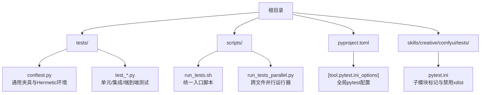
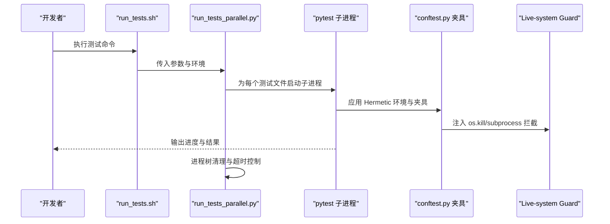
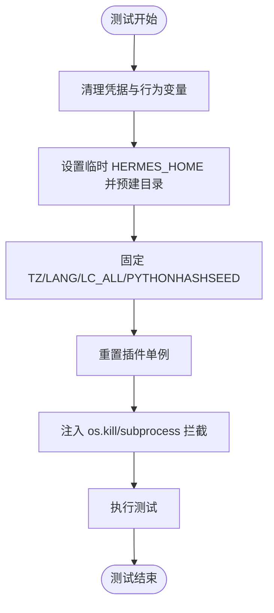
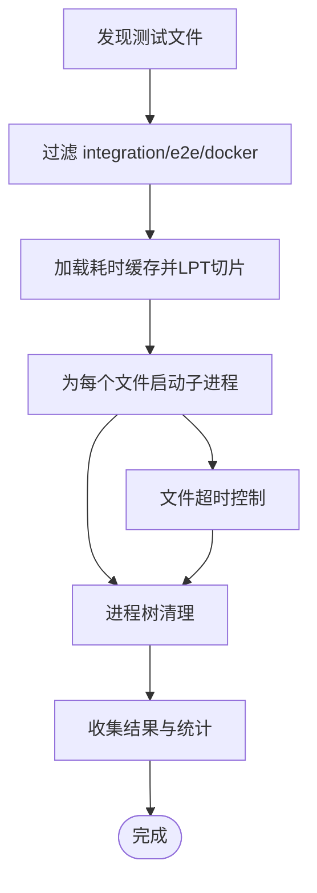
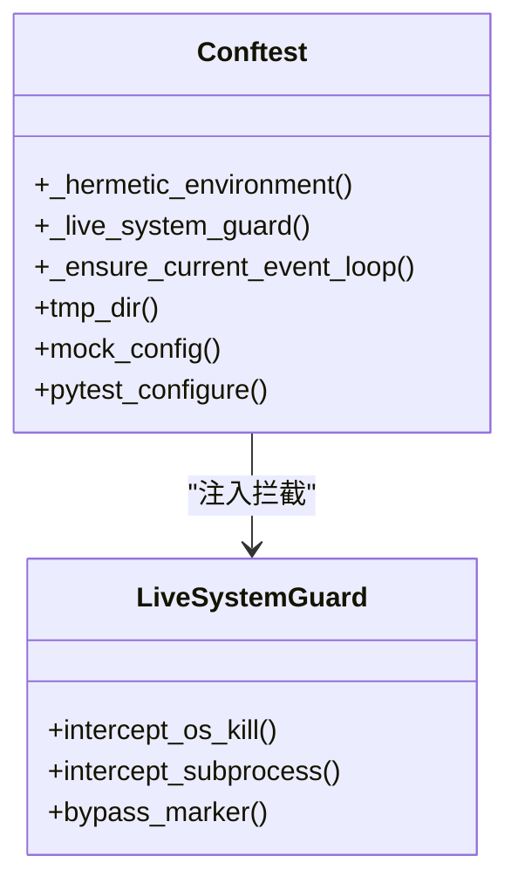
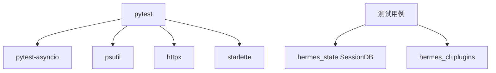

# 测试架构设计

<cite>
**本文档引用的文件**
- [tests/conftest.py](file://tests/conftest.py)
- [scripts/run_tests.sh](file://scripts/run_tests.sh)
- [scripts/run_tests_parallel.py](file://scripts/run_tests_parallel.py)
- [pyproject.toml](file://pyproject.toml)
- [tests/test_run_tests_parallel.py](file://tests/test_run_tests_parallel.py)
- [tests/test_hermes_state.py](file://tests/test_hermes_state.py)
- [tests/test_account_usage.py](file://tests/test_account_usage.py)
- [skills/creative/comfyui/tests/pytest.ini](file://skills/creative/comfyui/tests/pytest.ini)
</cite>

## 目录
1. [引言](#引言)
2. [项目结构](#项目结构)
3. [核心组件](#核心组件)
4. [架构总览](#架构总览)
5. [详细组件分析](#详细组件分析)
6. [依赖分析](#依赖分析)
7. [性能考虑](#性能考虑)
8. [故障排除指南](#故障排除指南)
9. [结论](#结论)
10. [附录](#附录)

## 引言
本文件系统性阐述本项目的测试架构设计，重点覆盖以下方面：
- 测试分层与组织：单元测试、集成测试、端到端测试的职责边界与目录布局
- Hermetic 环境与隔离：凭据清理、会话隔离、时区与语言环境、进程树清理
- 测试工具链：pytest 配置、测试夹具（conftest）的作用与生命周期
- 并行测试执行：实现原理、性能优化与稳定性保障
- 测试环境搭建：依赖安装、环境变量配置、测试数据准备

## 项目结构
测试相关文件主要分布在以下位置：
- 根级测试入口与通用夹具：tests/conftest.py
- 跨文件并行运行器：scripts/run_tests_parallel.py 及其启动脚本 scripts/run_tests.sh
- 全局 pytest 配置：pyproject.toml 中的 [tool.pytest.ini_options]
- 子模块测试配置：如 skills/creative/comfyui/tests/pytest.ini
- 示例测试用例：tests/test_hermes_state.py、tests/test_account_usage.py
- 运行器隔离验证：tests/test_run_tests_parallel.py

**图表来源**
- [tests/conftest.py:1-800](file://tests/conftest.py#L1-L800)
- [scripts/run_tests.sh:1-80](file://scripts/run_tests.sh#L1-L80)
- [scripts/run_tests_parallel.py:1-800](file://scripts/run_tests_parallel.py#L1-L800)
- [pyproject.toml:343-351](file://pyproject.toml#L343-L351)
- [skills/creative/comfyui/tests/pytest.ini:1-6](file://skills/creative/comfyui/tests/pytest.ini#L1-L6)

**章节来源**
- [tests/conftest.py:1-800](file://tests/conftest.py#L1-L800)
- [scripts/run_tests.sh:1-80](file://scripts/run_tests.sh#L1-L80)
- [scripts/run_tests_parallel.py:1-800](file://scripts/run_tests_parallel.py#L1-L800)
- [pyproject.toml:343-351](file://pyproject.toml#L343-L351)
- [skills/creative/comfyui/tests/pytest.ini:1-6](file://skills/creative/comfyui/tests/pytest.ini#L1-L6)

## 核心组件
- Hermetic 环境夹具（tests/conftest.py）
  - 凭据环境变量清理：按后缀与显式名称集合过滤，确保本地与CI行为一致
  - 会话隔离：将 HERMES_HOME 指向每个测试的临时目录，避免对真实 ~/.hermes 的读写
  - 确定性运行：固定 TZ=UTC、LANG=C.UTF-8、PYTHONHASHSEED=0
  - 插件单例重置：清空插件管理器缓存，避免跨测试泄漏
  - 生态系统保护：拦截 os.kill、subprocess.* 等可能影响宿主系统的调用
- 统一测试运行器（scripts/run_tests.sh）
  - 启动虚拟环境、设置确定性环境变量
  - 通过 run_tests_parallel.py 实现跨文件并行，避免共享状态泄漏
- 跨文件并行运行器（scripts/run_tests_parallel.py）
  - 基于文件粒度的子进程隔离，每文件独立 Python 解释器
  - 进程树清理：使用进程组或 taskkill 清理孤儿进程
  - 文件超时与切片均衡：基于历史耗时进行 LPT 分配
- 全局 pytest 配置（pyproject.toml）
  - 默认排除集成测试（-m 'not integration'），加速常规开发
  - 定义测试路径与自定义标记
- 子模块测试配置（skills/creative/comfyui/tests/pytest.ini）
  - 禁用 xdist，避免子模块内并行导致的资源竞争
  - 自定义标记用于区分云端集成测试

**章节来源**
- [tests/conftest.py:327-401](file://tests/conftest.py#L327-L401)
- [tests/conftest.py:528-536](file://tests/conftest.py#L528-L536)
- [tests/conftest.py:538-800](file://tests/conftest.py#L538-L800)
- [scripts/run_tests.sh:1-80](file://scripts/run_tests.sh#L1-L80)
- [scripts/run_tests_parallel.py:596-800](file://scripts/run_tests_parallel.py#L596-L800)
- [pyproject.toml:343-351](file://pyproject.toml#L343-L351)
- [skills/creative/comfyui/tests/pytest.ini:1-6](file://skills/creative/comfyui/tests/pytest.ini#L1-L6)

## 架构总览
下图展示了从命令行到具体测试执行的完整流程，以及关键的隔离与保护机制。

**图表来源**
- [scripts/run_tests.sh:61-80](file://scripts/run_tests.sh#L61-L80)
- [scripts/run_tests_parallel.py:246-341](file://scripts/run_tests_parallel.py#L246-L341)
- [tests/conftest.py:538-800](file://tests/conftest.py#L538-L800)

## 详细组件分析

### Hermetic 环境与隔离机制
- 凭据与行为变量清理
  - 使用模式匹配与显式集合清理以 *_API_KEY、*_TOKEN 等命名的凭据变量
  - 清理 HERMES_* 行为变量，防止测试语义漂移
- 会话隔离
  - 将 HERMES_HOME 指向 tmp_path 下的临时目录，并预建 sessions/cron/memories/skills 子目录
  - 显式不修改 HOME，避免破坏需要继承 HOME 的子进程
- 确定性运行
  - 固定时区与语言环境，确保日期时间与国际化相关的测试稳定
- 插件单例重置
  - 重置 hermes_cli.plugins._plugin_manager，避免跨测试缓存污染
- 生态系统保护
  - 拦截 os.kill/os.killpg 与 subprocess.* 关键调用，阻止对宿主系统的误伤
  - 对 systemctl 与进程杀手命令进行字符串匹配拦截

**图表来源**
- [tests/conftest.py:327-401](file://tests/conftest.py#L327-L401)
- [tests/conftest.py:538-800](file://tests/conftest.py#L538-L800)

**章节来源**
- [tests/conftest.py:327-401](file://tests/conftest.py#L327-L401)
- [tests/conftest.py:538-800](file://tests/conftest.py#L538-L800)

### 跨文件并行运行器
- 设计目标
  - 以“文件”为单位的子进程隔离，避免模块级状态泄漏
  - 通过进程组（POSIX）或 taskkill（Windows）清理测试衍生的孤儿进程
- 关键特性
  - 文件发现与过滤：跳过 integration/e2e/docker 等外部依赖目录（除非显式指定）
  - 进程树清理：在超时或异常退出时，使用进程组或 taskkill 清理整个进程树
  - 超时控制：单文件超时可配置，默认约 140 秒，避免卡死影响整体流水线
  - 切片均衡：基于历史耗时的 LPT（最长处理时间优先）算法分配文件，平衡 CI 作业负载
- 性能优化
  - 采用 ThreadPoolExecutor 控制并发度，支持 HERMES_TEST_WORKERS 覆盖
  - 支持 HERMES_TEST_PATHS 覆盖默认发现根目录
  - 支持 HERMES_TEST_FILE_TIMEOUT 覆盖默认文件超时

**图表来源**
- [scripts/run_tests_parallel.py:141-186](file://scripts/run_tests_parallel.py#L141-L186)
- [scripts/run_tests_parallel.py:530-594](file://scripts/run_tests_parallel.py#L530-L594)
- [scripts/run_tests_parallel.py:246-341](file://scripts/run_tests_parallel.py#L246-L341)

**章节来源**
- [scripts/run_tests_parallel.py:52-81](file://scripts/run_tests_parallel.py#L52-L81)
- [scripts/run_tests_parallel.py:596-800](file://scripts/run_tests_parallel.py#L596-L800)

### 测试夹具（conftest）与生命周期
- 自动夹具
  - _hermetic_environment：应用上述 Hermetic 环境与隔离策略
  - _live_system_guard：注入 os.kill/subprocess 拦截，防止误伤宿主系统
  - _ensure_current_event_loop：为同步测试提供事件循环，避免与 pytest-asyncio 冲突
- 辅助夹具
  - tmp_dir：提供自动清理的临时目录
  - mock_config：提供最小化配置字典，便于单元测试
- 标记注册
  - 注册 live_system_guard_bypass 标记，允许极少数确需真实信号行为的测试豁免

**图表来源**
- [tests/conftest.py:327-401](file://tests/conftest.py#L327-L401)
- [tests/conftest.py:528-536](file://tests/conftest.py#L528-L536)
- [tests/conftest.py:538-800](file://tests/conftest.py#L538-L800)

**章节来源**
- [tests/conftest.py:327-401](file://tests/conftest.py#L327-L401)
- [tests/conftest.py:528-536](file://tests/conftest.py#L528-L536)
- [tests/conftest.py:538-800](file://tests/conftest.py#L538-L800)

### 测试工具链与配置
- 全局 pytest 配置（pyproject.toml）
  - testpaths = ["tests"]：默认发现根目录
  - addopts = "-m 'not integration'"：默认排除集成测试
  - markers：定义 integration 与 real_concurrent_gate 等标记
- 子模块配置（skills/creative/comfyui/tests/pytest.ini）
  - addopts = -p no:xdist：禁用 xdist，避免子模块内并行
  - markers：定义 cloud 标记，用于区分云端集成测试

**章节来源**
- [pyproject.toml:343-351](file://pyproject.toml#L343-L351)
- [skills/creative/comfyui/tests/pytest.ini:1-6](file://skills/creative/comfyui/tests/pytest.ini#L1-L6)

### 示例测试用例分析
- hermes_state 单元测试
  - 使用 tmp_path 提供临时数据库文件，测试 SessionDB 的 CRUD、FTS5 回退、压缩场景等
  - 通过自定义 sqlite3.Connection/Cursor 模拟无 FTS5 的环境，验证兼容性
- 账户用量单元测试
  - 使用 monkeypatch 设置凭证解析与 httpx.Client 返回值，验证不同提供商的限额与配额展示逻辑

**章节来源**
- [tests/test_hermes_state.py:1-200](file://tests/test_hermes_state.py#L1-L200)
- [tests/test_account_usage.py:1-200](file://tests/test_account_usage.py#L1-L200)

## 依赖分析
- 外部依赖
  - pytest、pytest-asyncio：测试框架与异步支持
  - psutil：进程树遍历与存活探测，用于 live-system guard
  - httpx、starlette：网络与服务器测试支撑
- 内部依赖
  - hermes_cli.plugins：插件管理器单例重置
  - hermes_state.SessionDB：数据库测试依赖

**图表来源**
- [pyproject.toml:152](file://pyproject.toml#L152)
- [tests/conftest.py:573-579](file://tests/conftest.py#L573-L579)
- [tests/test_hermes_state.py:1-200](file://tests/test_hermes_state.py#L1-L200)

**章节来源**
- [pyproject.toml:152](file://pyproject.toml#L152)
- [tests/conftest.py:573-579](file://tests/conftest.py#L573-L579)
- [tests/test_hermes_state.py:1-200](file://tests/test_hermes_state.py#L1-L200)

## 性能考虑
- 并发与隔离权衡
  - 采用“文件级子进程隔离”替代 xdist 工作器持久化，避免跨文件模块级状态泄漏
  - 通过 HERMES_TEST_WORKERS 控制并发度，结合 LPT 切片均衡 CI 作业
- 启动与发现优化
  - 使用 --co 一次性统计各文件测试数，减少重复开销
  - 仅在必要时扫描 integration/e2e/docker 目录，避免不必要的发现成本
- 资源回收
  - 进程树清理确保长时间运行的服务器（如 uvicorn）不会成为僵尸进程
  - 文件超时与“进程树 SIGKILL”保证极端情况下仍能快速收敛

[本节为通用指导，无需特定文件分析]

## 故障排除指南
- 进程树泄漏
  - 现象：测试结束后仍有子进程常驻
  - 排查：确认 run_tests_parallel.py 是否正确捕获并清理进程组或使用 taskkill
  - 验证：参考 tests/test_run_tests_parallel.py 的隔离探针测试
- live-system guard 触发
  - 现象：os.kill 或 subprocess.* 调用抛出 RuntimeError
  - 排查：检查是否遗漏了对 find_gateway_pids/os.kill 的模拟
  - 处理：为确需真实信号行为的测试添加 @pytest.mark.live_system_guard_bypass
- 时区/语言差异导致的不稳定
  - 现象：日期时间或国际化相关测试在本地与 CI 表现不一致
  - 处理：确保通过 Hermetic 环境夹具固定 TZ/LANG/LC_ALL/PYTHONHASHSEED
- 插件缓存污染
  - 现象：跨测试出现插件注册异常
  - 处理：确认已通过 conftest 重置 hermes_cli.plugins._plugin_manager

**章节来源**
- [tests/test_run_tests_parallel.py:1-188](file://tests/test_run_tests_parallel.py#L1-L188)
- [tests/conftest.py:538-800](file://tests/conftest.py#L538-L800)

## 结论
本项目的测试架构以“文件级子进程隔离”为核心，配合 Hermetic 环境与 live-system guard，实现了高一致性与高安全性的测试执行体系。通过统一的并行运行器与合理的超时/切片策略，既保证了 CI 的稳定性，也兼顾了本地开发的效率。建议在新增测试时遵循现有夹具与配置约定，避免引入新的跨文件状态泄漏点。

[本节为总结性内容，无需特定文件分析]

## 附录

### 测试环境搭建指南
- 依赖安装
  - 使用 pyproject.toml 中的 dev 依赖安装 pytest、pytest-asyncio 等工具
- 环境变量配置
  - 使用 scripts/run_tests.sh 作为统一入口，自动设置 TZ=UTC、LANG=C.UTF-8、PYTHONHASHSEED=0
  - 如需自定义工作器数量，设置 HERMES_TEST_WORKERS；如需自定义发现根目录，设置 HERMES_TEST_PATHS
- 测试数据准备
  - 使用 tmp_path/ tmp_dir 夹具提供临时目录与数据库文件，避免污染真实环境
  - 对需要网络访问的云端测试，按子模块配置添加相应标记并在本地设置对应密钥

**章节来源**
- [pyproject.toml:152](file://pyproject.toml#L152)
- [scripts/run_tests.sh:61-80](file://scripts/run_tests.sh#L61-L80)
- [scripts/run_tests_parallel.py:605-629](file://scripts/run_tests_parallel.py#L605-L629)
- [skills/creative/comfyui/tests/pytest.ini:1-6](file://skills/creative/comfyui/tests/pytest.ini#L1-L6)