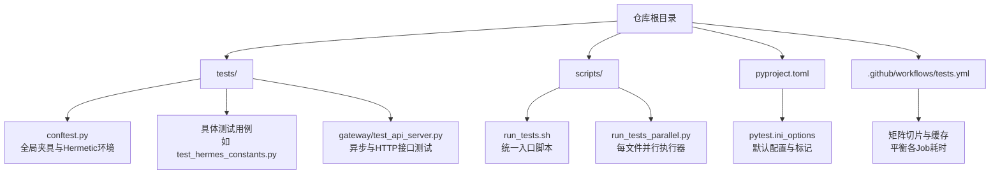
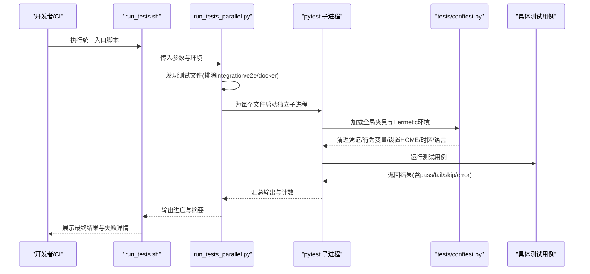
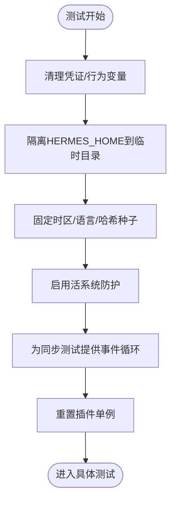
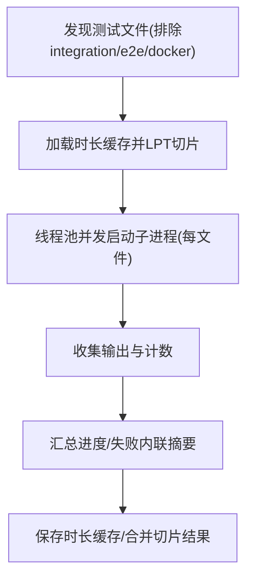
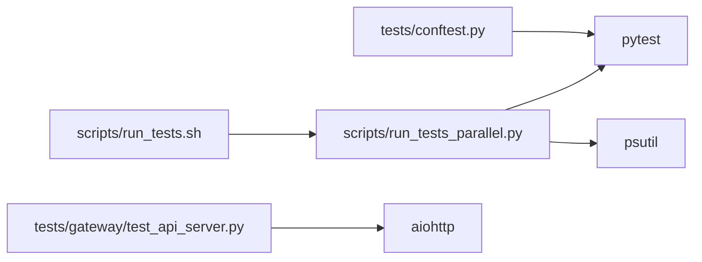

# 测试策略与实践

<cite>
**本文引用的文件**
- [tests/conftest.py](file://tests/conftest.py)
- [scripts/run_tests.sh](file://scripts/run_tests.sh)
- [scripts/run_tests_parallel.py](file://scripts/run_tests_parallel.py)
- [pyproject.toml](file://pyproject.toml)
- [.github/workflows/tests.yml](file://.github/workflows/tests.yml)
- [tests/test_hermes_constants.py](file://tests/test_hermes_constants.py)
- [tests/test_run_tests_parallel.py](file://tests/test_run_tests_parallel.py)
- [tests/gateway/test_api_server.py](file://tests/gateway/test_api_server.py)
</cite>

## 目录
1. [引言](#引言)
2. [项目结构](#项目结构)
3. [核心组件](#核心组件)
4. [架构总览](#架构总览)
5. [详细组件分析](#详细组件分析)
6. [依赖分析](#依赖分析)
7. [性能考虑](#性能考虑)
8. [故障排查指南](#故障排查指南)
9. [结论](#结论)
10. [附录](#附录)

## 引言
本文件系统化阐述本项目的测试策略与实践，覆盖测试架构与分类（单元测试、集成测试、端到端测试）、测试环境搭建与配置（Hermetic 环境、并行执行）、测试工具链（pytest 配置、测试夹具、测试数据管理）、测试编写指南（用例设计、Mock 使用、异步测试）、以及在持续集成中的执行流程与失败排查方法。目标是帮助开发者在本地与 CI 中获得一致、可重复且高效的测试体验。

## 项目结构
测试相关的核心位置与职责如下：
- tests：集中存放所有测试用例，按功能域分层组织（如 agent、gateway、hermes_cli 等），并包含通用夹具与辅助测试文件。
- tests/conftest.py：全局测试夹具与 Hermetic 环境保障，确保跨文件隔离、凭证与行为变量清理、确定性运行时等。
- scripts/run_tests.sh：统一测试入口脚本，负责虚拟环境激活、确定性环境变量注入、调用并行执行器。
- scripts/run_tests_parallel.py：每文件子进程并行执行器，替代 xdist 的轻量实现，保证每个测试文件在独立解释器中运行，避免模块级状态泄漏。
- pyproject.toml：pytest 默认配置（testpaths、markers、addopts）与开发依赖声明。
- .github/workflows/tests.yml：CI 测试流水线，包含矩阵切片与缓存优化，确保稳定与均衡的执行时间分配。
- tests/test_hermes_constants.py、tests/gateway/test_api_server.py、tests/test_run_tests_parallel.py：代表性测试样例，展示用例设计、Mock 使用、异步测试与隔离验证。

图示来源
- [tests/conftest.py:1-878](file://tests/conftest.py#L1-L878)
- [scripts/run_tests.sh:1-80](file://scripts/run_tests.sh#L1-L80)
- [scripts/run_tests_parallel.py:1-863](file://scripts/run_tests_parallel.py#L1-L863)
- [pyproject.toml:343-351](file://pyproject.toml#L343-L351)
- [.github/workflows/tests.yml:23-127](file://.github/workflows/tests.yml#L23-L127)

章节来源
- [tests/conftest.py:1-878](file://tests/conftest.py#L1-L878)
- [scripts/run_tests.sh:1-80](file://scripts/run_tests.sh#L1-L80)
- [scripts/run_tests_parallel.py:1-863](file://scripts/run_tests_parallel.py#L1-L863)
- [pyproject.toml:343-351](file://pyproject.toml#L343-L351)
- [.github/workflows/tests.yml:23-127](file://.github/workflows/tests.yml#L23-L127)

## 核心组件
- Hermetic 环境与全局夹具
  - 清理凭证类与行为控制类环境变量，隔离 HERMES_HOME，设定确定性时区与语言环境，禁用 AWS 元数据服务与 Tirith 自动安装等，确保测试一致性与安全性。
  - 提供 tmp_dir、mock_config 等常用夹具；为同步测试自动提供事件循环；内置“活系统防护”以阻止真实信号与 systemd 调用对宿主造成影响。
- 统一测试入口与并行执行
  - run_tests.sh：激活虚拟环境、注入确定性环境变量、调用 run_tests_parallel.py。
  - run_tests_parallel.py：发现 tests 下的 test_*.py 文件（排除 integration/e2e/docker），为每个文件启动独立子进程，限制并行度，记录时长缓存，支持切片均衡。
- pytest 配置与标记
  - pyproject.toml 指定默认测试路径、默认过滤标记（排除 integration）、自定义标记用于特殊场景。
  - CI 中通过矩阵切片与缓存提升稳定性与吞吐。

章节来源
- [tests/conftest.py:1-878](file://tests/conftest.py#L1-L878)
- [scripts/run_tests.sh:1-80](file://scripts/run_tests.sh#L1-L80)
- [scripts/run_tests_parallel.py:1-863](file://scripts/run_tests_parallel.py#L1-L863)
- [pyproject.toml:343-351](file://pyproject.toml#L343-L351)
- [.github/workflows/tests.yml:23-127](file://.github/workflows/tests.yml#L23-L127)

## 架构总览
下图展示了从本地或 CI 触发测试到最终产出结果的整体流程，强调每文件隔离、并行执行与 Hermetic 环境的协同。

图示来源
- [scripts/run_tests.sh:1-80](file://scripts/run_tests.sh#L1-L80)
- [scripts/run_tests_parallel.py:1-863](file://scripts/run_tests_parallel.py#L1-L863)
- [tests/conftest.py:1-878](file://tests/conftest.py#L1-L878)

## 详细组件分析

### 测试夹具与 Hermetic 环境（tests/conftest.py）
- 凭证与行为变量清理
  - 基于后缀与显式名称集合，批量删除可能泄露的环境变量，防止本地密钥影响断言。
  - 行为控制变量（HERMES_*、平台允许列表、网关绑定参数等）统一清空，避免跨测试污染。
- Hermetic 家目录隔离
  - 将 HERMES_HOME 指向临时目录，并在其中预建 sessions、cron、memories、skills 等子目录，确保读取 ~/.hermes/* 的逻辑落到隔离空间。
- 确定性运行时
  - 固定 TZ=UTC、LANG/C.UTF-8、PYTHONHASHSEED=0，屏蔽时区与本地化差异。
- 活系统防护
  - 拦截 os.kill/os.killpg、subprocess.*、popen、systemctl 等潜在破坏性调用，除非显式标注绕过标记。
- 事件循环与插件重置
  - 同步测试自动提供事件循环；重置插件单例，避免历史状态残留。
- 常用夹具
  - tmp_dir：提供临时目录；mock_config：提供最小化配置字典，便于单元测试。

图示来源
- [tests/conftest.py:1-878](file://tests/conftest.py#L1-L878)

章节来源
- [tests/conftest.py:1-878](file://tests/conftest.py#L1-L878)

### 并行执行器（scripts/run_tests_parallel.py）
- 设计目标
  - 替代 xdist 与持久化工作进程，采用每文件子进程模型，消除跨文件模块级状态泄漏。
  - 通过 --file-timeout 与 _kill_tree 确保异常卡死的子进程树被彻底清理。
- 关键能力
  - 文件发现与过滤：默认排除 integration、e2e、docker；可通过开关或路径参数覆盖。
  - 并行池：基于线程池与信号量控制并发度，默认使用 CPU 数量的倍数。
  - 切片均衡：基于 test_durations.json 的 LPT 分配，使各 Job 耗时接近。
  - 进度与摘要：实时打印文件级统计与失败内联摘要，便于快速定位问题。
- 外部依赖与平台细节
  - POSIX：使用进程组与 SIGKILL 清理孤儿进程树；Windows：使用 taskkill /F /T。
  - 通过 PYTHONDONTWRITEBYTECODE 避免并行写入字节码导致的资源竞争。

图示来源
- [scripts/run_tests_parallel.py:1-863](file://scripts/run_tests_parallel.py#L1-L863)

章节来源
- [scripts/run_tests_parallel.py:1-863](file://scripts/run_tests_parallel.py#L1-L863)

### 统一入口脚本（scripts/run_tests.sh）
- 功能要点
  - 定位虚拟环境并激活；注入 TZ=UTC、LANG=C.UTF-8、PYTHONHASHSEED=0 等确定性变量。
  - 可选加载本地额外插件（如 live guard），确保与 conftest 的 Hermetic 行为一致。
  - 透传后续参数给 run_tests_parallel.py，支持 -j 并行度、路径筛选、pytest 参数等。

章节来源
- [scripts/run_tests.sh:1-80](file://scripts/run_tests.sh#L1-L80)

### pytest 配置与标记（pyproject.toml）
- 默认行为
  - testpaths = ["tests"]：默认发现范围。
  - addopts = "-m 'not integration'"：默认排除集成测试。
  - markers：定义 integration 与 real_concurrent_gate 等标记，便于选择性运行。
- 开发依赖
  - dev 附加项包含 pytest、pytest-asyncio 等，满足异步与并发测试需求。

章节来源
- [pyproject.toml:343-351](file://pyproject.toml#L343-L351)

### CI 测试流水线（.github/workflows/tests.yml）
- 结构
  - test Job：矩阵切片 6 份，每份运行 run_tests_parallel.py --slice I/N；缓存 test_durations.json 并在完成后合并。
  - e2e Job：独立运行 e2e 测试集。
- 缓存与加速
  - uv 缓存与锁文件同步，减少下载与构建时间。
  - 通过切片与时长缓存，尽量平衡各 Job 的执行时间。
- 环境变量
  - 显式清空常见 API 密钥，避免误触发真实调用。

章节来源
- [.github/workflows/tests.yml:23-127](file://.github/workflows/tests.yml#L23-L127)

### 代表性测试示例

#### 单元测试示例：hermes_constants
- 覆盖点
  - 路径解析与容器检测（Docker/Podman/K8s）。
  - 推理努力级别解析与规范化。
  - 安全权限修正（secure_parent_dir）。
- 方法论
  - 使用 monkeypatch 注入假实现（如 os.path.exists、Path.home、open），避免真实系统状态。
  - 对缓存命中与异常路径进行断言，确保健壮性。

章节来源
- [tests/test_hermes_constants.py:1-355](file://tests/test_hermes_constants.py#L1-L355)

#### 异步与 HTTP 接口测试示例：gateway API Server
- 覆盖点
  - 响应存储（LRU、会话映射、文件权限）。
  - 幂等缓存并发复用与取消处理。
  - 认证检查（无密钥放行、有效/无效密钥、错误头）。
  - 健康检查、模型列表、能力描述、技能与工具集接口。
- 方法论
  - 使用 aiohttp.TestClient/TestServer 构造 HTTP 场景。
  - 通过 patch 替换外部依赖（如工具枚举、运行时状态），聚焦适配器内部逻辑。
  - 断言安全头、鉴权要求与响应格式。

章节来源
- [tests/gateway/test_api_server.py:1-800](file://tests/gateway/test_api_server.py#L1-L800)

#### 隔离与清理验证：run_tests_parallel 验证
- 覆盖点
  - 验证 run_tests_parallel.py 能够通过进程组清理测试衍生的“孙进程”，避免孤儿进程泄漏。
- 方法论
  - 在临时目录生成探针测试，启动长生命周期子进程并在测试退出后立即清理。
  - 通过轮询确认子进程已消失，断言运行器干净退出。

章节来源
- [tests/test_run_tests_parallel.py:1-188](file://tests/test_run_tests_parallel.py#L1-L188)

## 依赖分析
- 组件耦合
  - tests/conftest.py 作为全局入口，被所有测试共享；其清理与防护逻辑直接影响测试稳定性。
  - scripts/run_tests.sh 与 scripts/run_tests_parallel.py 形成“入口-执行器”的清晰边界，降低复杂度。
  - pyproject.toml 的默认配置与 CI 策略保持一致，避免“本地通过、CI 失败”的漂移。
- 外部依赖
  - pytest、pytest-asyncio：异步测试与并发支持。
  - aiohttp：HTTP 接口测试框架。
  - psutil：活系统防护中的进程树扫描与判定。

图示来源
- [tests/conftest.py:1-878](file://tests/conftest.py#L1-L878)
- [scripts/run_tests.sh:1-80](file://scripts/run_tests.sh#L1-L80)
- [scripts/run_tests_parallel.py:1-863](file://scripts/run_tests_parallel.py#L1-L863)
- [tests/gateway/test_api_server.py:1-800](file://tests/gateway/test_api_server.py#L1-L800)

章节来源
- [tests/conftest.py:1-878](file://tests/conftest.py#L1-L878)
- [scripts/run_tests.sh:1-80](file://scripts/run_tests.sh#L1-L80)
- [scripts/run_tests_parallel.py:1-863](file://scripts/run_tests_parallel.py#L1-L863)
- [tests/gateway/test_api_server.py:1-800](file://tests/gateway/test_api_server.py#L1-L800)

## 性能考虑
- 并行粒度
  - 每文件子进程并行，避免 xdist 的持久化工作进程带来的状态累积与调度开销。
- 并发度与超时
  - 默认并发由 CPU 数量与倍数决定；单文件超时可配置，防止个别文件拖垮整体。
- 缓存与切片
  - test_durations.json 用于 LPT 切片，使各 Job 耗时更均衡；CI 合并多 Job 缓存，提升后续运行效率。
- I/O 与字节码
  - 并行执行时设置 PYTHONDONTWRITEBYTECODE，避免竞争写入。

章节来源
- [scripts/run_tests_parallel.py:1-863](file://scripts/run_tests_parallel.py#L1-L863)
- [.github/workflows/tests.yml:23-127](file://.github/workflows/tests.yml#L23-L127)

## 故障排查指南
- 常见问题与定位
  - “活系统防护”触发 RuntimeError：通常因测试未正确 mock os.kill 或 subprocess.*，或直接调用 systemctl/hermes update。解决：添加相应 mock 或使用 @pytest.mark.live_system_guard_bypass（仅在确有需要时）。
  - 隔离失败导致的 flaky：检查是否在同文件内共享可变状态（模块级字典、上下文变量、缓存），必要时拆分文件或在夹具中显式重置。
  - 时区/语言差异导致的不稳定：确认运行环境变量（TZ、LANG、LC_ALL、PYTHONHASHSEED）是否按 Hermetic 设置注入。
  - 子进程泄漏：使用 tests/test_run_tests_parallel.py 的探针验证，确保 run_tests_parallel.py 的 _kill_tree 正常工作。
- 失败重现与调试
  - run_tests_parallel.py 会在失败文件旁打印内联失败摘要与可直接复制的重现实验命令，优先据此快速定位。
  - CI 中可单独运行对应切片（--slice I/N）或指定路径，缩小范围。
- 数据与配置
  - 使用 tmp_dir 获取隔离目录；使用 mock_config 提供最小化配置，避免外部依赖。

章节来源
- [tests/conftest.py:1-878](file://tests/conftest.py#L1-L878)
- [scripts/run_tests_parallel.py:1-863](file://scripts/run_tests_parallel.py#L1-L863)
- [tests/test_run_tests_parallel.py:1-188](file://tests/test_run_tests_parallel.py#L1-L188)

## 结论
本项目的测试体系以“每文件子进程并行 + Hermetic 环境 + 全局夹具”为核心，兼顾稳定性、可重复性与可扩展性。通过 pytest 默认配置与 CI 矩阵切片、时长缓存，形成高效且均衡的执行闭环。配合严格的隔离与防护机制，能够有效避免真实系统干扰与状态泄漏，显著降低 flaky 率。建议在新增测试时遵循本文的用例设计原则、Mock 使用规范与异步测试处理方式，确保测试质量与维护成本的平衡。

## 附录

### 测试分类与设计理念
- 单元测试
  - 目标：验证函数/类的内部逻辑与边界条件。
  - 方法：使用 monkeypatch 注入假实现，最小化外部依赖；断言返回值、异常与副作用。
- 集成测试
  - 目标：验证模块间协作与外部依赖交互（如 HTTP、数据库、文件系统）。
  - 方法：通过 patch/fixture 模拟外部系统；在 CI 中使用 -m 'not integration' 默认排除，按需开启。
- 端到端测试
  - 目标：覆盖真实用户场景与完整业务链路。
  - 方法：独立 Job 运行 e2e 测试集，确保与生产环境一致的配置与网络条件。

章节来源
- [pyproject.toml:343-351](file://pyproject.toml#L343-L351)
- [.github/workflows/tests.yml:161-223](file://.github/workflows/tests.yml#L161-L223)

### 测试编写指南
- 用例设计原则
  - 单一断言焦点：每个测试只验证一个行为或路径。
  - 输入覆盖：边界值、异常输入、空值、非法组合。
  - 状态隔离：避免共享可变状态；必要时在夹具中重置。
- Mock 使用
  - 优先使用 monkeypatch.setattr/patch.object 替换对象方法或属性。
  - 对外部系统（文件、网络、进程）一律使用假实现或临时目录。
- 异步测试
  - 使用 @pytest.mark.asyncio 标记；在同步测试中通过 _ensure_current_event_loop 提供事件循环。
  - 并发场景使用 asyncio.gather/Event 控制任务启动与等待。

章节来源
- [tests/conftest.py:1-878](file://tests/conftest.py#L1-L878)
- [tests/gateway/test_api_server.py:1-800](file://tests/gateway/test_api_server.py#L1-L800)

### 测试数据管理
- 临时数据
  - 使用 tmp_dir 获取隔离目录；在测试结束后自动清理。
- 配置数据
  - 使用 mock_config 提供最小化配置字典，避免读取真实配置文件。
- 外部资源
  - 通过 patch 替换外部依赖（如工具枚举、运行时状态、文件系统），确保测试可重复。

章节来源
- [tests/conftest.py:1-878](file://tests/conftest.py#L1-L878)
- [tests/test_hermes_constants.py:1-355](file://tests/test_hermes_constants.py#L1-L355)