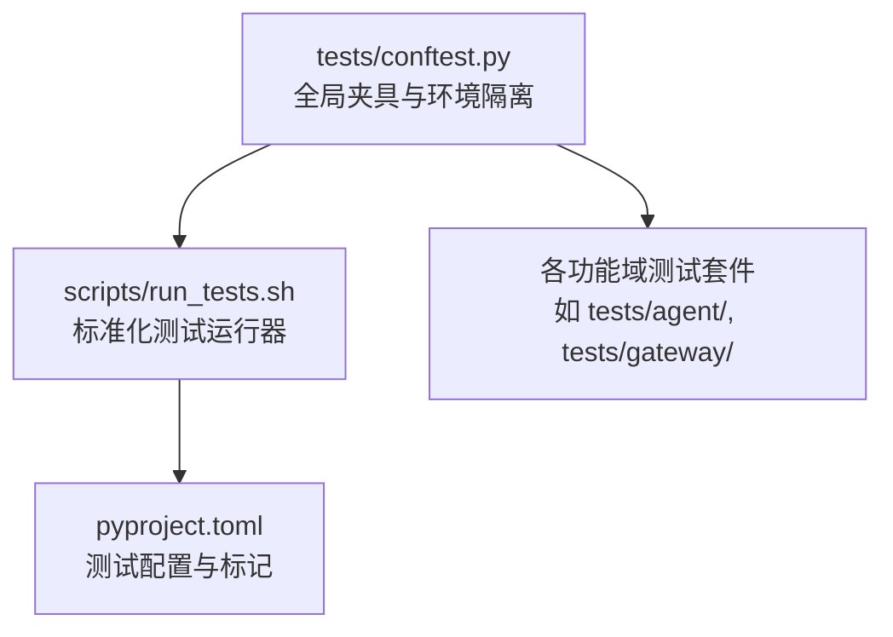
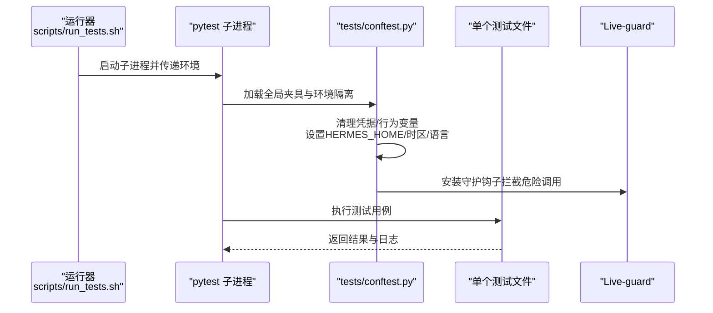
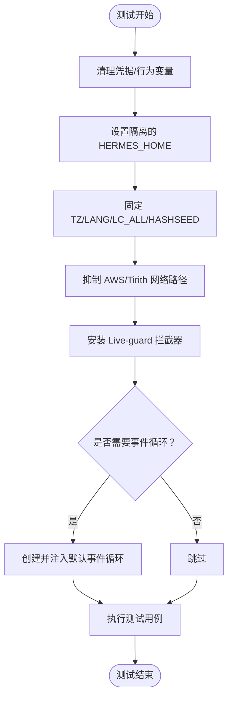
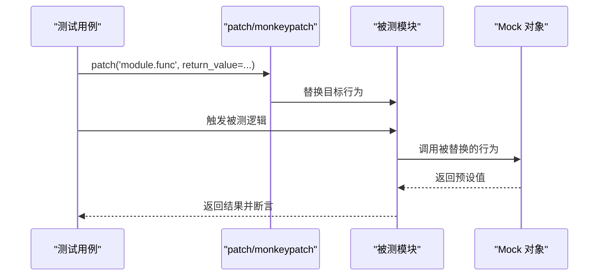
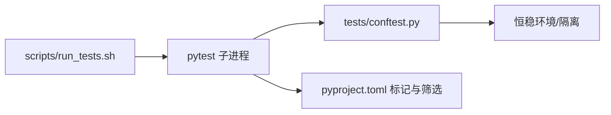

# 测试编写指南

<cite>
**本文档引用的文件**
- [tests/conftest.py](file://tests/conftest.py)
- [scripts/run_tests.sh](file://scripts/run_tests.sh)
- [pyproject.toml](file://pyproject.toml)
- [tests/test_hermes_constants.py](file://tests/test_hermes_constants.py)
- [tests/test_retry_utils.py](file://tests/test_retry_utils.py)
- [tests/agent/test_async_utils.py](file://tests/agent/test_async_utils.py)
- [tests/gateway/test_api_server.py](file://tests/gateway/test_api_server.py)
</cite>

## 目录
1. [简介](#简介)
2. [项目结构](#项目结构)
3. [核心组件](#核心组件)
4. [架构总览](#架构总览)
5. [详细组件分析](#详细组件分析)
6. [依赖分析](#依赖分析)
7. [性能考虑](#性能考虑)
8. [故障排除指南](#故障排除指南)
9. [结论](#结论)
10. [附录](#附录)

## 简介
本指南面向在 hermes-agent 项目中编写高质量测试的开发者，系统阐述测试命名约定、断言策略、测试数据准备、Mock 对象使用（含 unittest.mock、第三方服务模拟与异步函数测试）、测试覆盖率与代码质量标准、不同测试类型的模板与调试技巧，并通过仓库中的真实测试文件路径示例展示正确实现方式。

## 项目结构
测试体系围绕以下关键要素组织：
- 全局夹具与环境隔离：通过 tests/conftest.py 提供跨文件的“恒稳”测试环境，确保凭据变量清空、HERMES_HOME 隔离、确定性时区与语言设置、以及对真实系统调用的防护。
- 标准化运行器：scripts/run_tests.sh 以脚本驱动的方式强制本地与 CI 的一致性，采用每文件子进程隔离策略，避免模块级状态泄漏。
- 测试配置：pyproject.toml 中定义了默认排除集成测试、标记分类等，便于按需筛选测试集。

图表来源
- [tests/conftest.py:1-800](file://tests/conftest.py#L1-L800)
- [scripts/run_tests.sh:1-80](file://scripts/run_tests.sh#L1-L80)
- [pyproject.toml:343-351](file://pyproject.toml#L343-L351)

章节来源
- [tests/conftest.py:1-800](file://tests/conftest.py#L1-L800)
- [scripts/run_tests.sh:1-80](file://scripts/run_tests.sh#L1-L80)
- [pyproject.toml:343-351](file://pyproject.toml#L343-L351)

## 核心组件
- 恒稳环境夹具
  - 清理凭据与行为型环境变量，防止本地密钥泄漏到断言逻辑。
  - 将 HERMES_HOME 重定向到临时目录，避免读写真实用户配置。
  - 固定时区、语言与哈希种子，保证日期/国际化敏感测试可重复。
  - 屏蔽 AWS 元数据服务探测与 Tirith 自动安装等网络路径，减少非功能性干扰。
- Live-system 守护
  - 拦截 os.kill/os.killpg 与 subprocess 调用，阻止对真实进程的信号投递或 systemd 命令修改，避免误伤开发中的 hermes-gateway 进程。
- 异步事件循环保障
  - 在同步测试中为 get_event_loop() 提供默认事件循环，避免部分网关测试因缺少当前循环而失败。
- 通用夹具
  - 提供 tmp_path、mock_config 等常用夹具，简化测试准备。

章节来源
- [tests/conftest.py:327-394](file://tests/conftest.py#L327-L394)
- [tests/conftest.py:538-800](file://tests/conftest.py#L538-L800)
- [tests/conftest.py:452-494](file://tests/conftest.py#L452-L494)
- [tests/conftest.py:421-443](file://tests/conftest.py#L421-L443)

## 架构总览
下图展示了测试运行的关键流程：运行器启动后，通过 conftest 注入恒稳环境；每个测试文件在独立子进程中执行，确保模块级状态不泄漏；测试夹具负责清理与隔离；Live-guard 防护真实系统调用。

图表来源
- [scripts/run_tests.sh:61-80](file://scripts/run_tests.sh#L61-L80)
- [tests/conftest.py:327-394](file://tests/conftest.py#L327-L394)
- [tests/conftest.py:538-800](file://tests/conftest.py#L538-L800)

## 详细组件分析

### 组件A：环境隔离与安全防护
- 环境隔离要点
  - 凭据与行为变量过滤：基于后缀与显式白名单匹配，统一清理。
  - HERMES_HOME 隔离：为每个测试生成临时目录，确保对 ~/.hermes 的访问落到隔离空间。
  - 确定性运行：固定 TZ/LANG/LC_ALL/PYTHONHASHSEED。
  - AWS/Tirith 抑制：禁用元数据探测与自动安装，避免网络与时间开销。
- Live-guard 行为
  - 拦截 os.kill/os.killpg，仅允许测试进程树内的 PID/PGID。
  - 拦截 subprocess.* 与 pty/spawn 等可能影响真实系统的调用。
  - 对 systemctl hermes-gateway 等命令进行整行命令字符串检查，拒绝变更类动作。
- 异步循环保障
  - 若同步测试需要 get_event_loop()，则在必要时创建并注入默认事件循环，避免兼容性问题。

图表来源
- [tests/conftest.py:327-394](file://tests/conftest.py#L327-L394)
- [tests/conftest.py:538-800](file://tests/conftest.py#L538-L800)
- [tests/conftest.py:452-494](file://tests/conftest.py#L452-L494)

章节来源
- [tests/conftest.py:327-394](file://tests/conftest.py#L327-L394)
- [tests/conftest.py:538-800](file://tests/conftest.py#L538-L800)
- [tests/conftest.py:452-494](file://tests/conftest.py#L452-L494)

### 组件B：测试命名约定与断言策略
- 命名约定
  - 类名：以 Test 开头，描述被测功能或行为，如 TestGetDefaultHermesRoot。
  - 方法名：以 test_ 开头，描述具体断言条件，如 test_no_hermes_home_returns_native。
  - 参数化：使用 pytest.mark.parametrize 标记参数化场景，提升覆盖度。
- 断言策略
  - 明确输入输出边界与异常路径，覆盖正常、边界与异常三类场景。
  - 使用 monkeypatch 与 patch 替换外部依赖，确保测试可控且可重复。
  - 对并发/异步场景，使用 asyncio 事件循环与并发工具验证线程安全与一致性。

章节来源
- [tests/test_hermes_constants.py:19-91](file://tests/test_hermes_constants.py#L19-L91)
- [tests/test_hermes_constants.py:93-106](file://tests/test_hermes_constants.py#L93-L106)
- [tests/test_retry_utils.py:9-49](file://tests/test_retry_utils.py#L9-L49)

### 组件C：Mock 对象与第三方服务模拟
- unittest.mock 应用
  - 使用 patch/monkeypatch 替换函数、类或模块行为，如替换 open、os.path.exists、logging.Logger 等。
  - 对异步函数使用 AsyncMock 或 patch 目标模块的协程实现。
- 第三方服务模拟
  - 在网关适配器测试中，通过 patch 工具链（如 aiohttp TestClient/TestServer）构造 HTTP 服务器与客户端，验证端点行为与中间件。
  - 使用 MagicMock 构造请求对象，控制响应头与状态码。
- 异步函数测试
  - 使用 pytest.mark.asyncio 标记异步测试，或在同步测试中手动管理事件循环。
  - 并发测试中使用 asyncio.Event/Barrier 等原语协调任务，验证竞态与共享状态。

图表来源
- [tests/gateway/test_api_server.py:44-51](file://tests/gateway/test_api_server.py#L44-L51)
- [tests/gateway/test_api_server.py:394-432](file://tests/gateway/test_api_server.py#L394-L432)
- [tests/agent/test_async_utils.py:105-128](file://tests/agent/test_async_utils.py#L105-L128)

章节来源
- [tests/gateway/test_api_server.py:44-51](file://tests/gateway/test_api_server.py#L44-L51)
- [tests/gateway/test_api_server.py:394-432](file://tests/gateway/test_api_server.py#L394-L432)
- [tests/agent/test_async_utils.py:105-128](file://tests/agent/test_async_utils.py#L105-L128)

### 组件D：测试数据准备与夹具
- 临时目录与配置
  - 使用 tmp_path/tmp_dir 夹具提供隔离的临时工作目录，避免污染。
  - 使用 mock_config 夹具快速构建最小化配置字典，用于单元测试。
- 文件与权限
  - 在需要文件系统操作的测试中，先创建临时文件与目录，再断言权限与内容。
- 平台差异
  - 针对 Windows/POSIX 的平台差异，使用 monkeypatch 设置 sys.platform 或环境变量，确保跨平台一致性。

章节来源
- [tests/conftest.py:421-443](file://tests/conftest.py#L421-L443)
- [tests/test_hermes_constants.py:22-60](file://tests/test_hermes_constants.py#L22-L60)
- [tests/test_hermes_constants.py:115-158](file://tests/test_hermes_constants.py#L115-L158)

### 组件E：不同测试类型模板

#### 单元测试模板
- 目标：验证单一函数/类方法的行为。
- 步骤：
  - 准备输入与期望输出。
  - 使用 monkeypatch/patch 替换外部依赖。
  - 断言返回值与副作用。
- 示例参考：
  - [tests/test_hermes_constants.py:22-60](file://tests/test_hermes_constants.py#L22-L60)
  - [tests/test_retry_utils.py:9-49](file://tests/test_retry_utils.py#L9-L49)

#### 集成测试模板
- 目标：验证多个组件协作的端到端行为。
- 步骤：
  - 使用 aiohttp TestClient/TestServer 构建最小应用。
  - 注册路由与中间件，构造请求并断言响应。
  - 对认证、CORS、安全头等进行专项断言。
- 示例参考：
  - [tests/gateway/test_api_server.py:474-525](file://tests/gateway/test_api_server.py#L474-L525)
  - [tests/gateway/test_api_server.py:584-647](file://tests/gateway/test_api_server.py#L584-L647)

#### 错误场景测试模板
- 目标：验证异常路径与边界条件。
- 步骤：
  - 构造非法输入或异常环境。
  - 断言抛出预期异常或返回错误响应。
  - 验证日志记录与资源释放。
- 示例参考：
  - [tests/agent/test_async_utils.py:105-128](file://tests/agent/test_async_utils.py#L105-L128)
  - [tests/test_retry_utils.py:57-75](file://tests/test_retry_utils.py#L57-L75)

### 组件F：异步与并发测试
- 异步测试
  - 使用 pytest.mark.asyncio 标记协程测试。
  - 在同步测试中通过 asyncio.new_event_loop()/set_event_loop() 提供事件循环。
- 并发测试
  - 使用 threading.Barrier/asyncio.Event 协调多线程或多任务。
  - 验证共享状态的一致性与竞态条件处理。
- 示例参考：
  - [tests/agent/test_async_utils.py:19-33](file://tests/agent/test_async_utils.py#L19-L33)
  - [tests/test_retry_utils.py:57-75](file://tests/test_retry_utils.py#L57-L75)

章节来源
- [tests/agent/test_async_utils.py:19-33](file://tests/agent/test_async_utils.py#L19-L33)
- [tests/test_retry_utils.py:57-75](file://tests/test_retry_utils.py#L57-L75)

## 依赖分析
- 运行器与夹具耦合
  - scripts/run_tests.sh 通过环境变量与 PYTHONPATH 控制 pytest 子进程，确保与 conftest 的隔离策略一致。
- 测试配置与筛选
  - pyproject.toml 中的 markers 与 addopts 决定默认排除集成测试，便于快速迭代。
- 测试间耦合与内聚
  - 每个测试文件在独立子进程中运行，降低跨文件状态耦合风险；同一文件内的测试应避免共享可变状态。

图表来源
- [scripts/run_tests.sh:61-80](file://scripts/run_tests.sh#L61-L80)
- [pyproject.toml:343-351](file://pyproject.toml#L343-L351)

章节来源
- [scripts/run_tests.sh:61-80](file://scripts/run_tests.sh#L61-L80)
- [pyproject.toml:343-351](file://pyproject.toml#L343-L351)

## 性能考虑
- 每文件子进程隔离：避免模块级缓存与全局状态导致的重复初始化成本。
- 网络与外部依赖抑制：禁用 AWS 元数据与 Tirith 自动安装，显著降低测试耗时。
- 并发与异步：合理使用事件循环与并发原语，避免不必要的等待与阻塞。
- 文件系统与权限：在测试中尽量使用内存或临时文件，减少磁盘 IO。

## 故障排除指南
- Live-guard 报错
  - 症状：os.kill/os.killpg/subprocess.* 调用触发 RuntimeError。
  - 排查：确认测试是否需要真实信号/子进程行为；若确实需要，使用 @pytest.mark.live_system_guard_bypass 标记，但仅限极少数场景。
  - 参考：[tests/conftest.py:538-800](file://tests/conftest.py#L538-L800)
- 事件循环缺失
  - 症状：同步测试中调用 get_event_loop() 抛出异常。
  - 解决：使用 conftest 提供的 _ensure_current_event_loop 夹具，或在测试中显式创建事件循环。
  - 参考：[tests/conftest.py:452-494](file://tests/conftest.py#L452-L494)
- 并发测试不稳定
  - 症状：测试偶发失败，怀疑竞态。
  - 解决：使用 asyncio.Event/Barrier 或 threading.Event 明确同步点；验证线程安全与资源释放。
  - 参考：[tests/test_retry_utils.py:57-75](file://tests/test_retry_utils.py#L57-L75)
- 权限与文件系统
  - 症状：文件权限不符合预期或路径过短导致跳过 chmod。
  - 解决：使用 tmp_path 创建足够深度的路径；对符号链接先解析再断言。
  - 参考：[tests/test_hermes_constants.py:269-354](file://tests/test_hermes_constants.py#L269-L354)

章节来源
- [tests/conftest.py:538-800](file://tests/conftest.py#L538-L800)
- [tests/conftest.py:452-494](file://tests/conftest.py#L452-L494)
- [tests/test_retry_utils.py:57-75](file://tests/test_retry_utils.py#L57-L75)
- [tests/test_hermes_constants.py:269-354](file://tests/test_hermes_constants.py#L269-L354)

## 结论
通过恒稳环境、严格的隔离与防护机制、完善的夹具与 Mock 策略，以及清晰的测试类型模板，hermes-agent 的测试体系能够在保证稳定性的同时高效覆盖关键业务逻辑。建议在编写新测试时遵循本文档的约定与模板，优先使用参数化与夹具，严格区分单元与集成测试，并在必要时启用 Live-guard bypass 标记以满足真实系统交互需求。

## 附录
- 测试运行建议
  - 使用 scripts/run_tests.sh 启动完整测试套件，确保与 CI 行为一致。
  - 需要快速迭代时，可结合 pyproject.toml 的标记与筛选选项，选择性运行特定子集。
- 示例参考清单
  - 环境隔离与安全防护：[tests/conftest.py:327-394](file://tests/conftest.py#L327-L394)、[tests/conftest.py:538-800](file://tests/conftest.py#L538-L800)
  - 单元测试模板：[tests/test_hermes_constants.py:22-60](file://tests/test_hermes_constants.py#L22-L60)、[tests/test_retry_utils.py:9-49](file://tests/test_retry_utils.py#L9-L49)
  - 集成测试模板：[tests/gateway/test_api_server.py:474-525](file://tests/gateway/test_api_server.py#L474-L525)、[tests/gateway/test_api_server.py:584-647](file://tests/gateway/test_api_server.py#L584-L647)
  - 异步与并发测试：[tests/agent/test_async_utils.py:19-33](file://tests/agent/test_async_utils.py#L19-L33)、[tests/test_retry_utils.py:57-75](file://tests/test_retry_utils.py#L57-L75)