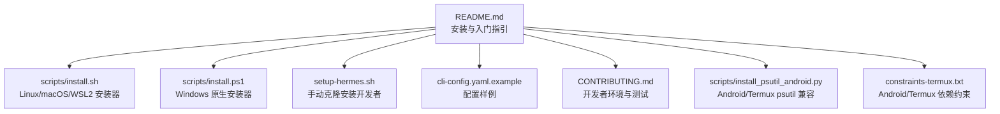
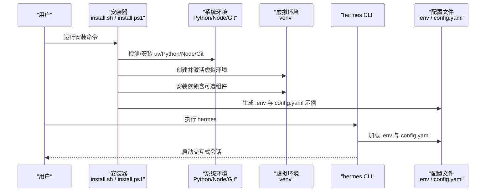
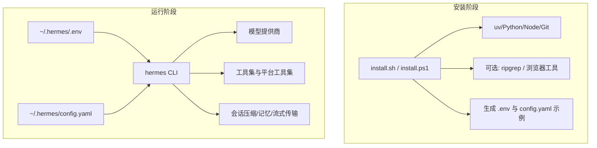

# 快速开始

<cite>
**本文引用的文件**
- [README.md](file://README.md)
- [scripts/install.sh](file://scripts/install.sh)
- [scripts/install.ps1](file://scripts/install.ps1)
- [setup-hermes.sh](file://setup-hermes.sh)
- [cli-config.yaml.example](file://cli-config.yaml.example)
- [CONTRIBUTING.md](file://CONTRIBUTING.md)
- [scripts/install_psutil_android.py](file://scripts/install_psutil_android.py)
- [constraints-termux.txt](file://constraints-termux.txt)
</cite>

## 目录
1. [简介](#简介)
2. [项目结构](#项目结构)
3. [核心组件](#核心组件)
4. [架构总览](#架构总览)
5. [详细组件分析](#详细组件分析)
6. [依赖关系分析](#依赖关系分析)
7. [性能考虑](#性能考虑)
8. [故障排除指南](#故障排除指南)
9. [结论](#结论)
10. [附录](#附录)

## 简介
本指南面向首次接触 Hermes Agent 的用户，提供从安装到首次运行的完整路径，覆盖 Linux、macOS、Windows（原生与 WSL2）、Android/Termux 等多平台。你将了解系统要求、前置依赖、环境配置、首次运行流程、基础配置示例、常用命令与故障排除建议。

## 项目结构
Hermes Agent 提供统一的安装器与配置示例，帮助你在不同平台上快速完成安装与初始化。关键文件与职责概览：
- 安装器：Linux/macOS/WSL2 使用脚本安装；Windows 原生使用 PowerShell 安装；Android/Termux 使用独立路径。
- 配置样例：提供模型、终端后端、工具集、会话压缩、记忆等配置项的参考。
- 开发者引导：包含开发环境搭建、测试运行与项目结构说明，便于进阶使用。

图示来源
- [README.md](file://README.md)
- [scripts/install.sh](file://scripts/install.sh)
- [scripts/install.ps1](file://scripts/install.ps1)
- [setup-hermes.sh](file://setup-hermes.sh)
- [cli-config.yaml.example](file://cli-config.yaml.example)
- [CONTRIBUTING.md](file://CONTRIBUTING.md)
- [scripts/install_psutil_android.py](file://scripts/install_psutil_android.py)
- [constraints-termux.txt](file://constraints-termux.txt)

章节来源
- [README.md](file://README.md)
- [CONTRIBUTING.md](file://CONTRIBUTING.md)

## 核心组件
- 安装器（Linux/macOS/WSL2）
  - 通过单行命令下载并执行安装脚本，自动处理 uv、Python 3.11、Node.js、Git、可选 ripgrep 等依赖，并在完成后输出下一步指令。
- 安装器（Windows 原生）
  - 通过 PowerShell 一键安装，内置 uv、Python 3.11、Git（PortableGit）、Node.js（可选），并为浏览器工具准备 Chromium 或检测系统浏览器。
- 手动安装（开发者）
  - 适用于希望直接克隆仓库进行开发或自定义安装的场景，提供虚拟环境、依赖安装、环境变量与技能同步等步骤。
- 配置样例
  - 提供模型提供商选择、终端后端、工具集、会话压缩、记忆、网关流式传输等配置项的参考与说明。
- Android/Termux 支持
  - 提供针对 Termux 的依赖约束与 psutil 兼容安装脚本，确保在受限环境下稳定安装。

章节来源
- [README.md](file://README.md)
- [scripts/install.sh](file://scripts/install.sh)
- [scripts/install.ps1](file://scripts/install.ps1)
- [setup-hermes.sh](file://setup-hermes.sh)
- [cli-config.yaml.example](file://cli-config.yaml.example)
- [scripts/install_psutil_android.py](file://scripts/install_psutil_android.py)
- [constraints-termux.txt](file://constraints-termux.txt)

## 架构总览
下图展示从安装到首次运行的关键步骤与交互：

图示来源
- [scripts/install.sh](file://scripts/install.sh)
- [scripts/install.ps1](file://scripts/install.ps1)
- [cli-config.yaml.example](file://cli-config.yaml.example)

## 详细组件分析

### 平台安装指南

- Linux、macOS、WSL2
  - 使用单行命令一键安装，安装器会自动处理 uv、Python 3.11、Node.js、Git、可选 ripgrep，并在完成后提示重新加载 shell 与启动 hermes。
  - 参考路径：[README.md](file://README.md)、[scripts/install.sh](file://scripts/install.sh)
- Windows（原生）
  - 使用 PowerShell 一键安装，安装器会自动处理 uv、Python 3.11、Git（PortableGit）、Node.js（可选），并为浏览器工具准备 Chromium 或检测系统浏览器。
  - 参考路径：[README.md](file://README.md)、[scripts/install.ps1](file://scripts/install.ps1)
- Android/Termux
  - 使用独立安装路径，安装器会根据平台特性安装必要的依赖，并通过约束文件与兼容脚本保证稳定性。
  - 参考路径：[README.md](file://README.md)、[constraints-termux.txt](file://constraints-termux.txt)、[scripts/install_psutil_android.py](file://scripts/install_psutil_android.py)

章节来源
- [README.md](file://README.md)
- [scripts/install.sh](file://scripts/install.sh)
- [scripts/install.ps1](file://scripts/install.ps1)
- [constraints-termux.txt](file://constraints-termux.txt)
- [scripts/install_psutil_android.py](file://scripts/install_psutil_android.py)

### 首次运行流程
- Linux/macOS/WSL2
  - 安装完成后，按提示重新加载 shell，然后运行 hermes 启动交互式会话。
  - 参考路径：[README.md](file://README.md)
- Windows（原生）
  - 安装完成后，打开新的终端窗口，运行 hermes 启动交互式会话。
  - 参考路径：[README.md](file://README.md)
- Android/Termux
  - 安装完成后，运行 hermes 启动交互式会话。
  - 参考路径：[README.md](file://README.md)

章节来源
- [README.md](file://README.md)

### 基础配置与常用命令
- 配置文件结构与关键参数
  - 模型与提供商：默认模型、提供商类型、API 密钥、基础 URL、认证模式等。
  - 终端后端：本地、SSH、Docker、Singularity、Modal、Daytona 等后端的配置与资源限制。
  - 工具集与平台工具集：启用/禁用工具集，按平台定制可用能力。
  - 会话压缩与记忆：上下文压缩阈值、近期尾部保留比例、记忆字符限制等。
  - 网关流式传输：消息平台实时流式回传的开关与参数。
  - 参考路径：[cli-config.yaml.example](file://cli-config.yaml.example)
- 常用命令
  - hermes：启动交互式 CLI。
  - hermes model：选择模型与提供商。
  - hermes tools：配置启用的工具集。
  - hermes config set：设置单项配置。
  - hermes gateway：启动消息网关（Telegram、Discord、Slack、WhatsApp、Signal 等）。
  - hermes setup：运行完整设置向导（一次性配置所有内容）。
  - hermes update：更新到最新版本。
  - hermes doctor：诊断问题。
  - 参考路径：[README.md](file://README.md)

章节来源
- [cli-config.yaml.example](file://cli-config.yaml.example)
- [README.md](file://README.md)

### 开发者手动安装（可选）
- 通过手动脚本创建虚拟环境、安装依赖、生成 .env、链接 hermes 命令，并可选择运行设置向导。
- 参考路径：[setup-hermes.sh](file://setup-hermes.sh)

章节来源
- [setup-hermes.sh](file://setup-hermes.sh)

## 依赖关系分析
- 安装器与系统依赖
  - Linux/macOS/WSL2：install.sh 负责检测/安装 uv、Python 3.11、Node.js、Git、可选 ripgrep，并在完成后将 hermes 命令链接至用户可执行目录。
  - Windows：install.ps1 负责检测/安装 uv、Python 3.11、Git（PortableGit）、Node.js（可选），并为浏览器工具准备 Chromium 或检测系统浏览器。
  - Android/Termux：通过 constraints-termux.txt 与 install_psutil_android.py 确保依赖稳定与兼容。
- 配置与运行时
  - hermes CLI 在启动时加载 ~/.hermes/.env 与 ~/.hermes/config.yaml，按配置选择模型提供商、终端后端与工具集，驱动对话循环与工具调用。

图示来源
- [scripts/install.sh](file://scripts/install.sh)
- [scripts/install.ps1](file://scripts/install.ps1)
- [cli-config.yaml.example](file://cli-config.yaml.example)

章节来源
- [scripts/install.sh](file://scripts/install.sh)
- [scripts/install.ps1](file://scripts/install.ps1)
- [cli-config.yaml.example](file://cli-config.yaml.example)

## 性能考虑
- 上下文压缩：当接近模型上下文长度阈值时自动压缩中间轮次，保留最近尾部与开头若干轮次，减少长会话的 token 占用。
- 会话重置策略：支持空闲超时与每日重置，避免无限增长导致成本上升。
- 终端后端：容器化后端（Docker/Singularity/Modal/Daytona）可隔离与复现环境，但需关注资源配额与持久化策略。
- 浏览器工具：Chromium 下载与缓存可能影响首次安装耗时，建议在可控网络环境下进行。

章节来源
- [cli-config.yaml.example](file://cli-config.yaml.example)

## 故障排除指南
- Windows 原生安装
  - 若遇到 TLS 证书信任问题，安装器会给出提示与修复建议（设置 NODE_EXTRA_CA_CERTS 或临时关闭严格校验）。
  - 若 Git 安装失败，可参考安装器提供的手动安装方式。
  - 参考路径：[scripts/install.ps1](file://scripts/install.ps1)
- Linux/macOS/WSL2
  - 若 uv 安装失败，检查网络与权限，按安装器提示手动安装 uv。
  - 若 Python 版本不满足（3.11），安装器会尝试安装或提示手动安装。
  - 参考路径：[scripts/install.sh](file://scripts/install.sh)
- Android/Termux
  - 若 psutil 安装失败，使用安装器提供的兼容脚本进行补丁安装。
  - 参考路径：[scripts/install_psutil_android.py](file://scripts/install_psutil_android.py)、[constraints-termux.txt](file://constraints-termux.txt)
- 通用诊断
  - 使用 hermes doctor 查看环境状态与潜在问题。
  - 参考路径：[README.md](file://README.md)

章节来源
- [scripts/install.ps1](file://scripts/install.ps1)
- [scripts/install.sh](file://scripts/install.sh)
- [scripts/install_psutil_android.py](file://scripts/install_psutil_android.py)
- [constraints-termux.txt](file://constraints-termux.txt)
- [README.md](file://README.md)

## 结论
通过本快速开始指南，你可以在多个主流平台上完成 Hermes Agent 的安装与首次运行，并基于配置样例快速上手常用功能。如需进一步探索，可参考开发者文档与配置参考，逐步深入模型提供商、工具集、网关与安全等主题。

## 附录
- 常用命令速查
  - hermes：启动交互式 CLI
  - hermes model：选择模型与提供商
  - hermes tools：配置工具集
  - hermes config set：设置单项配置
  - hermes gateway：启动消息网关
  - hermes setup：运行设置向导
  - hermes update：更新版本
  - hermes doctor：诊断问题
- 参考路径：[README.md](file://README.md)

章节来源
- [README.md](file://README.md)