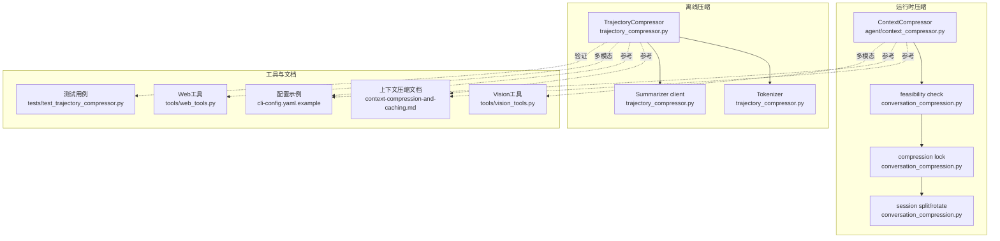
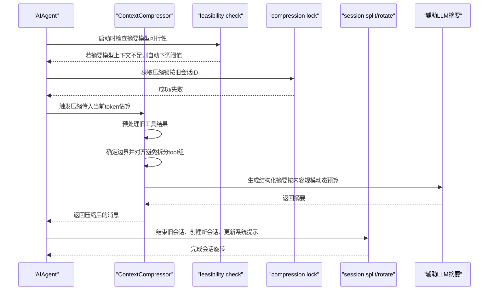
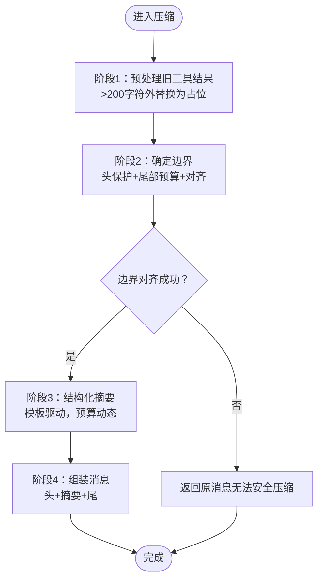
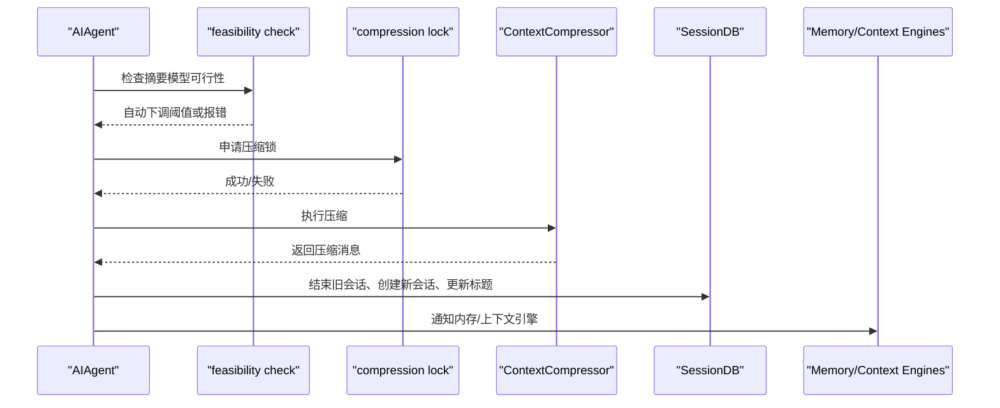
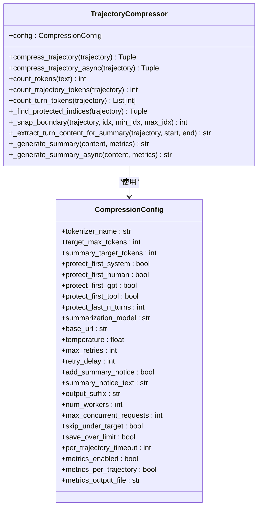
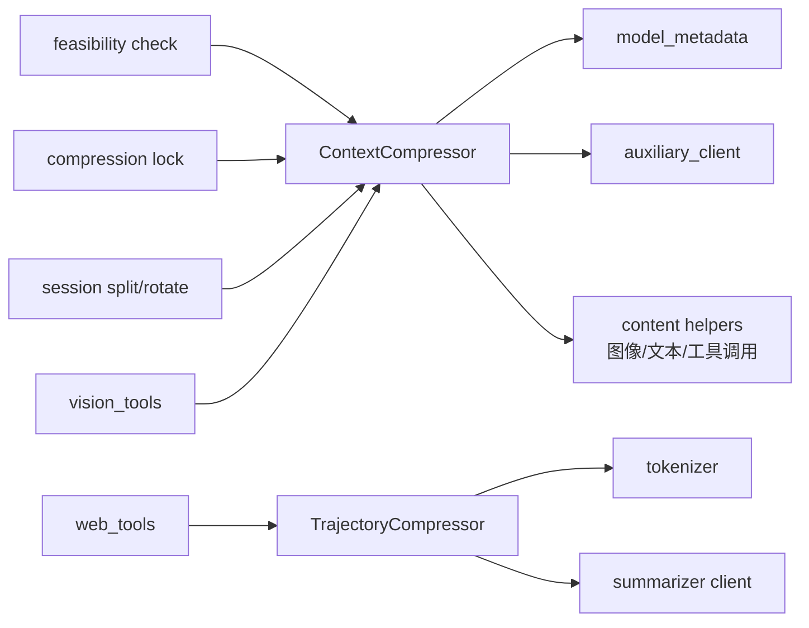

# 上下文压缩优化

<cite>
**本文引用的文件**
- [context_compressor.py](file://agent/context_compressor.py)
- [conversation_compression.py](file://agent/conversation_compression.py)
- [trajectory_compressor.py](file://trajectory_compressor.py)
- [context-compression-and-caching.md](file://website/docs/developer-guide/context-compression-and-caching.md)
- [context-compression-and-caching.md](file://website/i18n/zh-Hans/docusaurus-plugin-content-docs/current/developer-guide/context-compression-and-caching.md)
- [cli-config.yaml.example](file://cli-config.yaml.example)
- [manual_compression_feedback.py](file://agent/manual_compression_feedback.py)
- [vision_tools.py](file://tools/vision_tools.py)
- [web_tools.py](file://tools/web_tools.py)
- [test_trajectory_compressor.py](file://tests/test_trajectory_compressor.py)
</cite>

## 目录
1. [引言](#引言)
2. [项目结构](#项目结构)
3. [核心组件](#核心组件)
4. [架构总览](#架构总览)
5. [详细组件分析](#详细组件分析)
6. [依赖分析](#依赖分析)
7. [性能考虑](#性能考虑)
8. [故障排查指南](#故障排查指南)
9. [结论](#结论)
10. [附录](#附录)

## 引言
本指南聚焦“上下文压缩优化”，系统阐述在长对话、多轮问答、代码生成等复杂场景下，如何通过结构化的摘要生成、内容选择与边界保护、工具结果预处理与修剪、多模态内容优化、迭代摘要更新以及效果评估与监控，实现高性价比的上下文管理。文档以代码为依据，结合官方文档与测试用例，给出可操作的配置建议与调优策略。

## 项目结构
围绕上下文压缩的关键模块与职责如下：
- agent/context_compressor.py：实时压缩器，负责在工具循环内按阈值触发压缩，采用四阶段算法（预处理、边界对齐、结构化摘要、组装），支持迭代摘要更新与媒体裁剪。
- agent/conversation_compression.py：压缩流程编排，负责可行性检查、并发锁、会话分割与旋转、事件回调、图像尺寸收缩等。
- trajectory_compressor.py：离线轨迹压缩器，面向训练数据或日志的批量压缩，提供丰富的统计指标与异步摘要生成能力。
- 官方文档：context-compression-and-caching.md（中英文）详述压缩算法、阈值与预算、摘要模板与预算上限等。
- 配置示例：cli-config.yaml.example 展示 compression 配置键与典型参数。
- 工具与测试：vision_tools.py/web_tools.py 提供多模态与网络内容处理；test_trajectory_compressor.py 验证边界与受保护区域逻辑。

图示来源
- [context_compressor.py:593-770](file://agent/context_compressor.py#L593-L770)
- [conversation_compression.py:74-289](file://agent/conversation_compression.py#L74-L289)
- [trajectory_compressor.py:344-463](file://trajectory_compressor.py#L344-L463)
- [context-compression-and-caching.md:143-218](file://website/docs/developer-guide/context-compression-and-caching.md#L143-L218)
- [cli-config.yaml.example:374-399](file://cli-config.yaml.example#L374-L399)
- [vision_tools.py:1414-1456](file://tools/vision_tools.py#L1414-L1456)
- [web_tools.py:1089-1117](file://tools/web_tools.py#L1089-L1117)
- [test_trajectory_compressor.py:312-345](file://tests/test_trajectory_compressor.py#L312-L345)

章节来源
- [context_compressor.py:593-770](file://agent/context_compressor.py#L593-L770)
- [conversation_compression.py:74-289](file://agent/conversation_compression.py#L74-L289)
- [trajectory_compressor.py:344-463](file://trajectory_compressor.py#L344-L463)
- [context-compression-and-caching.md:143-218](file://website/docs/developer-guide/context-compression-and-caching.md#L143-L218)
- [cli-config.yaml.example:374-399](file://cli-config.yaml.example#L374-L399)
- [vision_tools.py:1414-1456](file://tools/vision_tools.py#L1414-L1456)
- [web_tools.py:1089-1117](file://tools/web_tools.py#L1089-L1117)
- [test_trajectory_compressor.py:312-345](file://tests/test_trajectory_compressor.py#L312-L345)

## 核心组件
- 实时压缩器（ContextCompressor）
  - 四阶段压缩：预处理旧工具结果、确定边界、结构化摘要、组装消息。
  - 边界保护：基于 token 预算的尾部保护，回退至固定保护数量；边界对齐避免拆分 tool_call/tool_result 组。
  - 结构化摘要：使用辅助 LLM 生成结构化模板摘要，预算按内容规模动态调整。
  - 迭代摘要更新：在多次压缩中保留历史摘要，提升连续性与一致性。
  - 多模态处理：图像/视频/网页等非文本内容的裁剪与占位，降低 token 成本。
- 会话压缩编排（conversation_compression.py）
  - 可行性检查：确保摘要模型上下文不小于主模型压缩阈值，必要时自动下调阈值。
  - 并发控制：基于会话 ID 的原子锁，避免并发压缩导致的会话树异常。
  - 会话分割与旋转：压缩后结束旧会话、创建新会话、传播标题与系统提示。
  - 图像尺寸收缩：针对超大图片的二次编码与尺寸缩小，恢复请求成功。
- 离线轨迹压缩器（TrajectoryCompressor）
  - 保护头尾与中间压缩：仅压缩必要的中间轮次，保留首尾关键上下文。
  - 异步摘要生成：支持异步调用摘要模型，提高吞吐。
  - 统计指标：提供 token 前后对比、移除轮次数、成功率、处理时长等聚合指标。

章节来源
- [context_compressor.py:593-770](file://agent/context_compressor.py#L593-L770)
- [conversation_compression.py:281-653](file://agent/conversation_compression.py#L281-L653)
- [trajectory_compressor.py:748-971](file://trajectory_compressor.py#L748-L971)

## 架构总览
上下文压缩在运行时与离线两种模式协同工作：
- 运行时压缩：在工具循环中根据阈值估算触发压缩，使用结构化摘要与边界保护，保证连续性与稳定性。
- 离线压缩：对已完成的轨迹进行批量压缩，用于训练数据清洗与复盘分析，提供更全面的统计与可视化。

图示来源
- [conversation_compression.py:74-289](file://agent/conversation_compression.py#L74-L289)
- [conversation_compression.py:281-653](file://agent/conversation_compression.py#L281-L653)
- [context_compressor.py:593-770](file://agent/context_compressor.py#L593-L770)

## 详细组件分析

### 实时压缩器（ContextCompressor）算法与边界保护
- 四阶段算法
  - 预处理旧工具结果：对外层保护尾部之外的旧工具结果（>200字符）替换为统一占位，显著节省 token。
  - 确定边界：保护前缀（系统提示词+首次交互）与尾部（基于 token 预算，不足时回退到固定保护数量），中间区域用于摘要。
  - 结构化摘要：使用辅助 LLM，按模板生成“目标、约束、进度、决策、文件、下一步、关键上下文”等结构化摘要。
  - 组装消息：头部（可选追加说明）、摘要（角色选择避免连续相同）、尾部（原样保留）。
- 边界对齐与保护
  - 使用对齐函数避免拆分 tool_call/tool_result 组，确保工具调用与结果的完整性。
  - 对齐后若压缩区间塌缩，则判定无法安全压缩，直接返回原消息。
- 多模态处理
  - 图像/截图：将图像块替换为占位文本，避免重复传输大体积 base64 数据。
  - 视频/网页：通过工具层的配置与温度、最大输出等参数控制，减少无效 token 占用。

图示来源
- [context_compressor.py:593-770](file://agent/context_compressor.py#L593-L770)
- [context-compression-and-caching.md:143-218](file://website/docs/developer-guide/context-compression-and-caching.md#L143-L218)

章节来源
- [context_compressor.py:593-770](file://agent/context_compressor.py#L593-L770)
- [context-compression-and-caching.md:143-218](file://website/docs/developer-guide/context-compression-and-caching.md#L143-L218)

### 会话压缩编排（feasibility check、并发锁、会话分割）
- 可行性检查
  - 若摘要模型上下文小于主模型压缩阈值，自动下调阈值以保证压缩可用；若低于最低阈值则拒绝启动。
- 并发控制
  - 基于会话 ID 的原子锁，避免父子代理同时压缩同一会话导致的孤儿子会话问题。
- 会话分割与旋转
  - 压缩完成后结束旧会话、创建新会话、传播标题、更新系统提示，并通知外部内存与上下文引擎。
- 图像尺寸收缩
  - 针对超大图片（如 Anthropic 5MB 限制）进行二次编码与尺寸缩小，恢复请求成功。

图示来源
- [conversation_compression.py:74-289](file://agent/conversation_compression.py#L74-L289)
- [conversation_compression.py:281-653](file://agent/conversation_compression.py#L281-L653)

章节来源
- [conversation_compression.py:74-289](file://agent/conversation_compression.py#L74-L289)
- [conversation_compression.py:281-653](file://agent/conversation_compression.py#L281-L653)

### 离线轨迹压缩器（TrajectoryCompressor）
- 压缩策略
  - 保护首尾：系统、人类、首次助手与首次工具消息；尾部最后 N 轮。
  - 中间压缩：仅压缩必要的中间轮次，按需累计直到满足目标 token 预算。
  - 摘要生成：同步/异步两种摘要生成路径，支持重试与降级。
- 统计指标
  - 提供每条轨迹与全局聚合指标：原始/压缩 token、节省 token、压缩比、移除轮次数、摘要 API 调用次数与错误数、处理时长等。
- 测试验证
  - 测试覆盖受保护索引查找、边界对齐、压缩区间塌缩等关键路径。

图示来源
- [trajectory_compressor.py:82-180](file://trajectory_compressor.py#L82-L180)
- [trajectory_compressor.py:344-463](file://trajectory_compressor.py#L344-L463)
- [trajectory_compressor.py:748-971](file://trajectory_compressor.py#L748-L971)

章节来源
- [trajectory_compressor.py:82-180](file://trajectory_compressor.py#L82-L180)
- [trajectory_compressor.py:344-463](file://trajectory_compressor.py#L344-L463)
- [trajectory_compressor.py:748-971](file://trajectory_compressor.py#L748-L971)
- [test_trajectory_compressor.py:312-345](file://tests/test_trajectory_compressor.py#L312-L345)

### 多模态内容压缩处理
- 图像/截图
  - 在压缩前将图像块替换为占位文本，避免重复传输 base64 数据；仅保留最新用户消息中的图像作为锚点，之前的消息图像全部替换。
- 视频
  - 通过工具层配置温度、最大输出与超时，控制摘要质量与成本；当视频过大时，建议先进行压缩再提交。
- 网页内容
  - 对网页结果进行预处理与压缩，避免过短内容触发不必要的摘要；支持并行处理多个结果。

章节来源
- [context_compressor.py:414-468](file://agent/context_compressor.py#L414-L468)
- [vision_tools.py:1414-1456](file://tools/vision_tools.py#L1414-L1456)
- [web_tools.py:1089-1117](file://tools/web_tools.py#L1089-L1117)

### 迭代摘要更新机制
- 连续性保障
  - 在多次压缩中保留上一次摘要，作为后续迭代的输入，避免信息断裂。
- 前缀清理
  - 对历史摘要前缀进行规范化与清理，防止旧指令残留影响后续回复。
- 会话边界
  - 会话旋转后，新的系统提示会明确区分“摘要背景信息”与“最新用户消息”的优先级，确保模型不会误读摘要为当前任务。

章节来源
- [context_compressor.py:601-602](file://agent/context_compressor.py#L601-L602)
- [conversation_compression.py:567-596](file://agent/conversation_compression.py#L567-L596)

## 依赖分析
- 组件耦合
  - ContextCompressor 依赖模型元数据与辅助客户端，用于上下文长度估计与摘要调用。
  - conversation_compression.py 作为编排层，串联可行性检查、并发锁、会话分割与外部引擎通知。
  - TrajectoryCompressor 独立于运行时环境，依赖本地分词器与摘要客户端，适合批量处理。
- 外部依赖
  - 分词器（HuggingFace）用于 token 计数；摘要客户端（OpenRouter/自定义）用于结构化摘要生成。
  - 视觉与网络工具用于多模态内容的预处理与修剪。

图示来源
- [context_compressor.py:28-34](file://agent/context_compressor.py#L28-L34)
- [conversation_compression.py:74-289](file://agent/conversation_compression.py#L74-L289)
- [trajectory_compressor.py:362-418](file://trajectory_compressor.py#L362-L418)
- [vision_tools.py:1414-1456](file://tools/vision_tools.py#L1414-L1456)
- [web_tools.py:1089-1117](file://tools/web_tools.py#L1089-L1117)

章节来源
- [context_compressor.py:28-34](file://agent/context_compressor.py#L28-L34)
- [conversation_compression.py:74-289](file://agent/conversation_compression.py#L74-L289)
- [trajectory_compressor.py:362-418](file://trajectory_compressor.py#L362-L418)

## 性能考虑
- 预处理成本低：旧工具结果的占位替换无需 LLM 调用，显著降低 token 开销。
- 动态摘要预算：摘要输出按压缩内容规模动态调整，兼顾质量与成本。
- 异步摘要：TrajectoryCompressor 支持异步摘要生成，提升吞吐。
- 并发控制：压缩锁避免重复压缩与孤儿会话，减少资源浪费。
- 多模态裁剪：图像/视频/网页的占位与修剪有效降低 token 成本，尤其在长对话中收益明显。

## 故障排查指南
- 摘要模型上下文不足
  - 现象：摘要调用返回上下文长度错误，压缩器记录警告并返回 None，随后在无摘要情况下丢弃中间轮次。
  - 处理：提升摘要模型上下文或降低阈值；可行性检查会在启动时自动下调阈值。
- 并发压缩冲突
  - 现象：多个路径同时压缩同一会话，出现孤儿子会话或无限等待。
  - 处理：启用压缩锁；若锁子系统缺失，会记录警告并继续执行（风险自担）。
- 图像过大导致失败
  - 现象：提供方拒绝超过大小限制的图片。
  - 处理：使用图像尺寸收缩工具，按字节与像素维度双重限制进行二次编码与缩小。
- 压缩失败但不中断
  - 现象：摘要生成失败时插入静态占位并继续，或在强制模式下完全中止。
  - 处理：查看压缩器内部错误标记与降级策略，必要时手动触发 /compress 或 /new。

章节来源
- [context_compressor.py:180-187](file://agent/context_compressor.py#L180-L187)
- [conversation_compression.py:314-426](file://agent/conversation_compression.py#L314-L426)
- [conversation_compression.py:656-703](file://agent/conversation_compression.py#L656-L703)

## 结论
通过“预处理-边界保护-结构化摘要-组装”的四阶段算法，结合迭代摘要更新、多模态裁剪与严格的边界对齐，上下文压缩在保持信息连续性的同时实现了显著的空间节省。配合离线轨迹压缩器的统计指标与可视化，可对压缩效果进行全面评估与持续优化。在实际部署中，应根据模型上下文、任务类型与资源约束，合理配置阈值、目标比例与尾部保护数量，并关注多模态内容的预处理策略与监控指标。

## 附录

### 配置与调优要点
- 关键参数
  - threshold：触发压缩的上下文百分比（默认 0.50）
  - target_ratio：阈值中保留为尾部的预算比例（默认 0.20）
  - protect_last_n：尾部最少保留消息数（默认 20）
  - protect_first_n：头部最少保留消息数（硬编码，系统提示词+首次交互）
- 建议
  - 长对话：适当提高 protect_last_n，降低 target_ratio 以保留更多近期上下文。
  - 代码生成：提高摘要预算比例，确保关键文件与错误信息完整保留。
  - 多模态密集：启用图像/视频占位与修剪，控制摘要温度与最大输出，平衡质量与成本。

章节来源
- [cli-config.yaml.example:374-399](file://cli-config.yaml.example#L374-L399)
- [context-compression-and-caching.md:78-95](file://website/docs/developer-guide/context-compression-and-caching.md#L78-L95)

### 压缩效果评估与监控
- 运行时指标（TrajectoryCompressor）
  - 原始/压缩 token、节省 token、压缩比、移除轮次数、摘要 API 调用次数与错误数、处理时长。
- 用户反馈（manual_compression_feedback）
  - 手动压缩前后消息数与 token 估算变化，以及可能的“消息减少但估算上升”的说明。
- 文档参考
  - 官方文档对阈值与预算的推导与限制有明确说明，便于理解触发条件与上限。

章节来源
- [trajectory_compressor.py:182-225](file://trajectory_compressor.py#L182-L225)
- [trajectory_compressor.py:280-330](file://trajectory_compressor.py#L280-L330)
- [manual_compression_feedback.py:8-50](file://agent/manual_compression_feedback.py#L8-L50)
- [context-compression-and-caching.md:131-140](file://website/docs/developer-guide/context-compression-and-caching.md#L131-L140)